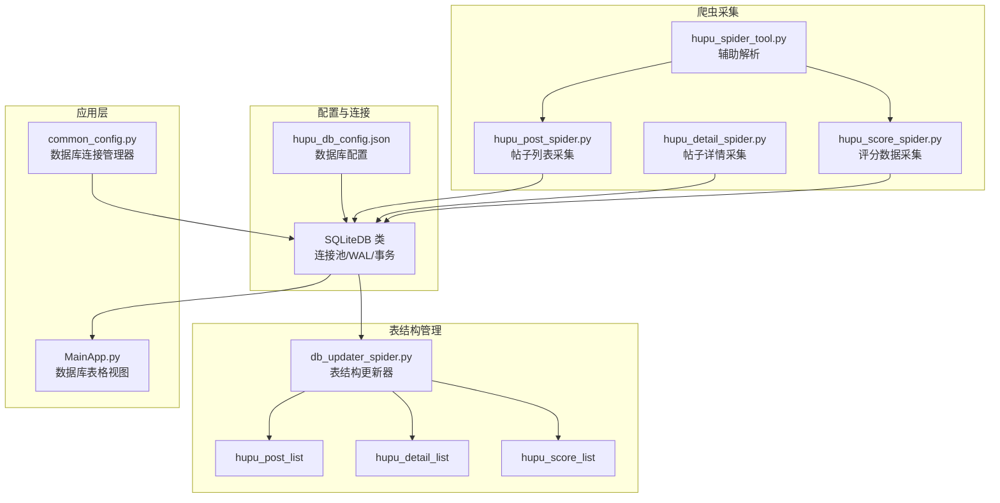
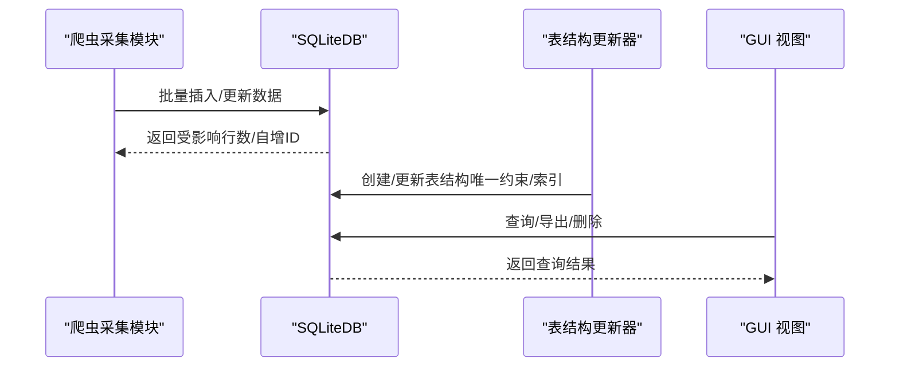
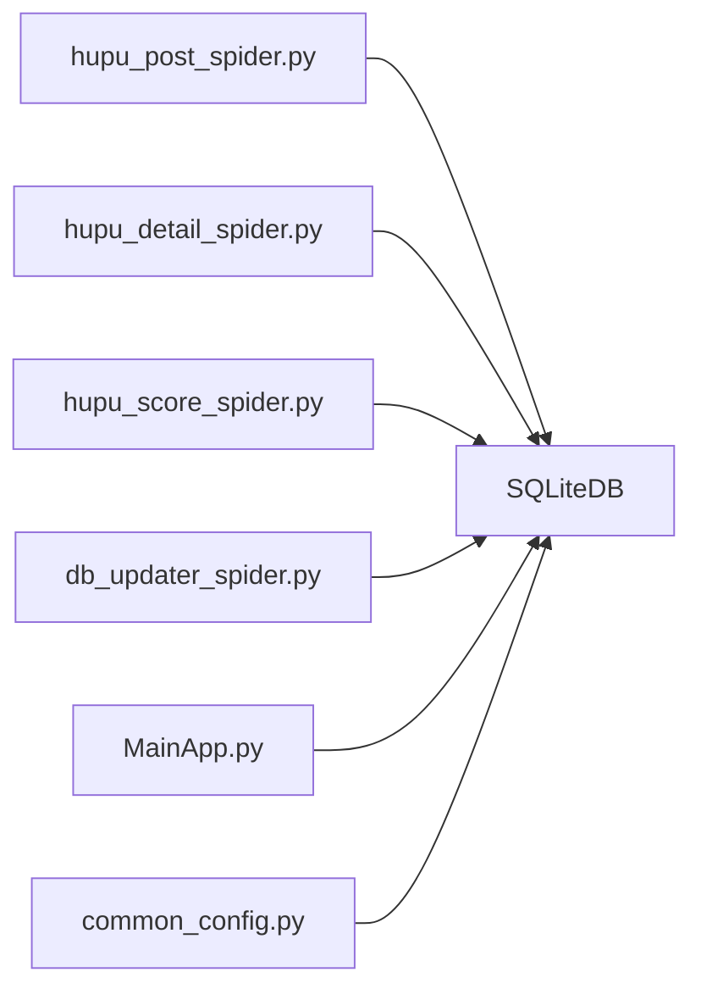

# 虎扑数据库表结构

<cite>
**本文引用的文件**
- [hupu_db_config.json](file://配置文件_系统配置/hupu_db_config.json)
- [db_updater_spider.py](file://utils/db_updater_spider.py)
- [classSQLite.py](file://modules/classSQLite.py)
- [hupu_post_spider.py](file://spider_modules/hupu_spiders/hupu_post_spider.py)
- [hupu_detail_spider.py](file://spider_modules/hupu_spiders/hupu_detail_spider.py)
- [hupu_score_spider.py](file://spider_modules/hupu_spiders/hupu_score_spider.py)
- [hupu_spider_tool.py](file://spider_modules/hupu_spiders/hupu_spider_tool.py)
- [common_config.py](file://config/common_config.py)
- [MainApp.py](file://gui/MainApp.py)
</cite>

## 目录
1. [简介](#简介)
2. [项目结构](#项目结构)
3. [核心组件](#核心组件)
4. [架构总览](#架构总览)
5. [详细组件分析](#详细组件分析)
6. [依赖分析](#依赖分析)
7. [性能考虑](#性能考虑)
8. [故障排查指南](#故障排查指南)
9. [结论](#结论)
10. [附录](#附录)

## 简介
本文件面向虎扑爬虫系统的数据库层，系统性梳理 hupu_post_list（帖子列表）、hupu_detail_list（帖子详情）、hupu_score_list（评分数据）三张核心表的字段设计、数据模型与存储策略；解释基于 SQLite 的表结构演进机制、唯一约束与索引策略；给出 ETL 流程与数据清洗规则；说明表间关联关系与一致性保障；提供增量更新与去重策略；并给出备份与归档建议及常见查询示例与性能优化建议。

## 项目结构
虎扑数据库位于 hupu.db，采用 SQLite + 连接池 + WAL 模式的高性能存储方案。数据库配置通过 hupu_db_config.json 管理，表结构通过统一的表结构更新器进行创建与演进，爬虫模块负责采集并写入数据，GUI 层提供可视化浏览与导出能力。

图表来源
- [hupu_db_config.json:1-18](file://配置文件_系统配置/hupu_db_config.json#L1-L18)
- [classSQLite.py:359-432](file://modules/classSQLite.py#L359-L432)
- [db_updater_spider.py:12-149](file://utils/db_updater_spider.py#L12-L149)
- [hupu_post_spider.py:44-178](file://spider_modules/hupu_spiders/hupu_post_spider.py#L44-L178)
- [hupu_detail_spider.py:59-225](file://spider_modules/hupu_spiders/hupu_detail_spider.py#L59-L225)
- [hupu_score_spider.py:35-127](file://spider_modules/hupu_spiders/hupu_score_spider.py#L35-L127)
- [MainApp.py:800-921](file://gui/MainApp.py#L800-L921)
- [common_config.py:16-44](file://config/common_config.py#L16-L44)

章节来源
- [hupu_db_config.json:1-18](file://配置文件_系统配置/hupu_db_config.json#L1-L18)
- [classSQLite.py:359-432](file://modules/classSQLite.py#L359-L432)
- [db_updater_spider.py:152-241](file://utils/db_updater_spider.py#L152-L241)
- [MainApp.py:800-921](file://gui/MainApp.py#L800-L921)

## 核心组件
- 数据库配置与连接
  - hupu_db_config.json：定义数据库路径、超时、WAL、缓存、同步级别、连接池参数等。
  - SQLiteDB：封装连接池、事务、批量插入、查询构建器、WAL 检查点等。
- 表结构更新器
  - db_updater_spider.py：提供通用 update_table_structure 函数，支持创建表、新增字段、重建表（删列风险提示）、确保唯一约束与索引存在。
- 爬虫采集模块
  - hupu_post_spider.py：关键词搜索分页抓取，解析标题、分区、发帖时间、回复数、推荐数、亮评数、帖子链接。
  - hupu_detail_spider.py：按帖子 ID 分页抓取详情，解析楼主与评论，提取楼层、点赞、回复数、IP、时间等。
  - hupu_score_spider.py：按评分 ID 抓取评分评论，解析用户名、时间、地点、评论、回复评论、点赞、评分、评分标题、评分链接。
  - hupu_spider_tool.py：辅助获取帖子标题与评分标题。
- GUI 视图
  - MainApp.py：为三张表提供列展示、别名、宽度、上下文菜单（导出/删除）。

章节来源
- [hupu_db_config.json:1-18](file://配置文件_系统配置/hupu_db_config.json#L1-L18)
- [classSQLite.py:359-432](file://modules/classSQLite.py#L359-L432)
- [db_updater_spider.py:12-149](file://utils/db_updater_spider.py#L12-L149)
- [hupu_post_spider.py:19-42](file://spider_modules/hupu_spiders/hupu_post_spider.py#L19-L42)
- [hupu_detail_spider.py:13-57](file://spider_modules/hupu_spiders/hupu_detail_spider.py#L13-L57)
- [hupu_score_spider.py:13-32](file://spider_modules/hupu_spiders/hupu_score_spider.py#L13-L32)
- [MainApp.py:800-921](file://gui/MainApp.py#L800-L921)

## 架构总览
虎扑爬虫数据库采用“配置驱动 + 通用表结构更新器 + 爬虫采集 + GUI 视图”的分层架构。数据流从爬虫采集到 SQLite，经唯一约束与索引保障一致性，最终供 GUI 查看与导出。

图表来源
- [db_updater_spider.py:12-149](file://utils/db_updater_spider.py#L12-L149)
- [classSQLite.py:532-614](file://modules/classSQLite.py#L532-L614)
- [MainApp.py:800-921](file://gui/MainApp.py#L800-L921)

## 详细组件分析

### hupu_post_list 帖子列表表
- 字段设计与含义
  - id：自增主键
  - huputitle：帖子标题
  - hupu_zone：虎扑分区
  - posturl：帖子链接（唯一约束）
  - replies：回复数
  - tuijian_count：推荐数
  - fatietime：发帖时间
  - addtime：入库时间（默认当前时间）
  - liangping_count：亮评数
  - task_id：任务标识
- 唯一约束
  - UNIQUE (posturl ASC)：避免重复入库同一帖子链接
- 索引设计
  - 建议对高频查询字段建立索引（如 hupu_zone、fatietime、addtime、task_id），可在表结构更新器中扩展 indexes 参数
- 数据类型与长度
  - TEXT：标题、分区、时间、URL、计数字段
  - DATETIME：addtime，默认 CURRENT_TIMESTAMP
- 数据清洗规则
  - URL 去空白、标准化
  - 数值字段清洗为纯数字字符串，便于后续统计
  - 时间字段清洗为标准格式
- 增量更新与去重
  - 基于 posturl 唯一约束，使用 ON CONFLICT 或先查询后插入策略
- ETL 流程
  - 采集：关键词搜索 + 分页解析
  - 清洗：字段标准化、数值清洗、URL 规范化
  - 去重：按 posturl 去重
  - 写入：批量插入，必要时使用 ON CONFLICT
- 关联关系与一致性
  - 与 hupu_detail_list 通过 posturl 建立事实-维度关系（详情表为多条记录，列表表为一条记录）
  - 通过 task_id 串联任务批次，便于审计与回溯

章节来源
- [db_updater_spider.py:265-290](file://utils/db_updater_spider.py#L265-L290)
- [hupu_post_spider.py:19-42](file://spider_modules/hupu_spiders/hupu_post_spider.py#L19-L42)

### hupu_detail_list 帖子详情表
- 字段设计与含义
  - id：自增主键
  - fabucontent：发布内容（楼主）
  - nickname：昵称
  - replycontent：回复内容
  - floor：楼层（如“楼主”、“1F”等）
  - ipaddress：IP 地址
  - posttitle：帖子标题
  - like_count：点赞数
  - posturl：帖子链接（唯一约束）
  - replytime：回复时间
  - addtime：入库时间（默认当前时间）
  - reply_count：回复数
  - task_id：任务标识
- 唯一约束
  - UNIQUE (posturl ASC, floor ASC)：避免重复入库同一楼层
- 索引设计
  - 建议对 posturl、floor、task_id 建立复合索引，提升按帖子聚合与按楼层检索效率
- 数据类型与长度
  - TEXT：内容、楼层、时间、URL、计数字段
  - DATETIME：addtime，默认 CURRENT_TIMESTAMP
- 数据清洗规则
  - 楼层字段清洗为纯数字或“楼主”
  - IP 地址去除多余前缀
  - 时间字段标准化
- 增量更新与去重
  - 基于 (posturl, floor) 唯一约束，使用 ON CONFLICT 或先查询后插入策略
- ETL 流程
  - 采集：按帖子 ID 分页抓取详情
  - 清洗：楼层、IP、时间、内容换行处理
  - 去重：按 (posturl, floor) 去重
  - 写入：批量插入
- 关联关系与一致性
  - 与 hupu_post_list 通过 posturl 关联
  - 通过 task_id 串联任务批次

章节来源
- [db_updater_spider.py:323-351](file://utils/db_updater_spider.py#L323-L351)
- [hupu_detail_spider.py:13-57](file://spider_modules/hupu_spiders/hupu_detail_spider.py#L13-L57)

### hupu_score_list 评分数据表
- 字段设计与含义
  - id：自增主键
  - name：用户名
  - time：时间
  - location：位置
  - comment：评论
  - reply_comment：回复评论
  - like_count：点赞数
  - score：评分（数值字段）
  - score_title：评分标题
  - addtime：入库时间
  - scoreurl：评分链接（唯一约束）
  - task_id：任务标识
- 唯一约束
  - UNIQUE (scoreurl ASC, name ASC, time ASC)：避免重复入库同一评分记录
- 索引设计
  - 建议对 scoreurl、task_id、addtime 建立索引，提升评分聚合与时间范围查询效率
- 数据类型与长度
  - TEXT：用户名、时间、位置、评论、评分标题、URL
  - DATETIME：addtime
- 数据清洗规则
  - 评分字段归一化（如除以 2 的整数）
  - URL 规范化
  - 时间字段标准化
- 增量更新与去重
  - 基于 (scoreurl, name, time) 唯一约束，使用 ON CONFLICT 或先查询后插入策略
- ETL 流程
  - 采集：按评分 ID + 游标分页抓取
  - 清洗：评分归一化、标题解析、URL 规范化
  - 去重：按 (scoreurl, name, time) 去重
  - 写入：批量插入
- 关联关系与一致性
  - 与 hupu_post_list 无直接外键关联，但可通过 score_title 与业务语义间接关联
  - 通过 task_id 串联任务批次

章节来源
- [db_updater_spider.py:293-320](file://utils/db_updater_spider.py#L293-L320)
- [hupu_score_spider.py:13-32](file://spider_modules/hupu_spiders/hupu_score_spider.py#L13-L32)

### 表结构更新器与表演进
- 通用更新函数 update_table_structure
  - 支持创建表、新增字段、重建表（删列风险提示）、确保唯一约束与索引存在
  - 对比目标字段与现有结构，自动处理新增字段与删列风险
- 初始化流程 initialize_hupu_database
  - 首次运行创建三张表并设置唯一约束
  - 后续运行检查并更新表结构，避免字段缺失
- 连接池与 WAL
  - SQLiteDB 使用连接池与 WAL 模式，提高并发写入与读写性能
  - 提供安全关闭与 WAL 检查点，确保数据文件一致性

章节来源
- [db_updater_spider.py:12-149](file://utils/db_updater_spider.py#L12-L149)
- [db_updater_spider.py:152-241](file://utils/db_updater_spider.py#L152-L241)
- [classSQLite.py:294-330](file://modules/classSQLite.py#L294-L330)
- [classSQLite.py:359-432](file://modules/classSQLite.py#L359-L432)

### 爬虫数据采集与写入流程
- 帖子列表采集
  - 关键词搜索 + 分页解析，提取标题、分区、时间、回复数、推荐数、亮评数、URL
  - 通过唯一约束避免重复入库
- 帖子详情采集
  - 楼主与评论分页抓取，解析楼层、IP、时间、点赞、回复数、内容
  - 通过 (posturl, floor) 唯一约束避免重复入库
- 评分数据采集
  - 评分评论分页抓取，解析用户名、时间、地点、评论、点赞、评分、标题、URL
  - 通过 (scoreurl, name, time) 唯一约束避免重复入库
- 写入策略
  - 批量插入（insert_many），减少事务提交次数
  - ON CONFLICT 策略：按唯一约束进行去重或更新

章节来源
- [hupu_post_spider.py:44-178](file://spider_modules/hupu_spiders/hupu_post_spider.py#L44-L178)
- [hupu_detail_spider.py:59-225](file://spider_modules/hupu_spiders/hupu_detail_spider.py#L59-L225)
- [hupu_score_spider.py:35-127](file://spider_modules/hupu_spiders/hupu_score_spider.py#L35-L127)
- [classSQLite.py:568-614](file://modules/classSQLite.py#L568-L614)

### GUI 视图与数据导出
- GUI 提供三张表的可视化浏览，支持列别名、列宽、导出与删除操作
- 便于人工核查与审计，结合 task_id 进行任务级数据筛选

章节来源
- [MainApp.py:800-921](file://gui/MainApp.py#L800-L921)

## 依赖分析
- 组件耦合
  - 爬虫模块依赖 SQLiteDB 进行写入
  - 表结构更新器依赖 SQLiteDB 执行 DDL/DML
  - GUI 依赖 SQLiteDB 进行查询与导出
  - common_config 提供数据库连接管理器，按表名路由到 hupu_db
- 外部依赖
  - requests、BeautifulSoup、loguru、aiosqlite、chardet 等
- 潜在循环依赖
  - 通过延迟导入与集中管理避免循环

图表来源
- [hupu_post_spider.py:1-12](file://spider_modules/hupu_spiders/hupu_post_spider.py#L1-L12)
- [hupu_detail_spider.py:1-12](file://spider_modules/hupu_spiders/hupu_detail_spider.py#L1-L12)
- [hupu_score_spider.py:1-12](file://spider_modules/hupu_spiders/hupu_score_spider.py#L1-L12)
- [db_updater_spider.py:1-10](file://utils/db_updater_spider.py#L1-L10)
- [MainApp.py:800-921](file://gui/MainApp.py#L800-L921)
- [common_config.py:16-44](file://config/common_config.py#L16-L44)

章节来源
- [common_config.py:16-44](file://config/common_config.py#L16-L44)
- [classSQLite.py:359-432](file://modules/classSQLite.py#L359-L432)

## 性能考虑
- 连接池与并发
  - SQLiteDB 使用连接池，最大连接数可达 9999，适合高并发写入场景
  - 建议根据硬件与 IO 能力调整 max_connections
- WAL 模式
  - WAL 模式显著提升并发读写性能，配合检查点机制保证数据落盘
- 批量写入
  - insert_many 批量插入，减少事务提交次数，提高吞吐
- 索引策略
  - 为高频查询字段（如 posturl、floor、scoreurl、task_id、addtime）建立索引
  - 复合索引：(posturl, floor)、(scoreurl, name, time)、(posturl, task_id)
- 查询优化
  - 使用 QueryBuilder 构建 SQL，避免手写 SQL 的错误
  - 合理使用 LIMIT/OFFSET 进行分页
- 数据类型与长度
  - TEXT 类型适合长文本，但注意磁盘占用；可考虑对固定长度字段使用更紧凑类型（如 INTEGER）
- 缓存与同步
  - cache_size 与 synchronous 参数已在配置中设置，可根据场景微调

章节来源
- [hupu_db_config.json:6-16](file://配置文件_系统配置/hupu_db_config.json#L6-L16)
- [classSQLite.py:359-432](file://modules/classSQLite.py#L359-L432)
- [classSQLite.py:568-614](file://modules/classSQLite.py#L568-L614)

## 故障排查指南
- 数据库初始化失败
  - 检查 hupu_db_config.json 路径与权限
  - 确认 initialize_hupu_database 是否正确执行
- 表结构更新失败
  - 若出现删列风险，需确认是否允许自动重建表
  - 检查唯一约束与索引 SQL 是否正确
- 写入异常
  - 检查 SQLiteDB 的连接池状态与 WAL 检查点
  - 确认批量插入参数与数据类型匹配
- 查询异常
  - 使用 QueryBuilder 构建 SQL，避免注入与语法错误
  - 检查 where 条件与参数绑定
- GUI 导出失败
  - 确认数据库已关闭或释放锁，避免文件占用

章节来源
- [db_updater_spider.py:12-149](file://utils/db_updater_spider.py#L12-L149)
- [classSQLite.py:1371-1496](file://modules/classSQLite.py#L1371-L1496)
- [MainApp.py:800-921](file://gui/MainApp.py#L800-L921)

## 结论
虎扑爬虫数据库采用 SQLite + 连接池 + WAL 的高性能架构，通过统一的表结构更新器实现表结构的稳健演进。三张核心表围绕唯一约束与索引设计，确保数据一致性与查询效率。爬虫模块提供完整的采集、清洗、去重与写入流程，GUI 提供便捷的浏览与导出能力。建议进一步完善索引策略与监控告警，持续优化批量写入与查询性能。

## 附录

### 字段与索引设计要点
- hupu_post_list
  - 唯一约束：posturl
  - 建议索引：hupu_zone、fatietime、addtime、task_id
- hupu_detail_list
  - 唯一约束：(posturl, floor)
  - 建议索引：posturl、floor、task_id
- hupu_score_list
  - 唯一约束：(scoreurl, name, time)
  - 建议索引：scoreurl、task_id、addtime

章节来源
- [db_updater_spider.py:265-290](file://utils/db_updater_spider.py#L265-L290)
- [db_updater_spider.py:323-351](file://utils/db_updater_spider.py#L323-L351)
- [db_updater_spider.py:293-320](file://utils/db_updater_spider.py#L293-L320)

### ETL 流程与数据清洗规则
- 采集阶段
  - 关键词搜索、帖子详情、评分评论分别对应不同接口与解析逻辑
- 清洗阶段
  - URL 规范化、楼层标准化、时间标准化、数值字段清洗
- 去重阶段
  - 基于唯一约束进行去重或更新
- 写入阶段
  - 批量插入，必要时使用 ON CONFLICT

章节来源
- [hupu_post_spider.py:44-178](file://spider_modules/hupu_spiders/hupu_post_spider.py#L44-L178)
- [hupu_detail_spider.py:59-225](file://spider_modules/hupu_spiders/hupu_detail_spider.py#L59-L225)
- [hupu_score_spider.py:35-127](file://spider_modules/hupu_spiders/hupu_score_spider.py#L35-L127)

### 增量更新与去重策略
- 唯一约束驱动的去重
  - 帖子列表：posturl
  - 帖子详情：(posturl, floor)
  - 评分数据：(scoreurl, name, time)
- ON CONFLICT 策略
  - 可选择忽略重复或更新特定字段（需在写入层扩展）

章节来源
- [db_updater_spider.py:12-149](file://utils/db_updater_spider.py#L12-L149)

### 数据备份与归档策略
- WAL 检查点
  - 在关闭数据库前执行 WAL 检查点，合并 WAL 文件，确保数据文件一致性
- 通用关闭流程
  - 关闭主连接、异步连接、线程池，确保无文件占用
- 归档建议
  - 定期导出关键表数据（CSV/Excel），并进行压缩归档
  - 使用 WAL 检查点后复制数据库文件进行物理备份

章节来源
- [classSQLite.py:1448-1496](file://modules/classSQLite.py#L1448-L1496)
- [common_config.py:59-134](file://config/common_config.py#L59-L134)

### 数据分析查询示例与性能优化建议
- 查询示例（示意）
  - 按分区统计帖子数：SELECT hupu_zone, COUNT(*) FROM hupu_post_list GROUP BY hupu_zone
  - 按时间范围统计详情条数：SELECT DATE(addtime) AS day, COUNT(*) FROM hupu_detail_list WHERE addtime BETWEEN ? AND ? GROUP BY day ORDER BY day
  - 评分平均分与评论数：SELECT AVG(CAST(score AS REAL)) AS avg_score, COUNT(*) FROM hupu_score_list WHERE scoreurl = ?
- 性能优化
  - 为高频查询字段建立索引
  - 使用 LIMIT/OFFSET 进行分页
  - 批量写入与 WAL 检查点结合
  - 合理设置 cache_size 与 synchronous

章节来源
- [classSQLite.py:697-753](file://modules/classSQLite.py#L697-L753)
- [hupu_db_config.json:6-16](file://配置文件_系统配置/hupu_db_config.json#L6-L16)