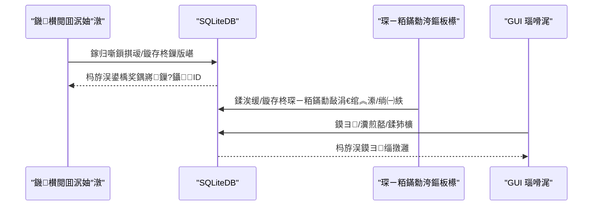
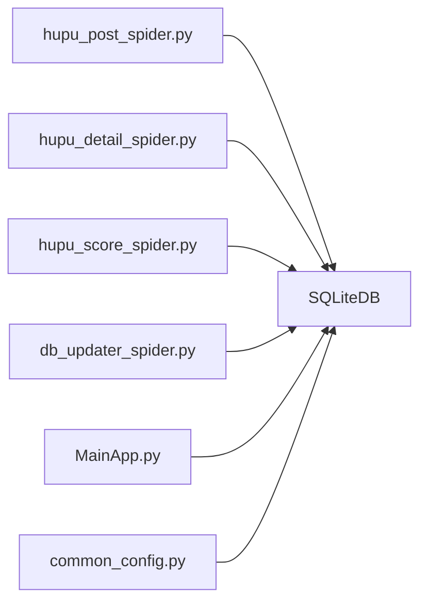

# 铏庢墤鏁版嵁搴撹〃缁撴瀯

<cite>
**鏈枃寮曠敤鐨勬枃浠?*
- [hupu_db_config.json](file://閰嶇疆鏂囦欢_绯荤粺閰嶇疆/hupu_db_config.json)
- [db_updater_spider.py](file://utils/db_updater_spider.py)
- [classSQLite.py](file://modules/classSQLite.py)
- [hupu_post_spider.py](file://spider_modules/hupu_spiders/hupu_post_spider.py)
- [hupu_detail_spider.py](file://spider_modules/hupu_spiders/hupu_detail_spider.py)
- [hupu_score_spider.py](file://spider_modules/hupu_spiders/hupu_score_spider.py)
- [hupu_spider_tool.py](file://spider_modules/hupu_spiders/hupu_spider_tool.py)
- [common_config.py](file://config/common_config.py)
- [MainApp.py](file://gui/MainApp.py)
</cite>

## 鐩綍
1. [绠€浠媇(#绠€浠?
2. [椤圭洰缁撴瀯](#椤圭洰缁撴瀯)
3. [鏍稿績缁勪欢](#鏍稿績缁勪欢)
4. [鏋舵瀯鎬昏](#鏋舵瀯鎬昏)
5. [璇︾粏缁勪欢鍒嗘瀽](#璇︾粏缁勪欢鍒嗘瀽)
6. [渚濊禆鍒嗘瀽](#渚濊禆鍒嗘瀽)
7. [鎬ц兘鑰冭檻](#鎬ц兘鑰冭檻)
8. [鏁呴殰鎺掓煡鎸囧崡](#鏁呴殰鎺掓煡鎸囧崡)
9. [缁撹](#缁撹)
10. [闄勫綍](#闄勫綍)

## 绠€浠?鏈枃浠堕潰鍚戣檸鎵戠埇铏郴缁熺殑鏁版嵁搴撳眰锛岀郴缁熸€ф⒊鐞?hupu_post_list锛堝笘瀛愬垪琛級銆乭upu_detail_list锛堝笘瀛愯鎯咃級銆乭upu_score_list锛堣瘎鍒嗘暟鎹級涓夊紶鏍稿績琛ㄧ殑瀛楁璁捐銆佹暟鎹ā鍨嬩笌瀛樺偍绛栫暐锛涜В閲婂熀浜?SQLite 鐨勮〃缁撴瀯婕旇繘鏈哄埗銆佸敮涓€绾︽潫涓庣储寮曠瓥鐣ワ紱缁欏嚭 ETL 娴佺▼涓庢暟鎹竻娲楄鍒欙紱璇存槑琛ㄩ棿鍏宠仈鍏崇郴涓庝竴鑷存€т繚闅滐紱鎻愪緵澧為噺鏇存柊涓庡幓閲嶇瓥鐣ワ紱骞剁粰鍑哄浠戒笌褰掓。寤鸿鍙婂父瑙佹煡璇㈢ず渚嬩笌鎬ц兘浼樺寲寤鸿銆?
## 椤圭洰缁撴瀯
铏庢墤鏁版嵁搴撲綅浜?hupu.db锛岄噰鐢?SQLite + 杩炴帴姹?+ WAL 妯″紡鐨勯珮鎬ц兘瀛樺偍鏂规銆傛暟鎹簱閰嶇疆閫氳繃 hupu_db_config.json 绠＄悊锛岃〃缁撴瀯閫氳繃缁熶竴鐨勮〃缁撴瀯鏇存柊鍣ㄨ繘琛屽垱寤轰笌婕旇繘锛岀埇铏ā鍧楄礋璐ｉ噰闆嗗苟鍐欏叆鏁版嵁锛孏UI 灞傛彁渚涘彲瑙嗗寲娴忚涓庡鍑鸿兘鍔涖€?
```mermaid
graph TB
subgraph "閰嶇疆涓庤繛鎺?
CFG["hupu_db_config.json<br/>鏁版嵁搴撻厤缃?]
SQLITE["SQLiteDB 绫?br/>杩炴帴姹?WAL/浜嬪姟"]
end
subgraph "鐖櫕閲囬泦"
POSTSP["hupu_post_spider.py<br/>甯栧瓙鍒楄〃閲囬泦"]
DETAILSP["hupu_detail_spider.py<br/>甯栧瓙璇︽儏閲囬泦"]
SCORESP["hupu_score_spider.py<br/>璇勫垎鏁版嵁閲囬泦"]
TOOL["hupu_spider_tool.py<br/>杈呭姪瑙ｆ瀽"]
end
subgraph "琛ㄧ粨鏋勭鐞?
UPD["db_updater_spider.py<br/>琛ㄧ粨鏋勬洿鏂板櫒"]
POSTTBL["hupu_post_list"]
DETAILTBL["hupu_detail_list"]
SCORETBL["hupu_score_list"]
end
subgraph "搴旂敤灞?
GUI["MainApp.py<br/>鏁版嵁搴撹〃鏍艰鍥?]
CMN["common_config.py<br/>鏁版嵁搴撹繛鎺ョ鐞嗗櫒"]
end
CFG --> SQLITE
SQLITE --> UPD
POSTSP --> SQLITE
DETAILSP --> SQLITE
SCORESP --> SQLITE
TOOL --> POSTSP
TOOL --> SCORESP
UPD --> POSTTBL
UPD --> DETAILTBL
UPD --> SCORETBL
SQLITE --> GUI
CMN --> SQLITE
```

鍥捐〃鏉ユ簮
- [hupu_db_config.json:1-18](file://閰嶇疆鏂囦欢_绯荤粺閰嶇疆/hupu_db_config.json#L1-L18)
- [classSQLite.py:359-432](file://modules/classSQLite.py#L359-L432)
- [db_updater_spider.py:12-149](file://utils/db_updater_spider.py#L12-L149)
- [hupu_post_spider.py:44-178](file://spider_modules/hupu_spiders/hupu_post_spider.py#L44-L178)
- [hupu_detail_spider.py:59-225](file://spider_modules/hupu_spiders/hupu_detail_spider.py#L59-L225)
- [hupu_score_spider.py:35-127](file://spider_modules/hupu_spiders/hupu_score_spider.py#L35-L127)
- [MainApp.py:800-921](file://gui/MainApp.py#L800-L921)
- [common_config.py:16-44](file://config/common_config.py#L16-L44)

绔犺妭鏉ユ簮
- [hupu_db_config.json:1-18](file://閰嶇疆鏂囦欢_绯荤粺閰嶇疆/hupu_db_config.json#L1-L18)
- [classSQLite.py:359-432](file://modules/classSQLite.py#L359-L432)
- [db_updater_spider.py:152-241](file://utils/db_updater_spider.py#L152-L241)
- [MainApp.py:800-921](file://gui/MainApp.py#L800-L921)

## 鏍稿績缁勪欢
- 鏁版嵁搴撻厤缃笌杩炴帴
  - hupu_db_config.json锛氬畾涔夋暟鎹簱璺緞銆佽秴鏃躲€乄AL銆佺紦瀛樸€佸悓姝ョ骇鍒€佽繛鎺ユ睜鍙傛暟绛夈€?  - SQLiteDB锛氬皝瑁呰繛鎺ユ睜銆佷簨鍔°€佹壒閲忔彃鍏ャ€佹煡璇㈡瀯寤哄櫒銆乄AL 妫€鏌ョ偣绛夈€?- 琛ㄧ粨鏋勬洿鏂板櫒
  - db_updater_spider.py锛氭彁渚涢€氱敤 update_table_structure 鍑芥暟锛屾敮鎸佸垱寤鸿〃銆佹柊澧炲瓧娈点€侀噸寤鸿〃锛堝垹鍒楅闄╂彁绀猴級銆佺‘淇濆敮涓€绾︽潫涓庣储寮曞瓨鍦ㄣ€?- 鐖櫕閲囬泦妯″潡
  - hupu_post_spider.py锛氬叧閿瘝鎼滅储鍒嗛〉鎶撳彇锛岃В鏋愭爣棰樸€佸垎鍖恒€佸彂甯栨椂闂淬€佸洖澶嶆暟銆佹帹鑽愭暟銆佷寒璇勬暟銆佸笘瀛愰摼鎺ャ€?  - hupu_detail_spider.py锛氭寜甯栧瓙 ID 鍒嗛〉鎶撳彇璇︽儏锛岃В鏋愭ゼ涓讳笌璇勮锛屾彁鍙栨ゼ灞傘€佺偣璧炪€佸洖澶嶆暟銆両P銆佹椂闂寸瓑銆?  - hupu_score_spider.py锛氭寜璇勫垎 ID 鎶撳彇璇勫垎璇勮锛岃В鏋愮敤鎴峰悕銆佹椂闂淬€佸湴鐐广€佽瘎璁恒€佸洖澶嶈瘎璁恒€佺偣璧炪€佽瘎鍒嗐€佽瘎鍒嗘爣棰樸€佽瘎鍒嗛摼鎺ャ€?  - hupu_spider_tool.py锛氳緟鍔╄幏鍙栧笘瀛愭爣棰樹笌璇勫垎鏍囬銆?- GUI 瑙嗗浘
  - MainApp.py锛氫负涓夊紶琛ㄦ彁渚涘垪灞曠ず銆佸埆鍚嶃€佸搴︺€佷笂涓嬫枃鑿滃崟锛堝鍑?鍒犻櫎锛夈€?
绔犺妭鏉ユ簮
- [hupu_db_config.json:1-18](file://閰嶇疆鏂囦欢_绯荤粺閰嶇疆/hupu_db_config.json#L1-L18)
- [classSQLite.py:359-432](file://modules/classSQLite.py#L359-L432)
- [db_updater_spider.py:12-149](file://utils/db_updater_spider.py#L12-L149)
- [hupu_post_spider.py:19-42](file://spider_modules/hupu_spiders/hupu_post_spider.py#L19-L42)
- [hupu_detail_spider.py:13-57](file://spider_modules/hupu_spiders/hupu_detail_spider.py#L13-L57)
- [hupu_score_spider.py:13-32](file://spider_modules/hupu_spiders/hupu_score_spider.py#L13-L32)
- [MainApp.py:800-921](file://gui/MainApp.py#L800-L921)

## 鏋舵瀯鎬昏
铏庢墤鐖櫕鏁版嵁搴撻噰鐢ㄢ€滈厤缃┍鍔?+ 閫氱敤琛ㄧ粨鏋勬洿鏂板櫒 + 鐖櫕閲囬泦 + GUI 瑙嗗浘鈥濈殑鍒嗗眰鏋舵瀯銆傛暟鎹祦浠庣埇铏噰闆嗗埌 SQLite锛岀粡鍞竴绾︽潫涓庣储寮曚繚闅滀竴鑷存€э紝鏈€缁堜緵 GUI 鏌ョ湅涓庡鍑恒€?


鍥捐〃鏉ユ簮
- [db_updater_spider.py:12-149](file://utils/db_updater_spider.py#L12-L149)
- [classSQLite.py:532-614](file://modules/classSQLite.py#L532-L614)
- [MainApp.py:800-921](file://gui/MainApp.py#L800-L921)

## 璇︾粏缁勪欢鍒嗘瀽

### hupu_post_list 甯栧瓙鍒楄〃琛?- 瀛楁璁捐涓庡惈涔?  - id锛氳嚜澧炰富閿?  - huputitle锛氬笘瀛愭爣棰?  - hupu_zone锛氳檸鎵戝垎鍖?  - posturl锛氬笘瀛愰摼鎺ワ紙鍞竴绾︽潫锛?  - replies锛氬洖澶嶆暟
  - tuijian_count锛氭帹鑽愭暟
  - fatietime锛氬彂甯栨椂闂?  - addtime锛氬叆搴撴椂闂达紙榛樿褰撳墠鏃堕棿锛?  - liangping_count锛氫寒璇勬暟
  - task_id锛氫换鍔℃爣璇?- 鍞竴绾︽潫
  - UNIQUE (posturl ASC)锛氶伩鍏嶉噸澶嶅叆搴撳悓涓€甯栧瓙閾炬帴
- 绱㈠紩璁捐
  - 寤鸿瀵归珮棰戞煡璇㈠瓧娈靛缓绔嬬储寮曪紙濡?hupu_zone銆乫atietime銆乤ddtime銆乼ask_id锛夛紝鍙湪琛ㄧ粨鏋勬洿鏂板櫒涓墿灞?indexes 鍙傛暟
- 鏁版嵁绫诲瀷涓庨暱搴?  - TEXT锛氭爣棰樸€佸垎鍖恒€佹椂闂淬€乁RL銆佽鏁板瓧娈?  - DATETIME锛歛ddtime锛岄粯璁?CURRENT_TIMESTAMP
- 鏁版嵁娓呮礂瑙勫垯
  - URL 鍘荤┖鐧姐€佹爣鍑嗗寲
  - 鏁板€煎瓧娈垫竻娲椾负绾暟瀛楀瓧绗︿覆锛屼究浜庡悗缁粺璁?  - 鏃堕棿瀛楁娓呮礂涓烘爣鍑嗘牸寮?- 澧為噺鏇存柊涓庡幓閲?  - 鍩轰簬 posturl 鍞竴绾︽潫锛屼娇鐢?ON CONFLICT 鎴栧厛鏌ヨ鍚庢彃鍏ョ瓥鐣?- ETL 娴佺▼
  - 閲囬泦锛氬叧閿瘝鎼滅储 + 鍒嗛〉瑙ｆ瀽
  - 娓呮礂锛氬瓧娈垫爣鍑嗗寲銆佹暟鍊兼竻娲椼€乁RL 瑙勮寖鍖?  - 鍘婚噸锛氭寜 posturl 鍘婚噸
  - 鍐欏叆锛氭壒閲忔彃鍏ワ紝蹇呰鏃朵娇鐢?ON CONFLICT
- 鍏宠仈鍏崇郴涓庝竴鑷存€?  - 涓?hupu_detail_list 閫氳繃 posturl 寤虹珛浜嬪疄-缁村害鍏崇郴锛堣鎯呰〃涓哄鏉¤褰曪紝鍒楄〃琛ㄤ负涓€鏉¤褰曪級
  - 閫氳繃 task_id 涓茶仈浠诲姟鎵规锛屼究浜庡璁′笌鍥炴函

绔犺妭鏉ユ簮
- [db_updater_spider.py:265-290](file://utils/db_updater_spider.py#L265-L290)
- [hupu_post_spider.py:19-42](file://spider_modules/hupu_spiders/hupu_post_spider.py#L19-L42)

### hupu_detail_list 甯栧瓙璇︽儏琛?- 瀛楁璁捐涓庡惈涔?  - id锛氳嚜澧炰富閿?  - fabucontent锛氬彂甯冨唴瀹癸紙妤间富锛?  - nickname锛氭樀绉?  - replycontent锛氬洖澶嶅唴瀹?  - floor锛氭ゼ灞傦紙濡傗€滄ゼ涓烩€濄€佲€?F鈥濈瓑锛?  - ipaddress锛欼P 鍦板潃
  - posttitle锛氬笘瀛愭爣棰?  - like_count锛氱偣璧炴暟
  - posturl锛氬笘瀛愰摼鎺ワ紙鍞竴绾︽潫锛?  - replytime锛氬洖澶嶆椂闂?  - addtime锛氬叆搴撴椂闂达紙榛樿褰撳墠鏃堕棿锛?  - reply_count锛氬洖澶嶆暟
  - task_id锛氫换鍔℃爣璇?- 鍞竴绾︽潫
  - UNIQUE (posturl ASC, floor ASC)锛氶伩鍏嶉噸澶嶅叆搴撳悓涓€妤煎眰
- 绱㈠紩璁捐
  - 寤鸿瀵?posturl銆乫loor銆乼ask_id 寤虹珛澶嶅悎绱㈠紩锛屾彁鍗囨寜甯栧瓙鑱氬悎涓庢寜妤煎眰妫€绱㈡晥鐜?- 鏁版嵁绫诲瀷涓庨暱搴?  - TEXT锛氬唴瀹广€佹ゼ灞傘€佹椂闂淬€乁RL銆佽鏁板瓧娈?  - DATETIME锛歛ddtime锛岄粯璁?CURRENT_TIMESTAMP
- 鏁版嵁娓呮礂瑙勫垯
  - 妤煎眰瀛楁娓呮礂涓虹函鏁板瓧鎴栤€滄ゼ涓烩€?  - IP 鍦板潃鍘婚櫎澶氫綑鍓嶇紑
  - 鏃堕棿瀛楁鏍囧噯鍖?- 澧為噺鏇存柊涓庡幓閲?  - 鍩轰簬 (posturl, floor) 鍞竴绾︽潫锛屼娇鐢?ON CONFLICT 鎴栧厛鏌ヨ鍚庢彃鍏ョ瓥鐣?- ETL 娴佺▼
  - 閲囬泦锛氭寜甯栧瓙 ID 鍒嗛〉鎶撳彇璇︽儏
  - 娓呮礂锛氭ゼ灞傘€両P銆佹椂闂淬€佸唴瀹规崲琛屽鐞?  - 鍘婚噸锛氭寜 (posturl, floor) 鍘婚噸
  - 鍐欏叆锛氭壒閲忔彃鍏?- 鍏宠仈鍏崇郴涓庝竴鑷存€?  - 涓?hupu_post_list 閫氳繃 posturl 鍏宠仈
  - 閫氳繃 task_id 涓茶仈浠诲姟鎵规

绔犺妭鏉ユ簮
- [db_updater_spider.py:323-351](file://utils/db_updater_spider.py#L323-L351)
- [hupu_detail_spider.py:13-57](file://spider_modules/hupu_spiders/hupu_detail_spider.py#L13-L57)

### hupu_score_list 璇勫垎鏁版嵁琛?- 瀛楁璁捐涓庡惈涔?  - id锛氳嚜澧炰富閿?  - name锛氱敤鎴峰悕
  - time锛氭椂闂?  - location锛氫綅缃?  - comment锛氳瘎璁?  - reply_comment锛氬洖澶嶈瘎璁?  - like_count锛氱偣璧炴暟
  - score锛氳瘎鍒嗭紙鏁板€煎瓧娈碉級
  - score_title锛氳瘎鍒嗘爣棰?  - addtime锛氬叆搴撴椂闂?  - scoreurl锛氳瘎鍒嗛摼鎺ワ紙鍞竴绾︽潫锛?  - task_id锛氫换鍔℃爣璇?- 鍞竴绾︽潫
  - UNIQUE (scoreurl ASC, name ASC, time ASC)锛氶伩鍏嶉噸澶嶅叆搴撳悓涓€璇勫垎璁板綍
- 绱㈠紩璁捐
  - 寤鸿瀵?scoreurl銆乼ask_id銆乤ddtime 寤虹珛绱㈠紩锛屾彁鍗囪瘎鍒嗚仛鍚堜笌鏃堕棿鑼冨洿鏌ヨ鏁堢巼
- 鏁版嵁绫诲瀷涓庨暱搴?  - TEXT锛氱敤鎴峰悕銆佹椂闂淬€佷綅缃€佽瘎璁恒€佽瘎鍒嗘爣棰樸€乁RL
  - DATETIME锛歛ddtime
- 鏁版嵁娓呮礂瑙勫垯
  - 璇勫垎瀛楁褰掍竴鍖栵紙濡傞櫎浠?2 鐨勬暣鏁帮級
  - URL 瑙勮寖鍖?  - 鏃堕棿瀛楁鏍囧噯鍖?- 澧為噺鏇存柊涓庡幓閲?  - 鍩轰簬 (scoreurl, name, time) 鍞竴绾︽潫锛屼娇鐢?ON CONFLICT 鎴栧厛鏌ヨ鍚庢彃鍏ョ瓥鐣?- ETL 娴佺▼
  - 閲囬泦锛氭寜璇勫垎 ID + 娓告爣鍒嗛〉鎶撳彇
  - 娓呮礂锛氳瘎鍒嗗綊涓€鍖栥€佹爣棰樿В鏋愩€乁RL 瑙勮寖鍖?  - 鍘婚噸锛氭寜 (scoreurl, name, time) 鍘婚噸
  - 鍐欏叆锛氭壒閲忔彃鍏?- 鍏宠仈鍏崇郴涓庝竴鑷存€?  - 涓?hupu_post_list 鏃犵洿鎺ュ閿叧鑱旓紝浣嗗彲閫氳繃 score_title 涓庝笟鍔¤涔夐棿鎺ュ叧鑱?  - 閫氳繃 task_id 涓茶仈浠诲姟鎵规

绔犺妭鏉ユ簮
- [db_updater_spider.py:293-320](file://utils/db_updater_spider.py#L293-L320)
- [hupu_score_spider.py:13-32](file://spider_modules/hupu_spiders/hupu_score_spider.py#L13-L32)

### 琛ㄧ粨鏋勬洿鏂板櫒涓庤〃婕旇繘
- 閫氱敤鏇存柊鍑芥暟 update_table_structure
  - 鏀寔鍒涘缓琛ㄣ€佹柊澧炲瓧娈点€侀噸寤鸿〃锛堝垹鍒楅闄╂彁绀猴級銆佺‘淇濆敮涓€绾︽潫涓庣储寮曞瓨鍦?  - 瀵规瘮鐩爣瀛楁涓庣幇鏈夌粨鏋勶紝鑷姩澶勭悊鏂板瀛楁涓庡垹鍒楅闄?- 鍒濆鍖栨祦绋?initialize_hupu_database
  - 棣栨杩愯鍒涘缓涓夊紶琛ㄥ苟璁剧疆鍞竴绾︽潫
  - 鍚庣画杩愯妫€鏌ュ苟鏇存柊琛ㄧ粨鏋勶紝閬垮厤瀛楁缂哄け
- 杩炴帴姹犱笌 WAL
  - SQLiteDB 浣跨敤杩炴帴姹犱笌 WAL 妯″紡锛屾彁楂樺苟鍙戝啓鍏ヤ笌璇诲啓鎬ц兘
  - 鎻愪緵瀹夊叏鍏抽棴涓?WAL 妫€鏌ョ偣锛岀‘淇濇暟鎹枃浠朵竴鑷存€?
绔犺妭鏉ユ簮
- [db_updater_spider.py:12-149](file://utils/db_updater_spider.py#L12-L149)
- [db_updater_spider.py:152-241](file://utils/db_updater_spider.py#L152-L241)
- [classSQLite.py:294-330](file://modules/classSQLite.py#L294-L330)
- [classSQLite.py:359-432](file://modules/classSQLite.py#L359-L432)

### 鐖櫕鏁版嵁閲囬泦涓庡啓鍏ユ祦绋?- 甯栧瓙鍒楄〃閲囬泦
  - 鍏抽敭璇嶆悳绱?+ 鍒嗛〉瑙ｆ瀽锛屾彁鍙栨爣棰樸€佸垎鍖恒€佹椂闂淬€佸洖澶嶆暟銆佹帹鑽愭暟銆佷寒璇勬暟銆乁RL
  - 閫氳繃鍞竴绾︽潫閬垮厤閲嶅鍏ュ簱
- 甯栧瓙璇︽儏閲囬泦
  - 妤间富涓庤瘎璁哄垎椤垫姄鍙栵紝瑙ｆ瀽妤煎眰銆両P銆佹椂闂淬€佺偣璧炪€佸洖澶嶆暟銆佸唴瀹?  - 閫氳繃 (posturl, floor) 鍞竴绾︽潫閬垮厤閲嶅鍏ュ簱
- 璇勫垎鏁版嵁閲囬泦
  - 璇勫垎璇勮鍒嗛〉鎶撳彇锛岃В鏋愮敤鎴峰悕銆佹椂闂淬€佸湴鐐广€佽瘎璁恒€佺偣璧炪€佽瘎鍒嗐€佹爣棰樸€乁RL
  - 閫氳繃 (scoreurl, name, time) 鍞竴绾︽潫閬垮厤閲嶅鍏ュ簱
- 鍐欏叆绛栫暐
  - 鎵归噺鎻掑叆锛坕nsert_many锛夛紝鍑忓皯浜嬪姟鎻愪氦娆℃暟
  - ON CONFLICT 绛栫暐锛氭寜鍞竴绾︽潫杩涜鍘婚噸鎴栨洿鏂?
绔犺妭鏉ユ簮
- [hupu_post_spider.py:44-178](file://spider_modules/hupu_spiders/hupu_post_spider.py#L44-L178)
- [hupu_detail_spider.py:59-225](file://spider_modules/hupu_spiders/hupu_detail_spider.py#L59-L225)
- [hupu_score_spider.py:35-127](file://spider_modules/hupu_spiders/hupu_score_spider.py#L35-L127)
- [classSQLite.py:568-614](file://modules/classSQLite.py#L568-L614)

### GUI 瑙嗗浘涓庢暟鎹鍑?- GUI 鎻愪緵涓夊紶琛ㄧ殑鍙鍖栨祻瑙堬紝鏀寔鍒楀埆鍚嶃€佸垪瀹姐€佸鍑轰笌鍒犻櫎鎿嶄綔
- 渚夸簬浜哄伐鏍告煡涓庡璁★紝缁撳悎 task_id 杩涜浠诲姟绾ф暟鎹瓫閫?
绔犺妭鏉ユ簮
- [MainApp.py:800-921](file://gui/MainApp.py#L800-L921)

## 渚濊禆鍒嗘瀽
- 缁勪欢鑰﹀悎
  - 鐖櫕妯″潡渚濊禆 SQLiteDB 杩涜鍐欏叆
  - 琛ㄧ粨鏋勬洿鏂板櫒渚濊禆 SQLiteDB 鎵ц DDL/DML
  - GUI 渚濊禆 SQLiteDB 杩涜鏌ヨ涓庡鍑?  - common_config 鎻愪緵鏁版嵁搴撹繛鎺ョ鐞嗗櫒锛屾寜琛ㄥ悕璺敱鍒?hupu_db
- 澶栭儴渚濊禆
  - requests銆丅eautifulSoup銆乴oguru銆乤iosqlite銆乧hardet 绛?- 娼滃湪寰幆渚濊禆
  - 閫氳繃寤惰繜瀵煎叆涓庨泦涓鐞嗛伩鍏嶅惊鐜?


鍥捐〃鏉ユ簮
- [hupu_post_spider.py:1-12](file://spider_modules/hupu_spiders/hupu_post_spider.py#L1-L12)
- [hupu_detail_spider.py:1-12](file://spider_modules/hupu_spiders/hupu_detail_spider.py#L1-L12)
- [hupu_score_spider.py:1-12](file://spider_modules/hupu_spiders/hupu_score_spider.py#L1-L12)
- [db_updater_spider.py:1-10](file://utils/db_updater_spider.py#L1-L10)
- [MainApp.py:800-921](file://gui/MainApp.py#L800-L921)
- [common_config.py:16-44](file://config/common_config.py#L16-L44)

绔犺妭鏉ユ簮
- [common_config.py:16-44](file://config/common_config.py#L16-L44)
- [classSQLite.py:359-432](file://modules/classSQLite.py#L359-L432)

## 鎬ц兘鑰冭檻
- 杩炴帴姹犱笌骞跺彂
  - SQLiteDB 浣跨敤杩炴帴姹狅紝鏈€澶ц繛鎺ユ暟鍙揪 9999锛岄€傚悎楂樺苟鍙戝啓鍏ュ満鏅?  - 寤鸿鏍规嵁纭欢涓?IO 鑳藉姏璋冩暣 max_connections
- WAL 妯″紡
  - WAL 妯″紡鏄捐憲鎻愬崌骞跺彂璇诲啓鎬ц兘锛岄厤鍚堟鏌ョ偣鏈哄埗淇濊瘉鏁版嵁钀界洏
- 鎵归噺鍐欏叆
  - insert_many 鎵归噺鎻掑叆锛屽噺灏戜簨鍔℃彁浜ゆ鏁帮紝鎻愰珮鍚炲悙
- 绱㈠紩绛栫暐
  - 涓洪珮棰戞煡璇㈠瓧娈碉紙濡?posturl銆乫loor銆乻coreurl銆乼ask_id銆乤ddtime锛夊缓绔嬬储寮?  - 澶嶅悎绱㈠紩锛?posturl, floor)銆?scoreurl, name, time)銆?posturl, task_id)
- 鏌ヨ浼樺寲
  - 浣跨敤 QueryBuilder 鏋勫缓 SQL锛岄伩鍏嶆墜鍐?SQL 鐨勯敊璇?  - 鍚堢悊浣跨敤 LIMIT/OFFSET 杩涜鍒嗛〉
- 鏁版嵁绫诲瀷涓庨暱搴?  - TEXT 绫诲瀷閫傚悎闀挎枃鏈紝浣嗘敞鎰忕鐩樺崰鐢紱鍙€冭檻瀵瑰浐瀹氶暱搴﹀瓧娈典娇鐢ㄦ洿绱у噾绫诲瀷锛堝 INTEGER锛?- 缂撳瓨涓庡悓姝?  - cache_size 涓?synchronous 鍙傛暟宸插湪閰嶇疆涓缃紝鍙牴鎹満鏅井璋?
绔犺妭鏉ユ簮
- [hupu_db_config.json:6-16](file://閰嶇疆鏂囦欢_绯荤粺閰嶇疆/hupu_db_config.json#L6-L16)
- [classSQLite.py:359-432](file://modules/classSQLite.py#L359-L432)
- [classSQLite.py:568-614](file://modules/classSQLite.py#L568-L614)

## 鏁呴殰鎺掓煡鎸囧崡
- 鏁版嵁搴撳垵濮嬪寲澶辫触
  - 妫€鏌?hupu_db_config.json 璺緞涓庢潈闄?  - 纭 initialize_hupu_database 鏄惁姝ｇ‘鎵ц
- 琛ㄧ粨鏋勬洿鏂板け璐?  - 鑻ュ嚭鐜板垹鍒楅闄╋紝闇€纭鏄惁鍏佽鑷姩閲嶅缓琛?  - 妫€鏌ュ敮涓€绾︽潫涓庣储寮?SQL 鏄惁姝ｇ‘
- 鍐欏叆寮傚父
  - 妫€鏌?SQLiteDB 鐨勮繛鎺ユ睜鐘舵€佷笌 WAL 妫€鏌ョ偣
  - 纭鎵归噺鎻掑叆鍙傛暟涓庢暟鎹被鍨嬪尮閰?- 鏌ヨ寮傚父
  - 浣跨敤 QueryBuilder 鏋勫缓 SQL锛岄伩鍏嶆敞鍏ヤ笌璇硶閿欒
  - 妫€鏌?where 鏉′欢涓庡弬鏁扮粦瀹?- GUI 瀵煎嚭澶辫触
  - 纭鏁版嵁搴撳凡鍏抽棴鎴栭噴鏀鹃攣锛岄伩鍏嶆枃浠跺崰鐢?
绔犺妭鏉ユ簮
- [db_updater_spider.py:12-149](file://utils/db_updater_spider.py#L12-L149)
- [classSQLite.py:1371-1496](file://modules/classSQLite.py#L1371-L1496)
- [MainApp.py:800-921](file://gui/MainApp.py#L800-L921)

## 缁撹
铏庢墤鐖櫕鏁版嵁搴撻噰鐢?SQLite + 杩炴帴姹?+ WAL 鐨勯珮鎬ц兘鏋舵瀯锛岄€氳繃缁熶竴鐨勮〃缁撴瀯鏇存柊鍣ㄥ疄鐜拌〃缁撴瀯鐨勭ǔ鍋ユ紨杩涖€備笁寮犳牳蹇冭〃鍥寸粫鍞竴绾︽潫涓庣储寮曡璁★紝纭繚鏁版嵁涓€鑷存€т笌鏌ヨ鏁堢巼銆傜埇铏ā鍧楁彁渚涘畬鏁寸殑閲囬泦銆佹竻娲椼€佸幓閲嶄笌鍐欏叆娴佺▼锛孏UI 鎻愪緵渚挎嵎鐨勬祻瑙堜笌瀵煎嚭鑳藉姏銆傚缓璁繘涓€姝ュ畬鍠勭储寮曠瓥鐣ヤ笌鐩戞帶鍛婅锛屾寔缁紭鍖栨壒閲忓啓鍏ヤ笌鏌ヨ鎬ц兘銆?
## 闄勫綍

### 瀛楁涓庣储寮曡璁¤鐐?- hupu_post_list
  - 鍞竴绾︽潫锛歱osturl
  - 寤鸿绱㈠紩锛歨upu_zone銆乫atietime銆乤ddtime銆乼ask_id
- hupu_detail_list
  - 鍞竴绾︽潫锛?posturl, floor)
  - 寤鸿绱㈠紩锛歱osturl銆乫loor銆乼ask_id
- hupu_score_list
  - 鍞竴绾︽潫锛?scoreurl, name, time)
  - 寤鸿绱㈠紩锛歴coreurl銆乼ask_id銆乤ddtime

绔犺妭鏉ユ簮
- [db_updater_spider.py:265-290](file://utils/db_updater_spider.py#L265-L290)
- [db_updater_spider.py:323-351](file://utils/db_updater_spider.py#L323-L351)
- [db_updater_spider.py:293-320](file://utils/db_updater_spider.py#L293-L320)

### ETL 娴佺▼涓庢暟鎹竻娲楄鍒?- 閲囬泦闃舵
  - 鍏抽敭璇嶆悳绱€佸笘瀛愯鎯呫€佽瘎鍒嗚瘎璁哄垎鍒搴斾笉鍚屾帴鍙ｄ笌瑙ｆ瀽閫昏緫
- 娓呮礂闃舵
  - URL 瑙勮寖鍖栥€佹ゼ灞傛爣鍑嗗寲銆佹椂闂存爣鍑嗗寲銆佹暟鍊煎瓧娈垫竻娲?- 鍘婚噸闃舵
  - 鍩轰簬鍞竴绾︽潫杩涜鍘婚噸鎴栨洿鏂?- 鍐欏叆闃舵
  - 鎵归噺鎻掑叆锛屽繀瑕佹椂浣跨敤 ON CONFLICT

绔犺妭鏉ユ簮
- [hupu_post_spider.py:44-178](file://spider_modules/hupu_spiders/hupu_post_spider.py#L44-L178)
- [hupu_detail_spider.py:59-225](file://spider_modules/hupu_spiders/hupu_detail_spider.py#L59-L225)
- [hupu_score_spider.py:35-127](file://spider_modules/hupu_spiders/hupu_score_spider.py#L35-L127)

### 澧為噺鏇存柊涓庡幓閲嶇瓥鐣?- 鍞竴绾︽潫椹卞姩鐨勫幓閲?  - 甯栧瓙鍒楄〃锛歱osturl
  - 甯栧瓙璇︽儏锛?posturl, floor)
  - 璇勫垎鏁版嵁锛?scoreurl, name, time)
- ON CONFLICT 绛栫暐
  - 鍙€夋嫨蹇界暐閲嶅鎴栨洿鏂扮壒瀹氬瓧娈碉紙闇€鍦ㄥ啓鍏ュ眰鎵╁睍锛?
绔犺妭鏉ユ簮
- [db_updater_spider.py:12-149](file://utils/db_updater_spider.py#L12-L149)

### 鏁版嵁澶囦唤涓庡綊妗ｇ瓥鐣?- WAL 妫€鏌ョ偣
  - 鍦ㄥ叧闂暟鎹簱鍓嶆墽琛?WAL 妫€鏌ョ偣锛屽悎骞?WAL 鏂囦欢锛岀‘淇濇暟鎹枃浠朵竴鑷存€?- 閫氱敤鍏抽棴娴佺▼
  - 鍏抽棴涓昏繛鎺ャ€佸紓姝ヨ繛鎺ャ€佺嚎绋嬫睜锛岀‘淇濇棤鏂囦欢鍗犵敤
- 褰掓。寤鸿
  - 瀹氭湡瀵煎嚭鍏抽敭琛ㄦ暟鎹紙CSV/Excel锛夛紝骞惰繘琛屽帇缂╁綊妗?  - 浣跨敤 WAL 妫€鏌ョ偣鍚庡鍒舵暟鎹簱鏂囦欢杩涜鐗╃悊澶囦唤

绔犺妭鏉ユ簮
- [classSQLite.py:1448-1496](file://modules/classSQLite.py#L1448-L1496)
- [common_config.py:59-134](file://config/common_config.py#L59-L134)

### 鏁版嵁鍒嗘瀽鏌ヨ绀轰緥涓庢€ц兘浼樺寲寤鸿
- 鏌ヨ绀轰緥锛堢ず鎰忥級
  - 鎸夊垎鍖虹粺璁″笘瀛愭暟锛歋ELECT hupu_zone, COUNT(*) FROM hupu_post_list GROUP BY hupu_zone
  - 鎸夋椂闂磋寖鍥寸粺璁¤鎯呮潯鏁帮細SELECT DATE(addtime) AS day, COUNT(*) FROM hupu_detail_list WHERE addtime BETWEEN ? AND ? GROUP BY day ORDER BY day
  - 璇勫垎骞冲潎鍒嗕笌璇勮鏁帮細SELECT AVG(CAST(score AS REAL)) AS avg_score, COUNT(*) FROM hupu_score_list WHERE scoreurl = ?
- 鎬ц兘浼樺寲
  - 涓洪珮棰戞煡璇㈠瓧娈靛缓绔嬬储寮?  - 浣跨敤 LIMIT/OFFSET 杩涜鍒嗛〉
  - 鎵归噺鍐欏叆涓?WAL 妫€鏌ョ偣缁撳悎
  - 鍚堢悊璁剧疆 cache_size 涓?synchronous

绔犺妭鏉ユ簮
- [classSQLite.py:697-753](file://modules/classSQLite.py#L697-L753)
- [hupu_db_config.json:6-16](file://閰嶇疆鏂囦欢_绯荤粺閰嶇疆/hupu_db_config.json#L6-L16)

