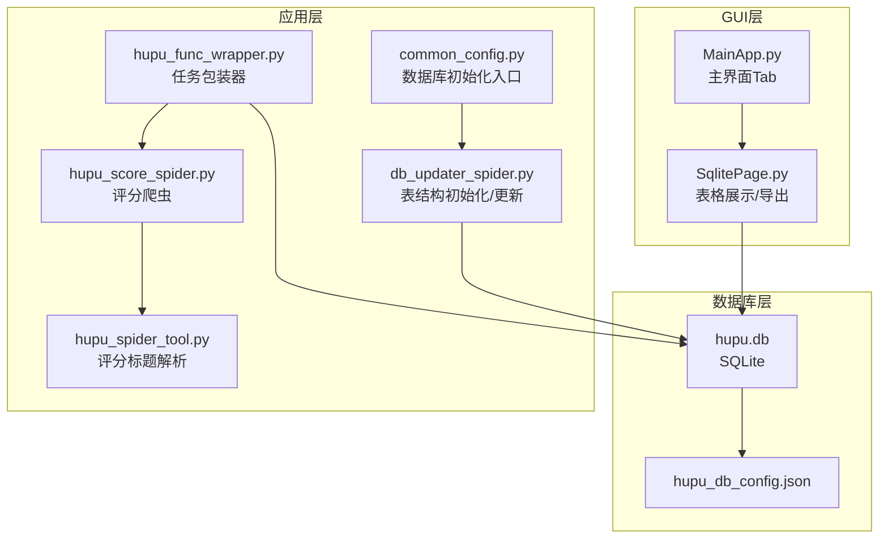
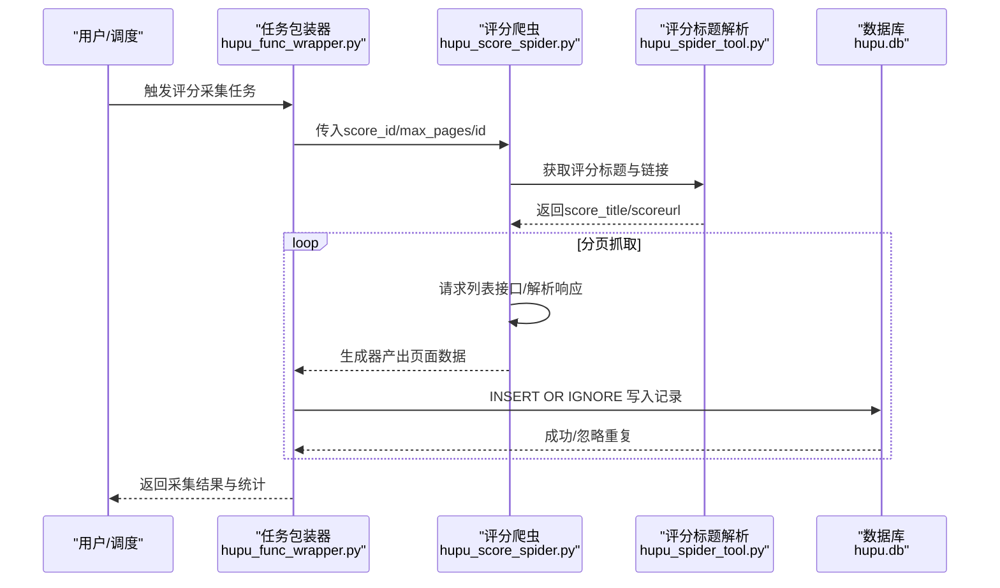
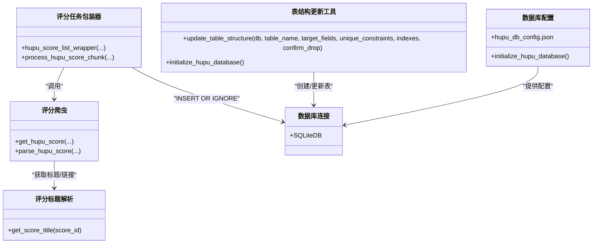
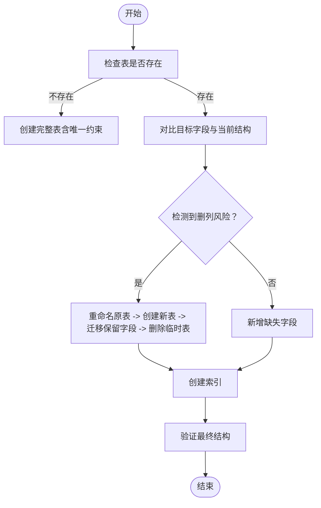

# 评分数据表结构

<cite>
**本文引用的文件**
- [db_updater_spider.py](file://utils/db_updater_spider.py)
- [hupu_func_wrapper.py](file://spider_modules/hupu_func_wrapper.py)
- [hupu_score_spider.py](file://spider_modules/hupu_spiders/hupu_score_spider.py)
- [hupu_spider_tool.py](file://spider_modules/hupu_spiders/hupu_spider_tool.py)
- [common_config.py](file://config/common_config.py)
- [hupu_db_config.json](file://配置文件_系统配置/hupu_db_config.json)
- [classSQLite.py](file://modules/classSQLite.py)
- [SqlitePage.py](file://gui/SqlitePage.py)
- [MainApp.py](file://gui/MainApp.py)
</cite>

## 目录
1. [简介](#简介)
2. [项目结构](#项目结构)
3. [核心组件](#核心组件)
4. [架构总览](#架构总览)
5. [详细组件分析](#详细组件分析)
6. [依赖关系分析](#依赖关系分析)
7. [性能考虑](#性能考虑)
8. [故障排查指南](#故障排查指南)
9. [结论](#结论)
10. [附录](#附录)

## 简介
本文件面向“虎扑评分数据表（hupu_score_list）”的数据库设计与实现，围绕以下目标展开：
- 明确表的设计目标与业务价值：用于存储虎扑论坛评分相关评论数据，支撑评分趋势分析、用户行为洞察与内容质量评估。
- 逐字段说明：id 主键、name 名称、time 时间、location 地点、comment 评论内容、reply_comment 回复评论、like_count 点赞数、score 评分、score_title 评分标题、addtime 添加时间、scoreurl 评分链接、task_id 任务标识。
- 复合唯一约束设计与去重策略：基于 (scoreurl, name, time) 的组合唯一性，结合 INSERT OR IGNORE 的写入策略，避免重复数据入库。
- 表结构初始化脚本、字段更新机制与数据迁移方案：通过统一的表结构更新工具实现安全演进。
- 查询示例、统计分析 SQL 与性能调优建议：提供可操作的实践指引。

## 项目结构
围绕 hupu_score_list 的关键代码分布在如下模块：
- 表结构定义与初始化：utils/db_updater_spider.py
- 数据采集与入库：spider_modules/hupu_func_wrapper.py、spider_modules/hupu_spiders/hupu_score_spider.py、spider_modules/hupu_spiders/hupu_spider_tool.py
- 数据库连接与配置：config/common_config.py、配置文件配置、modules/classSQLite.py
- GUI 展示与导出：gui/SqlitePage.py、gui/MainApp.py

图表来源
- [db_updater_spider.py:293-320](file://utils/db_updater_spider.py#L293-L320)
- [hupu_func_wrapper.py:123-175](file://spider_modules/hupu_func_wrapper.py#L123-L175)
- [hupu_score_spider.py:35-128](file://spider_modules/hupu_spiders/hupu_score_spider.py#L35-L128)
- [hupu_spider_tool.py:43-83](file://spider_modules/hupu_spiders/hupu_spider_tool.py#L43-L83)
- [common_config.py:222-243](file://config/common_config.py#L222-L243)
- [hupu_db_config.json:1-18](file://配置文件_系统配置/hupu_db_config.json#L1-L18)
- [SqlitePage.py:560-591](file://gui/SqlitePage.py#L560-L591)
- [MainApp.py:880-895](file://gui/MainApp.py#L880-L895)

章节来源
- [db_updater_spider.py:152-200](file://utils/db_updater_spider.py#L152-L200)
- [common_config.py:222-243](file://config/common_config.py#L222-L243)
- [hupu_db_config.json:1-18](file://配置文件_系统配置/hupu_db_config.json#L1-L18)

## 核心组件
- 表结构定义与初始化
  - 在统一的表结构更新工具中定义 hupu_score_list 的字段与唯一约束，并在首次运行或需要时创建表。
- 数据采集与入库
  - 评分爬虫负责抓取评论数据，解析评分标题与链接；任务包装器将每条记录以 INSERT OR IGNORE 方式写入数据库，避免重复。
- 数据库连接与配置
  - 通过配置文件与数据库类建立连接，支持 WAL 日志模式、缓存与连接池等优化。
- GUI 展示与导出
  - 提供表格展示、列别名映射、导出与删除等操作，便于人工核查与二次分析。

章节来源
- [db_updater_spider.py:293-320](file://utils/db_updater_spider.py#L293-L320)
- [hupu_func_wrapper.py:123-175](file://spider_modules/hupu_func_wrapper.py#L123-L175)
- [classSQLite.py:66-103](file://modules/classSQLite.py#L66-L103)
- [SqlitePage.py:560-591](file://gui/SqlitePage.py#L560-L591)

## 架构总览
评分数据从网络抓取到本地数据库的端到端流程如下：

图表来源
- [hupu_func_wrapper.py:505-668](file://spider_modules/hupu_func_wrapper.py#L505-L668)
- [hupu_score_spider.py:35-128](file://spider_modules/hupu_spiders/hupu_score_spider.py#L35-L128)
- [hupu_spider_tool.py:43-83](file://spider_modules/hupu_spiders/hupu_spider_tool.py#L43-L83)

## 详细组件分析

### 表结构定义与字段说明
- 设计目标与业务价值
  - 存储虎扑评分评论的元数据与内容，支持后续统计分析（如评分分布、热评识别、地域特征等）。
- 字段定义与用途
  - id：自增主键，唯一标识每条评论记录。
  - name：评论者昵称。
  - time：评论时间（字符串，用于唯一性与排序）。
  - location：评论者IP所属地区。
  - comment：评论正文。
  - reply_comment：回复的上级评论内容（若为空表示直接评论）。
  - like_count：点赞数。
  - score：评分数值（经换算后的整数形式）。
  - score_title：评分对象标题（如比赛名称）。
  - addtime：记录入库时间（DATETIME）。
  - scoreurl：评分对象的移动端链接。
  - task_id：采集任务标识，便于按任务维度进行筛选与导出。

章节来源
- [db_updater_spider.py:295-308](file://utils/db_updater_spider.py#L295-L308)
- [hupu_func_wrapper.py:147-161](file://spider_modules/hupu_func_wrapper.py#L147-L161)

### 复合唯一约束与去重策略
- 唯一约束
  - (scoreurl, name, time)：同一评分对象、同一用户、同一评论时间视为重复，避免重复入库。
- 去重策略
  - 写入采用 INSERT OR IGNORE，当违反唯一约束时自动忽略，保证幂等性。
- 设计思路
  - scoreurl 作为评分对象标识，name 与 time 作为用户与时间维度，三者共同构成稳定且可区分的唯一标识，兼顾业务语义与去重效果。

章节来源
- [db_updater_spider.py:310-312](file://utils/db_updater_spider.py#L310-L312)
- [hupu_func_wrapper.py:147-161](file://spider_modules/hupu_func_wrapper.py#L147-L161)

### 表结构初始化脚本
- 初始化流程
  - 若数据库文件不存在，创建 hupu.db 并一次性创建 hupu_detail_list、ai_analysis、hupu_post_list、hupu_score_list 等表。
  - 若存在，调用统一的表结构更新函数，确保字段与唯一约束一致。
- 关键实现
  - 初始化入口：initialize_hupu_database
  - 表创建与唯一约束：create_hupu_score_list_table/update_hupu_score_list_table_structure
  - 通用更新工具：update_table_structure（支持新增字段、重建表、索引维护）

章节来源
- [db_updater_spider.py:152-200](file://utils/db_updater_spider.py#L152-L200)
- [db_updater_spider.py:293-320](file://utils/db_updater_spider.py#L293-L320)
- [db_updater_spider.py:434-461](file://utils/db_updater_spider.py#L434-L461)

### 字段更新机制与数据迁移方案
- 字段更新机制
  - 通过 update_table_structure 对比目标字段与当前结构，自动新增缺失字段；若检测到需删除字段（高风险），则提示或自动重建表。
- 数据迁移方案
  - 当存在删列风险时，采用“重命名原表 -> 创建新表 -> 迁移保留字段 -> 删除临时表”的流程，确保数据不丢失。
- 索引维护
  - 在更新过程中确保索引存在，避免遗漏导致查询性能下降。

章节来源
- [db_updater_spider.py:12-150](file://utils/db_updater_spider.py#L12-L150)

### 数据采集与入库流程
- 采集流程
  - 任务包装器接收 score_id、max_pages、sleep_time、id 等参数，驱动评分爬虫分页抓取。
  - 爬虫解析响应，构造评分标题与链接，生成每页数据。
- 入库流程
  - 任务包装器对每条记录执行 INSERT OR IGNORE，自动去重；同时记录 task_id 便于后续按任务维度分析。

章节来源
- [hupu_func_wrapper.py:505-668](file://spider_modules/hupu_func_wrapper.py#L505-L668)
- [hupu_score_spider.py:35-128](file://spider_modules/hupu_spiders/hupu_score_spider.py#L35-L128)

### 数据库连接与配置
- 配置文件
  - hupu_db_config.json 指定数据库路径、超时、WAL 模式、缓存大小、同步级别、连接池等。
- 初始化入口
  - common_config.py 提供 initialize_hupu_database，加载配置并创建数据库连接。
- 数据库类
  - classSQLite.py 提供连接池、事务、查询构建器等能力，支持高性能并发访问。

章节来源
- [hupu_db_config.json:1-18](file://配置文件_系统配置/hupu_db_config.json#L1-L18)
- [common_config.py:222-243](file://config/common_config.py#L222-L243)
- [classSQLite.py:66-103](file://modules/classSQLite.py#L66-L103)

### GUI 展示与导出
- 表格展示
  - MainApp.py 为虎扑评分 Tab 配置列与别名，支持导出与删除选中行。
- 列别名与默认字段
  - SqlitePage.py 定义列别名映射与默认展示字段，便于用户理解与分析。

章节来源
- [MainApp.py:880-895](file://gui/MainApp.py#L880-L895)
- [SqlitePage.py:560-591](file://gui/SqlitePage.py#L560-L591)

## 依赖关系分析

图表来源
- [db_updater_spider.py:12-150](file://utils/db_updater_spider.py#L12-L150)
- [hupu_func_wrapper.py:505-668](file://spider_modules/hupu_func_wrapper.py#L505-L668)
- [hupu_score_spider.py:35-128](file://spider_modules/hupu_spiders/hupu_score_spider.py#L35-L128)
- [hupu_spider_tool.py:43-83](file://spider_modules/hupu_spiders/hupu_spider_tool.py#L43-L83)
- [common_config.py:222-243](file://config/common_config.py#L222-L243)
- [hupu_db_config.json:1-18](file://配置文件_系统配置/hupu_db_config.json#L1-L18)

## 性能考虑
- WAL 模式与缓存
  - 配置文件启用 WAL 模式与较大的缓存，提升并发读写性能。
- 连接池
  - 通过连接池减少连接开销，提高吞吐。
- 唯一约束与索引
  - 复合唯一约束 (scoreurl, name, time) 可显著降低重复写入成本；如需按 scoreurl 或 task_id 查询，建议在相应字段上建立索引。
- 分页与并发
  - 任务包装器按页拆分与多线程处理，结合 sleep 控制请求频率，平衡性能与反爬策略。

章节来源
- [hupu_db_config.json:6-8](file://配置文件_系统配置/hupu_db_config.json#L6-L8)
- [classSQLite.py:29-39](file://modules/classSQLite.py#L29-L39)
- [hupu_func_wrapper.py:584-606](file://spider_modules/hupu_func_wrapper.py#L584-L606)

## 故障排查指南
- 初始化失败
  - 检查 hupu_db_config.json 是否存在且路径正确；确认数据库文件可写。
- 写入重复
  - 确认唯一约束是否生效；检查 scoreurl、name、time 是否正确填充。
- 查询慢
  - 为高频查询字段（如 scoreurl、task_id）创建索引；确认 WAL 模式与缓存配置。
- GUI 导出异常
  - 确认数据库路径解析逻辑与文件权限；必要时重新生成默认配置文件。

章节来源
- [common_config.py:222-243](file://config/common_config.py#L222-L243)
- [db_updater_spider.py:12-150](file://utils/db_updater_spider.py#L12-L150)
- [SqlitePage.py:2704-2772](file://gui/SqlitePage.py#L2704-L2772)

## 结论
hupu_score_list 表通过明确的字段设计、复合唯一约束与幂等写入策略，实现了对虎扑评分评论数据的稳定存储与高效分析。配合统一的表结构更新工具、合理的数据库配置与 GUI 展示能力，能够满足日常采集、清洗、统计与导出的全流程需求。

## 附录

### 表结构初始化脚本（步骤说明）
- 首次运行或数据库不存在时：
  - 创建 hupu.db 并依次创建 hupu_detail_list、ai_analysis、hupu_post_list、hupu_score_list。
- 数据库已存在时：
  - 调用 update_table_structure，对比目标字段与当前结构，自动新增缺失字段或重建表（保留有效字段）。

章节来源
- [db_updater_spider.py:152-200](file://utils/db_updater_spider.py#L152-L200)
- [db_updater_spider.py:293-320](file://utils/db_updater_spider.py#L293-L320)
- [db_updater_spider.py:434-461](file://utils/db_updater_spider.py#L434-L461)

### 字段更新机制与数据迁移方案（流程说明）
- 新增字段：直接 ALTER TABLE ADD COLUMN。
- 删列风险：重命名原表 -> 创建新表（目标结构）-> 迁移保留字段 -> 删除临时表。
- 索引维护：在更新过程中确保索引存在。

章节来源
- [db_updater_spider.py:12-150](file://utils/db_updater_spider.py#L12-L150)

### 数据迁移流程图

图表来源
- [db_updater_spider.py:12-150](file://utils/db_updater_spider.py#L12-L150)

### 评分数据查询示例与统计分析 SQL（示例思路）
- 基础查询
  - 按任务 ID 查询：SELECT * FROM hupu_score_list WHERE task_id = ? ORDER BY time DESC;
  - 按评分对象链接查询：SELECT * FROM hupu_score_list WHERE scoreurl = ? ORDER BY time DESC;
- 统计分析
  - 评分分布：SELECT score, COUNT(*) AS count FROM hupu_score_list GROUP BY score ORDER BY score;
  - 热评 TopN：SELECT name, comment, like_count FROM hupu_score_list ORDER BY CAST(like_count AS INTEGER) DESC LIMIT N;
  - 地区分布：SELECT location, COUNT(*) AS count FROM hupu_score_list GROUP BY location ORDER BY count DESC;
- 性能建议
  - 为 scoreurl、task_id、time 建立索引，加速过滤与排序。

章节来源
- [hupu_func_wrapper.py:147-161](file://spider_modules/hupu_func_wrapper.py#L147-L161)
- [db_updater_spider.py:451-453](file://utils/db_updater_spider.py#L451-L453)