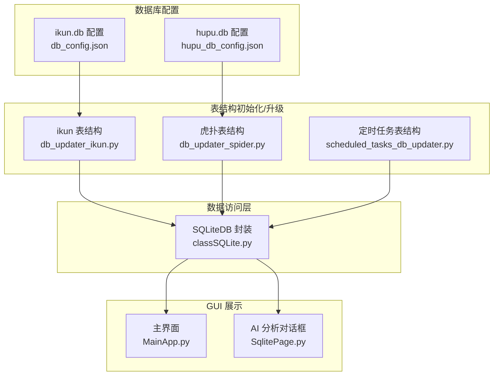
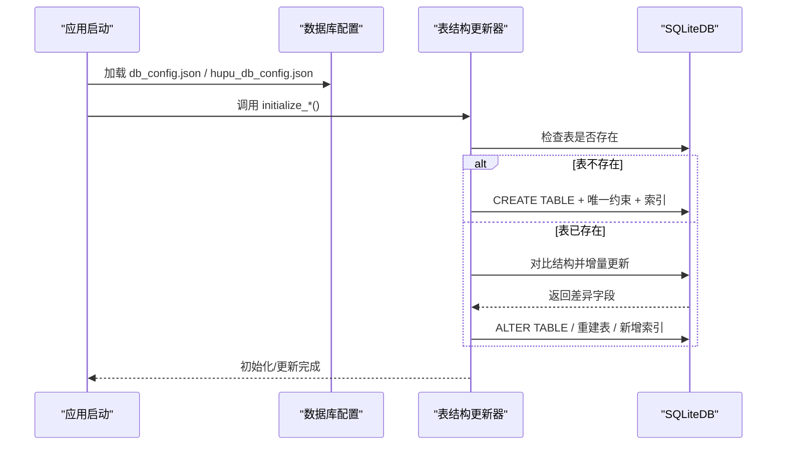
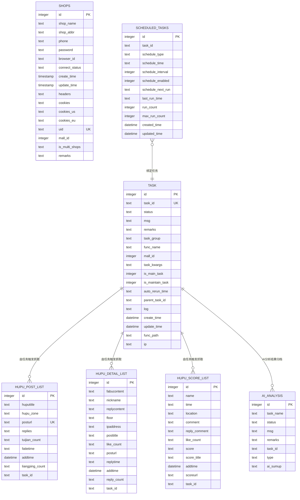

# 表结构设计

<cite>
**本文引用的文件**
- [db_config.json](file://配置文件_系统配置/db_config.json)
- [hupu_db_config.json](file://配置文件_系统配置/hupu_db_config.json)
- [db_updater_ikun.py](file://utils/db_updater_ikun.py)
- [db_updater_spider.py](file://utils/db_updater_spider.py)
- [scheduled_tasks_db_updater.py](file://utils/scheduled_tasks_db_updater.py)
- [classSQLite.py](file://modules/classSQLite.py)
- [MainApp.py](file://gui/MainApp.py)
- [SqlitePage.py](file://gui/SqlitePage.py)
</cite>

## 目录
1. [简介](#简介)
2. [项目结构](#项目结构)
3. [核心组件](#核心组件)
4. [架构总览](#架构总览)
5. [详细组件分析](#详细组件分析)
6. [依赖分析](#依赖分析)
7. [性能考虑](#性能考虑)
8. [故障排查指南](#故障排查指南)
9. [结论](#结论)
10. [附录](#附录)

## 简介
本文件面向 ikun_temu_system 的数据库层，系统包含三类数据库：
- ikun 主数据库：用于任务调度、店铺管理、系统配置等核心业务。
- 虎扑爬虫数据库：用于存储虎扑帖子、详情、评分等爬虫数据，并支持 AI 分析结果归档。
- 定时任务数据库：用于管理定时任务的调度元数据。

本文将逐表说明主键、唯一性、索引、字段类型与长度、业务规则与完整性约束，并给出表间关系图与 ER 图，最后提供版本演进与变更记录说明。

## 项目结构
数据库相关的核心文件分布如下：
- 数据库配置：ikun.db 与 hupu.db 的连接参数与池化配置。
- 表结构初始化与升级：ikun 表、爬虫表、定时任务表的创建与维护脚本。
- 数据访问层：SQLiteDB 抽象封装，统一执行 DDL/DML。
- GUI 展示：主界面与 AI 分析对话框对表结构的使用与展示。

图表来源
- [db_config.json:1-19](file://配置文件_系统配置/db_config.json#L1-L19)
- [hupu_db_config.json:1-18](file://配置文件_系统配置/hupu_db_config.json#L1-L18)
- [db_updater_ikun.py:328-396](file://utils/db_updater_ikun.py#L328-L396)
- [db_updater_spider.py:152-242](file://utils/db_updater_spider.py#L152-L242)
- [scheduled_tasks_db_updater.py:233-284](file://utils/scheduled_tasks_db_updater.py#L233-L284)
- [classSQLite.py:939-976](file://modules/classSQLite.py#L939-L976)
- [MainApp.py:820-919](file://gui/MainApp.py#L820-L919)
- [SqlitePage.py:431-496](file://gui/SqlitePage.py#L431-L496)

章节来源
- [db_config.json:1-19](file://配置文件_系统配置/db_config.json#L1-L19)
- [hupu_db_config.json:1-18](file://配置文件_系统配置/hupu_db_config.json#L1-L18)
- [db_updater_ikun.py:328-396](file://utils/db_updater_ikun.py#L328-L396)
- [db_updater_spider.py:152-242](file://utils/db_updater_spider.py#L152-L242)
- [scheduled_tasks_db_updater.py:233-284](file://utils/scheduled_tasks_db_updater.py#L233-L284)
- [classSQLite.py:939-976](file://modules/classSQLite.py#L939-L976)
- [MainApp.py:820-919](file://gui/MainApp.py#L820-L919)
- [SqlitePage.py:431-496](file://gui/SqlitePage.py#L431-L496)

## 核心组件
- ikun 主数据库（ikun.db）
  - 表：task、shops、config、record
  - 关键点：唯一约束、索引、默认值与时区偏移、外键策略（本库未启用外键或未声明外键）
- 虎扑爬虫数据库（hupu.db）
  - 表：hupu_post_list、hupu_detail_list、hupu_score_list、ai_analysis
  - 关键点：唯一约束、索引、任务标识字段 task_id、时间戳默认值
- 定时任务数据库（独立初始化）
  - 表：scheduled_tasks
  - 关键点：调度类型、下次运行时间、启用状态、运行计数

章节来源
- [db_updater_ikun.py:481-526](file://utils/db_updater_ikun.py#L481-L526)
- [db_updater_ikun.py:440-479](file://utils/db_updater_ikun.py#L440-L479)
- [db_updater_ikun.py:398-438](file://utils/db_updater_ikun.py#L398-L438)
- [db_updater_spider.py:265-352](file://utils/db_updater_spider.py#L265-L352)
- [db_updater_spider.py:244-263](file://utils/db_updater_spider.py#L244-L263)
- [scheduled_tasks_db_updater.py:163-230](file://utils/scheduled_tasks_db_updater.py#L163-L230)

## 架构总览
数据库层采用“配置驱动 + 统一封装 + 自动化初始化”的模式：
- 配置文件定义数据库路径、连接池、WAL 模式、缓存大小等。
- SQLiteDB 封装统一执行 DDL/DML，支持表结构对比与增量更新。
- 各模块提供 initialize_* 函数，按需创建/更新表结构与索引。

图表来源
- [db_config.json:1-19](file://配置文件_系统配置/db_config.json#L1-L19)
- [hupu_db_config.json:1-18](file://配置文件_系统配置/hupu_db_config.json#L1-L18)
- [db_updater_ikun.py:10-148](file://utils/db_updater_ikun.py#L10-L148)
- [db_updater_spider.py:12-149](file://utils/db_updater_spider.py#L12-L149)
- [scheduled_tasks_db_updater.py:158-161](file://utils/scheduled_tasks_db_updater.py#L158-L161)

## 详细组件分析

### ikun 主数据库（ikun.db）

#### 表：task（任务表）
- 主键：id（自增）
- 唯一约束：task_id
- 索引：parent_task_id、status、task_group、is_main_task、task_parent、task_status
- 时间字段：create_time、update_time（带 +8 小时时区偏移）
- 业务字段：task_name、task_id、status、msg、remarks、task_group、func_name、mall_id、task_kwargs、is_main_task、is_maintain_task、auto_rerun_time、parent_task_id、log、func_path、ip
- 外键：未声明外键（未启用外键或未使用外键）

字段类型与长度选择要点
- 文本字段多为 TEXT；整型字段 INTEGER；时间字段 DATETIME（含默认值）。
- 唯一约束保证任务标识全局唯一，便于去重与幂等。

索引设计
- 为 parent_task_id、status、task_group、is_main_task 等高频查询字段建立索引，提升筛选与排序效率。

章节来源
- [db_updater_ikun.py:481-526](file://utils/db_updater_ikun.py#L481-L526)
- [db_updater_ikun.py:242-251](file://utils/db_updater_ikun.py#L242-L251)

#### 表：shops（店铺表）
- 主键：id（自增）
- 唯一约束：uid、id
- 索引：browser_id
- 业务字段：shop_name、shop_abbr、phone、password、browser_id、connect_status（默认值）、create_time、update_time、headers、cookies、cookies_us、cookies_eu、uid、mall_id、is_multi_shops、remarks
- 外键：未声明外键

字段类型与长度选择要点
- cookies、headers 等序列化字段使用 TEXT。
- uid、mall_id 作为业务关联键，建立唯一约束与索引以加速匹配。

章节来源
- [db_updater_ikun.py:440-479](file://utils/db_updater_ikun.py#L440-L479)
- [db_updater_ikun.py:150-197](file://utils/db_updater_ikun.py#L150-L197)

#### 表：config（系统配置表）
- 主键：id（自增）
- 唯一约束：key
- 业务字段：key、value、create_time、update_time、is_deleted
- 外键：未声明外键

字段类型与长度选择要点
- key 唯一，便于快速检索与更新。

章节来源
- [db_updater_ikun.py:398-438](file://utils/db_updater_ikun.py#L398-L438)
- [db_updater_ikun.py:528-568](file://utils/db_updater_ikun.py#L528-L568)

#### 表：record（上传图片记录表）
- 主键：id（自增）
- 业务字段：uid、upload_pic_all、create_time、update_time
- 外键：未声明外键

字段类型与长度选择要点
- upload_pic_all 为文本字段，可承载 JSON 或路径列表。

章节来源
- [db_updater_ikun.py:422-438](file://utils/db_updater_ikun.py#L422-L438)
- [db_updater_ikun.py:552-568](file://utils/db_updater_ikun.py#L552-L568)

### 虎扑爬虫数据库（hupu.db）

#### 表：hupu_post_list（帖子列表）
- 主键：id（自增）
- 唯一约束：posturl
- 业务字段：huputitle、hupu_zone、posturl、replies、tuijian_count、fatietime、addtime（默认 CURRENT_TIMESTAMP）、liangping_count、task_id
- 外键：未声明外键

字段类型与长度选择要点
- URL 字段使用 TEXT，唯一约束避免重复抓取。
- addtime 默认值便于统计与去重。

章节来源
- [db_updater_spider.py:265-352](file://utils/db_updater_spider.py#L265-L352)
- [db_updater_spider.py:406-432](file://utils/db_updater_spider.py#L406-L432)

#### 表：hupu_detail_list（帖子详情）
- 主键：id（自增）
- 唯一约束：posturl + floor
- 业务字段：fabucontent（NOT NULL）、nickname、replycontent、floor、ipaddress、posttitle、like_count、posturl、replytime、addtime（默认 CURRENT_TIMESTAMP）、reply_count、task_id
- 外键：未声明外键

字段类型与长度选择要点
- fabucontent 设为 NOT NULL，保证发布内容必填。
- 唯一约束组合确保同一帖子楼层唯一。

章节来源
- [db_updater_spider.py:323-352](file://utils/db_updater_spider.py#L323-L352)
- [db_updater_spider.py:354-383](file://utils/db_updater_spider.py#L354-L383)

#### 表：hupu_score_list（虎扑评分）
- 主键：id（自增）
- 唯一约束：scoreurl + name + time
- 业务字段：name、time、location、comment、reply_comment、like_count、score、score_title、addtime、scoreurl、task_id
- 外键：未声明外键

字段类型与长度选择要点
- 唯一约束组合确保评分记录唯一。
- scoreurl 与 task_id 便于关联任务与来源。

章节来源
- [db_updater_spider.py:293-352](file://utils/db_updater_spider.py#L293-L352)
- [db_updater_spider.py:434-462](file://utils/db_updater_spider.py#L434-L462)

#### 表：ai_analysis（AI 分析结果表）
- 主键：id（自增）
- 业务字段：task_name、status、msg、remarks、task_id、type、ai_sumup
- 外键：未声明外键

字段类型与长度选择要点
- ai_sumup 为分析摘要，使用 TEXT。
- task_id 便于回溯任务来源。

章节来源
- [db_updater_spider.py:244-263](file://utils/db_updater_spider.py#L244-L263)
- [db_updater_spider.py:385-404](file://utils/db_updater_spider.py#L385-L404)

### 定时任务数据库（scheduled_tasks）

#### 表：scheduled_tasks（定时任务元数据）
- 主键：id（自增）
- 业务字段：task_id、schedule_type、schedule_time、schedule_interval、schedule_enabled（默认 1）、schedule_next_run、last_run_time、run_count（默认 0）、max_run_count、created_time、updated_time
- 外键：未声明外键
- 索引：task_id、schedule_next_run、schedule_enabled

字段类型与长度选择要点
- schedule_type 与 schedule_enabled 控制调度策略。
- schedule_next_run 与 last_run_time 支持调度器快速定位下一次运行时间。

章节来源
- [scheduled_tasks_db_updater.py:163-230](file://utils/scheduled_tasks_db_updater.py#L163-L230)
- [scheduled_tasks_db_updater.py:198-230](file://utils/scheduled_tasks_db_updater.py#L198-L230)

## 依赖分析

图表来源
- [db_updater_ikun.py:481-526](file://utils/db_updater_ikun.py#L481-L526)
- [db_updater_ikun.py:440-479](file://utils/db_updater_ikun.py#L440-L479)
- [db_updater_spider.py:265-352](file://utils/db_updater_spider.py#L265-L352)
- [db_updater_spider.py:244-263](file://utils/db_updater_spider.py#L244-L263)
- [scheduled_tasks_db_updater.py:163-230](file://utils/scheduled_tasks_db_updater.py#L163-L230)

章节来源
- [db_updater_ikun.py:481-526](file://utils/db_updater_ikun.py#L481-L526)
- [db_updater_ikun.py:440-479](file://utils/db_updater_ikun.py#L440-L479)
- [db_updater_spider.py:265-352](file://utils/db_updater_spider.py#L265-L352)
- [db_updater_spider.py:244-263](file://utils/db_updater_spider.py#L244-L263)
- [scheduled_tasks_db_updater.py:163-230](file://utils/scheduled_tasks_db_updater.py#L163-L230)

## 性能考虑
- WAL 模式：配置文件启用 WAL，提升并发读写性能。
- 缓存与同步：调整 cache_size 与 synchronous 参数，平衡一致性与吞吐。
- 索引策略：为高频查询字段建立索引，减少全表扫描。
- 时间字段：统一使用 DATETIME 并带默认值，便于统计与排序。
- 批量更新：提供批量更新工具函数，降低事务开销。

章节来源
- [db_config.json:1-19](file://配置文件_系统配置/db_config.json#L1-L19)
- [db_updater_ikun.py:255-303](file://utils/db_updater_ikun.py#L255-L303)

## 故障排查指南
- 表结构更新失败
  - 检查是否存在需要删除字段的高风险操作，必要时确认或降级为重建表流程。
  - 查看日志输出，定位具体 SQL 错误。
- 外键相关问题
  - 当前未启用外键或未声明外键，若业务需要可扩展外键约束。
- 爬虫数据重复
  - 依赖唯一约束（如 posturl、scoreurl+name+time、posturl+floor）去重，若出现重复请检查唯一约束是否生效。
- GUI 展示异常
  - 确认表名与列名映射正确，AI 分析对话框依赖字段映射进行数据拼接。

章节来源
- [db_updater_ikun.py:10-148](file://utils/db_updater_ikun.py#L10-L148)
- [db_updater_spider.py:12-149](file://utils/db_updater_spider.py#L12-L149)
- [SqlitePage.py:431-496](file://gui/SqlitePage.py#L431-L496)

## 结论
本数据库设计方案以“配置驱动 + 自动化初始化 + 统一封装”为核心，围绕任务、店铺、爬虫与定时任务四大主题建立了清晰的表结构与索引策略。通过唯一约束与索引保障数据完整性与查询性能，同时提供灵活的表结构升级能力，满足业务演进需求。

## 附录

### 版本演进与变更记录
- shops 表新增字段
  - cookies_us、cookies_eu：新增美区与欧区 cookies 字段，便于多区运营。
  - is_multi_shops、remarks：新增多店铺标记与备注字段，增强业务可扩展性。
- task 表时间字段
  - create_time、update_time 默认值使用带 +8 小时时区偏移的表达式，统一时间显示。
- 虎扑表结构
  - hupu_post_list、hupu_detail_list、hupu_score_list 增加 task_id 字段，便于任务溯源。
  - ai_analysis 表用于归档 AI 分析结果，支持按任务维度检索。
- 定时任务表
  - scheduled_tasks 表提供调度元数据管理，支持启用/禁用、下次运行时间、最大运行次数等控制项。

章节来源
- [db_updater_ikun.py:150-197](file://utils/db_updater_ikun.py#L150-L197)
- [db_updater_ikun.py:481-526](file://utils/db_updater_ikun.py#L481-L526)
- [db_updater_spider.py:244-263](file://utils/db_updater_spider.py#L244-L263)
- [db_updater_spider.py:265-352](file://utils/db_updater_spider.py#L265-L352)
- [scheduled_tasks_db_updater.py:163-230](file://utils/scheduled_tasks_db_updater.py#L163-L230)