# 日志和监控

<cite>
**本文引用的文件**
- [main.py](file://main.py)
- [config/logging_loguru.py](file://config/logging_loguru.py)
- [utils/log_utils.py](file://utils/log_utils.py)
- [utils/multiThreading_log_manager.py](file://utils/multiThreading_log_manager.py)
- [utils/log_cleaner.py](file://utils/log_cleaner.py)
- [config/common_config.py](file://config/common_config.py)
- [utils/scheduled_task_executor.py](file://utils/scheduled_task_executor.py)
- [modules/task_manager.py](file://modules/task_manager.py)
- [templates/log.html](file://templates/log.html)
- [static/js/main.js](file://static/js/main.js)
- [templates/index.html](file://templates/index.html)
- [config/start_config.py](file://config/start_config.py)
</cite>

## 目录
1. [简介](#简介)
2. [项目结构](#项目结构)
3. [核心组件](#核心组件)
4. [架构总览](#架构总览)
5. [详细组件分析](#详细组件分析)
6. [依赖关系分析](#依赖关系分析)
7. [性能考量](#性能考量)
8. [故障排查指南](#故障排查指南)
9. [结论](#结论)
10. [附录](#附录)

## 简介
本文件面向 ikun_temu_system 的日志与监控体系，系统性阐述日志设计架构、错误追踪机制、性能监控策略、日志管理工具使用方法与配置、调试工具功能与技巧、日志分析与故障诊断方法，以及监控指标的收集与展示方式，并提供性能优化与维护建议。文档兼顾技术深度与可读性，帮助开发者与运维人员高效理解与使用该系统。

## 项目结构
日志与监控相关的关键模块分布如下：
- 日志初始化与格式化：config/logging_loguru.py
- 任务日志管理与数据库落盘：utils/multiThreading_log_manager.py
- 自动化日志输出与响应处理：utils/log_utils.py
- 日志清理器与周期性清理：utils/log_cleaner.py
- 全局异常捕获与错误日志：main.py、config/start_config.py
- 定时任务执行与监控：utils/scheduled_task_executor.py、modules/task_manager.py
- 前端日志查看与WebSocket：templates/log.html、static/js/main.js
- 数据库与并发配置：config/common_config.py
- UI 日志监控入口：templates/index.html

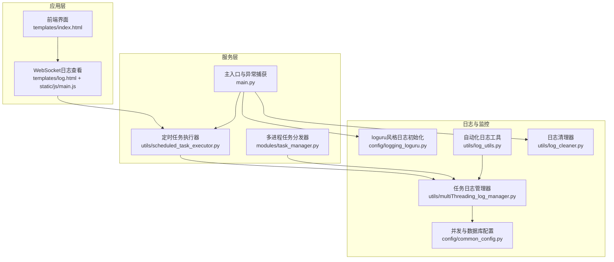

图表来源
- [main.py:1-233](file://main.py#L1-L233)
- [config/logging_loguru.py:1-131](file://config/logging_loguru.py#L1-L131)
- [utils/multiThreading_log_manager.py:1-1265](file://utils/multiThreading_log_manager.py#L1-L1265)
- [utils/log_utils.py:1-155](file://utils/log_utils.py#L1-L155)
- [utils/log_cleaner.py:1-359](file://utils/log_cleaner.py#L1-L359)
- [utils/scheduled_task_executor.py:1-242](file://utils/scheduled_task_executor.py#L1-L242)
- [modules/task_manager.py:1-319](file://modules/task_manager.py#L1-L319)
- [templates/log.html:1-37](file://templates/log.html#L1-L37)
- [static/js/main.js:6903-7001](file://static/js/main.js#L6903-L7001)
- [config/common_config.py:1-394](file://config/common_config.py#L1-L394)

章节来源
- [main.py:1-233](file://main.py#L1-L233)
- [config/logging_loguru.py:1-131](file://config/logging_loguru.py#L1-L131)
- [utils/multiThreading_log_manager.py:1-1265](file://utils/multiThreading_log_manager.py#L1-L1265)
- [utils/log_utils.py:1-155](file://utils/log_utils.py#L1-L155)
- [utils/log_cleaner.py:1-359](file://utils/log_cleaner.py#L1-L359)
- [utils/scheduled_task_executor.py:1-242](file://utils/scheduled_task_executor.py#L1-L242)
- [modules/task_manager.py:1-319](file://modules/task_manager.py#L1-L319)
- [templates/log.html:1-37](file://templates/log.html#L1-L37)
- [static/js/main.js:6903-7001](file://static/js/main.js#L6903-L7001)
- [config/common_config.py:1-394](file://config/common_config.py#L1-L394)

## 核心组件
- 日志初始化与格式化：提供与 loguru 风格一致的彩色输出、时间戳、级别、模块位置等字段，支持控制台与文件输出。
- 任务日志管理器：将任务线程产生的日志写入数据库，支持任务状态、消息、备注、日志内容的统一管理；支持主动/被动双模式任务调度。
- 自动化日志工具：封装统一的日志输出接口，支持根据返回码自动选择日志级别，支持响应结果解析与错误包装。
- 日志清理器：周期性检查任务日志长度，按配置阈值与保留比例进行清理，避免日志无限增长。
- 全局异常捕获：捕获未处理异常，写入 error.log 并安全关闭数据库，同时使用 loguru 记录详细堆栈。
- 定时任务执行器：周期性检查并执行定时任务，记录执行状态与下次执行时间，支持权限校验与重跑。
- 多进程任务分发器：基于进程间队列的任务分发，避免跨进程访问 TaskLogManager 导致的 NoneType 错误，提升稳定性。
- 前端日志查看：通过 WebSocket 实时展示日志，支持按级别着色与滚动。

章节来源
- [config/logging_loguru.py:83-131](file://config/logging_loguru.py#L83-L131)
- [utils/multiThreading_log_manager.py:122-800](file://utils/multiThreading_log_manager.py#L122-L800)
- [utils/log_utils.py:6-155](file://utils/log_utils.py#L6-L155)
- [utils/log_cleaner.py:14-359](file://utils/log_cleaner.py#L14-L359)
- [main.py:21-53](file://main.py#L21-L53)
- [utils/scheduled_task_executor.py:18-242](file://utils/scheduled_task_executor.py#L18-L242)
- [modules/task_manager.py:22-319](file://modules/task_manager.py#L22-L319)
- [templates/log.html:1-37](file://templates/log.html#L1-L37)
- [static/js/main.js:6903-7001](file://static/js/main.js#L6903-L7001)

## 架构总览
日志与监控的整体流程：
- 应用启动时初始化 loguru 风格日志，注册控制台与可选文件处理器。
- 任务线程通过 loguru sink 将日志写入数据库，同时支持 UI 实时查看。
- 全局异常捕获统一记录到 error.log 并安全关闭数据库。
- 日志清理器按配置周期清理超长日志，避免占用过多空间。
- 定时任务执行器周期检查并执行定时任务，记录执行状态。
- 多进程任务分发器通过队列分发任务，避免跨进程访问问题。

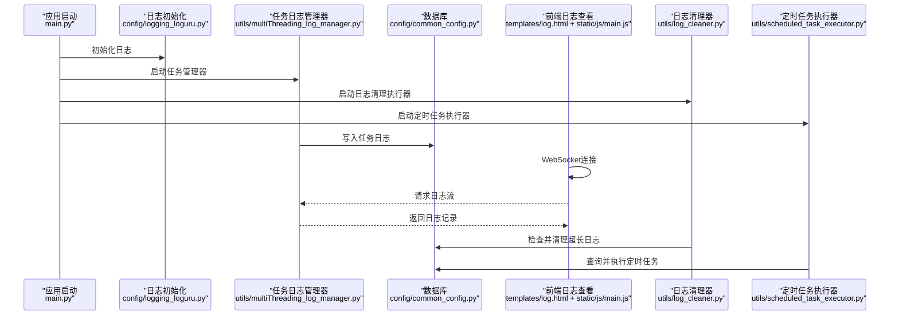

图表来源
- [main.py:103-201](file://main.py#L103-L201)
- [config/logging_loguru.py:83-131](file://config/logging_loguru.py#L83-L131)
- [utils/multiThreading_log_manager.py:444-492](file://utils/multiThreading_log_manager.py#L444-L492)
- [utils/log_cleaner.py:179-286](file://utils/log_cleaner.py#L179-L286)
- [utils/scheduled_task_executor.py:32-93](file://utils/scheduled_task_executor.py#L32-L93)
- [templates/log.html:28-37](file://templates/log.html#L28-L37)
- [static/js/main.js:6903-7001](file://static/js/main.js#L6903-L7001)

## 详细组件分析

### 日志初始化与格式化（config/logging_loguru.py）
- 彩色输出：复刻 loguru 原生日志格式与颜色，支持级别与时间、模块位置、消息的独立着色。
- 自定义 SUCCESS 级别：扩展 logging，使 logger 支持 logger.success()。
- 控制台与文件处理器：可选文件输出，文件中无颜色码，便于持久化。
- 初始化接口：提供 init_logger(name, level, log_file)，返回配置好的彩色 logger。

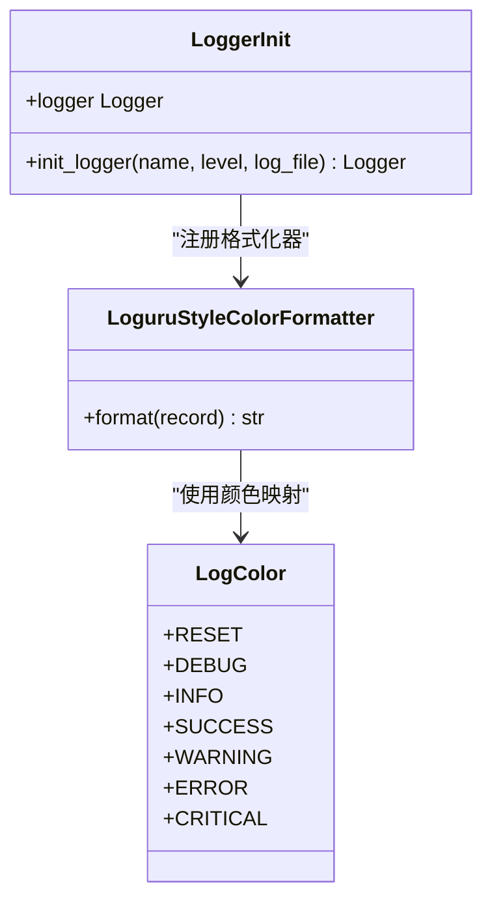

图表来源
- [config/logging_loguru.py:10-131](file://config/logging_loguru.py#L10-L131)

章节来源
- [config/logging_loguru.py:83-131](file://config/logging_loguru.py#L83-L131)

### 任务日志管理器（utils/multiThreading_log_manager.py）
- 任务状态模型：待处理、进行中、已完成、异常、超时、已退出。
- 任务线程日志落盘：通过 loguru 自定义 sink，将线程日志写入数据库 task 表的 log 字段。
- 双模式任务调度：主动模式从数据库拾取任务；被动模式从中心化分配队列接收任务。
- 并发控制：全局信号量与按功能分组的信号量，支持动态调整并发上限。
- 任务字段更新：支持批量更新 msg、remarks，支持追加与覆盖模式。
- 权限校验：执行任务前检查权限，拒绝无权限任务。
- 日志清理集成：在任务执行过程中可触发日志清理器清理超长日志。

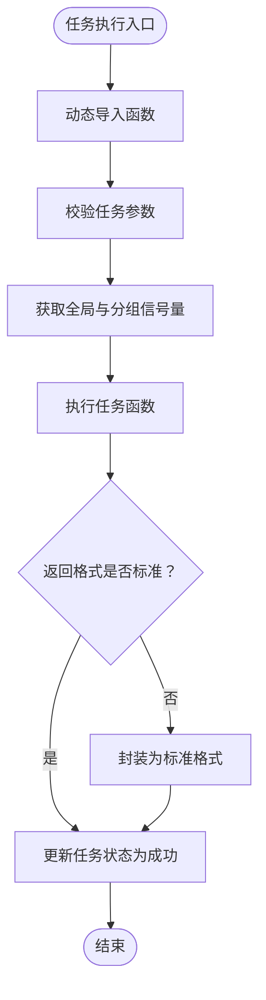

图表来源
- [utils/multiThreading_log_manager.py:683-800](file://utils/multiThreading_log_manager.py#L683-L800)

章节来源
- [utils/multiThreading_log_manager.py:122-800](file://utils/multiThreading_log_manager.py#L122-L800)

### 自动化日志工具（utils/log_utils.py）
- 自动输出日志：根据返回码自动选择日志级别（trace/warning/error/info/success），支持 msg 与 remarks 组合输出。
- 响应结果处理：解析 HTTP 响应，处理非 200 状态码与非 JSON 响应，生成 remarks。
- 错误包装：定义 AutoReturnError 异常类，携带错误结果字典，便于上层统一处理。

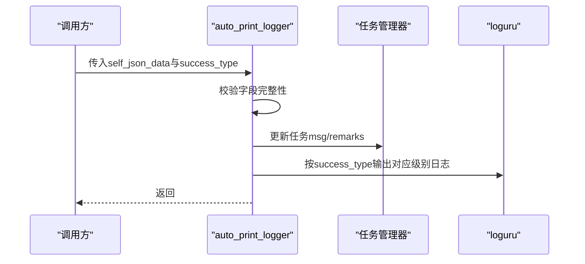

图表来源
- [utils/log_utils.py:6-155](file://utils/log_utils.py#L6-L155)

章节来源
- [utils/log_utils.py:6-155](file://utils/log_utils.py#L6-L155)

### 日志清理器（utils/log_cleaner.py）
- 配置加载：从配置管理器读取自动清理开关、字符阈值、保留比例。
- 清理策略：当日志长度超过阈值时，保留末尾指定比例字符，并添加清理标记。
- 执行器：独立线程定期扫描并清理超长日志，支持批量清理与单任务清理。
- 对外接口：提供检查并清理接口，便于在任务执行过程中触发清理。

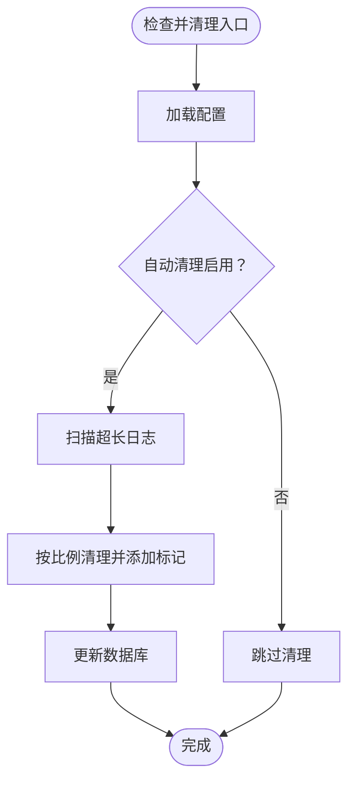

图表来源
- [utils/log_cleaner.py:179-286](file://utils/log_cleaner.py#L179-L286)

章节来源
- [utils/log_cleaner.py:14-359](file://utils/log_cleaner.py#L14-L359)

### 全局异常捕获与错误日志（main.py、config/start_config.py）
- 全局异常钩子：捕获未处理异常，写入 error/error.log，并使用 loguru 记录详细堆栈。
- 安全关闭数据库：异常退出前尝试安全关闭数据库，防止文件损坏。
- 启动时检查：启动时检查 error.log 并进行日志轮转，保留最近 20% 的条目。

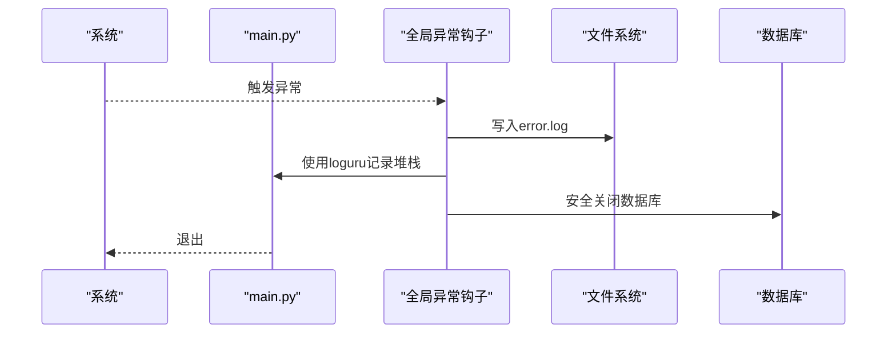

图表来源
- [main.py:21-53](file://main.py#L21-L53)
- [config/start_config.py:46-114](file://config/start_config.py#L46-L114)

章节来源
- [main.py:21-53](file://main.py#L21-L53)
- [config/start_config.py:46-114](file://config/start_config.py#L46-L114)

### 定时任务执行器（utils/scheduled_task_executor.py）
- 周期检查：按设定间隔检查需要执行的定时任务。
- 权限校验：执行前检查任务权限，拒绝无权限任务。
- 重跑机制：通过 re_run_task_thread 重跑任务，记录执行结果与下次执行时间。
- 执行器生命周期：支持启动、停止与线程安全的停止流程。

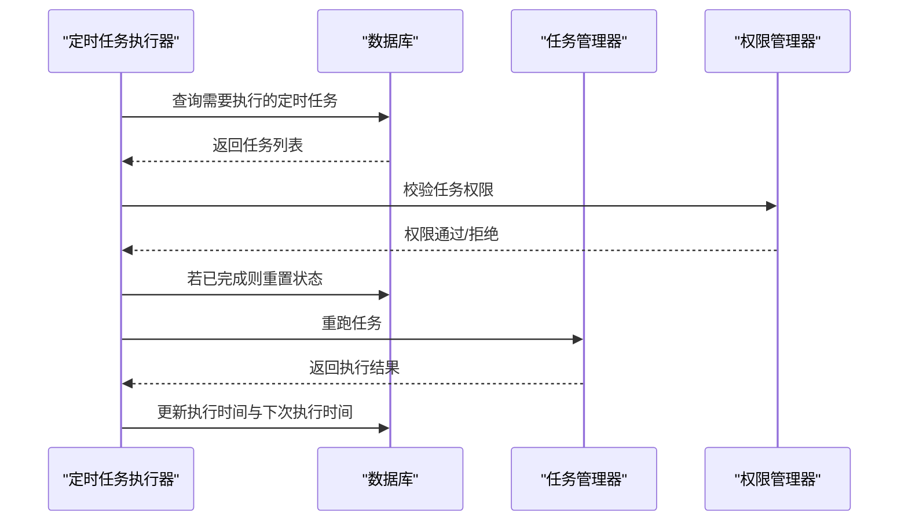

图表来源
- [utils/scheduled_task_executor.py:74-162](file://utils/scheduled_task_executor.py#L74-L162)

章节来源
- [utils/scheduled_task_executor.py:18-242](file://utils/scheduled_task_executor.py#L18-L242)

### 多进程任务分发器（modules/task_manager.py）
- 子进程：每个子进程启动 TaskLogManager（被动模式），内部维护队列消费线程。
- 主进程分配器：获取待处理任务，按运行中任务数最少原则分发到子进程队列。
- 心跳与负载：子进程定期上报运行中任务数，主进程据此进行负载均衡。
- 稳定性保障：避免跨进程访问 _tlm 导致的 NoneType 错误，使用进程间队列通信。

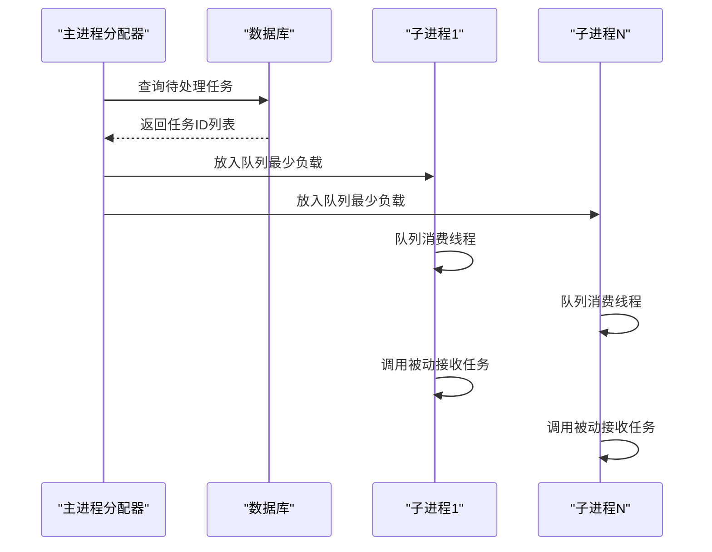

图表来源
- [modules/task_manager.py:144-319](file://modules/task_manager.py#L144-L319)

章节来源
- [modules/task_manager.py:22-319](file://modules/task_manager.py#L22-L319)

### 前端日志查看（templates/log.html、static/js/main.js）
- WebSocket 连接：前端通过 WebSocket 接收实时日志流。
- 日志解析与着色：根据日志级别（INFO/ERROR/TRACE 等）进行颜色区分。
- 实时滚动：日志容器自动滚动到底部，确保最新日志可见。
- UI 元素：提供连接状态指示与日志过滤（关键词、行数）。

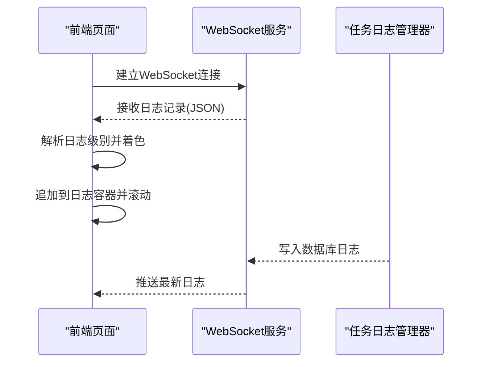

图表来源
- [templates/log.html:28-37](file://templates/log.html#L28-L37)
- [static/js/main.js:6903-7001](file://static/js/main.js#L6903-L7001)

章节来源
- [templates/log.html:1-37](file://templates/log.html#L1-L37)
- [static/js/main.js:6903-7001](file://static/js/main.js#L6903-L7001)

## 依赖关系分析
- 日志初始化依赖 loguru，同时兼容 logging 的 SUCCESS 级别与格式化器。
- 任务日志管理器依赖数据库连接与权限管理器，通过 loguru sink 将日志写入数据库。
- 自动化日志工具依赖任务日志管理器与 loguru，用于统一输出与任务字段更新。
- 日志清理器依赖配置管理器与数据库，定期清理超长日志。
- 全局异常捕获依赖文件系统与数据库，确保异常时安全关闭。
- 定时任务执行器依赖任务管理器与权限管理器，支持重跑与权限校验。
- 多进程任务分发器依赖进程间队列与任务管理器，避免跨进程访问问题。
- 前端日志查看依赖 WebSocket 与模板，实时展示日志。

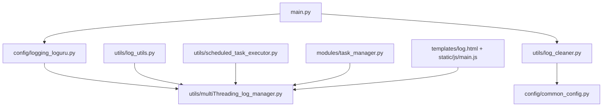

图表来源
- [config/logging_loguru.py:1-131](file://config/logging_loguru.py#L1-L131)
- [utils/multiThreading_log_manager.py:1-1265](file://utils/multiThreading_log_manager.py#L1-L1265)
- [utils/log_utils.py:1-155](file://utils/log_utils.py#L1-L155)
- [utils/log_cleaner.py:1-359](file://utils/log_cleaner.py#L1-L359)
- [main.py:1-233](file://main.py#L1-L233)
- [utils/scheduled_task_executor.py:1-242](file://utils/scheduled_task_executor.py#L1-L242)
- [modules/task_manager.py:1-319](file://modules/task_manager.py#L1-L319)
- [templates/log.html:1-37](file://templates/log.html#L1-L37)
- [static/js/main.js:6903-7001](file://static/js/main.js#L6903-L7001)

章节来源
- [config/logging_loguru.py:1-131](file://config/logging_loguru.py#L1-L131)
- [utils/multiThreading_log_manager.py:1-1265](file://utils/multiThreading_log_manager.py#L1-L1265)
- [utils/log_utils.py:1-155](file://utils/log_utils.py#L1-L155)
- [utils/log_cleaner.py:1-359](file://utils/log_cleaner.py#L1-L359)
- [main.py:1-233](file://main.py#L1-L233)
- [utils/scheduled_task_executor.py:1-242](file://utils/scheduled_task_executor.py#L1-L242)
- [modules/task_manager.py:1-319](file://modules/task_manager.py#L1-L319)
- [templates/log.html:1-37](file://templates/log.html#L1-L37)
- [static/js/main.js:6903-7001](file://static/js/main.js#L6903-L7001)

## 性能考量
- 日志输出性能
  - 控制台彩色输出：使用格式化器一次性渲染，避免多次格式化开销。
  - 文件输出：纯文本无颜色，减少颜色转义带来的额外开销。
- 任务日志写入
  - 通过 loguru sink 写入数据库，避免频繁 I/O；使用事务与批量更新减少锁竞争。
  - 并发控制：全局与分组信号量限制并发，避免资源争用。
- 日志清理
  - 定期清理：降低数据库日志字段长度，减少查询与传输开销。
  - 保留比例：平衡可观测性与存储成本。
- 异常处理
  - 全局异常捕获：避免崩溃，记录详细堆栈，确保数据库安全关闭。
- 前端日志查看
  - WebSocket 实时推送：减少轮询开销；前端解析与着色在客户端完成，减轻服务端压力。

[本节为通用性能讨论，不直接分析具体文件]

## 故障排查指南
- 日志无法输出或颜色异常
  - 检查日志初始化是否正确调用 init_logger，确认控制台处理器已注册。
  - 确认 SUCCESS 级别是否已注册，避免调用 logger.success() 时报错。
- 任务日志未落盘
  - 检查 loguru sink 是否已初始化，确认过滤器仅匹配任务线程。
  - 确认任务线程 ID 是否已登记到 THREAD_TASK_MAP。
- 日志清理未生效
  - 检查自动清理开关与阈值配置，确认清理执行器已启动。
  - 查看清理执行器线程状态，确认未阻塞。
- 全局异常未被捕获
  - 确认 sys.excepthook 是否已设置为 handle_global_exception。
  - 检查 error.log 写入权限与路径。
- 定时任务未执行
  - 检查定时任务状态与下次执行时间，确认权限校验通过。
  - 查看定时任务执行器线程状态与日志。
- 多进程任务分发异常
  - 检查子进程队列是否满，确认负载均衡逻辑正常。
  - 确认子进程 _tlm 已正确初始化并处于运行状态。

章节来源
- [config/logging_loguru.py:83-131](file://config/logging_loguru.py#L83-L131)
- [utils/multiThreading_log_manager.py:444-492](file://utils/multiThreading_log_manager.py#L444-L492)
- [utils/log_cleaner.py:179-286](file://utils/log_cleaner.py#L179-L286)
- [main.py:21-53](file://main.py#L21-L53)
- [utils/scheduled_task_executor.py:32-93](file://utils/scheduled_task_executor.py#L32-L93)
- [modules/task_manager.py:144-319](file://modules/task_manager.py#L144-L319)

## 结论
ikun_temu_system 的日志与监控体系以 loguru 为核心，结合任务日志管理器、自动化日志工具、日志清理器、全局异常捕获与定时任务执行器，形成了完整的可观测性闭环。通过前端 WebSocket 实时查看与多进程稳定分发，系统在保证高并发与高可用的同时，提供了清晰、可追溯的日志与监控能力。建议在生产环境中合理配置清理策略与并发上限，并持续关注日志质量与存储成本的平衡。

[本节为总结性内容，不直接分析具体文件]

## 附录
- 日志管理工具使用方法与配置选项
  - 日志初始化：调用 init_logger，可选择输出到文件；支持 SUCCESS 级别。
  - 日志清理：通过配置项控制自动清理开关、字符阈值与保留比例；可通过执行器定期清理。
  - 响应处理：使用 response_result_handler 解析 HTTP 响应，生成 remarks。
  - 错误包装：使用 AutoReturnError 与 auto_return 统一错误返回与日志输出。
- 调试工具功能与使用技巧
  - 全局异常钩子：捕获未处理异常，记录详细堆栈并安全关闭数据库。
  - 前端日志查看：通过 WebSocket 实时查看日志，支持按级别着色与关键词过滤。
  - 定时任务重跑：通过定时任务执行器重跑任务，记录执行结果与下次执行时间。
- 监控指标收集与展示
  - 任务状态与日志：通过数据库 task 表记录状态、消息、备注与日志内容。
  - 并发与负载：通过子进程心跳与运行中任务数反映负载情况。
  - 前端展示：WebSocket 实时推送日志，前端解析并着色展示。
- 性能优化与维护建议
  - 合理设置并发上限，避免资源争用；根据功能类型动态调整分组信号量。
  - 启用日志清理，控制日志长度，避免数据库膨胀。
  - 使用文件输出与纯文本日志，减少颜色转义开销。
  - 定期检查异常日志，定位问题并优化代码与配置。

[本节为通用指导，不直接分析具体文件]