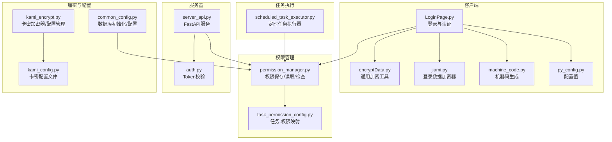
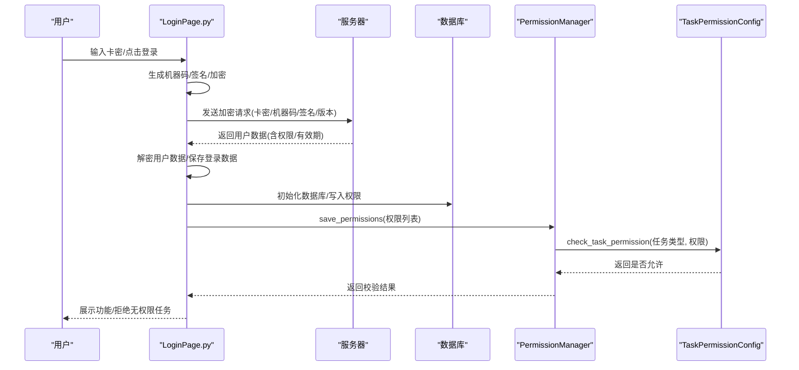
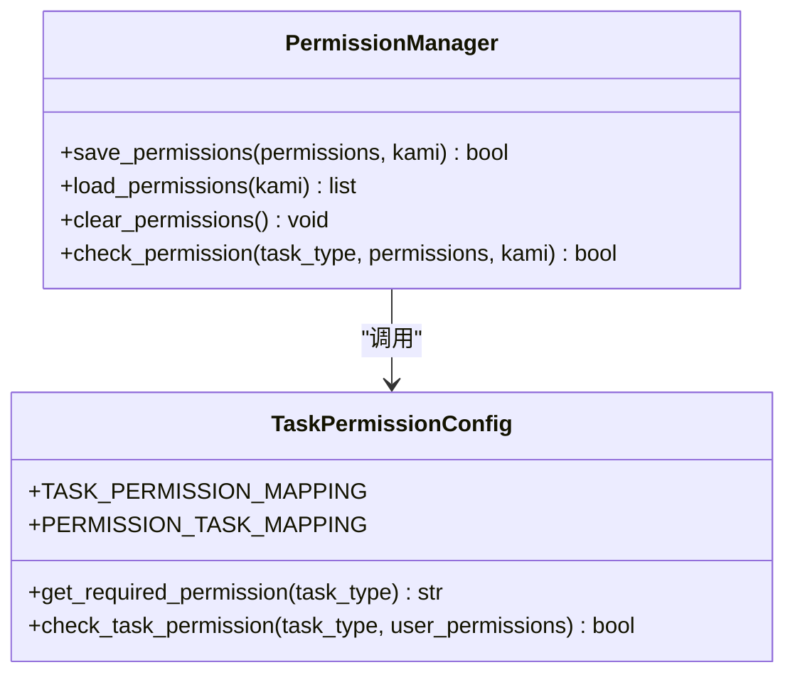
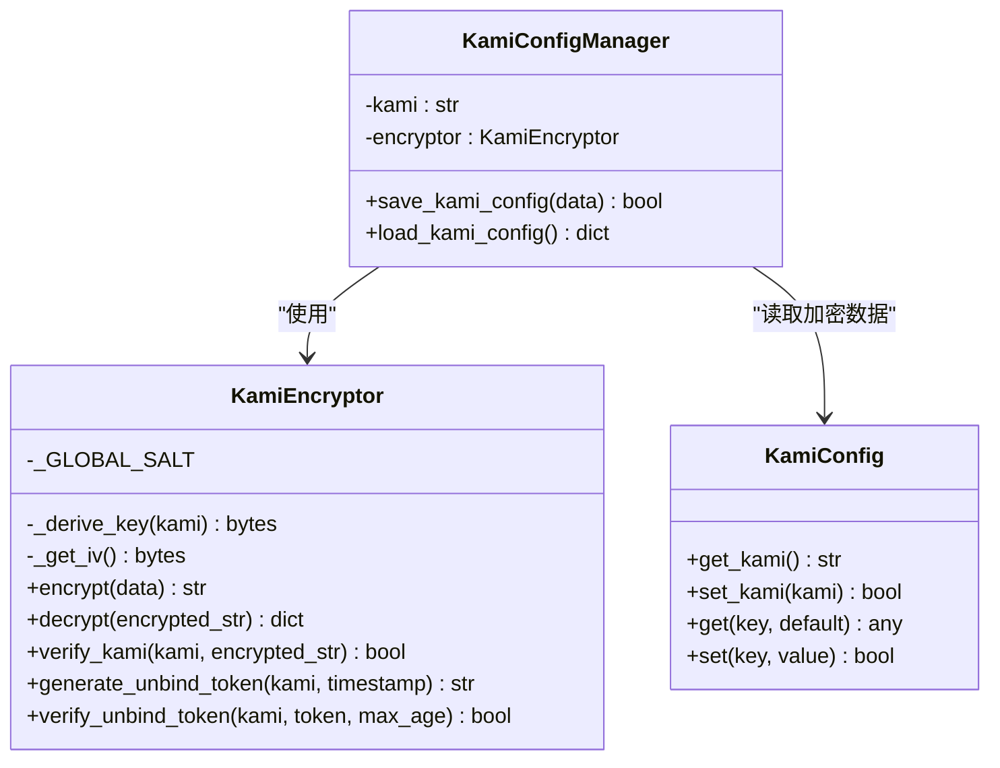
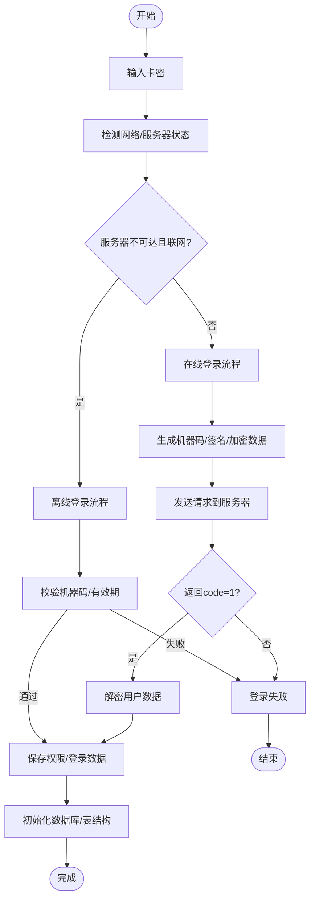
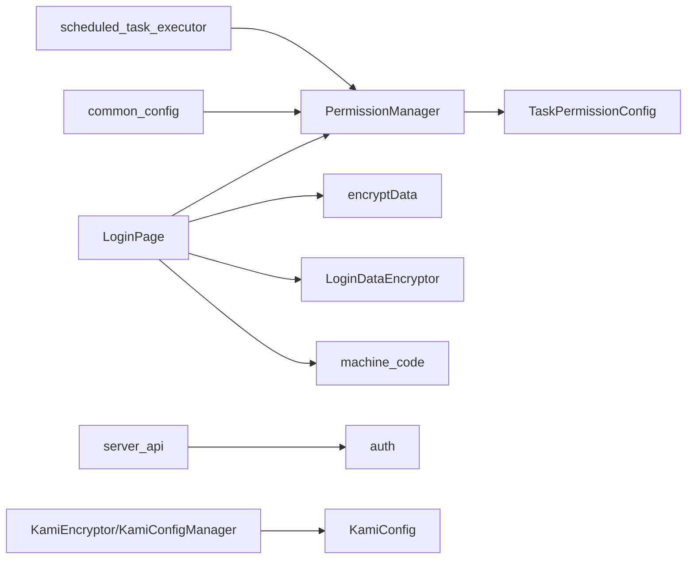

# 权限控制系统

<cite>
**本文档引用的文件**
- [permission_manager.py](file://config/permission_manager.py)
- [task_permission_config.py](file://config/task_permission_config.py)
- [kami_encrypt.py](file://config/kami_encrypt.py)
- [kami_config.py](file://config/kami_config.py)
- [LoginPage.py](file://gui/LoginPage.py)
- [encryptData.py](file://gui/utils/encryptData.py)
- [jiami.py](file://gui/utils/jiami.py)
- [machine_code.py](file://modules/machine_code.py)
- [common_config.py](file://config/common_config.py)
- [server_api.py](file://api/server_api.py)
- [auth.py](file://api/server_routes/auth.py)
- [py_config.py](file://config/py_config.py)
- [scheduled_task_executor.py](file://utils/scheduled_task_executor.py)
</cite>

## 目录
1. [简介](#简介)
2. [项目结构](#项目结构)
3. [核心组件](#核心组件)
4. [架构总览](#架构总览)
5. [详细组件分析](#详细组件分析)
6. [依赖分析](#依赖分析)
7. [性能考虑](#性能考虑)
8. [故障排除指南](#故障排除指南)
9. [结论](#结论)
10. [附录](#附录)

## 简介
本文件面向 ikun_temu_system 的权限控制系统，系统性阐述权限管理架构的设计原理与实现机制，覆盖用户认证流程、角色控制策略、权限存储与验证、安全验证与加密机制、权限配置指南与最佳实践、扩展与自定义能力以及故障排除与安全建议。文档旨在帮助开发者与运维人员快速理解并高效维护权限体系。

## 项目结构
权限控制涉及以下关键模块：
- 权限存储与检查：config/permission_manager.py、config/task_permission_config.py
- 卡密与配置加密：config/kami_encrypt.py、config/kami_config.py
- 登录与认证：gui/LoginPage.py、gui/utils/encryptData.py、gui/utils/jiami.py、modules/machine_code.py、config/py_config.py
- 服务器侧认证：api/server_routes/auth.py、api/server_api.py
- 数据库初始化与权限持久化：config/common_config.py
- 定时任务权限校验：utils/scheduled_task_executor.py

**图表来源**
- [LoginPage.py:1-586](file://gui/LoginPage.py#L1-L586)
- [permission_manager.py:1-126](file://config/permission_manager.py#L1-L126)
- [task_permission_config.py:1-84](file://config/task_permission_config.py#L1-L84)
- [kami_encrypt.py:1-321](file://config/kami_encrypt.py#L1-L321)
- [kami_config.py:1-56](file://config/kami_config.py#L1-L56)
- [encryptData.py:1-37](file://gui/utils/encryptData.py#L1-L37)
- [jiami.py:1-256](file://gui/utils/jiami.py#L1-L256)
- [machine_code.py:1-183](file://modules/machine_code.py#L1-L183)
- [py_config.py:1-93](file://config/py_config.py#L1-L93)
- [server_api.py:1-474](file://api/server_api.py#L1-L474)
- [auth.py:1-19](file://api/server_routes/auth.py#L1-L19)
- [common_config.py:1-394](file://config/common_config.py#L1-L394)
- [scheduled_task_executor.py:90-121](file://utils/scheduled_task_executor.py#L90-L121)

**章节来源**
- [permission_manager.py:1-126](file://config/permission_manager.py#L1-L126)
- [task_permission_config.py:1-84](file://config/task_permission_config.py#L1-L84)
- [kami_encrypt.py:1-321](file://config/kami_encrypt.py#L1-L321)
- [kami_config.py:1-56](file://config/kami_config.py#L1-L56)
- [LoginPage.py:1-586](file://gui/LoginPage.py#L1-L586)
- [encryptData.py:1-37](file://gui/utils/encryptData.py#L1-L37)
- [jiami.py:1-256](file://gui/utils/jiami.py#L1-L256)
- [machine_code.py:1-183](file://modules/machine_code.py#L1-L183)
- [py_config.py:1-93](file://config/py_config.py#L1-L93)
- [server_api.py:1-474](file://api/server_api.py#L1-L474)
- [auth.py:1-19](file://api/server_routes/auth.py#L1-L19)
- [common_config.py:1-394](file://config/common_config.py#L1-L394)
- [scheduled_task_executor.py:90-121](file://utils/scheduled_task_executor.py#L90-L121)

## 核心组件
- 权限管理器：负责权限的保存、读取与检查，权限以 JSON 形式存储在数据库 config 表中。
- 任务权限映射：定义任务类型与所需权限之间的双向映射关系，支持中文任务名称。
- 卡密加密与配置：提供基于卡密的对称加密、令牌生成与验证，以及加密配置的保存与加载。
- 登录与认证：实现在线/离线登录流程、机器码绑定、签名与加密传输、有效期校验。
- 服务器侧认证：提供基于配置的 Token 校验中间件，支持开启/关闭认证与自定义 Token。
- 数据库初始化：按权限动态初始化所需数据库与表结构，确保权限生效前的环境就绪。
- 定时任务权限校验：在任务执行前进行权限检查，拒绝无权限任务。

**章节来源**
- [permission_manager.py:12-126](file://config/permission_manager.py#L12-L126)
- [task_permission_config.py:7-84](file://config/task_permission_config.py#L7-L84)
- [kami_encrypt.py:17-321](file://config/kami_encrypt.py#L17-L321)
- [LoginPage.py:24-186](file://gui/LoginPage.py#L24-L186)
- [auth.py:7-19](file://api/server_routes/auth.py#L7-L19)
- [common_config.py:245-334](file://config/common_config.py#L245-L334)
- [scheduled_task_executor.py:94-121](file://utils/scheduled_task_executor.py#L94-L121)

## 架构总览
权限控制采用“客户端登录 + 服务器认证 + 权限映射 + 数据库持久化”的分层设计。登录成功后，客户端将权限列表保存至本地数据库；后续任务执行与定时任务均通过统一的权限检查接口进行校验。

**图表来源**
- [LoginPage.py:345-461](file://gui/LoginPage.py#L345-L461)
- [permission_manager.py:15-56](file://config/permission_manager.py#L15-L56)
- [task_permission_config.py:67-84](file://config/task_permission_config.py#L67-L84)
- [common_config.py:245-334](file://config/common_config.py#L245-L334)

## 详细组件分析

### 权限管理器（PermissionManager）
- 职责：保存、读取、清除权限；检查任务权限。
- 存储：权限列表以 JSON 字符串形式存储在 config 表 key='permissions' 的记录中。
- 检查：若未传入权限列表，自动从数据库加载；随后委托任务权限映射模块进行校验。

**图表来源**
- [permission_manager.py:12-126](file://config/permission_manager.py#L12-L126)
- [task_permission_config.py:7-84](file://config/task_permission_config.py#L7-L84)

**章节来源**
- [permission_manager.py:15-122](file://config/permission_manager.py#L15-L122)
- [task_permission_config.py:55-84](file://config/task_permission_config.py#L55-L84)

### 任务权限映射
- 映射关系：定义各权限（如 temu、caiwu、spider）与具体任务类型的对应关系，支持中文任务名称。
- 反向映射：任务类型到所需权限的快速查找。
- 校验逻辑：若任务类型无专属权限要求，视为允许；否则要求用户具备对应权限。

**章节来源**
- [task_permission_config.py:8-84](file://config/task_permission_config.py#L8-L84)

### 卡密加密与配置管理
- KamiEncryptor：基于卡密派生密钥（SHA256）、随机 IV、AES-CBC 加密；提供卡密验证与解绑令牌生成/验证。
- KamiConfigManager：封装加密配置的保存与加载，依赖 KamiConfig 文件存储加密数据。
- KamiConfig：提供卡密与通用配置的读写接口，确保配置文件存在与格式正确。

**图表来源**
- [kami_encrypt.py:17-321](file://config/kami_encrypt.py#L17-L321)
- [kami_config.py:6-56](file://config/kami_config.py#L6-L56)

**章节来源**
- [kami_encrypt.py:17-321](file://config/kami_encrypt.py#L17-L321)
- [kami_config.py:6-56](file://config/kami_config.py#L6-L56)

### 登录与认证流程
- 在线登录：生成机器码、签名与加密数据，发送至服务器；服务器返回用户数据（含权限与有效期），客户端解密并保存登录数据。
- 离线登录：仅在服务器不可达且设备联网条件下允许，校验机器码与有效期。
- 速率限制：防刷登录请求。
- 机器码：稳定硬件指纹，用于绑定设备与离线校验。

**图表来源**
- [LoginPage.py:345-461](file://gui/LoginPage.py#L345-L461)
- [machine_code.py:59-183](file://modules/machine_code.py#L59-L183)

**章节来源**
- [LoginPage.py:24-186](file://gui/LoginPage.py#L24-L186)
- [machine_code.py:59-183](file://modules/machine_code.py#L59-L183)

### 服务器侧认证
- Token 校验中间件：从配置读取开关与 Token，若开启则要求请求携带正确 Token，否则拒绝访问。
- FastAPI 生命周期：启动时初始化任务管理器，优雅关闭时停止任务。

**章节来源**
- [auth.py:7-19](file://api/server_routes/auth.py#L7-L19)
- [server_api.py:40-57](file://api/server_api.py#L40-L57)

### 数据库初始化与权限持久化
- 按权限动态初始化数据库与表结构，确保权限生效前的环境就绪。
- 写入初始化锁文件，避免重复初始化。
- 登录成功后保存权限至数据库，供后续校验使用。

**章节来源**
- [common_config.py:245-334](file://config/common_config.py#L245-L334)
- [permission_manager.py:15-56](file://config/permission_manager.py#L15-L56)

### 定时任务权限校验
- 执行前查询任务名称并调用权限管理器进行校验，无权限则记录警告并更新下次执行时间。
- 保障定时任务不会越权执行。

**章节来源**
- [scheduled_task_executor.py:94-121](file://utils/scheduled_task_executor.py#L94-L121)

## 依赖分析
- 组件耦合：
  - PermissionManager 依赖 TaskPermissionConfig 进行权限校验。
  - 登录流程依赖机器码模块、加密工具与配置模块。
  - 服务器路由依赖认证中间件与配置管理器。
  - 定时任务执行器依赖权限管理器与数据库。
- 外部依赖：
  - FastAPI、uvicorn、Crypto（AES）、loguru、sqlite3 等。

**图表来源**
- [permission_manager.py:12-126](file://config/permission_manager.py#L12-L126)
- [task_permission_config.py:7-84](file://config/task_permission_config.py#L7-L84)
- [LoginPage.py:14-22](file://gui/LoginPage.py#L14-L22)
- [encryptData.py:13-37](file://gui/utils/encryptData.py#L13-L37)
- [jiami.py:13-89](file://gui/utils/jiami.py#L13-L89)
- [machine_code.py:1-183](file://modules/machine_code.py#L1-L183)
- [server_api.py:13-27](file://api/server_api.py#L13-L27)
- [auth.py:4-10](file://api/server_routes/auth.py#L4-L10)
- [scheduled_task_executor.py:107-119](file://utils/scheduled_task_executor.py#L107-L119)
- [kami_encrypt.py:218-284](file://config/kami_encrypt.py#L218-L284)
- [kami_config.py:1-56](file://config/kami_config.py#L1-L56)
- [common_config.py:245-334](file://config/common_config.py#L245-L334)

**章节来源**
- [permission_manager.py:12-126](file://config/permission_manager.py#L12-L126)
- [task_permission_config.py:7-84](file://config/task_permission_config.py#L7-L84)
- [LoginPage.py:14-22](file://gui/LoginPage.py#L14-L22)
- [encryptData.py:13-37](file://gui/utils/encryptData.py#L13-L37)
- [jiami.py:13-89](file://gui/utils/jiami.py#L13-L89)
- [machine_code.py:1-183](file://modules/machine_code.py#L1-L183)
- [server_api.py:13-27](file://api/server_api.py#L13-L27)
- [auth.py:4-10](file://api/server_routes/auth.py#L4-L10)
- [scheduled_task_executor.py:107-119](file://utils/scheduled_task_executor.py#L107-L119)
- [kami_encrypt.py:218-284](file://config/kami_encrypt.py#L218-L284)
- [kami_config.py:1-56](file://config/kami_config.py#L1-L56)
- [common_config.py:245-334](file://config/common_config.py#L245-L334)

## 性能考虑
- 权限检查为 O(1) 查表操作，性能开销极低。
- 登录与权限保存涉及数据库写入，建议在登录成功后一次性保存，避免频繁写入。
- 服务器端认证中间件仅做简单字符串比较，开销很小。
- 定时任务权限校验在任务执行前进行，建议将任务名称与权限映射缓存于内存以减少查询次数。

## 故障排除指南
- 登录失败
  - 确认网络与服务器状态；若服务器可达，离线卡密将被拒绝。
  - 检查卡密有效性与有效期；必要时重新登录。
  - 核对机器码生成是否成功，避免因权限不足导致无法获取。
- 权限不足
  - 检查数据库中 permissions 记录是否存在且格式正确。
  - 确认任务类型是否在映射表中，或是否属于无需权限的任务。
- 服务器认证失败
  - 检查配置开关与 Token 是否正确；错误会返回 403 并附带 WWW-Authenticate 头。
- 数据库初始化失败
  - 确认权限列表包含相应模块（如 temu、caiwu、spider），并检查初始化锁文件状态。
- 定时任务被拒绝
  - 检查任务名称是否正确，权限管理器是否能解析到所需权限。

**章节来源**
- [LoginPage.py:180-186](file://gui/LoginPage.py#L180-L186)
- [auth.py:12-19](file://api/server_routes/auth.py#L12-L19)
- [common_config.py:245-334](file://config/common_config.py#L245-L334)
- [scheduled_task_executor.py:114-121](file://utils/scheduled_task_executor.py#L114-L121)

## 结论
该权限控制系统通过“登录认证 + 权限映射 + 数据库持久化 + 服务器中间件校验”的组合，实现了灵活、可扩展且易于维护的权限管理。其设计兼顾易用性与安全性，适合在多模块协作的复杂业务场景中部署与演进。

## 附录

### 权限配置指南与最佳实践
- 权限映射维护
  - 在任务权限映射中新增任务类型与权限的对应关系，确保中文名称与英文编码一致。
  - 使用反向映射快速定位任务所需权限，避免遗漏。
- 权限存储与加载
  - 登录成功后统一调用权限管理器保存权限；避免在多个模块分别写入。
  - 若需清空权限（如退出登录），调用清除接口并重建数据库环境。
- 服务器认证
  - 建议开启 Token 校验并在生产环境配置强 Token；定期轮换。
- 加密与安全
  - 卡密加密采用 AES-CBC 与随机 IV，确保不同卡密产生不同密文。
  - 解绑令牌使用 HMAC-SHA256 并带时间戳，建议有效期不超过 5 分钟。
- 最佳实践
  - 将权限检查前置到任务执行入口，避免越权操作。
  - 对高频权限查询进行缓存，降低数据库压力。
  - 定期审计权限映射与任务类型，确保最小权限原则。

**章节来源**
- [task_permission_config.py:7-84](file://config/task_permission_config.py#L7-L84)
- [permission_manager.py:15-104](file://config/permission_manager.py#L15-L104)
- [auth.py:9-19](file://api/server_routes/auth.py#L9-L19)
- [kami_encrypt.py:71-134](file://config/kami_encrypt.py#L71-L134)
- [kami_encrypt.py:155-216](file://config/kami_encrypt.py#L155-L216)