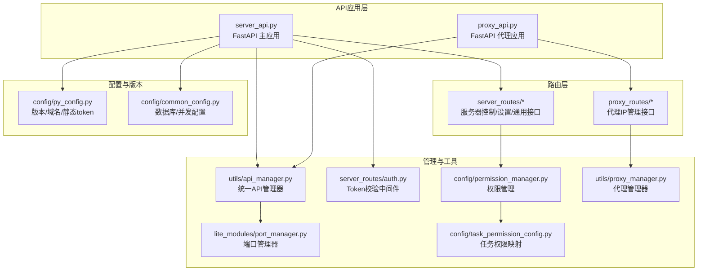
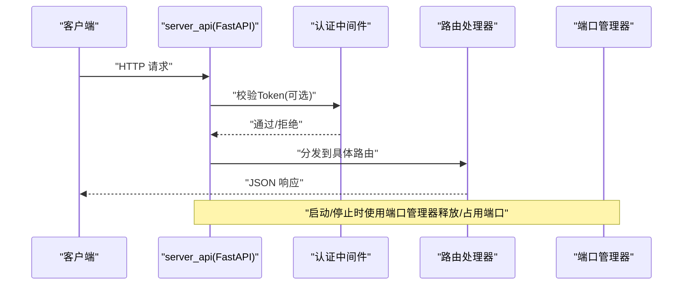
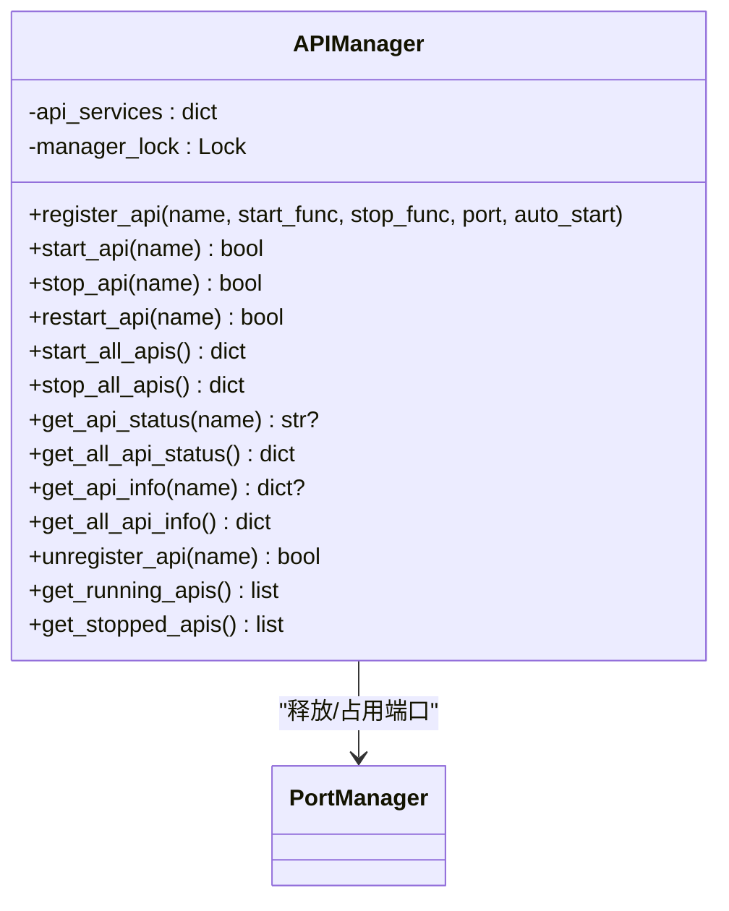
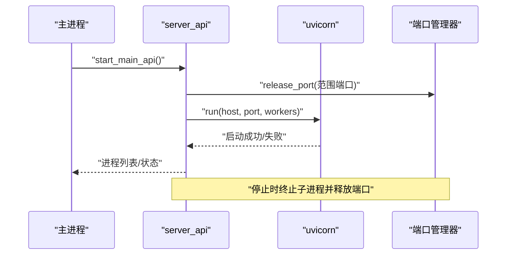
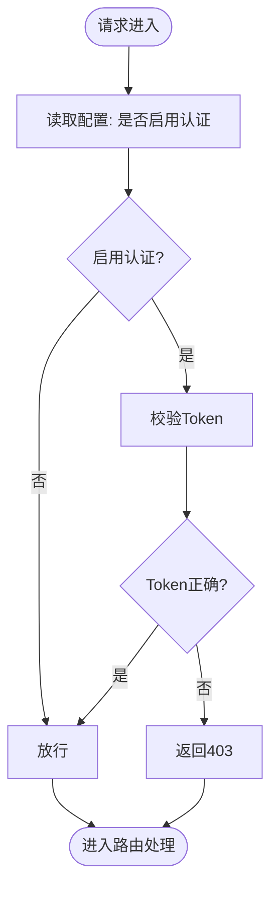
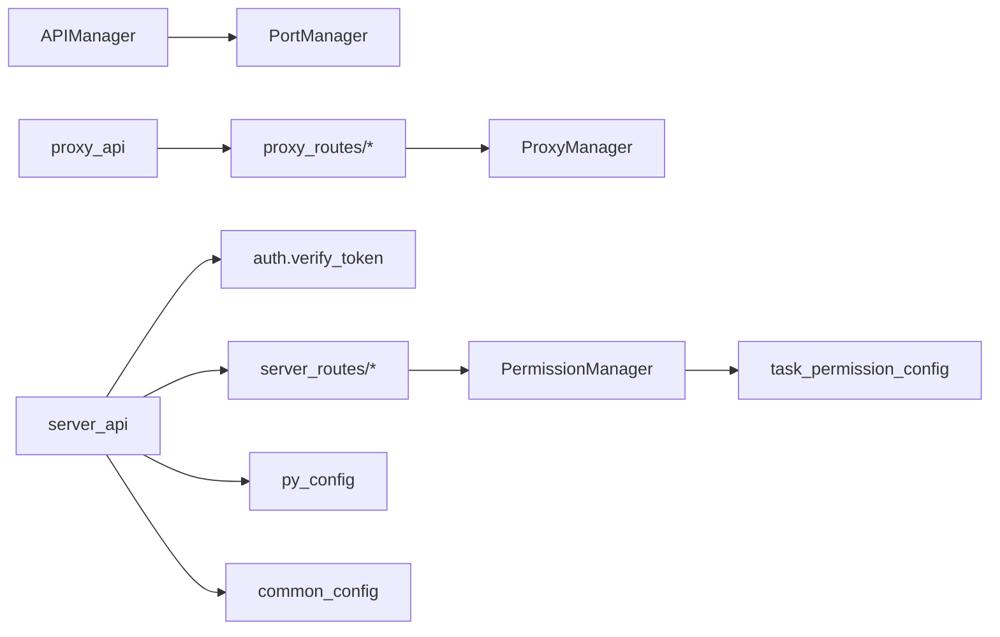

# API管理器

<cite>
**本文档引用的文件**
- [utils/api_manager.py](file://utils/api_manager.py)
- [api/server_api.py](file://api/server_api.py)
- [api/proxy_api.py](file://api/proxy_api.py)
- [api/server_routes/server_routes.py](file://api/server_routes/server_routes.py)
- [api/server_routes/common_routes.py](file://api/server_routes/common_routes.py)
- [api/server_routes/auth.py](file://api/server_routes/auth.py)
- [api/proxy_routes/proxy_routes.py](file://api/proxy_routes/proxy_routes.py)
- [lite_modules/port_manager.py](file://lite_modules/port_manager.py)
- [config/py_config.py](file://config/py_config.py)
- [config/common_config.py](file://config/common_config.py)
- [config/permission_manager.py](file://config/permission_manager.py)
- [config/task_permission_config.py](file://config/task_permission_config.py)
- [utils/proxy_manager.py](file://utils/proxy_manager.py)
- [main.py](file://main.py)
</cite>

## 目录
1. [简介](#简介)
2. [项目结构](#项目结构)
3. [核心组件](#核心组件)
4. [架构总览](#架构总览)
5. [详细组件分析](#详细组件分析)
6. [依赖分析](#依赖分析)
7. [性能考虑](#性能考虑)
8. [故障排查指南](#故障排查指南)
9. [结论](#结论)
10. [附录](#附录)

## 简介
本文件面向 ikun_temu_system 的 API 管理器，系统性阐述其架构设计与核心功能，涵盖：
- API 路由管理、请求处理与响应管理
- API 版本控制、认证授权与权限验证机制
- API 性能监控、限流控制与错误处理策略
- API 管理器的配置选项与自定义 API 端点开发方法
- API 管理器与 Web 框架的集成方式与中间件机制
- API 性能优化建议与安全防护措施
- API 管理器的测试方法与调试技巧

## 项目结构
API 管理器围绕统一的 API 管理器类与多个 FastAPI 应用展开，辅以端口管理、认证授权、权限管理与代理管理模块，形成“多进程 + 多应用 + 中间件 + 权限校验”的整体架构。

**图表来源**
- [api/server_api.py:122-474](file://api/server_api.py#L122-L474)
- [api/proxy_api.py:56-214](file://api/proxy_api.py#L56-L214)
- [utils/api_manager.py:13-273](file://utils/api_manager.py#L13-L273)
- [lite_modules/port_manager.py:17-338](file://lite_modules/port_manager.py#L17-L338)
- [api/server_routes/auth.py:7-19](file://api/server_routes/auth.py#L7-L19)
- [config/permission_manager.py:12-126](file://config/permission_manager.py#L12-L126)
- [config/task_permission_config.py:7-84](file://config/task_permission_config.py#L7-L84)
- [utils/proxy_manager.py:16-400](file://utils/proxy_manager.py#L16-L400)
- [config/py_config.py:4-93](file://config/py_config.py#L4-L93)
- [config/common_config.py:15-394](file://config/common_config.py#L15-L394)

**章节来源**
- [api/server_api.py:122-474](file://api/server_api.py#L122-L474)
- [api/proxy_api.py:56-214](file://api/proxy_api.py#L56-L214)
- [utils/api_manager.py:13-273](file://utils/api_manager.py#L13-L273)
- [lite_modules/port_manager.py:17-338](file://lite_modules/port_manager.py#L17-L338)

## 核心组件
- API 管理器（统一注册、启动、停止、重启、状态查询）
- FastAPI 主应用（服务器控制、设置管理、通用接口）
- FastAPI 代理应用（代理IP接收、测试、统计）
- 端口管理器（端口占用检测、进程释放、进程注册/注销）
- 认证中间件（基于配置的 Token 校验）
- 权限管理（数据库持久化权限、任务权限映射与校验）
- 代理管理器（代理IP测试、筛选、统计）

**章节来源**
- [utils/api_manager.py:13-273](file://utils/api_manager.py#L13-L273)
- [api/server_api.py:122-474](file://api/server_api.py#L122-L474)
- [api/proxy_api.py:56-214](file://api/proxy_api.py#L56-L214)
- [lite_modules/port_manager.py:17-338](file://lite_modules/port_manager.py#L17-L338)
- [api/server_routes/auth.py:7-19](file://api/server_routes/auth.py#L7-L19)
- [config/permission_manager.py:12-126](file://config/permission_manager.py#L12-L126)
- [utils/proxy_manager.py:16-400](file://utils/proxy_manager.py#L16-L400)

## 架构总览
API 管理器通过统一的注册与生命周期管理，协调多个 FastAPI 应用（主应用与代理应用）。主应用采用多进程部署，结合中间件实现版本头注入、CORS 与认证校验；代理应用负责代理 IP 的接收、测试与统计。端口管理器贯穿启动/停止流程，确保端口可用与进程清理。

**图表来源**
- [api/server_api.py:60-104](file://api/server_api.py#L60-L104)
- [api/server_routes/auth.py:7-19](file://api/server_routes/auth.py#L7-L19)
- [lite_modules/port_manager.py:176-202](file://lite_modules/port_manager.py#L176-L202)

**章节来源**
- [api/server_api.py:60-104](file://api/server_api.py#L60-L104)
- [api/server_routes/auth.py:7-19](file://api/server_routes/auth.py#L7-L19)
- [lite_modules/port_manager.py:176-202](file://lite_modules/port_manager.py#L176-L202)

## 详细组件分析

### API 管理器（APIManager）
- 职责：统一注册 API 服务（名称、启动/停止函数、端口、自动启动）、启动/停止/重启、状态查询、信息导出、注销与进程回收
- 并发安全：内部使用锁保护注册表与状态变更
- 生命周期：启动前释放端口，停止后释放端口；异常时回滚状态
- 扩展点：支持便捷函数与全局实例，便于在其他模块直接调用

**图表来源**
- [utils/api_manager.py:13-273](file://utils/api_manager.py#L13-L273)
- [lite_modules/port_manager.py:17-338](file://lite_modules/port_manager.py#L17-L338)

**章节来源**
- [utils/api_manager.py:13-273](file://utils/api_manager.py#L13-L273)

### FastAPI 主应用（server_api）
- 多进程部署：按配置启动多个工作进程，支持 worker 数配置
- 生命周期：lifespan 管理任务日志管理器的启动与优雅停止
- 中间件：版本头中间件、CORS、静态资源与模板
- 路由：通用接口、服务器控制、任务接口、店铺接口
- 启停控制：启动前释放端口、异常退出、周期重启线程

**图表来源**
- [api/server_api.py:122-247](file://api/server_api.py#L122-L247)
- [api/server_api.py:249-316](file://api/server_api.py#L249-L316)
- [lite_modules/port_manager.py:176-202](file://lite_modules/port_manager.py#L176-L202)

**章节来源**
- [api/server_api.py:122-247](file://api/server_api.py#L122-L247)
- [api/server_api.py:249-316](file://api/server_api.py#L249-L316)

### FastAPI 代理应用（proxy_api）
- 单进程部署，专注代理 IP 管理
- 路由：接收代理、测试代理、统计信息、本机 IP 测试
- 启停控制：启动前释放端口，停止时递归终止子进程

**章节来源**
- [api/proxy_api.py:56-214](file://api/proxy_api.py#L56-L214)
- [api/proxy_routes/proxy_routes.py:20-218](file://api/proxy_routes/proxy_routes.py#L20-L218)

### 认证与权限
- 认证：通过查询参数携带 Token，依据配置决定是否启用认证；不匹配则返回 403
- 权限：权限保存在数据库，支持加载、更新、清除；任务权限映射定义任务类型与所需权限的关系，提供任务权限校验

**图表来源**
- [api/server_routes/auth.py:7-19](file://api/server_routes/auth.py#L7-L19)
- [config/permission_manager.py:12-126](file://config/permission_manager.py#L12-L126)
- [config/task_permission_config.py:67-84](file://config/task_permission_config.py#L67-L84)

**章节来源**
- [api/server_routes/auth.py:7-19](file://api/server_routes/auth.py#L7-L19)
- [config/permission_manager.py:12-126](file://config/permission_manager.py#L12-L126)
- [config/task_permission_config.py:67-84](file://config/task_permission_config.py#L67-L84)

### 代理管理器（ProxyManager）
- 功能：接收代理列表、测试代理（同步/异步/多线程）、统计有效率、本机 IP 测试、随机代理获取
- 并发：测试过程加锁，避免重复测试；多线程测试时使用线程池
- 回调：测试完成后触发回调，便于 UI 或其他模块更新状态

**章节来源**
- [utils/proxy_manager.py:16-400](file://utils/proxy_manager.py#L16-L400)
- [api/proxy_routes/proxy_routes.py:20-218](file://api/proxy_routes/proxy_routes.py#L20-L218)

## 依赖分析
- API 管理器依赖端口管理器进行端口占用检测与进程释放
- 主应用依赖中间件（版本头/CORS）、路由模块、配置模块与进程守护
- 代理应用依赖代理路由与代理管理器
- 权限校验依赖权限管理器与任务权限映射

**图表来源**
- [utils/api_manager.py:13-273](file://utils/api_manager.py#L13-L273)
- [lite_modules/port_manager.py:17-338](file://lite_modules/port_manager.py#L17-L338)
- [api/server_api.py:60-104](file://api/server_api.py#L60-L104)
- [api/server_routes/auth.py:7-19](file://api/server_routes/auth.py#L7-L19)
- [api/server_routes/server_routes.py:91-289](file://api/server_routes/server_routes.py#L91-L289)
- [api/server_routes/common_routes.py:16-241](file://api/server_routes/common_routes.py#L16-L241)
- [api/proxy_api.py:56-214](file://api/proxy_api.py#L56-L214)
- [api/proxy_routes/proxy_routes.py:20-218](file://api/proxy_routes/proxy_routes.py#L20-L218)
- [config/permission_manager.py:12-126](file://config/permission_manager.py#L12-L126)
- [config/task_permission_config.py:7-84](file://config/task_permission_config.py#L7-L84)

**章节来源**
- [utils/api_manager.py:13-273](file://utils/api_manager.py#L13-L273)
- [lite_modules/port_manager.py:17-338](file://lite_modules/port_manager.py#L17-L338)
- [api/server_api.py:60-104](file://api/server_api.py#L60-L104)
- [api/server_routes/auth.py:7-19](file://api/server_routes/auth.py#L7-L19)
- [api/server_routes/server_routes.py:91-289](file://api/server_routes/server_routes.py#L91-L289)
- [api/server_routes/common_routes.py:16-241](file://api/server_routes/common_routes.py#L16-L241)
- [api/proxy_api.py:56-214](file://api/proxy_api.py#L56-L214)
- [api/proxy_routes/proxy_routes.py:20-218](file://api/proxy_routes/proxy_routes.py#L20-L218)
- [config/permission_manager.py:12-126](file://config/permission_manager.py#L12-L126)
- [config/task_permission_config.py:7-84](file://config/task_permission_config.py#L7-L84)

## 性能考虑
- 多进程与多 Worker：主应用支持多进程与每进程多 Worker，提升并发吞吐；合理设置进程数与 Worker 数以平衡 CPU 与内存
- 端口与进程管理：启动前释放端口，停止时递归终止子进程，避免僵尸进程与端口占用
- 代理测试并发：多线程测试代理，提高代理可用性评估效率；注意超时与回调机制
- 日志与清理：日志清理器按配置自动清理，减少磁盘压力；数据库 WAL 检查点合并降低文件损坏风险
- 版本头与静态资源：版本头中间件轻量无副作用；静态资源与模板按需挂载

**章节来源**
- [api/server_api.py:122-247](file://api/server_api.py#L122-L247)
- [api/server_api.py:249-316](file://api/server_api.py#L249-L316)
- [utils/proxy_manager.py:168-227](file://utils/proxy_manager.py#L168-L227)
- [config/common_config.py:59-135](file://config/common_config.py#L59-L135)

## 故障排查指南
- 启动失败（端口占用）
  - 现象：启动 uvicorn 抛出异常或进程立即退出
  - 排查：查看端口占用与进程 PID，确认是否被其他进程占用；使用端口管理器强制释放
  - 处理：启动前调用端口释放，必要时使用系统命令强制终止占用进程
- 认证失败
  - 现象：返回 403 Forbidden
  - 排查：确认是否启用认证、Token 是否正确；检查配置项
- 代理测试异常
  - 现象：代理测试耗时过长或失败
  - 排查：检查超时配置、网络连通性、代理有效性；查看测试历史与统计
- 全局异常
  - 现象：程序崩溃并记录异常日志
  - 处理：全局异常捕获写入 error.log 并安全关闭数据库

**章节来源**
- [api/server_api.py:122-138](file://api/server_api.py#L122-L138)
- [lite_modules/port_manager.py:176-202](file://lite_modules/port_manager.py#L176-L202)
- [api/server_routes/auth.py:7-19](file://api/server_routes/auth.py#L7-L19)
- [utils/proxy_manager.py:57-106](file://utils/proxy_manager.py#L57-L106)
- [main.py:21-53](file://main.py#L21-L53)

## 结论
API 管理器通过统一注册与生命周期管理，将多进程 FastAPI 应用、中间件、认证授权与权限体系整合为一体，具备良好的扩展性与稳定性。配合端口管理器与代理管理器，能够高效支撑服务器控制、设置管理与代理 IP 管理等场景。

## 附录

### API 版本控制
- 版本号来源：配置模块提供版本号与应用信息，中间件在响应头注入版本信息
- 建议：在路由层增加版本前缀或 Accept 头协商，逐步迁移至版本化路由

**章节来源**
- [config/py_config.py:24-30](file://config/py_config.py#L24-L30)
- [api/server_api.py:71-78](file://api/server_api.py#L71-L78)

### 认证授权与权限验证机制
- 认证：启用/禁用由配置控制，Token 通过查询参数传递
- 授权：权限保存在数据库，任务权限映射定义任务类型与所需权限的关系
- 建议：结合 JWT 或 Bearer Token 方案，增强安全性；对敏感接口增加权限校验

**章节来源**
- [api/server_routes/auth.py:7-19](file://api/server_routes/auth.py#L7-L19)
- [config/permission_manager.py:12-126](file://config/permission_manager.py#L12-L126)
- [config/task_permission_config.py:67-84](file://config/task_permission_config.py#L67-L84)

### 性能监控、限流与错误处理
- 监控：版本头中间件、日志清理器、数据库 WAL 检查点
- 限流：当前未见显式限流实现，可在中间件或路由层引入速率限制
- 错误处理：全局异常捕获、路由层 JSONResponse 返回错误信息

**章节来源**
- [api/server_api.py:71-78](file://api/server_api.py#L71-L78)
- [config/common_config.py:59-135](file://config/common_config.py#L59-L135)
- [main.py:21-53](file://main.py#L21-L53)

### 配置选项与自定义 API 端点开发
- 配置项（主应用）：内网/公网 IP、端口、进程数、每进程 Worker 数、Token、认证开关、重启间隔、CDN 模式、背景音乐等
- 配置项（代理应用）：代理端口、代理文件路径等
- 自定义端点：在对应路由模块新增 APIRouter 并注册到主应用；遵循认证中间件与权限校验

**章节来源**
- [api/server_routes/server_routes.py:231-289](file://api/server_routes/server_routes.py#L231-L289)
- [api/server_routes/common_routes.py:87-241](file://api/server_routes/common_routes.py#L87-L241)
- [config/py_config.py:13-31](file://config/py_config.py#L13-L31)

### 与 Web 框架集成与中间件机制
- FastAPI：lifespan 生命周期、CORS、静态资源与模板、版本头中间件
- 中间件：认证中间件（依赖配置）、CORS、版本头
- 集成：通过 include_router 注册路由模块，统一由主应用调度

**章节来源**
- [api/server_api.py:40-104](file://api/server_api.py#L40-L104)
- [api/server_routes/auth.py:7-19](file://api/server_routes/auth.py#L7-L19)

### 测试方法与调试技巧
- 代理测试：使用多线程测试代理，观察有效率与统计；本机 IP 测试辅助判断网络连通性
- 启停测试：通过 API 管理器启动/停止/重启应用，观察端口释放与进程状态
- 调试：利用全局异常捕获与日志输出定位问题；必要时开启详细日志级别

**章节来源**
- [utils/proxy_manager.py:168-227](file://utils/proxy_manager.py#L168-L227)
- [utils/api_manager.py:42-122](file://utils/api_manager.py#L42-L122)
- [main.py:21-53](file://main.py#L21-L53)