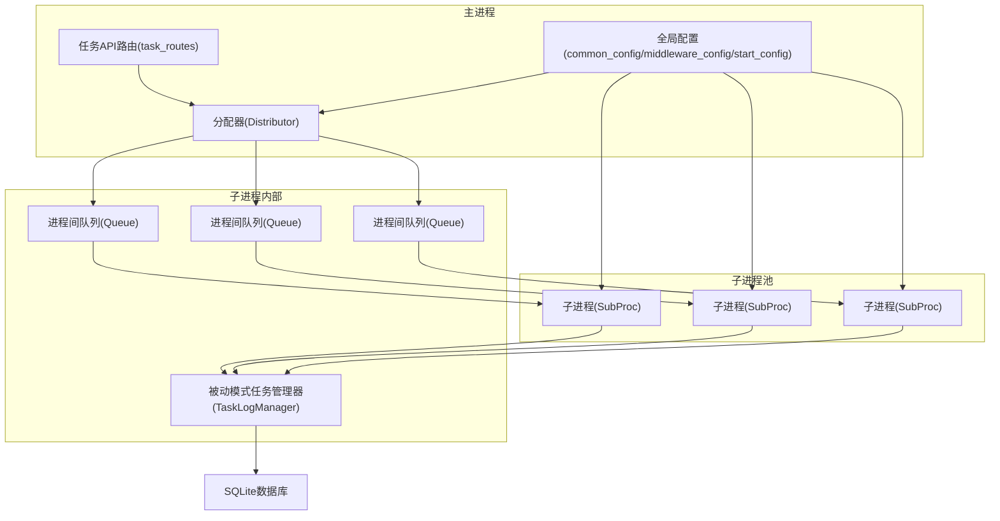
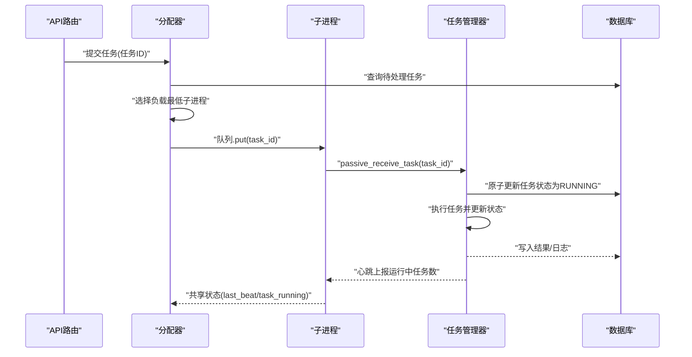
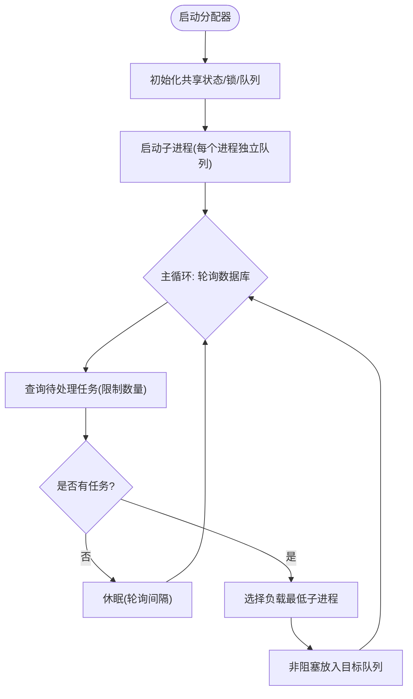
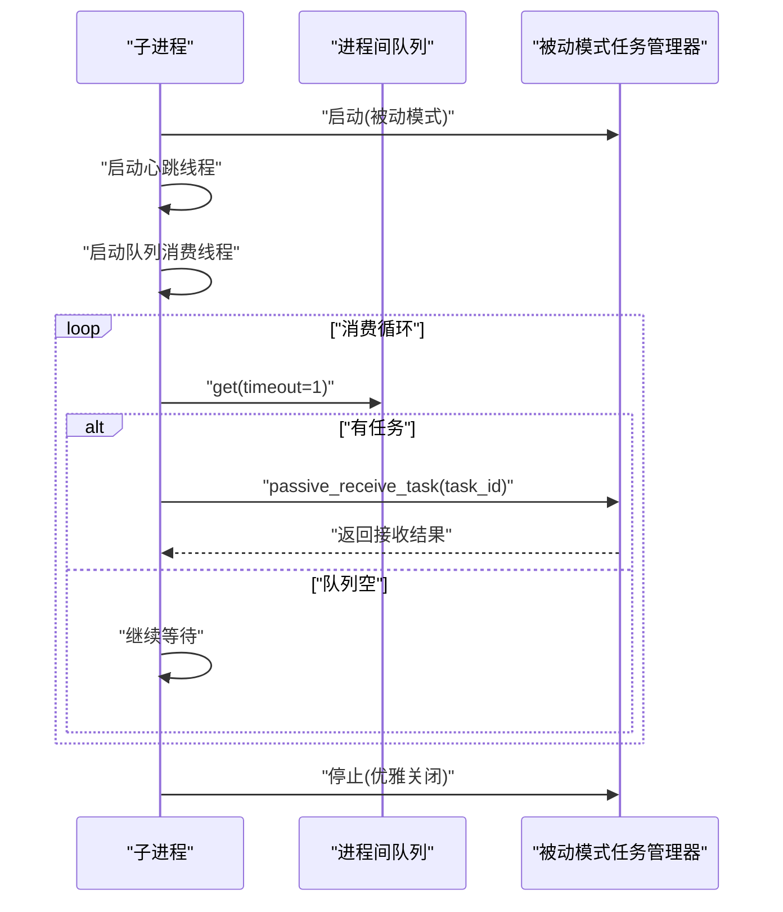
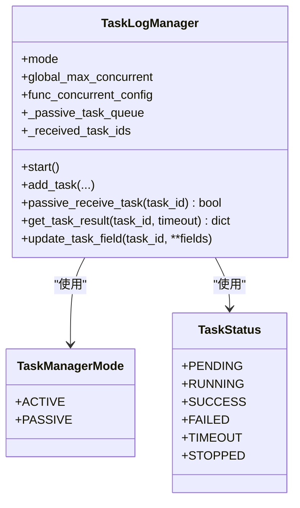
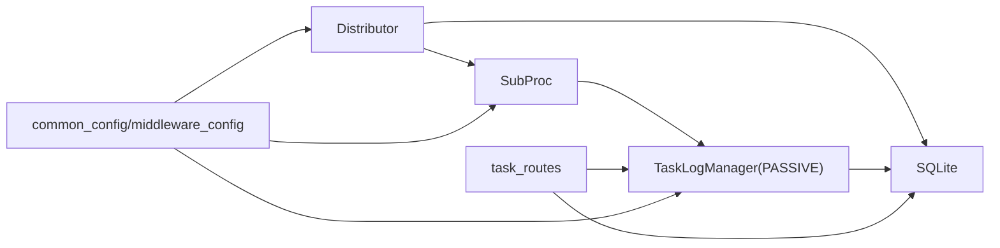

# 任务管理系统

<cite>
**本文档引用的文件**
- [modules/task_manager.py](file://modules/task_manager.py)
- [utils/multiThreading_log_manager.py](file://utils/multiThreading_log_manager.py)
- [utils/multiThreading_manager.py](file://utils/multiThreading_manager.py)
- [utils/process_guard.py](file://utils/process_guard.py)
- [api/server_routes/task_routes.py](file://api/server_routes/task_routes.py)
- [config/common_config.py](file://config/common_config.py)
- [config/middleware_config.py](file://config/middleware_config.py)
- [config/start_config.py](file://config/start_config.py)
- [main.py](file://main.py)
</cite>

## 目录
1. [简介](#简介)
2. [项目结构](#项目结构)
3. [核心组件](#核心组件)
4. [架构总览](#架构总览)
5. [详细组件分析](#详细组件分析)
6. [依赖分析](#依赖分析)
7. [性能考虑](#性能考虑)
8. [故障排除指南](#故障排除指南)
9. [结论](#结论)
10. [附录](#附录)

## 简介
本文件面向ikun_temu_system的任务管理系统，聚焦于多进程任务调度架构与中心化分配器的设计与实现。系统通过“分配器-子进程-任务管理器”的三层协作，实现任务的高效分发、负载均衡与状态追踪。核心创新点包括：
- 分配器（Distributor）集中轮询数据库，按进程负载将任务推送到各子进程的进程间队列；
- 子进程（SubProc）内嵌被动模式的任务管理器，仅负责接收与执行任务，避免跨进程共享复杂度；
- 任务管理器（TaskLogManager）支持主动/被动双模式，统一任务生命周期与日志落盘；
- 心跳检测与错误处理保障进程健康与任务一致性；
- 配置驱动的并发与队列容量，便于横向扩展与运维调优。

## 项目结构
围绕任务管理的关键模块与文件如下：
- 分配器与子进程：modules/task_manager.py
- 任务管理器（双模式）：utils/multiThreading_log_manager.py
- 通用多线程任务管理器（GUI/FastAPI使用）：utils/multiThreading_manager.py
- 进程守护与清理：utils/process_guard.py
- 任务API路由（提交、查询、定时任务）：api/server_routes/task_routes.py
- 全局配置与并发配置：config/common_config.py、config/middleware_config.py、config/start_config.py
- 程序入口与异常处理：main.py

图表来源
- [modules/task_manager.py:144-319](file://modules/task_manager.py#L144-L319)
- [utils/multiThreading_log_manager.py:122-204](file://utils/multiThreading_log_manager.py#L122-L204)
- [api/server_routes/task_routes.py:66-231](file://api/server_routes/task_routes.py#L66-L231)
- [config/common_config.py:141-367](file://config/common_config.py#L141-L367)

章节来源
- [modules/task_manager.py:144-319](file://modules/task_manager.py#L144-L319)
- [utils/multiThreading_log_manager.py:122-204](file://utils/multiThreading_log_manager.py#L122-L204)
- [api/server_routes/task_routes.py:66-231](file://api/server_routes/task_routes.py#L66-L231)
- [config/common_config.py:141-367](file://config/common_config.py#L141-L367)

## 核心组件
- 分配器（Distributor）：集中轮询数据库，按进程负载将任务推送到子进程队列；负责进程池生命周期与状态监控。
- 子进程（SubProc）：每个子进程内嵌被动模式任务管理器，负责接收任务并执行；内置心跳与队列消费线程。
- 任务管理器（TaskLogManager）：支持主动/被动双模式，统一任务状态、日志落盘与并发控制；被动模式通过队列接收任务。
- 通用多线程任务管理器（MainTaskManager）：用于GUI/FastAPI场景的轻量任务管理器，不参与多进程分配。
- 进程守护（ProcessGuard）：确保异常退出时清理子进程，避免僵尸进程。
- API路由（task_routes）：对外提供任务提交、查询、定时任务等接口，内部委托给任务管理器。

章节来源
- [modules/task_manager.py:144-319](file://modules/task_manager.py#L144-L319)
- [utils/multiThreading_log_manager.py:122-204](file://utils/multiThreading_log_manager.py#L122-L204)
- [utils/multiThreading_manager.py:42-555](file://utils/multiThreading_manager.py#L42-L555)
- [utils/process_guard.py:8-68](file://utils/process_guard.py#L8-L68)
- [api/server_routes/task_routes.py:66-231](file://api/server_routes/task_routes.py#L66-L231)

## 架构总览
系统采用“中心化分配 + 多进程执行”的架构。分配器负责：
- 以固定轮询间隔扫描数据库，获取待处理任务；
- 通过负载均衡算法选择目标子进程；
- 将任务ID放入对应子进程的进程间队列；
- 监控子进程心跳，剔除异常进程；
- 在停止时优雅关闭所有子进程与队列。

子进程负责：
- 启动被动模式任务管理器；
- 启动心跳线程与队列消费线程；
- 从队列取出任务并调用任务管理器接收方法；
- 通过任务管理器执行任务并更新状态。

图表来源
- [modules/task_manager.py:201-254](file://modules/task_manager.py#L201-L254)
- [utils/multiThreading_log_manager.py:254-306](file://utils/multiThreading_log_manager.py#L254-L306)
- [api/server_routes/task_routes.py:66-231](file://api/server_routes/task_routes.py#L66-L231)

## 详细组件分析

### 分配器（Distributor）
- 角色与职责
  - 启动多个子进程，为每个子进程创建独立队列；
  - 轮询数据库获取待处理任务，按进程负载选择目标子进程；
  - 将任务ID放入目标子进程队列，非阻塞写入避免主进程阻塞；
  - 监控子进程心跳，剔除超时或异常进程；
  - 停止时优雅关闭所有子进程与队列。
- 关键算法
  - 负载均衡：按“运行中任务数”升序排序，选择负载最低的子进程；
  - 心跳检测：基于last_beat与超时阈值判定进程健康；
  - 队列容量：每个子进程队列最大容量为全局最大并发数，避免堆积。
- 错误处理
  - 分发循环异常捕获与降速重试；
  - 队列满时跳过任务并告警；
  - 子进程异常时更新共享状态并记录错误。

图表来源
- [modules/task_manager.py:169-254](file://modules/task_manager.py#L169-L254)

章节来源
- [modules/task_manager.py:144-319](file://modules/task_manager.py#L144-L319)

### 子进程（SubProc）
- 角色与职责
  - 启动被动模式任务管理器，设置短轮询间隔；
  - 启动心跳线程与队列消费线程；
  - 从队列取出任务并调用任务管理器接收方法；
  - 更新共享状态（进程ID、运行中任务数、最近心跳时间）。
- 心跳机制
  - 定期调用任务管理器获取运行中任务数；
  - 更新共享状态，供分配器判断进程健康与负载。
- 队列消费
  - 队列消费线程以超时方式阻塞，避免永久阻塞；
  - 接收失败时记录告警，不影响主循环；
  - 停止时向队列放入哨兵值唤醒消费线程。

图表来源
- [modules/task_manager.py:34-142](file://modules/task_manager.py#L34-L142)
- [utils/multiThreading_log_manager.py:254-306](file://utils/multiThreading_log_manager.py#L254-L306)

章节来源
- [modules/task_manager.py:22-142](file://modules/task_manager.py#L22-L142)

### 任务管理器（TaskLogManager）
- 双模式支持
  - 主动模式：轮询数据库拾取任务；
  - 被动模式：从中心化分配的队列接收任务。
- 并发控制
  - 全局信号量与功能分组信号量双重控制；
  - 动态更新功能并发配置，实时生效。
- 日志与状态
  - 任务日志写入数据库，支持主任务聚合日志；
  - 统一任务状态枚举，支持超时与异常状态。
- 原子抢占
  - 被动接收任务时，先原子更新任务状态为RUNNING再入队，避免重复执行。

图表来源
- [utils/multiThreading_log_manager.py:122-204](file://utils/multiThreading_log_manager.py#L122-L204)
- [utils/multiThreading_log_manager.py:254-306](file://utils/multiThreading_log_manager.py#L254-L306)

章节来源
- [utils/multiThreading_log_manager.py:122-800](file://utils/multiThreading_log_manager.py#L122-L800)

### 通用多线程任务管理器（MainTaskManager）
- 适用场景：GUI/FastAPI等非多进程场景；
- 特点：无跨进程共享，仅本地线程池与队列；
- 并发控制：全局与功能分组信号量，动态调整；
- 结果查询：支持轮询获取任务结果，带超时控制。

章节来源
- [utils/multiThreading_manager.py:42-555](file://utils/multiThreading_manager.py#L42-L555)

### 进程守护（ProcessGuard）
- 作用：注册退出与信号处理器，确保异常退出时清理子进程；
- 机制：atexit与信号处理，按注册顺序逆序执行清理函数。

章节来源
- [utils/process_guard.py:8-68](file://utils/process_guard.py#L8-L68)

### API路由（task_routes）
- 任务提交：根据任务类型映射到具体包装器，生成唯一任务ID并提交至任务管理器；
- 任务查询：支持多条件筛选与分页，状态映射中文；
- 定时任务：支持一次性与周期性定时任务配置与立即执行。

章节来源
- [api/server_routes/task_routes.py:66-231](file://api/server_routes/task_routes.py#L66-L231)
- [api/server_routes/task_routes.py:694-800](file://api/server_routes/task_routes.py#L694-L800)

## 依赖分析
- 分配器依赖
  - 多进程Manager与RLock用于共享状态与互斥；
  - 每个子进程独立Queue，避免跨进程共享复杂度；
  - 任务管理器的被动模式接口用于接收任务。
- 任务管理器依赖
  - 数据库连接与配置（来自全局配置）；
  - 并发配置字典（来自中间层配置）；
  - 日志系统（Loguru）与线程安全锁。
- API路由依赖
  - 权限管理器与配置管理器；
  - 任务包装器与定时任务管理器。

图表来源
- [modules/task_manager.py:144-319](file://modules/task_manager.py#L144-L319)
- [utils/multiThreading_log_manager.py:122-204](file://utils/multiThreading_log_manager.py#L122-L204)
- [api/server_routes/task_routes.py:66-231](file://api/server_routes/task_routes.py#L66-L231)
- [config/common_config.py:141-367](file://config/common_config.py#L141-L367)

章节来源
- [modules/task_manager.py:144-319](file://modules/task_manager.py#L144-L319)
- [utils/multiThreading_log_manager.py:122-204](file://utils/multiThreading_log_manager.py#L122-L204)
- [api/server_routes/task_routes.py:66-231](file://api/server_routes/task_routes.py#L66-L231)
- [config/common_config.py:141-367](file://config/common_config.py#L141-L367)

## 性能考虑
- 并发与队列容量
  - 子进程队列容量等于全局最大并发，避免任务堆积；
  - 全局与功能分组信号量双重限制，防止过载。
- 轮询与心跳
  - 主进程轮询间隔可调，平衡吞吐与CPU占用；
  - 子进程心跳短周期，快速反映负载变化。
- 数据库与日志
  - 任务日志写入数据库，避免内存膨胀；
  - 数据库WAL模式与缓存配置提升I/O性能。
- 超时与重试
  - 任务超时控制与异常降速，避免雪崩效应；
  - 队列满时非阻塞写入，降低主循环阻塞风险。

[本节为通用性能建议，无需特定文件引用]

## 故障排除指南
- 子进程无响应
  - 检查心跳last_beat是否持续更新；
  - 查看共享状态中进程ID与运行中任务数；
  - 若超时，分配器会将其剔除，需重启子进程。
- 任务接收失败
  - passive_receive_task返回False时，检查队列是否满或任务状态异常；
  - 确认任务状态原子更新是否成功（RUNNING）。
- 队列阻塞
  - 消费线程以超时方式阻塞，避免永久阻塞；
  - 停止时向队列放入哨兵值唤醒消费线程。
- 数据库异常
  - 使用全局异常捕获与数据库安全关闭；
  - 启动时清理未完成子任务与重复主任务。
- 权限不足
  - API路由在执行前进行权限校验，失败时任务状态标记为FAILED。

章节来源
- [modules/task_manager.py:84-142](file://modules/task_manager.py#L84-L142)
- [utils/multiThreading_log_manager.py:254-306](file://utils/multiThreading_log_manager.py#L254-L306)
- [main.py:21-53](file://main.py#L21-L53)

## 结论
该任务管理系统通过“中心化分配 + 多进程执行 + 被动模式任务管理器”的设计，在保证高并发与高可用的同时，显著降低了跨进程共享的复杂度。分配器负责任务分发与进程治理，子进程专注任务执行与状态上报，任务管理器统一生命周期与日志。配合完善的配置、心跳与错误处理机制，系统具备良好的可扩展性与可维护性。

[本节为总结性内容，无需特定文件引用]

## 附录

### 配置参数说明
- 分配器配置
  - 进程数量：进程池大小，影响并发执行能力；
  - 单进程线程上限：子进程内任务管理器的最大并发；
  - 数据库轮询间隔：主进程扫描待处理任务的频率；
  - 单次获取任务上限：每次轮询获取的任务数量；
  - 进程心跳超时：判定子进程异常的时间阈值。
- 任务管理器配置
  - 全局最大并发：全局信号量上限；
  - 功能并发配置：按功能分组的并发上限；
  - 任务超时：单任务执行超时时间；
  - 轮询间隔：主动模式下的轮询周期。
- 数据库配置
  - WAL模式、缓存大小、同步级别等，提升I/O性能与可靠性。

章节来源
- [modules/task_manager.py:15-19](file://modules/task_manager.py#L15-L19)
- [config/common_config.py:141-367](file://config/common_config.py#L141-L367)
- [utils/multiThreading_log_manager.py:129-179](file://utils/multiThreading_log_manager.py#L129-L179)

### 任务队列设计与实现
- 队列容量管理
  - 子进程队列容量等于全局最大并发，避免堆积；
  - 非阻塞写入，主进程轮询不受队列满影响。
- 阻塞处理
  - 消费线程以超时方式阻塞，避免永久阻塞；
  - 停止时哨兵值唤醒，确保优雅退出。

章节来源
- [modules/task_manager.py:173-240](file://modules/task_manager.py#L173-L240)
- [modules/task_manager.py:105-129](file://modules/task_manager.py#L105-L129)

### 扩展与定制开发指导
- 新增任务类型
  - 在API路由中增加任务类型映射与包装器调用；
  - 生成唯一任务ID并提交至任务管理器。
- 调整并发策略
  - 修改全局最大并发与功能分组并发配置；
  - 动态更新后立即生效，无需重启。
- 自定义负载均衡
  - 可替换“运行中任务数”为更复杂的负载指标（CPU、内存、队列长度等）；
  - 在分配器中扩展选择算法。
- 增强监控与告警
  - 在共享状态中加入更多指标（错误率、平均耗时等）；
  - 结合日志与数据库状态进行可视化监控。

章节来源
- [api/server_routes/task_routes.py:66-231](file://api/server_routes/task_routes.py#L66-L231)
- [utils/multiThreading_log_manager.py:672-682](file://utils/multiThreading_log_manager.py#L672-L682)
- [modules/task_manager.py:183-199](file://modules/task_manager.py#L183-L199)