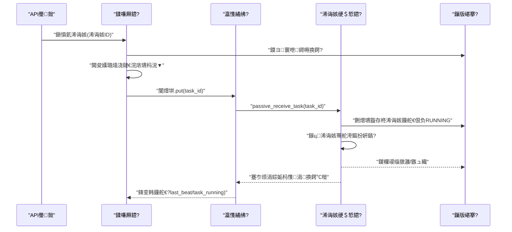
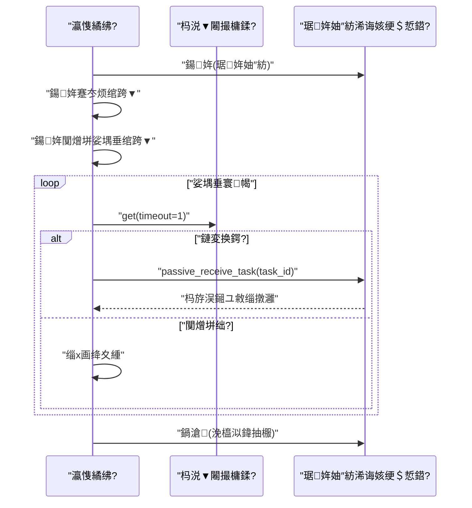
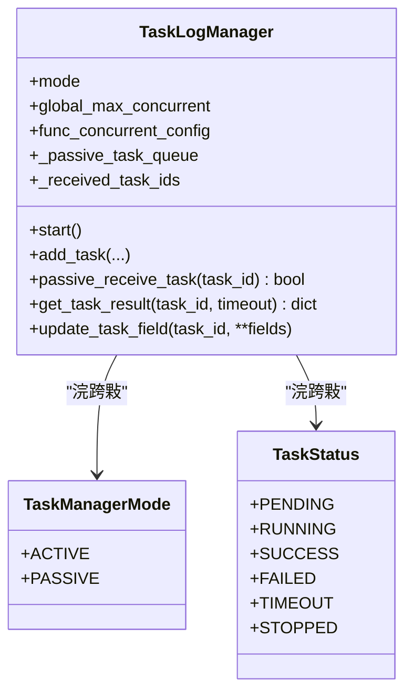
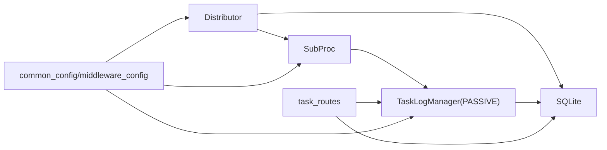

# 浠诲姟绠＄悊绯荤粺

<cite>
**鏈枃妗ｅ紩鐢ㄧ殑鏂囦欢**
- [modules/task_manager.py](file://modules/task_manager.py)
- [utils/multiThreading_log_manager.py](file://utils/multiThreading_log_manager.py)
- [utils/multiThreading_manager.py](file://utils/multiThreading_manager.py)
- [utils/process_guard.py](file://utils/process_guard.py)
- [api/server_routes/task_routes.py](file://api/server_routes/task_routes.py)
- [config/common_config.py](file://config/common_config.py)
- [config/middleware_config.py](file://config/middleware_config.py)
- [config/start_config.py](file://config/start_config.py)
- [main.py](file://main.py)
</cite>

## 鐩綍
1. [绠€浠媇(#绠€浠?
2. [椤圭洰缁撴瀯](#椤圭洰缁撴瀯)
3. [鏍稿績缁勪欢](#鏍稿績缁勪欢)
4. [鏋舵瀯鎬昏](#鏋舵瀯鎬昏)
5. [璇︾粏缁勪欢鍒嗘瀽](#璇︾粏缁勪欢鍒嗘瀽)
6. [渚濊禆鍒嗘瀽](#渚濊禆鍒嗘瀽)
7. [鎬ц兘鑰冭檻](#鎬ц兘鑰冭檻)
8. [鏁呴殰鎺掗櫎鎸囧崡](#鏁呴殰鎺掗櫎鎸囧崡)
9. [缁撹](#缁撹)
10. [闄勫綍](#闄勫綍)

## 绠€浠?鏈枃浠堕潰鍚慽kun_temu_system鐨勪换鍔＄鐞嗙郴缁燂紝鑱氱劍浜庡杩涚▼浠诲姟璋冨害鏋舵瀯涓庝腑蹇冨寲鍒嗛厤鍣ㄧ殑璁捐涓庡疄鐜般€傜郴缁熼€氳繃鈥滃垎閰嶅櫒-瀛愯繘绋?浠诲姟绠＄悊鍣ㄢ€濈殑涓夊眰鍗忎綔锛屽疄鐜颁换鍔＄殑楂樻晥鍒嗗彂銆佽礋杞藉潎琛′笌鐘舵€佽拷韪€傛牳蹇冨垱鏂扮偣鍖呮嫭锛?- 鍒嗛厤鍣紙Distributor锛夐泦涓疆璇㈡暟鎹簱锛屾寜杩涚▼璐熻浇灏嗕换鍔℃帹閫佸埌鍚勫瓙杩涚▼鐨勮繘绋嬮棿闃熷垪锛?- 瀛愯繘绋嬶紙SubProc锛夊唴宓岃鍔ㄦā寮忕殑浠诲姟绠＄悊鍣紝浠呰礋璐ｆ帴鏀朵笌鎵ц浠诲姟锛岄伩鍏嶈法杩涚▼鍏变韩澶嶆潅搴︼紱
- 浠诲姟绠＄悊鍣紙TaskLogManager锛夋敮鎸佷富鍔?琚姩鍙屾ā寮忥紝缁熶竴浠诲姟鐢熷懡鍛ㄦ湡涓庢棩蹇楄惤鐩橈紱
- 蹇冭烦妫€娴嬩笌閿欒澶勭悊淇濋殰杩涚▼鍋ュ悍涓庝换鍔′竴鑷存€э紱
- 閰嶇疆椹卞姩鐨勫苟鍙戜笌闃熷垪瀹归噺锛屼究浜庢í鍚戞墿灞曚笌杩愮淮璋冧紭銆?
## 椤圭洰缁撴瀯
鍥寸粫浠诲姟绠＄悊鐨勫叧閿ā鍧椾笌鏂囦欢濡備笅锛?- 鍒嗛厤鍣ㄤ笌瀛愯繘绋嬶細modules/task_manager.py
- 浠诲姟绠＄悊鍣紙鍙屾ā寮忥級锛歶tils/multiThreading_log_manager.py
- 閫氱敤澶氱嚎绋嬩换鍔＄鐞嗗櫒锛圙UI/FastAPI浣跨敤锛夛細utils/multiThreading_manager.py
- 杩涚▼瀹堟姢涓庢竻鐞嗭細utils/process_guard.py
- 浠诲姟API璺敱锛堟彁浜ゃ€佹煡璇€佸畾鏃朵换鍔★級锛歛pi/server_routes/task_routes.py
- 鍏ㄥ眬閰嶇疆涓庡苟鍙戦厤缃細config/common_config.py銆乧onfig/middleware_config.py銆乧onfig/start_config.py
- 绋嬪簭鍏ュ彛涓庡紓甯稿鐞嗭細main.py

```mermaid
graph TB
subgraph "涓昏繘绋?
Distributor["鍒嗛厤鍣?Distributor)"]
API["浠诲姟API璺敱(task_routes)"]
Config["鍏ㄥ眬閰嶇疆(common_config/middleware_config/start_config)"]
end
subgraph "瀛愯繘绋嬫睜"
SubProc1["瀛愯繘绋?SubProc)"]
SubProc2["瀛愯繘绋?SubProc)"]
SubProcN["瀛愯繘绋?SubProc)"]
end
subgraph "瀛愯繘绋嬪唴閮?
TLM_Passive["琚姩妯″紡浠诲姟绠＄悊鍣?TaskLogManager)"]
Queue1["杩涚▼闂撮槦鍒?Queue)"]
Queue2["杩涚▼闂撮槦鍒?Queue)"]
QueueN["杩涚▼闂撮槦鍒?Queue)"]
end
DB["SQLite鏁版嵁搴?]
API --> Distributor
Distributor --> Queue1
Distributor --> Queue2
Distributor --> QueueN
Queue1 --> SubProc1 --> TLM_Passive
Queue2 --> SubProc2 --> TLM_Passive
QueueN --> SubProcN --> TLM_Passive
TLM_Passive --> DB
Config --> Distributor
Config --> SubProc1
Config --> SubProc2
Config --> SubProcN
```

鍥捐〃鏉ユ簮
- [modules/task_manager.py:144-319](file://modules/task_manager.py#L144-L319)
- [utils/multiThreading_log_manager.py:122-204](file://utils/multiThreading_log_manager.py#L122-L204)
- [api/server_routes/task_routes.py:66-231](file://api/server_routes/task_routes.py#L66-L231)
- [config/common_config.py:141-367](file://config/common_config.py#L141-L367)

绔犺妭鏉ユ簮
- [modules/task_manager.py:144-319](file://modules/task_manager.py#L144-L319)
- [utils/multiThreading_log_manager.py:122-204](file://utils/multiThreading_log_manager.py#L122-L204)
- [api/server_routes/task_routes.py:66-231](file://api/server_routes/task_routes.py#L66-L231)
- [config/common_config.py:141-367](file://config/common_config.py#L141-L367)

## 鏍稿績缁勪欢
- 鍒嗛厤鍣紙Distributor锛夛細闆嗕腑杞鏁版嵁搴擄紝鎸夎繘绋嬭礋杞藉皢浠诲姟鎺ㄩ€佸埌瀛愯繘绋嬮槦鍒楋紱璐熻矗杩涚▼姹犵敓鍛藉懆鏈熶笌鐘舵€佺洃鎺с€?- 瀛愯繘绋嬶紙SubProc锛夛細姣忎釜瀛愯繘绋嬪唴宓岃鍔ㄦā寮忎换鍔＄鐞嗗櫒锛岃礋璐ｆ帴鏀朵换鍔″苟鎵ц锛涘唴缃績璺充笌闃熷垪娑堣垂绾跨▼銆?- 浠诲姟绠＄悊鍣紙TaskLogManager锛夛細鏀寔涓诲姩/琚姩鍙屾ā寮忥紝缁熶竴浠诲姟鐘舵€併€佹棩蹇楄惤鐩樹笌骞跺彂鎺у埗锛涜鍔ㄦā寮忛€氳繃闃熷垪鎺ユ敹浠诲姟銆?- 閫氱敤澶氱嚎绋嬩换鍔＄鐞嗗櫒锛圡ainTaskManager锛夛細鐢ㄤ簬GUI/FastAPI鍦烘櫙鐨勮交閲忎换鍔＄鐞嗗櫒锛屼笉鍙備笌澶氳繘绋嬪垎閰嶃€?- 杩涚▼瀹堟姢锛圥rocessGuard锛夛細纭繚寮傚父閫€鍑烘椂娓呯悊瀛愯繘绋嬶紝閬垮厤鍍靛案杩涚▼銆?- API璺敱锛坱ask_routes锛夛細瀵瑰鎻愪緵浠诲姟鎻愪氦銆佹煡璇€佸畾鏃朵换鍔＄瓑鎺ュ彛锛屽唴閮ㄥ鎵樼粰浠诲姟绠＄悊鍣ㄣ€?
绔犺妭鏉ユ簮
- [modules/task_manager.py:144-319](file://modules/task_manager.py#L144-L319)
- [utils/multiThreading_log_manager.py:122-204](file://utils/multiThreading_log_manager.py#L122-L204)
- [utils/multiThreading_manager.py:42-555](file://utils/multiThreading_manager.py#L42-L555)
- [utils/process_guard.py:8-68](file://utils/process_guard.py#L8-L68)
- [api/server_routes/task_routes.py:66-231](file://api/server_routes/task_routes.py#L66-L231)

## 鏋舵瀯鎬昏
绯荤粺閲囩敤鈥滀腑蹇冨寲鍒嗛厤 + 澶氳繘绋嬫墽琛屸€濈殑鏋舵瀯銆傚垎閰嶅櫒璐熻矗锛?- 浠ュ浐瀹氳疆璇㈤棿闅旀壂鎻忔暟鎹簱锛岃幏鍙栧緟澶勭悊浠诲姟锛?- 閫氳繃璐熻浇鍧囪　绠楁硶閫夋嫨鐩爣瀛愯繘绋嬶紱
- 灏嗕换鍔D鏀惧叆瀵瑰簲瀛愯繘绋嬬殑杩涚▼闂撮槦鍒楋紱
- 鐩戞帶瀛愯繘绋嬪績璺筹紝鍓旈櫎寮傚父杩涚▼锛?- 鍦ㄥ仠姝㈡椂浼橀泤鍏抽棴鎵€鏈夊瓙杩涚▼涓庨槦鍒椼€?
瀛愯繘绋嬭礋璐ｏ細
- 鍚姩琚姩妯″紡浠诲姟绠＄悊鍣紱
- 鍚姩蹇冭烦绾跨▼涓庨槦鍒楁秷璐圭嚎绋嬶紱
- 浠庨槦鍒楀彇鍑轰换鍔″苟璋冪敤浠诲姟绠＄悊鍣ㄦ帴鏀舵柟娉曪紱
- 閫氳繃浠诲姟绠＄悊鍣ㄦ墽琛屼换鍔″苟鏇存柊鐘舵€併€?


鍥捐〃鏉ユ簮
- [modules/task_manager.py:201-254](file://modules/task_manager.py#L201-L254)
- [utils/multiThreading_log_manager.py:254-306](file://utils/multiThreading_log_manager.py#L254-L306)
- [api/server_routes/task_routes.py:66-231](file://api/server_routes/task_routes.py#L66-L231)

## 璇︾粏缁勪欢鍒嗘瀽

### 鍒嗛厤鍣紙Distributor锛?- 瑙掕壊涓庤亴璐?  - 鍚姩澶氫釜瀛愯繘绋嬶紝涓烘瘡涓瓙杩涚▼鍒涘缓鐙珛闃熷垪锛?  - 杞鏁版嵁搴撹幏鍙栧緟澶勭悊浠诲姟锛屾寜杩涚▼璐熻浇閫夋嫨鐩爣瀛愯繘绋嬶紱
  - 灏嗕换鍔D鏀惧叆鐩爣瀛愯繘绋嬮槦鍒楋紝闈為樆濉炲啓鍏ラ伩鍏嶄富杩涚▼闃诲锛?  - 鐩戞帶瀛愯繘绋嬪績璺筹紝鍓旈櫎瓒呮椂鎴栧紓甯歌繘绋嬶紱
  - 鍋滄鏃朵紭闆呭叧闂墍鏈夊瓙杩涚▼涓庨槦鍒椼€?- 鍏抽敭绠楁硶
  - 璐熻浇鍧囪　锛氭寜鈥滆繍琛屼腑浠诲姟鏁扳€濆崌搴忔帓搴忥紝閫夋嫨璐熻浇鏈€浣庣殑瀛愯繘绋嬶紱
  - 蹇冭烦妫€娴嬶細鍩轰簬last_beat涓庤秴鏃堕槇鍊煎垽瀹氳繘绋嬪仴搴凤紱
  - 闃熷垪瀹归噺锛氭瘡涓瓙杩涚▼闃熷垪鏈€澶у閲忎负鍏ㄥ眬鏈€澶у苟鍙戞暟锛岄伩鍏嶅爢绉€?- 閿欒澶勭悊
  - 鍒嗗彂寰幆寮傚父鎹曡幏涓庨檷閫熼噸璇曪紱
  - 闃熷垪婊℃椂璺宠繃浠诲姟骞跺憡璀︼紱
  - 瀛愯繘绋嬪紓甯告椂鏇存柊鍏变韩鐘舵€佸苟璁板綍閿欒銆?
```mermaid
flowchart TD
Start(["鍚姩鍒嗛厤鍣?]) --> Init["鍒濆鍖栧叡浜姸鎬?閿?闃熷垪"]
Init --> StartProcs["鍚姩瀛愯繘绋?姣忎釜杩涚▼鐙珛闃熷垪)"]
StartProcs --> Loop{"涓诲惊鐜? 杞鏁版嵁搴?}
Loop --> GetTasks["鏌ヨ寰呭鐞嗕换鍔?闄愬埗鏁伴噺)"]
GetTasks --> HasTasks{"鏄惁鏈変换鍔?"}
HasTasks --> |鍚 Sleep["浼戠湢(杞闂撮殧)"] --> Loop
HasTasks --> |鏄瘄 SelectProc["閫夋嫨璐熻浇鏈€浣庡瓙杩涚▼"]
SelectProc --> PutQueue["闈為樆濉炴斁鍏ョ洰鏍囬槦鍒?]
PutQueue --> Loop
```

鍥捐〃鏉ユ簮
- [modules/task_manager.py:169-254](file://modules/task_manager.py#L169-L254)

绔犺妭鏉ユ簮
- [modules/task_manager.py:144-319](file://modules/task_manager.py#L144-L319)

### 瀛愯繘绋嬶紙SubProc锛?- 瑙掕壊涓庤亴璐?  - 鍚姩琚姩妯″紡浠诲姟绠＄悊鍣紝璁剧疆鐭疆璇㈤棿闅旓紱
  - 鍚姩蹇冭烦绾跨▼涓庨槦鍒楁秷璐圭嚎绋嬶紱
  - 浠庨槦鍒楀彇鍑轰换鍔″苟璋冪敤浠诲姟绠＄悊鍣ㄦ帴鏀舵柟娉曪紱
  - 鏇存柊鍏变韩鐘舵€侊紙杩涚▼ID銆佽繍琛屼腑浠诲姟鏁般€佹渶杩戝績璺虫椂闂达級銆?- 蹇冭烦鏈哄埗
  - 瀹氭湡璋冪敤浠诲姟绠＄悊鍣ㄨ幏鍙栬繍琛屼腑浠诲姟鏁帮紱
  - 鏇存柊鍏变韩鐘舵€侊紝渚涘垎閰嶅櫒鍒ゆ柇杩涚▼鍋ュ悍涓庤礋杞姐€?- 闃熷垪娑堣垂
  - 闃熷垪娑堣垂绾跨▼浠ヨ秴鏃舵柟寮忛樆濉烇紝閬垮厤姘镐箙闃诲锛?  - 鎺ユ敹澶辫触鏃惰褰曞憡璀︼紝涓嶅奖鍝嶄富寰幆锛?  - 鍋滄鏃跺悜闃熷垪鏀惧叆鍝ㄥ叺鍊煎敜閱掓秷璐圭嚎绋嬨€?


鍥捐〃鏉ユ簮
- [modules/task_manager.py:34-142](file://modules/task_manager.py#L34-L142)
- [utils/multiThreading_log_manager.py:254-306](file://utils/multiThreading_log_manager.py#L254-L306)

绔犺妭鏉ユ簮
- [modules/task_manager.py:22-142](file://modules/task_manager.py#L22-L142)

### 浠诲姟绠＄悊鍣紙TaskLogManager锛?- 鍙屾ā寮忔敮鎸?  - 涓诲姩妯″紡锛氳疆璇㈡暟鎹簱鎷惧彇浠诲姟锛?  - 琚姩妯″紡锛氫粠涓績鍖栧垎閰嶇殑闃熷垪鎺ユ敹浠诲姟銆?- 骞跺彂鎺у埗
  - 鍏ㄥ眬淇″彿閲忎笌鍔熻兘鍒嗙粍淇″彿閲忓弻閲嶆帶鍒讹紱
  - 鍔ㄦ€佹洿鏂板姛鑳藉苟鍙戦厤缃紝瀹炴椂鐢熸晥銆?- 鏃ュ織涓庣姸鎬?  - 浠诲姟鏃ュ織鍐欏叆鏁版嵁搴擄紝鏀寔涓讳换鍔¤仛鍚堟棩蹇楋紱
  - 缁熶竴浠诲姟鐘舵€佹灇涓撅紝鏀寔瓒呮椂涓庡紓甯哥姸鎬併€?- 鍘熷瓙鎶㈠崰
  - 琚姩鎺ユ敹浠诲姟鏃讹紝鍏堝師瀛愭洿鏂颁换鍔＄姸鎬佷负RUNNING鍐嶅叆闃燂紝閬垮厤閲嶅鎵ц銆?


鍥捐〃鏉ユ簮
- [utils/multiThreading_log_manager.py:122-204](file://utils/multiThreading_log_manager.py#L122-L204)
- [utils/multiThreading_log_manager.py:254-306](file://utils/multiThreading_log_manager.py#L254-L306)

绔犺妭鏉ユ簮
- [utils/multiThreading_log_manager.py:122-800](file://utils/multiThreading_log_manager.py#L122-L800)

### 閫氱敤澶氱嚎绋嬩换鍔＄鐞嗗櫒锛圡ainTaskManager锛?- 閫傜敤鍦烘櫙锛欸UI/FastAPI绛夐潪澶氳繘绋嬪満鏅紱
- 鐗圭偣锛氭棤璺ㄨ繘绋嬪叡浜紝浠呮湰鍦扮嚎绋嬫睜涓庨槦鍒楋紱
- 骞跺彂鎺у埗锛氬叏灞€涓庡姛鑳藉垎缁勪俊鍙烽噺锛屽姩鎬佽皟鏁达紱
- 缁撴灉鏌ヨ锛氭敮鎸佽疆璇㈣幏鍙栦换鍔＄粨鏋滐紝甯﹁秴鏃舵帶鍒躲€?
绔犺妭鏉ユ簮
- [utils/multiThreading_manager.py:42-555](file://utils/multiThreading_manager.py#L42-L555)

### 杩涚▼瀹堟姢锛圥rocessGuard锛?- 浣滅敤锛氭敞鍐岄€€鍑轰笌淇″彿澶勭悊鍣紝纭繚寮傚父閫€鍑烘椂娓呯悊瀛愯繘绋嬶紱
- 鏈哄埗锛歛texit涓庝俊鍙峰鐞嗭紝鎸夋敞鍐岄『搴忛€嗗簭鎵ц娓呯悊鍑芥暟銆?
绔犺妭鏉ユ簮
- [utils/process_guard.py:8-68](file://utils/process_guard.py#L8-L68)

### API璺敱锛坱ask_routes锛?- 浠诲姟鎻愪氦锛氭牴鎹换鍔＄被鍨嬫槧灏勫埌鍏蜂綋鍖呰鍣紝鐢熸垚鍞竴浠诲姟ID骞舵彁浜よ嚦浠诲姟绠＄悊鍣紱
- 浠诲姟鏌ヨ锛氭敮鎸佸鏉′欢绛涢€変笌鍒嗛〉锛岀姸鎬佹槧灏勪腑鏂囷紱
- 瀹氭椂浠诲姟锛氭敮鎸佷竴娆℃€т笌鍛ㄦ湡鎬у畾鏃朵换鍔￠厤缃笌绔嬪嵆鎵ц銆?
绔犺妭鏉ユ簮
- [api/server_routes/task_routes.py:66-231](file://api/server_routes/task_routes.py#L66-L231)
- [api/server_routes/task_routes.py:694-800](file://api/server_routes/task_routes.py#L694-L800)

## 渚濊禆鍒嗘瀽
- 鍒嗛厤鍣ㄤ緷璧?  - 澶氳繘绋婱anager涓嶳Lock鐢ㄤ簬鍏变韩鐘舵€佷笌浜掓枼锛?  - 姣忎釜瀛愯繘绋嬬嫭绔婹ueue锛岄伩鍏嶈法杩涚▼鍏变韩澶嶆潅搴︼紱
  - 浠诲姟绠＄悊鍣ㄧ殑琚姩妯″紡鎺ュ彛鐢ㄤ簬鎺ユ敹浠诲姟銆?- 浠诲姟绠＄悊鍣ㄤ緷璧?  - 鏁版嵁搴撹繛鎺ヤ笌閰嶇疆锛堟潵鑷叏灞€閰嶇疆锛夛紱
  - 骞跺彂閰嶇疆瀛楀吀锛堟潵鑷腑闂村眰閰嶇疆锛夛紱
  - 鏃ュ織绯荤粺锛圠oguru锛変笌绾跨▼瀹夊叏閿併€?- API璺敱渚濊禆
  - 鏉冮檺绠＄悊鍣ㄤ笌閰嶇疆绠＄悊鍣紱
  - 浠诲姟鍖呰鍣ㄤ笌瀹氭椂浠诲姟绠＄悊鍣ㄣ€?


鍥捐〃鏉ユ簮
- [modules/task_manager.py:144-319](file://modules/task_manager.py#L144-L319)
- [utils/multiThreading_log_manager.py:122-204](file://utils/multiThreading_log_manager.py#L122-L204)
- [api/server_routes/task_routes.py:66-231](file://api/server_routes/task_routes.py#L66-L231)
- [config/common_config.py:141-367](file://config/common_config.py#L141-L367)

绔犺妭鏉ユ簮
- [modules/task_manager.py:144-319](file://modules/task_manager.py#L144-L319)
- [utils/multiThreading_log_manager.py:122-204](file://utils/multiThreading_log_manager.py#L122-L204)
- [api/server_routes/task_routes.py:66-231](file://api/server_routes/task_routes.py#L66-L231)
- [config/common_config.py:141-367](file://config/common_config.py#L141-L367)

## 鎬ц兘鑰冭檻
- 骞跺彂涓庨槦鍒楀閲?  - 瀛愯繘绋嬮槦鍒楀閲忕瓑浜庡叏灞€鏈€澶у苟鍙戯紝閬垮厤浠诲姟鍫嗙Н锛?  - 鍏ㄥ眬涓庡姛鑳藉垎缁勪俊鍙烽噺鍙岄噸闄愬埗锛岄槻姝㈣繃杞姐€?- 杞涓庡績璺?  - 涓昏繘绋嬭疆璇㈤棿闅斿彲璋冿紝骞宠　鍚炲悙涓嶤PU鍗犵敤锛?  - 瀛愯繘绋嬪績璺崇煭鍛ㄦ湡锛屽揩閫熷弽鏄犺礋杞藉彉鍖栥€?- 鏁版嵁搴撲笌鏃ュ織
  - 浠诲姟鏃ュ織鍐欏叆鏁版嵁搴擄紝閬垮厤鍐呭瓨鑶ㄨ儉锛?  - 鏁版嵁搴揥AL妯″紡涓庣紦瀛橀厤缃彁鍗嘔/O鎬ц兘銆?- 瓒呮椂涓庨噸璇?  - 浠诲姟瓒呮椂鎺у埗涓庡紓甯搁檷閫燂紝閬垮厤闆穿鏁堝簲锛?  - 闃熷垪婊℃椂闈為樆濉炲啓鍏ワ紝闄嶄綆涓诲惊鐜樆濉為闄┿€?
[鏈妭涓洪€氱敤鎬ц兘寤鸿锛屾棤闇€鐗瑰畾鏂囦欢寮曠敤]

## 鏁呴殰鎺掗櫎鎸囧崡
- 瀛愯繘绋嬫棤鍝嶅簲
  - 妫€鏌ュ績璺砽ast_beat鏄惁鎸佺画鏇存柊锛?  - 鏌ョ湅鍏变韩鐘舵€佷腑杩涚▼ID涓庤繍琛屼腑浠诲姟鏁帮紱
  - 鑻ヨ秴鏃讹紝鍒嗛厤鍣ㄤ細灏嗗叾鍓旈櫎锛岄渶閲嶅惎瀛愯繘绋嬨€?- 浠诲姟鎺ユ敹澶辫触
  - passive_receive_task杩斿洖False鏃讹紝妫€鏌ラ槦鍒楁槸鍚︽弧鎴栦换鍔＄姸鎬佸紓甯革紱
  - 纭浠诲姟鐘舵€佸師瀛愭洿鏂版槸鍚︽垚鍔燂紙RUNNING锛夈€?- 闃熷垪闃诲
  - 娑堣垂绾跨▼浠ヨ秴鏃舵柟寮忛樆濉烇紝閬垮厤姘镐箙闃诲锛?  - 鍋滄鏃跺悜闃熷垪鏀惧叆鍝ㄥ叺鍊煎敜閱掓秷璐圭嚎绋嬨€?- 鏁版嵁搴撳紓甯?  - 浣跨敤鍏ㄥ眬寮傚父鎹曡幏涓庢暟鎹簱瀹夊叏鍏抽棴锛?  - 鍚姩鏃舵竻鐞嗘湭瀹屾垚瀛愪换鍔′笌閲嶅涓讳换鍔°€?- 鏉冮檺涓嶈冻
  - API璺敱鍦ㄦ墽琛屽墠杩涜鏉冮檺鏍￠獙锛屽け璐ユ椂浠诲姟鐘舵€佹爣璁颁负FAILED銆?
绔犺妭鏉ユ簮
- [modules/task_manager.py:84-142](file://modules/task_manager.py#L84-L142)
- [utils/multiThreading_log_manager.py:254-306](file://utils/multiThreading_log_manager.py#L254-L306)
- [main.py:21-53](file://main.py#L21-L53)

## 缁撹
璇ヤ换鍔＄鐞嗙郴缁熼€氳繃鈥滀腑蹇冨寲鍒嗛厤 + 澶氳繘绋嬫墽琛?+ 琚姩妯″紡浠诲姟绠＄悊鍣ㄢ€濈殑璁捐锛屽湪淇濊瘉楂樺苟鍙戜笌楂樺彲鐢ㄧ殑鍚屾椂锛屾樉钁楅檷浣庝簡璺ㄨ繘绋嬪叡浜殑澶嶆潅搴︺€傚垎閰嶅櫒璐熻矗浠诲姟鍒嗗彂涓庤繘绋嬫不鐞嗭紝瀛愯繘绋嬩笓娉ㄤ换鍔℃墽琛屼笌鐘舵€佷笂鎶ワ紝浠诲姟绠＄悊鍣ㄧ粺涓€鐢熷懡鍛ㄦ湡涓庢棩蹇椼€傞厤鍚堝畬鍠勭殑閰嶇疆銆佸績璺充笌閿欒澶勭悊鏈哄埗锛岀郴缁熷叿澶囪壇濂界殑鍙墿灞曟€т笌鍙淮鎶ゆ€с€?
[鏈妭涓烘€荤粨鎬у唴瀹癸紝鏃犻渶鐗瑰畾鏂囦欢寮曠敤]

## 闄勫綍

### 閰嶇疆鍙傛暟璇存槑
- 鍒嗛厤鍣ㄩ厤缃?  - 杩涚▼鏁伴噺锛氳繘绋嬫睜澶у皬锛屽奖鍝嶅苟鍙戞墽琛岃兘鍔涳紱
  - 鍗曡繘绋嬬嚎绋嬩笂闄愶細瀛愯繘绋嬪唴浠诲姟绠＄悊鍣ㄧ殑鏈€澶у苟鍙戯紱
  - 鏁版嵁搴撹疆璇㈤棿闅旓細涓昏繘绋嬫壂鎻忓緟澶勭悊浠诲姟鐨勯鐜囷紱
  - 鍗曟鑾峰彇浠诲姟涓婇檺锛氭瘡娆¤疆璇㈣幏鍙栫殑浠诲姟鏁伴噺锛?  - 杩涚▼蹇冭烦瓒呮椂锛氬垽瀹氬瓙杩涚▼寮傚父鐨勬椂闂撮槇鍊笺€?- 浠诲姟绠＄悊鍣ㄩ厤缃?  - 鍏ㄥ眬鏈€澶у苟鍙戯細鍏ㄥ眬淇″彿閲忎笂闄愶紱
  - 鍔熻兘骞跺彂閰嶇疆锛氭寜鍔熻兘鍒嗙粍鐨勫苟鍙戜笂闄愶紱
  - 浠诲姟瓒呮椂锛氬崟浠诲姟鎵ц瓒呮椂鏃堕棿锛?  - 杞闂撮殧锛氫富鍔ㄦā寮忎笅鐨勮疆璇㈠懆鏈熴€?- 鏁版嵁搴撻厤缃?  - WAL妯″紡銆佺紦瀛樺ぇ灏忋€佸悓姝ョ骇鍒瓑锛屾彁鍗嘔/O鎬ц兘涓庡彲闈犳€с€?
绔犺妭鏉ユ簮
- [modules/task_manager.py:15-19](file://modules/task_manager.py#L15-L19)
- [config/common_config.py:141-367](file://config/common_config.py#L141-L367)
- [utils/multiThreading_log_manager.py:129-179](file://utils/multiThreading_log_manager.py#L129-L179)

### 浠诲姟闃熷垪璁捐涓庡疄鐜?- 闃熷垪瀹归噺绠＄悊
  - 瀛愯繘绋嬮槦鍒楀閲忕瓑浜庡叏灞€鏈€澶у苟鍙戯紝閬垮厤鍫嗙Н锛?  - 闈為樆濉炲啓鍏ワ紝涓昏繘绋嬭疆璇笉鍙楅槦鍒楁弧褰卞搷銆?- 闃诲澶勭悊
  - 娑堣垂绾跨▼浠ヨ秴鏃舵柟寮忛樆濉烇紝閬垮厤姘镐箙闃诲锛?  - 鍋滄鏃跺摠鍏靛€煎敜閱掞紝纭繚浼橀泤閫€鍑恒€?
绔犺妭鏉ユ簮
- [modules/task_manager.py:173-240](file://modules/task_manager.py#L173-L240)
- [modules/task_manager.py:105-129](file://modules/task_manager.py#L105-L129)

### 鎵╁睍涓庡畾鍒跺紑鍙戞寚瀵?- 鏂板浠诲姟绫诲瀷
  - 鍦ˋPI璺敱涓鍔犱换鍔＄被鍨嬫槧灏勪笌鍖呰鍣ㄨ皟鐢紱
  - 鐢熸垚鍞竴浠诲姟ID骞舵彁浜よ嚦浠诲姟绠＄悊鍣ㄣ€?- 璋冩暣骞跺彂绛栫暐
  - 淇敼鍏ㄥ眬鏈€澶у苟鍙戜笌鍔熻兘鍒嗙粍骞跺彂閰嶇疆锛?  - 鍔ㄦ€佹洿鏂板悗绔嬪嵆鐢熸晥锛屾棤闇€閲嶅惎銆?- 鑷畾涔夎礋杞藉潎琛?  - 鍙浛鎹⑩€滆繍琛屼腑浠诲姟鏁扳€濅负鏇村鏉傜殑璐熻浇鎸囨爣锛圕PU銆佸唴瀛樸€侀槦鍒楅暱搴︾瓑锛夛紱
  - 鍦ㄥ垎閰嶅櫒涓墿灞曢€夋嫨绠楁硶銆?- 澧炲己鐩戞帶涓庡憡璀?  - 鍦ㄥ叡浜姸鎬佷腑鍔犲叆鏇村鎸囨爣锛堥敊璇巼銆佸钩鍧囪€楁椂绛夛級锛?  - 缁撳悎鏃ュ織涓庢暟鎹簱鐘舵€佽繘琛屽彲瑙嗗寲鐩戞帶銆?
绔犺妭鏉ユ簮
- [api/server_routes/task_routes.py:66-231](file://api/server_routes/task_routes.py#L66-L231)
- [utils/multiThreading_log_manager.py:672-682](file://utils/multiThreading_log_manager.py#L672-L682)
- [modules/task_manager.py:183-199](file://modules/task_manager.py#L183-L199)

