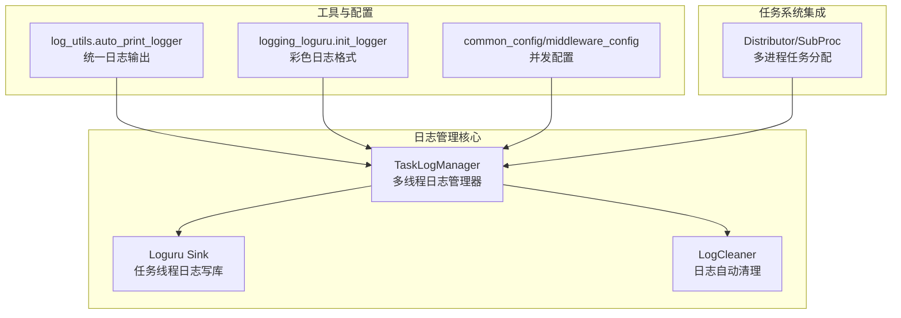
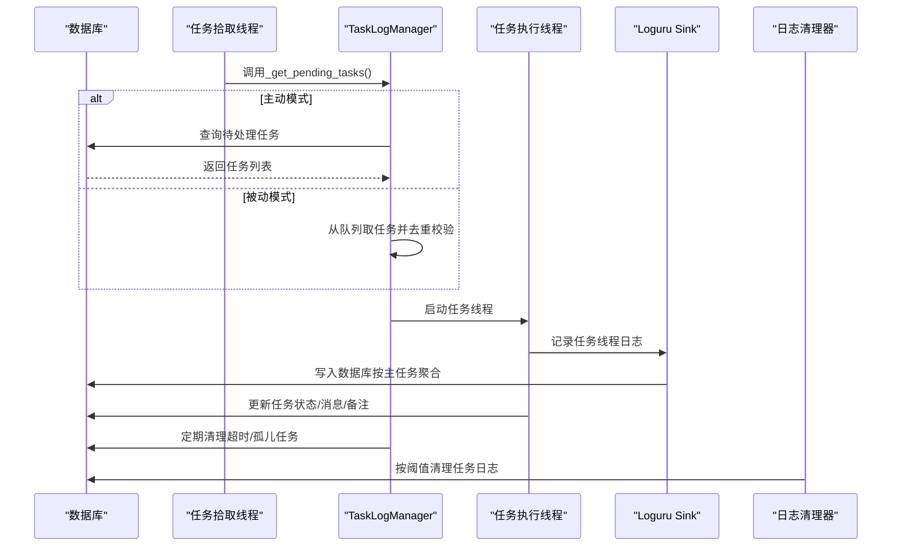
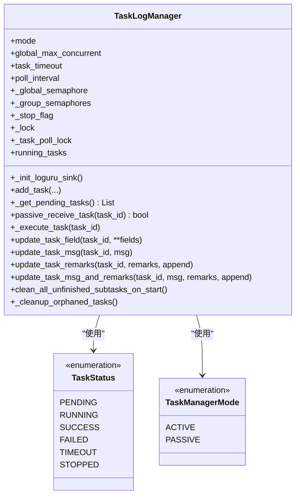
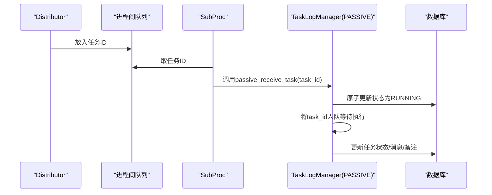
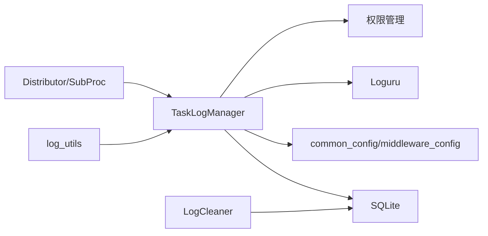

# 多线程日志管理器

<cite>
**本文引用的文件**
- [multiThreading_log_manager.py](file://utils/multiThreading_log_manager.py)
- [log_utils.py](file://utils/log_utils.py)
- [logging_loguru.py](file://config/logging_loguru.py)
- [task_manager.py](file://modules/task_manager.py)
- [log_cleaner.py](file://utils/log_cleaner.py)
- [common_config.py](file://config/common_config.py)
- [middleware_config.py](file://config/middleware_config.py)
</cite>

## 目录
1. [简介](#简介)
2. [项目结构](#项目结构)
3. [核心组件](#核心组件)
4. [架构总览](#架构总览)
5. [详细组件分析](#详细组件分析)
6. [依赖关系分析](#依赖关系分析)
7. [性能考量](#性能考量)
8. [故障排查指南](#故障排查指南)
9. [结论](#结论)
10. [附录](#附录)

## 简介
本文件面向 ikun_temu_system 的多线程日志管理器，系统性阐述其架构设计、实现原理与工程实践，重点围绕 TaskLogManager 类的设计模式与工作流程，详解日志级别管理、线程安全机制、日志轮转策略、任务状态跟踪、日志锁机制与并发控制实现；同时提供日志配置选项与自定义日志格式的方法，解释日志管理器与任务管理系统的集成方式与数据流转过程，并给出性能优化建议、内存管理策略以及调试技巧与常见问题解决方案。

## 项目结构
该日志管理器位于 utils/multiThreading_log_manager.py，配套工具与配置位于：
- 日志工具：utils/log_utils.py
- 日志格式与颜色：config/logging_loguru.py
- 多进程/多线程任务分配：modules/task_manager.py
- 日志自动清理：utils/log_cleaner.py
- 配置与并发参数：config/common_config.py、config/middleware_config.py

图表来源
- [multiThreading_log_manager.py:122-1265](file://utils/multiThreading_log_manager.py#L122-L1265)
- [log_utils.py:6-155](file://utils/log_utils.py#L6-L155)
- [logging_loguru.py:83-131](file://config/logging_loguru.py#L83-L131)
- [task_manager.py:144-319](file://modules/task_manager.py#L144-L319)
- [log_cleaner.py:14-359](file://utils/log_cleaner.py#L14-L359)
- [common_config.py:148-153](file://config/common_config.py#L148-L153)
- [middleware_config.py:1-13](file://config/middleware_config.py#L1-L13)

章节来源
- [multiThreading_log_manager.py:122-1265](file://utils/multiThreading_log_manager.py#L122-L1265)
- [log_utils.py:6-155](file://utils/log_utils.py#L6-L155)
- [logging_loguru.py:83-131](file://config/logging_loguru.py#L83-L131)
- [task_manager.py:144-319](file://modules/task_manager.py#L144-L319)
- [log_cleaner.py:14-359](file://utils/log_cleaner.py#L14-L359)
- [common_config.py:148-153](file://config/common_config.py#L148-L153)
- [middleware_config.py:1-13](file://config/middleware_config.py#L1-L13)

## 核心组件
- TaskLogManager：多线程任务日志管理器，支持主动/被动双模式，统一任务获取接口，线程安全的数据库日志写入，动态并发信号量，任务状态跟踪与清理。
- Loguru 自定义 Sink：将任务线程日志定向写入数据库，按主任务聚合，带时间戳与级别。
- 日志工具：auto_print_logger 将业务返回结构化结果映射为统一日志输出，支持主任务状态联动更新。
- 多进程任务分配器：Distributor/SubProc 将任务通过进程间队列分发至各子进程的被动模式 TaskLogManager。
- 日志清理器：按配置阈值自动清理任务日志，保留最新片段并打上清理标记。
- 配置与并发：common_config/middleware_config 提供全局并发配置与默认值。

章节来源
- [multiThreading_log_manager.py:122-1265](file://utils/multiThreading_log_manager.py#L122-L1265)
- [log_utils.py:6-155](file://utils/log_utils.py#L6-L155)
- [task_manager.py:144-319](file://modules/task_manager.py#L144-L319)
- [log_cleaner.py:14-359](file://utils/log_cleaner.py#L14-L359)
- [common_config.py:148-153](file://config/common_config.py#L148-L153)
- [middleware_config.py:1-13](file://config/middleware_config.py#L1-L13)

## 架构总览
日志管理器以 TaskLogManager 为核心，通过以下关键机制协同工作：
- 双模式任务获取：主动模式从数据库拉取任务，被动模式从进程间队列接收任务，统一接口屏蔽模式差异。
- 线程安全：全局日志锁、可重入锁、信号量、线程本地映射，确保并发安全与一致性。
- 日志写入：Loguru 自定义 sink 将任务线程日志写入数据库，按主任务 ID 聚合。
- 并发控制：全局信号量 + 功能级信号量，动态配置生效，支持扩容与降级。
- 任务状态：统一状态枚举，状态更新与清理，超时检测与孤儿任务清理。
- 集成与扩展：与任务分配器解耦，支持多进程/多线程部署；日志清理器独立运行，降低主流程负担。

图表来源
- [multiThreading_log_manager.py:206-372](file://utils/multiThreading_log_manager.py#L206-L372)
- [multiThreading_log_manager.py:444-474](file://utils/multiThreading_log_manager.py#L444-L474)
- [log_cleaner.py:118-164](file://utils/log_cleaner.py#L118-L164)

章节来源
- [multiThreading_log_manager.py:206-372](file://utils/multiThreading_log_manager.py#L206-L372)
- [multiThreading_log_manager.py:444-474](file://utils/multiThreading_log_manager.py#L444-L474)
- [log_cleaner.py:118-164](file://utils/log_cleaner.py#L118-L164)

## 详细组件分析

### TaskLogManager 类设计与工作流
- 单例与进程隔离：通过进程 PID 控制单例生命周期，避免多进程共享同一实例。
- 双模式支持：ACTIVE（主动拾取）与 PASSIVE（被动接收），统一任务获取接口，屏蔽模式差异。
- 任务拾取轮询：按模式选择数据库查询或队列取任务，结合去重集合与状态二次校验，防止重复与竞态。
- 任务执行：动态导入函数路径，权限校验，参数解析，信号量控制，结果标准化封装，状态更新。
- 日志写入：Loguru 自定义 sink，按线程 ID 映射到任务，聚合到主任务，写入数据库并更新时间。
- 并发控制：全局信号量 + 功能级信号量，动态更新，支持扩容与降级。
- 任务清理：启动时清理未完成子任务与重复主任务，定期清理超时/孤儿任务。
- 线程安全：全局日志锁、可重入锁、信号量、线程本地映射，确保并发安全。

图表来源
- [multiThreading_log_manager.py:122-1265](file://utils/multiThreading_log_manager.py#L122-L1265)

章节来源
- [multiThreading_log_manager.py:122-1265](file://utils/multiThreading_log_manager.py#L122-L1265)

### 日志级别管理与自定义格式
- 级别映射：使用 loguru 原生级别，配合自定义 SUCCESS 级别，确保与业务日志风格一致。
- 彩色格式：复刻 loguru 原生格式，按字段着色，时间、级别、位置、消息分别渲染，异常栈也按级别着色。
- 初始化：init_logger 创建控制台处理器与可选文件处理器，统一日期精度与格式。

章节来源
- [logging_loguru.py:83-131](file://config/logging_loguru.py#L83-L131)

### 线程安全机制与并发控制
- 全局日志锁：防止 sink 重复注册与日志写入竞争。
- 可重入锁：THREAD_TASK_LOCK、EXECUTING_FLAG_LOCK、_group_sem_lock 等，避免死锁与重入问题。
- 信号量：全局信号量控制整体并发，功能级信号量按“店铺_功能”维度控制，动态更新生效。
- 线程本地映射：THREAD_TASK_MAP 将线程 ID 映射到任务信息，Loguru 过滤器据此筛选任务线程日志。
- 任务执行去重：TASK_EXECUTING_FLAG 防止同一任务重复执行；被动模式队列去重集合防止重复分配。

章节来源
- [multiThreading_log_manager.py:18-61](file://utils/multiThreading_log_manager.py#L18-L61)
- [multiThreading_log_manager.py:644-682](file://utils/multiThreading_log_manager.py#L644-L682)

### 日志轮转策略与清理
- 自动清理：按配置阈值与保留比例清理任务日志，保留最新片段并打上清理标记。
- 执行器：独立线程定期检查并清理，支持配置热加载。
- 与主流程解耦：清理器不阻塞任务执行，避免影响吞吐。

章节来源
- [log_cleaner.py:14-359](file://utils/log_cleaner.py#L14-L359)

### 任务状态跟踪与数据流转
- 状态枚举：统一的状态定义，便于 UI 展示与前端交互。
- 数据库持久化：任务信息、日志、状态、消息、备注均持久化到数据库，支持查询与展示。
- 主任务聚合：Loguru sink 将子任务日志聚合到主任务，便于集中查看。
- 结果标准化：任务执行结果统一封装为标准 JSON 可解析格式，便于前端展示与后续处理。

章节来源
- [multiThreading_log_manager.py:25-31](file://utils/multiThreading_log_manager.py#L25-L31)
- [multiThreading_log_manager.py:444-474](file://utils/multiThreading_log_manager.py#L444-L474)
- [multiThreading_log_manager.py:758-800](file://utils/multiThreading_log_manager.py#L758-L800)

### 日志配置选项与自定义格式
- 并发配置：通过 common_config/middleware_config 提供全局并发与功能级并发配置，支持动态更新。
- 日志格式：logging_loguru 提供与 loguru 一致的彩色格式化器，可按需输出到文件或控制台。
- 日志级别：支持 TRACE/DEBUG/INFO/SUCCESS/WARNING/ERROR/CRITICAL，SUCCESS 级别通过扩展注入。

章节来源
- [common_config.py:148-153](file://config/common_config.py#L148-L153)
- [middleware_config.py:1-13](file://config/middleware_config.py#L1-L13)
- [logging_loguru.py:83-131](file://config/logging_loguru.py#L83-L131)

### 与任务管理系统的集成
- 主动模式：TaskLogManager 自身轮询数据库获取任务，适合单机部署。
- 被动模式：通过进程间队列接收任务，适合多进程/多机中心化分配场景。
- 分配器：Distributor/SubProc 将任务分发到各子进程的被动模式 TaskLogManager，避免跨进程直接访问，降低耦合风险。
- 权限校验：任务执行前进行权限校验，不符合条件直接标记失败。

图表来源
- [task_manager.py:144-319](file://modules/task_manager.py#L144-L319)
- [multiThreading_log_manager.py:254-305](file://utils/multiThreading_log_manager.py#L254-L305)

章节来源
- [task_manager.py:144-319](file://modules/task_manager.py#L144-L319)
- [multiThreading_log_manager.py:254-305](file://utils/multiThreading_log_manager.py#L254-L305)

## 依赖关系分析
- TaskLogManager 依赖：
  - 数据库：SQLite，持久化任务与日志。
  - 配置：并发配置、最大并发、任务超时、轮询间隔。
  - Loguru：自定义 sink 与日志格式。
  - 权限管理：任务执行前的权限校验。
- 日志工具依赖 TaskLogManager 的更新接口，实现业务日志与任务状态联动。
- 多进程分配器依赖 TaskLogManager 的被动模式接口，通过队列解耦。
- 日志清理器独立运行，依赖数据库与配置管理器。

图表来源
- [multiThreading_log_manager.py:15-16](file://utils/multiThreading_log_manager.py#L15-L16)
- [log_utils.py:3](file://utils/log_utils.py#L3)
- [task_manager.py:12](file://modules/task_manager.py#L12)
- [log_cleaner.py:11](file://utils/log_cleaner.py#L11)

章节来源
- [multiThreading_log_manager.py:15-16](file://utils/multiThreading_log_manager.py#L15-L16)
- [log_utils.py:3](file://utils/log_utils.py#L3)
- [task_manager.py:12](file://modules/task_manager.py#L12)
- [log_cleaner.py:11](file://utils/log_cleaner.py#L11)

## 性能考量
- 并发控制：
  - 全局信号量与功能级信号量结合，避免热点功能拖垮整体吞吐。
  - 动态更新并发配置，支持运行时扩容，减少停机影响。
- I/O 优化：
  - 数据库 WAL 模式、缓存大小、同步策略在初始化时设置，提升写入性能。
  - Loguru sink 写入数据库采用批量更新，减少事务开销。
- 内存管理：
  - 日志内容按阈值清理，保留最新片段，避免无限增长。
  - 任务状态与日志仅持久化到数据库，不驻留内存。
- 线程与锁：
  - 使用可重入锁与细粒度锁，降低锁竞争。
  - 线程本地映射减少全局共享状态访问频率。
- 多进程解耦：
  - 通过进程间队列分发任务，避免跨进程直接访问，降低耦合与锁争用。

章节来源
- [multiThreading_log_manager.py:167-171](file://utils/multiThreading_log_manager.py#L167-L171)
- [multiThreading_log_manager.py:644-682](file://utils/multiThreading_log_manager.py#L644-L682)
- [log_cleaner.py:118-164](file://utils/log_cleaner.py#L118-L164)

## 故障排查指南
- 日志写入失败：
  - 检查数据库连接与权限，确认 sink 注册成功且过滤器正确匹配线程映射。
  - 查看日志写入异常堆栈，定位具体 SQL 与参数。
- 任务状态异常：
  - 被动模式下队列满导致任务已标记为 RUNNING 但未执行，需人工干预或自动恢复。
  - 启动时清理未完成子任务与重复主任务，避免状态不一致。
- 并发过高导致阻塞：
  - 检查全局与功能级信号量配置，适当扩容。
  - 观察任务并发信息日志，确认信号量使用情况。
- 日志过大：
  - 启用自动清理，调整阈值与保留比例，定期检查清理效果。
- 多进程分发异常：
  - 检查队列是否满载，确认子进程健康状态与心跳。
  - 核对任务去重集合，避免重复分配。

章节来源
- [multiThreading_log_manager.py:293-305](file://utils/multiThreading_log_manager.py#L293-L305)
- [multiThreading_log_manager.py:374-423](file://utils/multiThreading_log_manager.py#L374-L423)
- [log_cleaner.py:118-164](file://utils/log_cleaner.py#L118-L164)
- [task_manager.py:183-200](file://modules/task_manager.py#L183-L200)

## 结论
该多线程日志管理器通过双模式任务获取、完善的线程安全机制、动态并发控制与日志自动清理，实现了高可靠、高性能、易扩展的日志管理方案。其与任务管理系统的集成采用进程间队列解耦，既满足单机主动模式需求，又支持多进程/多机中心化分配场景。配合统一的日志格式与配置体系，能够稳定支撑大规模任务执行与可观测性需求。

## 附录
- 常用配置项
  - 全局最大并发：来自配置文件，TaskLogManager 初始化时读取。
  - 功能级并发：按“功能名”维度配置，支持动态更新。
  - 任务超时：单任务超时时间，用于超时检测与清理。
  - 轮询间隔：主动模式下的任务拾取间隔。
- 日志清理配置
  - auto_clean_log_enabled：是否启用自动清理。
  - log_char_threshold：清理阈值（字符数）。
  - log_keep_ratio：保留比例。
- 使用建议
  - 在生产环境启用自动清理，合理设置阈值与保留比例。
  - 动态调整功能级并发，观察任务并发信息日志评估效果。
  - 多进程部署时优先使用被动模式与进程间队列，确保稳定性与可维护性。

章节来源
- [common_config.py:148-153](file://config/common_config.py#L148-L153)
- [log_cleaner.py:24-36](file://utils/log_cleaner.py#L24-L36)
- [multiThreading_log_manager.py:140-148](file://utils/multiThreading_log_manager.py#L140-L148)