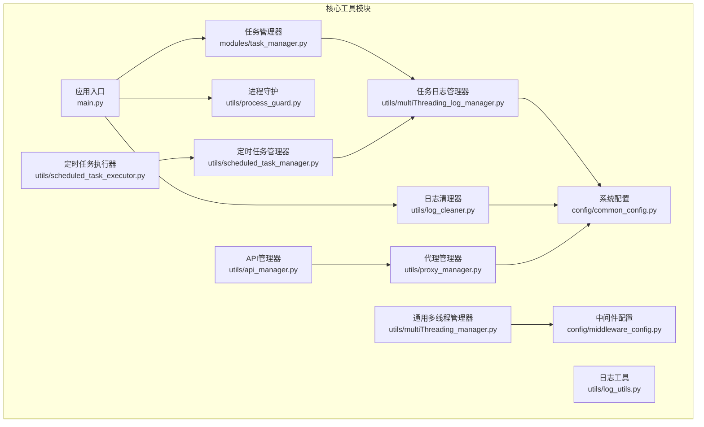
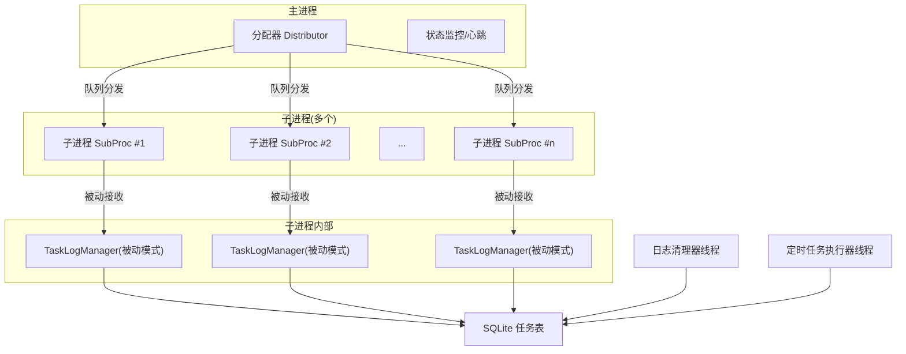
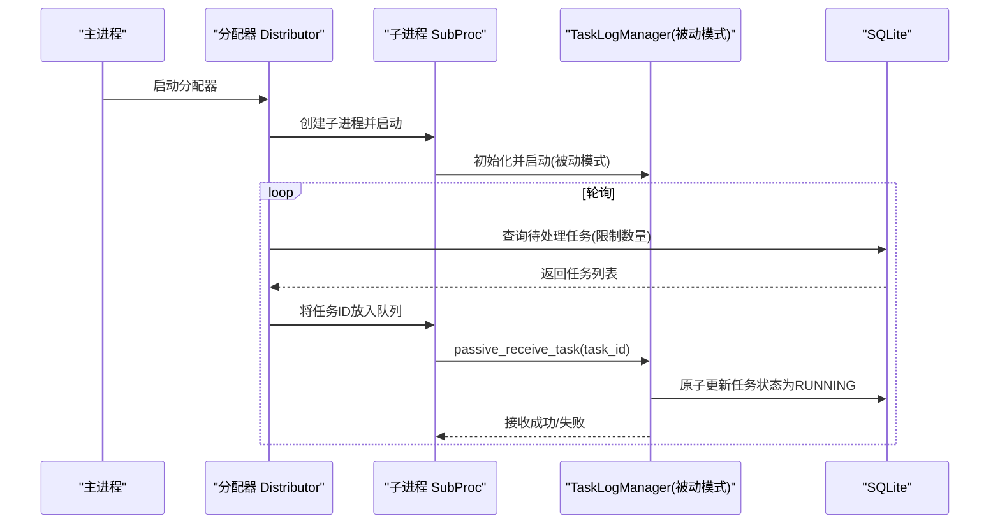
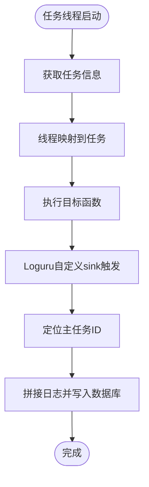
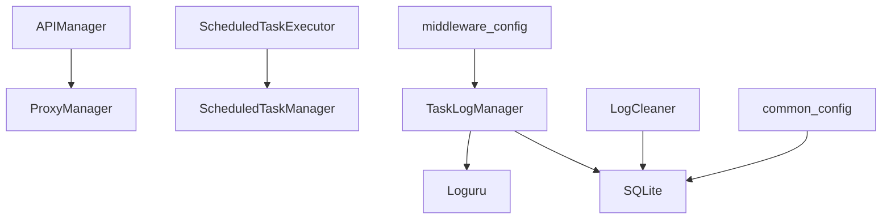

# 核心工具模块

<cite>
**本文档引用的文件**
- [modules/task_manager.py](file://modules/task_manager.py)
- [utils/multiThreading_log_manager.py](file://utils/multiThreading_log_manager.py)
- [utils/process_guard.py](file://utils/process_guard.py)
- [utils/api_manager.py](file://utils/api_manager.py)
- [utils/multiThreading_manager.py](file://utils/multiThreading_manager.py)
- [utils/log_utils.py](file://utils/log_utils.py)
- [config/common_config.py](file://config/common_config.py)
- [config/middleware_config.py](file://config/middleware_config.py)
- [utils/proxy_manager.py](file://utils/proxy_manager.py)
- [utils/scheduled_task_manager.py](file://utils/scheduled_task_manager.py)
- [utils/scheduled_task_executor.py](file://utils/scheduled_task_executor.py)
- [utils/log_cleaner.py](file://utils/log_cleaner.py)
- [main.py](file://main.py)
</cite>

## 目录
1. [简介](#简介)
2. [项目结构](#项目结构)
3. [核心组件](#核心组件)
4. [架构总览](#架构总览)
5. [详细组件分析](#详细组件分析)
6. [依赖关系分析](#依赖关系分析)
7. [性能考虑](#性能考虑)
8. [故障排除指南](#故障排除指南)
9. [结论](#结论)
10. [附录](#附录)

## 简介
本文件聚焦于 ikun_temu_system 的核心工具模块，系统性阐述任务管理系统的架构与实现原理，涵盖多线程日志管理、进程守护、API 管理、定时任务与日志清理等关键能力。文档同时总结设计模式与最佳实践，提供配置项说明、性能优化建议、与其他系统的集成方式、扩展与自定义开发方法，以及故障排除与调试技巧。

## 项目结构
核心工具模块主要分布在以下目录：
- 任务与日志：modules/task_manager.py、utils/multiThreading_log_manager.py、utils/multiThreading_manager.py、utils/log_utils.py、utils/log_cleaner.py
- 进程与守护：utils/process_guard.py
- API 管理：utils/api_manager.py
- 定时任务：utils/scheduled_task_manager.py、utils/scheduled_task_executor.py
- 配置：config/common_config.py、config/middleware_config.py
- 入口与生命周期：main.py

**图表来源**
- [modules/task_manager.py:1-319](file://modules/task_manager.py#L1-L319)
- [utils/multiThreading_log_manager.py:1-800](file://utils/multiThreading_log_manager.py#L1-L800)
- [utils/multiThreading_manager.py:1-555](file://utils/multiThreading_manager.py#L1-L555)
- [utils/log_utils.py:1-155](file://utils/log_utils.py#L1-L155)
- [utils/log_cleaner.py:1-359](file://utils/log_cleaner.py#L1-L359)
- [utils/process_guard.py:1-68](file://utils/process_guard.py#L1-L68)
- [utils/api_manager.py:1-273](file://utils/api_manager.py#L1-L273)
- [utils/scheduled_task_manager.py:1-446](file://utils/scheduled_task_manager.py#L1-L446)
- [utils/scheduled_task_executor.py:1-242](file://utils/scheduled_task_executor.py#L1-L242)
- [utils/proxy_manager.py:1-400](file://utils/proxy_manager.py#L1-L400)
- [config/common_config.py:1-394](file://config/common_config.py#L1-L394)
- [config/middleware_config.py:1-13](file://config/middleware_config.py#L1-L13)
- [main.py:1-233](file://main.py#L1-L233)

**章节来源**
- [main.py:1-233](file://main.py#L1-L233)
- [config/common_config.py:1-394](file://config/common_config.py#L1-L394)

## 核心组件
- 任务管理系统（多进程+多线程）
  - 分配器与子进程：Distributor/SubProc，基于进程间队列进行任务分发，避免跨进程访问 TaskLogManager。
  - 任务日志管理器：TaskLogManager，支持主动/被动双模式，统一任务获取接口，内置日志 sink 与并发控制。
  - 通用多线程管理器：MainTaskManager，面向通用场景的轻量级任务管理器，提供并发控制与结果查询。
- 日志与清理
  - 日志工具：auto_print_logger、response_result_handler、AutoReturnError，统一日志输出与结果封装。
  - 日志清理器：定期检查并清理超长任务日志，防止数据库膨胀。
- 进程守护
  - ProcessGuard：统一注册清理函数，处理退出信号，确保子进程与资源安全回收。
- API 管理
  - APIManager：集中注册、启动、停止、重启 API 服务，统一状态管理与端口释放。
- 定时任务
  - ScheduledTaskManager：增删改查定时任务，计算下次执行时间。
  - ScheduledTaskExecutor：周期性检查并执行定时任务，支持权限校验与状态回滚。
- 配置与中间件
  - common_config：数据库连接管理、全局并发配置、雪花生成器、加密器等。
  - middleware_config：导出配置变量，避免循环导入。

**章节来源**
- [modules/task_manager.py:143-302](file://modules/task_manager.py#L143-L302)
- [utils/multiThreading_log_manager.py:122-800](file://utils/multiThreading_log_manager.py#L122-L800)
- [utils/multiThreading_manager.py:42-555](file://utils/multiThreading_manager.py#L42-L555)
- [utils/log_utils.py:6-155](file://utils/log_utils.py#L6-L155)
- [utils/log_cleaner.py:14-359](file://utils/log_cleaner.py#L14-L359)
- [utils/process_guard.py:8-68](file://utils/process_guard.py#L8-L68)
- [utils/api_manager.py:13-273](file://utils/api_manager.py#L13-L273)
- [utils/scheduled_task_manager.py:11-446](file://utils/scheduled_task_manager.py#L11-L446)
- [utils/scheduled_task_executor.py:18-242](file://utils/scheduled_task_executor.py#L18-L242)
- [config/common_config.py:15-394](file://config/common_config.py#L15-L394)
- [config/middleware_config.py:1-13](file://config/middleware_config.py#L1-L13)

## 架构总览
系统采用“主进程 + 多子进程 + 多线程”的混合并发模型：
- 主进程负责任务分配与状态监控，子进程各自持有独立的 TaskLogManager 实例，通过进程间队列接收任务。
- 任务日志管理器支持两种模式：主动模式（从数据库拾取）与被动模式（从中心化队列接收），统一并发控制与日志 sink。
- 定时任务执行器与日志清理器以独立线程运行，不影响主业务线程。
- API 管理器集中管理各服务的启停与端口，进程守护确保异常退出时资源回收。

**图表来源**
- [modules/task_manager.py:144-302](file://modules/task_manager.py#L144-L302)
- [utils/multiThreading_log_manager.py:122-306](file://utils/multiThreading_log_manager.py#L122-L306)
- [utils/log_cleaner.py:179-287](file://utils/log_cleaner.py#L179-L287)
- [utils/scheduled_task_executor.py:18-73](file://utils/scheduled_task_executor.py#L18-L73)

## 详细组件分析

### 任务管理系统（多进程+多线程）
- 设计要点
  - 分配器 Distributor：创建独立队列，按负载均衡策略将任务推送到子进程；避免跨进程访问 TaskLogManager，降低耦合与风险。
  - 子进程 SubProc：仅负责启动 TaskLogManager 并维持心跳与队列消费线程；异常时优雅停止并释放资源。
  - TaskLogManager：支持主动/被动双模式，统一任务获取接口；内置日志 sink，将任务线程日志写入数据库；并发信号量按“功能名”维度动态调整。
  - MainTaskManager：通用多线程任务管理器，提供并发控制、超时检测与结果查询，适合非数据库驱动的纯线程任务。
- 关键流程（任务分发）

**图表来源**
- [modules/task_manager.py:144-302](file://modules/task_manager.py#L144-L302)
- [utils/multiThreading_log_manager.py:205-306](file://utils/multiThreading_log_manager.py#L205-L306)

**章节来源**
- [modules/task_manager.py:22-142](file://modules/task_manager.py#L22-L142)
- [utils/multiThreading_log_manager.py:122-306](file://utils/multiThreading_log_manager.py#L122-L306)
- [utils/multiThreading_manager.py:42-555](file://utils/multiThreading_manager.py#L42-L555)

### 多线程日志管理
- 设计要点
  - 全局日志锁与 sink 注册保护，避免重复注册与竞态。
  - 自定义 Loguru sink，按线程映射将日志写入对应主任务的 log 字段。
  - 任务状态枚举与字段更新接口，支持批量更新 msg/remarks。
  - 并发控制：全局信号量 + 功能维度信号量，动态调整并发上限。
- 关键流程（日志写入）

**图表来源**
- [utils/multiThreading_log_manager.py:444-492](file://utils/multiThreading_log_manager.py#L444-L492)

**章节来源**
- [utils/multiThreading_log_manager.py:18-204](file://utils/multiThreading_log_manager.py#L18-L204)
- [utils/multiThreading_log_manager.py:493-562](file://utils/multiThreading_log_manager.py#L493-L562)

### 进程守护
- 设计要点
  - 单例进程守护器，注册 atexit 与信号处理器，统一清理函数队列。
  - 支持 SIGTERM/SIGINT，确保优雅退出。
- 使用建议
  - 在业务初始化阶段注册清理函数，如数据库连接、线程池、定时器等。

**章节来源**
- [utils/process_guard.py:8-68](file://utils/process_guard.py#L8-L68)

### API 管理
- 设计要点
  - APIManager 统一注册服务（名称、启动/停止函数、端口、自动启动），集中状态管理。
  - 支持启动/停止/重启/查询状态/批量启停，自动释放端口。
- 使用建议
  - 服务启动前先释放端口，避免占用；停止时务必释放端口。

**章节来源**
- [utils/api_manager.py:13-273](file://utils/api_manager.py#L13-L273)

### 定时任务管理与执行
- 设计要点
  - ScheduledTaskManager：支持一次性与间隔型定时任务，自动计算下次执行时间，支持启用/禁用。
  - ScheduledTaskExecutor：周期检查并执行定时任务，支持权限校验与状态回滚（如将已完成任务重置为待处理）。
- 使用建议
  - 定时任务执行前进行权限校验；执行成功后更新下次执行时间与运行次数。

**章节来源**
- [utils/scheduled_task_manager.py:11-446](file://utils/scheduled_task_manager.py#L11-L446)
- [utils/scheduled_task_executor.py:18-205](file://utils/scheduled_task_executor.py#L18-L205)

### 日志清理与工具
- 日志清理器
  - 支持阈值配置与保留比例，定期清理超长任务日志，避免数据库膨胀。
- 日志工具
  - auto_print_logger：根据返回码输出不同级别日志，支持主任务状态更新。
  - response_result_handler：统一处理 HTTP 响应，兼容 JSON/非 JSON 场景。
  - AutoReturnError：抛出异常以替代 return，便于上层统一处理。

**章节来源**
- [utils/log_cleaner.py:14-359](file://utils/log_cleaner.py#L14-L359)
- [utils/log_utils.py:6-155](file://utils/log_utils.py#L6-L155)

## 依赖关系分析
- 模块内聚与耦合
  - 任务管理器与日志管理器通过数据库交互，耦合度低，便于替换实现。
  - API 管理器与代理管理器解耦，分别负责服务生命周期与网络代理。
  - 定时任务管理器与执行器通过数据库与权限管理器协作，职责清晰。
- 外部依赖
  - SQLite：任务表、定时任务表、日志持久化。
  - Loguru：统一日志框架，自定义 sink。
  - requests：代理测试与网络请求。
- 循环依赖规避
  - middleware_config 仅导出变量，避免在导入时初始化任务管理器。

**图表来源**
- [utils/multiThreading_log_manager.py:122-204](file://utils/multiThreading_log_manager.py#L122-L204)
- [utils/api_manager.py:13-41](file://utils/api_manager.py#L13-L41)
- [utils/scheduled_task_executor.py:18-42](file://utils/scheduled_task_executor.py#L18-L42)
- [utils/log_cleaner.py:14-40](file://utils/log_cleaner.py#L14-L40)
- [config/common_config.py:15-52](file://config/common_config.py#L15-L52)
- [config/middleware_config.py:1-13](file://config/middleware_config.py#L1-L13)

**章节来源**
- [config/middleware_config.py:1-13](file://config/middleware_config.py#L1-L13)

## 性能考虑
- 并发控制
  - 全局信号量与功能维度信号量结合，避免热点功能阻塞整体吞吐。
  - 动态调整并发上限，支持在线配置热更新。
- I/O 与数据库
  - SQLite WAL 模式与 PRAGMA 调优，减少锁竞争。
  - 日志写入采用批量更新，降低写放大。
- 线程与进程
  - 多进程隔离任务执行，避免 GIL 影响；进程间通过队列通信，避免共享内存带来的复杂性。
- 网络与代理
  - 代理测试支持同步/异步/多线程三种模式，按场景选择；超时与回调机制提升用户体验。
- 定时与清理
  - 定时任务执行器采用可中断睡眠，降低 CPU 占用；日志清理器按阈值批量清理，避免频繁扫描。

[本节为通用指导，无需具体文件引用]

## 故障排除指南
- 任务未执行或卡住
  - 检查分配器是否正确创建子进程与队列；确认子进程心跳是否正常。
  - 查看 TaskLogManager 的日志 sink 是否注册成功；确认任务状态是否被原子更新为 RUNNING。
- 日志异常
  - 确认 LOG_LOCK 是否被正确使用；检查自定义 sink 的 filter 是否生效。
  - 使用日志清理器清理超长日志，避免数据库膨胀影响性能。
- 进程退出异常
  - 确保已注册进程守护器清理函数；检查 atexit 与信号处理器是否生效。
- API 启动失败
  - 先释放端口再启动；查看 APIManager 的状态与错误日志。
- 定时任务未执行
  - 检查定时任务表结构与权限配置；确认执行器线程是否在运行。

**章节来源**
- [utils/process_guard.py:27-64](file://utils/process_guard.py#L27-L64)
- [utils/api_manager.py:42-107](file://utils/api_manager.py#L42-L107)
- [utils/log_cleaner.py:193-234](file://utils/log_cleaner.py#L193-L234)
- [utils/scheduled_task_executor.py:57-73](file://utils/scheduled_task_executor.py#L57-L73)

## 结论
本核心工具模块通过“多进程 + 多线程”的混合并发模型，实现了高可靠的任务分发与执行；借助统一的日志管理与清理机制，保障了可观测性与稳定性；配合进程守护、API 管理与定时任务体系，构建了完整的系统生命周期与运维能力。建议在生产环境中结合配置项与性能调优策略，持续监控与迭代。

[本节为总结，无需具体文件引用]

## 附录

### 配置选项与最佳实践
- 数据库与并发
  - max_concurrent_tasks：全局最大并发，默认来自配置表。
  - task_concurrent_config：按功能维度配置并发上限，支持热更新。
  - SQLite PRAGMA：WAL、cache_size、synchronous 等参数已预设，建议结合业务压力调优。
- 日志与清理
  - auto_clean_log_enabled：是否启用自动清理。
  - log_char_threshold：日志长度阈值。
  - log_keep_ratio：保留比例。
- API 管理
  - 注册服务时设置 auto_start 与端口，启动前先释放端口。
- 定时任务
  - once 与 interval 两种模式，合理设置执行间隔与下次执行时间。
- 代理管理
  - 根据网络环境选择测试模式（同步/异步/多线程），设置合适超时时间。

**章节来源**
- [config/common_config.py:141-153](file://config/common_config.py#L141-L153)
- [utils/log_cleaner.py:24-39](file://utils/log_cleaner.py#L24-L39)
- [utils/api_manager.py:20-41](file://utils/api_manager.py#L20-L41)
- [utils/scheduled_task_manager.py:17-36](file://utils/scheduled_task_manager.py#L17-L36)
- [utils/proxy_manager.py:107-144](file://utils/proxy_manager.py#L107-L144)

### 扩展与自定义开发方法
- 新增任务类型
  - 在任务日志管理器中添加任务类型映射与权限校验逻辑。
  - 使用 add_task 创建任务，动态导入函数路径执行。
- 自定义日志输出
  - 通过 auto_print_logger 统一封装返回码与日志级别；必要时扩展日志 sink。
- 自定义 API 服务
  - 使用 APIManager.register_api 注册服务，提供启动/停止函数与端口。
- 自定义定时任务
  - 使用 ScheduledTaskManager.add_scheduled_task 添加任务；在执行器中处理权限与状态回滚。

**章节来源**
- [utils/multiThreading_log_manager.py:596-635](file://utils/multiThreading_log_manager.py#L596-L635)
- [utils/log_utils.py:6-102](file://utils/log_utils.py#L6-L102)
- [utils/api_manager.py:20-41](file://utils/api_manager.py#L20-L41)
- [utils/scheduled_task_manager.py:17-174](file://utils/scheduled_task_manager.py#L17-L174)

### 与其他系统的集成方式
- GUI 与事件循环
  - 在 main.py 中初始化 QApplication 与 QEventLoop，确保 UI 与后台任务协同。
- 数据库初始化
  - 通过 common_config.initialize_all_databases 统一初始化 ikun 与 hupu 数据库表结构。
- 权限与加密
  - 使用 permission_manager 与 encryptor 管理权限与敏感数据。

**章节来源**
- [main.py:120-201](file://main.py#L120-L201)
- [config/common_config.py:245-334](file://config/common_config.py#L245-L334)