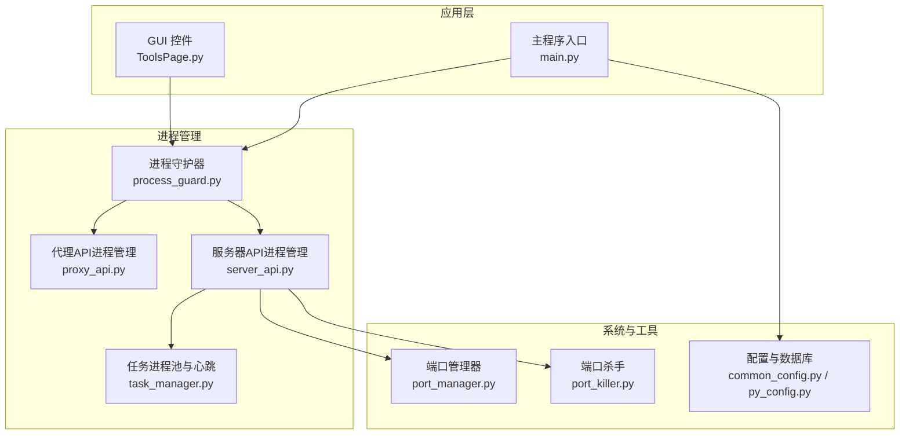
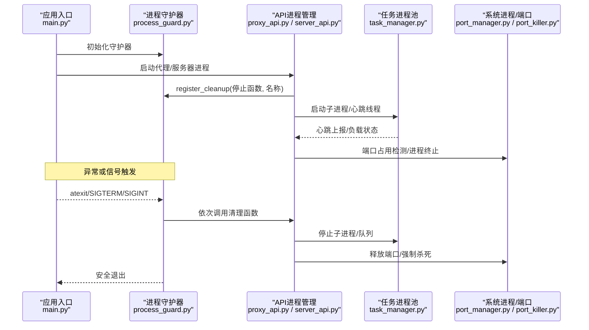
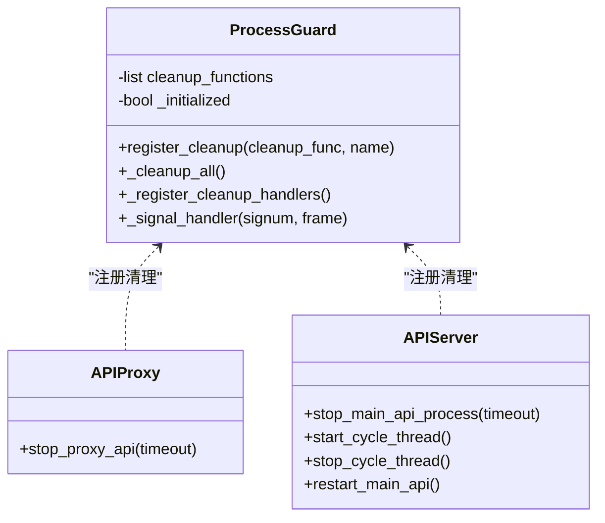
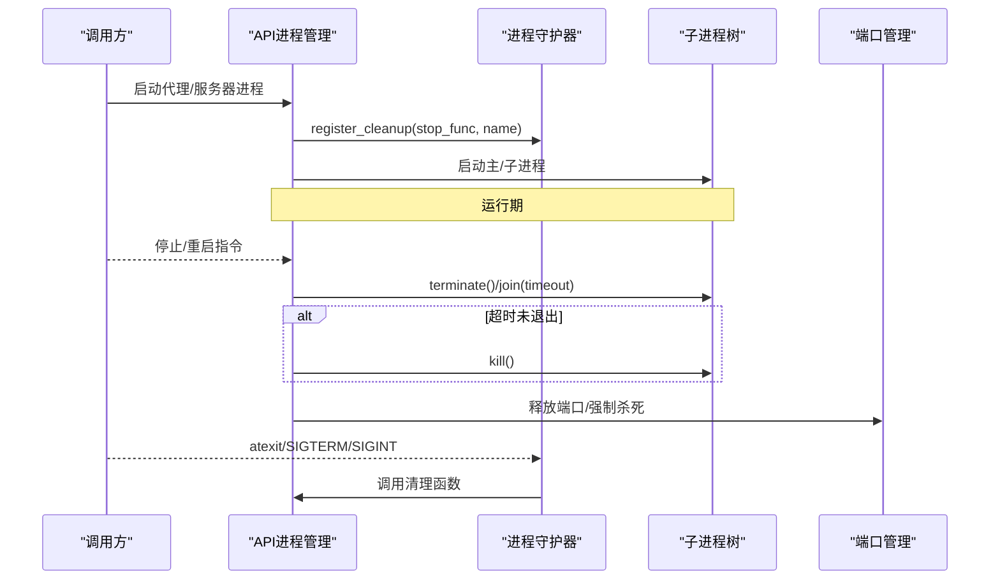
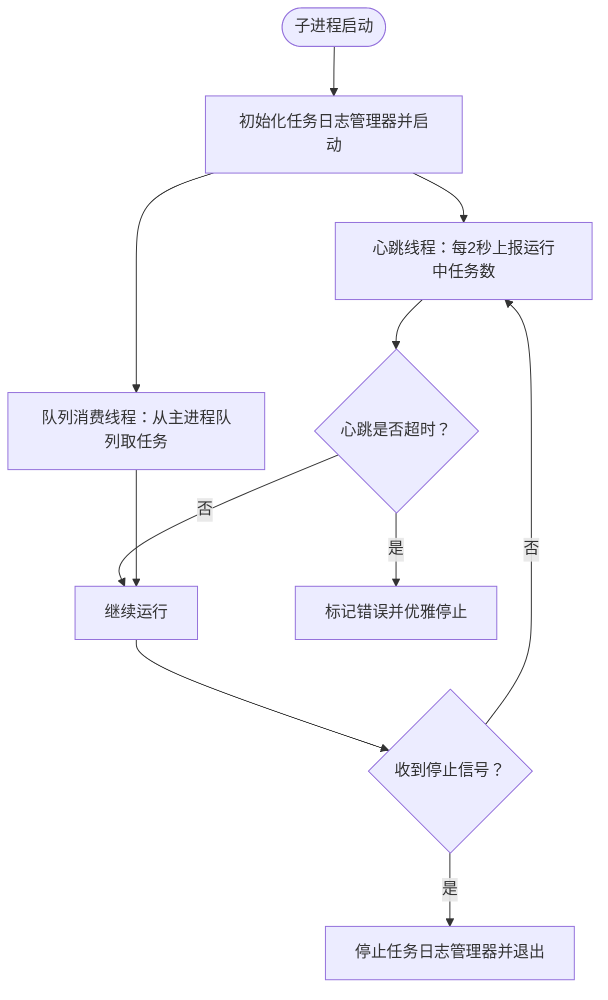
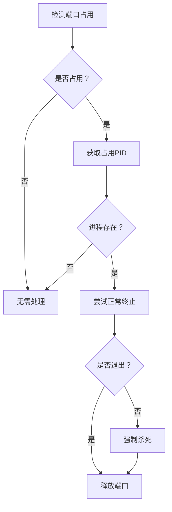
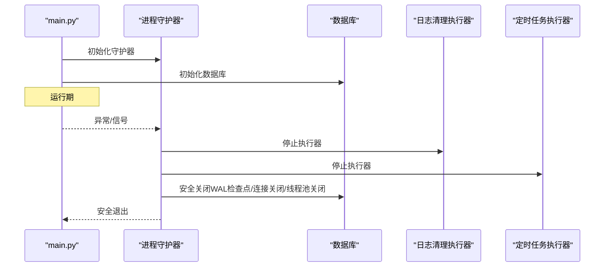
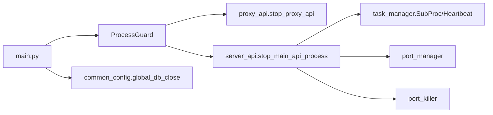

# 进程守护器

<cite>
**本文引用的文件**
- [process_guard.py](file://utils/process_guard.py)
- [proxy_api.py](file://api/proxy_api.py)
- [server_api.py](file://api/server_api.py)
- [main.py](file://main.py)
- [common_config.py](file://config/common_config.py)
- [task_manager.py](file://modules/task_manager.py)
- [port_manager.py](file://lite_modules/port_manager.py)
- [port_killer.py](file://lite_modules/port_killer.py)
- [py_config.py](file://config/py_config.py)
- [ToolsPage.py](file://gui/ToolsPage.py)
</cite>

## 目录
1. [简介](#简介)
2. [项目结构](#项目结构)
3. [核心组件](#核心组件)
4. [架构总览](#架构总览)
5. [详细组件分析](#详细组件分析)
6. [依赖分析](#依赖分析)
7. [性能考量](#性能考量)
8. [故障排查指南](#故障排查指南)
9. [结论](#结论)
10. [附录](#附录)

## 简介
本文件面向 ikun_temu_system 的进程守护器，系统性阐述其设计原理、实现策略与最佳实践。重点覆盖：
- 进程监控、重启策略与异常处理
- 进程状态检测、健康检查与自动恢复
- 进程间通信、信号处理与资源清理
- 配置参数与监控阈值设置
- 与系统进程管理的集成方式
- 性能优化与故障诊断方法

## 项目结构
围绕进程守护器的关键文件分布如下：
- 守护器核心：utils/process_guard.py
- API进程管理：api/proxy_api.py、api/server_api.py
- 主程序入口与全局异常：main.py
- 配置与数据库：config/common_config.py、config/py_config.py
- 任务进程池与健康检查：modules/task_manager.py
- 端口管理与进程终止：lite_modules/port_manager.py、lite_modules/port_killer.py
- GUI开关与持久化：gui/ToolsPage.py

图表来源
- [process_guard.py:1-68](file://utils/process_guard.py#L1-L68)
- [proxy_api.py:120-214](file://api/proxy_api.py#L120-L214)
- [server_api.py:240-439](file://api/server_api.py#L240-L439)
- [main.py:1-233](file://main.py#L1-L233)
- [task_manager.py:1-200](file://modules/task_manager.py#L1-L200)
- [port_manager.py:79-235](file://lite_modules/port_manager.py#L79-L235)
- [port_killer.py:45-81](file://lite_modules/port_killer.py#L45-L81)
- [common_config.py:59-135](file://config/common_config.py#L59-L135)
- [py_config.py:1-93](file://config/py_config.py#L1-L93)

章节来源
- [process_guard.py:1-68](file://utils/process_guard.py#L1-L68)
- [proxy_api.py:120-214](file://api/proxy_api.py#L120-L214)
- [server_api.py:240-439](file://api/server_api.py#L240-L439)
- [main.py:1-233](file://main.py#L1-L233)
- [task_manager.py:1-200](file://modules/task_manager.py#L1-L200)
- [port_manager.py:79-235](file://lite_modules/port_manager.py#L79-L235)
- [port_killer.py:45-81](file://lite_modules/port_killer.py#L45-L81)
- [common_config.py:59-135](file://config/common_config.py#L59-L135)
- [py_config.py:1-93](file://config/py_config.py#L1-L93)

## 核心组件
- 进程守护器（ProcessGuard）
  - 单例模式，负责注册清理钩子（atexit、SIGTERM、SIGINT）
  - 维护清理函数列表，按注册顺序逆序执行
  - 通过 process_guard.register_cleanup 注册具体清理函数
- API进程管理
  - 代理API：proxy_api.py 中的 stop_proxy_api，使用 psutil 递归终止子进程，支持超时与强制杀死
  - 服务器API：server_api.py 中的 stop_main_api_process，周期重启线程 start_cycle_thread/stop_cycle_thread/restart_main_api
- 任务进程池与健康检查
  - task_manager.py 中的 SubProc 子进程维护心跳（每2秒上报运行中任务数），Distributor 负责进程选择与任务分发
  - 心跳超时阈值 PROCESS_HEARTBEAT_TIMEOUT 用于判定进程健康
- 端口管理与进程终止
  - port_manager.py 提供进程注册/注销、停止、端口占用检测与释放
  - port_killer.py 提供基于 PID 的进程终止能力
- 主程序与全局异常
  - main.py 设置全局异常捕获，退出前清理日志清理执行器、定时任务执行器与数据库连接
- 配置与持久化
  - py_config.py 提供版本号生成与配置读取
  - common_config.py 提供数据库安全关闭与并发配置读取
  - ToolsPage.py 提供 GUI 开关“进程守护”与配置持久化

章节来源
- [process_guard.py:8-68](file://utils/process_guard.py#L8-L68)
- [proxy_api.py:131-194](file://api/proxy_api.py#L131-L194)
- [server_api.py:249-439](file://api/server_api.py#L249-L439)
- [task_manager.py:22-142](file://modules/task_manager.py#L22-L142)
- [port_manager.py:203-235](file://lite_modules/port_manager.py#L203-L235)
- [port_killer.py:69-81](file://lite_modules/port_killer.py#L69-L81)
- [main.py:21-53](file://main.py#L21-L53)
- [common_config.py:59-135](file://config/common_config.py#L59-L135)
- [py_config.py:64-81](file://config/py_config.py#L64-L81)
- [ToolsPage.py:106-142](file://gui/ToolsPage.py#L106-L142)

## 架构总览
进程守护器贯穿应用生命周期，从进程启动、运行期监控到异常退出清理，形成闭环。

图表来源
- [main.py:21-53](file://main.py#L21-L53)
- [process_guard.py:27-64](file://utils/process_guard.py#L27-L64)
- [proxy_api.py:120-194](file://api/proxy_api.py#L120-L194)
- [server_api.py:249-439](file://api/server_api.py#L249-L439)
- [task_manager.py:34-142](file://modules/task_manager.py#L34-L142)
- [port_manager.py:203-235](file://lite_modules/port_manager.py#L203-L235)
- [port_killer.py:69-81](file://lite_modules/port_killer.py#L69-L81)

## 详细组件分析

### 进程守护器（ProcessGuard）
- 设计要点
  - 单例：避免重复注册清理钩子
  - atexit：程序正常退出时统一清理
  - 信号处理：SIGTERM/SIGINT 触发清理并退出
  - 清理函数栈：后注册先执行，确保资源有序释放
- 关键行为
  - register_cleanup：注册清理函数与名称
  - _cleanup_all：逆序执行清理函数，异常记录但不中断后续清理
- 适用范围
  - 代理API进程、服务器API进程、日志清理执行器、定时任务执行器、数据库连接等

图表来源
- [process_guard.py:8-68](file://utils/process_guard.py#L8-L68)
- [proxy_api.py:131-194](file://api/proxy_api.py#L131-L194)
- [server_api.py:249-439](file://api/server_api.py#L249-L439)

章节来源
- [process_guard.py:8-68](file://utils/process_guard.py#L8-L68)

### API进程管理（代理与服务器）
- 代理API进程
  - 启动后通过 process_guard.register_cleanup 注册 stop_proxy_api
  - 停止流程：递归终止子进程，等待超时后强制杀死，最终清空引用
- 服务器API进程
  - 启动后通过 process_guard.register_cleanup 注册 stop_main_api_process
  - 周期重启：start_cycle_thread 以配置的重启间隔启动线程；stop_cycle_thread 安全停止
  - 重启流程：stop_main_api_process -> 释放端口 -> 重新启动

图表来源
- [proxy_api.py:120-194](file://api/proxy_api.py#L120-L194)
- [server_api.py:249-439](file://api/server_api.py#L249-L439)
- [process_guard.py:46-64](file://utils/process_guard.py#L46-L64)
- [port_manager.py:79-235](file://lite_modules/port_manager.py#L79-L235)
- [port_killer.py:69-81](file://lite_modules/port_killer.py#L69-L81)

章节来源
- [proxy_api.py:120-194](file://api/proxy_api.py#L120-L194)
- [server_api.py:249-439](file://api/server_api.py#L249-L439)

### 任务进程池与健康检查（SubProc/Heartbeat/Distributor）
- 子进程（SubProc）
  - 启动：创建被动模式任务日志管理器并启动
  - 心跳：每2秒上报运行中任务数与最近心跳时间
  - 队列消费：从主进程队列接收任务并调用内部任务日志管理器接收
  - 停止：设置停止事件并终止
- 分配器（Distributor）
  - 为每个子进程创建独立队列
  - 选择策略：筛选“运行中且心跳未超时”的子进程，按运行中任务数升序返回负载最低进程
- 健康检查阈值
  - PROCESS_HEARTBEAT_TIMEOUT：心跳超时阈值，超过则视为不健康

图表来源
- [task_manager.py:34-142](file://modules/task_manager.py#L34-L142)

章节来源
- [task_manager.py:22-142](file://modules/task_manager.py#L22-L142)

### 端口管理与进程终止
- 端口管理器（port_manager.py）
  - register_process/unregister_process：注册/注销运行中的进程与端口
  - stop_process：统一停止流程，支持超时等待与强制杀死
  - is_port_in_use/kind_pid：检测端口占用与获取占用进程PID
- 端口杀手（port_killer.py）
  - kill_process_by_pid：根据PID终止进程，支持普通终止与强制杀死

图表来源
- [port_manager.py:79-235](file://lite_modules/port_manager.py#L79-L235)
- [port_killer.py:69-81](file://lite_modules/port_killer.py#L69-L81)

章节来源
- [port_manager.py:79-235](file://lite_modules/port_manager.py#L79-L235)
- [port_killer.py:69-81](file://lite_modules/port_killer.py#L69-L81)

### 主程序与全局异常处理
- 全局异常捕获：记录到 error/error.log 并使用 loguru 输出详细堆栈
- 退出前清理：停止日志清理执行器、定时任务执行器、安全关闭数据库
- 与守护器配合：异常触发 atexit，确保清理函数执行

图表来源
- [main.py:21-53](file://main.py#L21-L53)
- [process_guard.py:27-64](file://utils/process_guard.py#L27-L64)
- [common_config.py:59-135](file://config/common_config.py#L59-L135)

章节来源
- [main.py:21-53](file://main.py#L21-L53)
- [common_config.py:59-135](file://config/common_config.py#L59-L135)

### GUI开关与配置持久化
- ToolsPage 提供“进程守护”开关，变更时通过 config_manager.upsert_config 持久化
- 读取时从配置表加载默认值，支持布尔值转换

章节来源
- [ToolsPage.py:106-142](file://gui/ToolsPage.py#L106-L142)

## 依赖分析
- 守护器对 API 层的依赖
  - 通过 register_cleanup 注入停止函数，形成“反向依赖”
- API 层对系统工具的依赖
  - psutil：进程/端口管理
  - 线程/进程：周期线程、子进程树
- 任务池对日志管理器的依赖
  - 被动模式任务日志管理器，心跳与任务接收均在其内部完成

图表来源
- [process_guard.py:46-64](file://utils/process_guard.py#L46-L64)
- [proxy_api.py:131-194](file://api/proxy_api.py#L131-L194)
- [server_api.py:249-439](file://api/server_api.py#L249-L439)
- [task_manager.py:34-142](file://modules/task_manager.py#L34-L142)
- [port_manager.py:203-235](file://lite_modules/port_manager.py#L203-L235)
- [port_killer.py:69-81](file://lite_modules/port_killer.py#L69-L81)
- [main.py:21-53](file://main.py#L21-L53)
- [common_config.py:59-135](file://config/common_config.py#L59-L135)

章节来源
- [process_guard.py:46-64](file://utils/process_guard.py#L46-L64)
- [proxy_api.py:131-194](file://api/proxy_api.py#L131-L194)
- [server_api.py:249-439](file://api/server_api.py#L249-L439)
- [task_manager.py:34-142](file://modules/task_manager.py#L34-L142)
- [port_manager.py:203-235](file://lite_modules/port_manager.py#L203-L235)
- [port_killer.py:69-81](file://lite_modules/port_killer.py#L69-L81)
- [main.py:21-53](file://main.py#L21-L53)
- [common_config.py:59-135](file://config/common_config.py#L59-L135)

## 性能考量
- 心跳频率与负载评估
  - 子进程心跳每2秒一次，兼顾实时性与开销
  - 分配器按运行中任务数排序，避免热点进程
- 超时与优雅停止
  - 停止流程采用超时等待与强制杀死双保险，减少僵尸进程
- 端口占用检测
  - 结合 net_connections 与 psutil.pid_exists，降低误杀概率
- 数据库安全关闭
  - WAL 检查点与连接/线程池关闭，减少文件损坏风险

[本节为通用指导，不直接分析具体文件]

## 故障排查指南
- 常见问题定位
  - 进程未退出：检查 stop_process/stop_main_api_process 的超时与强制杀死分支
  - 端口占用：使用 port_manager.is_port_in_use/kind_pid 检查并释放
  - 心跳超时：确认 PROCESS_HEARTBEAT_TIMEOUT 阈值与子进程心跳线程是否正常
  - 全局异常：查看 error/error.log 与 loguru 输出，定位异常堆栈
- 调试步骤
  - 启用 GUI“进程守护”开关，观察清理函数注册与执行
  - 观察日志清理执行器与定时任务执行器的停止日志
  - 使用 psutil 辅助验证进程树与端口占用

章节来源
- [proxy_api.py:131-194](file://api/proxy_api.py#L131-L194)
- [server_api.py:249-439](file://api/server_api.py#L249-L439)
- [port_manager.py:79-235](file://lite_modules/port_manager.py#L79-L235)
- [task_manager.py:84-100](file://modules/task_manager.py#L84-L100)
- [main.py:21-53](file://main.py#L21-L53)

## 结论
进程守护器通过单例注册、信号与 atexit 钩子，结合 API 层的进程树管理与端口工具，构建了完整的生命周期管理体系。配合任务池的心跳与健康检查，实现了可观测、可恢复的进程治理。建议在生产环境中：
- 明确清理函数职责边界，避免相互阻塞
- 合理设置心跳与重启阈值，平衡稳定性与资源消耗
- 使用 GUI 开关与配置持久化，便于运维控制

[本节为总结，不直接分析具体文件]

## 附录

### 配置参数与监控阈值
- 服务器重启间隔（配置键：ServerPage_restart_interval）
  - 读取方式：config_manager.get_or_set_config("ServerPage_restart_interval", "1小时")
  - 启动周期线程：start_cycle_thread，将“小时”解析为秒
- 心跳超时阈值（常量：PROCESS_HEARTBEAT_TIMEOUT）
  - 作用：判定子进程健康状态
- 端口管理
  - 端口占用检测：is_port_in_use
  - 进程注册/注销：register_process/unregister_process
- 数据库安全关闭
  - global_db_close：执行 WAL 检查点与连接/线程池关闭

章节来源
- [server_api.py:358-381](file://api/server_api.py#L358-L381)
- [task_manager.py:19](file://modules/task_manager.py#L19)
- [port_manager.py:195-201](file://lite_modules/port_manager.py#L195-L201)
- [common_config.py:59-135](file://config/common_config.py#L59-L135)