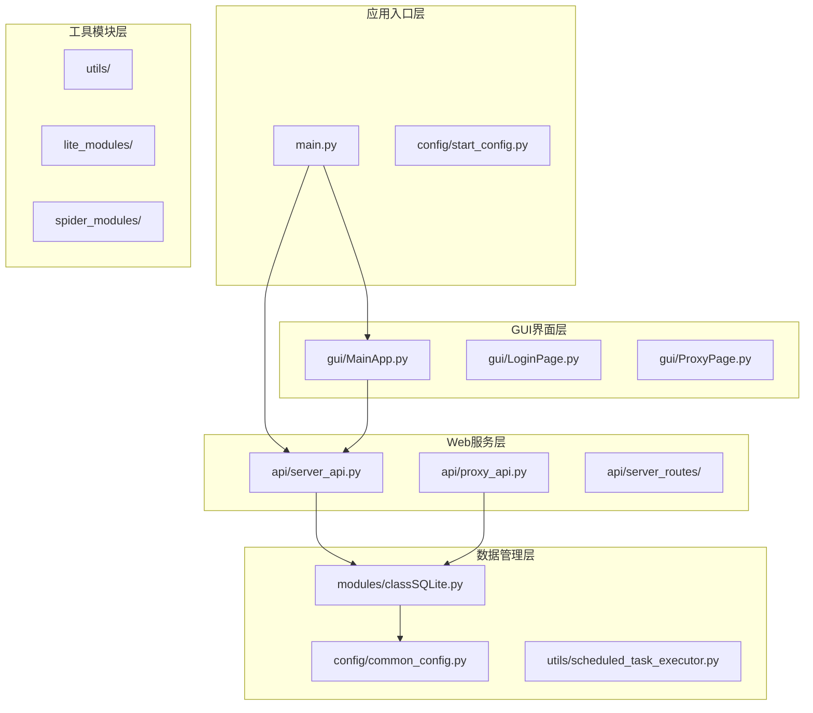
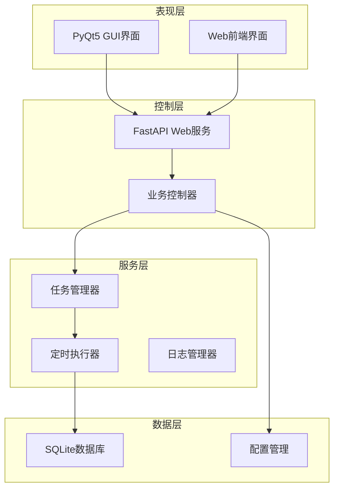
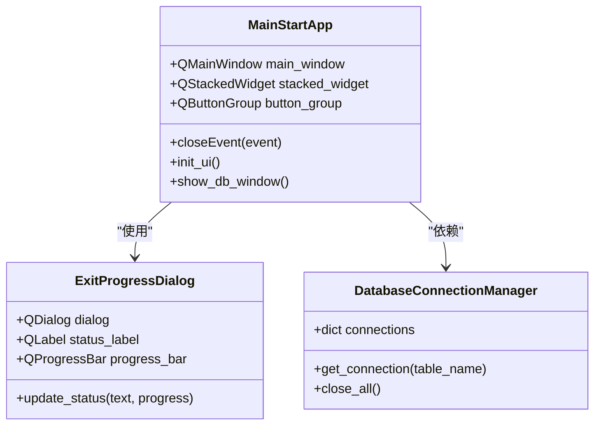
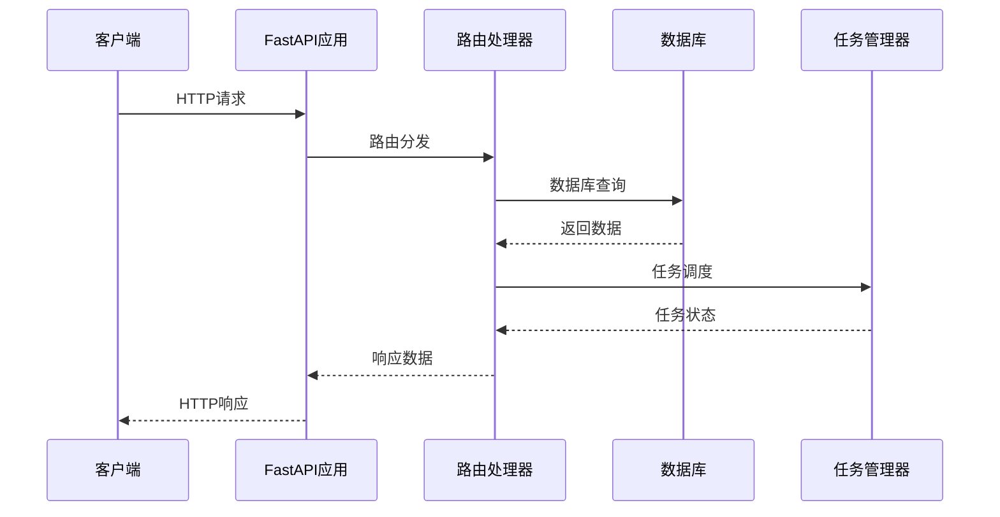
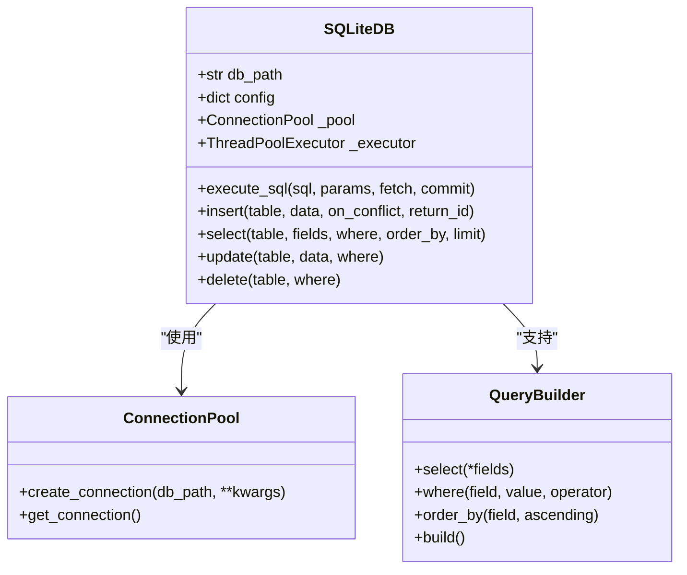
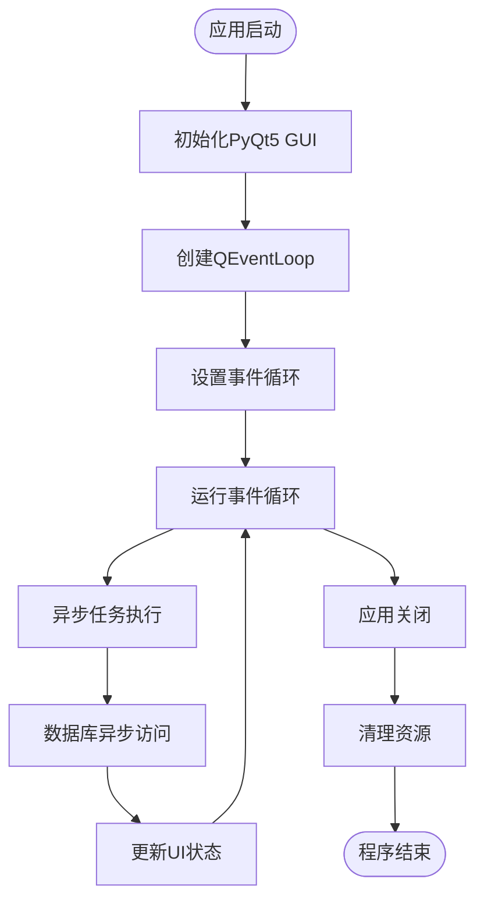
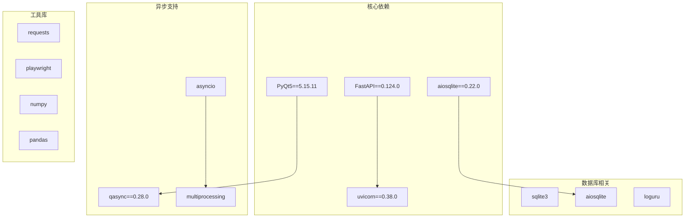

# 技术栈说明

<cite>
**本文档引用的文件**
- [main.py](file://main.py)
- [requirements.txt](file://requirements.txt)
- [config/py_config.py](file://config/py_config.py)
- [config/common_config.py](file://config/common_config.py)
- [config/start_config.py](file://config/start_config.py)
- [modules/classSQLite.py](file://modules/classSQLite.py)
- [api/server_api.py](file://api/server_api.py)
- [api/proxy_api.py](file://api/proxy_api.py)
- [utils/scheduled_task_executor.py](file://utils/scheduled_task_executor.py)
- [gui/MainApp.py](file://gui/MainApp.py)
- [other/setup.py](file://other/setup.py)
</cite>

## 目录
1. [引言](#引言)
2. [项目结构](#项目结构)
3. [核心组件](#核心组件)
4. [架构概览](#架构概览)
5. [详细组件分析](#详细组件分析)
6. [依赖关系分析](#依赖关系分析)
7. [性能考虑](#性能考虑)
8. [故障排除指南](#故障排除指南)
9. [结论](#结论)

## 引言

ikun_temu_system是一个基于Python开发的企业级管理系统，采用现代化技术栈构建。该项目集成了桌面GUI应用、Web服务、数据库管理和异步编程等多种技术，旨在为企业用户提供完整的业务解决方案。

本技术栈说明文档将深入分析项目的核心技术选型，包括Python版本要求、PyQt5 GUI框架、FastAPI Web框架、SQLite数据库等关键技术组件，以及它们如何协同工作支撑整个系统。

## 项目结构

项目采用模块化设计，按照功能层次组织代码结构：



**图表来源**
- [main.py:1-233](file://main.py#L1-L233)
- [gui/MainApp.py:1-800](file://gui/MainApp.py#L1-L800)
- [api/server_api.py:1-474](file://api/server_api.py#L1-L474)

**章节来源**
- [main.py:1-233](file://main.py#L1-L233)
- [config/start_config.py:1-161](file://config/start_config.py#L1-L161)

## 核心组件

### Python版本与环境配置

项目基于Python 3.12+开发，采用现代Python特性进行开发。主要依赖包括：

- **异步编程**: asyncio + qasync
- **GUI框架**: PyQt5
- **Web框架**: FastAPI + Uvicorn
- **数据库**: aiosqlite + sqlite3
- **日志管理**: loguru

### 异步编程模型

项目采用混合异步模型，结合了传统同步编程和现代异步编程的优势：

```mermaid
sequenceDiagram
participant Main as 主程序
participant Loop as QEventLoop
participant Async as 异步任务
participant DB as 数据库
Main->>Loop : 创建事件循环
Loop->>Async : 执行异步任务
Async->>DB : 异步数据库操作
DB-->>Async : 返回结果
Async-->>Loop : 完成任务
Loop-->>Main : 更新UI状态
```

**图表来源**
- [main.py:120-172](file://main.py#L120-L172)
- [modules/classSQLite.py:411-417](file://modules/classSQLite.py#L411-L417)

**章节来源**
- [main.py:1-233](file://main.py#L1-L233)
- [modules/classSQLite.py:1-800](file://modules/classSQLite.py#L1-L800)

## 架构概览

系统采用分层架构设计，各层职责明确，耦合度低：



**图表来源**
- [api/server_api.py:59-104](file://api/server_api.py#L59-L104)
- [utils/scheduled_task_executor.py:18-73](file://utils/scheduled_task_executor.py#L18-L73)

## 详细组件分析

### PyQt5 GUI框架

PyQt5作为主要的桌面GUI框架，提供了丰富的UI组件和强大的事件处理机制：



**图表来源**
- [gui/MainApp.py:179-280](file://gui/MainApp.py#L179-L280)
- [config/common_config.py:16-48](file://config/common_config.py#L16-L48)

GUI框架的主要优势：
- **跨平台支持**: Windows/Linux/macOS统一界面
- **丰富的控件**: 支持复杂交互界面
- **事件驱动**: 响应式用户界面
- **主题定制**: 支持CSS样式定制

**章节来源**
- [gui/MainApp.py:1-800](file://gui/MainApp.py#L1-L800)
- [config/common_config.py:16-48](file://config/common_config.py#L16-L48)

### FastAPI Web框架

FastAPI提供高性能的Web服务，支持异步处理和自动API文档生成：



**图表来源**
- [api/server_api.py:122-247](file://api/server_api.py#L122-L247)
- [api/server_api.py:40-57](file://api/server_api.py#L40-L57)

FastAPI的关键特性：
- **类型安全**: 编译时类型检查
- **自动文档**: 自动生成OpenAPI文档
- **异步支持**: 原生async/await支持
- **性能优异**: 基于Starlette的高性能ASGI服务器

**章节来源**
- [api/server_api.py:1-474](file://api/server_api.py#L1-L474)

### SQLite数据库系统

项目采用SQLite作为主要数据存储，结合现代化的数据库抽象层：



**图表来源**
- [modules/classSQLite.py:359-433](file://modules/classSQLite.py#L359-L433)
- [modules/classSQLite.py:294-330](file://modules/classSQLite.py#L294-L330)

数据库系统的优势：
- **轻量级**: 无需独立服务器进程
- **可靠性**: ACID事务支持
- **性能**: WAL模式提升并发性能
- **易用性**: 无需复杂的配置

**章节来源**
- [modules/classSQLite.py:1-800](file://modules/classSQLite.py#L1-L800)
- [config/common_config.py:157-334](file://config/common_config.py#L157-L334)

### 异步编程模型

项目采用asyncio与QEventLoop的配合使用，实现GUI与异步任务的无缝集成：



**图表来源**
- [main.py:120-172](file://main.py#L120-L172)

异步编程的优势：
- **响应性**: GUI界面保持流畅
- **并发性**: 支持大量并发操作
- **资源效率**: 降低内存和CPU消耗
- **可扩展性**: 易于添加新功能

**章节来源**
- [main.py:1-233](file://main.py#L1-L233)

## 依赖关系分析

项目依赖关系复杂但有序，主要依赖包括：



**图表来源**
- [requirements.txt:1-168](file://requirements.txt#L1-L168)

**章节来源**
- [requirements.txt:1-168](file://requirements.txt#L1-L168)

## 性能考虑

### 并发处理策略

项目采用多层次的并发处理策略：

1. **GUI线程**: 专门处理用户界面更新
2. **异步线程**: 处理网络请求和数据库操作
3. **进程池**: 处理CPU密集型任务
4. **定时任务**: 周期性执行后台任务

### 数据库性能优化

- **连接池**: 最大连接数9999，预热连接
- **WAL模式**: 提升并发读写性能
- **缓存策略**: 20000页缓存大小
- **事务管理**: 自动事务提交和回滚

### 内存管理

- **垃圾回收**: 自动内存回收机制
- **资源清理**: 程序退出时自动清理
- **连接复用**: 数据库连接复用减少开销

## 故障排除指南

### 常见问题及解决方案

1. **端口占用问题**
   - 检查端口占用情况
   - 使用port_killer强制释放端口
   - 重启相关进程

2. **数据库连接失败**
   - 检查数据库文件权限
   - 验证WAL文件完整性
   - 重新初始化数据库连接

3. **GUI界面无响应**
   - 确认事件循环正常运行
   - 检查异步任务执行状态
   - 验证线程安全

**章节来源**
- [config/start_config.py:27-106](file://config/start_config.py#L27-L106)
- [config/common_config.py:59-135](file://config/common_config.py#L59-L135)

## 结论

ikun_temu_system采用的技术栈经过精心选择和优化，形成了一个高效、稳定、可扩展的企业级应用系统。各技术组件之间的协作实现了以下目标：

1. **技术先进性**: 采用最新的Python异步编程和现代化GUI框架
2. **性能优异**: 通过连接池、WAL模式等技术提升系统性能
3. **开发效率**: FastAPI的自动文档和类型安全提升开发体验
4. **用户体验**: PyQt5提供优秀的桌面应用体验
5. **可维护性**: 清晰的架构分层和模块化设计便于维护

这种技术栈组合特别适合需要同时处理复杂业务逻辑、提供丰富用户界面、支持高并发访问的企业级应用场景。通过合理的架构设计和技术选型，系统能够在保证性能的同时，提供良好的开发和维护体验。