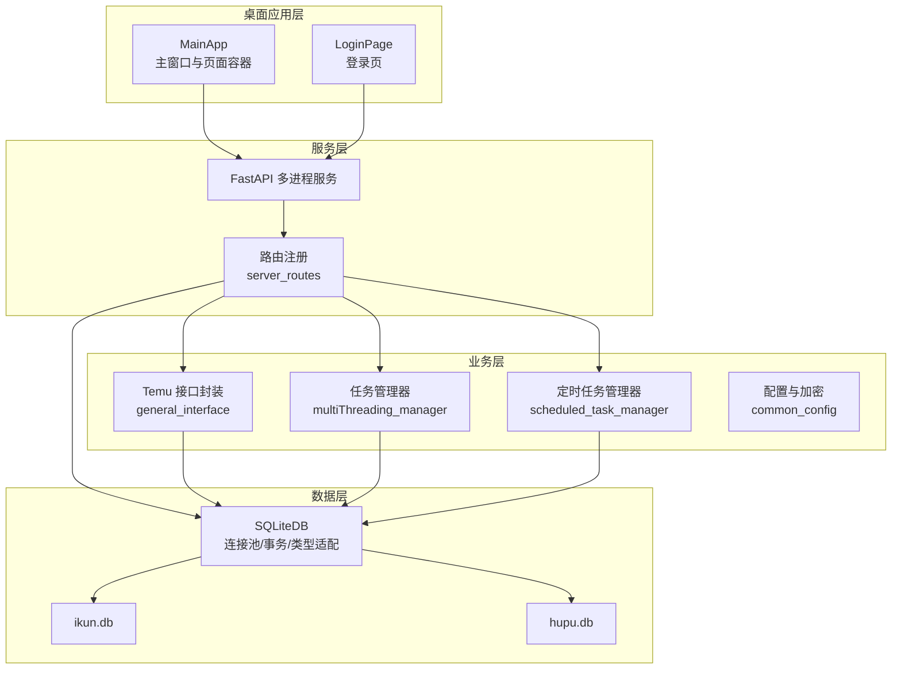
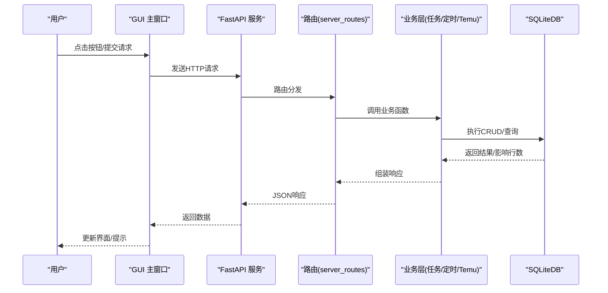
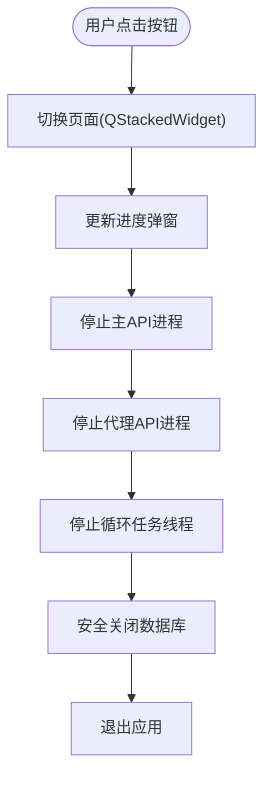
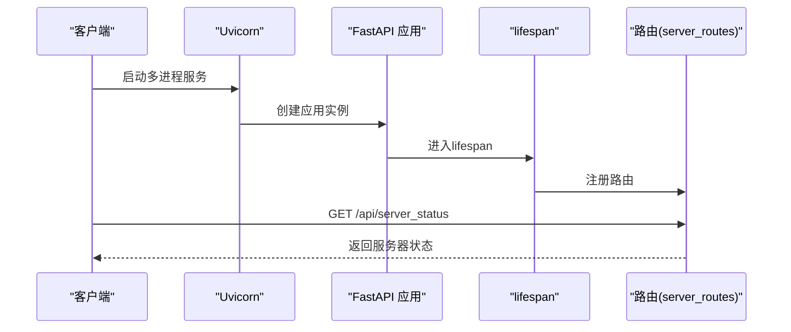
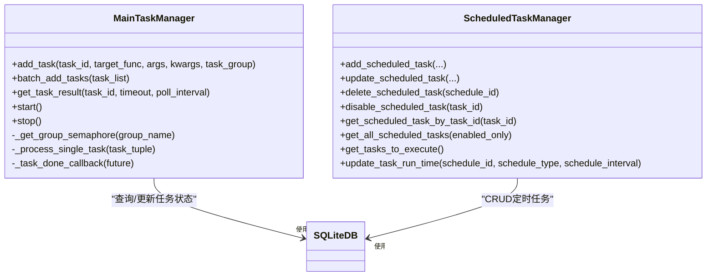
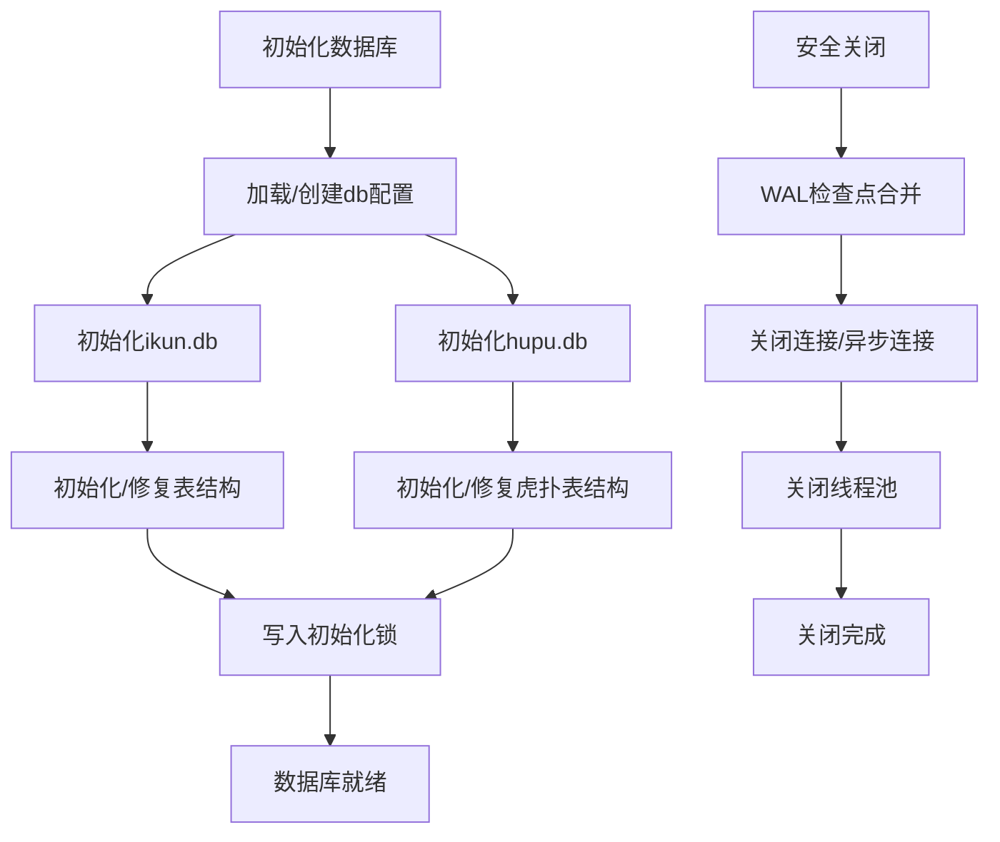
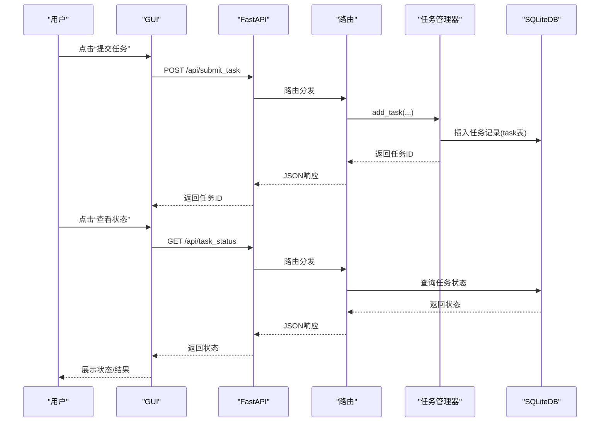
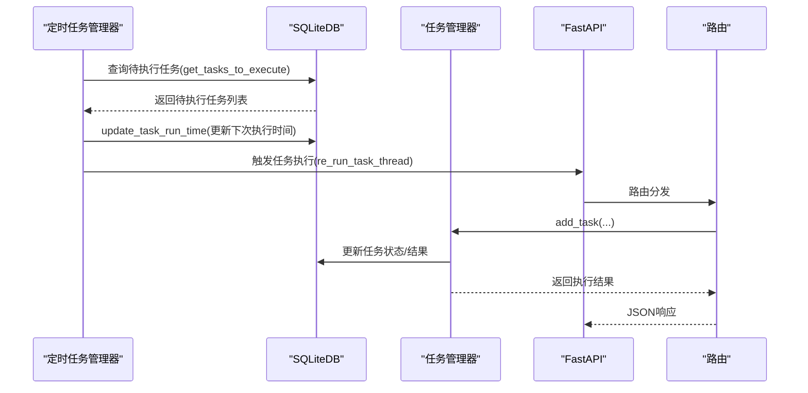
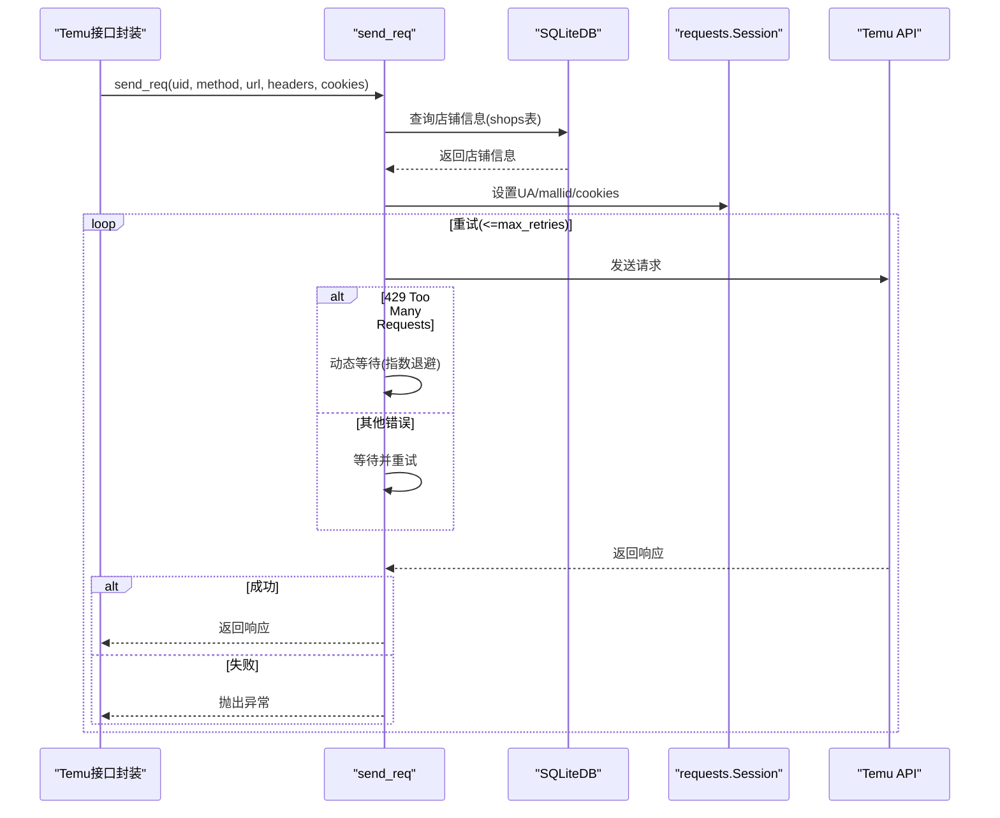
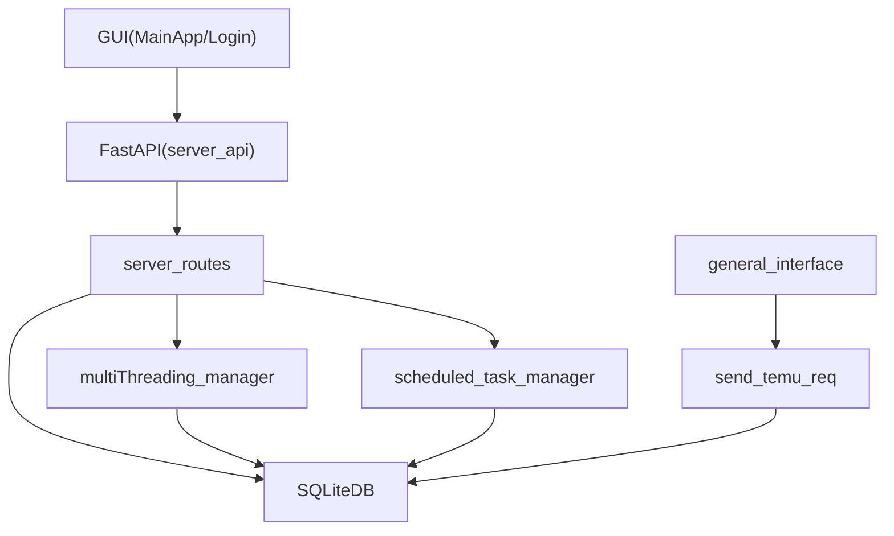

# 数据流架构

<cite>
**本文档引用的文件**
- [main.py](file://main.py)
- [MainApp.py](file://gui/MainApp.py)
- [server_api.py](file://api/server_api.py)
- [server_routes.py](file://api/server_routes/server_routes.py)
- [common_config.py](file://config/common_config.py)
- [classSQLite.py](file://modules/classSQLite.py)
- [db_updater_ikun.py](file://utils/db_updater_ikun.py)
- [multiThreading_manager.py](file://utils/multiThreading_manager.py)
- [scheduled_task_manager.py](file://utils/scheduled_task_manager.py)
- [general_interface.py](file://temu_modules/temu_function/general_interface.py)
- [send_temu_req.py](file://utils/send_temu_req.py)
</cite>

## 目录
1. [简介](#简介)
2. [项目结构](#项目结构)
3. [核心组件](#核心组件)
4. [架构总览](#架构总览)
5. [详细组件分析](#详细组件分析)
6. [依赖关系分析](#依赖关系分析)
7. [性能考虑](#性能考虑)
8. [故障排查指南](#故障排查指南)
9. [结论](#结论)
10. [附录](#附录)

## 简介
本文件面向 ikun_temu_system 的数据流架构，围绕“从用户输入到数据库存储”的完整链路进行系统化梳理，涵盖 GUI 事件处理、API 请求路由、业务逻辑处理、数据库操作、异步与并发机制、缓存与数据一致性保障、以及关键业务场景的数据流图与时序图。旨在帮助开发者与使用者准确理解数据在各模块间的传递方式、参数与返回值处理、错误传播与恢复策略。

## 项目结构
系统采用“桌面应用 + 本地 FastAPI 服务 + SQLite 数据库 + 任务调度与并发控制”的分层架构：
- 桌面应用层：PyQt5 GUI，负责用户交互与页面切换。
- 服务层：FastAPI 多进程服务，提供 REST 接口与静态资源。
- 业务层：Temu 接口封装、任务管理与调度、配置与日志。
- 数据层：SQLite 数据库（ikun.db、hupu.db），统一连接管理与表结构初始化。

图表来源
- [MainApp.py](file://gui/MainApp.py)
- [server_api.py](file://api/server_api.py)
- [server_routes.py](file://api/server_routes/server_routes.py)
- [common_config.py](file://config/common_config.py)
- [classSQLite.py](file://modules/classSQLite.py)

章节来源
- [main.py](file://main.py)
- [MainApp.py](file://gui/MainApp.py)
- [server_api.py](file://api/server_api.py)
- [server_routes.py](file://api/server_routes/server_routes.py)
- [common_config.py](file://config/common_config.py)
- [classSQLite.py](file://modules/classSQLite.py)

## 核心组件
- 桌面应用入口与生命周期管理：负责全局异常捕获、数据库初始化、日志清理器与定时任务执行器的启动与停止。
- 主窗口与页面容器：提供服务器、代理、工具箱等页面的切换与退出流程。
- FastAPI 服务：多进程启动、端口管理、生命周期钩子、CORS 与静态资源。
- 数据库层：SQLiteDB 连接池、事务、类型适配、ORM 风格查询与批量操作。
- 任务与并发：通用多线程任务管理器，支持分组并发控制与超时管理；定时任务管理器负责周期性任务的调度与执行。
- Temu 接口封装：统一请求发送、限流与重试、UA 生成与登录态注入。
- 配置与安全：全局配置管理、加密器、雪花 ID 生成器。

章节来源
- [main.py](file://main.py)
- [MainApp.py](file://gui/MainApp.py)
- [server_api.py](file://api/server_api.py)
- [server_routes.py](file://api/server_routes/server_routes.py)
- [common_config.py](file://config/common_config.py)
- [classSQLite.py](file://modules/classSQLite.py)
- [multiThreading_manager.py](file://utils/multiThreading_manager.py)
- [scheduled_task_manager.py](file://utils/scheduled_task_manager.py)
- [general_interface.py](file://temu_modules/temu_function/general_interface.py)
- [send_temu_req.py](file://utils/send_temu_req.py)

## 架构总览
系统采用事件驱动与异步处理相结合的模式：
- GUI 事件：用户点击按钮触发页面切换与后台任务提交。
- API 路由：FastAPI 路由接收请求，调用业务函数，返回 JSON。
- 业务逻辑：Temu 接口封装与任务管理器协调，数据库层提供持久化。
- 并发与异步：线程池与信号量控制并发，任务超时与回调处理结果，WAL 检查点保障数据一致性。

图表来源
- [server_api.py](file://api/server_api.py)
- [server_routes.py](file://api/server_routes/server_routes.py)
- [classSQLite.py](file://modules/classSQLite.py)

## 详细组件分析

### GUI 事件处理与页面切换
- 主窗口 MainStartApp 负责页面容器与底部按钮组，通过 QStackedWidget 切换页面，按钮点击事件绑定到对应页面。
- 退出流程包含：确认对话框、进度弹窗、停止 API 进程、停止循环线程、关闭数据库、浏览器清理与进程清理。
- 日期监测线程通过信号与主线程交互，实现到期提醒。

图表来源
- [MainApp.py](file://gui/MainApp.py)

章节来源
- [MainApp.py](file://gui/MainApp.py)

### API 请求路由与服务生命周期
- FastAPI 应用通过 lifespan 生命周期钩子启动任务管理器，服务启动时注册多模块路由。
- 支持多进程启动与端口管理，提供服务器状态、设置读取与保存、启动/停止/重启等接口。
- CORS 与静态资源挂载，版本头中间件统一响应头。

图表来源
- [server_api.py](file://api/server_api.py)
- [server_routes.py](file://api/server_routes/server_routes.py)

章节来源
- [server_api.py](file://api/server_api.py)
- [server_routes.py](file://api/server_routes/server_routes.py)

### 业务逻辑处理与并发控制
- 通用多线程任务管理器支持：
  - 全局并发与功能分组并发控制（信号量）。
  - 任务超时检测与回调处理。
  - 任务状态跟踪与结果回传。
- 定时任务管理器支持一次性与间隔两种调度类型，自动更新下次执行时间与运行计数。

图表来源
- [multiThreading_manager.py](file://utils/multiThreading_manager.py)
- [scheduled_task_manager.py](file://utils/scheduled_task_manager.py)
- [classSQLite.py](file://modules/classSQLite.py)

章节来源
- [multiThreading_manager.py](file://utils/multiThreading_manager.py)
- [scheduled_task_manager.py](file://utils/scheduled_task_manager.py)
- [classSQLite.py](file://modules/classSQLite.py)

### 数据库操作与一致性保障
- SQLiteDB 提供连接池、事务、类型适配（JSON/datetime/date）、ORM 风格 CRUD 与批量插入。
- 初始化流程：创建/加载数据库配置 → 初始化 ikun/hupu 数据库 → 表结构初始化与修复 → 写入初始化锁。
- 全局安全关闭：WAL 检查点合并、连接关闭、线程池关闭，防止文件损坏。

图表来源
- [common_config.py](file://config/common_config.py)
- [db_updater_ikun.py](file://utils/db_updater_ikun.py)
- [classSQLite.py](file://modules/classSQLite.py)

章节来源
- [common_config.py](file://config/common_config.py)
- [db_updater_ikun.py](file://utils/db_updater_ikun.py)
- [classSQLite.py](file://modules/classSQLite.py)

### 异步数据处理与事件驱动模型
- 事件驱动：GUI 事件 → API 路由 → 业务函数 → 数据库操作 → 结果回调。
- 并发策略：线程池 + 信号量，全局与功能分组两级并发控制；任务超时与回调保证响应性。
- 异步机制：SQLiteDB 异步连接与线程池配合；FastAPI 多进程提升吞吐。

章节来源
- [server_api.py](file://api/server_api.py)
- [multiThreading_manager.py](file://utils/multiThreading_manager.py)
- [classSQLite.py](file://modules/classSQLite.py)

### 缓存机制与数据同步策略
- 配置缓存：服务器启动时间与运行时长缓存于内存，从配置管理器读取/写入。
- 限流缓存：基于字典与锁的限流状态缓存（按店铺+URL 维度），定期清理过期状态。
- 数据同步：WAL 检查点合并确保落盘一致性；任务状态通过数据库统一管理，避免竞态。

章节来源
- [server_routes.py](file://api/server_routes/server_routes.py)
- [send_temu_req.py](file://utils/send_temu_req.py)
- [common_config.py](file://config/common_config.py)

### 关键业务场景数据流图与时序图

#### 场景一：用户提交任务并查看状态

图表来源
- [server_routes.py](file://api/server_routes/server_routes.py)
- [multiThreading_manager.py](file://utils/multiThreading_manager.py)
- [classSQLite.py](file://modules/classSQLite.py)

#### 场景二：定时任务自动执行与状态更新

图表来源
- [scheduled_task_manager.py](file://utils/scheduled_task_manager.py)
- [server_routes.py](file://api/server_routes/server_routes.py)
- [multiThreading_manager.py](file://utils/multiThreading_manager.py)
- [classSQLite.py](file://modules/classSQLite.py)

#### 场景三：Temu 接口请求与限流处理

图表来源
- [general_interface.py](file://temu_modules/temu_function/general_interface.py)
- [send_temu_req.py](file://utils/send_temu_req.py)
- [classSQLite.py](file://modules/classSQLite.py)

## 依赖关系分析
- 模块耦合：
  - GUI 与服务通过 HTTP 通信，低耦合。
  - 业务层依赖数据库层，任务管理器与定时任务管理器共享数据库实例。
  - Temu 接口封装依赖配置与数据库，间接依赖任务管理器。
- 外部依赖：
  - FastAPI/Uvicorn 提供服务端能力。
  - requests 提供 HTTP 请求能力。
  - aiosqlite 提供异步 SQLite 访问。

图表来源
- [MainApp.py](file://gui/MainApp.py)
- [server_api.py](file://api/server_api.py)
- [server_routes.py](file://api/server_routes/server_routes.py)
- [multiThreading_manager.py](file://utils/multiThreading_manager.py)
- [scheduled_task_manager.py](file://utils/scheduled_task_manager.py)
- [general_interface.py](file://temu_modules/temu_function/general_interface.py)
- [send_temu_req.py](file://utils/send_temu_req.py)
- [classSQLite.py](file://modules/classSQLite.py)

章节来源
- [server_api.py](file://api/server_api.py)
- [server_routes.py](file://api/server_routes/server_routes.py)
- [multiThreading_manager.py](file://utils/multiThreading_manager.py)
- [scheduled_task_manager.py](file://utils/scheduled_task_manager.py)
- [general_interface.py](file://temu_modules/temu_function/general_interface.py)
- [send_temu_req.py](file://utils/send_temu_req.py)
- [classSQLite.py](file://modules/classSQLite.py)

## 性能考虑
- 并发控制：通过全局与功能分组信号量限制并发，避免资源争用；任务超时防止阻塞。
- I/O 优化：SQLiteDB 使用连接池与线程池，批量插入减少事务开销；WAL 模式提升写入性能。
- 网络请求：动态限流等待与指数退避降低 429 风险；固定 UA 生成提升稳定性。
- 服务扩展：FastAPI 多进程部署提升吞吐；端口管理与进程清理保障稳定性。

## 故障排查指南
- 全局异常捕获：统一记录异常堆栈至 error.log 并安全关闭数据库，避免文件损坏。
- 服务器启动失败：检查端口占用与进程清理，必要时强制终止占用进程。
- 任务超时：检查任务耗时与并发配置，适当调整超时阈值。
- 数据库异常：确认 WAL 检查点是否成功，必要时手动合并；检查线程池与连接是否正确关闭。
- 请求限流：关注限流状态缓存清理线程，避免内存泄漏；检查 mallid 与 Cookie 有效性。

章节来源
- [main.py](file://main.py)
- [server_api.py](file://api/server_api.py)
- [common_config.py](file://config/common_config.py)
- [send_temu_req.py](file://utils/send_temu_req.py)

## 结论
本系统通过清晰的分层架构与严格的并发/异常处理机制，实现了从 GUI 事件到数据库存储的稳定数据流。FastAPI 多进程服务、SQLiteDB 连接池与任务管理器共同保障了高并发下的可靠性与一致性。Temu 接口封装与限流策略进一步提升了外部请求的稳定性。建议在生产环境中持续监控任务执行与数据库状态，结合日志与异常捕获机制进行快速定位与恢复。

## 附录
- 关键配置路径与文件：
  - 数据库配置：./配置文件_系统配置/db_config.json、./配置文件_系统配置/hupu_db_config.json
  - 初始化锁：./config/lock.txt
- 常用接口参考：
  - 服务器状态：GET /api/server_status
  - 设置读取/保存：GET /api/get_settings, POST /api/save_settings
  - 任务状态：GET /api/task_status（需业务路由支持）