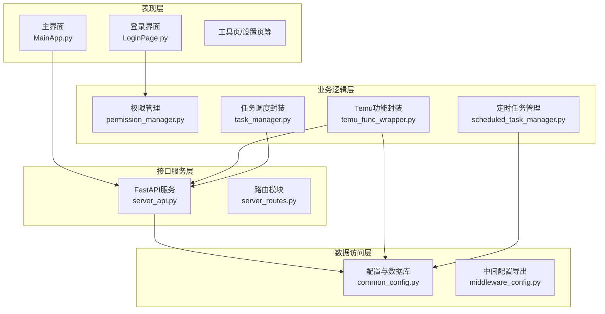
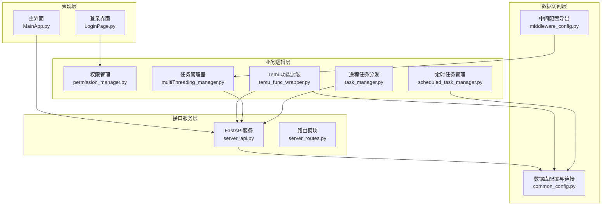
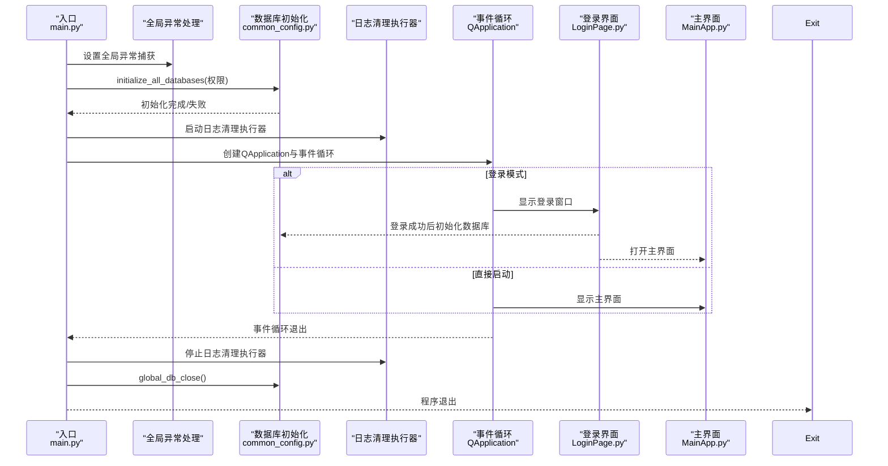
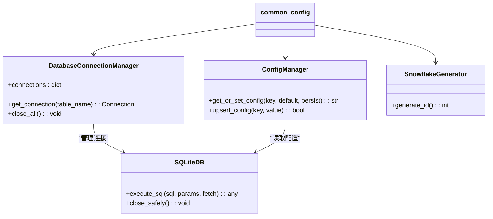
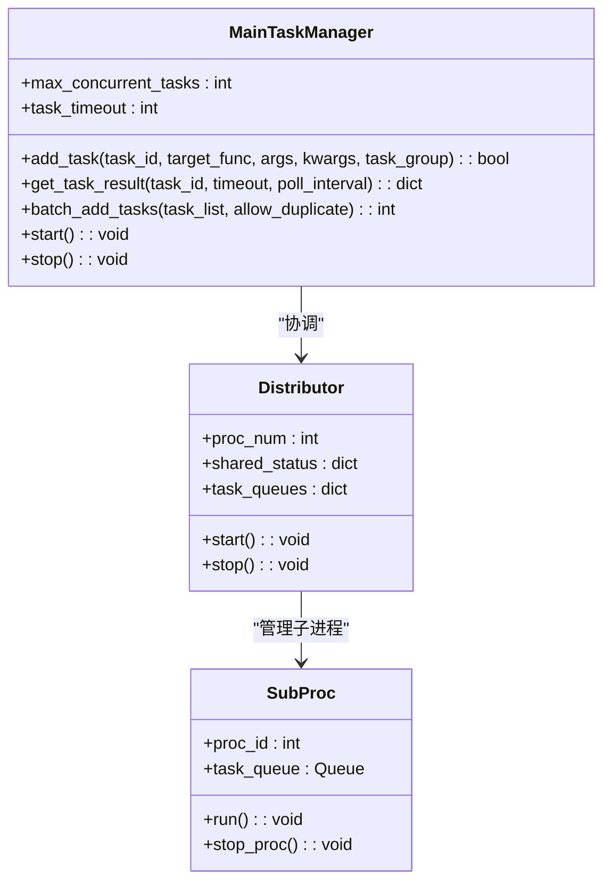
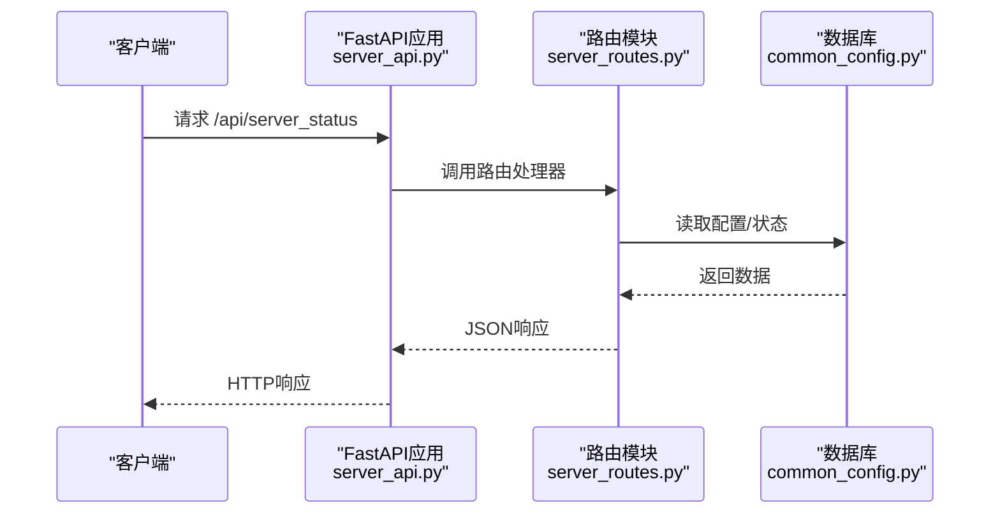
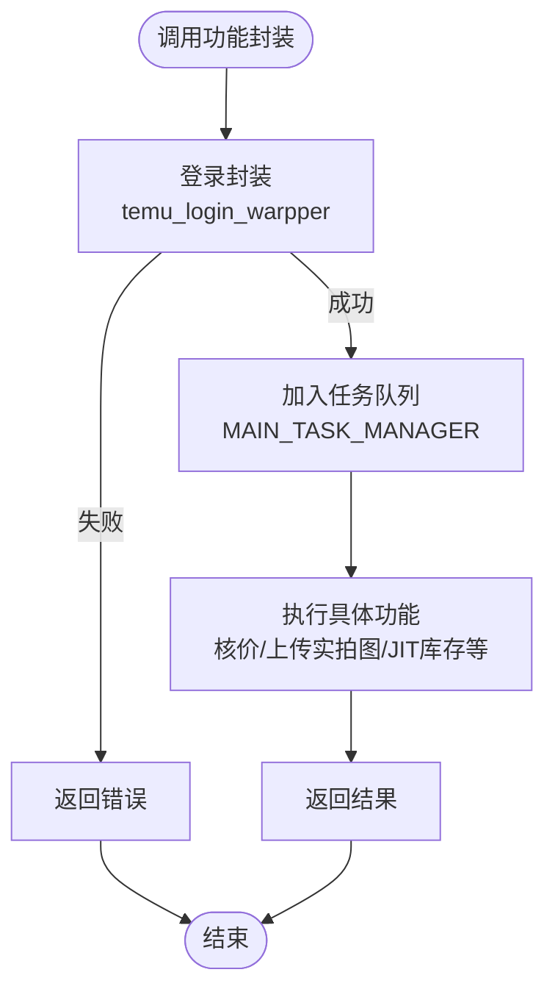
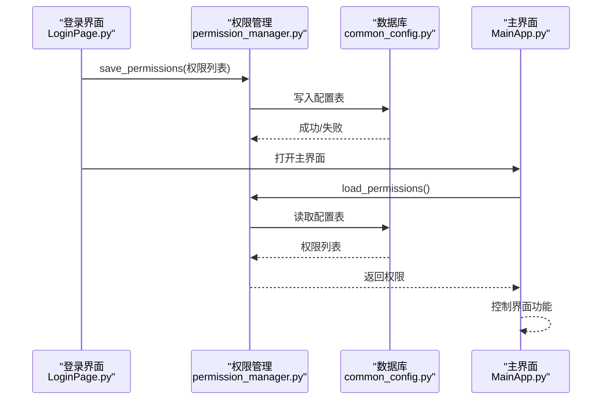
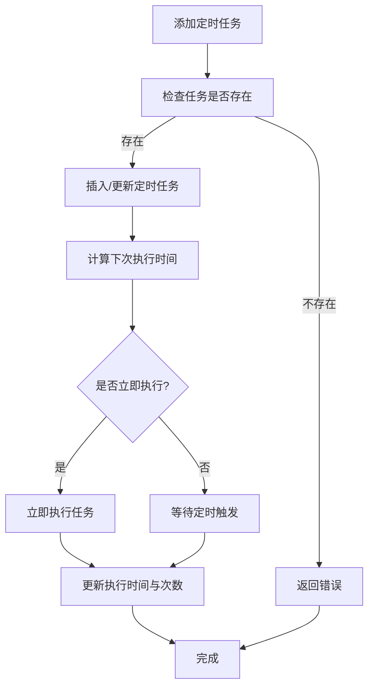
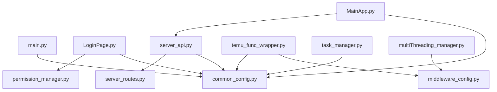

# 整体架构设计

<cite>
**本文档引用的文件**
- [main.py](file://main.py)
- [common_config.py](file://config/common_config.py)
- [start_config.py](file://config/start_config.py)
- [MainApp.py](file://gui/MainApp.py)
- [server_api.py](file://api/server_api.py)
- [server_routes.py](file://api/server_routes/server_routes.py)
- [permission_manager.py](file://config/permission_manager.py)
- [task_manager.py](file://modules/task_manager.py)
- [multiThreading_manager.py](file://utils/multiThreading_manager.py)
- [temu_func_wrapper.py](file://temu_modules/temu_func_wrapper.py)
- [scheduled_task_manager.py](file://utils/scheduled_task_manager.py)
- [middleware_config.py](file://config/middleware_config.py)
- [LoginPage.py](file://gui/LoginPage.py)
- [TemuBase.py](file://utils/TemuBase.py)
</cite>

## 目录
1. [简介](#简介)
2. [项目结构](#项目结构)
3. [核心组件](#核心组件)
4. [架构总览](#架构总览)
5. [详细组件分析](#详细组件分析)
6. [依赖关系分析](#依赖关系分析)
7. [性能考虑](#性能考虑)
8. [故障排除指南](#故障排除指南)
9. [结论](#结论)

## 简介
本项目为ikun_temu_system，是一个基于PyQt5的桌面应用，结合FastAPI提供本地接口服务，支持多进程并发任务调度与Temu平台相关业务功能。系统采用分层架构设计，包含表现层（GUI）、业务逻辑层（任务调度与功能封装）、数据访问层（SQLite数据库），并通过权限管理与配置中心实现模块化与可扩展性。

## 项目结构
系统采用按功能域划分的模块化组织方式：
- 表现层：gui目录下的各类页面组件（登录、主界面、工具页等）
- 业务逻辑层：modules与temu_modules目录下的任务与功能封装
- 数据访问层：config与utils目录下的数据库与配置管理
- 接口服务层：api目录下的FastAPI服务与路由
- 工具与支撑：lite_modules与spider_modules等辅助模块

**图表来源**
- [main.py:1-233](file://main.py#L1-L233)
- [common_config.py:1-394](file://config/common_config.py#L1-L394)
- [server_api.py:1-474](file://api/server_api.py#L1-L474)
- [server_routes.py:1-289](file://api/server_routes/server_routes.py#L1-L289)
- [permission_manager.py:1-126](file://config/permission_manager.py#L1-L126)
- [task_manager.py:1-319](file://modules/task_manager.py#L1-L319)
- [temu_func_wrapper.py:1-701](file://temu_modules/temu_func_wrapper.py#L1-L701)
- [scheduled_task_manager.py:1-446](file://utils/scheduled_task_manager.py#L1-L446)
- [middleware_config.py:1-13](file://config/middleware_config.py#L1-L13)
- [LoginPage.py:1-586](file://gui/LoginPage.py#L1-L586)
- [MainApp.py:1-800](file://gui/MainApp.py#L1-L800)

**章节来源**
- [main.py:1-233](file://main.py#L1-L233)
- [common_config.py:1-394](file://config/common_config.py#L1-L394)

## 核心组件
- 启动入口与生命周期管理：main.py负责全局异常捕获、数据库初始化、日志清理、事件循环与优雅退出
- 配置与数据库管理：common_config.py提供数据库连接管理、全局关闭、并发配置与雪花ID生成器
- 任务管理器：multiThreading_manager.py提供通用多线程任务管理；task_manager.py提供进程级任务分发
- 接口服务：server_api.py基于FastAPI提供多进程服务、生命周期管理与端口管理
- 功能封装：temu_func_wrapper.py封装Temu相关业务（登录、核价、上传实拍图、JIT库存等）
- 权限管理：permission_manager.py统一保存与读取权限，配合GUI登录流程
- 定时任务：scheduled_task_manager.py管理定时任务的创建、更新、执行与调度

**章节来源**
- [main.py:55-202](file://main.py#L55-L202)
- [common_config.py:15-334](file://config/common_config.py#L15-L334)
- [multiThreading_manager.py:42-555](file://utils/multiThreading_manager.py#L42-L555)
- [task_manager.py:144-319](file://modules/task_manager.py#L144-L319)
- [server_api.py:40-138](file://api/server_api.py#L40-L138)
- [temu_func_wrapper.py:20-701](file://temu_modules/temu_func_wrapper.py#L20-L701)
- [permission_manager.py:12-126](file://config/permission_manager.py#L12-L126)
- [scheduled_task_manager.py:11-446](file://utils/scheduled_task_manager.py#L11-L446)

## 架构总览
系统采用三层架构与多进程并发模型：
- 表现层：PyQt5界面，登录与主界面分别在LoginPage与MainApp中实现
- 业务逻辑层：任务调度（多线程/多进程）、功能封装（Temu业务）、权限与配置管理
- 数据访问层：SQLite数据库，通过common_config统一管理连接与关闭
- 接口服务层：FastAPI多进程服务，提供REST接口与静态资源

**图表来源**
- [LoginPage.py:209-490](file://gui/LoginPage.py#L209-L490)
- [MainApp.py:179-280](file://gui/MainApp.py#L179-L280)
- [server_api.py:59-104](file://api/server_api.py#L59-L104)
- [server_routes.py:11-289](file://api/server_routes/server_routes.py#L11-L289)
- [common_config.py:157-334](file://config/common_config.py#L157-L334)
- [middleware_config.py:1-13](file://config/middleware_config.py#L1-L13)
- [multiThreading_manager.py:42-555](file://utils/multiThreading_manager.py#L42-L555)
- [task_manager.py:144-319](file://modules/task_manager.py#L144-L319)
- [temu_func_wrapper.py:20-701](file://temu_modules/temu_func_wrapper.py#L20-L701)
- [scheduled_task_manager.py:11-446](file://utils/scheduled_task_manager.py#L11-L446)

## 详细组件分析

### 启动流程与生命周期管理
系统启动从main.py入口开始，执行全局异常捕获、数据库初始化、日志清理、事件循环与优雅退出。登录模式与打包模式影响初始化策略，权限决定数据库初始化范围。

**图表来源**
- [main.py:21-202](file://main.py#L21-L202)
- [common_config.py:245-334](file://config/common_config.py#L245-L334)
- [LoginPage.py:414-454](file://gui/LoginPage.py#L414-L454)
- [MainApp.py:179-280](file://gui/MainApp.py#L179-L280)

**章节来源**
- [main.py:62-202](file://main.py#L62-L202)
- [common_config.py:245-334](file://config/common_config.py#L245-L334)
- [LoginPage.py:414-454](file://gui/LoginPage.py#L414-L454)

### 数据库与配置管理
common_config.py提供数据库连接管理、全局关闭、并发配置与雪花ID生成器。start_config.py负责启动主任务管理器与全局异常处理钩子。

**图表来源**
- [common_config.py:16-141](file://config/common_config.py#L16-L141)
- [common_config.py:197-334](file://config/common_config.py#L197-L334)

**章节来源**
- [common_config.py:16-141](file://config/common_config.py#L16-L141)
- [common_config.py:197-334](file://config/common_config.py#L197-L334)
- [start_config.py:19-106](file://config/start_config.py#L19-L106)

### 任务调度与并发模型
系统采用双层并发模型：多线程任务管理器与多进程任务分发器。multiThreading_manager.py提供通用多线程任务管理，task_manager.py提供进程级任务分发与队列通信。

**图表来源**
- [multiThreading_manager.py:42-555](file://utils/multiThreading_manager.py#L42-L555)
- [task_manager.py:144-319](file://modules/task_manager.py#L144-L319)

**章节来源**
- [multiThreading_manager.py:42-555](file://utils/multiThreading_manager.py#L42-L555)
- [task_manager.py:144-319](file://modules/task_manager.py#L144-L319)

### 接口服务与路由
server_api.py基于FastAPI提供多进程服务，lifespan管理生命周期，注册通用、店铺、任务、服务器路由。server_routes.py提供服务器状态、设置管理等接口。

**图表来源**
- [server_api.py:59-104](file://api/server_api.py#L59-L104)
- [server_routes.py:91-136](file://api/server_routes/server_routes.py#L91-L136)
- [common_config.py:197-244](file://config/common_config.py#L197-L244)

**章节来源**
- [server_api.py:59-138](file://api/server_api.py#L59-L138)
- [server_routes.py:91-289](file://api/server_routes/server_routes.py#L91-L289)

### 功能封装与插件化
temu_func_wrapper.py提供Temu相关业务的统一入口，封装登录、核价、上传实拍图、JIT库存等功能，通过MAIN_TASK_MANAGER进行任务调度，实现插件化与可扩展性。

**图表来源**
- [temu_func_wrapper.py:20-701](file://temu_modules/temu_func_wrapper.py#L20-L701)
- [multiThreading_manager.py:108-136](file://utils/multiThreading_manager.py#L108-L136)

**章节来源**
- [temu_func_wrapper.py:20-701](file://temu_modules/temu_func_wrapper.py#L20-L701)
- [multiThreading_manager.py:108-136](file://utils/multiThreading_manager.py#L108-L136)

### 权限管理与GUI集成
permission_manager.py提供权限的保存与读取，LoginPage在登录成功后初始化数据库并保存权限，MainApp根据权限控制界面功能。

**图表来源**
- [LoginPage.py:434-436](file://gui/LoginPage.py#L434-L436)
- [permission_manager.py:16-88](file://config/permission_manager.py#L16-L88)
- [common_config.py:197-244](file://config/common_config.py#L197-L244)
- [MainApp.py:576-584](file://gui/MainApp.py#L576-L584)

**章节来源**
- [permission_manager.py:16-88](file://config/permission_manager.py#L16-L88)
- [LoginPage.py:434-436](file://gui/LoginPage.py#L434-L436)
- [MainApp.py:576-584](file://gui/MainApp.py#L576-L584)

### 定时任务管理
scheduled_task_manager.py提供定时任务的增删改查、执行与调度，支持一次性与间隔两种模式，与数据库交互完成任务状态管理。

**图表来源**
- [scheduled_task_manager.py:17-175](file://utils/scheduled_task_manager.py#L17-L175)
- [scheduled_task_manager.py:368-446](file://utils/scheduled_task_manager.py#L368-L446)

**章节来源**
- [scheduled_task_manager.py:17-175](file://utils/scheduled_task_manager.py#L17-L175)
- [scheduled_task_manager.py:368-446](file://utils/scheduled_task_manager.py#L368-L446)

## 依赖关系分析
系统采用弱耦合、高内聚的设计，主要依赖关系如下：
- main.py依赖common_config进行数据库初始化与全局关闭
- LoginPage依赖permission_manager与common_config进行权限保存与数据库初始化
- MainApp依赖server_api与common_config进行API控制与数据库关闭
- server_api依赖server_routes与common_config进行路由注册与配置读取
- temu_func_wrapper依赖common_config与middleware_config进行数据库与并发配置访问

**图表来源**
- [main.py:10-20](file://main.py#L10-L20)
- [LoginPage.py:416-436](file://gui/LoginPage.py#L416-L436)
- [MainApp.py:17-29](file://gui/MainApp.py#L17-L29)
- [server_api.py:22-34](file://api/server_api.py#L22-L34)
- [temu_func_wrapper.py:5-8](file://temu_modules/temu_func_wrapper.py#L5-L8)
- [middleware_config.py:1-13](file://config/middleware_config.py#L1-L13)
- [task_manager.py:11-12](file://modules/task_manager.py#L11-L12)
- [multiThreading_manager.py:12](file://utils/multiThreading_manager.py#L12)

**章节来源**
- [main.py:10-20](file://main.py#L10-L20)
- [LoginPage.py:416-436](file://gui/LoginPage.py#L416-L436)
- [MainApp.py:17-29](file://gui/MainApp.py#L17-L29)
- [server_api.py:22-34](file://api/server_api.py#L22-L34)
- [temu_func_wrapper.py:5-8](file://temu_modules/temu_func_wrapper.py#L5-L8)
- [middleware_config.py:1-13](file://config/middleware_config.py#L1-L13)
- [task_manager.py:11-12](file://modules/task_manager.py#L11-L12)
- [multiThreading_manager.py:12](file://utils/multiThreading_manager.py#L12)

## 性能考虑
- 并发控制：通过middleware_config导出的并发配置与multiThreading_manager的信号量实现全局与功能级并发控制
- 数据库优化：common_config提供WAL模式、连接池配置与检查点合并，降低I/O开销
- 任务调度：多进程任务分发器通过队列避免跨进程直接调用，减少锁竞争
- 日志管理：start_config提供日志轮转与异常捕获，避免日志文件过大影响性能

## 故障排除指南
- 全局异常处理：main.py与start_config提供全局异常捕获与日志记录，确保异常信息写入error.log并安全关闭数据库
- 数据库关闭：common_config提供global_db_close，执行WAL检查点合并与连接关闭，防止文件损坏
- 任务超时：multiThreading_manager在任务执行超时后标记状态并清理资源
- 服务器启动失败：server_api在端口占用时尝试释放端口并记录错误，避免启动阻塞

**章节来源**
- [main.py:21-53](file://main.py#L21-L53)
- [start_config.py:27-106](file://config/start_config.py#L27-L106)
- [common_config.py:59-135](file://config/common_config.py#L59-L135)
- [multiThreading_manager.py:251-273](file://utils/multiThreading_manager.py#L251-L273)
- [server_api.py:122-138](file://api/server_api.py#L122-L138)

## 结论
ikun_temu_system采用清晰的分层架构与模块化设计，通过权限管理、任务调度与接口服务实现功能扩展与可维护性。系统具备良好的并发控制、数据库优化与异常处理能力，适合在桌面应用与本地服务场景下稳定运行。