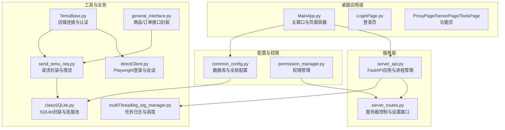
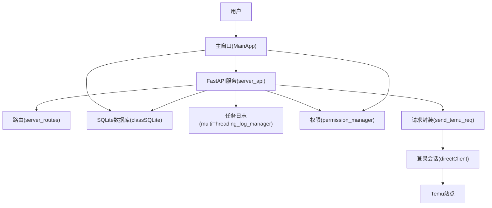
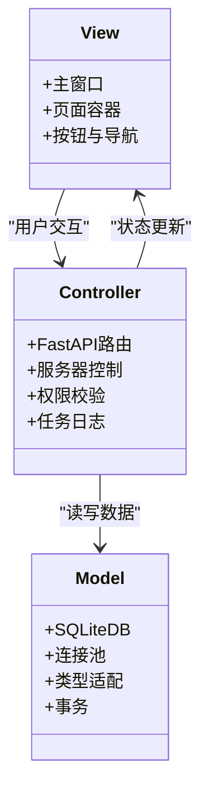
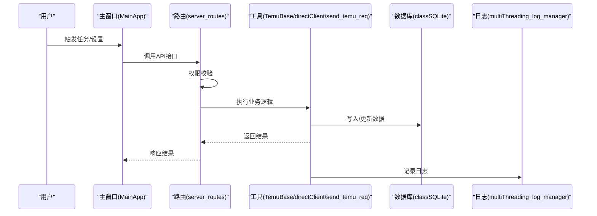
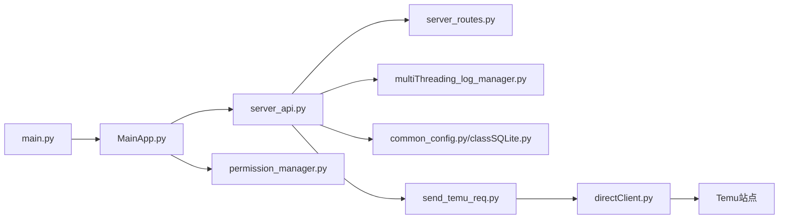

# 系统架构

<cite>
**本文档引用的文件**
- [main.py](file://main.py)
- [MainApp.py](file://gui/MainApp.py)
- [server_api.py](file://api/server_api.py)
- [server_routes.py](file://api/server_routes/server_routes.py)
- [common_config.py](file://config/common_config.py)
- [TemuBase.py](file://utils/TemuBase.py)
- [classSQLite.py](file://modules/classSQLite.py)
- [directClient.py](file://utils/directClient.py)
- [send_temu_req.py](file://utils/send_temu_req.py)
- [permission_manager.py](file://config/permission_manager.py)
- [multiThreading_log_manager.py](file://utils/multiThreading_log_manager.py)
- [general_interface.py](file://temu_modules/temu_function/general_interface.py)
</cite>

## 目录
1. [简介](#简介)
2. [项目结构](#项目结构)
3. [核心组件](#核心组件)
4. [架构总览](#架构总览)
5. [详细组件分析](#详细组件分析)
6. [依赖关系分析](#依赖关系分析)
7. [性能考量](#性能考量)
8. [故障排查指南](#故障排查指南)
9. [结论](#结论)
10. [附录](#附录)

## 简介
本系统围绕“ikun_temu_system”构建，采用桌面应用与本地API服务协同的混合架构，结合分层设计与模块化组织，实现Temu平台的多任务自动化与管理。系统通过PyQt5提供图形界面，通过FastAPI提供本地REST API，通过SQLite数据库持久化配置与任务状态，并通过Playwright/Requests实现Temu站点的登录态请求与业务操作。

## 项目结构
项目采用按功能域划分的模块化组织方式：
- gui：桌面应用界面与页面容器
- api：FastAPI服务与路由模块
- config：配置与权限管理
- utils：通用工具与Temu请求封装
- modules：数据库与任务管理基础设施
- temu_modules：Temu业务功能模块
- spider_modules：爬虫相关模块（扩展能力）
- static/templates：前端静态资源与模板

图表来源
- [MainApp.py:179-280](file://gui/MainApp.py#L179-L280)
- [server_api.py:60-110](file://api/server_api.py#L60-L110)
- [server_routes.py:12-289](file://api/server_routes/server_routes.py#L12-L289)
- [common_config.py:15-140](file://config/common_config.py#L15-L140)
- [TemuBase.py:12-656](file://utils/TemuBase.py#L12-L656)
- [classSQLite.py:359-800](file://modules/classSQLite.py#L359-L800)
- [directClient.py:692-800](file://utils/directClient.py#L692-L800)
- [send_temu_req.py:64-244](file://utils/send_temu_req.py#L64-L244)
- [permission_manager.py:12-126](file://config/permission_manager.py#L12-L126)
- [multiThreading_log_manager.py:122-143](file://utils/multiThreading_log_manager.py#L122-L143)
- [general_interface.py:7-326](file://temu_modules/temu_function/general_interface.py#L7-L326)

章节来源
- [main.py:1-233](file://main.py#L1-L233)
- [MainApp.py:179-800](file://gui/MainApp.py#L179-L800)
- [server_api.py:1-474](file://api/server_api.py#L1-L474)
- [server_routes.py:1-289](file://api/server_routes/server_routes.py#L1-L289)
- [common_config.py:1-394](file://config/common_config.py#L1-L394)
- [TemuBase.py:1-656](file://utils/TemuBase.py#L1-L656)
- [classSQLite.py:1-800](file://modules/classSQLite.py#L1-L800)
- [directClient.py:1-800](file://utils/directClient.py#L1-L800)
- [send_temu_req.py:1-244](file://utils/send_temu_req.py#L1-L244)
- [permission_manager.py:1-126](file://config/permission_manager.py#L1-L126)
- [multiThreading_log_manager.py:110-143](file://utils/multiThreading_log_manager.py#L110-L143)
- [general_interface.py:1-326](file://temu_modules/temu_function/general_interface.py#L1-L326)

## 核心组件
- 入口与生命周期管理：main.py负责全局异常捕获、数据库初始化、日志清理、事件循环与退出清理。
- 桌面应用主框架：MainApp.py提供主窗口、页面切换、任务管理器集成与退出流程。
- 本地API服务：server_api.py承载FastAPI应用、多进程管理、生命周期钩子与中间件。
- 配置与权限：common_config.py集中数据库与全局配置；permission_manager.py提供权限持久化与校验。
- 数据层：classSQLite.py提供连接池、事务、JSON/时间类型适配与ORM风格API。
- Temu业务：TemuBase.py封装店铺连接、认证与多区域Cookies；directClient.py负责Playwright登录与会话；send_temu_req.py统一请求与限流；general_interface.py封装商品/订单接口。
- 任务与日志：multiThreading_log_manager.py提供任务日志与调度管理。

章节来源
- [main.py:21-201](file://main.py#L21-L201)
- [MainApp.py:179-280](file://gui/MainApp.py#L179-L280)
- [server_api.py:40-110](file://api/server_api.py#L40-L110)
- [common_config.py:15-140](file://config/common_config.py#L15-L140)
- [classSQLite.py:359-800](file://modules/classSQLite.py#L359-L800)
- [TemuBase.py:12-656](file://utils/TemuBase.py#L12-L656)
- [directClient.py:692-800](file://utils/directClient.py#L692-L800)
- [send_temu_req.py:64-244](file://utils/send_temu_req.py#L64-L244)
- [permission_manager.py:12-126](file://config/permission_manager.py#L12-L126)
- [multiThreading_log_manager.py:122-143](file://utils/multiThreading_log_manager.py#L122-L143)
- [general_interface.py:7-326](file://temu_modules/temu_function/general_interface.py#L7-L326)

## 架构总览
系统采用“桌面GUI + 本地API服务”的双层架构：
- 桌面层：PyQt5主窗口与页面容器，负责用户交互与任务入口。
- 服务层：FastAPI提供REST接口，支持多进程与周期任务，配合中间件与静态资源。
- 数据层：SQLite数据库，通过统一连接池与类型适配器提供高性能与类型安全。
- 业务层：Temu登录态管理、请求封装与业务接口调用，结合权限校验与任务日志。

图表来源
- [MainApp.py:179-280](file://gui/MainApp.py#L179-L280)
- [server_api.py:60-110](file://api/server_api.py#L60-L110)
- [server_routes.py:12-289](file://api/server_routes/server_routes.py#L12-L289)
- [common_config.py:15-140](file://config/common_config.py#L15-L140)
- [classSQLite.py:359-800](file://modules/classSQLite.py#L359-L800)
- [multiThreading_log_manager.py:122-143](file://utils/multiThreading_log_manager.py#L122-L143)
- [permission_manager.py:12-126](file://config/permission_manager.py#L12-L126)
- [send_temu_req.py:64-244](file://utils/send_temu_req.py#L64-L244)
- [directClient.py:692-800](file://utils/directClient.py#L692-L800)

## 详细组件分析

### MVC架构模式
- Model（模型）：数据库与配置。通过classSQLite.py提供统一的CRUD与查询构建器；common_config.py集中数据库连接与全局配置。
- View（视图）：桌面界面。MainApp.py组织页面与按钮，提供用户交互入口。
- Controller（控制器）：API路由与业务编排。server_routes.py处理服务器控制与设置接口；TemuBase.py与directClient.py协调登录与会话；send_temu_req.py统一请求与限流。

图表来源
- [classSQLite.py:359-800](file://modules/classSQLite.py#L359-L800)
- [MainApp.py:179-280](file://gui/MainApp.py#L179-L280)
- [server_routes.py:12-289](file://api/server_routes/server_routes.py#L12-L289)
- [common_config.py:15-140](file://config/common_config.py#L15-L140)

章节来源
- [MainApp.py:179-280](file://gui/MainApp.py#L179-L280)
- [server_routes.py:12-289](file://api/server_routes/server_routes.py#L12-L289)
- [common_config.py:15-140](file://config/common_config.py#L15-L140)
- [classSQLite.py:359-800](file://modules/classSQLite.py#L359-L800)

### 数据流架构（从用户输入到数据库存储）
1) 用户在主窗口触发任务或设置变更。
2) GUI调用API服务（FastAPI）或直接调用工具模块。
3) API路由进行权限校验与参数处理。
4) 工具模块（如TemuBase、directClient、send_temu_req）执行登录态管理与请求。
5) 请求结果通过统一接口写入数据库（classSQLite）。
6) 任务日志与状态通过日志管理器记录与调度。

图表来源
- [MainApp.py:179-280](file://gui/MainApp.py#L179-L280)
- [server_routes.py:12-289](file://api/server_routes/server_routes.py#L12-L289)
- [TemuBase.py:12-656](file://utils/TemuBase.py#L12-L656)
- [directClient.py:692-800](file://utils/directClient.py#L692-L800)
- [send_temu_req.py:64-244](file://utils/send_temu_req.py#L64-L244)
- [classSQLite.py:359-800](file://modules/classSQLite.py#L359-L800)
- [multiThreading_log_manager.py:122-143](file://utils/multiThreading_log_manager.py#L122-L143)

章节来源
- [TemuBase.py:12-656](file://utils/TemuBase.py#L12-L656)
- [directClient.py:692-800](file://utils/directClient.py#L692-L800)
- [send_temu_req.py:64-244](file://utils/send_temu_req.py#L64-L244)
- [classSQLite.py:359-800](file://modules/classSQLite.py#L359-L800)
- [multiThreading_log_manager.py:122-143](file://utils/multiThreading_log_manager.py#L122-L143)

### 设计模式应用
- 工厂模式：权限校验与任务类型映射（通过配置与路由实现任务工厂式分发）。
- 观察者模式：日志管理器与任务状态广播（通过日志记录与UI刷新实现）。
- 策略模式：请求策略（UA生成、限流策略、重试策略）封装于send_temu_req.py。
- 单例/进程内单例：任务日志管理器（多进程兼容）与数据库连接池。

章节来源
- [server_routes.py:91-127](file://api/server_routes/server_routes.py#L91-L127)
- [send_temu_req.py:64-244](file://utils/send_temu_req.py#L64-L244)
- [multiThreading_log_manager.py:122-143](file://utils/multiThreading_log_manager.py#L122-L143)
- [classSQLite.py:294-331](file://modules/classSQLite.py#L294-L331)

## 依赖关系分析
- 组件耦合：GUI与API通过路由解耦；API与工具模块通过统一接口解耦；工具模块与数据库通过SQLite封装解耦。
- 外部依赖：FastAPI、uvicorn、Playwright、requests、loguru、psutil等。
- 循环依赖规避：通过延迟导入与模块职责单一化避免循环依赖。

图表来源
- [main.py:1-233](file://main.py#L1-L233)
- [MainApp.py:179-280](file://gui/MainApp.py#L179-L280)
- [server_api.py:60-110](file://api/server_api.py#L60-L110)
- [server_routes.py:12-289](file://api/server_routes/server_routes.py#L12-L289)
- [common_config.py:15-140](file://config/common_config.py#L15-L140)
- [classSQLite.py:359-800](file://modules/classSQLite.py#L359-L800)
- [multiThreading_log_manager.py:122-143](file://utils/multiThreading_log_manager.py#L122-L143)
- [permission_manager.py:12-126](file://config/permission_manager.py#L12-L126)
- [send_temu_req.py:64-244](file://utils/send_temu_req.py#L64-L244)
- [directClient.py:692-800](file://utils/directClient.py#L692-L800)

章节来源
- [main.py:1-233](file://main.py#L1-L233)
- [server_api.py:60-110](file://api/server_api.py#L60-L110)
- [classSQLite.py:359-800](file://modules/classSQLite.py#L359-L800)

## 性能考量
- 连接池与事务：SQLite连接池与事务提交策略减少I/O开销，提升并发写入稳定性。
- 异步与多进程：FastAPI多进程部署与任务日志管理器的多线程支持提升吞吐。
- 限流与重试：请求层动态限流与指数退避降低被拦截风险，提高成功率。
- UI与任务解耦：通过日志与状态广播避免UI阻塞，提升交互流畅度。

## 故障排查指南
- 全局异常捕获：main.py提供全局异常捕获与数据库安全关闭，便于定位崩溃原因。
- 服务器启动失败：server_api.py对端口占用与进程启动失败进行日志与回退处理。
- 权限不足：permission_manager.py与server_routes.py结合，确保任务执行前权限校验。
- 数据库关闭：common_config.py提供WAL检查点与连接关闭流程，防止文件损坏。
- 任务日志：multiThreading_log_manager.py记录任务状态与错误，辅助问题定位。

章节来源
- [main.py:21-51](file://main.py#L21-L51)
- [server_api.py:122-138](file://api/server_api.py#L122-L138)
- [permission_manager.py:106-122](file://config/permission_manager.py#L106-L122)
- [common_config.py:59-135](file://config/common_config.py#L59-L135)
- [multiThreading_log_manager.py:122-143](file://utils/multiThreading_log_manager.py#L122-L143)

## 结论
系统通过清晰的分层与模块化设计，实现了桌面GUI与本地API服务的高效协同。数据库与工具层的抽象提升了可维护性与可扩展性；权限与日志机制保障了安全性与可观测性。整体架构兼顾易用性与性能，适合在多任务与多店铺场景下稳定运行。

## 附录
- 系统边界：桌面应用与本地API服务构成系统边界，Temu站点为外部依赖。
- 组件关系：详见“架构总览”与“依赖关系分析”。