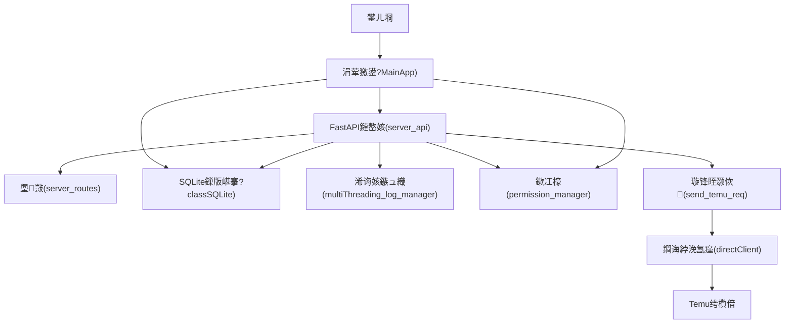
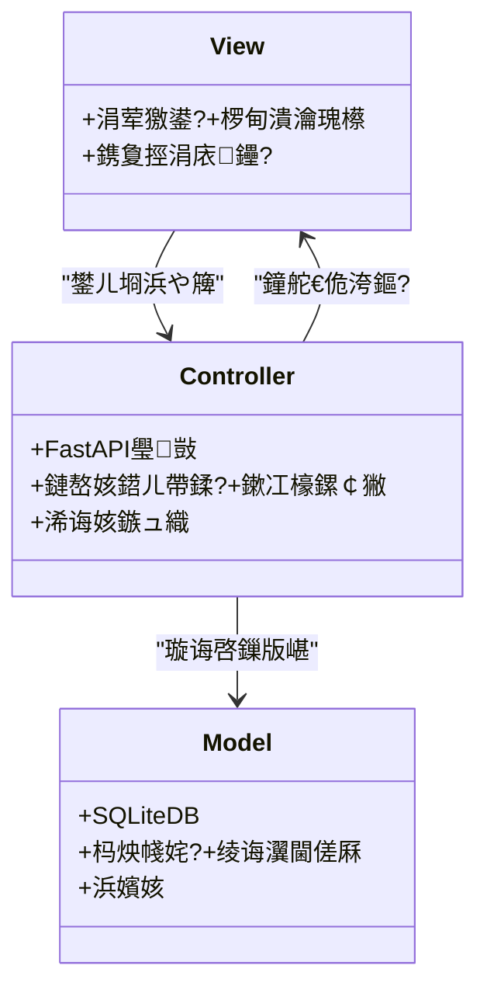
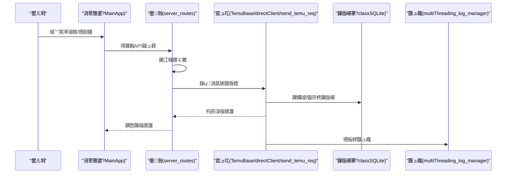
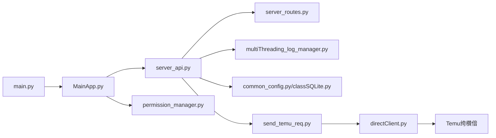

# 绯荤粺鏋舵瀯

<cite>
**鏈枃妗ｅ紩鐢ㄧ殑鏂囦欢**
- [main.py](file://main.py)
- [MainApp.py](file://gui/MainApp.py)
- [server_api.py](file://api/server_api.py)
- [server_routes.py](file://api/server_routes/server_routes.py)
- [common_config.py](file://config/common_config.py)
- [TemuBase.py](file://utils/TemuBase.py)
- [classSQLite.py](file://modules/classSQLite.py)
- [directClient.py](file://utils/directClient.py)
- [send_temu_req.py](file://utils/send_temu_req.py)
- [permission_manager.py](file://config/permission_manager.py)
- [multiThreading_log_manager.py](file://utils/multiThreading_log_manager.py)
- [general_interface.py](file://temu_modules/temu_function/general_interface.py)
</cite>

## 鐩綍
1. [绠€浠媇(#绠€浠?
2. [椤圭洰缁撴瀯](#椤圭洰缁撴瀯)
3. [鏍稿績缁勪欢](#鏍稿績缁勪欢)
4. [鏋舵瀯鎬昏](#鏋舵瀯鎬昏)
5. [璇︾粏缁勪欢鍒嗘瀽](#璇︾粏缁勪欢鍒嗘瀽)
6. [渚濊禆鍏崇郴鍒嗘瀽](#渚濊禆鍏崇郴鍒嗘瀽)
7. [鎬ц兘鑰冮噺](#鎬ц兘鑰冮噺)
8. [鏁呴殰鎺掓煡鎸囧崡](#鏁呴殰鎺掓煡鎸囧崡)
9. [缁撹](#缁撹)
10. [闄勫綍](#闄勫綍)

## 绠€浠?鏈郴缁熷洿缁曗€渋kun_temu_system鈥濇瀯寤猴紝閲囩敤妗岄潰搴旂敤涓庢湰鍦癆PI鏈嶅姟鍗忓悓鐨勬贩鍚堟灦鏋勶紝缁撳悎鍒嗗眰璁捐涓庢ā鍧楀寲缁勭粐锛屽疄鐜癟emu骞冲彴鐨勫浠诲姟鑷姩鍖栦笌绠＄悊銆傜郴缁熼€氳繃PyQt5鎻愪緵鍥惧舰鐣岄潰锛岄€氳繃FastAPI鎻愪緵鏈湴REST API锛岄€氳繃SQLite鏁版嵁搴撴寔涔呭寲閰嶇疆涓庝换鍔＄姸鎬侊紝骞堕€氳繃Playwright/Requests瀹炵幇Temu绔欑偣鐨勭櫥褰曟€佽姹備笌涓氬姟鎿嶄綔銆?
## 椤圭洰缁撴瀯
椤圭洰閲囩敤鎸夊姛鑳藉煙鍒掑垎鐨勬ā鍧楀寲缁勭粐鏂瑰紡锛?- gui锛氭闈㈠簲鐢ㄧ晫闈笌椤甸潰瀹瑰櫒
- api锛欶astAPI鏈嶅姟涓庤矾鐢辨ā鍧?- config锛氶厤缃笌鏉冮檺绠＄悊
- utils锛氶€氱敤宸ュ叿涓嶵emu璇锋眰灏佽
- modules锛氭暟鎹簱涓庝换鍔＄鐞嗗熀纭€璁炬柦
- temu_modules锛歍emu涓氬姟鍔熻兘妯″潡
- spider_modules锛氱埇铏浉鍏虫ā鍧楋紙鎵╁睍鑳藉姏锛?- static/templates锛氬墠绔潤鎬佽祫婧愪笌妯℃澘

```mermaid
graph TB
subgraph "妗岄潰搴旂敤灞?
GUI_Main["MainApp.py<br/>涓荤獥鍙ｄ笌椤甸潰瀹瑰櫒"]
GUI_Login["LoginPage.py<br/>鐧诲綍椤?]
GUI_Pages["ProxyPage/ServerPage/ToolsPage<br/>鍔熻兘椤?]
end
subgraph "鏈嶅姟灞?
API_Server["server_api.py<br/>FastAPI搴旂敤涓庤繘绋嬬鐞?]
API_Routes["server_routes.py<br/>鏈嶅姟鍣ㄦ帶鍒朵笌璁剧疆鎺ュ彛"]
end
subgraph "閰嶇疆涓庢潈闄?
CFG_Common["common_config.py<br/>鏁版嵁搴撲笌鍏ㄥ眬閰嶇疆"]
CFG_Permission["permission_manager.py<br/>鏉冮檺绠＄悊"]
end
subgraph "宸ュ叿涓庝笟鍔?
UTIL_TemuBase["TemuBase.py<br/>搴楅摵杩炴帴涓庤璇?]
UTIL_DirectClient["directClient.py<br/>Playwright鐧诲綍涓庝細璇?]
UTIL_SendReq["send_temu_req.py<br/>璇锋眰灏佽涓庨檺娴?]
UTIL_MultiLog["multiThreading_log_manager.py<br/>浠诲姟鏃ュ織涓庤皟搴?]
MOD_SQLite["classSQLite.py<br/>SQLite灏佽涓庤繛鎺ユ睜"]
TEMU_General["general_interface.py<br/>鍟嗗搧/璁㈠崟鎺ュ彛灏佽"]
end
GUI_Main --> API_Server
API_Server --> API_Routes
API_Server --> UTIL_MultiLog
GUI_Main --> CFG_Common
CFG_Common --> MOD_SQLite
UTIL_TemuBase --> UTIL_DirectClient
UTIL_TemuBase --> UTIL_SendReq
UTIL_SendReq --> MOD_SQLite
TEMU_General --> UTIL_SendReq
CFG_Permission --> API_Routes
```

鍥捐〃鏉ユ簮
- [MainApp.py:179-280](file://gui/MainApp.py#L179-L280)
- [server_api.py:60-110](file://api/server_api.py#L60-L110)
- [server_routes.py:12-289](file://api/server_routes/server_routes.py#L12-L289)
- [common_config.py:15-140](file://config/common_config.py#L15-L140)
- [TemuBase.py:12-656](file://utils/TemuBase.py#L12-L656)
- [classSQLite.py:359-800](file://modules/classSQLite.py#L359-L800)
- [directClient.py:692-800](file://utils/directClient.py#L692-L800)
- [send_temu_req.py:64-244](file://utils/send_temu_req.py#L64-L244)
- [permission_manager.py:12-126](file://config/permission_manager.py#L12-L126)
- [multiThreading_log_manager.py:122-143](file://utils/multiThreading_log_manager.py#L122-L143)
- [general_interface.py:7-326](file://temu_modules/temu_function/general_interface.py#L7-L326)

绔犺妭鏉ユ簮
- [main.py:1-233](file://main.py#L1-L233)
- [MainApp.py:179-800](file://gui/MainApp.py#L179-L800)
- [server_api.py:1-474](file://api/server_api.py#L1-L474)
- [server_routes.py:1-289](file://api/server_routes/server_routes.py#L1-L289)
- [common_config.py:1-394](file://config/common_config.py#L1-L394)
- [TemuBase.py:1-656](file://utils/TemuBase.py#L1-L656)
- [classSQLite.py:1-800](file://modules/classSQLite.py#L1-L800)
- [directClient.py:1-800](file://utils/directClient.py#L1-L800)
- [send_temu_req.py:1-244](file://utils/send_temu_req.py#L1-L244)
- [permission_manager.py:1-126](file://config/permission_manager.py#L1-L126)
- [multiThreading_log_manager.py:110-143](file://utils/multiThreading_log_manager.py#L110-L143)
- [general_interface.py:1-326](file://temu_modules/temu_function/general_interface.py#L1-L326)

## 鏍稿績缁勪欢
- 鍏ュ彛涓庣敓鍛藉懆鏈熺鐞嗭細main.py璐熻矗鍏ㄥ眬寮傚父鎹曡幏銆佹暟鎹簱鍒濆鍖栥€佹棩蹇楁竻鐞嗐€佷簨浠跺惊鐜笌閫€鍑烘竻鐞嗐€?- 妗岄潰搴旂敤涓绘鏋讹細MainApp.py鎻愪緵涓荤獥鍙ｃ€侀〉闈㈠垏鎹€佷换鍔＄鐞嗗櫒闆嗘垚涓庨€€鍑烘祦绋嬨€?- 鏈湴API鏈嶅姟锛歴erver_api.py鎵胯浇FastAPI搴旂敤銆佸杩涚▼绠＄悊銆佺敓鍛藉懆鏈熼挬瀛愪笌涓棿浠躲€?- 閰嶇疆涓庢潈闄愶細common_config.py闆嗕腑鏁版嵁搴撲笌鍏ㄥ眬閰嶇疆锛沺ermission_manager.py鎻愪緵鏉冮檺鎸佷箙鍖栦笌鏍￠獙銆?- 鏁版嵁灞傦細classSQLite.py鎻愪緵杩炴帴姹犮€佷簨鍔°€丣SON/鏃堕棿绫诲瀷閫傞厤涓嶰RM椋庢牸API銆?- Temu涓氬姟锛歍emuBase.py灏佽搴楅摵杩炴帴銆佽璇佷笌澶氬尯鍩烠ookies锛沝irectClient.py璐熻矗Playwright鐧诲綍涓庝細璇濓紱send_temu_req.py缁熶竴璇锋眰涓庨檺娴侊紱general_interface.py灏佽鍟嗗搧/璁㈠崟鎺ュ彛銆?- 浠诲姟涓庢棩蹇楋細multiThreading_log_manager.py鎻愪緵浠诲姟鏃ュ織涓庤皟搴︾鐞嗐€?
绔犺妭鏉ユ簮
- [main.py:21-201](file://main.py#L21-L201)
- [MainApp.py:179-280](file://gui/MainApp.py#L179-L280)
- [server_api.py:40-110](file://api/server_api.py#L40-L110)
- [common_config.py:15-140](file://config/common_config.py#L15-L140)
- [classSQLite.py:359-800](file://modules/classSQLite.py#L359-L800)
- [TemuBase.py:12-656](file://utils/TemuBase.py#L12-L656)
- [directClient.py:692-800](file://utils/directClient.py#L692-L800)
- [send_temu_req.py:64-244](file://utils/send_temu_req.py#L64-L244)
- [permission_manager.py:12-126](file://config/permission_manager.py#L12-L126)
- [multiThreading_log_manager.py:122-143](file://utils/multiThreading_log_manager.py#L122-L143)
- [general_interface.py:7-326](file://temu_modules/temu_function/general_interface.py#L7-L326)

## 鏋舵瀯鎬昏
绯荤粺閲囩敤鈥滄闈UI + 鏈湴API鏈嶅姟鈥濈殑鍙屽眰鏋舵瀯锛?- 妗岄潰灞傦細PyQt5涓荤獥鍙ｄ笌椤甸潰瀹瑰櫒锛岃礋璐ｇ敤鎴蜂氦浜掍笌浠诲姟鍏ュ彛銆?- 鏈嶅姟灞傦細FastAPI鎻愪緵REST鎺ュ彛锛屾敮鎸佸杩涚▼涓庡懆鏈熶换鍔★紝閰嶅悎涓棿浠朵笌闈欐€佽祫婧愩€?- 鏁版嵁灞傦細SQLite鏁版嵁搴擄紝閫氳繃缁熶竴杩炴帴姹犱笌绫诲瀷閫傞厤鍣ㄦ彁渚涢珮鎬ц兘涓庣被鍨嬪畨鍏ㄣ€?- 涓氬姟灞傦細Temu鐧诲綍鎬佺鐞嗐€佽姹傚皝瑁呬笌涓氬姟鎺ュ彛璋冪敤锛岀粨鍚堟潈闄愭牎楠屼笌浠诲姟鏃ュ織銆?


鍥捐〃鏉ユ簮
- [MainApp.py:179-280](file://gui/MainApp.py#L179-L280)
- [server_api.py:60-110](file://api/server_api.py#L60-L110)
- [server_routes.py:12-289](file://api/server_routes/server_routes.py#L12-L289)
- [common_config.py:15-140](file://config/common_config.py#L15-L140)
- [classSQLite.py:359-800](file://modules/classSQLite.py#L359-L800)
- [multiThreading_log_manager.py:122-143](file://utils/multiThreading_log_manager.py#L122-L143)
- [permission_manager.py:12-126](file://config/permission_manager.py#L12-L126)
- [send_temu_req.py:64-244](file://utils/send_temu_req.py#L64-L244)
- [directClient.py:692-800](file://utils/directClient.py#L692-L800)

## 璇︾粏缁勪欢鍒嗘瀽

### MVC鏋舵瀯妯″紡
- Model锛堟ā鍨嬶級锛氭暟鎹簱涓庨厤缃€傞€氳繃classSQLite.py鎻愪緵缁熶竴鐨凜RUD涓庢煡璇㈡瀯寤哄櫒锛沜ommon_config.py闆嗕腑鏁版嵁搴撹繛鎺ヤ笌鍏ㄥ眬閰嶇疆銆?- View锛堣鍥撅級锛氭闈㈢晫闈€侻ainApp.py缁勭粐椤甸潰涓庢寜閽紝鎻愪緵鐢ㄦ埛浜や簰鍏ュ彛銆?- Controller锛堟帶鍒跺櫒锛夛細API璺敱涓庝笟鍔＄紪鎺掋€俿erver_routes.py澶勭悊鏈嶅姟鍣ㄦ帶鍒朵笌璁剧疆鎺ュ彛锛汿emuBase.py涓巇irectClient.py鍗忚皟鐧诲綍涓庝細璇濓紱send_temu_req.py缁熶竴璇锋眰涓庨檺娴併€?


鍥捐〃鏉ユ簮
- [classSQLite.py:359-800](file://modules/classSQLite.py#L359-L800)
- [MainApp.py:179-280](file://gui/MainApp.py#L179-L280)
- [server_routes.py:12-289](file://api/server_routes/server_routes.py#L12-L289)
- [common_config.py:15-140](file://config/common_config.py#L15-L140)

绔犺妭鏉ユ簮
- [MainApp.py:179-280](file://gui/MainApp.py#L179-L280)
- [server_routes.py:12-289](file://api/server_routes/server_routes.py#L12-L289)
- [common_config.py:15-140](file://config/common_config.py#L15-L140)
- [classSQLite.py:359-800](file://modules/classSQLite.py#L359-L800)

### 鏁版嵁娴佹灦鏋勶紙浠庣敤鎴疯緭鍏ュ埌鏁版嵁搴撳瓨鍌級
1) 鐢ㄦ埛鍦ㄤ富绐楀彛瑙﹀彂浠诲姟鎴栬缃彉鏇淬€?2) GUI璋冪敤API鏈嶅姟锛團astAPI锛夋垨鐩存帴璋冪敤宸ュ叿妯″潡銆?3) API璺敱杩涜鏉冮檺鏍￠獙涓庡弬鏁板鐞嗐€?4) 宸ュ叿妯″潡锛堝TemuBase銆乨irectClient銆乻end_temu_req锛夋墽琛岀櫥褰曟€佺鐞嗕笌璇锋眰銆?5) 璇锋眰缁撴灉閫氳繃缁熶竴鎺ュ彛鍐欏叆鏁版嵁搴擄紙classSQLite锛夈€?6) 浠诲姟鏃ュ織涓庣姸鎬侀€氳繃鏃ュ織绠＄悊鍣ㄨ褰曚笌璋冨害銆?


鍥捐〃鏉ユ簮
- [MainApp.py:179-280](file://gui/MainApp.py#L179-L280)
- [server_routes.py:12-289](file://api/server_routes/server_routes.py#L12-L289)
- [TemuBase.py:12-656](file://utils/TemuBase.py#L12-L656)
- [directClient.py:692-800](file://utils/directClient.py#L692-L800)
- [send_temu_req.py:64-244](file://utils/send_temu_req.py#L64-L244)
- [classSQLite.py:359-800](file://modules/classSQLite.py#L359-L800)
- [multiThreading_log_manager.py:122-143](file://utils/multiThreading_log_manager.py#L122-L143)

绔犺妭鏉ユ簮
- [TemuBase.py:12-656](file://utils/TemuBase.py#L12-L656)
- [directClient.py:692-800](file://utils/directClient.py#L692-L800)
- [send_temu_req.py:64-244](file://utils/send_temu_req.py#L64-L244)
- [classSQLite.py:359-800](file://modules/classSQLite.py#L359-L800)
- [multiThreading_log_manager.py:122-143](file://utils/multiThreading_log_manager.py#L122-L143)

### 璁捐妯″紡搴旂敤
- 宸ュ巶妯″紡锛氭潈闄愭牎楠屼笌浠诲姟绫诲瀷鏄犲皠锛堥€氳繃閰嶇疆涓庤矾鐢卞疄鐜颁换鍔″伐鍘傚紡鍒嗗彂锛夈€?- 瑙傚療鑰呮ā寮忥細鏃ュ織绠＄悊鍣ㄤ笌浠诲姟鐘舵€佸箍鎾紙閫氳繃鏃ュ織璁板綍涓嶶I鍒锋柊瀹炵幇锛夈€?- 绛栫暐妯″紡锛氳姹傜瓥鐣ワ紙UA鐢熸垚銆侀檺娴佺瓥鐣ャ€侀噸璇曠瓥鐣ワ級灏佽浜巗end_temu_req.py銆?- 鍗曚緥/杩涚▼鍐呭崟渚嬶細浠诲姟鏃ュ織绠＄悊鍣紙澶氳繘绋嬪吋瀹癸級涓庢暟鎹簱杩炴帴姹犮€?
绔犺妭鏉ユ簮
- [server_routes.py:91-127](file://api/server_routes/server_routes.py#L91-L127)
- [send_temu_req.py:64-244](file://utils/send_temu_req.py#L64-L244)
- [multiThreading_log_manager.py:122-143](file://utils/multiThreading_log_manager.py#L122-L143)
- [classSQLite.py:294-331](file://modules/classSQLite.py#L294-L331)

## 渚濊禆鍏崇郴鍒嗘瀽
- 缁勪欢鑰﹀悎锛欸UI涓嶢PI閫氳繃璺敱瑙ｈ€︼紱API涓庡伐鍏锋ā鍧楅€氳繃缁熶竴鎺ュ彛瑙ｈ€︼紱宸ュ叿妯″潡涓庢暟鎹簱閫氳繃SQLite灏佽瑙ｈ€︺€?- 澶栭儴渚濊禆锛欶astAPI銆乽vicorn銆丳laywright銆乺equests銆乴oguru銆乸sutil绛夈€?- 寰幆渚濊禆瑙勯伩锛氶€氳繃寤惰繜瀵煎叆涓庢ā鍧楄亴璐ｅ崟涓€鍖栭伩鍏嶅惊鐜緷璧栥€?


鍥捐〃鏉ユ簮
- [main.py:1-233](file://main.py#L1-L233)
- [MainApp.py:179-280](file://gui/MainApp.py#L179-L280)
- [server_api.py:60-110](file://api/server_api.py#L60-L110)
- [server_routes.py:12-289](file://api/server_routes/server_routes.py#L12-L289)
- [common_config.py:15-140](file://config/common_config.py#L15-L140)
- [classSQLite.py:359-800](file://modules/classSQLite.py#L359-L800)
- [multiThreading_log_manager.py:122-143](file://utils/multiThreading_log_manager.py#L122-L143)
- [permission_manager.py:12-126](file://config/permission_manager.py#L12-L126)
- [send_temu_req.py:64-244](file://utils/send_temu_req.py#L64-L244)
- [directClient.py:692-800](file://utils/directClient.py#L692-L800)

绔犺妭鏉ユ簮
- [main.py:1-233](file://main.py#L1-L233)
- [server_api.py:60-110](file://api/server_api.py#L60-L110)
- [classSQLite.py:359-800](file://modules/classSQLite.py#L359-L800)

## 鎬ц兘鑰冮噺
- 杩炴帴姹犱笌浜嬪姟锛歋QLite杩炴帴姹犱笌浜嬪姟鎻愪氦绛栫暐鍑忓皯I/O寮€閿€锛屾彁鍗囧苟鍙戝啓鍏ョǔ瀹氭€с€?- 寮傛涓庡杩涚▼锛欶astAPI澶氳繘绋嬮儴缃蹭笌浠诲姟鏃ュ織绠＄悊鍣ㄧ殑澶氱嚎绋嬫敮鎸佹彁鍗囧悶鍚愩€?- 闄愭祦涓庨噸璇曪細璇锋眰灞傚姩鎬侀檺娴佷笌鎸囨暟閫€閬块檷浣庤鎷︽埅椋庨櫓锛屾彁楂樻垚鍔熺巼銆?- UI涓庝换鍔¤В鑰︼細閫氳繃鏃ュ織涓庣姸鎬佸箍鎾伩鍏峌I闃诲锛屾彁鍗囦氦浜掓祦鐣呭害銆?
## 鏁呴殰鎺掓煡鎸囧崡
- 鍏ㄥ眬寮傚父鎹曡幏锛歮ain.py鎻愪緵鍏ㄥ眬寮傚父鎹曡幏涓庢暟鎹簱瀹夊叏鍏抽棴锛屼究浜庡畾浣嶅穿婧冨師鍥犮€?- 鏈嶅姟鍣ㄥ惎鍔ㄥけ璐ワ細server_api.py瀵圭鍙ｅ崰鐢ㄤ笌杩涚▼鍚姩澶辫触杩涜鏃ュ織涓庡洖閫€澶勭悊銆?- 鏉冮檺涓嶈冻锛歱ermission_manager.py涓巗erver_routes.py缁撳悎锛岀‘淇濅换鍔℃墽琛屽墠鏉冮檺鏍￠獙銆?- 鏁版嵁搴撳叧闂細common_config.py鎻愪緵WAL妫€鏌ョ偣涓庤繛鎺ュ叧闂祦绋嬶紝闃叉鏂囦欢鎹熷潖銆?- 浠诲姟鏃ュ織锛歮ultiThreading_log_manager.py璁板綍浠诲姟鐘舵€佷笌閿欒锛岃緟鍔╅棶棰樺畾浣嶃€?
绔犺妭鏉ユ簮
- [main.py:21-51](file://main.py#L21-L51)
- [server_api.py:122-138](file://api/server_api.py#L122-L138)
- [permission_manager.py:106-122](file://config/permission_manager.py#L106-L122)
- [common_config.py:59-135](file://config/common_config.py#L59-L135)
- [multiThreading_log_manager.py:122-143](file://utils/multiThreading_log_manager.py#L122-L143)

## 缁撹
绯荤粺閫氳繃娓呮櫚鐨勫垎灞備笌妯″潡鍖栬璁★紝瀹炵幇浜嗘闈UI涓庢湰鍦癆PI鏈嶅姟鐨勯珮鏁堝崗鍚屻€傛暟鎹簱涓庡伐鍏峰眰鐨勬娊璞℃彁鍗囦簡鍙淮鎶ゆ€т笌鍙墿灞曟€э紱鏉冮檺涓庢棩蹇楁満鍒朵繚闅滀簡瀹夊叏鎬т笌鍙娴嬫€с€傛暣浣撴灦鏋勫吋椤炬槗鐢ㄦ€т笌鎬ц兘锛岄€傚悎鍦ㄥ浠诲姟涓庡搴楅摵鍦烘櫙涓嬬ǔ瀹氳繍琛屻€?
## 闄勫綍
- 绯荤粺杈圭晫锛氭闈㈠簲鐢ㄤ笌鏈湴API鏈嶅姟鏋勬垚绯荤粺杈圭晫锛孴emu绔欑偣涓哄閮ㄤ緷璧栥€?- 缁勪欢鍏崇郴锛氳瑙佲€滄灦鏋勬€昏鈥濅笌鈥滀緷璧栧叧绯诲垎鏋愨€濄€

