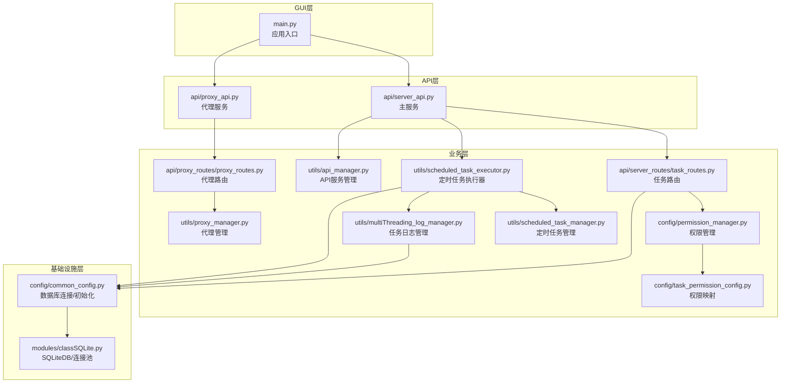
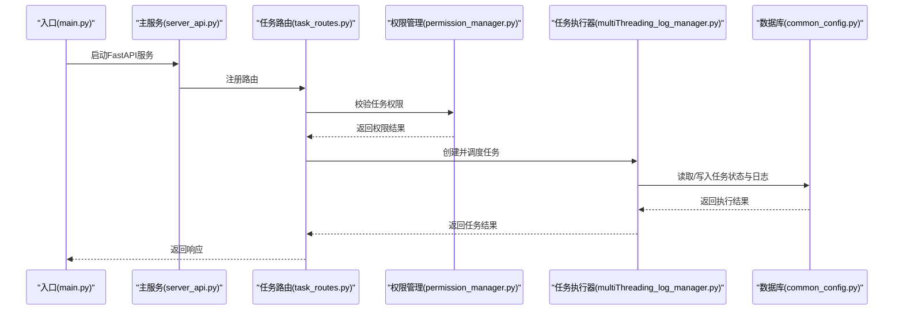
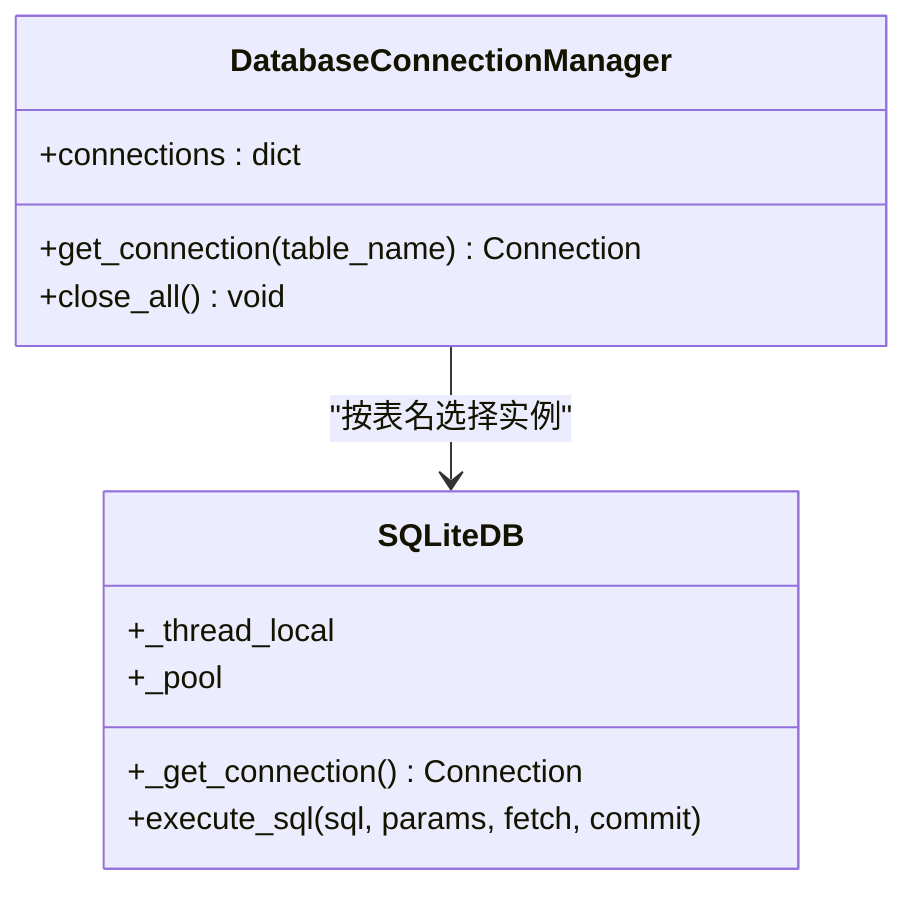
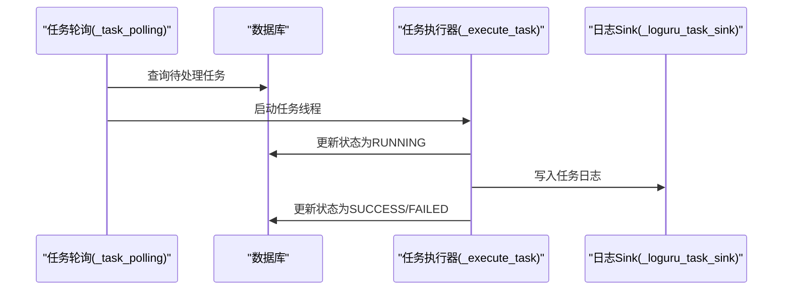
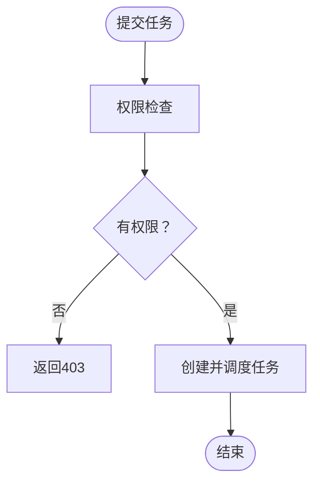
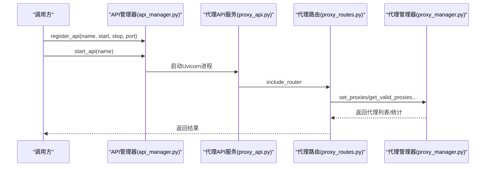
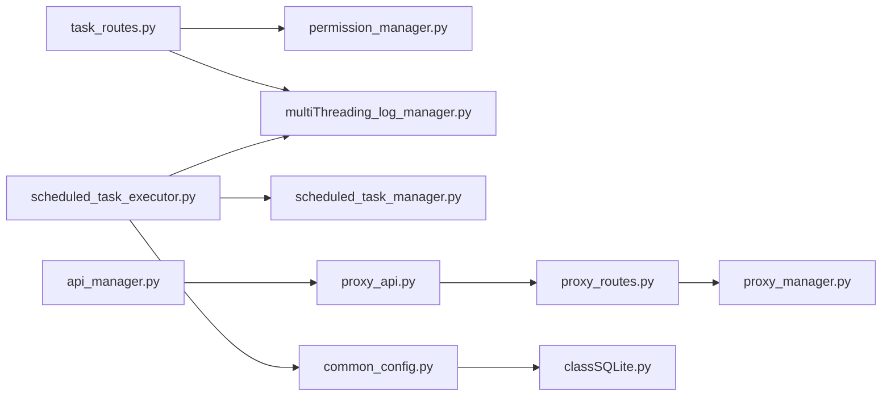

# 设计模式应用

<cite>
**本文引用的文件**
- [main.py](file://main.py)
- [common_config.py](file://config/common_config.py)
- [permission_manager.py](file://config/permission_manager.py)
- [task_permission_config.py](file://config/task_permission_config.py)
- [api_manager.py](file://utils/api_manager.py)
- [proxy_api.py](file://api/proxy_api.py)
- [proxy_routes.py](file://api/proxy_routes/proxy_routes.py)
- [proxy_manager.py](file://utils/proxy_manager.py)
- [server_api.py](file://api/server_api.py)
- [task_routes.py](file://api/server_routes/task_routes.py)
- [scheduled_task_manager.py](file://utils/scheduled_task_manager.py)
- [scheduled_task_executor.py](file://utils/scheduled_task_executor.py)
- [multiThreading_log_manager.py](file://utils/multiThreading_log_manager.py)
- [classSQLite.py](file://modules/classSQLite.py)
</cite>

## 目录
1. [引言](#引言)
2. [项目结构](#项目结构)
3. [核心组件](#核心组件)
4. [架构总览](#架构总览)
5. [详细组件分析](#详细组件分析)
6. [依赖分析](#依赖分析)
7. [性能考量](#性能考量)
8. [故障排查指南](#故障排查指南)
9. [结论](#结论)
10. [附录](#附录)

## 引言
本文件聚焦于 ikun_temu_system 项目中设计模式的应用与实践，围绕以下主题展开：
- 工厂模式在数据库连接管理中的应用
- 观察者模式在任务监控中的实现
- 策略模式在权限控制中的使用
- 代理模式在 API 服务管理中的作用

我们将结合具体代码路径，解释这些设计模式如何解决实际问题，提升系统的可维护性与可扩展性，并分析它们之间的协作关系。

## 项目结构
项目采用“模块化+分层”的组织方式：
- GUI 层：PyQt5 界面入口与页面组件
- API 层：FastAPI 服务（主服务与代理服务）
- 业务层：任务调度、权限控制、定时任务、代理管理
- 基础设施层：数据库连接、日志、并发控制、配置管理

图表来源
- [main.py:1-233](file://main.py#L1-L233)
- [server_api.py:1-474](file://api/server_api.py#L1-L474)
- [proxy_api.py:1-214](file://api/proxy_api.py#L1-L214)
- [task_routes.py:1-200](file://api/server_routes/task_routes.py#L1-L200)
- [permission_manager.py:1-126](file://config/permission_manager.py#L1-L126)
- [task_permission_config.py:1-84](file://config/task_permission_config.py#L1-L84)
- [scheduled_task_manager.py:1-446](file://utils/scheduled_task_manager.py#L1-L446)
- [scheduled_task_executor.py:1-242](file://utils/scheduled_task_executor.py#L1-L242)
- [multiThreading_log_manager.py:1-800](file://utils/multiThreading_log_manager.py#L1-L800)
- [api_manager.py:1-273](file://utils/api_manager.py#L1-L273)
- [proxy_routes.py:1-218](file://api/proxy_routes/proxy_routes.py#L1-L218)
- [proxy_manager.py:353-400](file://utils/proxy_manager.py#L353-L400)
- [common_config.py:1-394](file://config/common_config.py#L1-L394)
- [classSQLite.py:1-800](file://modules/classSQLite.py#L1-L800)

章节来源
- [main.py:1-233](file://main.py#L1-L233)
- [server_api.py:1-474](file://api/server_api.py#L1-L474)
- [proxy_api.py:1-214](file://api/proxy_api.py#L1-L214)
- [task_routes.py:1-200](file://api/server_routes/task_routes.py#L1-L200)
- [permission_manager.py:1-126](file://config/permission_manager.py#L1-L126)
- [task_permission_config.py:1-84](file://config/task_permission_config.py#L1-L84)
- [scheduled_task_manager.py:1-446](file://utils/scheduled_task_manager.py#L1-L446)
- [scheduled_task_executor.py:1-242](file://utils/scheduled_task_executor.py#L1-L242)
- [multiThreading_log_manager.py:1-800](file://utils/multiThreading_log_manager.py#L1-L800)
- [api_manager.py:1-273](file://utils/api_manager.py#L1-L273)
- [proxy_routes.py:1-218](file://api/proxy_routes/proxy_routes.py#L1-L218)
- [proxy_manager.py:353-400](file://utils/proxy_manager.py#L353-L400)
- [common_config.py:1-394](file://config/common_config.py#L1-L394)
- [classSQLite.py:1-800](file://modules/classSQLite.py#L1-L800)

## 核心组件
- 数据库连接与工厂模式
  - 通过“数据库连接管理器”集中管理不同表的连接，依据表名选择对应数据库实例，实现连接的延迟创建与复用，降低耦合度。
  - 参考路径：[common_config.py:16-48](file://config/common_config.py#L16-L48)

- 权限控制与策略模式
  - 权限检查采用“策略式映射”：任务类型与所需权限的映射集中管理，权限检查逻辑统一由权限管理器调用，便于扩展新任务类型与权限组合。
  - 参考路径：[permission_manager.py:106-122](file://config/permission_manager.py#L106-L122)、[task_permission_config.py:67-84](file://config/task_permission_config.py#L67-L84)

- API 服务管理与代理模式
  - API 管理器以“注册-启动-停止-状态查询”的统一接口管理多个服务，形成对底层服务的代理封装，便于集中控制与可观测性。
  - 参考路径：[api_manager.py:13-232](file://utils/api_manager.py#L13-L232)

- 任务监控与观察者模式
  - 任务日志管理器通过“自定义 sink + 线程映射”实现任务级日志聚合；定时任务执行器与任务管理器协同，形成“定时触发-权限校验-状态更新”的观察链路。
  - 参考路径：[multiThreading_log_manager.py:444-492](file://utils/multiThreading_log_manager.py#L444-L492)、[scheduled_task_executor.py:74-162](file://utils/scheduled_task_executor.py#L74-L162)

- 代理服务与路由
  - 代理 API 服务通过路由模块暴露代理 IP 管理能力，形成“服务-路由-管理器”的代理模式封装。
  - 参考路径：[proxy_api.py:21-34](file://api/proxy_api.py#L21-L34)、[proxy_routes.py:20-80](file://api/proxy_routes/proxy_routes.py#L20-L80)、[proxy_manager.py:353-400](file://utils/proxy_manager.py#L353-L400)

章节来源
- [common_config.py:16-48](file://config/common_config.py#L16-L48)
- [permission_manager.py:106-122](file://config/permission_manager.py#L106-L122)
- [task_permission_config.py:67-84](file://config/task_permission_config.py#L67-L84)
- [api_manager.py:13-232](file://utils/api_manager.py#L13-L232)
- [multiThreading_log_manager.py:444-492](file://utils/multiThreading_log_manager.py#L444-L492)
- [scheduled_task_executor.py:74-162](file://utils/scheduled_task_executor.py#L74-L162)
- [proxy_api.py:21-34](file://api/proxy_api.py#L21-L34)
- [proxy_routes.py:20-80](file://api/proxy_routes/proxy_routes.py#L20-L80)
- [proxy_manager.py:353-400](file://utils/proxy_manager.py#L353-L400)

## 架构总览
系统通过“入口-服务-路由-业务-基础设施”的分层，将设计模式嵌入到关键节点：
- 入口层负责初始化与异常兜底
- 服务层提供统一的 API 生命周期与进程/线程管理
- 路由层承接请求并委派到业务层
- 业务层实现权限、任务、定时、代理等核心能力
- 基础设施层提供数据库与并发控制

图表来源
- [main.py:120-201](file://main.py#L120-L201)
- [server_api.py:96-104](file://api/server_api.py#L96-L104)
- [task_routes.py:66-96](file://api/server_routes/task_routes.py#L66-L96)
- [permission_manager.py:106-122](file://config/permission_manager.py#L106-L122)
- [multiThreading_log_manager.py:683-800](file://utils/multiThreading_log_manager.py#L683-L800)
- [common_config.py:197-221](file://config/common_config.py#L197-L221)

## 详细组件分析

### 工厂模式：数据库连接管理
- 设计要点
  - 通过“数据库连接管理器”集中维护不同表的连接映射，按表名选择数据库实例，避免分散创建与重复连接。
  - 结合 SQLiteDB 的连接池与线程局部存储，实现线程安全与资源复用。
- 代码路径
  - [common_config.py:16-48](file://config/common_config.py#L16-L48)
  - [classSQLite.py:294-330](file://modules/classSQLite.py#L294-L330)
  - [classSQLite.py:419-432](file://modules/classSQLite.py#L419-L432)

图表来源
- [common_config.py:16-48](file://config/common_config.py#L16-L48)
- [classSQLite.py:294-330](file://modules/classSQLite.py#L294-L330)
- [classSQLite.py:419-432](file://modules/classSQLite.py#L419-L432)

章节来源
- [common_config.py:16-48](file://config/common_config.py#L16-L48)
- [classSQLite.py:294-330](file://modules/classSQLite.py#L294-L330)
- [classSQLite.py:419-432](file://modules/classSQLite.py#L419-L432)

### 观察者模式：任务监控与日志聚合
- 设计要点
  - 任务日志管理器通过“自定义 sink + 线程映射”，将任务线程产生的日志定向写入数据库，形成“日志生产者-观察者-存储”的观察链。
  - 定时任务执行器与任务管理器协同，定时扫描待执行任务，执行前后更新状态，形成“定时触发-状态变化-观察更新”的闭环。
- 代码路径
  - [multiThreading_log_manager.py:444-492](file://utils/multiThreading_log_manager.py#L444-L492)
  - [multiThreading_log_manager.py:308-372](file://utils/multiThreading_log_manager.py#L308-L372)
  - [scheduled_task_executor.py:74-162](file://utils/scheduled_task_executor.py#L74-L162)

图表来源
- [multiThreading_log_manager.py:308-372](file://utils/multiThreading_log_manager.py#L308-L372)
- [multiThreading_log_manager.py:444-492](file://utils/multiThreading_log_manager.py#L444-L492)
- [multiThreading_log_manager.py:683-800](file://utils/multiThreading_log_manager.py#L683-L800)

章节来源
- [multiThreading_log_manager.py:444-492](file://utils/multiThreading_log_manager.py#L444-L492)
- [multiThreading_log_manager.py:308-372](file://utils/multiThreading_log_manager.py#L308-L372)
- [scheduled_task_executor.py:74-162](file://utils/scheduled_task_executor.py#L74-L162)

### 策略模式：权限控制
- 设计要点
  - 权限映射集中定义在配置模块，权限检查通过统一入口调用，新增任务类型只需扩展映射，无需改动检查逻辑。
  - 任务路由在提交任务前进行权限校验，拒绝无权限请求。
- 代码路径
  - [task_permission_config.py:67-84](file://config/task_permission_config.py#L67-L84)
  - [permission_manager.py:106-122](file://config/permission_manager.py#L106-L122)
  - [task_routes.py:89-96](file://api/server_routes/task_routes.py#L89-L96)

图表来源
- [task_routes.py:89-96](file://api/server_routes/task_routes.py#L89-L96)
- [permission_manager.py:106-122](file://config/permission_manager.py#L106-L122)
- [task_permission_config.py:67-84](file://config/task_permission_config.py#L67-L84)

章节来源
- [task_permission_config.py:67-84](file://config/task_permission_config.py#L67-L84)
- [permission_manager.py:106-122](file://config/permission_manager.py#L106-L122)
- [task_routes.py:89-96](file://api/server_routes/task_routes.py#L89-L96)

### 代理模式：API 服务管理
- 设计要点
  - API 管理器以“注册-启动-停止-状态查询-注销”的统一接口管理多个服务，形成对底层服务的代理封装，便于集中控制与可观测性。
  - 代理 API 服务通过路由模块暴露代理 IP 管理能力，形成“服务-路由-管理器”的代理模式封装。
- 代码路径
  - [api_manager.py:13-232](file://utils/api_manager.py#L13-L232)
  - [proxy_api.py:21-34](file://api/proxy_api.py#L21-L34)
  - [proxy_routes.py:20-80](file://api/proxy_routes/proxy_routes.py#L20-L80)
  - [proxy_manager.py:353-400](file://utils/proxy_manager.py#L353-L400)

图表来源
- [api_manager.py:13-232](file://utils/api_manager.py#L13-L232)
- [proxy_api.py:21-34](file://api/proxy_api.py#L21-L34)
- [proxy_routes.py:20-80](file://api/proxy_routes/proxy_routes.py#L20-L80)
- [proxy_manager.py:353-400](file://utils/proxy_manager.py#L353-L400)

章节来源
- [api_manager.py:13-232](file://utils/api_manager.py#L13-L232)
- [proxy_api.py:21-34](file://api/proxy_api.py#L21-L34)
- [proxy_routes.py:20-80](file://api/proxy_routes/proxy_routes.py#L20-L80)
- [proxy_manager.py:353-400](file://utils/proxy_manager.py#L353-L400)

## 依赖分析
- 组件耦合与协作
  - 任务路由依赖权限管理器进行权限校验，依赖任务日志管理器进行任务调度与状态更新。
  - 定时任务执行器依赖数据库与任务日志管理器，形成“定时触发-权限校验-状态更新”的闭环。
  - API 管理器与代理 API 服务通过统一接口管理多个服务，降低服务间的耦合。
- 外部依赖与集成点
  - FastAPI、Uvicorn、psutil、loguru、sqlite3/aiosqlite 等
  - 端口管理器与进程守护器用于服务生命周期管理

图表来源
- [task_routes.py:1-200](file://api/server_routes/task_routes.py#L1-L200)
- [permission_manager.py:1-126](file://config/permission_manager.py#L1-L126)
- [multiThreading_log_manager.py:1-800](file://utils/multiThreading_log_manager.py#L1-L800)
- [scheduled_task_executor.py:1-242](file://utils/scheduled_task_executor.py#L1-L242)
- [scheduled_task_manager.py:1-446](file://utils/scheduled_task_manager.py#L1-L446)
- [common_config.py:1-394](file://config/common_config.py#L1-L394)
- [classSQLite.py:1-800](file://modules/classSQLite.py#L1-L800)
- [api_manager.py:1-273](file://utils/api_manager.py#L1-L273)
- [proxy_api.py:1-214](file://api/proxy_api.py#L1-L214)
- [proxy_routes.py:1-218](file://api/proxy_routes/proxy_routes.py#L1-L218)
- [proxy_manager.py:353-400](file://utils/proxy_manager.py#L353-L400)

章节来源
- [task_routes.py:1-200](file://api/server_routes/task_routes.py#L1-L200)
- [permission_manager.py:1-126](file://config/permission_manager.py#L1-L126)
- [multiThreading_log_manager.py:1-800](file://utils/multiThreading_log_manager.py#L1-L800)
- [scheduled_task_executor.py:1-242](file://utils/scheduled_task_executor.py#L1-L242)
- [scheduled_task_manager.py:1-446](file://utils/scheduled_task_manager.py#L1-L446)
- [common_config.py:1-394](file://config/common_config.py#L1-L394)
- [classSQLite.py:1-800](file://modules/classSQLite.py#L1-L800)
- [api_manager.py:1-273](file://utils/api_manager.py#L1-L273)
- [proxy_api.py:1-214](file://api/proxy_api.py#L1-L214)
- [proxy_routes.py:1-218](file://api/proxy_routes/proxy_routes.py#L1-L218)
- [proxy_manager.py:353-400](file://utils/proxy_manager.py#L353-L400)

## 性能考量
- 并发与资源控制
  - 任务管理器通过全局信号量与分组信号量控制并发，避免资源争用与过载。
  - 参考路径：[multiThreading_log_manager.py:180-182](file://utils/multiThreading_log_manager.py#L180-L182)、[multiThreading_log_manager.py:644-671](file://utils/multiThreading_log_manager.py#L644-L671)
- 数据库性能
  - SQLiteDB 使用连接池与线程局部连接，减少连接开销；WAL 模式与 PRAGMA 参数优化写入性能。
  - 参考路径：[classSQLite.py:294-330](file://modules/classSQLite.py#L294-L330)、[classSQLite.py:407-417](file://modules/classSQLite.py#L407-L417)
- API 服务稳定性
  - API 管理器提供统一的启动/停止/重启与状态查询，结合端口管理与进程守护，提升服务可靠性。
  - 参考路径：[api_manager.py:13-232](file://utils/api_manager.py#L13-L232)

## 故障排查指南
- 全局异常与数据库安全关闭
  - 入口层设置全局异常处理器，记录异常并安全关闭数据库，避免文件损坏。
  - 参考路径：[main.py:21-53](file://main.py#L21-L53)、[common_config.py:59-135](file://config/common_config.py#L59-L135)
- 任务执行失败定位
  - 通过任务日志管理器的自定义 sink 与任务状态更新，定位失败原因与上下文。
  - 参考路径：[multiThreading_log_manager.py:444-492](file://utils/multiThreading_log_manager.py#L444-L492)、[multiThreading_log_manager.py:683-800](file://utils/multiThreading_log_manager.py#L683-L800)
- 定时任务异常处理
  - 定时任务执行器捕获异常并继续执行后续任务，同时更新执行时间与次数。
  - 参考路径：[scheduled_task_executor.py:47-92](file://utils/scheduled_task_executor.py#L47-L92)

章节来源
- [main.py:21-53](file://main.py#L21-L53)
- [common_config.py:59-135](file://config/common_config.py#L59-L135)
- [multiThreading_log_manager.py:444-492](file://utils/multiThreading_log_manager.py#L444-L492)
- [multiThreading_log_manager.py:683-800](file://utils/multiThreading_log_manager.py#L683-L800)
- [scheduled_task_executor.py:47-92](file://utils/scheduled_task_executor.py#L47-L92)

## 结论
本项目通过工厂模式、策略模式、观察者模式与代理模式，在数据库连接、权限控制、任务监控与 API 管理等关键场景中实现了高内聚、低耦合与强扩展性的架构设计。这些模式相互协作，既提升了系统的可维护性，也为未来功能扩展提供了清晰的演进路径。

## 附录
- 相关配置与初始化流程
  - 数据库初始化与配置文件生成
  - 参考路径：[common_config.py:157-196](file://config/common_config.py#L157-L196)、[common_config.py:197-221](file://config/common_config.py#L197-L221)、[common_config.py:222-244](file://config/common_config.py#L222-L244)、[common_config.py:245-334](file://config/common_config.py#L245-L334)

章节来源
- [common_config.py:157-196](file://config/common_config.py#L157-L196)
- [common_config.py:197-221](file://config/common_config.py#L197-L221)
- [common_config.py:222-244](file://config/common_config.py#L222-L244)
- [common_config.py:245-334](file://config/common_config.py#L245-L334)