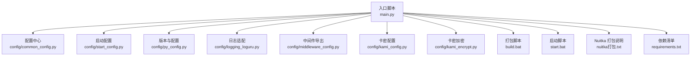
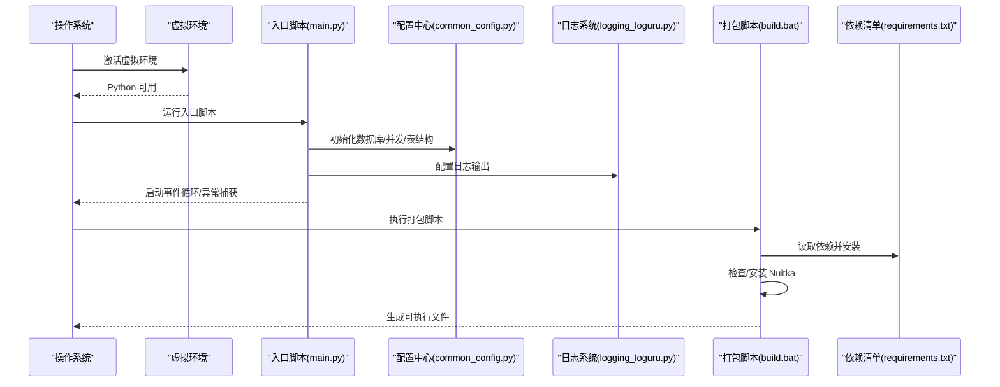
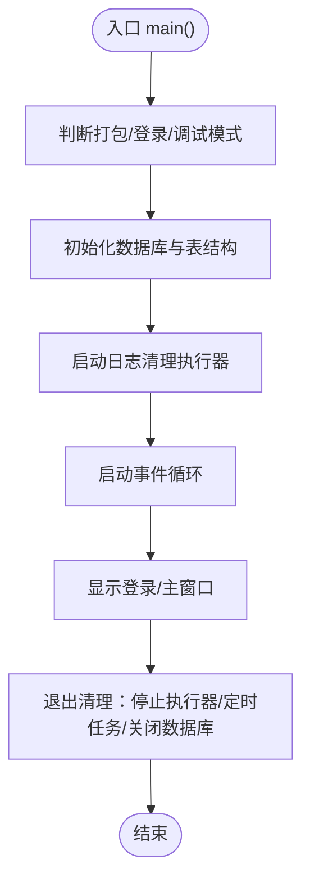
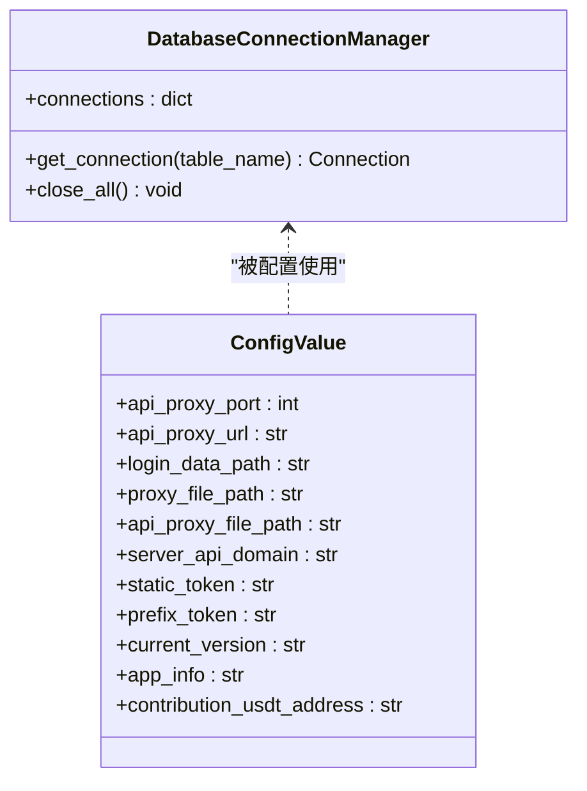
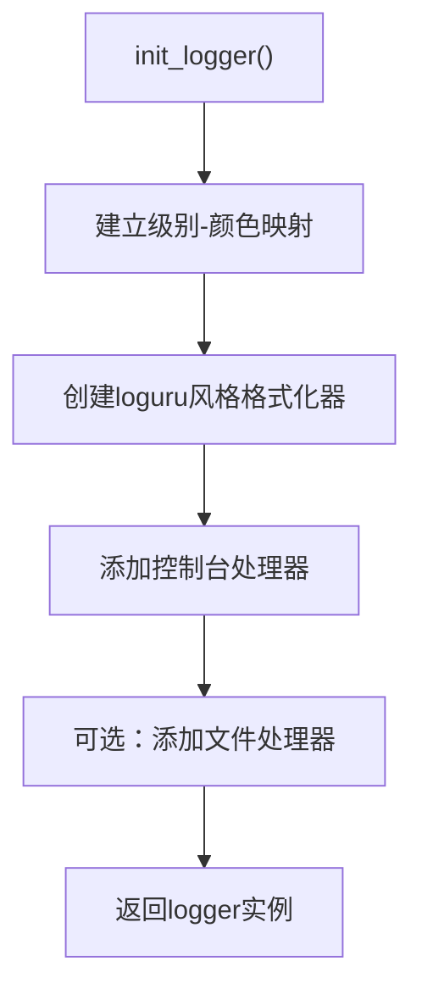
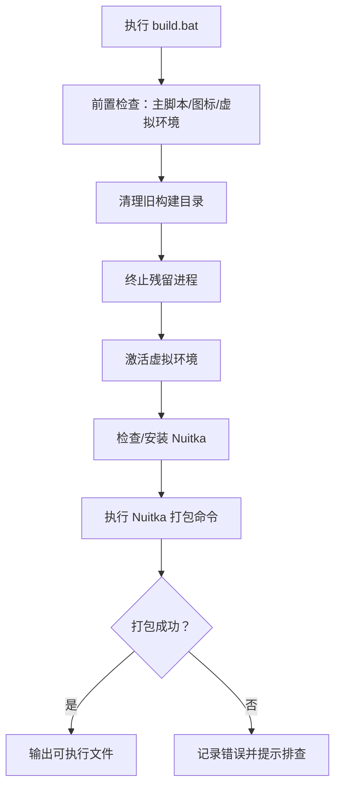
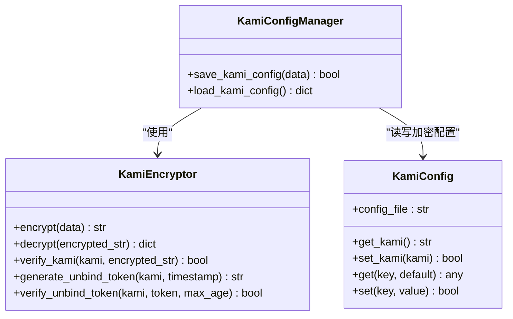
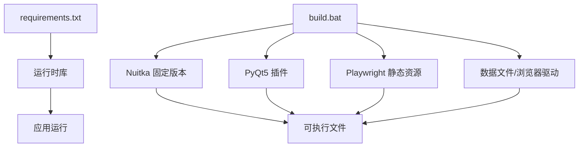
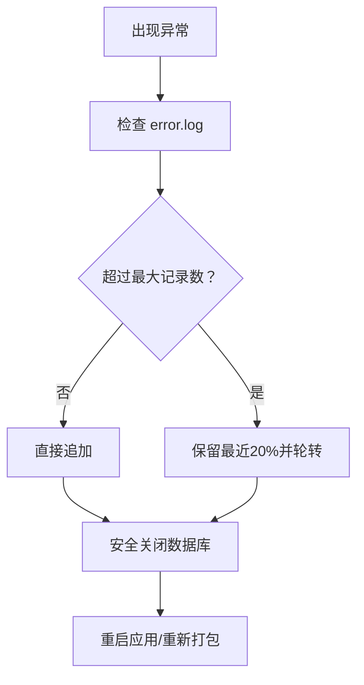

# 部署和运维

<cite>
**本文引用的文件**   
- [main.py](file://main.py)
- [build.bat](file://build.bat)
- [start.bat](file://start.bat)
- [nuitka打包.txt](file://nuitka打包.txt)
- [config/common_config.py](file://config/common_config.py)
- [config/start_config.py](file://config/start_config.py)
- [config/py_config.py](file://config/py_config.py)
- [config/update_config.py](file://config/update_config.py)
- [config/logging_loguru.py](file://config/logging_loguru.py)
- [config/middleware_config.py](file://config/middleware_config.py)
- [config/kami_config.py](file://config/kami_config.py)
- [config/kami_encrypt.py](file://config/kami_encrypt.py)
- [requirements.txt](file://requirements.txt)
</cite>

## 目录
1. [简介](#简介)
2. [项目结构](#项目结构)
3. [核心组件](#核心组件)
4. [架构总览](#架构总览)
5. [详细组件分析](#详细组件分析)
6. [依赖分析](#依赖分析)
7. [性能考量](#性能考量)
8. [故障排除指南](#故障排除指南)
9. [结论](#结论)
10. [附录](#附录)

## 简介
本指南面向 ikun_temu_system 的部署与运维，覆盖以下主题：
- 部署前准备与环境要求
- Nuitka 打包配置与优化策略
- 环境搭建全流程与注意事项
- 性能优化建议与实施方案
- 故障排除标准流程与常用方法
- 日常运维最佳实践与维护策略
- 部署相关的安全考虑与风险控制

## 项目结构
该工程采用多模块分层组织，前端界面基于 PyQt5，后端服务基于 FastAPI + Uvicorn，同时集成 Playwright 无头浏览器自动化能力。配置与日志由独立模块管理，数据库初始化与并发控制通过集中配置模块实现。

**图表来源**
- [main.py:1-233](file://main.py#L1-L233)
- [config/common_config.py:1-394](file://config/common_config.py#L1-L394)
- [config/start_config.py:1-161](file://config/start_config.py#L1-L161)
- [config/py_config.py:1-93](file://config/py_config.py#L1-L93)
- [config/logging_loguru.py:1-131](file://config/logging_loguru.py#L1-L131)
- [config/middleware_config.py:1-13](file://config/middleware_config.py#L1-L13)
- [config/kami_config.py:1-56](file://config/kami_config.py#L1-L56)
- [config/kami_encrypt.py:1-321](file://config/kami_encrypt.py#L1-L321)
- [build.bat:1-275](file://build.bat#L1-L275)
- [start.bat:1-1](file://start.bat#L1-L1)
- [nuitka打包.txt:1-376](file://nuitka打包.txt#L1-L376)
- [requirements.txt:1-168](file://requirements.txt#L1-L168)

**章节来源**
- [main.py:1-233](file://main.py#L1-L233)
- [config/common_config.py:1-394](file://config/common_config.py#L1-L394)
- [config/start_config.py:1-161](file://config/start_config.py#L1-L161)
- [config/py_config.py:1-93](file://config/py_config.py#L1-L93)
- [config/logging_loguru.py:1-131](file://config/logging_loguru.py#L1-L131)
- [config/middleware_config.py:1-13](file://config/middleware_config.py#L1-L13)
- [config/kami_config.py:1-56](file://config/kami_config.py#L1-L56)
- [config/kami_encrypt.py:1-321](file://config/kami_encrypt.py#L1-L321)
- [build.bat:1-275](file://build.bat#L1-L275)
- [start.bat:1-1](file://start.bat#L1-L1)
- [nuitka打包.txt:1-376](file://nuitka打包.txt#L1-L376)
- [requirements.txt:1-168](file://requirements.txt#L1-L168)

## 核心组件
- 入口与生命周期管理：负责全局异常捕获、数据库初始化、日志清理执行器、定时任务执行器、应用事件循环与退出清理。
- 配置中心：集中管理数据库连接、并发参数、表结构初始化、版本号与更新策略。
- 日志系统：提供与 loguru 风格一致的彩色控制台输出与文件输出，支持队列监听器与级别映射。
- 打包与运行：提供批处理脚本一键安装依赖、检查环境、安装 Nuitka 并执行打包；提供启动脚本激活虚拟环境并运行主程序。
- 安全与权限：卡密配置与加密模块，提供基于卡密的配置加密存储与令牌验证。

**章节来源**
- [main.py:21-201](file://main.py#L21-L201)
- [config/common_config.py:157-334](file://config/common_config.py#L157-L334)
- [config/start_config.py:27-106](file://config/start_config.py#L27-L106)
- [config/logging_loguru.py:82-119](file://config/logging_loguru.py#L82-L119)
- [build.bat:156-214](file://build.bat#L156-L214)
- [start.bat:1-1](file://start.bat#L1-L1)
- [config/kami_config.py:6-56](file://config/kami_config.py#L6-L56)
- [config/kami_encrypt.py:17-321](file://config/kami_encrypt.py#L17-L321)

## 架构总览
系统采用“入口脚本 + 配置中心 + 日志系统 + 打包脚本”的总体架构，核心流程如下：

**图表来源**
- [main.py:62-201](file://main.py#L62-L201)
- [config/common_config.py:245-334](file://config/common_config.py#L245-L334)
- [config/logging_loguru.py:82-119](file://config/logging_loguru.py#L82-L119)
- [build.bat:156-214](file://build.bat#L156-L214)
- [requirements.txt:1-168](file://requirements.txt#L1-L168)

## 详细组件分析

### 入口与生命周期管理（main.py）
- 全局异常处理：捕获未处理异常，写入 error.log，记录堆栈，安全关闭数据库。
- 权限与数据库初始化：根据登录模式与权限集合初始化 ikun 与 hupu 数据库，创建表结构与锁文件。
- 日志清理与定时任务：启动日志清理执行器，退出时停止执行器与定时任务，安全关闭数据库。
- 事件循环与退出清理：使用 QEventLoop + asyncio，退出前清理后台执行器与数据库连接。

**图表来源**
- [main.py:62-201](file://main.py#L62-L201)

**章节来源**
- [main.py:21-201](file://main.py#L21-L201)

### 配置中心（common_config.py）
- 数据库连接管理：按表名路由到 ikun 或 hupu 数据库，统一关闭与 WAL 合并。
- 并发参数：从配置表读取各任务并发上限，构造任务并发配置字典。
- 初始化流程：创建/读取数据库配置，初始化 SQLiteDB 与 ConfigManager，创建/更新表结构，写入初始化锁文件。

**图表来源**
- [config/common_config.py:16-51](file://config/common_config.py#L16-L51)
- [config/py_config.py:4-31](file://config/py_config.py#L4-L31)

**章节来源**
- [config/common_config.py:157-334](file://config/common_config.py#L157-L334)
- [config/py_config.py:4-85](file://config/py_config.py#L4-L85)

### 日志系统（logging_loguru.py）
- 彩色输出：复刻 loguru 风格格式与颜色映射，支持控制台与文件输出。
- 级别增强：注册 SUCCESS 级别，统一日志格式。
- 初始化：提供 init_logger 与全局 logger 实例。

**图表来源**
- [config/logging_loguru.py:82-119](file://config/logging_loguru.py#L82-L119)

**章节来源**
- [config/logging_loguru.py:1-131](file://config/logging_loguru.py#L1-L131)

### 打包与运行（build.bat、start.bat、nuitka打包.txt）
- 打包脚本：前置检查、清理旧产物、终止残留进程、激活虚拟环境、检查/安装 Nuitka、执行 Nuitka 打包命令、记录耗时与结果。
- 启动脚本：激活虚拟环境并运行主程序。
- 打包说明：包含多个历史打包命令示例，涵盖 PyQt5 插件、Playwright、FastAPI/Uvicorn、数据文件与浏览器驱动复制要点。

**图表来源**
- [build.bat:79-237](file://build.bat#L79-L237)

**章节来源**
- [build.bat:1-275](file://build.bat#L1-L275)
- [start.bat:1-1](file://start.bat#L1-L1)
- [nuitka打包.txt:183-246](file://nuitka打包.txt#L183-L246)

### 安全与权限（kami_config.py、kami_encrypt.py）
- 卡密配置：提供卡密读写与通用键值存取。
- 加密工具：基于卡密派生密钥，AES-CBC 加密/解密，支持令牌生成与验证，保障配置文件安全。

**图表来源**
- [config/kami_config.py:6-56](file://config/kami_config.py#L6-L56)
- [config/kami_encrypt.py:17-321](file://config/kami_encrypt.py#L17-L321)

**章节来源**
- [config/kami_config.py:1-56](file://config/kami_config.py#L1-L56)
- [config/kami_encrypt.py:1-321](file://config/kami_encrypt.py#L1-L321)

## 依赖分析
- 运行时依赖：PyQt5、FastAPI、Uvicorn、Playwright、loguru、pandas、numpy、requests、aiohttp 等。
- 打包依赖：Nuitka（固定版本）、PyQt5 插件、Playwright 静态资源、数据文件与浏览器驱动目录。
- 脚本依赖：Windows 注册表调整、ANSI 颜色支持、虚拟环境激活。

**图表来源**
- [requirements.txt:1-168](file://requirements.txt#L1-L168)
- [build.bat:156-214](file://build.bat#L156-L214)
- [nuitka打包.txt:183-246](file://nuitka打包.txt#L183-L246)

**章节来源**
- [requirements.txt:1-168](file://requirements.txt#L1-L168)
- [build.bat:156-214](file://build.bat#L156-L214)
- [nuitka打包.txt:183-246](file://nuitka打包.txt#L183-L246)

## 性能考量
- 数据库并发与连接池：通过配置中心读取并发参数，合理设置连接池大小与超时，避免阻塞。
- 日志输出：彩色控制台输出在高并发场景下可能影响性能，建议生产环境减少控制台级别或仅输出文件。
- 打包优化：启用多核编译（--job=4）、排除测试与构建工具、包含必要数据文件与浏览器驱动，缩短启动时间。
- 事件循环：使用 QEventLoop + asyncio，避免阻塞 UI 线程；退出时及时停止执行器与定时任务，释放资源。

**章节来源**
- [config/common_config.py:344-376](file://config/common_config.py#L344-L376)
- [config/logging_loguru.py:82-119](file://config/logging_loguru.py#L82-L119)
- [build.bat:179-214](file://build.bat#L179-L214)

## 故障排除指南
- 打包失败常见原因与处理：
  - 磁盘空间不足、杀软拦截、权限不足、虚拟环境损坏。建议以管理员身份运行、临时关闭杀软、清理旧产物。
- 运行期异常：
  - 全局异常捕获会写入 error.log 并尝试安全关闭数据库；启动时检查 error.log 并进行轮转，避免无限增长。
- 数据库问题：
  - 启动时 WAL 检查点与合并，退出时关闭连接与异步连接，确保文件完整性。
- 日志问题：
  - 若日志输出异常，检查日志初始化与处理器配置，确认文件路径可写。

**图表来源**
- [config/start_config.py:109-154](file://config/start_config.py#L109-L154)
- [config/common_config.py:59-135](file://config/common_config.py#L59-L135)

**章节来源**
- [build.bat:221-237](file://build.bat#L221-L237)
- [config/start_config.py:27-106](file://config/start_config.py#L27-L106)
- [config/common_config.py:59-135](file://config/common_config.py#L59-L135)

## 结论
本指南提供了 ikun_temu_system 的部署与运维全景视图，从环境准备、Nuitka 打包、运行与日志、到安全与故障排除，形成闭环。建议在生产环境中严格遵循打包与启动脚本，配合配置中心与日志系统，确保稳定性与可观测性。

## 附录
- 版本号与更新：入口脚本在打包模式下校验版本号一致性，建议在发布前统一版本号。
- 中间件导出：并发参数与任务配置通过中间件导出，避免循环导入，便于模块间共享。

**章节来源**
- [main.py:227-232](file://main.py#L227-L232)
- [config/middleware_config.py:1-13](file://config/middleware_config.py#L1-L13)