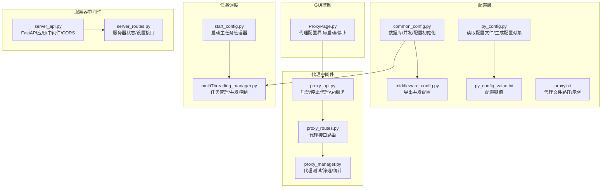
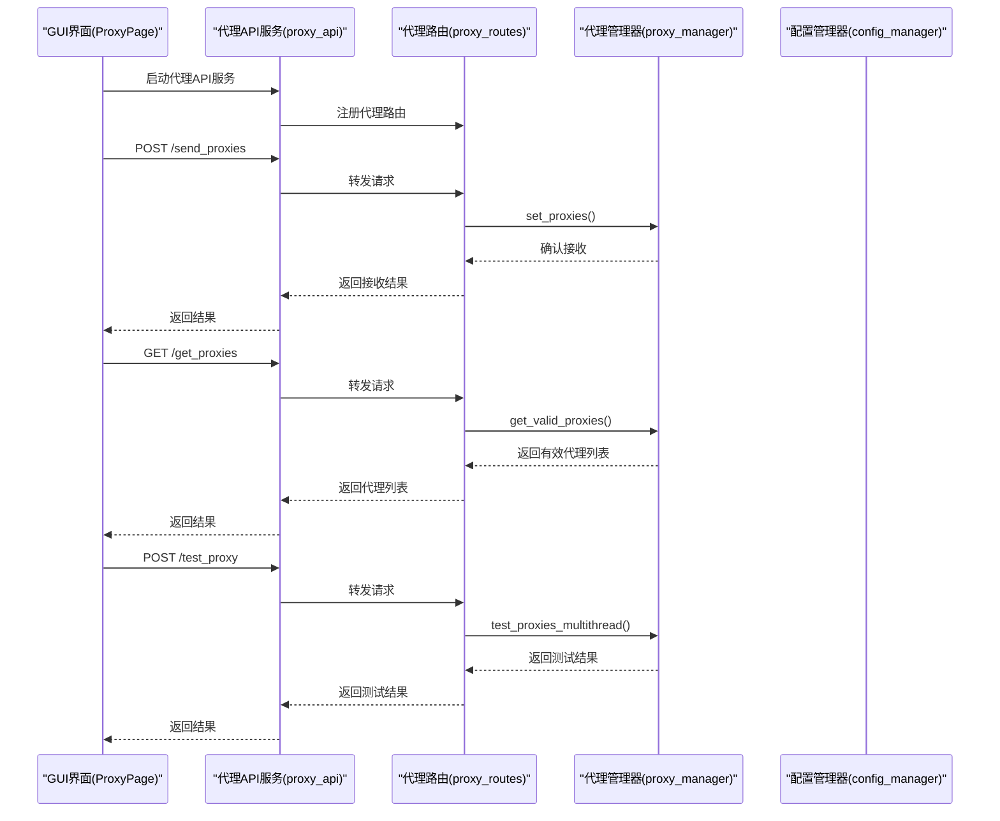
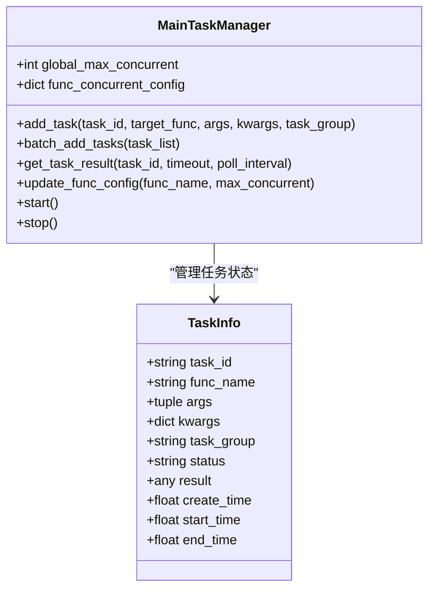
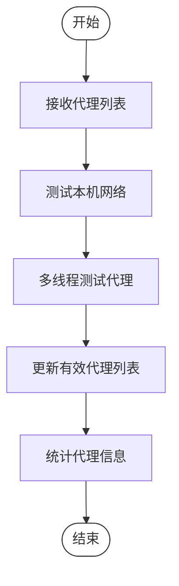
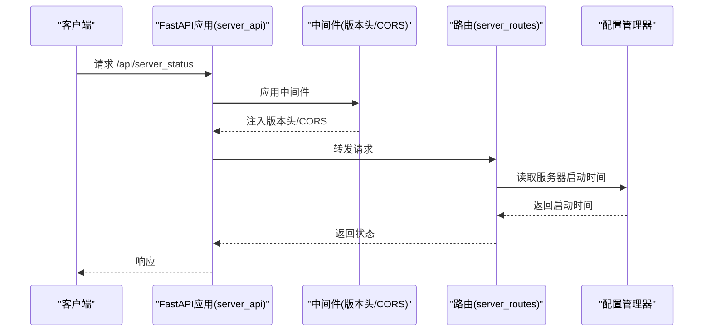
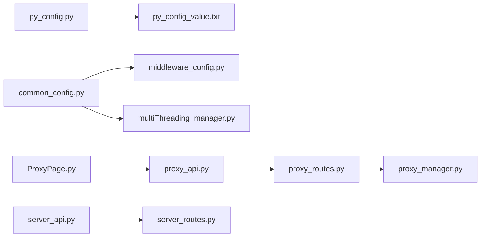

# 中间件配置

<cite>
**本文档引用的文件**
- [middleware_config.py](file://config/middleware_config.py)
- [common_config.py](file://config/common_config.py)
- [proxy_manager.py](file://utils/proxy_manager.py)
- [proxy_api.py](file://api/proxy_api.py)
- [proxy_routes.py](file://api/proxy_routes/proxy_routes.py)
- [ProxyPage.py](file://gui/ProxyPage.py)
- [py_config.py](file://config/py_config.py)
- [py_config_value.txt](file://配置文件_系统配置/py_config_value.txt)
- [proxy.txt](file://配置文件_系统配置/proxy.txt)
- [multiThreading_manager.py](file://utils/multiThreading_manager.py)
- [start_config.py](file://config/start_config.py)
- [server_api.py](file://api/server_api.py)
- [server_routes.py](file://api/server_routes/server_routes.py)
</cite>

## 目录
1. [简介](#简介)
2. [项目结构](#项目结构)
3. [核心组件](#核心组件)
4. [架构总览](#架构总览)
5. [详细组件分析](#详细组件分析)
6. [依赖关系分析](#依赖关系分析)
7. [性能考量](#性能考量)
8. [故障排除指南](#故障排除指南)
9. [结论](#结论)
10. [附录](#附录)

## 简介
本文件聚焦于 ikun_temu_system 的“中间件配置”，涵盖代理配置、网络设置、并发与任务调度参数等。文档旨在帮助读者理解中间件在系统中的作用、如何配置与优化、以及与其他组件的集成方式；同时提供故障排除建议与最佳实践。

## 项目结构
中间件配置涉及以下关键模块：
- 配置层：集中于 config 目录，负责数据库、并发、代理等配置的读取与初始化
- 代理中间件：通过 FastAPI 代理 API 提供代理列表下发、测试、统计等能力
- GUI 控制：通过 ProxyPage 提供代理配置的图形化界面与启动/停止流程
- 并发与任务调度：通过多线程任务管理器实现全局与功能级并发控制
- 服务器中间件：通过 FastAPI 中间件为 API 响应注入版本信息等

**图表来源**
- [common_config.py:141-376](file://config/common_config.py#L141-L376)
- [middleware_config.py:1-13](file://config/middleware_config.py#L1-L13)
- [py_config.py:1-93](file://config/py_config.py#L1-L93)
- [proxy_api.py:1-214](file://api/proxy_api.py#L1-L214)
- [proxy_routes.py:1-218](file://api/proxy_routes/proxy_routes.py#L1-L218)
- [proxy_manager.py:1-400](file://utils/proxy_manager.py#L1-L400)
- [ProxyPage.py:1-931](file://gui/ProxyPage.py#L1-L931)
- [multiThreading_manager.py:1-555](file://utils/multiThreading_manager.py#L1-L555)
- [start_config.py:1-161](file://config/start_config.py#L1-L161)
- [server_api.py:1-474](file://api/server_api.py#L1-L474)
- [server_routes.py:1-289](file://api/server_routes/server_routes.py#L1-L289)

**章节来源**
- [common_config.py:141-376](file://config/common_config.py#L141-L376)
- [middleware_config.py:1-13](file://config/middleware_config.py#L1-L13)
- [py_config.py:1-93](file://config/py_config.py#L1-L93)
- [proxy_api.py:1-214](file://api/proxy_api.py#L1-L214)
- [proxy_routes.py:1-218](file://api/proxy_routes/proxy_routes.py#L1-L218)
- [proxy_manager.py:1-400](file://utils/proxy_manager.py#L1-L400)
- [ProxyPage.py:1-931](file://gui/ProxyPage.py#L1-L931)
- [multiThreading_manager.py:1-555](file://utils/multiThreading_manager.py#L1-L555)
- [start_config.py:1-161](file://config/start_config.py#L1-L161)
- [server_api.py:1-474](file://api/server_api.py#L1-L474)
- [server_routes.py:1-289](file://api/server_routes/server_routes.py#L1-L289)

## 核心组件
- 并发与任务调度
  - 全局最大并发与功能级并发配置由配置中心读取并注入任务管理器
  - 任务管理器按“店铺_功能”分组，分别应用各自并发上限
- 代理中间件
  - 通过 FastAPI 提供代理下发、测试、统计、随机代理获取等接口
  - GUI 通过 ProxyPage 启动代理 API 服务，并与代理管理器交互
- 服务器中间件
  - 通过 FastAPI 中间件为响应注入版本号等头部信息
  - CORS 中间件允许跨域访问，便于前端调用

**章节来源**
- [common_config.py:346-376](file://config/common_config.py#L346-L376)
- [multiThreading_manager.py:42-107](file://utils/multiThreading_manager.py#L42-L107)
- [proxy_api.py:1-214](file://api/proxy_api.py#L1-L214)
- [proxy_routes.py:1-218](file://api/proxy_routes/proxy_routes.py#L1-L218)
- [proxy_manager.py:1-400](file://utils/proxy_manager.py#L1-L400)
- [ProxyPage.py:1-931](file://gui/ProxyPage.py#L1-L931)
- [server_api.py:71-78](file://api/server_api.py#L71-L78)

## 架构总览
中间件配置贯穿“配置读取—代理服务—任务调度—服务器中间件”链路，形成可扩展、可观测、可控制的中间件体系。

**图表来源**
- [ProxyPage.py:728-800](file://gui/ProxyPage.py#L728-L800)
- [proxy_api.py:33-54](file://api/proxy_api.py#L33-L54)
- [proxy_routes.py:20-124](file://api/proxy_routes/proxy_routes.py#L20-L124)
- [proxy_manager.py:168-227](file://utils/proxy_manager.py#L168-L227)

**章节来源**
- [ProxyPage.py:728-800](file://gui/ProxyPage.py#L728-L800)
- [proxy_api.py:33-54](file://api/proxy_api.py#L33-L54)
- [proxy_routes.py:20-124](file://api/proxy_routes/proxy_routes.py#L20-L124)
- [proxy_manager.py:168-227](file://utils/proxy_manager.py#L168-L227)

## 详细组件分析

### 并发与任务调度中间件
- 配置来源
  - 从配置管理器读取全局最大并发与功能级并发配置
  - 默认全局并发为 800，功能级并发字典包含“核价”“上传实拍图”“JIT库存”等
- 任务管理器
  - 全局信号量控制整体并发
  - 按“店铺_功能”分组创建信号量，实现细粒度并发控制
  - 支持动态更新功能并发配置，仅支持扩容
- 启动流程
  - 程序启动时创建主任务管理器并启动
  - 通过全局异常钩子确保异常时安全关闭数据库

**图表来源**
- [multiThreading_manager.py:42-107](file://utils/multiThreading_manager.py#L42-L107)
- [multiThreading_manager.py:24-40](file://utils/multiThreading_manager.py#L24-L40)
- [start_config.py:19-24](file://config/start_config.py#L19-L24)

**章节来源**
- [common_config.py:346-376](file://config/common_config.py#L346-L376)
- [multiThreading_manager.py:42-107](file://utils/multiThreading_manager.py#L42-L107)
- [start_config.py:19-24](file://config/start_config.py#L19-L24)

### 代理中间件
- 配置与启动
  - 通过配置文件读取代理 API 端口与地址
  - GUI 启动代理 API 服务，注册代理路由，提供跨域支持
- 接口能力
  - 下发代理列表、获取有效/全部代理、清空代理
  - 多线程测试代理、获取测试结果、统计信息、随机代理
  - 本机网络连通性测试
- 管理策略
  - 支持同步/异步/多线程三种测试模式
  - 提供测试历史记录、回调机制、统计信息
  - 支持将全部代理设为有效代理

**图表来源**
- [proxy_routes.py:82-124](file://api/proxy_routes/proxy_routes.py#L82-L124)
- [proxy_manager.py:168-227](file://utils/proxy_manager.py#L168-L227)

**章节来源**
- [py_config.py:13-16](file://config/py_config.py#L13-L16)
- [py_config_value.txt:1-4](file://配置文件_系统配置/py_config_value.txt#L1-L4)
- [proxy_api.py:1-214](file://api/proxy_api.py#L1-L214)
- [proxy_routes.py:1-218](file://api/proxy_routes/proxy_routes.py#L1-L218)
- [proxy_manager.py:1-400](file://utils/proxy_manager.py#L1-L400)
- [ProxyPage.py:1-931](file://gui/ProxyPage.py#L1-L931)

### 服务器中间件
- 中间件
  - 版本号响应头中间件：为所有响应添加版本号与应用信息头部
  - CORS 中间件：允许任意来源、方法与头部
- 生命周期
  - 使用 lifespan 管理 FastAPI 工作进程的启动与退出
  - 启动时初始化任务日志管理器，退出时优雅停止
- 路由
  - 注册通用、店铺、任务、服务器相关路由
  - 提供服务器状态、设置读取/保存等接口

**图表来源**
- [server_api.py:71-94](file://api/server_api.py#L71-L94)
- [server_routes.py:91-108](file://api/server_routes/server_routes.py#L91-L108)

**章节来源**
- [server_api.py:40-57](file://api/server_api.py#L40-L57)
- [server_api.py:71-94](file://api/server_api.py#L71-L94)
- [server_routes.py:91-108](file://api/server_routes/server_routes.py#L91-L108)

## 依赖关系分析
- 配置依赖
  - 任务并发配置依赖配置管理器读取
  - 代理 API 地址依赖配置文件读取
- 组件耦合
  - 代理 API 服务与代理路由强耦合
  - GUI 与代理 API 服务通过 HTTP 交互
  - 任务管理器与配置中心弱耦合（仅读取配置）

**图表来源**
- [py_config.py:32-61](file://config/py_config.py#L32-L61)
- [py_config_value.txt:1-4](file://配置文件_系统配置/py_config_value.txt#L1-L4)
- [common_config.py:346-376](file://config/common_config.py#L346-L376)
- [middleware_config.py:1-13](file://config/middleware_config.py#L1-L13)
- [ProxyPage.py:1-931](file://gui/ProxyPage.py#L1-L931)
- [proxy_api.py:1-214](file://api/proxy_api.py#L1-L214)
- [proxy_routes.py:1-218](file://api/proxy_routes/proxy_routes.py#L1-L218)
- [proxy_manager.py:1-400](file://utils/proxy_manager.py#L1-L400)
- [server_api.py:1-474](file://api/server_api.py#L1-L474)
- [server_routes.py:1-289](file://api/server_routes/server_routes.py#L1-L289)

**章节来源**
- [py_config.py:32-61](file://config/py_config.py#L32-L61)
- [py_config_value.txt:1-4](file://配置文件_系统配置/py_config_value.txt#L1-L4)
- [common_config.py:346-376](file://config/common_config.py#L346-L376)
- [middleware_config.py:1-13](file://config/middleware_config.py#L1-L13)
- [ProxyPage.py:1-931](file://gui/ProxyPage.py#L1-L931)
- [proxy_api.py:1-214](file://api/proxy_api.py#L1-L214)
- [proxy_routes.py:1-218](file://api/proxy_routes/proxy_routes.py#L1-L218)
- [proxy_manager.py:1-400](file://utils/proxy_manager.py#L1-L400)
- [server_api.py:1-474](file://api/server_api.py#L1-L474)
- [server_routes.py:1-289](file://api/server_routes/server_routes.py#L1-L289)

## 性能考量
- 并发控制
  - 全局并发与功能级并发双层控制，避免热点功能拖垮整体
  - 动态扩容仅支持增加上限，减少回退带来的复杂性
- 代理测试
  - 多线程测试提升吞吐，但需合理设置线程数与超时
  - 本机网络连通性测试优先，避免无效代理测试
- 服务器中间件
  - CORS 允许跨域，注意生产环境的安全策略
  - 中间件仅注入头部，开销极低

[本节为通用指导，无需具体文件分析]

## 故障排除指南
- 代理 API 启动失败（端口占用）
  - 使用端口释放工具强制释放端口，确认端口未被占用
  - 检查代理 API 端口配置是否正确
- 代理测试长时间无响应
  - 检查测试 URL 与超时设置
  - 确认本机网络连通性测试通过
- 代理列表为空
  - 确认代理文件路径与格式正确
  - 检查 GUI 是否成功下发代理列表
- 任务超时或失败
  - 调整功能级并发配置
  - 检查任务超时时间与异常日志

**章节来源**
- [proxy_api.py:64-107](file://api/proxy_api.py#L64-L107)
- [ProxyPage.py:740-762](file://gui/ProxyPage.py#L740-L762)
- [proxy_manager.py:291-315](file://utils/proxy_manager.py#L291-L315)
- [multiThreading_manager.py:251-273](file://utils/multiThreading_manager.py#L251-L273)

## 结论
中间件配置通过“配置中心—代理服务—任务调度—服务器中间件”的协同，实现了可扩展、可观测、可控制的中间件体系。合理的并发与代理策略、完善的错误处理与监控，是保障系统稳定运行的关键。

[本节为总结，无需具体文件分析]

## 附录

### 中间件参数与配置清单
- 代理 API 配置
  - 端口：来自配置文件键值
  - 地址：http://127.0.0.1:端口
- 代理文件路径
  - 代理文件路径：来自配置文件键值
  - 示例代理文件：包含代理样例
- 并发配置
  - 全局最大并发：默认 800
  - 功能级并发：核价、上传实拍图、JIT库存等
- 服务器中间件
  - CORS：允许任意来源/方法/头部
  - 响应头：版本号与应用信息

**章节来源**
- [py_config.py:13-16](file://config/py_config.py#L13-L16)
- [py_config_value.txt:1-4](file://配置文件_系统配置/py_config_value.txt#L1-L4)
- [proxy.txt:1-2](file://配置文件_系统配置/proxy.txt#L1-L2)
- [common_config.py:141-153](file://config/common_config.py#L141-L153)
- [server_api.py:88-94](file://api/server_api.py#L88-L94)

### 安全与最佳实践
- 代理安全
  - 仅使用可信代理源，定期测试与轮换
  - 对代理账号密码进行加密存储与传输
- 并发与稳定性
  - 合理设置全局与功能级并发，避免过载
  - 动态调整并发时仅扩容，避免回退导致状态混乱
- 服务器中间件
  - 生产环境建议限制 CORS 源与头部
  - 定期检查中间件注入的头部是否符合安全策略
- 日志与监控
  - 使用统一日志管理器，关注异常与超时
  - 对代理测试与任务执行进行统计与告警

[本节为通用指导，无需具体文件分析]