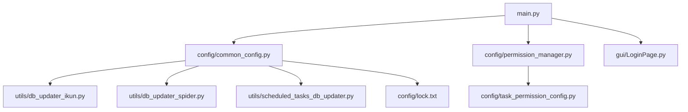
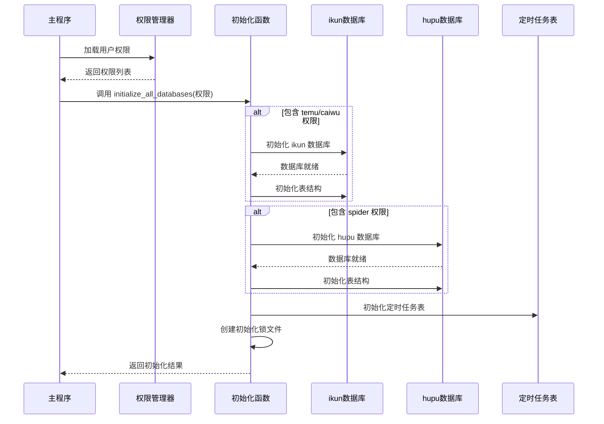
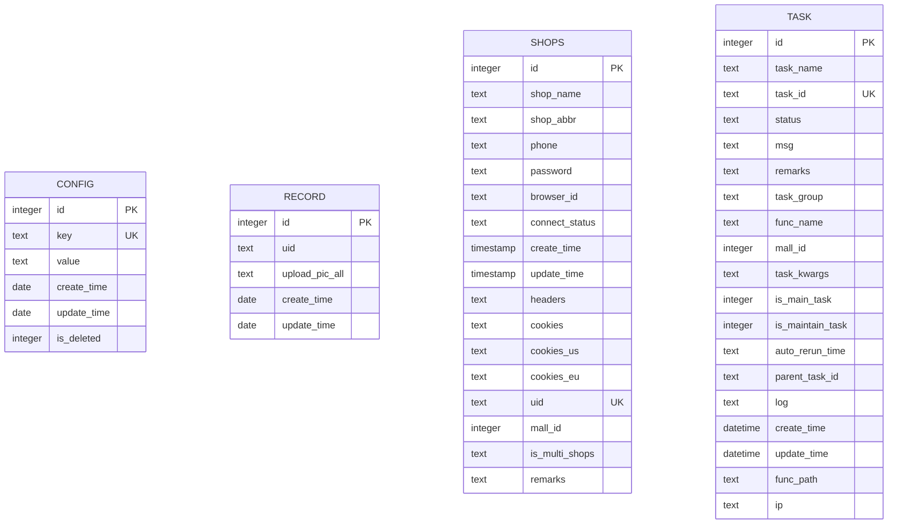
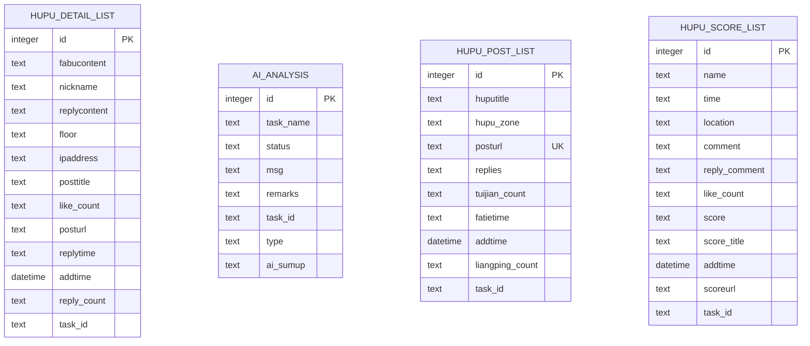
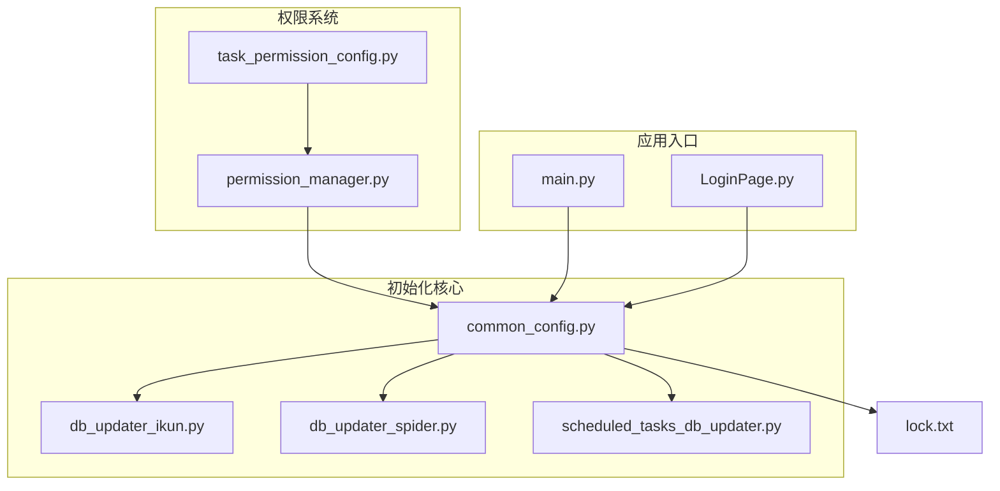

# 数据库初始化流程

<cite>
**本文档引用的文件**
- [config/common_config.py](file://config/common_config.py)
- [utils/db_updater_ikun.py](file://utils/db_updater_ikun.py)
- [utils/db_updater_spider.py](file://utils/db_updater_spider.py)
- [utils/scheduled_tasks_db_updater.py](file://utils/scheduled_tasks_db_updater.py)
- [config/lock.txt](file://config/lock.txt)
- [config/permission_manager.py](file://config/permission_manager.py)
- [config/task_permission_config.py](file://config/task_permission_config.py)
- [gui/LoginPage.py](file://gui/LoginPage.py)
- [main.py](file://main.py)
</cite>

## 目录
1. [简介](#简介)
2. [项目结构](#项目结构)
3. [核心组件](#核心组件)
4. [架构概览](#架构概览)
5. [详细组件分析](#详细组件分析)
6. [依赖关系分析](#依赖关系分析)
7. [性能考虑](#性能考虑)
8. [故障排除指南](#故障排除指南)
9. [结论](#结论)

## 简介

本文档详细说明了数据库初始化流程，重点介绍 `initialize_all_databases` 统一初始化函数的工作机制。该流程涵盖了两个主要数据库的初始化：ikun 数据库（用于 temu 和 caiwu 权限相关功能）和 hupu 数据库（用于 spider 权限相关的虎扑数据采集）。文档还解释了数据库表结构初始化步骤、定时任务表的创建和修复过程，以及初始化锁文件的作用和工作机制。

## 项目结构

数据库初始化相关的代码分布在以下关键文件中：

**图表来源**
- [main.py:62-101](file://main.py#L62-L101)
- [config/common_config.py:245-334](file://config/common_config.py#L245-L334)
- [config/permission_manager.py:16-55](file://config/permission_manager.py#L16-L55)
- [gui/LoginPage.py:418-431](file://gui/LoginPage.py#L418-L431)

**章节来源**
- [main.py:62-101](file://main.py#L62-L101)
- [config/common_config.py:245-334](file://config/common_config.py#L245-L334)

## 核心组件

### initialize_all_databases 统一初始化函数

`initialize_all_databases` 是整个数据库初始化流程的核心函数，负责协调各个数据库和表结构的初始化工作。其主要职责包括：

1. **权限驱动的数据库初始化**：根据传入的权限列表决定初始化哪些数据库
2. **ikun 数据库初始化**：当包含 "temu" 或 "caiwu" 权限时初始化
3. **hupu 数据库初始化**：当包含 "spider" 权限时初始化
4. **表结构初始化**：为 ikun 和 hupu 数据库创建必要的表结构
5. **定时任务表初始化**：创建和修复 scheduled_tasks 表
6. **初始化锁文件创建**：标记系统已完成初始化

**章节来源**
- [config/common_config.py:245-334](file://config/common_config.py#L245-L334)

### 数据库连接管理器

`DatabaseConnectionManager` 类提供了统一的数据库连接管理，根据表名自动选择合适的数据库连接：

- 主数据库连接：用于 task、shop、ai_analysis 等表
- 虎扑数据库连接：用于 hupu_post_list、hupu_detail_list、hupu_score_list 等表
- 自动回退机制：找不到特定连接时自动使用主数据库

**章节来源**
- [config/common_config.py:16-49](file://config/common_config.py#L16-L49)

## 架构概览

数据库初始化的整体架构采用分层设计，确保权限控制和初始化流程的清晰分离：

**图表来源**
- [main.py:86-101](file://main.py#L86-L101)
- [config/common_config.py:245-334](file://config/common_config.py#L245-L334)

## 详细组件分析

### ikun 数据库初始化流程

ikun 数据库专门用于支持 temu 和 caiwu 权限相关的功能，包含以下表结构：

#### 核心表结构

1. **config 表**：存储系统配置信息
   - 主键：id
   - 唯一键：key
   - 字段：key、value、create_time、update_time、is_deleted

2. **record 表**：记录上传图片相关信息
   - 主键：id
   - 字段：uid、upload_pic_all、create_time、update_time

3. **shops 表**：商店信息管理
   - 主键：id
   - 唯一键：uid、id
   - 扩展字段：cookies_us、cookies_eu、is_multi_shops、remarks

4. **task 表**：任务调度管理
   - 主键：id
   - 唯一键：task_id
   - 丰富的时间戳字段：create_time、update_time

**图表来源**
- [utils/db_updater_ikun.py:398-525](file://utils/db_updater_ikun.py#L398-L525)

**章节来源**
- [utils/db_updater_ikun.py:328-395](file://utils/db_updater_ikun.py#L328-L395)

### hupu 数据库初始化流程

hupu 数据库专用于 spider 权限相关的虎扑数据采集，包含以下核心表：

#### 虎扑数据表结构

1. **hupu_detail_list 表**：帖子详情数据
   - 主键：id
   - 唯一键：posturl、floor
   - 字段：fabucontent、nickname、replycontent、floor、ipaddress、posttitle、like_count、posturl、replytime、addtime、reply_count、task_id

2. **ai_analysis 表**：AI分析结果
   - 主键：id
   - 字段：task_name、status、msg、remarks、task_id、type、ai_sumup

3. **hupu_post_list 表**：帖子列表数据
   - 主键：id
   - 唯一键：posturl
   - 字段：huputitle、hupu_zone、posturl、replies、tuijian_count、fatietime、addtime、liangping_count、task_id

4. **hupu_score_list 表**：评分数据
   - 主键：id
   - 唯一键：scoreurl、name、time
   - 字段：name、time、location、comment、reply_comment、like_count、score、score_title、addtime、scoreurl、task_id

**图表来源**
- [utils/db_updater_spider.py:244-351](file://utils/db_updater_spider.py#L244-L351)

**章节来源**
- [utils/db_updater_spider.py:152-241](file://utils/db_updater_spider.py#L152-L241)

### 定时任务表初始化

定时任务系统使用独立的数据库表来管理任务调度：

#### scheduled_tasks 表结构

- 主键：id
- 必填字段：task_id、schedule_type
- 调度相关字段：schedule_time、schedule_interval、schedule_enabled、schedule_next_run、last_run_time、run_count、max_run_count
- 时间戳字段：created_time、updated_time
- 索引优化：task_id、schedule_next_run、schedule_enabled

**章节来源**
- [utils/scheduled_tasks_db_updater.py:163-230](file://utils/scheduled_tasks_db_updater.py#L163-L230)

### 初始化锁文件机制

初始化锁文件是一个简单的文本文件，用于标记系统已完成数据库初始化：

#### 锁文件特性

- **文件位置**：config/lock.txt
- **内容格式**："初始化锁，若需重新初始化则删除数据库文件和本文件，最后重新启动程序即可"
- **作用机制**：
  - 标记初始化完成状态
  - 作为重新初始化的触发条件
  - 简化初始化流程的状态管理

**章节来源**
- [config/lock.txt:1](file://config/lock.txt#L1)
- [config/common_config.py:318-333](file://config/common_config.py#L318-L333)

## 依赖关系分析

数据库初始化流程涉及多个组件之间的复杂依赖关系：

**图表来源**
- [config/permission_manager.py:16-55](file://config/permission_manager.py#L16-L55)
- [config/task_permission_config.py:67-84](file://config/task_permission_config.py#L67-84)
- [config/common_config.py:245-334](file://config/common_config.py#L245-L334)

### 权限控制对初始化的影响

权限系统通过以下方式影响数据库初始化：

1. **条件性初始化**：只有在用户具有相应权限时才初始化对应数据库
2. **表结构差异**：不同权限对应不同的表结构需求
3. **功能可用性**：权限决定了用户界面中可使用的功能模块

**章节来源**
- [config/permission_manager.py:16-55](file://config/permission_manager.py#L16-L55)
- [config/task_permission_config.py:8-47](file://config/task_permission_config.py#L8-L47)

## 性能考虑

数据库初始化流程在设计时考虑了以下性能因素：

### 并发控制
- 数据库连接池配置：最大连接数 9999，最小连接数 1
- 线程安全：使用 SQLiteDB 的线程本地连接管理
- 超时设置：连接超时 30秒，空闲超时 300秒

### 存储优化
- WAL 日志模式：提高并发读写性能
- 缓存大小：20000 页面缓存
- 同步模式：NORMAL 模式平衡性能和安全性

### 初始化优化
- 条件初始化：仅初始化用户需要的数据库
- 批量操作：表结构更新采用批量 SQL 执行
- 错误恢复：部分失败不影响整体初始化流程

## 故障排除指南

### 常见初始化错误及解决方案

#### 1. 数据库文件访问权限错误

**错误表现**：
- 初始化过程中出现权限不足错误
- 数据库文件无法创建或读取

**解决方案**：
- 确保程序对配置文件夹具有读写权限
- 检查防病毒软件是否阻止数据库文件访问
- 以管理员权限运行程序

#### 2. 数据库配置文件损坏

**错误表现**：
- JSON 配置文件格式错误
- 数据库连接参数不正确

**解决方案**：
- 删除损坏的配置文件（db_config.json、hupu_db_config.json）
- 程序会自动重新创建正确的配置文件
- 检查磁盘空间是否充足

#### 3. 表结构更新冲突

**错误表现**：
- 表结构更新过程中出现字段冲突
- 数据迁移失败

**解决方案**：
- 检查数据库文件是否被其他进程占用
- 关闭所有可能访问数据库的程序
- 删除数据库文件重新初始化

#### 4. 初始化锁文件问题

**错误表现**：
- 程序提示已初始化但仍无法正常运行
- 重复初始化失败

**解决方案**：
- 删除 config/lock.txt 文件
- 删除对应的数据库文件（ikun.db、hupu.db）
- 重新启动程序进行完整初始化

#### 5. 权限相关错误

**错误表现**：
- 某些功能模块不可用
- 权限检查失败

**解决方案**：
- 检查权限配置是否正确保存
- 验证权限数据库表是否存在
- 重新登录获取正确权限

**章节来源**
- [config/common_config.py:378-387](file://config/common_config.py#L378-L387)

### 调试和诊断

#### 日志分析
- 查看程序日志文件了解具体错误信息
- 关注初始化过程中的警告和错误日志
- 检查数据库连接状态

#### 手动验证
- 验证数据库文件是否存在且可访问
- 检查表结构是否符合预期
- 确认索引和约束是否正确创建

## 结论

数据库初始化流程通过 `initialize_all_databases` 函数实现了高度模块化的权限驱动初始化机制。该流程不仅确保了不同权限用户只能访问其授权的功能，还通过智能的表结构管理和错误恢复机制保证了系统的稳定性和可靠性。

关键优势包括：
- **权限透明化**：权限直接影响可用功能和初始化范围
- **模块化设计**：ikun、hupu、定时任务等组件独立管理
- **错误容错**：部分失败不影响整体系统可用性
- **状态跟踪**：通过初始化锁文件明确系统状态

这一设计为后续的功能扩展和维护提供了良好的基础架构支持。