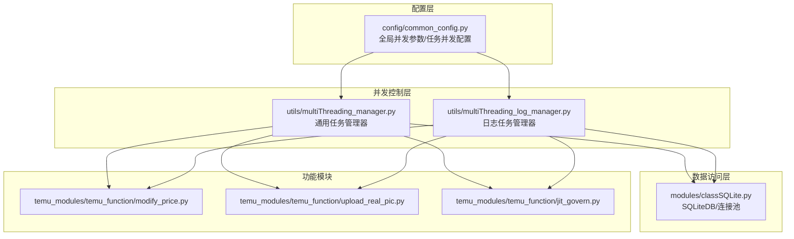
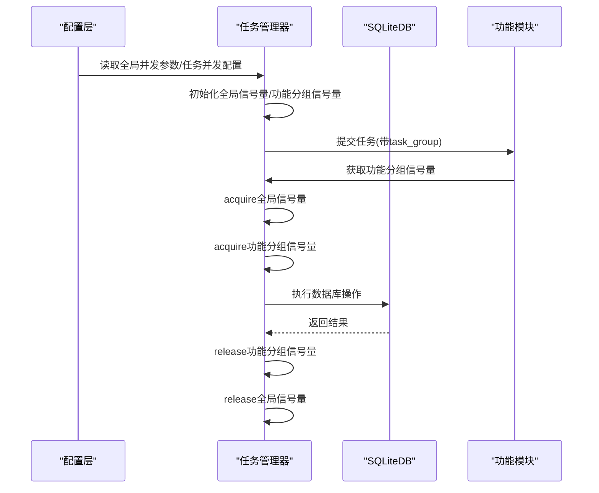
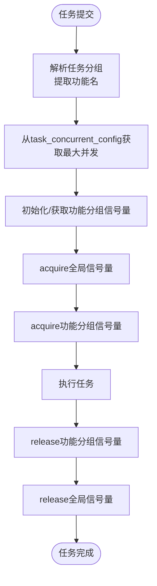
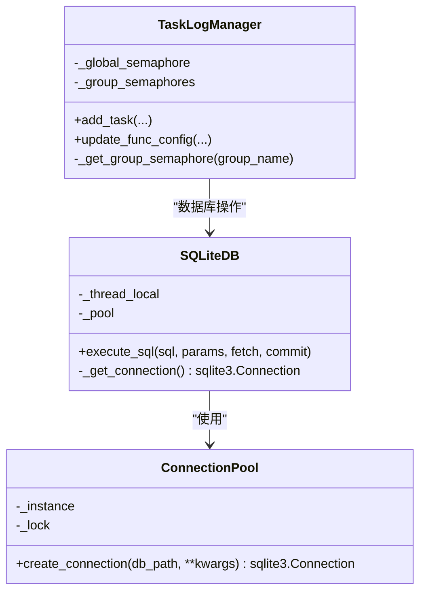
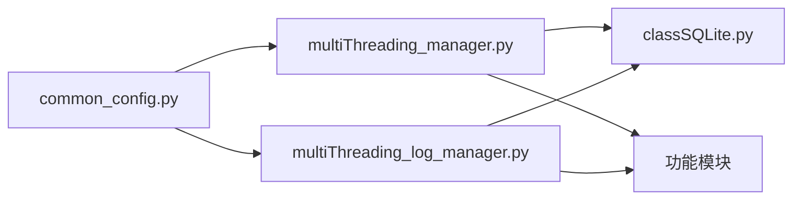

# 数据库并发配置

<cite>
**本文档引用的文件**
- [common_config.py](file://config/common_config.py)
- [multiThreading_manager.py](file://utils/multiThreading_manager.py)
- [multiThreading_log_manager.py](file://utils/multiThreading_log_manager.py)
- [classSQLite.py](file://modules/classSQLite.py)
- [modify_price.py](file://temu_modules/temu_function/modify_price.py)
- [upload_real_pic.py](file://temu_modules/temu_function/upload_real_pic.py)
- [jit_govern.py](file://temu_modules/temu_function/jit_govern.py)
- [db_updater_ikun.py](file://utils/db_updater_ikun.py)
</cite>

## 目录
1. [简介](#简介)
2. [项目结构](#项目结构)
3. [核心组件](#核心组件)
4. [架构概览](#架构概览)
5. [详细组件分析](#详细组件分析)
6. [依赖关系分析](#依赖关系分析)
7. [性能考量](#性能考量)
8. [故障排查指南](#故障排查指南)
9. [结论](#结论)

## 简介
本文件系统性阐述该系统的数据库并发配置与控制机制，涵盖全局并发参数、功能模块并发限制、任务并发配置字典工作机制、不同数据库表的并发访问策略与线程安全考虑，并提供调优建议、最佳实践以及并发冲突处理与死锁预防措施。内容基于仓库实际代码实现，确保可操作性和可验证性。

## 项目结构
围绕数据库并发配置的关键模块与文件如下：
- 配置层：全局并发参数与任务并发配置字典
- 并发控制层：通用任务管理器与日志任务管理器
- 数据访问层：SQLiteDB连接池与线程本地连接
- 功能模块：核价、上传实拍图、JIT维护库存等

**图表来源**
- [common_config.py:140-153](file://config/common_config.py#L140-L153)
- [multiThreading_manager.py:42-106](file://utils/multiThreading_manager.py#L42-L106)
- [multiThreading_log_manager.py:122-196](file://utils/multiThreading_log_manager.py#L122-L196)
- [classSQLite.py:294-432](file://modules/classSQLite.py#L294-L432)

**章节来源**
- [common_config.py:140-153](file://config/common_config.py#L140-L153)
- [multiThreading_manager.py:42-106](file://utils/multiThreading_manager.py#L42-L106)
- [multiThreading_log_manager.py:122-196](file://utils/multiThreading_log_manager.py#L122-L196)
- [classSQLite.py:294-432](file://modules/classSQLite.py#L294-L432)

## 核心组件
- 全局并发参数
  - max_concurrent_tasks：全局最大并发数，默认800
  - 各功能模块并发限制：modify_price_concurrent、upload_real_pic_concurrent、jit_govern_concurrent等
- 任务并发配置字典 task_concurrent_config
  - 键为功能名称（如"核价"、"上传实拍图"、"JIT库存"），值为该功能的最大并发数
  - default键为全局兜底并发数
- 并发控制机制
  - 全局信号量：限制整体并发
  - 功能分组信号量：按"店铺名_功能名"分组，独立控制各功能并发
  - 线程安全：使用RLock、Event、Queue等保证并发安全

**章节来源**
- [common_config.py:140-153](file://config/common_config.py#L140-L153)
- [common_config.py:344-367](file://config/common_config.py#L344-L367)
- [multiThreading_manager.py:50-90](file://utils/multiThreading_manager.py#L50-L90)
- [multiThreading_log_manager.py:172-182](file://utils/multiThreading_log_manager.py#L172-L182)

## 架构概览
系统通过配置层定义并发参数，任务管理器层实现并发控制，数据访问层提供线程安全的数据库连接，功能模块层执行具体业务逻辑。并发控制采用两级信号量：全局信号量限制总体并发，功能分组信号量按功能维度隔离并发。

**图表来源**
- [common_config.py:344-367](file://config/common_config.py#L344-L367)
- [multiThreading_manager.py:188-280](file://utils/multiThreading_manager.py#L188-L280)
- [classSQLite.py:419-432](file://modules/classSQLite.py#L419-L432)

## 详细组件分析

### 全局并发配置参数
- max_concurrent_tasks：全局最大并发数，默认800，可通过配置表读取并动态更新
- 各功能模块并发限制：
  - modify_price_concurrent：核价功能并发数
  - upload_real_pic_concurrent：上传实拍图功能并发数
  - jit_govern_concurrent：JIT库存功能并发数
  - 其他功能如虎扑采集、活动报名等也有相应并发限制
- 配置来源与持久化
  - 初始值来自配置表，支持运行时读取与更新
  - 任务并发配置字典task_concurrent_config基于上述参数构建

**章节来源**
- [common_config.py:140-147](file://config/common_config.py#L140-L147)
- [common_config.py:344-367](file://config/common_config.py#L344-L367)

### 任务并发配置字典工作机制
- 结构与含义
  - 键："核价"、"上传实拍图"、"JIT库存"等
  - 值：对应功能的最大并发数
  - default：全局兜底并发数
- 动态更新
  - 支持运行时修改功能并发数
  - 修改后立即生效，内部通过信号量扩容或重建实现
- 分组解析
  - 任务分组格式："店铺名_功能名"
  - 解析后按功能名匹配并发配置

**图表来源**
- [multiThreading_manager.py:71-106](file://utils/multiThreading_manager.py#L71-L106)
- [multiThreading_log_manager.py:637-681](file://utils/multiThreading_log_manager.py#L637-L681)

**章节来源**
- [multiThreading_manager.py:54-106](file://utils/multiThreading_manager.py#L54-L106)
- [multiThreading_log_manager.py:637-681](file://utils/multiThreading_log_manager.py#L637-L681)

### 不同数据库表的并发访问策略与线程安全
- 连接池与线程本地连接
  - ConnectionPool：单例连接池，线程安全
  - SQLiteDB：每个线程持有独立连接，避免跨线程共享连接
- PRAGMA配置
  - journal_mode=WAL：提升并发读写性能
  - cache_size=-20000：增大缓存
  - synchronous=NORMAL：平衡性能与安全性
- 线程安全措施
  - RLock保护共享状态
  - Event控制停止信号
  - Queue保证任务队列线程安全
  - 任务状态更新加锁

**图表来源**
- [classSQLite.py:294-432](file://modules/classSQLite.py#L294-L432)
- [multiThreading_log_manager.py:167-182](file://utils/multiThreading_log_manager.py#L167-L182)

**章节来源**
- [classSQLite.py:294-432](file://modules/classSQLite.py#L294-L432)
- [multiThreading_log_manager.py:167-182](file://utils/multiThreading_log_manager.py#L167-L182)

### 功能模块并发限制与实现
- 核价(modify_price)
  - 通过分组信号量控制每店铺核价并发
  - 支持批量SKU处理，内部按priceOrderId分组提交
- 上传实拍图(upload_real_pic)
  - 通过并发配置控制上传任务并发
  - 支持规则加载与异常列表筛选
- JIT维护库存(jit_govern)
  - 通过并发配置控制JIT商品查询与处理并发
  - 支持自动翻页获取完整数据

**章节来源**
- [modify_price.py:64-120](file://temu_modules/temu_function/modify_price.py#L64-L120)
- [upload_real_pic.py:34-110](file://temu_modules/temu_function/upload_real_pic.py#L34-L110)
- [jit_govern.py:11-93](file://temu_modules/temu_function/jit_govern.py#L11-L93)

## 依赖关系分析
- 配置依赖
  - 任务管理器依赖配置文件中的并发参数
  - 功能模块依赖配置表中的并发限制
- 数据库依赖
  - 任务管理器与功能模块均依赖SQLiteDB
  - SQLiteDB依赖ConnectionPool
- 并发控制依赖
  - 通用任务管理器与日志任务管理器共享并发控制逻辑
  - 功能模块通过任务管理器间接受并发控制

**图表来源**
- [common_config.py:344-367](file://config/common_config.py#L344-L367)
- [multiThreading_manager.py:12-12](file://utils/multiThreading_manager.py#L12-L12)
- [multiThreading_log_manager.py:15-16](file://utils/multiThreading_log_manager.py#L15-L16)

**章节来源**
- [common_config.py:344-367](file://config/common_config.py#L344-L367)
- [multiThreading_manager.py:12-12](file://utils/multiThreading_manager.py#L12-L12)
- [multiThreading_log_manager.py:15-16](file://utils/multiThreading_log_manager.py#L15-L16)

## 性能考量
- PRAGMA优化
  - WAL模式提升并发读写性能
  - 增大缓存与适度同步级别平衡性能与可靠性
- 连接管理
  - 线程本地连接避免锁竞争
  - 连接池减少连接创建开销
- 并发策略
  - 全局信号量限制总体负载
  - 功能分组信号量避免热点功能阻塞其他功能
- I/O与CPU平衡
  - 功能模块内部可设置随机休眠，降低接口压力
  - 批量处理提升吞吐量

[本节为通用指导，无需特定文件来源]

## 故障排查指南
- 并发配置未生效
  - 检查配置表中的并发参数是否正确写入
  - 确认任务管理器是否正确读取最新配置
- 任务长时间阻塞
  - 查看全局与功能分组信号量使用情况
  - 检查是否存在任务超时或异常导致信号量未释放
- 数据库连接问题
  - 确认SQLiteDB连接池初始化与线程本地连接是否正常
  - 检查PRAGMA配置是否正确应用
- 死锁与冲突
  - 任务管理器通过原子抢占与状态校验避免重复启动
  - 被动模式下注意队列满与状态不一致的风险

**章节来源**
- [multiThreading_log_manager.py:268-298](file://utils/multiThreading_log_manager.py#L268-L298)
- [classSQLite.py:1417-1496](file://modules/classSQLite.py#L1417-L1496)

## 结论
该系统通过配置层、并发控制层与数据访问层的协同，实现了灵活且可扩展的数据库并发控制。全局与功能分组两级信号量机制确保了系统在高并发场景下的稳定性与性能。配合SQLite的WAL模式与连接池设计，系统在保证线程安全的同时提升了并发处理能力。建议在生产环境中结合业务特点动态调整并发参数，并持续监控信号量使用情况以优化性能。