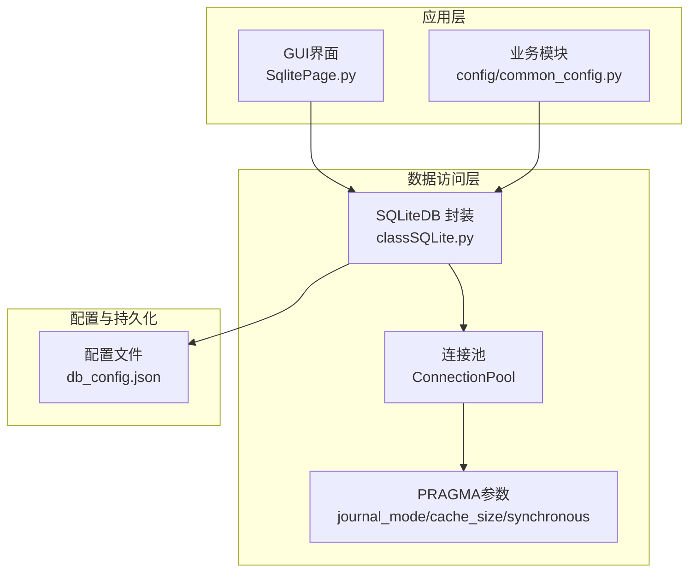
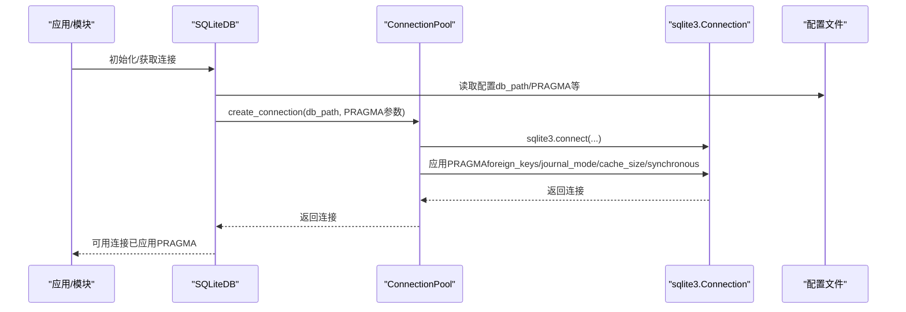
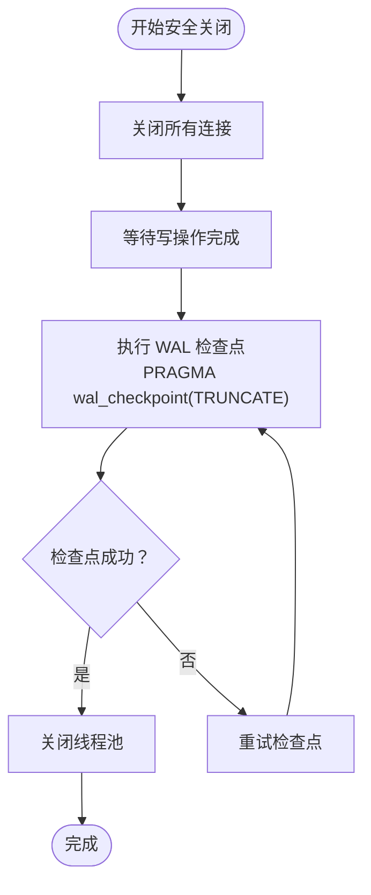
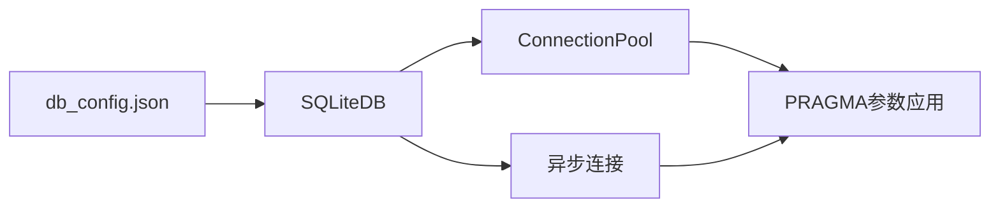

# 数据库性能参数

<cite>
**本文引用的文件**
- [classSQLite.py](file://modules/classSQLite.py)
- [common_config.py](file://config/common_config.py)
- [SqlitePage.py](file://gui/SqlitePage.py)
- [db_config.json](file://配置文件_系统配置/db_config.json)
</cite>

## 目录
1. [简介](#简介)
2. [项目结构](#项目结构)
3. [核心组件](#核心组件)
4. [架构概览](#架构概览)
5. [详细组件分析](#详细组件分析)
6. [依赖分析](#依赖分析)
7. [性能考虑](#性能考虑)
8. [故障排查指南](#故障排查指南)
9. [结论](#结论)
10. [附录](#附录)

## 简介
本文件聚焦于SQLite数据库性能参数配置与调优，结合仓库中的实际实现，系统阐述以下关键参数及其对性能与安全的影响：
- journal_mode 日志模式：重点说明WAL模式的优势与适用场景
- cache_size 缓存大小：如何通过页面缓存提升读写效率
- synchronous 同步级别：NORMAL、FULL、OFF等选项对数据安全与性能的权衡

同时给出不同使用场景（高并发、大数据量）的调优建议，并提供基于仓库实现的性能监控与调优实践案例。

## 项目结构
本项目的数据库层由统一的SQLiteDB封装类负责，连接池、PRAGMA参数应用、事务与异步支持均在此实现；GUI层提供交互式参数设置入口；系统配置文件集中管理默认参数。

图表来源
- [classSQLite.py:305-329](file://modules/classSQLite.py#L305-L329)
- [classSQLite.py:395-431](file://modules/classSQLite.py#L395-L431)
- [common_config.py:170-184](file://config/common_config.py#L170-L184)
- [SqlitePage.py:109-112](file://gui/SqlitePage.py#L109-L112)

章节来源
- [classSQLite.py:305-329](file://modules/classSQLite.py#L305-L329)
- [classSQLite.py:395-431](file://modules/classSQLite.py#L395-L431)
- [common_config.py:170-184](file://config/common_config.py#L170-L184)
- [SqlitePage.py:109-112](file://gui/SqlitePage.py#L109-L112)

## 核心组件
- SQLiteDB：提供统一的数据库操作接口，内置连接池、事务、异步、JSON类型支持、查询构建器等能力；在连接建立时应用PRAGMA参数。
- ConnectionPool：线程安全的连接池，按线程创建连接并在连接上应用journal_mode、cache_size、synchronous等参数。
- 配置系统：db_config.json集中管理数据库路径、超时、线程策略、外键开关以及PRAGMA参数；common_config.py提供默认配置模板与初始化逻辑。
- GUI参数设置：SqlitePage.py提供交互式PRAGMA参数设置入口，便于快速验证调优效果。

章节来源
- [classSQLite.py:359-432](file://modules/classSQLite.py#L359-L432)
- [classSQLite.py:294-329](file://modules/classSQLite.py#L294-L329)
- [db_config.json:1-18](file://配置文件_系统配置/db_config.json#L1-L18)
- [common_config.py:170-184](file://config/common_config.py#L170-L184)
- [SqlitePage.py:109-112](file://gui/SqlitePage.py#L109-L112)

## 架构概览
下图展示SQLiteDB在连接生命周期内如何应用PRAGMA参数，以及与配置文件的关系。

图表来源
- [classSQLite.py:395-431](file://modules/classSQLite.py#L395-L431)
- [classSQLite.py:305-329](file://modules/classSQLite.py#L305-L329)
- [db_config.json:1-18](file://配置文件_系统配置/db_config.json#L1-L18)

## 详细组件分析

### journal_mode（日志模式）
- 默认值：WAL
- 作用：控制SQLite的日志与恢复机制，影响并发读写与崩溃恢复策略
- WAL模式优势
  - 支持高并发读取：多个读事务可与写事务并行，显著提升读吞吐
  - 更好的写入性能：写入操作不阻塞读取，减少锁竞争
  - 增强的崩溃恢复：WAL文件与主数据库分离，便于检查点合并与恢复
- 在代码中的体现
  - 连接池在创建连接时应用journal_mode
  - 异步连接同样应用journal_mode
- 注意事项
  - WAL模式下，数据库文件旁会产生-wal与-shm文件，需定期进行检查点合并以回收空间

章节来源
- [classSQLite.py:305-329](file://modules/classSQLite.py#L305-L329)
- [classSQLite.py:1329-1332](file://modules/classSQLite.py#L1329-L1332)
- [db_config.json:6](file://配置文件_系统配置/db_config.json#L6)
- [common_config.py:172](file://config/common_config.py#L172)

### cache_size（缓存大小）
- 默认值：-20000（以页为单位）
- 作用：控制SQLite在内存中维护的页面缓存数量，直接影响读写性能
- 性能影响
  - 增大缓存：提升热点数据命中率，减少磁盘I/O，适合读密集场景
  - 减小缓存：降低内存占用，适合资源受限环境
- 在代码中的体现
  - 连接池在创建连接时应用cache_size
  - 异步连接同样应用cache_size
- 调优建议
  - 读密集、大表扫描：适当增大cache_size
  - 内存紧张：适度减小cache_size

章节来源
- [classSQLite.py:305-329](file://modules/classSQLite.py#L305-L329)
- [classSQLite.py:1329-1332](file://modules/classSQLite.py#L1329-L1332)
- [db_config.json:7](file://配置文件_系统配置/db_config.json#L7)
- [common_config.py:173](file://config/common_config.py#L173)

### synchronous（同步级别）
- 默认值：NORMAL
- 作用：控制写入时的fsync行为，平衡性能与数据安全
- 选项与影响
  - OFF：最快写入，风险最高（断电可能丢失最近写入）
  - NORMAL：默认级别，兼顾性能与安全（在关键节点触发fsync）
  - FULL：最安全级别，每次写入都强制同步，性能最慢
- 在代码中的体现
  - 连接池在创建连接时应用synchronous
  - 异步连接同样应用synchronous
- 调优建议
  - 对数据一致性要求极高：使用FULL
  - 对吞吐敏感且可容忍极小概率丢失：使用OFF（谨慎）
  - 平衡场景：使用NORMAL

章节来源
- [classSQLite.py:305-329](file://modules/classSQLite.py#L305-L329)
- [classSQLite.py:1329-1332](file://modules/classSQLite.py#L1329-L1332)
- [db_config.json:8](file://配置文件_系统配置/db_config.json#L8)
- [common_config.py:174](file://config/common_config.py#L174)

### WAL检查点与安全关闭
- 安全关闭流程
  - 关闭所有连接，等待写操作完成
  - 执行PRAGMA wal_checkpoint(TRUNCATE)合并WAL文件
  - 关闭线程池
- 作用：确保所有未落盘的变更被合并，避免WAL文件残留导致空间膨胀

图表来源
- [classSQLite.py:1417-1496](file://modules/classSQLite.py#L1417-L1496)

章节来源
- [classSQLite.py:1417-1496](file://modules/classSQLite.py#L1417-L1496)

### GUI参数设置与验证
- GUI层提供交互式PRAGMA参数设置入口，便于快速验证调优效果
- 示例：设置journal_mode=WAL、synchronous=NORMAL、cache_size=10000、temp_store=MEMORY

章节来源
- [SqlitePage.py:109-112](file://gui/SqlitePage.py#L109-L112)
- [SqlitePage.py:2737-2740](file://gui/SqlitePage.py#L2737-L2740)

## 依赖分析
- SQLiteDB依赖配置文件提供PRAGMA参数与连接参数
- ConnectionPool在连接创建阶段一次性应用PRAGMA，避免后续重复设置
- 异步连接同样应用相同的PRAGMA参数，保证同步与异步行为一致

图表来源
- [db_config.json:1-18](file://配置文件_系统配置/db_config.json#L1-L18)
- [classSQLite.py:395-431](file://modules/classSQLite.py#L395-L431)
- [classSQLite.py:1329-1332](file://modules/classSQLite.py#L1329-L1332)

章节来源
- [db_config.json:1-18](file://配置文件_系统配置/db_config.json#L1-L18)
- [classSQLite.py:395-431](file://modules/classSQLite.py#L395-L431)
- [classSQLite.py:1329-1332](file://modules/classSQLite.py#L1329-L1332)

## 性能考虑
- 读写速度
  - WAL模式显著提升并发读取吞吐，适合高并发读场景
  - cache_size增大可提升热点数据命中率，减少磁盘I/O
  - synchronous=NORMAL在性能与安全之间取得平衡
- 数据安全性
  - synchronous=FULL提供最强保护，适合金融、计费等关键业务
  - synchronous=OFF性能最佳但风险最高，仅在可接受极小概率丢失时使用
- 内存使用
  - cache_size越大，内存占用越高；应结合可用内存与工作集大小调优
- 空间回收
  - 定期执行VACUUM与安全关闭流程，配合WAL检查点合并，避免空间膨胀

[本节为通用指导，无需特定文件来源]

## 故障排查指南
- WAL文件未合并导致空间膨胀
  - 现象：数据库文件旁出现-wal与-shm文件，且体积较大
  - 处理：调用安全关闭流程，内部会多次尝试执行PRAGMA wal_checkpoint(TRUNCATE)，最终合并WAL文件
- 读写性能下降
  - 检查是否误设synchronous=FULL或cache_size过小
  - 确认是否使用了WAL模式
- 断电后数据丢失
  - 检查synchronous设置，必要时改为FULL
- GUI参数设置无效
  - 确认设置后是否重启数据库连接，因为PRAGMA在连接创建时应用

章节来源
- [classSQLite.py:1417-1496](file://modules/classSQLite.py#L1417-L1496)
- [classSQLite.py:1370-1378](file://modules/classSQLite.py#L1370-L1378)

## 结论
- 本项目默认采用WAL日志模式、较大的页面缓存与NORMAL同步级别，兼顾性能与安全
- 通过连接池在连接创建时应用PRAGMA参数，确保全局一致性
- 提供安全关闭流程与VACUUM能力，保障数据完整性与空间回收
- GUI层提供便捷的参数设置入口，便于快速验证调优效果

[本节为总结，无需特定文件来源]

## 附录

### 不同场景的参数调优建议
- 高并发读取场景
  - journal_mode=WAL（已默认）
  - cache_size适度增大（结合内存与工作集）
  - synchronous=NORMAL
- 大数据量写入场景
  - journal_mode=WAL（已默认）
  - cache_size视内存与写入模式调整
  - synchronous=NORMAL或FULL（根据安全需求）
- 内存受限场景
  - 适当减小cache_size
  - synchronous=NORMAL
- 极致性能场景（可接受较小风险）
  - synchronous=OFF（谨慎使用）
  - WAL模式配合合适的cache_size

[本节为通用指导，无需特定文件来源]

### 性能监控与调优案例（基于仓库实现）
- 案例1：GUI参数设置验证
  - 在GUI中设置journal_mode=WAL、synchronous=NORMAL、cache_size=10000、temp_store=MEMORY，然后执行查询与批量写入，观察读写延迟变化
  - 参考路径：[SqlitePage.py:109-112](file://gui/SqlitePage.py#L109-L112)
- 案例2：安全关闭与WAL检查点
  - 在应用退出前调用安全关闭流程，内部会多次尝试执行PRAGMA wal_checkpoint(TRUNCATE)，确保WAL文件合并
  - 参考路径：[classSQLite.py:1417-1496](file://modules/classSQLite.py#L1417-L1496)
- 案例3：配置文件集中管理
  - 通过db_config.json统一管理PRAGMA参数，避免硬编码
  - 参考路径：[db_config.json:1-18](file://配置文件_系统配置/db_config.json#L1-L18)
- 案例4：默认配置模板
  - common_config.py提供默认配置模板，便于初始化与迁移
  - 参考路径：[common_config.py:170-184](file://config/common_config.py#L170-L184)

章节来源
- [SqlitePage.py:109-112](file://gui/SqlitePage.py#L109-L112)
- [classSQLite.py:1417-1496](file://modules/classSQLite.py#L1417-L1496)
- [db_config.json:1-18](file://配置文件_系统配置/db_config.json#L1-L18)
- [common_config.py:170-184](file://config/common_config.py#L170-L184)