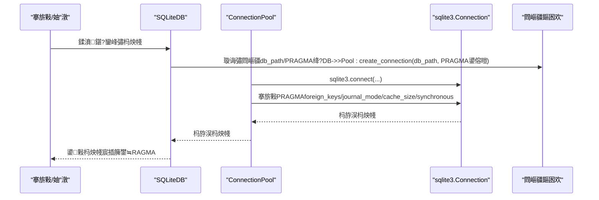
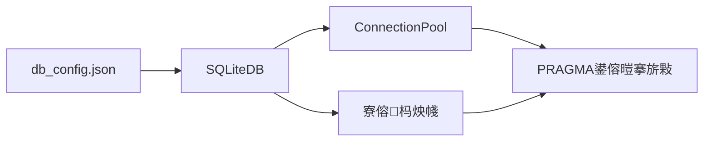

# 鏁版嵁搴撴€ц兘鍙傛暟

<cite>
**鏈枃寮曠敤鐨勬枃浠?*
- [classSQLite.py](file://modules/classSQLite.py)
- [common_config.py](file://config/common_config.py)
- [SqlitePage.py](file://gui/SqlitePage.py)
- [db_config.json](file://閰嶇疆鏂囦欢_绯荤粺閰嶇疆/db_config.json)
</cite>

## 鐩綍
1. [绠€浠媇(#绠€浠?
2. [椤圭洰缁撴瀯](#椤圭洰缁撴瀯)
3. [鏍稿績缁勪欢](#鏍稿績缁勪欢)
4. [鏋舵瀯姒傝](#鏋舵瀯姒傝)
5. [璇︾粏缁勪欢鍒嗘瀽](#璇︾粏缁勪欢鍒嗘瀽)
6. [渚濊禆鍒嗘瀽](#渚濊禆鍒嗘瀽)
7. [鎬ц兘鑰冭檻](#鎬ц兘鑰冭檻)
8. [鏁呴殰鎺掓煡鎸囧崡](#鏁呴殰鎺掓煡鎸囧崡)
9. [缁撹](#缁撹)
10. [闄勫綍](#闄勫綍)

## 绠€浠?鏈枃浠惰仛鐒︿簬SQLite鏁版嵁搴撴€ц兘鍙傛暟閰嶇疆涓庤皟浼橈紝缁撳悎浠撳簱涓殑瀹為檯瀹炵幇锛岀郴缁熼槓杩颁互涓嬪叧閿弬鏁板強鍏跺鎬ц兘涓庡畨鍏ㄧ殑褰卞搷锛?- journal_mode 鏃ュ織妯″紡锛氶噸鐐硅鏄嶹AL妯″紡鐨勪紭鍔夸笌閫傜敤鍦烘櫙
- cache_size 缂撳瓨澶у皬锛氬浣曢€氳繃椤甸潰缂撳瓨鎻愬崌璇诲啓鏁堢巼
- synchronous 鍚屾绾у埆锛歂ORMAL銆丗ULL銆丱FF绛夐€夐」瀵规暟鎹畨鍏ㄤ笌鎬ц兘鐨勬潈琛?
鍚屾椂缁欏嚭涓嶅悓浣跨敤鍦烘櫙锛堥珮骞跺彂銆佸ぇ鏁版嵁閲忥級鐨勮皟浼樺缓璁紝骞舵彁渚涘熀浜庝粨搴撳疄鐜扮殑鎬ц兘鐩戞帶涓庤皟浼樺疄璺垫渚嬨€?
## 椤圭洰缁撴瀯
鏈」鐩殑鏁版嵁搴撳眰鐢辩粺涓€鐨凷QLiteDB灏佽绫昏礋璐ｏ紝杩炴帴姹犮€丳RAGMA鍙傛暟搴旂敤銆佷簨鍔′笌寮傛鏀寔鍧囧湪姝ゅ疄鐜帮紱GUI灞傛彁渚涗氦浜掑紡鍙傛暟璁剧疆鍏ュ彛锛涚郴缁熼厤缃枃浠堕泦涓鐞嗛粯璁ゅ弬鏁般€?
```mermaid
graph TB
subgraph "搴旂敤灞?
GUI["GUI鐣岄潰<br/>SqlitePage.py"]
APP["涓氬姟妯″潡<br/>config/common_config.py"]
end
subgraph "鏁版嵁璁块棶灞?
DB["SQLiteDB 灏佽<br/>classSQLite.py"]
CP["杩炴帴姹?br/>ConnectionPool"]
PRAGMA["PRAGMA鍙傛暟<br/>journal_mode/cache_size/synchronous"]
end
subgraph "閰嶇疆涓庢寔涔呭寲"
CFG["閰嶇疆鏂囦欢<br/>db_config.json"]
end
GUI --> DB
APP --> DB
DB --> CP
CP --> PRAGMA
DB --> CFG
```

鍥捐〃鏉ユ簮
- [classSQLite.py:305-329](file://modules/classSQLite.py#L305-L329)
- [classSQLite.py:395-431](file://modules/classSQLite.py#L395-L431)
- [common_config.py:170-184](file://config/common_config.py#L170-L184)
- [SqlitePage.py:109-112](file://gui/SqlitePage.py#L109-L112)

绔犺妭鏉ユ簮
- [classSQLite.py:305-329](file://modules/classSQLite.py#L305-L329)
- [classSQLite.py:395-431](file://modules/classSQLite.py#L395-L431)
- [common_config.py:170-184](file://config/common_config.py#L170-L184)
- [SqlitePage.py:109-112](file://gui/SqlitePage.py#L109-L112)

## 鏍稿績缁勪欢
- SQLiteDB锛氭彁渚涚粺涓€鐨勬暟鎹簱鎿嶄綔鎺ュ彛锛屽唴缃繛鎺ユ睜銆佷簨鍔°€佸紓姝ャ€丣SON绫诲瀷鏀寔銆佹煡璇㈡瀯寤哄櫒绛夎兘鍔涳紱鍦ㄨ繛鎺ュ缓绔嬫椂搴旂敤PRAGMA鍙傛暟銆?- ConnectionPool锛氱嚎绋嬪畨鍏ㄧ殑杩炴帴姹狅紝鎸夌嚎绋嬪垱寤鸿繛鎺ュ苟鍦ㄨ繛鎺ヤ笂搴旂敤journal_mode銆乧ache_size銆乻ynchronous绛夊弬鏁般€?- 閰嶇疆绯荤粺锛歞b_config.json闆嗕腑绠＄悊鏁版嵁搴撹矾寰勩€佽秴鏃躲€佺嚎绋嬬瓥鐣ャ€佸閿紑鍏充互鍙奝RAGMA鍙傛暟锛沜ommon_config.py鎻愪緵榛樿閰嶇疆妯℃澘涓庡垵濮嬪寲閫昏緫銆?- GUI鍙傛暟璁剧疆锛歋qlitePage.py鎻愪緵浜や簰寮廝RAGMA鍙傛暟璁剧疆鍏ュ彛锛屼究浜庡揩閫熼獙璇佽皟浼樻晥鏋溿€?
绔犺妭鏉ユ簮
- [classSQLite.py:359-432](file://modules/classSQLite.py#L359-L432)
- [classSQLite.py:294-329](file://modules/classSQLite.py#L294-L329)
- [db_config.json:1-18](file://閰嶇疆鏂囦欢_绯荤粺閰嶇疆/db_config.json#L1-L18)
- [common_config.py:170-184](file://config/common_config.py#L170-L184)
- [SqlitePage.py:109-112](file://gui/SqlitePage.py#L109-L112)

## 鏋舵瀯姒傝
涓嬪浘灞曠ずSQLiteDB鍦ㄨ繛鎺ョ敓鍛藉懆鏈熷唴濡備綍搴旂敤PRAGMA鍙傛暟锛屼互鍙婁笌閰嶇疆鏂囦欢鐨勫叧绯汇€?


鍥捐〃鏉ユ簮
- [classSQLite.py:395-431](file://modules/classSQLite.py#L395-L431)
- [classSQLite.py:305-329](file://modules/classSQLite.py#L305-L329)
- [db_config.json:1-18](file://閰嶇疆鏂囦欢_绯荤粺閰嶇疆/db_config.json#L1-L18)

## 璇︾粏缁勪欢鍒嗘瀽

### journal_mode锛堟棩蹇楁ā寮忥級
- 榛樿鍊硷細WAL
- 浣滅敤锛氭帶鍒禨QLite鐨勬棩蹇椾笌鎭㈠鏈哄埗锛屽奖鍝嶅苟鍙戣鍐欎笌宕╂簝鎭㈠绛栫暐
- WAL妯″紡浼樺娍
  - 鏀寔楂樺苟鍙戣鍙栵細澶氫釜璇讳簨鍔″彲涓庡啓浜嬪姟骞惰锛屾樉钁楁彁鍗囪鍚炲悙
  - 鏇村ソ鐨勫啓鍏ユ€ц兘锛氬啓鍏ユ搷浣滀笉闃诲璇诲彇锛屽噺灏戦攣绔炰簤
  - 澧炲己鐨勫穿婧冩仮澶嶏細WAL鏂囦欢涓庝富鏁版嵁搴撳垎绂伙紝渚夸簬妫€鏌ョ偣鍚堝苟涓庢仮澶?- 鍦ㄤ唬鐮佷腑鐨勪綋鐜?  - 杩炴帴姹犲湪鍒涘缓杩炴帴鏃跺簲鐢╦ournal_mode
  - 寮傛杩炴帴鍚屾牱搴旂敤journal_mode
- 娉ㄦ剰浜嬮」
  - WAL妯″紡涓嬶紝鏁版嵁搴撴枃浠舵梺浼氫骇鐢?wal涓?shm鏂囦欢锛岄渶瀹氭湡杩涜妫€鏌ョ偣鍚堝苟浠ュ洖鏀剁┖闂?
绔犺妭鏉ユ簮
- [classSQLite.py:305-329](file://modules/classSQLite.py#L305-L329)
- [classSQLite.py:1329-1332](file://modules/classSQLite.py#L1329-L1332)
- [db_config.json:6](file://閰嶇疆鏂囦欢_绯荤粺閰嶇疆/db_config.json#L6)
- [common_config.py:172](file://config/common_config.py#L172)

### cache_size锛堢紦瀛樺ぇ灏忥級
- 榛樿鍊硷細-20000锛堜互椤典负鍗曚綅锛?- 浣滅敤锛氭帶鍒禨QLite鍦ㄥ唴瀛樹腑缁存姢鐨勯〉闈㈢紦瀛樻暟閲忥紝鐩存帴褰卞搷璇诲啓鎬ц兘
- 鎬ц兘褰卞搷
  - 澧炲ぇ缂撳瓨锛氭彁鍗囩儹鐐规暟鎹懡涓巼锛屽噺灏戠鐩業/O锛岄€傚悎璇诲瘑闆嗗満鏅?  - 鍑忓皬缂撳瓨锛氶檷浣庡唴瀛樺崰鐢紝閫傚悎璧勬簮鍙楅檺鐜
- 鍦ㄤ唬鐮佷腑鐨勪綋鐜?  - 杩炴帴姹犲湪鍒涘缓杩炴帴鏃跺簲鐢╟ache_size
  - 寮傛杩炴帴鍚屾牱搴旂敤cache_size
- 璋冧紭寤鸿
  - 璇诲瘑闆嗐€佸ぇ琛ㄦ壂鎻忥細閫傚綋澧炲ぇcache_size
  - 鍐呭瓨绱у紶锛氶€傚害鍑忓皬cache_size

绔犺妭鏉ユ簮
- [classSQLite.py:305-329](file://modules/classSQLite.py#L305-L329)
- [classSQLite.py:1329-1332](file://modules/classSQLite.py#L1329-L1332)
- [db_config.json:7](file://閰嶇疆鏂囦欢_绯荤粺閰嶇疆/db_config.json#L7)
- [common_config.py:173](file://config/common_config.py#L173)

### synchronous锛堝悓姝ョ骇鍒級
- 榛樿鍊硷細NORMAL
- 浣滅敤锛氭帶鍒跺啓鍏ユ椂鐨刦sync琛屼负锛屽钩琛℃€ц兘涓庢暟鎹畨鍏?- 閫夐」涓庡奖鍝?  - OFF锛氭渶蹇啓鍏ワ紝椋庨櫓鏈€楂橈紙鏂數鍙兘涓㈠け鏈€杩戝啓鍏ワ級
  - NORMAL锛氶粯璁ょ骇鍒紝鍏奸【鎬ц兘涓庡畨鍏紙鍦ㄥ叧閿妭鐐硅Е鍙慺sync锛?  - FULL锛氭渶瀹夊叏绾у埆锛屾瘡娆″啓鍏ラ兘寮哄埗鍚屾锛屾€ц兘鏈€鎱?- 鍦ㄤ唬鐮佷腑鐨勪綋鐜?  - 杩炴帴姹犲湪鍒涘缓杩炴帴鏃跺簲鐢╯ynchronous
  - 寮傛杩炴帴鍚屾牱搴旂敤synchronous
- 璋冧紭寤鸿
  - 瀵规暟鎹竴鑷存€ц姹傛瀬楂橈細浣跨敤FULL
  - 瀵瑰悶鍚愭晱鎰熶笖鍙蹇嶆瀬灏忔鐜囦涪澶憋細浣跨敤OFF锛堣皑鎱庯級
  - 骞宠　鍦烘櫙锛氫娇鐢∟ORMAL

绔犺妭鏉ユ簮
- [classSQLite.py:305-329](file://modules/classSQLite.py#L305-L329)
- [classSQLite.py:1329-1332](file://modules/classSQLite.py#L1329-L1332)
- [db_config.json:8](file://閰嶇疆鏂囦欢_绯荤粺閰嶇疆/db_config.json#L8)
- [common_config.py:174](file://config/common_config.py#L174)

### WAL妫€鏌ョ偣涓庡畨鍏ㄥ叧闂?- 瀹夊叏鍏抽棴娴佺▼
  - 鍏抽棴鎵€鏈夎繛鎺ワ紝绛夊緟鍐欐搷浣滃畬鎴?  - 鎵цPRAGMA wal_checkpoint(TRUNCATE)鍚堝苟WAL鏂囦欢
  - 鍏抽棴绾跨▼姹?- 浣滅敤锛氱‘淇濇墍鏈夋湭钀界洏鐨勫彉鏇磋鍚堝苟锛岄伩鍏峎AL鏂囦欢娈嬬暀瀵艰嚧绌洪棿鑶ㄨ儉

```mermaid
flowchart TD
Start(["寮€濮嬪畨鍏ㄥ叧闂?]) --> CloseConns["鍏抽棴鎵€鏈夎繛鎺?]
CloseConns --> WaitWrite["绛夊緟鍐欐搷浣滃畬鎴?]
WaitWrite --> Checkpoint["鎵ц WAL 妫€鏌ョ偣<br/>PRAGMA wal_checkpoint(TRUNCATE)"]
Checkpoint --> MergeOK{"妫€鏌ョ偣鎴愬姛锛?}
MergeOK --> |鏄瘄 Shutdown["鍏抽棴绾跨▼姹?]
MergeOK --> |鍚 Retry["閲嶈瘯妫€鏌ョ偣"]
Retry --> Checkpoint
Shutdown --> End(["瀹屾垚"])
```

鍥捐〃鏉ユ簮
- [classSQLite.py:1417-1496](file://modules/classSQLite.py#L1417-L1496)

绔犺妭鏉ユ簮
- [classSQLite.py:1417-1496](file://modules/classSQLite.py#L1417-L1496)

### GUI鍙傛暟璁剧疆涓庨獙璇?- GUI灞傛彁渚涗氦浜掑紡PRAGMA鍙傛暟璁剧疆鍏ュ彛锛屼究浜庡揩閫熼獙璇佽皟浼樻晥鏋?- 绀轰緥锛氳缃甹ournal_mode=WAL銆乻ynchronous=NORMAL銆乧ache_size=10000銆乼emp_store=MEMORY

绔犺妭鏉ユ簮
- [SqlitePage.py:109-112](file://gui/SqlitePage.py#L109-L112)
- [SqlitePage.py:2737-2740](file://gui/SqlitePage.py#L2737-L2740)

## 渚濊禆鍒嗘瀽
- SQLiteDB渚濊禆閰嶇疆鏂囦欢鎻愪緵PRAGMA鍙傛暟涓庤繛鎺ュ弬鏁?- ConnectionPool鍦ㄨ繛鎺ュ垱寤洪樁娈典竴娆℃€у簲鐢≒RAGMA锛岄伩鍏嶅悗缁噸澶嶈缃?- 寮傛杩炴帴鍚屾牱搴旂敤鐩稿悓鐨凱RAGMA鍙傛暟锛屼繚璇佸悓姝ヤ笌寮傛琛屼负涓€鑷?


鍥捐〃鏉ユ簮
- [db_config.json:1-18](file://閰嶇疆鏂囦欢_绯荤粺閰嶇疆/db_config.json#L1-L18)
- [classSQLite.py:395-431](file://modules/classSQLite.py#L395-L431)
- [classSQLite.py:1329-1332](file://modules/classSQLite.py#L1329-L1332)

绔犺妭鏉ユ簮
- [db_config.json:1-18](file://閰嶇疆鏂囦欢_绯荤粺閰嶇疆/db_config.json#L1-L18)
- [classSQLite.py:395-431](file://modules/classSQLite.py#L395-L431)
- [classSQLite.py:1329-1332](file://modules/classSQLite.py#L1329-L1332)

## 鎬ц兘鑰冭檻
- 璇诲啓閫熷害
  - WAL妯″紡鏄捐憲鎻愬崌骞跺彂璇诲彇鍚炲悙锛岄€傚悎楂樺苟鍙戣鍦烘櫙
  - cache_size澧炲ぇ鍙彁鍗囩儹鐐规暟鎹懡涓巼锛屽噺灏戠鐩業/O
  - synchronous=NORMAL鍦ㄦ€ц兘涓庡畨鍏ㄤ箣闂村彇寰楀钩琛?- 鏁版嵁瀹夊叏鎬?  - synchronous=FULL鎻愪緵鏈€寮轰繚鎶わ紝閫傚悎閲戣瀺銆佽璐圭瓑鍏抽敭涓氬姟
  - synchronous=OFF鎬ц兘鏈€浣充絾椋庨櫓鏈€楂橈紝浠呭湪鍙帴鍙楁瀬灏忔鐜囦涪澶辨椂浣跨敤
- 鍐呭瓨浣跨敤
  - cache_size瓒婂ぇ锛屽唴瀛樺崰鐢ㄨ秺楂橈紱搴旂粨鍚堝彲鐢ㄥ唴瀛樹笌宸ヤ綔闆嗗ぇ灏忚皟浼?- 绌洪棿鍥炴敹
  - 瀹氭湡鎵цVACUUM涓庡畨鍏ㄥ叧闂祦绋嬶紝閰嶅悎WAL妫€鏌ョ偣鍚堝苟锛岄伩鍏嶇┖闂磋啫鑳€

[鏈妭涓洪€氱敤鎸囧锛屾棤闇€鐗瑰畾鏂囦欢鏉ユ簮]

## 鏁呴殰鎺掓煡鎸囧崡
- WAL鏂囦欢鏈悎骞跺鑷寸┖闂磋啫鑳€
  - 鐜拌薄锛氭暟鎹簱鏂囦欢鏃佸嚭鐜?wal涓?shm鏂囦欢锛屼笖浣撶Н杈冨ぇ
  - 澶勭悊锛氳皟鐢ㄥ畨鍏ㄥ叧闂祦绋嬶紝鍐呴儴浼氬娆″皾璇曟墽琛孭RAGMA wal_checkpoint(TRUNCATE)锛屾渶缁堝悎骞禬AL鏂囦欢
- 璇诲啓鎬ц兘涓嬮檷
  - 妫€鏌ユ槸鍚﹁璁緎ynchronous=FULL鎴朿ache_size杩囧皬
  - 纭鏄惁浣跨敤浜哤AL妯″紡
- 鏂數鍚庢暟鎹涪澶?  - 妫€鏌ynchronous璁剧疆锛屽繀瑕佹椂鏀逛负FULL
- GUI鍙傛暟璁剧疆鏃犳晥
  - 纭璁剧疆鍚庢槸鍚﹂噸鍚暟鎹簱杩炴帴锛屽洜涓篜RAGMA鍦ㄨ繛鎺ュ垱寤烘椂搴旂敤

绔犺妭鏉ユ簮
- [classSQLite.py:1417-1496](file://modules/classSQLite.py#L1417-L1496)
- [classSQLite.py:1370-1378](file://modules/classSQLite.py#L1370-L1378)

## 缁撹
- 鏈」鐩粯璁ら噰鐢╓AL鏃ュ織妯″紡銆佽緝澶х殑椤甸潰缂撳瓨涓嶯ORMAL鍚屾绾у埆锛屽吋椤炬€ц兘涓庡畨鍏?- 閫氳繃杩炴帴姹犲湪杩炴帴鍒涘缓鏃跺簲鐢≒RAGMA鍙傛暟锛岀‘淇濆叏灞€涓€鑷存€?- 鎻愪緵瀹夊叏鍏抽棴娴佺▼涓嶸ACUUM鑳藉姏锛屼繚闅滄暟鎹畬鏁存€т笌绌洪棿鍥炴敹
- GUI灞傛彁渚涗究鎹风殑鍙傛暟璁剧疆鍏ュ彛锛屼究浜庡揩閫熼獙璇佽皟浼樻晥鏋?
[鏈妭涓烘€荤粨锛屾棤闇€鐗瑰畾鏂囦欢鏉ユ簮]

## 闄勫綍

### 涓嶅悓鍦烘櫙鐨勫弬鏁拌皟浼樺缓璁?- 楂樺苟鍙戣鍙栧満鏅?  - journal_mode=WAL锛堝凡榛樿锛?  - cache_size閫傚害澧炲ぇ锛堢粨鍚堝唴瀛樹笌宸ヤ綔闆嗭級
  - synchronous=NORMAL
- 澶ф暟鎹噺鍐欏叆鍦烘櫙
  - journal_mode=WAL锛堝凡榛樿锛?  - cache_size瑙嗗唴瀛樹笌鍐欏叆妯″紡璋冩暣
  - synchronous=NORMAL鎴朏ULL锛堟牴鎹畨鍏ㄩ渶姹傦級
- 鍐呭瓨鍙楅檺鍦烘櫙
  - 閫傚綋鍑忓皬cache_size
  - synchronous=NORMAL
- 鏋佽嚧鎬ц兘鍦烘櫙锛堝彲鎺ュ彈杈冨皬椋庨櫓锛?  - synchronous=OFF锛堣皑鎱庝娇鐢級
  - WAL妯″紡閰嶅悎鍚堥€傜殑cache_size

[鏈妭涓洪€氱敤鎸囧锛屾棤闇€鐗瑰畾鏂囦欢鏉ユ簮]

### 鎬ц兘鐩戞帶涓庤皟浼樻渚嬶紙鍩轰簬浠撳簱瀹炵幇锛?- 妗堜緥1锛欸UI鍙傛暟璁剧疆楠岃瘉
  - 鍦℅UI涓缃甹ournal_mode=WAL銆乻ynchronous=NORMAL銆乧ache_size=10000銆乼emp_store=MEMORY锛岀劧鍚庢墽琛屾煡璇笌鎵归噺鍐欏叆锛岃瀵熻鍐欏欢杩熷彉鍖?  - 鍙傝€冭矾寰勶細[SqlitePage.py:109-112](file://gui/SqlitePage.py#L109-L112)
- 妗堜緥2锛氬畨鍏ㄥ叧闂笌WAL妫€鏌ョ偣
  - 鍦ㄥ簲鐢ㄩ€€鍑哄墠璋冪敤瀹夊叏鍏抽棴娴佺▼锛屽唴閮ㄤ細澶氭灏濊瘯鎵цPRAGMA wal_checkpoint(TRUNCATE)锛岀‘淇漌AL鏂囦欢鍚堝苟
  - 鍙傝€冭矾寰勶細[classSQLite.py:1417-1496](file://modules/classSQLite.py#L1417-L1496)
- 妗堜緥3锛氶厤缃枃浠堕泦涓鐞?  - 閫氳繃db_config.json缁熶竴绠＄悊PRAGMA鍙傛暟锛岄伩鍏嶇‖缂栫爜
  - 鍙傝€冭矾寰勶細[db_config.json:1-18](file://閰嶇疆鏂囦欢_绯荤粺閰嶇疆/db_config.json#L1-L18)
- 妗堜緥4锛氶粯璁ら厤缃ā鏉?  - common_config.py鎻愪緵榛樿閰嶇疆妯℃澘锛屼究浜庡垵濮嬪寲涓庤縼绉?  - 鍙傝€冭矾寰勶細[common_config.py:170-184](file://config/common_config.py#L170-L184)

绔犺妭鏉ユ簮
- [SqlitePage.py:109-112](file://gui/SqlitePage.py#L109-L112)
- [classSQLite.py:1417-1496](file://modules/classSQLite.py#L1417-L1496)
- [db_config.json:1-18](file://閰嶇疆鏂囦欢_绯荤粺閰嶇疆/db_config.json#L1-L18)
- [common_config.py:170-184](file://config/common_config.py#L170-L184)

