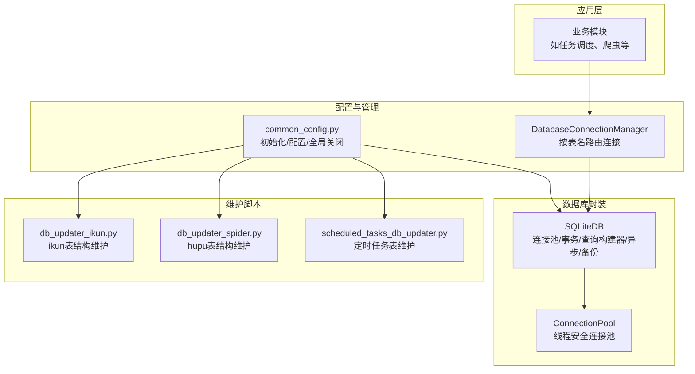
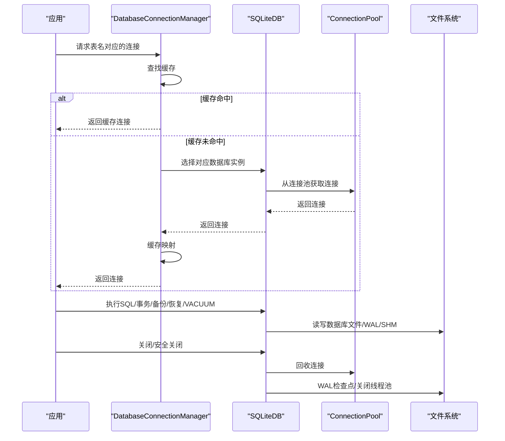
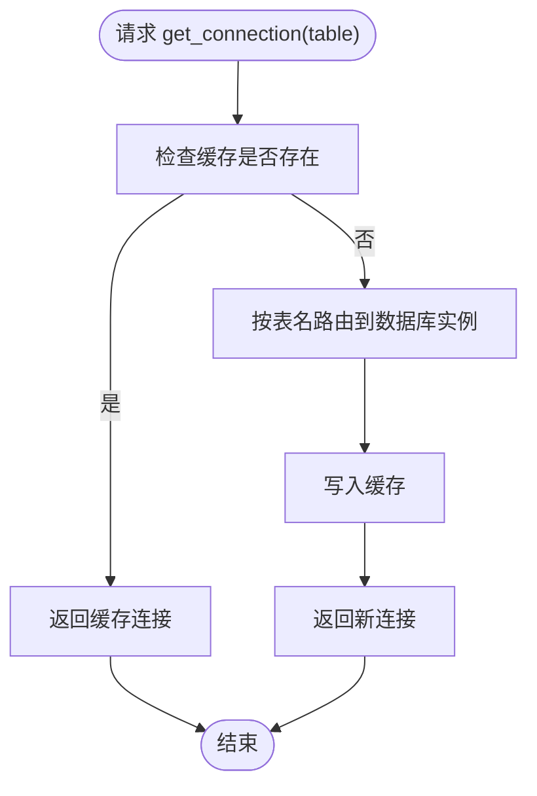
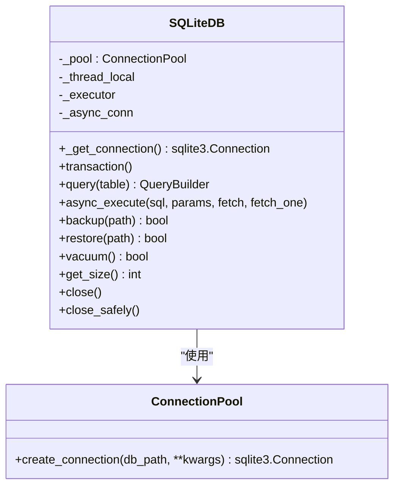
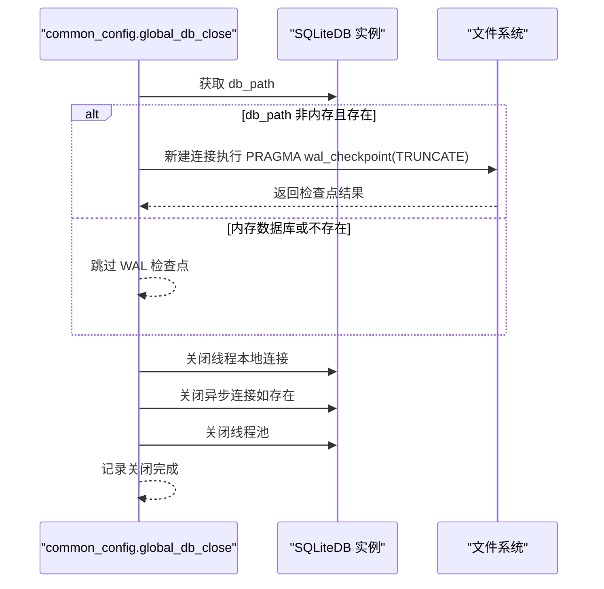
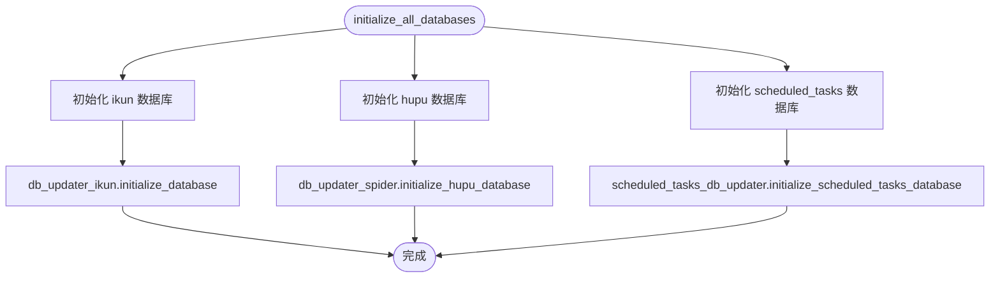
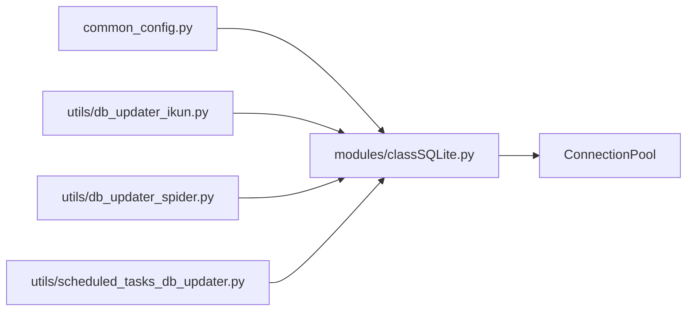

# 数据库管理工具

<cite>
**本文引用的文件**
- [modules/classSQLite.py](file://modules/classSQLite.py)
- [config/common_config.py](file://config/common_config.py)
- [utils/db_updater_ikun.py](file://utils/db_updater_ikun.py)
- [utils/db_updater_spider.py](file://utils/db_updater_spider.py)
- [utils/scheduled_tasks_db_updater.py](file://utils/scheduled_tasks_db_updater.py)
</cite>

## 目录
1. [简介](#简介)
2. [项目结构](#项目结构)
3. [核心组件](#核心组件)
4. [架构总览](#架构总览)
5. [详细组件分析](#详细组件分析)
6. [依赖分析](#依赖分析)
7. [性能考量](#性能考量)
8. [故障排查指南](#故障排查指南)
9. [结论](#结论)
10. [附录](#附录)

## 简介
本文件面向数据库管理工具的使用者与维护者，系统性阐述以下主题：
- DatabaseConnectionManager 连接管理器的设计与实现：如何按表名获取连接、连接缓存策略、连接池管理。
- global_db_close 安全关闭数据库的完整流程：WAL 检查点、连接关闭、异步连接处理、线程池清理。
- SQLiteDB 类的封装与扩展能力：连接池、事务、查询构建器、异步支持、备份/恢复、VACUUM、大小查询等。
- 数据库连接状态监控与故障诊断方法。
- 数据库维护与清理的最佳实践。

## 项目结构
该工具围绕 SQLite 数据库进行统一管理，关键模块如下：
- 数据库封装层：SQLiteDB（连接池、事务、查询构建器、异步、备份/恢复、VACUUM、大小查询等）
- 连接管理器：DatabaseConnectionManager（按表名路由到不同数据库实例）
- 全局安全关闭：global_db_close（ikun.db 与 hupu.db 的 WAL 合并与资源回收）
- 初始化与表结构维护：db_updater_ikun、db_updater_spider、scheduled_tasks_db_updater
- 配置与初始化入口：common_config（创建配置文件、初始化数据库、并发配置）

图表来源
- [config/common_config.py:15-135](file://config/common_config.py#L15-L135)
- [modules/classSQLite.py:294-330](file://modules/classSQLite.py#L294-L330)
- [modules/classSQLite.py:359-432](file://modules/classSQLite.py#L359-L432)
- [utils/db_updater_ikun.py:328-396](file://utils/db_updater_ikun.py#L328-L396)
- [utils/db_updater_spider.py:152-242](file://utils/db_updater_spider.py#L152-L242)
- [utils/scheduled_tasks_db_updater.py:233-284](file://utils/scheduled_tasks_db_updater.py#L233-L284)

章节来源
- [config/common_config.py:15-135](file://config/common_config.py#L15-L135)
- [modules/classSQLite.py:294-330](file://modules/classSQLite.py#L294-L330)
- [modules/classSQLite.py:359-432](file://modules/classSQLite.py#L359-L432)

## 核心组件
- DatabaseConnectionManager：按表名映射到具体数据库实例（ikun.db 或 hupu.db），实现连接缓存与统一关闭。
- SQLiteDB：提供连接池、事务、查询构建器、异步接口、备份/恢复、VACUUM、大小查询等能力。
- global_db_close：统一安全关闭流程，确保 WAL 合并与资源释放。
- 维护脚本：负责初始化与升级各数据库的表结构，保证一致性与可演进性。

章节来源
- [config/common_config.py:15-135](file://config/common_config.py#L15-L135)
- [modules/classSQLite.py:359-432](file://modules/classSQLite.py#L359-L432)
- [modules/classSQLite.py:1417-1496](file://modules/classSQLite.py#L1417-L1496)

## 架构总览
整体采用“配置驱动 + 封装统一 + 维护脚本”的架构：
- 配置驱动：通过配置文件控制数据库路径、PRAGMA 参数、连接池参数等。
- 封装统一：SQLiteDB 抽象出连接池、事务、查询构建器、异步、备份/恢复等能力，屏蔽底层差异。
- 维护脚本：在应用启动或特定时机执行，确保表结构与索引满足当前版本需求。

图表来源
- [config/common_config.py:22-44](file://config/common_config.py#L22-L44)
- [modules/classSQLite.py:419-432](file://modules/classSQLite.py#L419-L432)
- [modules/classSQLite.py:294-330](file://modules/classSQLite.py#L294-L330)
- [modules/classSQLite.py:1417-1496](file://modules/classSQLite.py#L1417-L1496)

## 详细组件分析

### DatabaseConnectionManager 连接管理器
- 设计要点
  - 按表名映射到数据库实例：主数据库（ikun.db）与虎扑数据库（hupu.db）。
  - 连接缓存：首次获取后缓存于进程内，后续直接复用。
  - 统一关闭：提供 close_all 清空缓存，配合全局安全关闭流程。
- get_connection 机制
  - 若表名在缓存中，直接返回。
  - 否则根据表名规则选择数据库实例并缓存。
  - 默认回退到主数据库，避免返回空连接。
- 连接缓存策略
  - 以表名为键，数据库实例为值；进程生命周期内复用。
  - 适合多表场景下的跨库访问，减少重复初始化成本。
- 连接池管理
  - 该管理器本身不创建连接池，而是将连接缓存与 SQLiteDB 的连接池配合使用。

图表来源
- [config/common_config.py:22-44](file://config/common_config.py#L22-L44)

章节来源
- [config/common_config.py:15-51](file://config/common_config.py#L15-L51)

### SQLiteDB 类封装与扩展
- 连接池
  - ConnectionPool：线程安全的单例连接池，按需创建连接并应用 PRAGMA 配置（外键、WAL、缓存、同步级别）。
  - SQLiteDB._get_connection：线程本地存储连接，避免跨线程共享连接导致的并发问题。
- 事务支持
  - transaction 上下文管理器、begin/commit/rollback 方法，确保原子性。
- 查询构建器
  - QueryBuilder 支持 select、where、join、group/having、order、limit/offset、distinct 等。
- 异步支持
  - async_execute 使用 aiosqlite，按配置应用 PRAGMA，支持 fetch/fetch_one。
- 备份/恢复
  - backup/restore 提供文件级备份与恢复。
- 维护与监控
  - vacuum：清理数据库空间。
  - get_size：获取数据库文件大小。
- 安全关闭
  - close：仅关闭连接与异步连接，不执行 WAL 检查点。
  - close_safely：执行 WAL 检查点（TRUNCATE）、等待写操作完成、关闭线程池，推荐使用。

图表来源
- [modules/classSQLite.py:294-330](file://modules/classSQLite.py#L294-L330)
- [modules/classSQLite.py:359-432](file://modules/classSQLite.py#L359-L432)
- [modules/classSQLite.py:878-907](file://modules/classSQLite.py#L878-L907)
- [modules/classSQLite.py:851-874](file://modules/classSQLite.py#L851-L874)
- [modules/classSQLite.py:1302-1355](file://modules/classSQLite.py#L1302-L1355)
- [modules/classSQLite.py:1243-1298](file://modules/classSQLite.py#L1243-L1298)
- [modules/classSQLite.py:1371-1388](file://modules/classSQLite.py#L1371-L1388)
- [modules/classSQLite.py:1390-1416](file://modules/classSQLite.py#L1390-L1416)
- [modules/classSQLite.py:1417-1496](file://modules/classSQLite.py#L1417-L1496)

章节来源
- [modules/classSQLite.py:294-330](file://modules/classSQLite.py#L294-L330)
- [modules/classSQLite.py:359-432](file://modules/classSQLite.py#L359-L432)
- [modules/classSQLite.py:851-874](file://modules/classSQLite.py#L851-L874)
- [modules/classSQLite.py:878-907](file://modules/classSQLite.py#L878-L907)
- [modules/classSQLite.py:1302-1355](file://modules/classSQLite.py#L1302-L1355)
- [modules/classSQLite.py:1243-1298](file://modules/classSQLite.py#L1243-L1298)
- [modules/classSQLite.py:1371-1388](file://modules/classSQLite.py#L1371-L1388)
- [modules/classSQLite.py:1390-1416](file://modules/classSQLite.py#L1390-L1416)
- [modules/classSQLite.py:1417-1496](file://modules/classSQLite.py#L1417-L1496)

### global_db_close 安全关闭流程
- 目标：确保 ikun.db 与 hupu.db 安全关闭，合并 WAL 文件，释放线程池与连接。
- 流程步骤
  - WAL 检查点：使用新连接执行 PRAGMA wal_checkpoint(TRUNCATE)，强制合并 WAL 与 SHM 文件。
  - 关闭主连接：关闭线程本地连接。
  - 关闭异步连接：若存在，按事件循环状态选择异步关闭。
  - 关闭线程池：ThreadPoolExecutor shutdown(wait=False)。
- 异常处理：捕获并记录异常，不影响后续数据库的关闭。

图表来源
- [config/common_config.py:59-135](file://config/common_config.py#L59-L135)

章节来源
- [config/common_config.py:59-135](file://config/common_config.py#L59-L135)

### 表结构维护与初始化
- ikun 数据库：db_updater_ikun 提供通用表结构更新函数与各表的快捷调用，支持新增字段、重建表、索引校验与最终验证。
- hupu 数据库：db_updater_spider 提供 hupu_detail_list、ai_analysis、hupu_post_list、hupu_score_list 的创建与更新。
- 定时任务数据库：scheduled_tasks_db_updater 提供 scheduled_tasks 表的创建与结构更新，必要时移除外键约束后重建。
- 初始化入口：common_config.initialize_all_databases 统一初始化 ikun/hupu/scheduled_tasks 表结构，并写入初始化锁文件。

图表来源
- [config/common_config.py:245-334](file://config/common_config.py#L245-L334)
- [utils/db_updater_ikun.py:328-396](file://utils/db_updater_ikun.py#L328-L396)
- [utils/db_updater_spider.py:152-242](file://utils/db_updater_spider.py#L152-L242)
- [utils/scheduled_tasks_db_updater.py:233-284](file://utils/scheduled_tasks_db_updater.py#L233-L284)

章节来源
- [config/common_config.py:245-334](file://config/common_config.py#L245-L334)
- [utils/db_updater_ikun.py:328-396](file://utils/db_updater_ikun.py#L328-L396)
- [utils/db_updater_spider.py:152-242](file://utils/db_updater_spider.py#L152-L242)
- [utils/scheduled_tasks_db_updater.py:233-284](file://utils/scheduled_tasks_db_updater.py#L233-L284)

## 依赖分析
- 模块耦合
  - common_config 依赖 SQLiteDB 与各维护脚本，负责初始化、配置与全局关闭。
  - SQLiteDB 依赖 ConnectionPool 与 sqlite3/aiosqlite，提供统一接口。
  - 维护脚本依赖 SQLiteDB，用于表结构与索引的创建与更新。
- 外部依赖
  - sqlite3、aiosqlite、concurrent.futures.ThreadPoolExecutor、loguru/loggin 等。
- 循环依赖
  - 当前设计避免了循环导入：common_config 引入 SQLiteDB，但维护脚本也引入 SQLiteDB，属于双向弱依赖，通过延迟使用与模块导入顺序规避。

图表来源
- [config/common_config.py:11](file://config/common_config.py#L11)
- [utils/db_updater_ikun.py:4](file://utils/db_updater_ikun.py#L4)
- [utils/db_updater_spider.py:6](file://utils/db_updater_spider.py#L6)
- [utils/scheduled_tasks_db_updater.py:11](file://utils/scheduled_tasks_db_updater.py#L11)
- [modules/classSQLite.py:294-330](file://modules/classSQLite.py#L294-L330)

章节来源
- [config/common_config.py:11](file://config/common_config.py#L11)
- [utils/db_updater_ikun.py:4](file://utils/db_updater_ikun.py#L4)
- [utils/db_updater_spider.py:6](file://utils/db_updater_spider.py#L6)
- [utils/scheduled_tasks_db_updater.py:11](file://utils/scheduled_tasks_db_updater.py#L11)
- [modules/classSQLite.py:294-330](file://modules/classSQLite.py#L294-L330)

## 性能考量
- 连接池与线程安全
  - ConnectionPool 为线程安全单例，避免重复创建连接；SQLiteDB 使用线程本地存储连接，降低跨线程竞争。
- PRAGMA 参数优化
  - WAL 模式、缓存大小、同步级别等在连接创建时应用，提升并发写入与查询性能。
- 异步执行
  - async_execute 使用 aiosqlite，适合高并发读写场景，减少阻塞。
- VACUUM 与 WAL 检查点
  - 定期执行 VACUUM 清理碎片；安全关闭时执行 WAL 检查点合并文件，避免碎片与锁争用。
- 备份与恢复
  - backup/restore 提供快速灾难恢复能力，建议在维护窗口执行。

[本节为通用指导，不直接分析具体文件]

## 故障排查指南
- 连接无法获取
  - 检查表名是否正确，确认 DatabaseConnectionManager 的映射规则。
  - 确认 SQLiteDB 的配置文件路径与权限。
- 写入阻塞或死锁
  - 使用事务上下文管理器包裹批量写入，避免长事务持有锁。
  - 调整 PRAGMA synchronous 与 cache_size，平衡一致性与性能。
- WAL 文件过大
  - 执行 VACUUM 或安全关闭（触发 WAL 检查点）。
- 异步连接异常
  - 确认事件循环状态，必要时使用 asyncio.run 或在运行中使用 create_task。
- 初始化失败
  - 查看 initialize_all_databases 的日志输出，定位具体表结构更新失败位置。

章节来源
- [config/common_config.py:245-334](file://config/common_config.py#L245-L334)
- [modules/classSQLite.py:1417-1496](file://modules/classSQLite.py#L1417-L1496)

## 结论
该数据库管理工具通过 SQLiteDB 的统一封装、DatabaseConnectionManager 的按表名路由、以及 global_db_close 的安全关闭流程，实现了高性能、可维护、可扩展的 SQLite 数据库管理方案。配合维护脚本与初始化流程，确保表结构与索引随版本演进而保持一致。建议在生产环境中优先使用 SQLiteDB 的事务与异步接口，并定期执行 VACUUM 与安全关闭流程，保障数据完整性与性能。

[本节为总结性内容，不直接分析具体文件]

## 附录
- 最佳实践清单
  - 使用 SQLiteDB.transaction 管理批量写入。
  - 在维护窗口执行 VACUUM 与安全关闭。
  - 使用 async_execute 处理高并发读写。
  - 通过维护脚本统一管理表结构变更。
  - 记录并监控数据库文件大小与 WAL 状态。

[本节为通用指导，不直接分析具体文件]