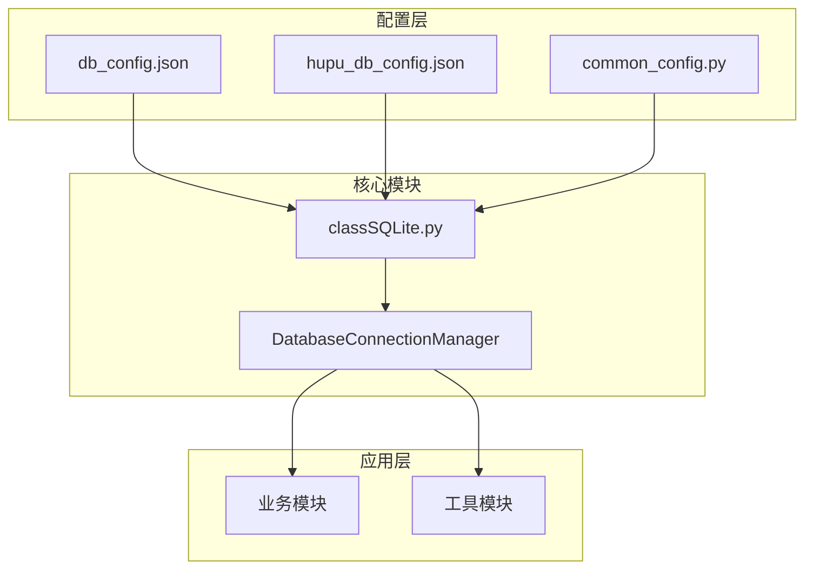
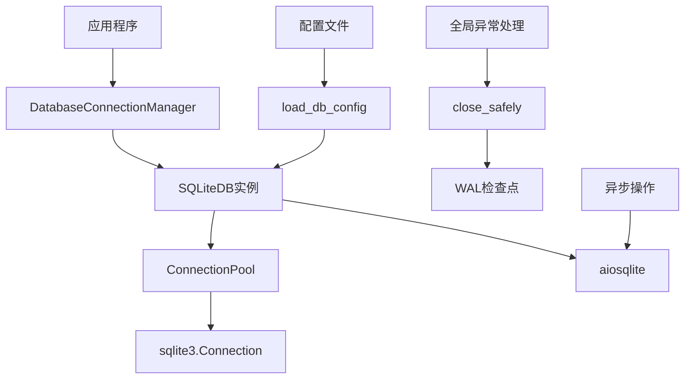
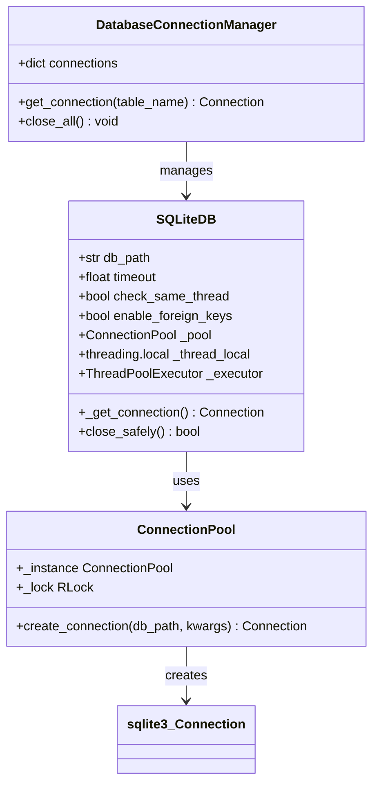
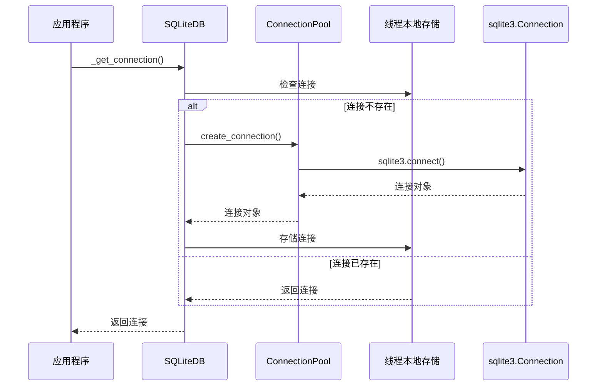
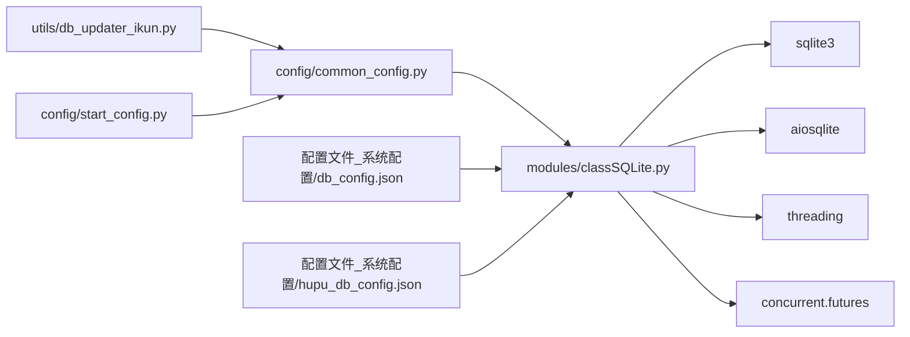
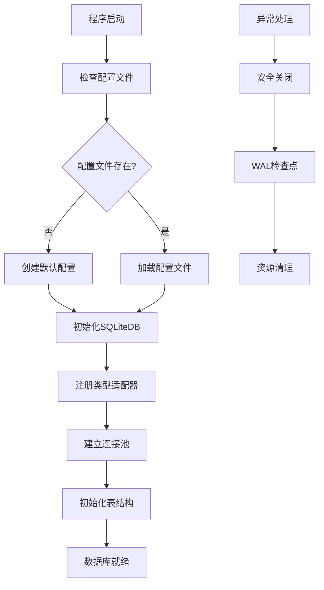
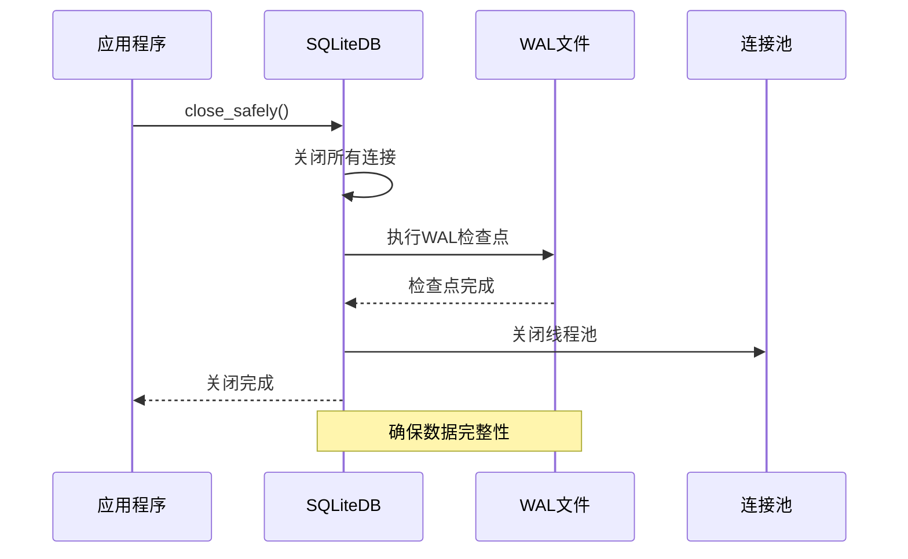

# 数据库连接配置

<cite>
**本文档引用的文件**
- [modules/classSQLite.py](file://modules/classSQLite.py)
- [config/common_config.py](file://config/common_config.py)
- [配置文件_系统配置/db_config.json](file://配置文件_系统配置/db_config.json)
- [配置文件_系统配置/hupu_db_config.json](file://配置文件_系统配置/hupu_db_config.json)
- [config/start_config.py](file://config/start_config.py)
- [utils/db_updater_ikun.py](file://utils/db_updater_ikun.py)
</cite>

## 目录
1. [简介](#简介)
2. [项目结构](#项目结构)
3. [核心组件](#核心组件)
4. [架构概览](#架构概览)
5. [详细组件分析](#详细组件分析)
6. [依赖关系分析](#依赖关系分析)
7. [性能考虑](#性能考虑)
8. [故障排除指南](#故障排除指南)
9. [结论](#结论)

## 简介

本文档详细介绍了该Python项目中的数据库连接配置，重点涵盖SQLite数据库连接参数和连接池配置。项目采用现代化的SQLite操作类，提供了完整的连接管理、事务支持、ORM风格操作等功能。

## 项目结构

该项目采用模块化的数据库架构设计：

**图表来源**
- [config/common_config.py:15-51](file://config/common_config.py#L15-L51)
- [modules/classSQLite.py:359-433](file://modules/classSQLite.py#L359-L433)

**章节来源**
- [config/common_config.py:15-51](file://config/common_config.py#L15-L51)
- [modules/classSQLite.py:359-433](file://modules/classSQLite.py#L359-L433)

## 核心组件

### SQLite数据库连接配置

项目提供了完整的SQLite数据库连接配置，包括以下核心参数：

#### 基础连接参数
- **db_path**: 数据库文件路径，支持相对路径和绝对路径
- **timeout**: 连接超时时间（秒），默认30.0秒
- **check_same_thread**: 线程检查开关，默认False
- **enable_foreign_keys**: 外键约束启用，默认True

#### 性能优化参数
- **journal_mode**: 日志模式，默认"WAL"（预写式日志）
- **cache_size**: 缓存大小（KB），默认-20000（约20MB）
- **synchronous**: 同步级别，默认"NORMAL"

#### 连接池配置
- **max_connections**: 最大连接数，默认9999
- **min_connections**: 最小连接数，默认1
- **connection_timeout**: 连接超时（秒），默认30.0
- **idle_timeout**: 空闲超时（秒），默认300.0
- **pool_recycle**: 连接回收时间（秒），默认3600
- **pool_pre_ping**: 预检查开关，默认True

**章节来源**
- [配置文件_系统配置/db_config.json:1-18](file://配置文件_系统配置/db_config.json#L1-L18)
- [config/common_config.py:157-195](file://config/common_config.py#L157-L195)
- [modules/classSQLite.py:29-39](file://modules/classSQLite.py#L29-L39)

## 架构概览

项目采用分层架构设计，实现了数据库连接的统一管理和优化：

**图表来源**
- [config/common_config.py:16-51](file://config/common_config.py#L16-L51)
- [modules/classSQLite.py:359-433](file://modules/classSQLite.py#L359-L433)
- [config/start_config.py:35-40](file://config/start_config.py#L35-L40)

## 详细组件分析

### DatabaseConnectionManager连接管理器

连接管理器负责维护不同表的数据库连接，实现连接的统一管理和复用：

**图表来源**
- [config/common_config.py:16-44](file://config/common_config.py#L16-L44)
- [modules/classSQLite.py:294-330](file://modules/classSQLite.py#L294-L330)
- [modules/classSQLite.py:359-433](file://modules/classSQLite.py#L359-L433)

### 连接池工作原理

连接池采用线程本地存储（Thread Local Storage）实现连接复用：

**图表来源**
- [modules/classSQLite.py:419-433](file://modules/classSQLite.py#L419-L433)
- [modules/classSQLite.py:305-330](file://modules/classSQLite.py#L305-L330)

### 连接配置最佳实践

#### SQLite核心参数配置

| 参数 | 默认值 | 建议值 | 说明 |
|------|--------|--------|------|
| db_path | ./配置文件_系统配置/ikun.db | 根据实际需求调整 | 支持相对路径和绝对路径 |
| timeout | 30.0秒 | 10-60秒 | 根据数据库大小和负载调整 |
| check_same_thread | False | 根据线程模型调整 | 多线程环境建议False |
| enable_foreign_keys | True | True | 建议保持启用 |

#### 性能优化参数

| 参数 | 默认值 | 建议值 | 说明 |
|------|--------|--------|------|
| journal_mode | WAL | WAL | 写入性能最佳 |
| cache_size | -20000 | -20000到-50000 | 根据内存大小调整 |
| synchronous | NORMAL | NORMAL | 平衡性能和安全性 |

#### 连接池配置

| 参数 | 默认值 | 建议范围 | 说明 |
|------|--------|----------|------|
| max_connections | 9999 | 10-100 | 根据并发需求调整 |
| min_connections | 1 | 1-5 | 保持最小连接数 |
| connection_timeout | 30.0秒 | 10-60秒 | 连接等待时间 |
| idle_timeout | 300.0秒 | 180-600秒 | 空闲连接回收时间 |
| pool_recycle | 3600秒 | 1800-7200秒 | 连接生命周期 |
| pool_pre_ping | True | True | 连接有效性检查 |

**章节来源**
- [modules/classSQLite.py:29-39](file://modules/classSQLite.py#L29-L39)
- [配置文件_系统配置/db_config.json:9-16](file://配置文件_系统配置/db_config.json#L9-L16)

## 依赖关系分析

### 模块依赖关系

**图表来源**
- [config/common_config.py:8-12](file://config/common_config.py#L8-L12)
- [modules/classSQLite.py:10-21](file://modules/classSQLite.py#L10-L21)

### 数据库初始化流程

**图表来源**
- [config/common_config.py:197-243](file://config/common_config.py#L197-L243)
- [config/start_config.py:35-40](file://config/start_config.py#L35-L40)

**章节来源**
- [config/common_config.py:197-243](file://config/common_config.py#L197-L243)
- [config/start_config.py:35-40](file://config/start_config.py#L35-L40)

## 性能考虑

### 连接复用机制

项目实现了高效的连接复用机制，通过线程本地存储避免了多线程环境下的连接竞争：

1. **线程本地存储**: 每个线程维护独立的数据库连接
2. **连接池管理**: 单例连接池确保连接的统一管理
3. **自动回收**: 空闲连接按配置自动回收
4. **预检查机制**: 连接池支持连接有效性检查

### WAL模式优势

项目默认使用WAL（Write-Ahead Logging）模式，相比传统模式具有以下优势：

- **读写分离**: 读操作不影响写操作
- **并发性能**: 提高多线程并发性能
- **崩溃恢复**: 改善数据库崩溃后的恢复能力

### 内存管理优化

- **缓存配置**: 通过cache_size参数优化内存使用
- **连接池大小**: 动态调整连接池大小适应负载变化
- **垃圾回收**: 定期清理无用连接和资源

## 故障排除指南

### 常见连接问题

#### 连接超时问题
**症状**: 操作超时，抛出OperationalError异常
**解决方案**:
1. 增加timeout参数值
2. 检查数据库文件锁定情况
3. 优化SQL查询性能

#### 线程安全问题
**症状**: 多线程环境下连接异常
**解决方案**:
1. 确保check_same_thread设置正确
2. 使用连接池而非直接共享连接
3. 避免跨线程传递连接对象

#### 外键约束问题
**症状**: 外键约束导致操作失败
**解决方案**:
1. 检查enable_foreign_keys配置
2. 确保参照完整性
3. 使用事务保证数据一致性

### 安全关闭机制

项目提供了完善的安全关闭机制：

**图表来源**
- [modules/classSQLite.py:1417-1496](file://modules/classSQLite.py#L1417-L1496)

**章节来源**
- [modules/classSQLite.py:1417-1496](file://modules/classSQLite.py#L1417-L1496)
- [config/start_config.py:35-40](file://config/start_config.py#L35-L40)

## 结论

该数据库连接配置方案提供了完整的SQLite数据库管理功能，具有以下特点：

1. **配置灵活**: 支持详细的连接参数配置
2. **性能优化**: 采用WAL模式和连接池技术
3. **线程安全**: 完善的多线程连接管理
4. **可靠性高**: 提供安全关闭和异常处理机制
5. **易于维护**: 模块化设计便于扩展和维护

通过合理配置连接参数和连接池设置，可以显著提升数据库操作的性能和稳定性。建议根据实际应用场景调整相关参数以获得最佳效果。