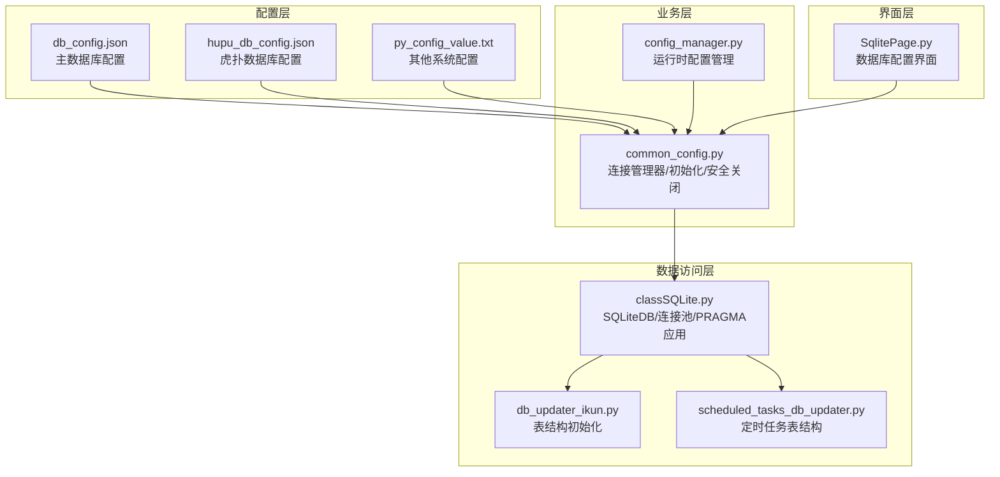
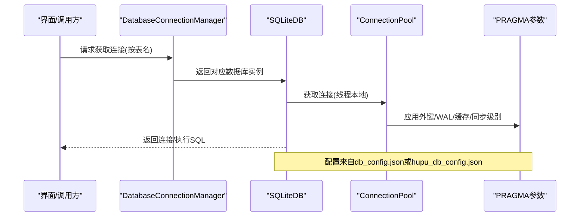
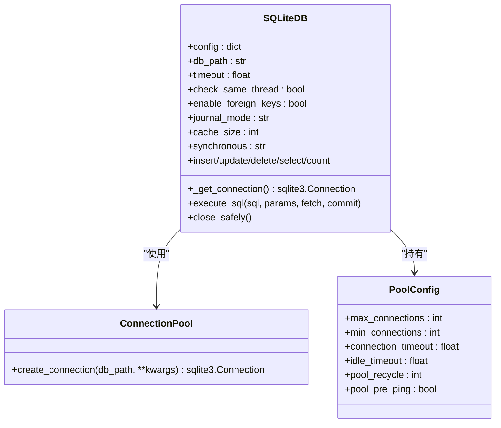
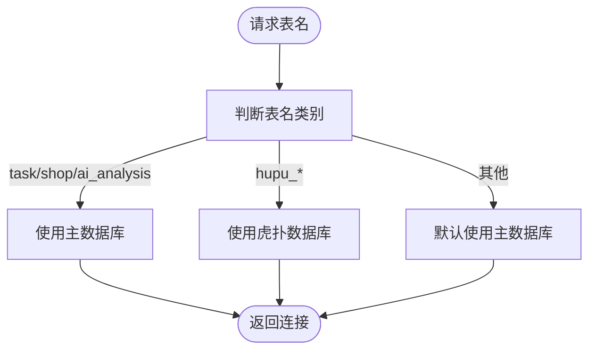
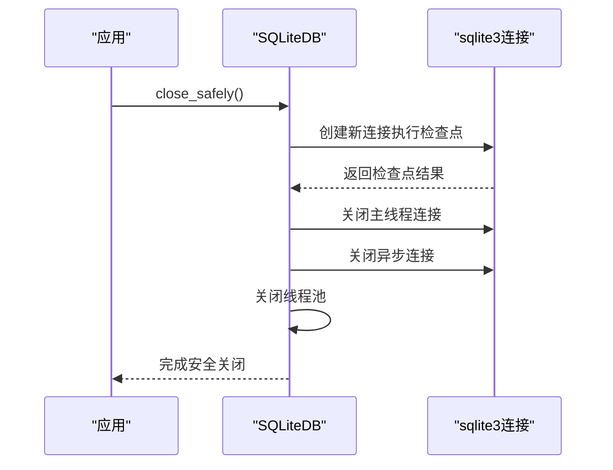
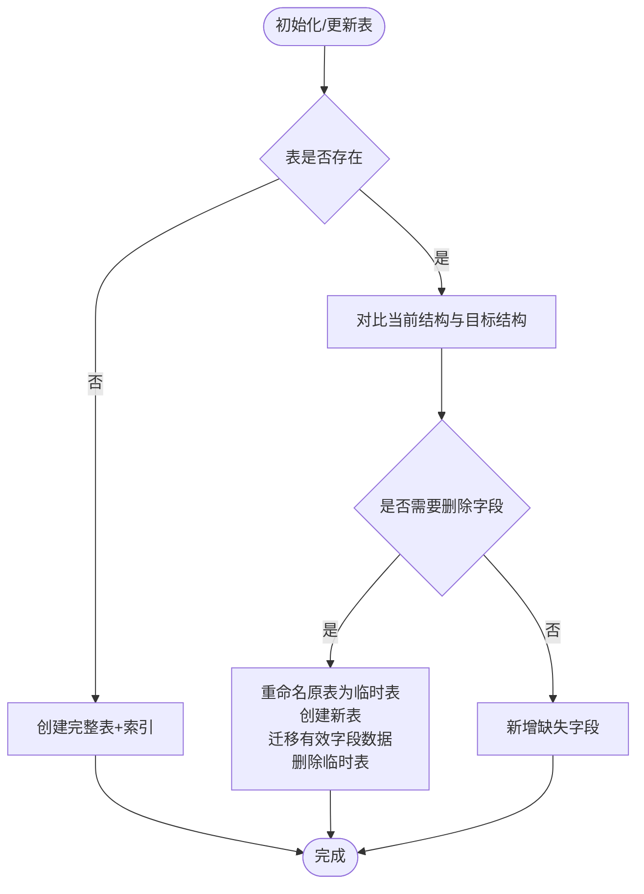
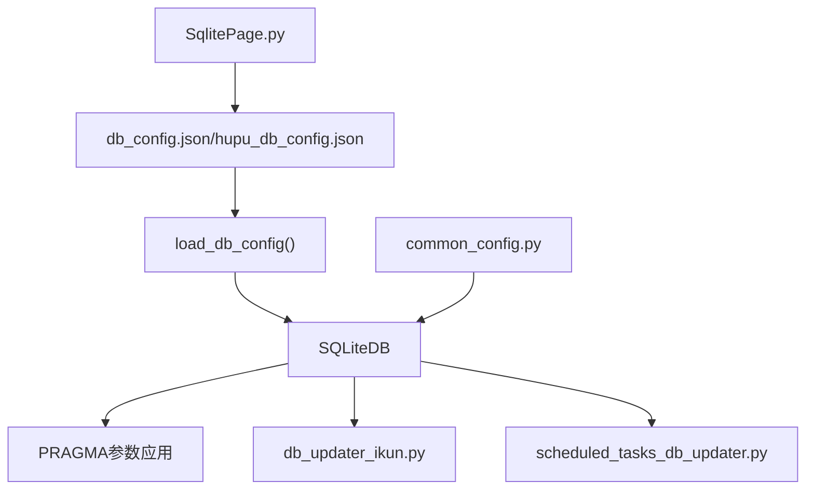

# 数据库配置

<cite>
**本文档引用的文件**
- [db_config.json](file://配置文件_系统配置/db_config.json)
- [hupu_db_config.json](file://配置文件_系统配置/hupu_db_config.json)
- [common_config.py](file://config/common_config.py)
- [classSQLite.py](file://modules/classSQLite.py)
- [config_manager.py](file://modules/config_manager.py)
- [db_updater_ikun.py](file://utils/db_updater_ikun.py)
- [scheduled_tasks_db_updater.py](file://utils/scheduled_tasks_db_updater.py)
- [SqlitePage.py](file://gui/SqlitePage.py)
- [py_config_value.txt](file://配置文件_系统配置/py_config_value.txt)
</cite>

## 目录
1. [简介](#简介)
2. [项目结构](#项目结构)
3. [核心组件](#核心组件)
4. [架构概览](#架构概览)
5. [详细组件分析](#详细组件分析)
6. [依赖关系分析](#依赖关系分析)
7. [性能考虑](#性能考虑)
8. [故障排除指南](#故障排除指南)
9. [结论](#结论)
10. [附录](#附录)

## 简介
本文件面向 ikun_temu_system 项目的数据库配置，重点解释 SQLite 数据库配置文件的结构与参数，涵盖连接池配置、性能优化参数、事务设置等。同时提供 SQLite 的 WAL 模式、缓存大小、同步级别等配置说明，以及主数据库与虎扑数据库的配置差异、连接管理与故障恢复机制、最佳实践与性能调优建议，以及常见问题的排查方法。

## 项目结构
数据库相关配置与实现主要分布在以下位置：
- 配置文件：配置文件_系统配置/db_config.json（主数据库）、配置文件_系统配置/hupu_db_config.json（虎扑数据库）
- 数据库连接与管理：config/common_config.py（连接管理器、初始化流程、安全关闭）
- 数据库封装与连接池：modules/classSQLite.py（SQLiteDB、连接池、PRAGMA 参数应用）
- 配置管理：modules/config_manager.py（运行时配置读取与热更新）
- 表结构初始化与更新：utils/db_updater_ikun.py、utils/scheduled_tasks_db_updater.py
- GUI 配置界面：gui/SqlitePage.py（可视化配置入口）

**图表来源**
- [db_config.json:1-18](file://配置文件_系统配置/db_config.json#L1-L18)
- [hupu_db_config.json:1-18](file://配置文件_系统配置/hupu_db_config.json#L1-L18)
- [common_config.py:15-51](file://config/common_config.py#L15-L51)
- [classSQLite.py:359-433](file://modules/classSQLite.py#L359-L433)
- [config_manager.py:6-20](file://modules/config_manager.py#L6-L20)
- [db_updater_ikun.py:10-70](file://utils/db_updater_ikun.py#L10-L70)
- [scheduled_tasks_db_updater.py:17-50](file://utils/scheduled_tasks_db_updater.py#L17-L50)
- [SqlitePage.py:2724-2749](file://gui/SqlitePage.py#L2724-L2749)

**章节来源**
- [db_config.json:1-18](file://配置文件_系统配置/db_config.json#L1-L18)
- [hupu_db_config.json:1-18](file://配置文件_系统配置/hupu_db_config.json#L1-L18)
- [common_config.py:15-51](file://config/common_config.py#L15-L51)
- [classSQLite.py:359-433](file://modules/classSQLite.py#L359-L433)

## 核心组件
- 数据库配置文件：db_config.json（主数据库）、hupu_db_config.json（虎扑数据库）
- 数据库连接管理器：DatabaseConnectionManager（按表名路由到不同数据库）
- SQLiteDB 封装：统一的 CRUD、事务、连接池、PRAGMA 参数应用
- 运行时配置管理：ConfigManager（从数据库读取/写入配置，支持类型转换与热更新）
- 表结构初始化与更新：db_updater_ikun.py、scheduled_tasks_db_updater.py

**章节来源**
- [common_config.py:15-51](file://config/common_config.py#L15-L51)
- [classSQLite.py:359-433](file://modules/classSQLite.py#L359-L433)
- [config_manager.py:6-20](file://modules/config_manager.py#L6-L20)
- [db_updater_ikun.py:10-70](file://utils/db_updater_ikun.py#L10-L70)
- [scheduled_tasks_db_updater.py:17-50](file://utils/scheduled_tasks_db_updater.py#L17-L50)

## 架构概览
数据库配置采用“配置文件 + 运行时封装 + 连接管理”的分层设计：
- 配置文件层：定义数据库路径、超时、线程策略、外键、WAL、缓存、同步级别、连接池参数等
- 封装层：SQLiteDB 负责加载配置、建立连接、应用 PRAGMA、提供 CRUD 与事务
- 管理层：DatabaseConnectionManager 根据表名选择数据库；安全关闭时执行 WAL 检查点
- 初始化层：通过工具脚本创建/更新表结构，确保数据库 schema 与业务需求一致

**图表来源**
- [common_config.py:16-44](file://config/common_config.py#L16-L44)
- [classSQLite.py:390-433](file://modules/classSQLite.py#L390-L433)
- [db_config.json:1-18](file://配置文件_系统配置/db_config.json#L1-L18)
- [hupu_db_config.json:1-18](file://配置文件_系统配置/hupu_db_config.json#L1-L18)

## 详细组件分析

### 数据库配置文件结构与参数
- db_path：数据库文件路径（主数据库为 ./配置文件_系统配置/ikun.db；虎扑数据库为 ./配置文件_系统配置/hupu.db）
- timeout：连接超时（秒）
- check_same_thread：是否允许跨线程使用连接
- enable_foreign_keys：启用外键约束
- journal_mode：日志模式（WAL）
- cache_size：缓存页数（负值表示以KB为单位）
- synchronous：同步级别（NORMAL）
- pool_config：连接池配置
  - max_connections：最大连接数
  - min_connections：最小连接数
  - connection_timeout：连接超时
  - idle_timeout：空闲超时
  - pool_recycle：连接回收时间
  - pool_pre_ping：连接复用前预检
- debug：调试开关

注意：主数据库与虎扑数据库配置文件内容完全一致，差异体现在 db_path。

**章节来源**
- [db_config.json:1-18](file://配置文件_系统配置/db_config.json#L1-L18)
- [hupu_db_config.json:1-18](file://配置文件_系统配置/hupu_db_config.json#L1-L18)

### SQLiteDB 类与连接池
- SQLiteDB 初始化时加载配置，注册类型适配器（JSON/DATETIME/DATE），创建线程本地连接
- ConnectionPool 为单例，按线程创建连接，应用 PRAGMA 参数（外键、WAL、缓存、同步级别）
- 支持同步/异步操作、事务、批量插入、查询构建器等

**图表来源**
- [classSQLite.py:359-433](file://modules/classSQLite.py#L359-L433)
- [classSQLite.py:294-331](file://modules/classSQLite.py#L294-L331)
- [classSQLite.py:30-40](file://modules/classSQLite.py#L30-L40)

**章节来源**
- [classSQLite.py:359-433](file://modules/classSQLite.py#L359-L433)
- [classSQLite.py:294-331](file://modules/classSQLite.py#L294-L331)
- [classSQLite.py:30-40](file://modules/classSQLite.py#L30-L40)

### 连接管理与路由
- DatabaseConnectionManager 根据表名将请求路由到主数据库或虎扑数据库
- 默认回退为主数据库，保证兼容性

**图表来源**
- [common_config.py:16-44](file://config/common_config.py#L16-L44)

**章节来源**
- [common_config.py:16-44](file://config/common_config.py#L16-L44)

### 安全关闭与 WAL 检查点
- 安全关闭流程：执行 WAL 检查点（TRUNCATE 模式合并 WAL 文件）、关闭主线程连接、关闭异步连接、关闭线程池
- 通过 PRAGMA wal_checkpoint(TRUNCATE) 确保 WAL 与主数据库文件合并，降低文件损坏风险

**图表来源**
- [common_config.py:59-135](file://config/common_config.py#L59-L135)
- [classSQLite.py:1448-1492](file://modules/classSQLite.py#L1448-L1492)

**章节来源**
- [common_config.py:59-135](file://config/common_config.py#L59-L135)
- [classSQLite.py:1448-1492](file://modules/classSQLite.py#L1448-L1492)

### 表结构初始化与更新
- db_updater_ikun.py：通用表结构更新函数，支持字段新增、索引创建、重建表（保留有效字段）
- scheduled_tasks_db_updater.py：定时任务表结构更新，包含索引与可选外键约束

**图表来源**
- [db_updater_ikun.py:10-148](file://utils/db_updater_ikun.py#L10-L148)
- [scheduled_tasks_db_updater.py:17-161](file://utils/scheduled_tasks_db_updater.py#L17-L161)

**章节来源**
- [db_updater_ikun.py:10-148](file://utils/db_updater_ikun.py#L10-L148)
- [scheduled_tasks_db_updater.py:17-161](file://utils/scheduled_tasks_db_updater.py#L17-L161)

### 运行时配置管理
- ConfigManager 支持从数据库读取配置、类型自动转换、热更新
- 常用于并发控制、路径配置等运行期参数

**章节来源**
- [config_manager.py:6-20](file://modules/config_manager.py#L6-L20)
- [config_manager.py:154-189](file://modules/config_manager.py#L154-L189)

## 依赖关系分析
- 配置文件被 SQLiteDB 加载，PRAGMA 参数在连接创建时应用
- DatabaseConnectionManager 依赖全局 db/hupu_db 实例
- 表结构初始化依赖 SQLiteDB 的 execute_sql 能力
- GUI 层提供配置文件创建与默认值填充

**图表来源**
- [classSQLite.py:66-103](file://modules/classSQLite.py#L66-L103)
- [common_config.py:15-51](file://config/common_config.py#L15-L51)
- [db_updater_ikun.py:10-70](file://utils/db_updater_ikun.py#L10-L70)
- [scheduled_tasks_db_updater.py:17-50](file://utils/scheduled_tasks_db_updater.py#L17-L50)
- [SqlitePage.py:2724-2749](file://gui/SqlitePage.py#L2724-L2749)

**章节来源**
- [classSQLite.py:66-103](file://modules/classSQLite.py#L66-L103)
- [common_config.py:15-51](file://config/common_config.py#L15-L51)
- [SqlitePage.py:2724-2749](file://gui/SqlitePage.py#L2724-L2749)

## 性能考虑
- WAL 模式：提升并发读写性能，减少锁竞争
- 缓存大小：通过 cache_size 调整内存缓存页数，负值以 KB 为单位
- 同步级别：synchronous=NORMAL 平衡性能与安全性
- 连接池：max_connections、min_connections、idle_timeout、pool_recycle、pool_pre_ping 控制连接生命周期与复用
- 批量写入：insert_many 支持批量插入，降低事务开销
- 索引：合理创建索引，配合表结构更新工具维护

[本节为通用性能指导，不直接分析具体文件]

## 故障排除指南
- 数据库无法关闭/文件损坏
  - 现象：关闭时报错或 WAL 文件异常
  - 处理：使用安全关闭流程，确保执行 WAL 检查点后再关闭
  - 参考：安全关闭实现与 WAL 检查点逻辑
- 配置文件编码问题
  - 现象：配置文件读取异常或乱码
  - 处理：load_db_config 已内置编码检测与兜底读取
- 连接超时/死锁
  - 现象：SQL 执行超时
  - 处理：调整 timeout、合理使用连接池参数、避免长事务
- 表结构变更失败
  - 现象：字段删除/重建导致数据丢失
  - 处理：使用表结构更新工具，必要时开启确认模式或备份数据
- GUI 配置未生效
  - 现象：界面创建配置后未使用
  - 处理：确认配置文件路径与权限，重启应用使配置生效

**章节来源**
- [common_config.py:59-135](file://config/common_config.py#L59-L135)
- [classSQLite.py:66-103](file://modules/classSQLite.py#L66-L103)
- [db_updater_ikun.py:70-148](file://utils/db_updater_ikun.py#L70-L148)
- [SqlitePage.py:2724-2749](file://gui/SqlitePage.py#L2724-L2749)

## 结论
本项目的数据库配置采用集中式 JSON 配置 + 封装化的 SQLiteDB + 连接管理器的架构，既保证了灵活性（可针对不同表路由到不同数据库），又提供了完善的性能与可靠性保障（WAL、PRAGMA 参数、连接池、安全关闭）。通过表结构更新工具与运行时配置管理，系统具备良好的可维护性与扩展性。

[本节为总结性内容，不直接分析具体文件]

## 附录

### 主数据库与虎扑数据库配置差异
- 配置文件内容一致，仅 db_path 不同
- 主数据库：./配置文件_系统配置/ikun.db
- 虎扑数据库：./配置文件_系统配置/hupu.db
- 路由规则：按表名分类，虎扑相关表走虎扑数据库，其余走主数据库

**章节来源**
- [db_config.json:1-18](file://配置文件_系统配置/db_config.json#L1-L18)
- [hupu_db_config.json:1-18](file://配置文件_系统配置/hupu_db_config.json#L1-L18)
- [common_config.py:16-44](file://config/common_config.py#L16-L44)

### SQLite 关键 PRAGMA 参数说明
- foreign_keys：启用外键约束，保证参照完整性
- journal_mode=WAL：使用预写式日志，提高并发读写性能
- cache_size：调整缓存页数，影响内存占用与 I/O 性能
- synchronous=NORMAL：平衡性能与安全性，适合大多数场景

**章节来源**
- [classSQLite.py:305-329](file://modules/classSQLite.py#L305-L329)
- [db_config.json:1-18](file://配置文件_系统配置/db_config.json#L1-L18)
- [hupu_db_config.json:1-18](file://配置文件_系统配置/hupu_db_config.json#L1-L18)

### 连接池参数建议
- max_connections：根据并发需求设置，过高可能导致资源争用
- min_connections：保持少量连接以减少频繁创建
- connection_timeout/idle_timeout：平衡响应与资源占用
- pool_recycle：定期回收连接，避免长时间占用导致状态异常
- pool_pre_ping：启用预检，提升连接可用性

**章节来源**
- [db_config.json:9-16](file://配置文件_系统配置/db_config.json#L9-L16)
- [hupu_db_config.json:9-16](file://配置文件_系统配置/hupu_db_config.json#L9-L16)
- [classSQLite.py:30-40](file://modules/classSQLite.py#L30-L40)