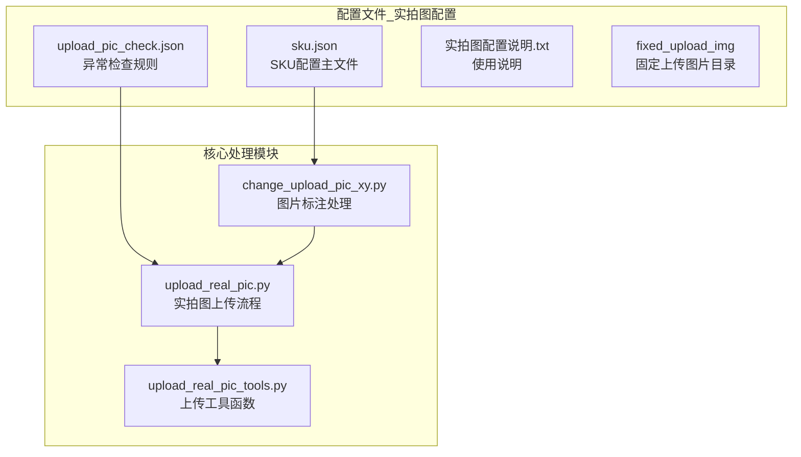
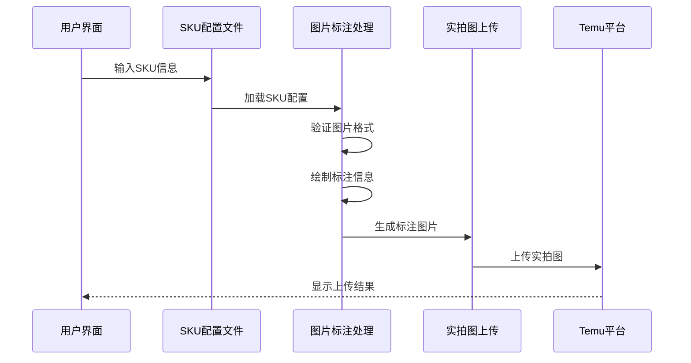
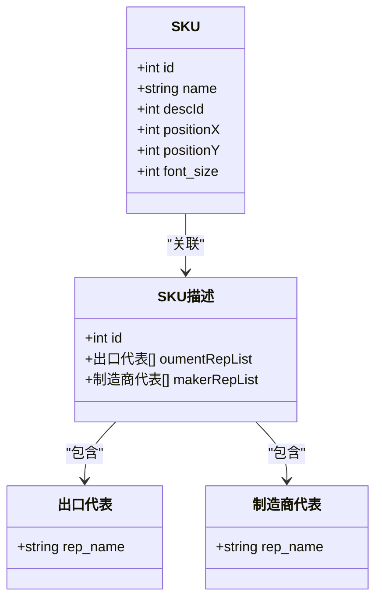
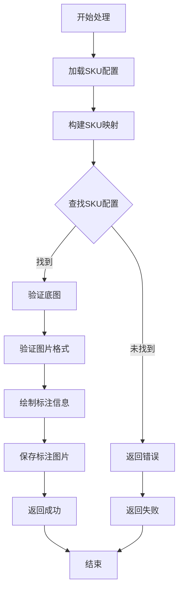
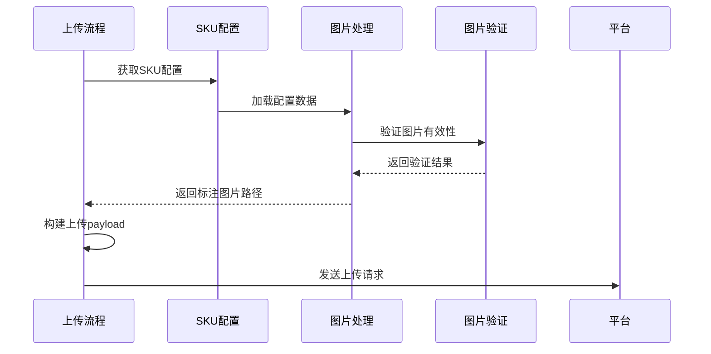
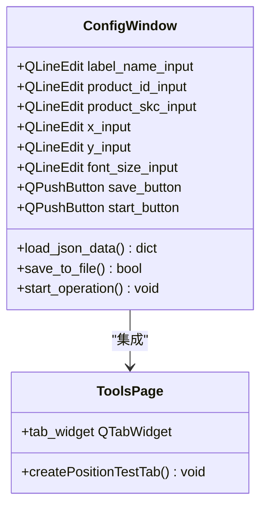
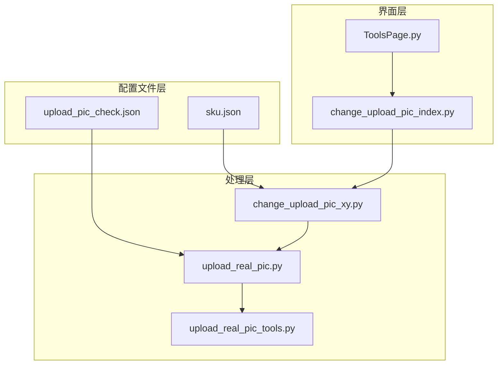

# SKU配置文件

<cite>
**本文档引用的文件**
- [sku.json](file://配置文件_实拍图配置/sku.json)
- [upload_pic_check.json](file://配置文件_实拍图配置/upload_pic_check.json)
- [实拍图配置说明.txt](file://配置文件_实拍图配置/实拍图配置说明.txt)
- [change_upload_pic_xy.py](file://lite_modules/change_upload_pic_xy.py)
- [change_upload_pic_index.py](file://gui/change_upload_pic_index.py)
- [upload_real_pic.py](file://temu_modules/temu_function/upload_real_pic.py)
- [upload_real_pic_tools.py](file://temu_modules/temu_modules_tools/upload_real_pic_tools.py)
- [ToolsPage.py](file://gui/ToolsPage.py)
</cite>

## 目录
1. [简介](#简介)
2. [项目结构](#项目结构)
3. [核心组件](#核心组件)
4. [架构概览](#架构概览)
5. [详细组件分析](#详细组件分析)
6. [依赖关系分析](#依赖关系分析)
7. [性能考虑](#性能考虑)
8. [故障排除指南](#故障排除指南)
9. [结论](#结论)

## 简介
SKU配置文件是实拍图上传功能的核心配置文件，负责定义不同SKU在实拍图中的标注位置、字体大小以及相关的描述信息。该文件直接影响Temu平台商品实拍图的自动化处理流程，确保商品标签能够准确地叠加到相应的图片上。

## 项目结构
配置文件位于`配置文件_实拍图配置`目录下，包含以下关键文件：
- `sku.json`: 主要的SKU配置文件
- `upload_pic_check.json`: 上传图片检查规则配置
- `实拍图配置说明.txt`: 配置文件使用说明

**图表来源**
- [sku.json:1-338](file://配置文件_实拍图配置/sku.json#L1-L338)
- [upload_pic_check.json:1-48](file://配置文件_实拍图配置/upload_pic_check.json#L1-L48)

**章节来源**
- [实拍图配置说明.txt:1-3](file://配置文件_实拍图配置/实拍图配置说明.txt#L1-L3)

## 核心组件
SKU配置文件主要包含两个核心部分：

### SKU基本信息配置
每个SKU条目包含以下字段：
- `id`: SKU唯一标识符（整数）
- `name`: SKU名称（字符串，支持大小写不敏感匹配）
- `descId`: 描述信息关联ID（整数，关联到skuDescList中的描述项）
- `positionX`: X轴标注位置（整数，像素坐标）
- `positionY`: Y轴标注位置（整数，像素坐标）
- `font_size`: 字体大小（整数，像素点）

### SKU描述列表配置
描述列表包含品牌和制造商相关信息：
- `id`: 描述项唯一标识符
- `oumentRepList`: 出口代表信息列表
- `makerRepList`: 制造商代表信息列表

**章节来源**
- [sku.json:1-338](file://配置文件_实拍图配置/sku.json#L1-L338)

## 架构概览
SKU配置文件在整个实拍图上传系统中扮演着关键角色，通过以下流程实现完整的自动化处理：

**图表来源**
- [change_upload_pic_xy.py:118-203](file://lite_modules/change_upload_pic_xy.py#L118-L203)
- [upload_real_pic.py:427-456](file://temu_modules/temu_function/upload_real_pic.py#L427-L456)

## 详细组件分析

### SKU配置文件结构分析

#### 基本信息字段详解
每个SKU条目的基本信息字段具有特定的作用和约束：

**图表来源**
- [sku.json:3-10](file://配置文件_实拍图配置/sku.json#L3-L10)
- [sku.json:180-193](file://配置文件_实拍图配置/sku.json#L180-L193)

#### 字段取值范围和约束
- `id`: 正整数，建议连续递增，避免重复
- `name`: 字符串，建议使用SKU的标准化名称
- `descId`: 正整数，必须与skuDescList中的id匹配
- `positionX`和`positionY`: 整数，通常为正数，表示像素坐标
- `font_size`: 正整数，建议在12-48之间

**章节来源**
- [sku.json:1-338](file://配置文件_实拍图配置/sku.json#L1-L338)

### 图片标注处理流程

#### 核心处理逻辑
图片标注处理模块负责将SKU信息绘制到底图上：

**图表来源**
- [change_upload_pic_xy.py:118-203](file://lite_modules/change_upload_pic_xy.py#L118-L203)

#### 图片验证机制
系统包含多层次的图片验证机制：

1. **文件存在性检查**: 确保底图文件存在
2. **文件完整性检查**: 验证图片文件是否损坏
3. **格式兼容性检查**: 自动转换不支持的图片格式
4. **尺寸合理性检查**: 验证图片尺寸是否合理

**章节来源**
- [change_upload_pic_xy.py:27-64](file://lite_modules/change_upload_pic_xy.py#L27-L64)

### 实拍图上传集成

#### 上传流程集成
SKU配置与实拍图上传流程的集成点：

**图表来源**
- [upload_real_pic.py:427-456](file://temu_modules/temu_function/upload_real_pic.py#L427-L456)
- [upload_real_pic_tools.py:85-127](file://temu_modules/temu_modules_tools/upload_real_pic_tools.py#L85-L127)

**章节来源**
- [upload_real_pic.py:427-456](file://temu_modules/temu_function/upload_real_pic.py#L427-L456)

### 可视化配置工具

#### GUI配置界面
系统提供了可视化的SKU配置工具：

**图表来源**
- [change_upload_pic_index.py:19-95](file://gui/change_upload_pic_index.py#L19-L95)
- [ToolsPage.py:199-200](file://gui/ToolsPage.py#L199-L200)

**章节来源**
- [change_upload_pic_index.py:184-223](file://gui/change_upload_pic_index.py#L184-L223)

## 依赖关系分析

### 模块间依赖关系

**图表来源**
- [change_upload_pic_xy.py:1-10](file://lite_modules/change_upload_pic_xy.py#L1-L10)
- [upload_real_pic.py:15-27](file://temu_modules/temu_function/upload_real_pic.py#L15-L27)

### 外部依赖
- **Pillow库**: 图片处理和绘制
- **PyQt5**: GUI界面框架
- **requests**: HTTP请求处理
- **loguru**: 日志记录

**章节来源**
- [change_upload_pic_xy.py:1-10](file://lite_modules/change_upload_pic_xy.py#L1-L10)
- [upload_real_pic.py:1-27](file://temu_modules/temu_function/upload_real_pic.py#L1-L27)

## 性能考虑
- **并发处理**: 支持多线程并行处理多个SKU
- **内存优化**: 使用生成器和流式处理减少内存占用
- **缓存机制**: 配置文件缓存避免重复读取
- **异步处理**: 图片上传采用异步方式提高效率

## 故障排除指南

### 常见错误及解决方案

#### SKU配置错误
- **错误**: SKU名称不匹配
  - **原因**: SKU名称大小写不一致或不存在
  - **解决方案**: 确保SKU名称与配置文件中的name字段完全匹配

- **错误**: 坐标超出图片边界
  - **原因**: positionX或positionY值过大
  - **解决方案**: 调整坐标值确保在图片范围内

#### 图片处理错误
- **错误**: 图片格式不支持
  - **原因**: 底图格式不受支持
  - **解决方案**: 系统会自动转换为JPG格式

- **错误**: 图片损坏
  - **原因**: 底图文件损坏或为空
  - **解决方案**: 检查底图文件完整性

#### 上传错误
- **错误**: 登录失效
  - **原因**: Cookie过期或无效
  - **解决方案**: 重新登录获取新的Cookie

**章节来源**
- [change_upload_pic_xy.py:160-163](file://lite_modules/change_upload_pic_xy.py#L160-L163)
- [upload_real_pic.py:629-635](file://temu_modules/temu_function/upload_real_pic.py#L629-L635)

### 调试技巧
1. **启用详细日志**: 查看系统日志了解具体错误信息
2. **使用可视化工具**: 通过GUI界面测试SKU配置
3. **分步调试**: 逐步验证每个配置项的有效性
4. **单元测试**: 编写测试用例验证配置文件格式

## 结论
SKU配置文件是实拍图上传系统的核心组件，通过精确的配置管理实现了商品标签的自动化处理。系统提供了完善的验证机制、错误处理和可视化工具，确保配置的准确性和可靠性。建议定期维护和更新配置文件，建立完善的备份机制，以确保系统的稳定运行。