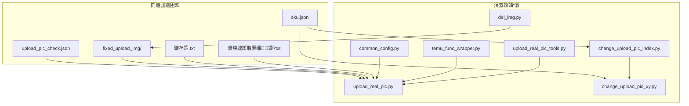
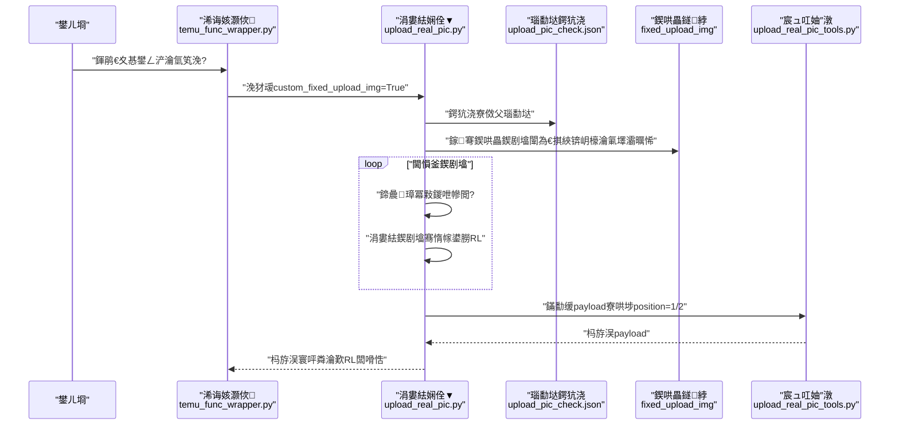
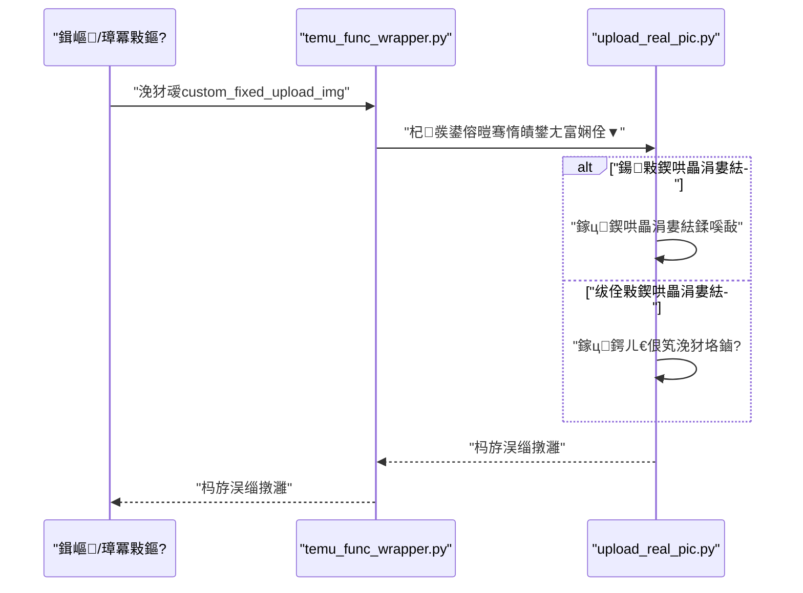
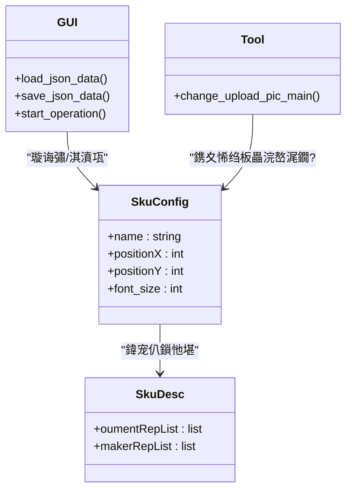
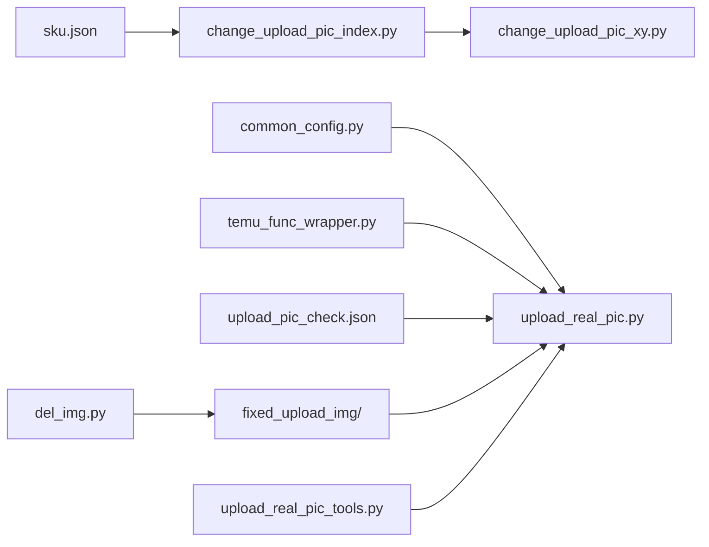

# 鍥哄畾涓婁紶閰嶇疆

<cite>
**鏈枃寮曠敤鐨勬枃浠?*
- [upload_real_pic.py](file://temu_modules/temu_function/upload_real_pic.py)
- [upload_real_pic_tools.py](file://temu_modules/temu_modules_tools/upload_real_pic_tools.py)
- [common_config.py](file://config/common_config.py)
- [temu_func_wrapper.py](file://temu_modules/temu_func_wrapper.py)
- [change_upload_pic_index.py](file://gui/change_upload_pic_index.py)
- [change_upload_pic_xy.py](file://lite_modules/change_upload_pic_xy.py)
- [del_img.py](file://lite_modules/del_img.py)
- [upload_pic_check.json](file://閰嶇疆鏂囦欢_瀹炴媿鍥鹃厤缃?upload_pic_check.json)
- [sku.json](file://閰嶇疆鏂囦欢_瀹炴媿鍥鹃厤缃?sku.json)
- [璇存槑.txt](file://閰嶇疆鏂囦欢_瀹炴媿鍥鹃厤缃?fixed_upload_img/璇存槑.txt)
- [瀹炴媿鍥鹃厤缃鏄?txt](file://閰嶇疆鏂囦欢_瀹炴媿鍥鹃厤缃?瀹炴媿鍥鹃厤缃鏄?txt)
</cite>

## 鐩綍
1. [绠€浠媇(#绠€浠?
2. [椤圭洰缁撴瀯](#椤圭洰缁撴瀯)
3. [鏍稿績缁勪欢](#鏍稿績缁勪欢)
4. [鏋舵瀯鎬昏](#鏋舵瀯鎬昏)
5. [璇︾粏缁勪欢鍒嗘瀽](#璇︾粏缁勪欢鍒嗘瀽)
6. [渚濊禆鍏崇郴鍒嗘瀽](#渚濊禆鍏崇郴鍒嗘瀽)
7. [鎬ц兘鑰冮噺](#鎬ц兘鑰冮噺)
8. [鏁呴殰鎺掓煡鎸囧崡](#鏁呴殰鎺掓煡鎸囧崡)
9. [缁撹](#缁撹)
10. [闄勫綍](#闄勫綍)

## 绠€浠?鏈枃浠跺洿缁曗€滃浐瀹氫笂浼犻厤缃€濆睍寮€锛岀郴缁熸€ц鏄庡浐瀹氫笂浼犲浘鐗囬厤缃殑浣滅敤銆佸懡鍚嶈鍒欍€佷笂浼犺矾寰勩€佹壒閲忓鐞嗘満鍒朵笌鏈€浣冲疄璺点€傚悓鏃跺姣斿浐瀹氫笂浼犱笌鍔ㄦ€佷笂浼犵殑宸紓锛岀粰鍑洪€夋嫨寤鸿锛屽苟璇勪及鍏跺绯荤粺鎬ц兘鐨勫奖鍝嶃€傚浐瀹氫笂浼犻€氳繃棰勭疆鍥剧墖涓庤鍒欐枃浠讹紝瀹炵幇瀵圭壒瀹氬紓甯哥被鍨嬬殑鏍囧噯鍖栬ˉ浼犱笌鍚堣淇℃伅鐨勬壒閲忕粦瀹氾紝鎻愬崌涓婁紶鏁堢巼涓庝竴鑷存€с€?
## 椤圭洰缁撴瀯
鍥哄畾涓婁紶鐩稿叧鐨勬牳蹇冧綅缃泦涓湪鈥滈厤缃枃浠禵瀹炴媿鍥鹃厤缃€濈洰褰曞強鍏跺叧鑱旀ā鍧椾腑锛?- 閰嶇疆鏂囦欢鐩綍
  - upload_pic_check.json锛氬紓甯歌鍒欎笌瀵瑰簲鍥剧墖鍚嶇О鏄犲皠
  - sku.json锛歋KU鍧愭爣涓庡瓧浣撻厤缃?  - fixed_upload_img/锛氬浐瀹氫笂浼犲浘鐗囩洰褰曪紙璇存槑.txt锛?  - 瀹炴媿鍥鹃厤缃鏄?txt锛氭暣浣撻厤缃鏄?- 涓氬姟妯″潡
  - temu_modules/temu_function/upload_real_pic.py锛氬疄鎷嶅浘涓婁紶涓绘祦绋嬶紝鍖呭惈鍥哄畾涓婁紶涓庡姩鎬佷笂浼犵殑缁勫悎绛栫暐
  - temu_modules/temu_modules_tools/upload_real_pic_tools.py锛氭瀯寤轰笂浼爌ayload銆佹彁鍙栦笌鏍￠獙鏁版嵁
  - config/common_config.py锛氬叏灞€骞跺彂涓庤矾寰勯厤缃?  - temu_modules/temu_func_wrapper.py锛氫换鍔″皝瑁咃紝鏆撮湶custom_fixed_upload_img寮€鍏?  - gui/change_upload_pic_index.py锛歋KU鍧愭爣鍙鍖栭厤缃晫闈?  - lite_modules/change_upload_pic_xy.py锛氭牴鎹甋KU鍚嶇О瀹氫綅鍥剧墖骞剁敓鎴愭爣娉ㄥ浘
  - lite_modules/del_img.py锛氬浘鐗囪矾寰勬壂鎻忎笌娓呯悊宸ュ叿锛堝惈鍥哄畾涓婁紶鐩綍鎵弿锛?


**鍥捐〃鏉ユ簮**
- [upload_real_pic.py:113-124](file://temu_modules/temu_function/upload_real_pic.py#L113-L124)
- [upload_real_pic_tools.py:85-127](file://temu_modules/temu_modules_tools/upload_real_pic_tools.py#L85-L127)
- [common_config.py:154-154](file://config/common_config.py#L154-L154)
- [temu_func_wrapper.py:60-91](file://temu_modules/temu_func_wrapper.py#L60-L91)
- [change_upload_pic_index.py:19-24](file://gui/change_upload_pic_index.py#L19-L24)
- [change_upload_pic_xy.py:118-135](file://lite_modules/change_upload_pic_xy.py#L118-L135)
- [del_img.py:10-46](file://lite_modules/del_img.py#L10-L46)

**绔犺妭鏉ユ簮**
- [upload_pic_check.json:1-48](file://閰嶇疆鏂囦欢_瀹炴媿鍥鹃厤缃?upload_pic_check.json#L1-L48)
- [sku.json:1-338](file://閰嶇疆鏂囦欢_瀹炴媿鍥鹃厤缃?sku.json#L1-L338)
- [璇存槑.txt:1-1](file://閰嶇疆鏂囦欢_瀹炴媿鍥鹃厤缃?fixed_upload_img/璇存槑.txt#L1-L1)
- [瀹炴媿鍥鹃厤缃鏄?txt:1-3](file://閰嶇疆鏂囦欢_瀹炴媿鍥鹃厤缃?瀹炴媿鍥鹃厤缃鏄?txt#L1-L3)

## 鏍稿績缁勪欢
- 鍥哄畾涓婁紶瑙勫垯鍔犺浇涓庡尮閰?  - 閫氳繃鍔犺浇upload_pic_check.json锛屽皢check_type鏄犲皠鍒板浐瀹氬浘鐗囧悕绉帮紝鍐嶆嫾鎺ヨ嚦閰嶇疆鐩綍璺緞杩涜涓婁紶
  - 閲囩敤鈥滃崟娆¤皟鐢ㄥ唴鍘婚噸鈥濈殑绛栫暐锛岄伩鍏嶅悓涓€鏂囦欢璺緞閲嶅涓婁紶
- 鍥哄畾涓婁紶鍥剧墖鎵归噺澶勭悊
  - 浠巉ixed_upload_img鐩綍鎵弿鍥剧墖锛堟敮鎸佹墿灞曞悕杩囨护涓庨潪閫掑綊锛夛紝閫愪釜涓婁紶骞舵敹闆哢RL
- 浠诲姟灏佽涓庡紑鍏?  - 閫氳繃temu_func_wrapper鐨刢ustom_fixed_upload_img鍙傛暟鎺у埗鏄惁鍚敤鍥哄畾涓婁紶
- 鏁版嵁鏋勫缓涓庢牎楠?  - upload_real_pic_tools璐熻矗鏋勫缓涓婁紶payload锛屽己鍒秔osition=1涓巔osition=2鍚勮嚦灏戜竴寮犲浘锛岀‘淇濆钩鍙版帴鍙ｈ姹傛弧瓒?- 閰嶇疆涓庡彲瑙嗗寲
  - sku.json鎻愪緵SKU鍧愭爣涓庡瓧浣撻厤缃紱GUI鐣岄潰鏀寔杈撳叆涓庝繚瀛橈紱宸ュ叿妯″潡鏀寔鎸塖KU鍚嶇О瀹氫綅鍥剧墖

**绔犺妭鏉ユ簮**
- [upload_real_pic.py:113-124](file://temu_modules/temu_function/upload_real_pic.py#L113-L124)
- [upload_real_pic.py:320-359](file://temu_modules/temu_function/upload_real_pic.py#L320-L359)
- [upload_real_pic.py:362-386](file://temu_modules/temu_function/upload_real_pic.py#L362-L386)
- [upload_real_pic_tools.py:85-127](file://temu_modules/temu_modules_tools/upload_real_pic_tools.py#L85-L127)
- [temu_func_wrapper.py:60-91](file://temu_modules/temu_func_wrapper.py#L60-L91)
- [sku.json:1-338](file://閰嶇疆鏂囦欢_瀹炴媿鍥鹃厤缃?sku.json#L1-L338)
- [change_upload_pic_index.py:19-24](file://gui/change_upload_pic_index.py#L19-L24)

## 鏋舵瀯鎬昏
鍥哄畾涓婁紶鍦ㄦ暣浣撴祦绋嬩腑鐨勪綅缃涓嬶細
- 瑙﹀彂鏉′欢锛氱敤鎴峰湪浠诲姟灏佽涓嬀閫塩ustom_fixed_upload_img
- 瑙勫垯鍖归厤锛氭牴鎹紓甯哥被鍨嬩粠upload_pic_check.json鏄犲皠鍒板浐瀹氬浘鐗囧悕绉?- 鍥剧墖鎵弿锛氫粠fixed_upload_img鐩綍鎵弿鍥剧墖锛堥潪閫掑綊锛岄檺瀹歱ng/jpg锛?- 涓婁紶涓庡幓閲嶏細閫愪釜涓婁紶骞惰褰曞凡澶勭悊璺緞锛岄伩鍏嶉噸澶?- 鏁版嵁鏋勫缓锛氬皢涓婁紶寰楀埌鐨刄RL鎸塸osition=1/2寮哄埗缁戝畾鍒癝KU鍒楄〃
- 杩斿洖缁撴灉锛氳繑鍥炲緟缁戝畾鍥剧墖URL闆嗗悎锛屼緵鍚庣画鎻愪氦



**鍥捐〃鏉ユ簮**
- [temu_func_wrapper.py:60-91](file://temu_modules/temu_func_wrapper.py#L60-L91)
- [upload_real_pic.py:113-124](file://temu_modules/temu_function/upload_real_pic.py#L113-L124)
- [upload_real_pic.py:362-386](file://temu_modules/temu_function/upload_real_pic.py#L362-L386)
- [upload_real_pic_tools.py:85-127](file://temu_modules/temu_modules_tools/upload_real_pic_tools.py#L85-L127)

## 璇︾粏缁勪欢鍒嗘瀽

### 鍥哄畾涓婁紶瑙勫垯涓庡懡鍚嶈鍒?- 瑙勫垯鏂囦欢锛歶pload_pic_check.json
  - 瀛楁缁撴瀯锛歛bnormal_rules鏁扮粍锛屾瘡椤瑰寘鍚玦mage_name銆乸rimary.check_type銆乸rimary.rule_status銆乫allback.rule_name銆乫allback.rule_status_toast
  - 浣滅敤锛氬皢check_type鏄犲皠鍒板浐瀹氬浘鐗囨枃浠跺悕锛屼究浜庢寜寮傚父绫诲瀷鑷姩涓婁紶瀵瑰簲鍥剧墖
- 鍛藉悕瑙勫垯
  - 鍥哄畾鍥剧墖鏂囦欢鍚嶅簲涓庤鍒欎腑鐨刬mage_name涓€鑷?  - 涓婁紶鏃朵細灏唅mage_name鎷兼帴鍒伴厤缃洰褰曡矾寰勪笅杩涜璁块棶
- 鍘婚噸绛栫暐
  - 鍦ㄥ崟娆″嚱鏁拌皟鐢ㄥ唴锛屼娇鐢ㄩ泦鍚堣褰曞凡澶勭悊鐨勬枃浠惰矾寰勶紝閬垮厤閲嶅涓婁紶鍚屼竴鏂囦欢

```mermaid
flowchart TD
Start(["寮€濮?]) --> LoadRules["鍔犺浇upload_pic_check.json"]
LoadRules --> IterateTypes["閬嶅巻寮傚父绫诲瀷鍒楄〃"]
IterateTypes --> MapName["鏍规嵁check_type鏄犲皠image_name"]
MapName --> BuildPath["鎷兼帴鍥哄畾鍥剧墖璺緞"]
BuildPath --> Dedup{"鏄惁宸插鐞嗭紵"}
Dedup --> |鏄瘄 NextType["涓嬩竴涓被鍨?]
Dedup --> |鍚 Upload["涓婁紶鍥剧墖骞惰幏鍙朥RL"]
Upload --> Record["璁板綍宸插鐞嗚矾寰?]
Record --> NextType
NextType --> Done(["缁撴潫"])
```

**鍥捐〃鏉ユ簮**
- [upload_real_pic.py:113-124](file://temu_modules/temu_function/upload_real_pic.py#L113-L124)
- [upload_real_pic.py:320-359](file://temu_modules/temu_function/upload_real_pic.py#L320-L359)

**绔犺妭鏉ユ簮**
- [upload_pic_check.json:1-48](file://閰嶇疆鏂囦欢_瀹炴媿鍥鹃厤缃?upload_pic_check.json#L1-L48)
- [upload_real_pic.py:113-124](file://temu_modules/temu_function/upload_real_pic.py#L113-L124)
- [upload_real_pic.py:320-359](file://temu_modules/temu_function/upload_real_pic.py#L320-L359)

### 鍥哄畾涓婁紶鍥剧墖鎵归噺澶勭悊
- 鐩綍涓庢壂鎻?  - 鐩綍锛氶厤缃枃浠禵瀹炴媿鍥鹃厤缃?fixed_upload_img
  - 鎵弿绛栫暐锛氶潪閫掑綊锛岄檺瀹氭墿灞曞悕涓?png/.jpg
  - 宸ュ叿锛歡et_all_img_paths_advanced鎻愪緵缁熶竴鎵弿鑳藉姏
- 涓婁紶娴佺▼
  - 瀵规瘡涓壂鎻忓埌鐨勫浘鐗囷紝璋冪敤涓婁紶灏佽骞舵敹闆哢RL
  - 杩斿洖URL鍒楄〃渚涘悗缁粦瀹?
```mermaid
flowchart TD
S(["寮€濮?]) --> Scan["鎵弿fixed_upload_img鐩綍闈為€掑綊锛岄檺瀹氭墿灞曞悕"]
Scan --> HasImg{"鏄惁鏈夊浘鐗囷紵"}
HasImg --> |鍚 End(["缁撴潫"])
HasImg --> |鏄瘄 Loop["閫愪釜涓婁紶鍥剧墖"]
Loop --> Collect["鏀堕泦URL"]
Collect --> Loop
Loop --> End
```

**鍥捐〃鏉ユ簮**
- [upload_real_pic.py:362-386](file://temu_modules/temu_function/upload_real_pic.py#L362-L386)
- [del_img.py:10-46](file://lite_modules/del_img.py#L10-L46)

**绔犺妭鏉ユ簮**
- [璇存槑.txt:1-1](file://閰嶇疆鏂囦欢_瀹炴媿鍥鹃厤缃?fixed_upload_img/璇存槑.txt#L1-L1)
- [upload_real_pic.py:362-386](file://temu_modules/temu_function/upload_real_pic.py#L362-L386)
- [del_img.py:10-46](file://lite_modules/del_img.py#L10-L46)

### 浠诲姟灏佽涓庡紑鍏?- 浠诲姟灏佽
  - temu_func_wrapper鎻愪緵final_upload_real_pic鐨勮皟鐢ㄥ叆鍙ｏ紝鏀寔custom_fixed_upload_img寮€鍏?- 寮€鍏宠涓?  - 褰揷ustom_fixed_upload_img涓篢rue鏃讹紝鍚敤鍥哄畾涓婁紶娴佺▼
  - 褰撲负False鏃讹紝鎸夊姩鎬佽鍒欎笌绛涢€夋潯浠舵墽琛屼笂浼?


**鍥捐〃鏉ユ簮**
- [temu_func_wrapper.py:60-91](file://temu_modules/temu_func_wrapper.py#L60-L91)
- [upload_real_pic.py:488-544](file://temu_modules/temu_function/upload_real_pic.py#L488-L544)

**绔犺妭鏉ユ簮**
- [temu_func_wrapper.py:60-91](file://temu_modules/temu_func_wrapper.py#L60-L91)

### 鏁版嵁鏋勫缓涓庡钩鍙扮害鏉?- 骞冲彴瑕佹眰
  - position=1涓巔osition=2蹇呴』鍚勮嚦灏戜竴寮犲浘鐗?- 鏋勫缓閫昏緫
  - upload_real_pic_tools.build_real_pic_payload寮哄埗鏍￠獙骞舵瀯閫爌ayload
  - 灏嗕笂浼犲緱鍒扮殑URL鎸塖KU鍒楄〃缁戝畾鍒颁袱涓猵osition

```mermaid
flowchart TD
A(["鎺ユ敹涓婁紶URL"]) --> B["鏍￠獙position=1/2鍧囬潪绌?]
B --> |閫氳繃| C["涓烘瘡涓猄KU鏋勯€爄mage_list"]
C --> D["缁勮real_picture_info_list"]
D --> E["杈撳嚭瀹屾暣payload"]
B --> |涓嶉€氳繃| F["鎶涘嚭閿欒鎻愮ず缂哄け鍥剧墖"]
```

**鍥捐〃鏉ユ簮**
- [upload_real_pic_tools.py:85-127](file://temu_modules/temu_modules_tools/upload_real_pic_tools.py#L85-L127)

**绔犺妭鏉ユ簮**
- [upload_real_pic_tools.py:85-127](file://temu_modules/temu_modules_tools/upload_real_pic_tools.py#L85-L127)

### 閰嶇疆涓庡彲瑙嗗寲锛圫KU鍧愭爣锛?- 閰嶇疆鏂囦欢锛歴ku.json
  - 瀛楁锛歴kus锛堝惈name銆乸ositionX銆乸ositionY銆乫ont_size锛夈€乻kuDescList
  - 鐢ㄩ€旓細涓轰笉鍚孲KU鎻愪緵涓婁紶鍧愭爣涓庡瓧浣撳ぇ灏?- 鍙鍖栫晫闈細change_upload_pic_index.py
  - 杈撳叆锛氬簵閾虹缉鍐欍€佷繚瀛樼殑鏂囦欢鍚嶃€丼KCID
  - 鍔熻兘锛氬姞杞?淇濆瓨鍧愭爣涓庡瓧浣擄紝鍚姩鐢熸垚鏍囨敞鍥?- 宸ュ叿妯″潡锛歝hange_upload_pic_xy.py
  - 鏍规嵁SKU鍚嶇О鍦ㄩ厤缃洰褰曚腑瀹氫綅鍥剧墖锛岀敓鎴愭爣娉ㄥ浘



**鍥捐〃鏉ユ簮**
- [sku.json:1-338](file://閰嶇疆鏂囦欢_瀹炴媿鍥鹃厤缃?sku.json#L1-L338)
- [change_upload_pic_index.py:98-143](file://gui/change_upload_pic_index.py#L98-L143)
- [change_upload_pic_xy.py:118-135](file://lite_modules/change_upload_pic_xy.py#L118-L135)

**绔犺妭鏉ユ簮**
- [sku.json:1-338](file://閰嶇疆鏂囦欢_瀹炴媿鍥鹃厤缃?sku.json#L1-L338)
- [change_upload_pic_index.py:98-143](file://gui/change_upload_pic_index.py#L98-L143)
- [change_upload_pic_xy.py:118-135](file://lite_modules/change_upload_pic_xy.py#L118-L135)

## 渚濊禆鍏崇郴鍒嗘瀽
- 閰嶇疆渚濊禆
  - upload_real_pic.py渚濊禆common_config涓殑upload_pic_check_rules_path涓庡苟鍙戦厤缃?  - 浠诲姟灏佽渚濊禆temu_func_wrapper鐨刢ustom_fixed_upload_img鍙傛暟
- 妯″潡鑰﹀悎
  - upload_real_pic.py涓巙pload_real_pic_tools.py閫氳繃鏁版嵁缁撴瀯瑙ｈ€?  - GUI涓庡伐鍏锋ā鍧楅€氳繃SKU閰嶇疆鏂囦欢浜や簰
- 澶栭儴渚濊禆
  - 鍥哄畾涓婁紶鐩綍璺緞涓庢墿灞曞悕闄愬埗鏉ヨ嚜鎵弿宸ュ叿涓庝笂浼犻€昏緫



**鍥捐〃鏉ユ簮**
- [common_config.py:154-154](file://config/common_config.py#L154-L154)
- [temu_func_wrapper.py:60-91](file://temu_modules/temu_func_wrapper.py#L60-L91)
- [upload_real_pic.py:113-124](file://temu_modules/temu_function/upload_real_pic.py#L113-L124)
- [upload_real_pic_tools.py:85-127](file://temu_modules/temu_modules_tools/upload_real_pic_tools.py#L85-L127)
- [change_upload_pic_index.py:19-24](file://gui/change_upload_pic_index.py#L19-L24)
- [change_upload_pic_xy.py:118-135](file://lite_modules/change_upload_pic_xy.py#L118-L135)
- [del_img.py:10-46](file://lite_modules/del_img.py#L10-L46)

**绔犺妭鏉ユ簮**
- [common_config.py:154-154](file://config/common_config.py#L154-L154)
- [temu_func_wrapper.py:60-91](file://temu_modules/temu_func_wrapper.py#L60-L91)
- [upload_real_pic.py:113-124](file://temu_modules/temu_function/upload_real_pic.py#L113-L124)
- [upload_real_pic_tools.py:85-127](file://temu_modules/temu_modules_tools/upload_real_pic_tools.py#L85-L127)
- [change_upload_pic_index.py:19-24](file://gui/change_upload_pic_index.py#L19-L24)
- [change_upload_pic_xy.py:118-135](file://lite_modules/change_upload_pic_xy.py#L118-L135)
- [del_img.py:10-46](file://lite_modules/del_img.py#L10-L46)

## 鎬ц兘鑰冮噺
- 鎵弿涓庡幓閲?  - 鍥哄畾涓婁紶鎵弿鍥哄畾鐩綍锛岄潪閫掑綊涓旈檺瀹氭墿灞曞悕锛岄檷浣嶪O涓嶤PU寮€閿€
  - 鍗曟璋冪敤鍐呭幓閲嶉伩鍏嶉噸澶嶄笂浼狅紝鍑忓皯缃戠粶璇锋眰娆℃暟
- 骞跺彂涓庡叏灞€閰嶇疆
  - 骞跺彂鏁扮敱common_config涓殑upload_real_pic_concurrent鎺у埗锛屽缓璁粨鍚堜换鍔¤妯′笌骞冲彴闄愭祦璋冩暣
- 鏁版嵁鏋勫缓
  - 鏋勫缓payload鏃跺己鍒舵牎楠宲osition=1/2锛岄伩鍏嶅悗缁け璐ラ噸璇曞甫鏉ョ殑棰濆寮€閿€

**绔犺妭鏉ユ簮**
- [upload_real_pic.py:362-386](file://temu_modules/temu_function/upload_real_pic.py#L362-L386)
- [upload_real_pic.py:320-359](file://temu_modules/temu_function/upload_real_pic.py#L320-L359)
- [common_config.py:349-349](file://config/common_config.py#L349-L349)
- [upload_real_pic_tools.py:85-127](file://temu_modules/temu_modules_tools/upload_real_pic_tools.py#L85-L127)

## 鏁呴殰鎺掓煡鎸囧崡
- 瑙勫垯鏂囦欢鍔犺浇澶辫触
  - 鐜拌薄锛氬紓甯歌鍒欎负绌烘垨鍔犺浇鎶ラ敊
  - 鎺掓煡锛氱‘璁pload_pic_check.json鏍煎紡姝ｇ‘锛屽瓧娈甸綈鍏?- 鍥哄畾鍥剧墖鏈壘鍒?  - 鐜拌薄锛氭寜check_type鏄犲皠鐨刬mage_name鏃犳硶鎷兼帴涓烘湁鏁堣矾寰?  - 鎺掓煡锛氱‘璁ゅ浘鐗囨枃浠跺悕涓庤鍒欎竴鑷达紝浣嶄簬閰嶇疆鐩綍涓?- 鍥哄畾鐩綍鎵弿鏃犵粨鏋?  - 鐜拌薄锛歠ixed_upload_img鐩綍涓虹┖鎴栨壂鎻忎笉鍒板浘鐗?  - 鎺掓煡锛氱‘璁ょ洰褰曞瓨鍦ㄣ€佹墿灞曞悕绗﹀悎.png/.jpg銆侀潪閫掑綊鎵弿绛栫暐
- 骞冲彴鏍￠獙澶辫触
  - 鐜拌薄锛歱osition=1/2缂哄皯鍥剧墖瀵艰嚧payload鏍￠獙澶辫触
  - 鎺掓煡锛氱‘淇濊嚦灏戞瘡绫籶osition涓婁紶涓€寮犲浘鐗囷紝鎴栧湪瑙勫垯涓ˉ鍏呭搴斿浘鐗?- 浠诲姟鏈惎鐢ㄥ浐瀹氫笂浼?  - 鐜拌薄锛氭湭鐪嬪埌鍥哄畾涓婁紶鍒嗘敮鎵ц
  - 鎺掓煡锛氱‘璁emu_func_wrapper浼犲叆custom_fixed_upload_img=True

**绔犺妭鏉ユ簮**
- [upload_real_pic.py:113-124](file://temu_modules/temu_function/upload_real_pic.py#L113-L124)
- [upload_real_pic.py:362-386](file://temu_modules/temu_function/upload_real_pic.py#L362-L386)
- [upload_real_pic_tools.py:85-127](file://temu_modules/temu_modules_tools/upload_real_pic_tools.py#L85-L127)
- [temu_func_wrapper.py:60-91](file://temu_modules/temu_func_wrapper.py#L60-L91)

## 缁撹
鍥哄畾涓婁紶閫氳繃瑙勫垯椹卞姩涓庣洰褰曟壂鎻忥紝瀹炵幇浜嗗鐗瑰畾寮傚父绫诲瀷鐨勬爣鍑嗗寲琛ヤ紶涓庡悎瑙勪俊鎭粦瀹氾紝鍏峰鏄庣‘鐨勫懡鍚嶈鍒欍€佺ǔ瀹氱殑鎵归噺澶勭悊娴佺▼涓庤壇濂界殑鍘婚噸鏈哄埗銆傞厤鍚堜换鍔″皝瑁呯殑寮€鍏虫帶鍒朵笌骞冲彴绾︽潫鐨勬暟鎹瀯寤猴紝鍙湪淇濊瘉涓婁紶璐ㄩ噺鐨勫悓鏃舵彁鍗囨晥鐜囥€傚缓璁湪瀹為檯浣跨敤涓弗鏍奸伒寰懡鍚嶄笌鐩綍瑙勮寖锛屽苟缁撳悎骞跺彂閰嶇疆涓庡钩鍙伴檺娴佸悎鐞嗗畨鎺掍换鍔¤妯°€?
## 闄勫綍

### 鍥哄畾涓婁紶涓庡姩鎬佷笂浼犵殑鍖哄埆涓庨€夋嫨
- 鍥哄畾涓婁紶
  - 鐗圭偣锛氬熀浜庤鍒欐枃浠朵笌鍥哄畾鐩綍锛屾寜寮傚父绫诲瀷鑷姩涓婁紶棰勭疆鍥剧墖锛涢€傚悎鏍囧噯鍖栥€侀珮棰戣ˉ浼犲満鏅?  - 閫傜敤锛氬紓甯哥被鍨嬫槑纭€佸浘鐗囪祫婧愰泦涓鐞?- 鍔ㄦ€佷笂浼?  - 鐗圭偣锛氭牴鎹疄鏃惰鍒欎笌绛涢€夋潯浠跺姩鎬侀€夋嫨鍥剧墖锛涢€傚悎鐏垫椿銆佸鏍峰寲鐨勪笂浼犲満鏅?  - 閫傜敤锛氳鍒欏彉鍖栭绻併€佸浘鐗囨潵婧愬鏍峰寲
- 閫夋嫨寤鸿
  - 鑻ュ紓甯哥被鍨嬬ǔ瀹氫笖鍥剧墖璧勬簮鏈夐檺锛屼紭鍏堜娇鐢ㄥ浐瀹氫笂浼?  - 鑻ラ渶瑕佹洿楂樼殑鐏垫椿鎬т笌瑕嗙洊闈紝鍙粨鍚堝姩鎬佷笂浼犵瓥鐣?
**绔犺妭鏉ユ簮**
- [upload_real_pic.py:320-359](file://temu_modules/temu_function/upload_real_pic.py#L320-L359)
- [upload_real_pic.py:362-386](file://temu_modules/temu_function/upload_real_pic.py#L362-L386)
- [upload_real_pic_tools.py:85-127](file://temu_modules/temu_modules_tools/upload_real_pic_tools.py#L85-L127)

### 鏈€浣冲疄璺?- 瑙勫垯涓庡懡鍚?  - 淇濇寔upload_pic_check.json鐨勫畬鏁存€т笌鍑嗙‘鎬э紝纭繚image_name涓庢枃浠跺悕涓€鑷?- 鐩綍涓庢枃浠?  - 鍥哄畾涓婁紶鍥剧墖缁熶竴瀛樻斁浜巉ixed_upload_img锛岄檺瀹氭墿灞曞悕锛岄伩鍏嶅啑浣欐枃浠?- 鍘婚噸涓庡箓绛?  - 渚濊禆鍗曟璋冪敤鍐呯殑鍘婚噸閫昏緫锛岄伩鍏嶉噸澶嶄笂浼犻€犳垚璧勬簮娴垂
- 骞跺彂涓庣ǔ瀹氭€?  - 鏍规嵁浠诲姟瑙勬ā涓庡钩鍙伴檺娴佽皟鏁村苟鍙戦厤缃紝纭繚涓婁紶绋冲畾鎬?- 鏁版嵁鏋勫缓
  - 纭繚position=1/2鍧囨湁鍥剧墖锛岄伩鍏峱ayload鏍￠獙澶辫触

**绔犺妭鏉ユ簮**
- [upload_pic_check.json:1-48](file://閰嶇疆鏂囦欢_瀹炴媿鍥鹃厤缃?upload_pic_check.json#L1-L48)
- [璇存槑.txt:1-1](file://閰嶇疆鏂囦欢_瀹炴媿鍥鹃厤缃?fixed_upload_img/璇存槑.txt#L1-L1)
- [upload_real_pic.py:320-359](file://temu_modules/temu_function/upload_real_pic.py#L320-L359)
- [upload_real_pic.py:362-386](file://temu_modules/temu_function/upload_real_pic.py#L362-L386)
- [common_config.py:349-349](file://config/common_config.py#L349-L349)
- [upload_real_pic_tools.py:85-127](file://temu_modules/temu_modules_tools/upload_real_pic_tools.py#L85-L127)

