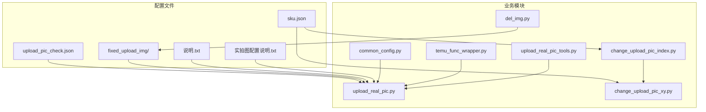
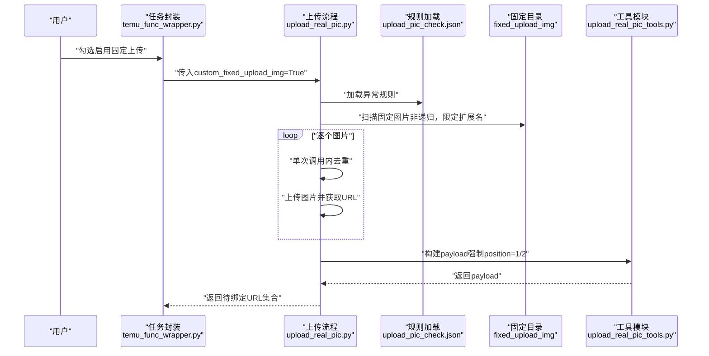
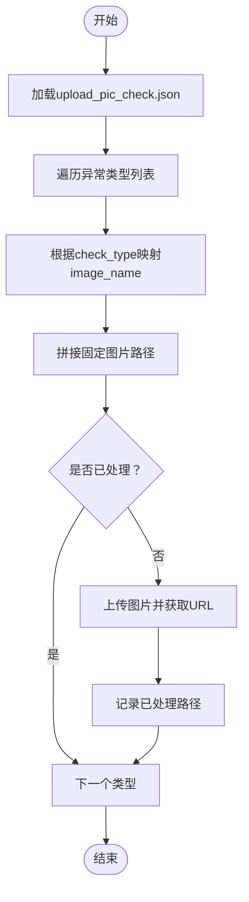
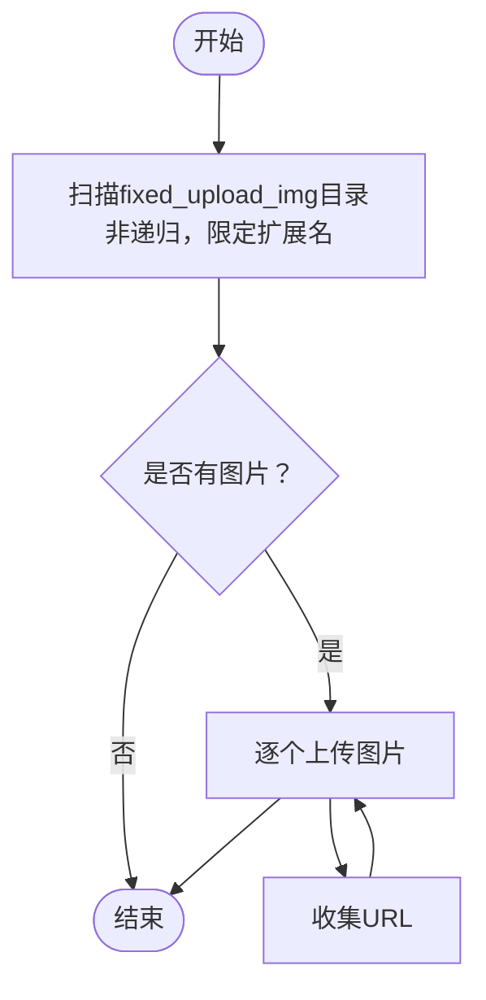
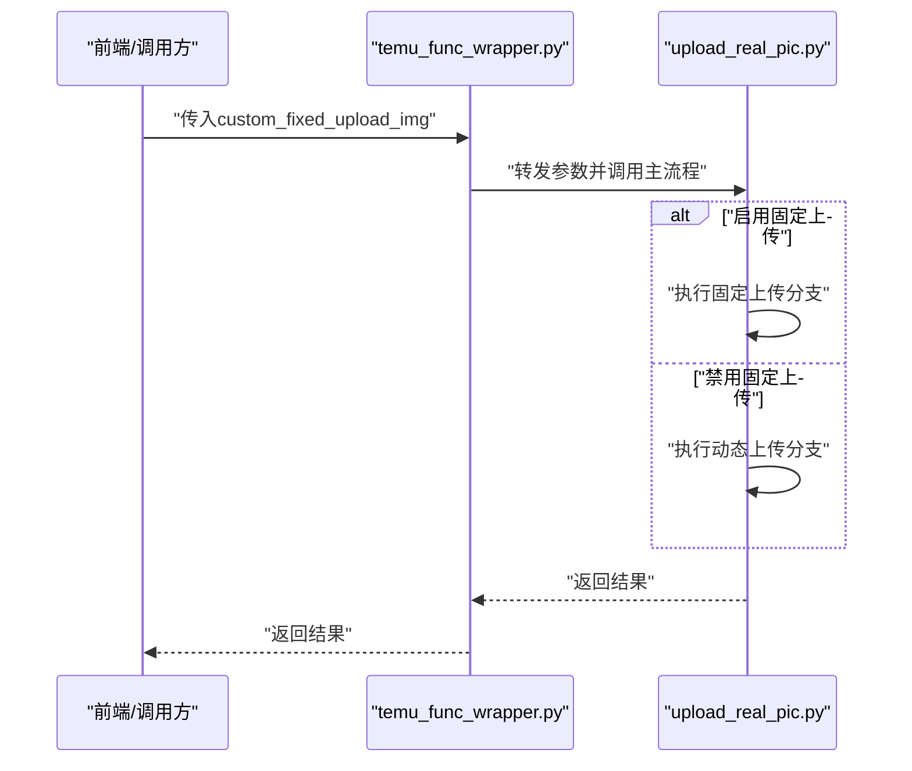
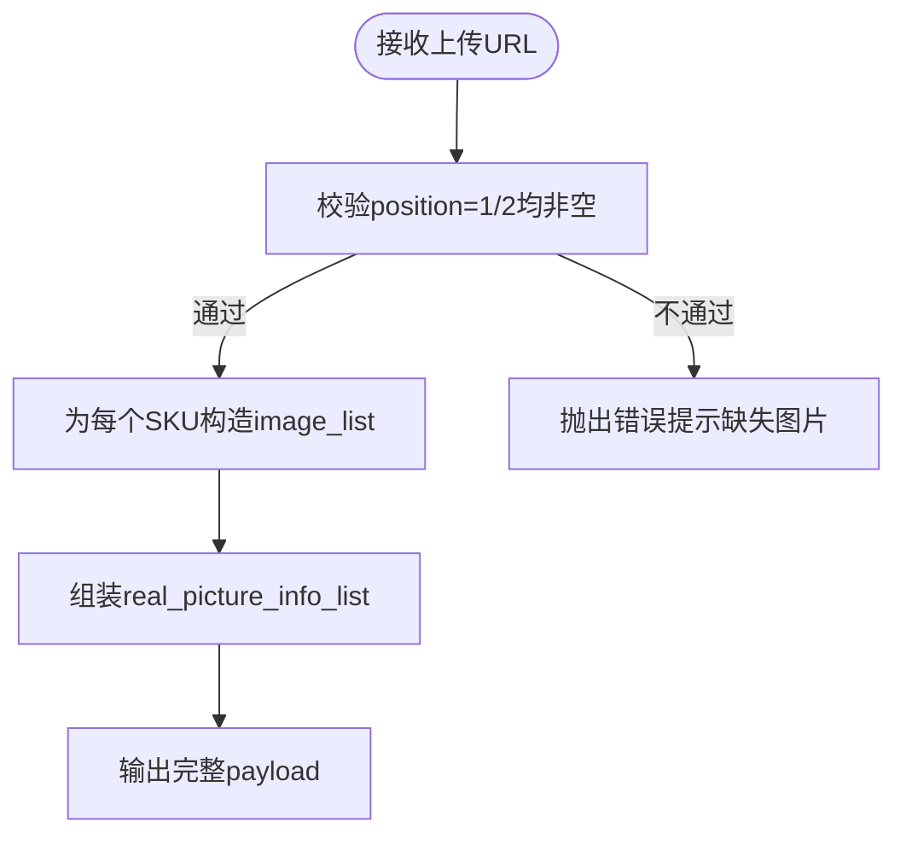
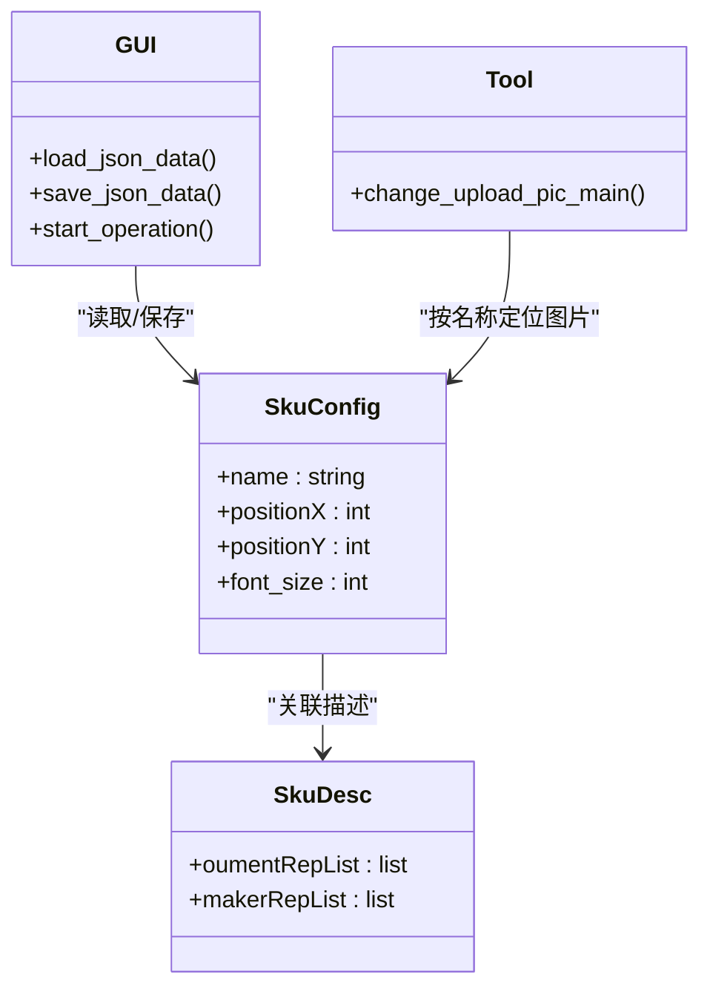
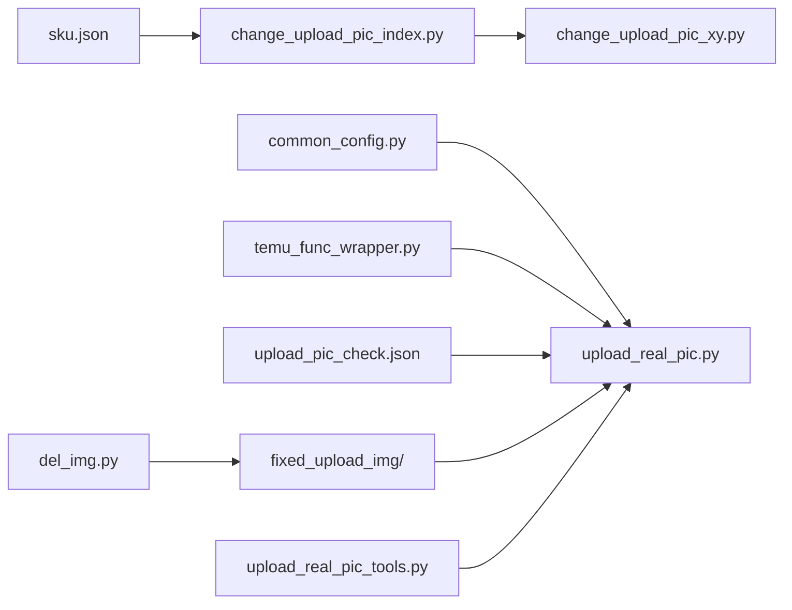

# 固定上传配置

<cite>
**本文引用的文件**
- [upload_real_pic.py](file://temu_modules/temu_function/upload_real_pic.py)
- [upload_real_pic_tools.py](file://temu_modules/temu_modules_tools/upload_real_pic_tools.py)
- [common_config.py](file://config/common_config.py)
- [temu_func_wrapper.py](file://temu_modules/temu_func_wrapper.py)
- [change_upload_pic_index.py](file://gui/change_upload_pic_index.py)
- [change_upload_pic_xy.py](file://lite_modules/change_upload_pic_xy.py)
- [del_img.py](file://lite_modules/del_img.py)
- [upload_pic_check.json](file://配置文件_实拍图配置/upload_pic_check.json)
- [sku.json](file://配置文件_实拍图配置/sku.json)
- [说明.txt](file://配置文件_实拍图配置/fixed_upload_img/说明.txt)
- [实拍图配置说明.txt](file://配置文件_实拍图配置/实拍图配置说明.txt)
</cite>

## 目录
1. [简介](#简介)
2. [项目结构](#项目结构)
3. [核心组件](#核心组件)
4. [架构总览](#架构总览)
5. [详细组件分析](#详细组件分析)
6. [依赖关系分析](#依赖关系分析)
7. [性能考量](#性能考量)
8. [故障排查指南](#故障排查指南)
9. [结论](#结论)
10. [附录](#附录)

## 简介
本文件围绕“固定上传配置”展开，系统性说明固定上传图片配置的作用、命名规则、上传路径、批量处理机制与最佳实践。同时对比固定上传与动态上传的差异，给出选择建议，并评估其对系统性能的影响。固定上传通过预置图片与规则文件，实现对特定异常类型的标准化补传与合规信息的批量绑定，提升上传效率与一致性。

## 项目结构
固定上传相关的核心位置集中在“配置文件_实拍图配置”目录及其关联模块中：
- 配置文件目录
  - upload_pic_check.json：异常规则与对应图片名称映射
  - sku.json：SKU坐标与字体配置
  - fixed_upload_img/：固定上传图片目录（说明.txt）
  - 实拍图配置说明.txt：整体配置说明
- 业务模块
  - temu_modules/temu_function/upload_real_pic.py：实拍图上传主流程，包含固定上传与动态上传的组合策略
  - temu_modules/temu_modules_tools/upload_real_pic_tools.py：构建上传payload、提取与校验数据
  - config/common_config.py：全局并发与路径配置
  - temu_modules/temu_func_wrapper.py：任务封装，暴露custom_fixed_upload_img开关
  - gui/change_upload_pic_index.py：SKU坐标可视化配置界面
  - lite_modules/change_upload_pic_xy.py：根据SKU名称定位图片并生成标注图
  - lite_modules/del_img.py：图片路径扫描与清理工具（含固定上传目录扫描）

**图表来源**
- [upload_real_pic.py:113-124](file://temu_modules/temu_function/upload_real_pic.py#L113-L124)
- [upload_real_pic_tools.py:85-127](file://temu_modules/temu_modules_tools/upload_real_pic_tools.py#L85-L127)
- [common_config.py:154-154](file://config/common_config.py#L154-L154)
- [temu_func_wrapper.py:60-91](file://temu_modules/temu_func_wrapper.py#L60-L91)
- [change_upload_pic_index.py:19-24](file://gui/change_upload_pic_index.py#L19-L24)
- [change_upload_pic_xy.py:118-135](file://lite_modules/change_upload_pic_xy.py#L118-L135)
- [del_img.py:10-46](file://lite_modules/del_img.py#L10-L46)

**章节来源**
- [upload_pic_check.json:1-48](file://配置文件_实拍图配置/upload_pic_check.json#L1-L48)
- [sku.json:1-338](file://配置文件_实拍图配置/sku.json#L1-L338)
- [说明.txt:1-1](file://配置文件_实拍图配置/fixed_upload_img/说明.txt#L1-L1)
- [实拍图配置说明.txt:1-3](file://配置文件_实拍图配置/实拍图配置说明.txt#L1-L3)

## 核心组件
- 固定上传规则加载与匹配
  - 通过加载upload_pic_check.json，将check_type映射到固定图片名称，再拼接至配置目录路径进行上传
  - 采用“单次调用内去重”的策略，避免同一文件路径重复上传
- 固定上传图片批量处理
  - 从fixed_upload_img目录扫描图片（支持扩展名过滤与非递归），逐个上传并收集URL
- 任务封装与开关
  - 通过temu_func_wrapper的custom_fixed_upload_img参数控制是否启用固定上传
- 数据构建与校验
  - upload_real_pic_tools负责构建上传payload，强制position=1与position=2各至少一张图，确保平台接口要求满足
- 配置与可视化
  - sku.json提供SKU坐标与字体配置；GUI界面支持输入与保存；工具模块支持按SKU名称定位图片

**章节来源**
- [upload_real_pic.py:113-124](file://temu_modules/temu_function/upload_real_pic.py#L113-L124)
- [upload_real_pic.py:320-359](file://temu_modules/temu_function/upload_real_pic.py#L320-L359)
- [upload_real_pic.py:362-386](file://temu_modules/temu_function/upload_real_pic.py#L362-L386)
- [upload_real_pic_tools.py:85-127](file://temu_modules/temu_modules_tools/upload_real_pic_tools.py#L85-L127)
- [temu_func_wrapper.py:60-91](file://temu_modules/temu_func_wrapper.py#L60-L91)
- [sku.json:1-338](file://配置文件_实拍图配置/sku.json#L1-L338)
- [change_upload_pic_index.py:19-24](file://gui/change_upload_pic_index.py#L19-L24)

## 架构总览
固定上传在整体流程中的位置如下：
- 触发条件：用户在任务封装中勾选custom_fixed_upload_img
- 规则匹配：根据异常类型从upload_pic_check.json映射到固定图片名称
- 图片扫描：从fixed_upload_img目录扫描图片（非递归，限定png/jpg）
- 上传与去重：逐个上传并记录已处理路径，避免重复
- 数据构建：将上传得到的URL按position=1/2强制绑定到SKU列表
- 返回结果：返回待绑定图片URL集合，供后续提交

**图表来源**
- [temu_func_wrapper.py:60-91](file://temu_modules/temu_func_wrapper.py#L60-L91)
- [upload_real_pic.py:113-124](file://temu_modules/temu_function/upload_real_pic.py#L113-L124)
- [upload_real_pic.py:362-386](file://temu_modules/temu_function/upload_real_pic.py#L362-L386)
- [upload_real_pic_tools.py:85-127](file://temu_modules/temu_modules_tools/upload_real_pic_tools.py#L85-L127)

## 详细组件分析

### 固定上传规则与命名规则
- 规则文件：upload_pic_check.json
  - 字段结构：abnormal_rules数组，每项包含image_name、primary.check_type、primary.rule_status、fallback.rule_name、fallback.rule_status_toast
  - 作用：将check_type映射到固定图片文件名，便于按异常类型自动上传对应图片
- 命名规则
  - 固定图片文件名应与规则中的image_name一致
  - 上传时会将image_name拼接到配置目录路径下进行访问
- 去重策略
  - 在单次函数调用内，使用集合记录已处理的文件路径，避免重复上传同一文件

**图表来源**
- [upload_real_pic.py:113-124](file://temu_modules/temu_function/upload_real_pic.py#L113-L124)
- [upload_real_pic.py:320-359](file://temu_modules/temu_function/upload_real_pic.py#L320-L359)

**章节来源**
- [upload_pic_check.json:1-48](file://配置文件_实拍图配置/upload_pic_check.json#L1-L48)
- [upload_real_pic.py:113-124](file://temu_modules/temu_function/upload_real_pic.py#L113-L124)
- [upload_real_pic.py:320-359](file://temu_modules/temu_function/upload_real_pic.py#L320-L359)

### 固定上传图片批量处理
- 目录与扫描
  - 目录：配置文件_实拍图配置/fixed_upload_img
  - 扫描策略：非递归，限定扩展名为.png/.jpg
  - 工具：get_all_img_paths_advanced提供统一扫描能力
- 上传流程
  - 对每个扫描到的图片，调用上传封装并收集URL
  - 返回URL列表供后续绑定

**图表来源**
- [upload_real_pic.py:362-386](file://temu_modules/temu_function/upload_real_pic.py#L362-L386)
- [del_img.py:10-46](file://lite_modules/del_img.py#L10-L46)

**章节来源**
- [说明.txt:1-1](file://配置文件_实拍图配置/fixed_upload_img/说明.txt#L1-L1)
- [upload_real_pic.py:362-386](file://temu_modules/temu_function/upload_real_pic.py#L362-L386)
- [del_img.py:10-46](file://lite_modules/del_img.py#L10-L46)

### 任务封装与开关
- 任务封装
  - temu_func_wrapper提供final_upload_real_pic的调用入口，支持custom_fixed_upload_img开关
- 开关行为
  - 当custom_fixed_upload_img为True时，启用固定上传流程
  - 当为False时，按动态规则与筛选条件执行上传

**图表来源**
- [temu_func_wrapper.py:60-91](file://temu_modules/temu_func_wrapper.py#L60-L91)
- [upload_real_pic.py:488-544](file://temu_modules/temu_function/upload_real_pic.py#L488-L544)

**章节来源**
- [temu_func_wrapper.py:60-91](file://temu_modules/temu_func_wrapper.py#L60-L91)

### 数据构建与平台约束
- 平台要求
  - position=1与position=2必须各至少一张图片
- 构建逻辑
  - upload_real_pic_tools.build_real_pic_payload强制校验并构造payload
  - 将上传得到的URL按SKU列表绑定到两个position

**图表来源**
- [upload_real_pic_tools.py:85-127](file://temu_modules/temu_modules_tools/upload_real_pic_tools.py#L85-L127)

**章节来源**
- [upload_real_pic_tools.py:85-127](file://temu_modules/temu_modules_tools/upload_real_pic_tools.py#L85-L127)

### 配置与可视化（SKU坐标）
- 配置文件：sku.json
  - 字段：skus（含name、positionX、positionY、font_size）、skuDescList
  - 用途：为不同SKU提供上传坐标与字体大小
- 可视化界面：change_upload_pic_index.py
  - 输入：店铺缩写、保存的文件名、SKCID
  - 功能：加载/保存坐标与字体，启动生成标注图
- 工具模块：change_upload_pic_xy.py
  - 根据SKU名称在配置目录中定位图片，生成标注图

**图表来源**
- [sku.json:1-338](file://配置文件_实拍图配置/sku.json#L1-L338)
- [change_upload_pic_index.py:98-143](file://gui/change_upload_pic_index.py#L98-L143)
- [change_upload_pic_xy.py:118-135](file://lite_modules/change_upload_pic_xy.py#L118-L135)

**章节来源**
- [sku.json:1-338](file://配置文件_实拍图配置/sku.json#L1-L338)
- [change_upload_pic_index.py:98-143](file://gui/change_upload_pic_index.py#L98-L143)
- [change_upload_pic_xy.py:118-135](file://lite_modules/change_upload_pic_xy.py#L118-L135)

## 依赖关系分析
- 配置依赖
  - upload_real_pic.py依赖common_config中的upload_pic_check_rules_path与并发配置
  - 任务封装依赖temu_func_wrapper的custom_fixed_upload_img参数
- 模块耦合
  - upload_real_pic.py与upload_real_pic_tools.py通过数据结构解耦
  - GUI与工具模块通过SKU配置文件交互
- 外部依赖
  - 固定上传目录路径与扩展名限制来自扫描工具与上传逻辑

**图表来源**
- [common_config.py:154-154](file://config/common_config.py#L154-L154)
- [temu_func_wrapper.py:60-91](file://temu_modules/temu_func_wrapper.py#L60-L91)
- [upload_real_pic.py:113-124](file://temu_modules/temu_function/upload_real_pic.py#L113-L124)
- [upload_real_pic_tools.py:85-127](file://temu_modules/temu_modules_tools/upload_real_pic_tools.py#L85-L127)
- [change_upload_pic_index.py:19-24](file://gui/change_upload_pic_index.py#L19-L24)
- [change_upload_pic_xy.py:118-135](file://lite_modules/change_upload_pic_xy.py#L118-L135)
- [del_img.py:10-46](file://lite_modules/del_img.py#L10-L46)

**章节来源**
- [common_config.py:154-154](file://config/common_config.py#L154-L154)
- [temu_func_wrapper.py:60-91](file://temu_modules/temu_func_wrapper.py#L60-L91)
- [upload_real_pic.py:113-124](file://temu_modules/temu_function/upload_real_pic.py#L113-L124)
- [upload_real_pic_tools.py:85-127](file://temu_modules/temu_modules_tools/upload_real_pic_tools.py#L85-L127)
- [change_upload_pic_index.py:19-24](file://gui/change_upload_pic_index.py#L19-L24)
- [change_upload_pic_xy.py:118-135](file://lite_modules/change_upload_pic_xy.py#L118-L135)
- [del_img.py:10-46](file://lite_modules/del_img.py#L10-L46)

## 性能考量
- 扫描与去重
  - 固定上传扫描固定目录，非递归且限定扩展名，降低IO与CPU开销
  - 单次调用内去重避免重复上传，减少网络请求次数
- 并发与全局配置
  - 并发数由common_config中的upload_real_pic_concurrent控制，建议结合任务规模与平台限流调整
- 数据构建
  - 构建payload时强制校验position=1/2，避免后续失败重试带来的额外开销

**章节来源**
- [upload_real_pic.py:362-386](file://temu_modules/temu_function/upload_real_pic.py#L362-L386)
- [upload_real_pic.py:320-359](file://temu_modules/temu_function/upload_real_pic.py#L320-L359)
- [common_config.py:349-349](file://config/common_config.py#L349-L349)
- [upload_real_pic_tools.py:85-127](file://temu_modules/temu_modules_tools/upload_real_pic_tools.py#L85-L127)

## 故障排查指南
- 规则文件加载失败
  - 现象：异常规则为空或加载报错
  - 排查：确认upload_pic_check.json格式正确，字段齐全
- 固定图片未找到
  - 现象：按check_type映射的image_name无法拼接为有效路径
  - 排查：确认图片文件名与规则一致，位于配置目录下
- 固定目录扫描无结果
  - 现象：fixed_upload_img目录为空或扫描不到图片
  - 排查：确认目录存在、扩展名符合.png/.jpg、非递归扫描策略
- 平台校验失败
  - 现象：position=1/2缺少图片导致payload校验失败
  - 排查：确保至少每类position上传一张图片，或在规则中补充对应图片
- 任务未启用固定上传
  - 现象：未看到固定上传分支执行
  - 排查：确认temu_func_wrapper传入custom_fixed_upload_img=True

**章节来源**
- [upload_real_pic.py:113-124](file://temu_modules/temu_function/upload_real_pic.py#L113-L124)
- [upload_real_pic.py:362-386](file://temu_modules/temu_function/upload_real_pic.py#L362-L386)
- [upload_real_pic_tools.py:85-127](file://temu_modules/temu_modules_tools/upload_real_pic_tools.py#L85-L127)
- [temu_func_wrapper.py:60-91](file://temu_modules/temu_func_wrapper.py#L60-L91)

## 结论
固定上传通过规则驱动与目录扫描，实现了对特定异常类型的标准化补传与合规信息绑定，具备明确的命名规则、稳定的批量处理流程与良好的去重机制。配合任务封装的开关控制与平台约束的数据构建，可在保证上传质量的同时提升效率。建议在实际使用中严格遵循命名与目录规范，并结合并发配置与平台限流合理安排任务规模。

## 附录

### 固定上传与动态上传的区别与选择
- 固定上传
  - 特点：基于规则文件与固定目录，按异常类型自动上传预置图片；适合标准化、高频补传场景
  - 适用：异常类型明确、图片资源集中管理
- 动态上传
  - 特点：根据实时规则与筛选条件动态选择图片；适合灵活、多样化的上传场景
  - 适用：规则变化频繁、图片来源多样化
- 选择建议
  - 若异常类型稳定且图片资源有限，优先使用固定上传
  - 若需要更高的灵活性与覆盖面，可结合动态上传策略

**章节来源**
- [upload_real_pic.py:320-359](file://temu_modules/temu_function/upload_real_pic.py#L320-L359)
- [upload_real_pic.py:362-386](file://temu_modules/temu_function/upload_real_pic.py#L362-L386)
- [upload_real_pic_tools.py:85-127](file://temu_modules/temu_modules_tools/upload_real_pic_tools.py#L85-L127)

### 最佳实践
- 规则与命名
  - 保持upload_pic_check.json的完整性与准确性，确保image_name与文件名一致
- 目录与文件
  - 固定上传图片统一存放于fixed_upload_img，限定扩展名，避免冗余文件
- 去重与幂等
  - 依赖单次调用内的去重逻辑，避免重复上传造成资源浪费
- 并发与稳定性
  - 根据任务规模与平台限流调整并发配置，确保上传稳定性
- 数据构建
  - 确保position=1/2均有图片，避免payload校验失败

**章节来源**
- [upload_pic_check.json:1-48](file://配置文件_实拍图配置/upload_pic_check.json#L1-L48)
- [说明.txt:1-1](file://配置文件_实拍图配置/fixed_upload_img/说明.txt#L1-L1)
- [upload_real_pic.py:320-359](file://temu_modules/temu_function/upload_real_pic.py#L320-L359)
- [upload_real_pic.py:362-386](file://temu_modules/temu_function/upload_real_pic.py#L362-L386)
- [common_config.py:349-349](file://config/common_config.py#L349-L349)
- [upload_real_pic_tools.py:85-127](file://temu_modules/temu_modules_tools/upload_real_pic_tools.py#L85-L127)