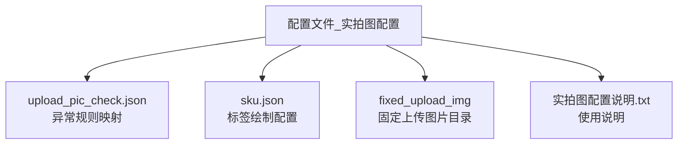
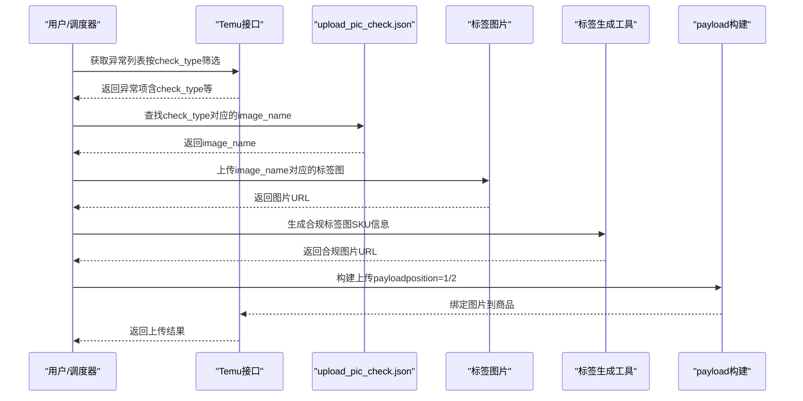
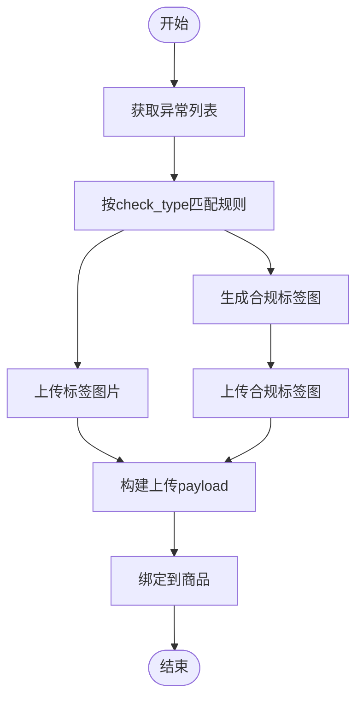
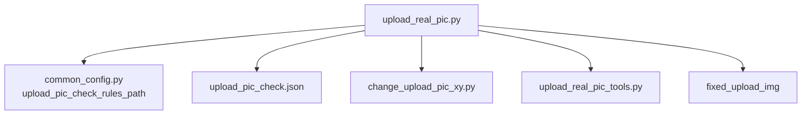

# 实拍图检查配置

<cite>
**本文档引用的文件**
- [upload_pic_check.json](file://配置文件_实拍图配置/upload_pic_check.json)
- [sku.json](file://配置文件_实拍图配置/sku.json)
- [实拍图配置说明.txt](file://配置文件_实拍图配置/实拍图配置说明.txt)
- [upload_real_pic.py](file://temu_modules/temu_function/upload_real_pic.py)
- [upload_real_pic_tools.py](file://temu_modules/temu_modules_tools/upload_real_pic_tools.py)
- [change_upload_pic_xy.py](file://lite_modules/change_upload_pic_xy.py)
- [common_config.py](file://config/common_config.py)
- [说明.txt](file://配置文件_实拍图配置/fixed_upload_img/说明.txt)
</cite>

## 目录
1. [简介](#简介)
2. [项目结构](#项目结构)
3. [核心组件](#核心组件)
4. [架构总览](#架构总览)
5. [详细组件分析](#详细组件分析)
6. [依赖关系分析](#依赖关系分析)
7. [性能考量](#性能考量)
8. [故障排查指南](#故障排查指南)
9. [结论](#结论)
10. [附录](#附录)

## 简介
本文件面向实拍图上传流程中的“检查配置”，重点解释 upload_pic_check.json 的结构、作用与参数含义，涵盖：
- 图片检查规则与异常类型映射
- 规则状态与提示信息
- 上传前的预检查流程
- 配置项的自定义与扩展方法
- 配置对上传成功率的影响

同时结合项目中其他相关模块（如合规上传、标签生成、批量上传等）说明整体工作流。

## 项目结构
实拍图检查配置位于“配置文件_实拍图配置”目录，主要文件如下：
- upload_pic_check.json：异常类型到图片标签的映射规则
- sku.json：标签绘制位置与字体配置
- 实拍图配置说明.txt：使用说明
- fixed_upload_img：固定上传图片目录（可选）

图表来源
- [upload_pic_check.json:1-48](file://配置文件_实拍图配置/upload_pic_check.json#L1-L48)
- [sku.json:1-338](file://配置文件_实拍图配置/sku.json#L1-L338)
- [说明.txt:1-1](file://配置文件_实拍图配置/fixed_upload_img/说明.txt#L1-L1)

章节来源
- [upload_pic_check.json:1-48](file://配置文件_实拍图配置/upload_pic_check.json#L1-L48)
- [sku.json:1-338](file://配置文件_实拍图配置/sku.json#L1-L338)
- [实拍图配置说明.txt:1-3](file://配置文件_实拍图配置/实拍图配置说明.txt#L1-L3)

## 核心组件
- 异常规则映射（upload_pic_check.json）
  - 结构：包含一组异常规则，每条规则包含“异常类型”、“图片文件名”、“回退规则名”、“状态提示”等字段
  - 作用：将平台返回的异常类型映射到具体标签图片，用于上传补标
- 标签绘制配置（sku.json）
  - 结构：包含多个SKU的绘制位置、字体大小、品牌/制造商信息等
  - 作用：为合规上传生成带SKU信息的标签图
- 上传流程（upload_real_pic.py）
  - 功能：拉取异常列表、根据规则上传标签、构建payload并绑定到商品
- 标签生成工具（change_upload_pic_xy.py）
  - 功能：校验图片、生成带SKU信息的标签图
- 工具类（upload_real_pic_tools.py）
  - 功能：解析异常列表、构建上传payload
- 固定上传图片（fixed_upload_img）
  - 功能：存放固定需要上传的图片，可在任务中选择启用

章节来源
- [upload_pic_check.json:1-48](file://配置文件_实拍图配置/upload_pic_check.json#L1-L48)
- [sku.json:1-338](file://配置文件_实拍图配置/sku.json#L1-L338)
- [upload_real_pic.py:113-230](file://temu_modules/temu_function/upload_real_pic.py#L113-L230)
- [change_upload_pic_xy.py:118-203](file://lite_modules/change_upload_pic_xy.py#L118-L203)
- [upload_real_pic_tools.py:85-127](file://temu_modules/temu_modules_tools/upload_real_pic_tools.py#L85-L127)
- [说明.txt:1-1](file://配置文件_实拍图配置/fixed_upload_img/说明.txt#L1-L1)

## 架构总览
实拍图上传的整体流程如下：
- 获取异常列表（按异常类型筛选）
- 根据异常类型匹配规则，上传对应标签图片
- 合规上传：生成带SKU信息的标签图并上传
- 构建payload并绑定到商品
- 批量并发处理，统计成功/失败

图表来源
- [upload_real_pic.py:34-110](file://temu_modules/temu_function/upload_real_pic.py#L34-L110)
- [upload_real_pic.py:213-229](file://temu_modules/temu_function/upload_real_pic.py#L213-L229)
- [upload_real_pic.py:427-456](file://temu_modules/temu_function/upload_real_pic.py#L427-L456)
- [upload_real_pic_tools.py:85-127](file://temu_modules/temu_modules_tools/upload_real_pic_tools.py#L85-L127)

## 详细组件分析

### upload_pic_check.json 结构与参数详解
- 结构概览
  - 根节点包含“abnormal_rules”数组，数组中每个元素代表一条异常规则
- 单条规则字段
  - image_name：标签图片文件名（位于“配置文件_实拍图配置”目录）
  - primary：主规则
    - check_type：异常类型编号（与平台返回的check_type一致）
    - rule_status：规则状态（用于控制上传行为）
  - fallback：回退规则
    - rule_name：规则名称（用于标识）
    - rule_status_toast：状态提示（用于界面或日志提示）
- 参数含义与设置方法
  - check_type：必须与平台返回的异常类型一致，用于精准匹配
  - image_name：必须与“配置文件_实拍图配置”目录下的图片文件名一致（区分大小写）
  - rule_status：影响上传策略（例如是否强制上传、是否跳过等）
  - rule_name：便于识别与维护
  - rule_status_toast：用于提示用户或记录日志
- 设置建议
  - 保持check_type与平台一致
  - image_name与实际文件名严格匹配
  - 为不同国家/品类建立独立规则，便于扩展

章节来源
- [upload_pic_check.json:1-48](file://配置文件_实拍图配置/upload_pic_check.json#L1-L48)

### 标签生成与合规上传（sku.json）
- 结构概览
  - skus：SKU列表，包含SKU名称、绘制位置（X/Y）、字体大小等
  - skuDescList：SKU描述列表，包含品牌/制造商信息
- 作用
  - 为合规上传生成带SKU信息的标签图
  - 支持大小写不敏感查找SKU
- 配置要点
  - positionX/positionY：标签文字绘制坐标
  - font_size：字体大小
  - descId：SKU描述ID，关联品牌/制造商信息

章节来源
- [sku.json:1-338](file://配置文件_实拍图配置/sku.json#L1-L338)
- [change_upload_pic_xy.py:129-150](file://lite_modules/change_upload_pic_xy.py#L129-L150)

### 上传前预检查流程
- 获取异常列表
  - 支持按check_type_list、rapid_screen_status_list、goods_status_list等筛选
- 匹配规则并上传标签
  - 根据check_type查找image_name
  - 上传对应标签图片并去重（同一调用内避免重复上传）
- 合规上传
  - 生成带SKU信息的标签图并上传
- 构建payload并绑定
  - 强制包含position=1与position=2，且每个position至少一张图
- 并发与重试
  - 支持多线程分片处理，失败重试与任务停止检测

图表来源
- [upload_real_pic.py:34-110](file://temu_modules/temu_function/upload_real_pic.py#L34-L110)
- [upload_real_pic.py:213-229](file://temu_modules/temu_function/upload_real_pic.py#L213-L229)
- [upload_real_pic.py:427-456](file://temu_modules/temu_function/upload_real_pic.py#L427-L456)
- [upload_real_pic_tools.py:85-127](file://temu_modules/temu_modules_tools/upload_real_pic_tools.py#L85-L127)

章节来源
- [upload_real_pic.py:34-110](file://temu_modules/temu_function/upload_real_pic.py#L34-L110)
- [upload_real_pic.py:213-229](file://temu_modules/temu_function/upload_real_pic.py#L213-L229)
- [upload_real_pic.py:427-456](file://temu_modules/temu_function/upload_real_pic.py#L427-L456)
- [upload_real_pic_tools.py:85-127](file://temu_modules/temu_modules_tools/upload_real_pic_tools.py#L85-L127)

### 固定上传图片（fixed_upload_img）
- 用途
  - 存放固定需要上传的图片，可在任务中选择启用
- 规则
  - 目录下所有图片会被扫描并上传
  - 支持多种图片格式（PNG/JPG/GIF/BMP/TIFF/WEBP/SVG/ICO等）

章节来源
- [说明.txt:1-1](file://配置文件_实拍图配置/fixed_upload_img/说明.txt#L1-L1)
- [upload_real_pic.py:362-386](file://temu_modules/temu_function/upload_real_pic.py#L362-L386)

### 配置文件对上传成功率的影响
- 规则匹配准确性
  - check_type与平台返回一致，才能正确触发标签上传
  - image_name与文件名一致，避免上传失败
- payload构建严格性
  - position=1与position=2必须至少各有一张图，否则构建payload会失败
- 图片质量与格式
  - 合规标签图需通过图片校验（格式、完整性、尺寸等）
- 并发与稳定性
  - 合理的并发配置与重试机制有助于提升成功率

章节来源
- [upload_real_pic_tools.py:95-102](file://temu_modules/temu_modules_tools/upload_real_pic_tools.py#L95-L102)
- [change_upload_pic_xy.py:27-64](file://lite_modules/change_upload_pic_xy.py#L27-L64)

## 依赖关系分析
- upload_real_pic.py 依赖
  - 配置路径：common_config.py 中的 upload_pic_check_rules_path
  - 标签生成：change_upload_pic_xy.py
  - payload构建：upload_real_pic_tools.py
  - 固定上传：del_img.py（扫描目录）
- 配置文件
  - upload_pic_check.json：异常规则映射
  - sku.json：标签绘制配置
  - 实拍图配置说明.txt：使用说明

图表来源
- [upload_real_pic.py:15-27](file://temu_modules/temu_function/upload_real_pic.py#L15-L27)
- [common_config.py:154-154](file://config/common_config.py#L154-L154)
- [upload_pic_check.json:1-48](file://配置文件_实拍图配置/upload_pic_check.json#L1-L48)
- [change_upload_pic_xy.py:118-203](file://lite_modules/change_upload_pic_xy.py#L118-L203)
- [upload_real_pic_tools.py:85-127](file://temu_modules/temu_modules_tools/upload_real_pic_tools.py#L85-L127)

章节来源
- [upload_real_pic.py:15-27](file://temu_modules/temu_function/upload_real_pic.py#L15-L27)
- [common_config.py:154-154](file://config/common_config.py#L154-L154)

## 性能考量
- 并发与分片
  - 通过多线程分片处理SPU，提升吞吐
- 去重与幂等
  - 同一调用内对相同文件路径去重，避免重复上传
- 图片校验
  - 合规标签图上传前进行格式与完整性校验，减少无效上传
- 日志与监控
  - 关键步骤记录日志，便于定位问题

章节来源
- [upload_real_pic.py:328-355](file://temu_modules/temu_function/upload_real_pic.py#L328-L355)
- [change_upload_pic_xy.py:27-64](file://lite_modules/change_upload_pic_xy.py#L27-L64)

## 故障排查指南
- 上传失败
  - 检查 upload_pic_check.json 中的 check_type 与平台返回是否一致
  - 确认 image_name 与“配置文件_实拍图配置”目录下的文件名一致
  - 确认 position=1/2 的图片列表均非空
- 合规标签图失败
  - 检查 sku.json 中的 SKU 配置是否存在
  - 确认图片校验通过（格式、完整性）
- 固定上传图片未生效
  - 确认勾选了“自定义固定上传图片”
  - 检查 fixed_upload_img 目录下图片格式是否受支持

章节来源
- [upload_real_pic.py:427-456](file://temu_modules/temu_function/upload_real_pic.py#L427-L456)
- [upload_real_pic_tools.py:95-102](file://temu_modules/temu_modules_tools/upload_real_pic_tools.py#L95-L102)
- [说明.txt:1-1](file://配置文件_实拍图配置/fixed_upload_img/说明.txt#L1-L1)

## 结论
upload_pic_check.json 是实拍图上传流程中的关键配置，通过将异常类型与标签图片进行精确映射，能够显著提升上传成功率与一致性。配合合规标签生成、严格的payload构建与并发处理，可形成稳定高效的上传体系。建议在维护时：
- 保持规则与平台返回的一致性
- 明确 image_name 与文件名的对应关系
- 完善 SKU 配置，确保合规标签图生成成功
- 合理设置并发与重试策略，提升整体稳定性

## 附录

### 配置项对照表
- upload_pic_check.json
  - abnormal_rules[]：异常规则数组
    - image_name：标签图片文件名
    - primary.check_type：异常类型编号
    - primary.rule_status：规则状态
    - fallback.rule_name：回退规则名
    - fallback.rule_status_toast：状态提示
- sku.json
  - skus[]：SKU列表
    - name：SKU名称
    - positionX/positionY：绘制坐标
    - font_size：字体大小
    - descId：SKU描述ID
  - skuDescList[]：SKU描述列表
    - oumentRepList/makerRepList：品牌/制造商信息

章节来源
- [upload_pic_check.json:1-48](file://配置文件_实拍图配置/upload_pic_check.json#L1-L48)
- [sku.json:1-338](file://配置文件_实拍图配置/sku.json#L1-L338)