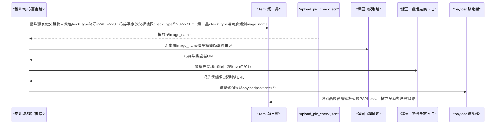
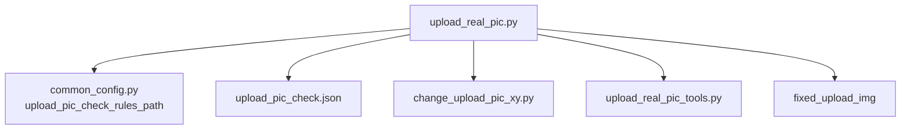

# 瀹炴媿鍥炬鏌ラ厤缃?
<cite>
**鏈枃妗ｅ紩鐢ㄧ殑鏂囦欢**
- [upload_pic_check.json](file://閰嶇疆鏂囦欢_瀹炴媿鍥鹃厤缃?upload_pic_check.json)
- [sku.json](file://閰嶇疆鏂囦欢_瀹炴媿鍥鹃厤缃?sku.json)
- [瀹炴媿鍥鹃厤缃鏄?txt](file://閰嶇疆鏂囦欢_瀹炴媿鍥鹃厤缃?瀹炴媿鍥鹃厤缃鏄?txt)
- [upload_real_pic.py](file://temu_modules/temu_function/upload_real_pic.py)
- [upload_real_pic_tools.py](file://temu_modules/temu_modules_tools/upload_real_pic_tools.py)
- [change_upload_pic_xy.py](file://lite_modules/change_upload_pic_xy.py)
- [common_config.py](file://config/common_config.py)
- [璇存槑.txt](file://閰嶇疆鏂囦欢_瀹炴媿鍥鹃厤缃?fixed_upload_img/璇存槑.txt)
</cite>

## 鐩綍
1. [绠€浠媇(#绠€浠?
2. [椤圭洰缁撴瀯](#椤圭洰缁撴瀯)
3. [鏍稿績缁勪欢](#鏍稿績缁勪欢)
4. [鏋舵瀯鎬昏](#鏋舵瀯鎬昏)
5. [璇︾粏缁勪欢鍒嗘瀽](#璇︾粏缁勪欢鍒嗘瀽)
6. [渚濊禆鍏崇郴鍒嗘瀽](#渚濊禆鍏崇郴鍒嗘瀽)
7. [鎬ц兘鑰冮噺](#鎬ц兘鑰冮噺)
8. [鏁呴殰鎺掓煡鎸囧崡](#鏁呴殰鎺掓煡鎸囧崡)
9. [缁撹](#缁撹)
10. [闄勫綍](#闄勫綍)

## 绠€浠?鏈枃浠堕潰鍚戝疄鎷嶅浘涓婁紶娴佺▼涓殑鈥滄鏌ラ厤缃€濓紝閲嶇偣瑙ｉ噴 upload_pic_check.json 鐨勭粨鏋勩€佷綔鐢ㄤ笌鍙傛暟鍚箟锛屾兜鐩栵細
- 鍥剧墖妫€鏌ヨ鍒欎笌寮傚父绫诲瀷鏄犲皠
- 瑙勫垯鐘舵€佷笌鎻愮ず淇℃伅
- 涓婁紶鍓嶇殑棰勬鏌ユ祦绋?- 閰嶇疆椤圭殑鑷畾涔変笌鎵╁睍鏂规硶
- 閰嶇疆瀵逛笂浼犳垚鍔熺巼鐨勫奖鍝?
鍚屾椂缁撳悎椤圭洰涓叾浠栫浉鍏虫ā鍧楋紙濡傚悎瑙勪笂浼犮€佹爣绛剧敓鎴愩€佹壒閲忎笂浼犵瓑锛夎鏄庢暣浣撳伐浣滄祦銆?
## 椤圭洰缁撴瀯
瀹炴媿鍥炬鏌ラ厤缃綅浜庘€滈厤缃枃浠禵瀹炴媿鍥鹃厤缃€濈洰褰曪紝涓昏鏂囦欢濡備笅锛?- upload_pic_check.json锛氬紓甯哥被鍨嬪埌鍥剧墖鏍囩鐨勬槧灏勮鍒?- sku.json锛氭爣绛剧粯鍒朵綅缃笌瀛椾綋閰嶇疆
- 瀹炴媿鍥鹃厤缃鏄?txt锛氫娇鐢ㄨ鏄?- fixed_upload_img锛氬浐瀹氫笂浼犲浘鐗囩洰褰曪紙鍙€夛級

```mermaid
graph TB
A["閰嶇疆鏂囦欢_瀹炴媿鍥鹃厤缃?] --> B["upload_pic_check.json<br/>寮傚父瑙勫垯鏄犲皠"]
A --> C["sku.json<br/>鏍囩缁樺埗閰嶇疆"]
A --> D["fixed_upload_img<br/>鍥哄畾涓婁紶鍥剧墖鐩綍"]
A --> E["瀹炴媿鍥鹃厤缃鏄?txt<br/>浣跨敤璇存槑"]
```

鍥捐〃鏉ユ簮
- [upload_pic_check.json:1-48](file://閰嶇疆鏂囦欢_瀹炴媿鍥鹃厤缃?upload_pic_check.json#L1-L48)
- [sku.json:1-338](file://閰嶇疆鏂囦欢_瀹炴媿鍥鹃厤缃?sku.json#L1-L338)
- [璇存槑.txt:1-1](file://閰嶇疆鏂囦欢_瀹炴媿鍥鹃厤缃?fixed_upload_img/璇存槑.txt#L1-L1)

绔犺妭鏉ユ簮
- [upload_pic_check.json:1-48](file://閰嶇疆鏂囦欢_瀹炴媿鍥鹃厤缃?upload_pic_check.json#L1-L48)
- [sku.json:1-338](file://閰嶇疆鏂囦欢_瀹炴媿鍥鹃厤缃?sku.json#L1-L338)
- [瀹炴媿鍥鹃厤缃鏄?txt:1-3](file://閰嶇疆鏂囦欢_瀹炴媿鍥鹃厤缃?瀹炴媿鍥鹃厤缃鏄?txt#L1-L3)

## 鏍稿績缁勪欢
- 寮傚父瑙勫垯鏄犲皠锛坲pload_pic_check.json锛?  - 缁撴瀯锛氬寘鍚竴缁勫紓甯歌鍒欙紝姣忔潯瑙勫垯鍖呭惈鈥滃紓甯哥被鍨嬧€濄€佲€滃浘鐗囨枃浠跺悕鈥濄€佲€滃洖閫€瑙勫垯鍚嶁€濄€佲€滅姸鎬佹彁绀衡€濈瓑瀛楁
  - 浣滅敤锛氬皢骞冲彴杩斿洖鐨勫紓甯哥被鍨嬫槧灏勫埌鍏蜂綋鏍囩鍥剧墖锛岀敤浜庝笂浼犺ˉ鏍?- 鏍囩缁樺埗閰嶇疆锛坰ku.json锛?  - 缁撴瀯锛氬寘鍚涓猄KU鐨勭粯鍒朵綅缃€佸瓧浣撳ぇ灏忋€佸搧鐗?鍒堕€犲晢淇℃伅绛?  - 浣滅敤锛氫负鍚堣涓婁紶鐢熸垚甯KU淇℃伅鐨勬爣绛惧浘
- 涓婁紶娴佺▼锛坲pload_real_pic.py锛?  - 鍔熻兘锛氭媺鍙栧紓甯稿垪琛ㄣ€佹牴鎹鍒欎笂浼犳爣绛俱€佹瀯寤簆ayload骞剁粦瀹氬埌鍟嗗搧
- 鏍囩鐢熸垚宸ュ叿锛坈hange_upload_pic_xy.py锛?  - 鍔熻兘锛氭牎楠屽浘鐗囥€佺敓鎴愬甫SKU淇℃伅鐨勬爣绛惧浘
- 宸ュ叿绫伙紙upload_real_pic_tools.py锛?  - 鍔熻兘锛氳В鏋愬紓甯稿垪琛ㄣ€佹瀯寤轰笂浼爌ayload
- 鍥哄畾涓婁紶鍥剧墖锛坒ixed_upload_img锛?  - 鍔熻兘锛氬瓨鏀惧浐瀹氶渶瑕佷笂浼犵殑鍥剧墖锛屽彲鍦ㄤ换鍔′腑閫夋嫨鍚敤

绔犺妭鏉ユ簮
- [upload_pic_check.json:1-48](file://閰嶇疆鏂囦欢_瀹炴媿鍥鹃厤缃?upload_pic_check.json#L1-L48)
- [sku.json:1-338](file://閰嶇疆鏂囦欢_瀹炴媿鍥鹃厤缃?sku.json#L1-L338)
- [upload_real_pic.py:113-230](file://temu_modules/temu_function/upload_real_pic.py#L113-L230)
- [change_upload_pic_xy.py:118-203](file://lite_modules/change_upload_pic_xy.py#L118-L203)
- [upload_real_pic_tools.py:85-127](file://temu_modules/temu_modules_tools/upload_real_pic_tools.py#L85-L127)
- [璇存槑.txt:1-1](file://閰嶇疆鏂囦欢_瀹炴媿鍥鹃厤缃?fixed_upload_img/璇存槑.txt#L1-L1)

## 鏋舵瀯鎬昏
瀹炴媿鍥句笂浼犵殑鏁翠綋娴佺▼濡備笅锛?- 鑾峰彇寮傚父鍒楄〃锛堟寜寮傚父绫诲瀷绛涢€夛級
- 鏍规嵁寮傚父绫诲瀷鍖归厤瑙勫垯锛屼笂浼犲搴旀爣绛惧浘鐗?- 鍚堣涓婁紶锛氱敓鎴愬甫SKU淇℃伅鐨勬爣绛惧浘骞朵笂浼?- 鏋勫缓payload骞剁粦瀹氬埌鍟嗗搧
- 鎵归噺骞跺彂澶勭悊锛岀粺璁℃垚鍔?澶辫触



鍥捐〃鏉ユ簮
- [upload_real_pic.py:34-110](file://temu_modules/temu_function/upload_real_pic.py#L34-L110)
- [upload_real_pic.py:213-229](file://temu_modules/temu_function/upload_real_pic.py#L213-L229)
- [upload_real_pic.py:427-456](file://temu_modules/temu_function/upload_real_pic.py#L427-L456)
- [upload_real_pic_tools.py:85-127](file://temu_modules/temu_modules_tools/upload_real_pic_tools.py#L85-L127)

## 璇︾粏缁勪欢鍒嗘瀽

### upload_pic_check.json 缁撴瀯涓庡弬鏁拌瑙?- 缁撴瀯姒傝
  - 鏍硅妭鐐瑰寘鍚€渁bnormal_rules鈥濇暟缁勶紝鏁扮粍涓瘡涓厓绱犱唬琛ㄤ竴鏉″紓甯歌鍒?- 鍗曟潯瑙勫垯瀛楁
  - image_name锛氭爣绛惧浘鐗囨枃浠跺悕锛堜綅浜庘€滈厤缃枃浠禵瀹炴媿鍥鹃厤缃€濈洰褰曪級
  - primary锛氫富瑙勫垯
    - check_type锛氬紓甯哥被鍨嬬紪鍙凤紙涓庡钩鍙拌繑鍥炵殑check_type涓€鑷达級
    - rule_status锛氳鍒欑姸鎬侊紙鐢ㄤ簬鎺у埗涓婁紶琛屼负锛?  - fallback锛氬洖閫€瑙勫垯
    - rule_name锛氳鍒欏悕绉帮紙鐢ㄤ簬鏍囪瘑锛?    - rule_status_toast锛氱姸鎬佹彁绀猴紙鐢ㄤ簬鐣岄潰鎴栨棩蹇楁彁绀猴級
- 鍙傛暟鍚箟涓庤缃柟娉?  - check_type锛氬繀椤讳笌骞冲彴杩斿洖鐨勫紓甯哥被鍨嬩竴鑷达紝鐢ㄤ簬绮惧噯鍖归厤
  - image_name锛氬繀椤讳笌鈥滈厤缃枃浠禵瀹炴媿鍥鹃厤缃€濈洰褰曚笅鐨勫浘鐗囨枃浠跺悕涓€鑷达紙鍖哄垎澶у皬鍐欙級
  - rule_status锛氬奖鍝嶄笂浼犵瓥鐣ワ紙渚嬪鏄惁寮哄埗涓婁紶銆佹槸鍚﹁烦杩囩瓑锛?  - rule_name锛氫究浜庤瘑鍒笌缁存姢
  - rule_status_toast锛氱敤浜庢彁绀虹敤鎴锋垨璁板綍鏃ュ織
- 璁剧疆寤鸿
  - 淇濇寔check_type涓庡钩鍙颁竴鑷?  - image_name涓庡疄闄呮枃浠跺悕涓ユ牸鍖归厤
  - 涓轰笉鍚屽浗瀹?鍝佺被寤虹珛鐙珛瑙勫垯锛屼究浜庢墿灞?
绔犺妭鏉ユ簮
- [upload_pic_check.json:1-48](file://閰嶇疆鏂囦欢_瀹炴媿鍥鹃厤缃?upload_pic_check.json#L1-L48)

### 鏍囩鐢熸垚涓庡悎瑙勪笂浼狅紙sku.json锛?- 缁撴瀯姒傝
  - skus锛歋KU鍒楄〃锛屽寘鍚玈KU鍚嶇О銆佺粯鍒朵綅缃紙X/Y锛夈€佸瓧浣撳ぇ灏忕瓑
  - skuDescList锛歋KU鎻忚堪鍒楄〃锛屽寘鍚搧鐗?鍒堕€犲晢淇℃伅
- 浣滅敤
  - 涓哄悎瑙勪笂浼犵敓鎴愬甫SKU淇℃伅鐨勬爣绛惧浘
  - 鏀寔澶у皬鍐欎笉鏁忔劅鏌ユ壘SKU
- 閰嶇疆瑕佺偣
  - positionX/positionY锛氭爣绛炬枃瀛楃粯鍒跺潗鏍?  - font_size锛氬瓧浣撳ぇ灏?  - descId锛歋KU鎻忚堪ID锛屽叧鑱斿搧鐗?鍒堕€犲晢淇℃伅

绔犺妭鏉ユ簮
- [sku.json:1-338](file://閰嶇疆鏂囦欢_瀹炴媿鍥鹃厤缃?sku.json#L1-L338)
- [change_upload_pic_xy.py:129-150](file://lite_modules/change_upload_pic_xy.py#L129-L150)

### 涓婁紶鍓嶉妫€鏌ユ祦绋?- 鑾峰彇寮傚父鍒楄〃
  - 鏀寔鎸塩heck_type_list銆乺apid_screen_status_list銆乬oods_status_list绛夌瓫閫?- 鍖归厤瑙勫垯骞朵笂浼犳爣绛?  - 鏍规嵁check_type鏌ユ壘image_name
  - 涓婁紶瀵瑰簲鏍囩鍥剧墖骞跺幓閲嶏紙鍚屼竴璋冪敤鍐呴伩鍏嶉噸澶嶄笂浼狅級
- 鍚堣涓婁紶
  - 鐢熸垚甯KU淇℃伅鐨勬爣绛惧浘骞朵笂浼?- 鏋勫缓payload骞剁粦瀹?  - 寮哄埗鍖呭惈position=1涓巔osition=2锛屼笖姣忎釜position鑷冲皯涓€寮犲浘
- 骞跺彂涓庨噸璇?  - 鏀寔澶氱嚎绋嬪垎鐗囧鐞嗭紝澶辫触閲嶈瘯涓庝换鍔″仠姝㈡娴?
```mermaid
flowchart TD
Start(["寮€濮?]) --> Fetch["鑾峰彇寮傚父鍒楄〃"]
Fetch --> Match["鎸塩heck_type鍖归厤瑙勫垯"]
Match --> UploadTag["涓婁紶鏍囩鍥剧墖"]
Match --> GenLabel["鐢熸垚鍚堣鏍囩鍥?]
GenLabel --> UploadLabel["涓婁紶鍚堣鏍囩鍥?]
UploadTag --> BuildPayload["鏋勫缓涓婁紶payload"]
UploadLabel --> BuildPayload
BuildPayload --> Bind["缁戝畾鍒板晢鍝?]
Bind --> End(["缁撴潫"])
```

鍥捐〃鏉ユ簮
- [upload_real_pic.py:34-110](file://temu_modules/temu_function/upload_real_pic.py#L34-L110)
- [upload_real_pic.py:213-229](file://temu_modules/temu_function/upload_real_pic.py#L213-L229)
- [upload_real_pic.py:427-456](file://temu_modules/temu_function/upload_real_pic.py#L427-L456)
- [upload_real_pic_tools.py:85-127](file://temu_modules/temu_modules_tools/upload_real_pic_tools.py#L85-L127)

绔犺妭鏉ユ簮
- [upload_real_pic.py:34-110](file://temu_modules/temu_function/upload_real_pic.py#L34-L110)
- [upload_real_pic.py:213-229](file://temu_modules/temu_function/upload_real_pic.py#L213-L229)
- [upload_real_pic.py:427-456](file://temu_modules/temu_function/upload_real_pic.py#L427-L456)
- [upload_real_pic_tools.py:85-127](file://temu_modules/temu_modules_tools/upload_real_pic_tools.py#L85-L127)

### 鍥哄畾涓婁紶鍥剧墖锛坒ixed_upload_img锛?- 鐢ㄩ€?  - 瀛樻斁鍥哄畾闇€瑕佷笂浼犵殑鍥剧墖锛屽彲鍦ㄤ换鍔′腑閫夋嫨鍚敤
- 瑙勫垯
  - 鐩綍涓嬫墍鏈夊浘鐗囦細琚壂鎻忓苟涓婁紶
  - 鏀寔澶氱鍥剧墖鏍煎紡锛圥NG/JPG/GIF/BMP/TIFF/WEBP/SVG/ICO绛夛級

绔犺妭鏉ユ簮
- [璇存槑.txt:1-1](file://閰嶇疆鏂囦欢_瀹炴媿鍥鹃厤缃?fixed_upload_img/璇存槑.txt#L1-L1)
- [upload_real_pic.py:362-386](file://temu_modules/temu_function/upload_real_pic.py#L362-L386)

### 閰嶇疆鏂囦欢瀵逛笂浼犳垚鍔熺巼鐨勫奖鍝?- 瑙勫垯鍖归厤鍑嗙‘鎬?  - check_type涓庡钩鍙拌繑鍥炰竴鑷达紝鎵嶈兘姝ｇ‘瑙﹀彂鏍囩涓婁紶
  - image_name涓庢枃浠跺悕涓€鑷达紝閬垮厤涓婁紶澶辫触
- payload鏋勫缓涓ユ牸鎬?  - position=1涓巔osition=2蹇呴』鑷冲皯鍚勬湁涓€寮犲浘锛屽惁鍒欐瀯寤簆ayload浼氬け璐?- 鍥剧墖璐ㄩ噺涓庢牸寮?  - 鍚堣鏍囩鍥鹃渶閫氳繃鍥剧墖鏍￠獙锛堟牸寮忋€佸畬鏁存€с€佸昂瀵哥瓑锛?- 骞跺彂涓庣ǔ瀹氭€?  - 鍚堢悊鐨勫苟鍙戦厤缃笌閲嶈瘯鏈哄埗鏈夊姪浜庢彁鍗囨垚鍔熺巼

绔犺妭鏉ユ簮
- [upload_real_pic_tools.py:95-102](file://temu_modules/temu_modules_tools/upload_real_pic_tools.py#L95-L102)
- [change_upload_pic_xy.py:27-64](file://lite_modules/change_upload_pic_xy.py#L27-L64)

## 渚濊禆鍏崇郴鍒嗘瀽
- upload_real_pic.py 渚濊禆
  - 閰嶇疆璺緞锛歝ommon_config.py 涓殑 upload_pic_check_rules_path
  - 鏍囩鐢熸垚锛歝hange_upload_pic_xy.py
  - payload鏋勫缓锛歶pload_real_pic_tools.py
  - 鍥哄畾涓婁紶锛歞el_img.py锛堟壂鎻忕洰褰曪級
- 閰嶇疆鏂囦欢
  - upload_pic_check.json锛氬紓甯歌鍒欐槧灏?  - sku.json锛氭爣绛剧粯鍒堕厤缃?  - 瀹炴媿鍥鹃厤缃鏄?txt锛氫娇鐢ㄨ鏄?


鍥捐〃鏉ユ簮
- [upload_real_pic.py:15-27](file://temu_modules/temu_function/upload_real_pic.py#L15-L27)
- [common_config.py:154-154](file://config/common_config.py#L154-L154)
- [upload_pic_check.json:1-48](file://閰嶇疆鏂囦欢_瀹炴媿鍥鹃厤缃?upload_pic_check.json#L1-L48)
- [change_upload_pic_xy.py:118-203](file://lite_modules/change_upload_pic_xy.py#L118-L203)
- [upload_real_pic_tools.py:85-127](file://temu_modules/temu_modules_tools/upload_real_pic_tools.py#L85-L127)

绔犺妭鏉ユ簮
- [upload_real_pic.py:15-27](file://temu_modules/temu_function/upload_real_pic.py#L15-L27)
- [common_config.py:154-154](file://config/common_config.py#L154-L154)

## 鎬ц兘鑰冮噺
- 骞跺彂涓庡垎鐗?  - 閫氳繃澶氱嚎绋嬪垎鐗囧鐞哠PU锛屾彁鍗囧悶鍚?- 鍘婚噸涓庡箓绛?  - 鍚屼竴璋冪敤鍐呭鐩稿悓鏂囦欢璺緞鍘婚噸锛岄伩鍏嶉噸澶嶄笂浼?- 鍥剧墖鏍￠獙
  - 鍚堣鏍囩鍥句笂浼犲墠杩涜鏍煎紡涓庡畬鏁存€ф牎楠岋紝鍑忓皯鏃犳晥涓婁紶
- 鏃ュ織涓庣洃鎺?  - 鍏抽敭姝ラ璁板綍鏃ュ織锛屼究浜庡畾浣嶉棶棰?
绔犺妭鏉ユ簮
- [upload_real_pic.py:328-355](file://temu_modules/temu_function/upload_real_pic.py#L328-L355)
- [change_upload_pic_xy.py:27-64](file://lite_modules/change_upload_pic_xy.py#L27-L64)

## 鏁呴殰鎺掓煡鎸囧崡
- 涓婁紶澶辫触
  - 妫€鏌?upload_pic_check.json 涓殑 check_type 涓庡钩鍙拌繑鍥炴槸鍚︿竴鑷?  - 纭 image_name 涓庘€滈厤缃枃浠禵瀹炴媿鍥鹃厤缃€濈洰褰曚笅鐨勬枃浠跺悕涓€鑷?  - 纭 position=1/2 鐨勫浘鐗囧垪琛ㄥ潎闈炵┖
- 鍚堣鏍囩鍥惧け璐?  - 妫€鏌?sku.json 涓殑 SKU 閰嶇疆鏄惁瀛樺湪
  - 纭鍥剧墖鏍￠獙閫氳繃锛堟牸寮忋€佸畬鏁存€э級
- 鍥哄畾涓婁紶鍥剧墖鏈敓鏁?  - 纭鍕鹃€変簡鈥滆嚜瀹氫箟鍥哄畾涓婁紶鍥剧墖鈥?  - 妫€鏌?fixed_upload_img 鐩綍涓嬪浘鐗囨牸寮忔槸鍚﹀彈鏀寔

绔犺妭鏉ユ簮
- [upload_real_pic.py:427-456](file://temu_modules/temu_function/upload_real_pic.py#L427-L456)
- [upload_real_pic_tools.py:95-102](file://temu_modules/temu_modules_tools/upload_real_pic_tools.py#L95-L102)
- [璇存槑.txt:1-1](file://閰嶇疆鏂囦欢_瀹炴媿鍥鹃厤缃?fixed_upload_img/璇存槑.txt#L1-L1)

## 缁撹
upload_pic_check.json 鏄疄鎷嶅浘涓婁紶娴佺▼涓殑鍏抽敭閰嶇疆锛岄€氳繃灏嗗紓甯哥被鍨嬩笌鏍囩鍥剧墖杩涜绮剧‘鏄犲皠锛岃兘澶熸樉钁楁彁鍗囦笂浼犳垚鍔熺巼涓庝竴鑷存€с€傞厤鍚堝悎瑙勬爣绛剧敓鎴愩€佷弗鏍肩殑payload鏋勫缓涓庡苟鍙戝鐞嗭紝鍙舰鎴愮ǔ瀹氶珮鏁堢殑涓婁紶浣撶郴銆傚缓璁湪缁存姢鏃讹細
- 淇濇寔瑙勫垯涓庡钩鍙拌繑鍥炵殑涓€鑷存€?- 鏄庣‘ image_name 涓庢枃浠跺悕鐨勫搴斿叧绯?- 瀹屽杽 SKU 閰嶇疆锛岀‘淇濆悎瑙勬爣绛惧浘鐢熸垚鎴愬姛
- 鍚堢悊璁剧疆骞跺彂涓庨噸璇曠瓥鐣ワ紝鎻愬崌鏁翠綋绋冲畾鎬?
## 闄勫綍

### 閰嶇疆椤瑰鐓ц〃
- upload_pic_check.json
  - abnormal_rules[]锛氬紓甯歌鍒欐暟缁?    - image_name锛氭爣绛惧浘鐗囨枃浠跺悕
    - primary.check_type锛氬紓甯哥被鍨嬬紪鍙?    - primary.rule_status锛氳鍒欑姸鎬?    - fallback.rule_name锛氬洖閫€瑙勫垯鍚?    - fallback.rule_status_toast锛氱姸鎬佹彁绀?- sku.json
  - skus[]锛歋KU鍒楄〃
    - name锛歋KU鍚嶇О
    - positionX/positionY锛氱粯鍒跺潗鏍?    - font_size锛氬瓧浣撳ぇ灏?    - descId锛歋KU鎻忚堪ID
  - skuDescList[]锛歋KU鎻忚堪鍒楄〃
    - oumentRepList/makerRepList锛氬搧鐗?鍒堕€犲晢淇℃伅

绔犺妭鏉ユ簮
- [upload_pic_check.json:1-48](file://閰嶇疆鏂囦欢_瀹炴媿鍥鹃厤缃?upload_pic_check.json#L1-L48)
- [sku.json:1-338](file://閰嶇疆鏂囦欢_瀹炴媿鍥鹃厤缃?sku.json#L1-L338)

