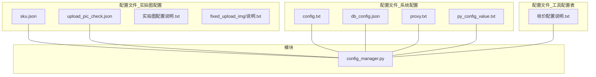
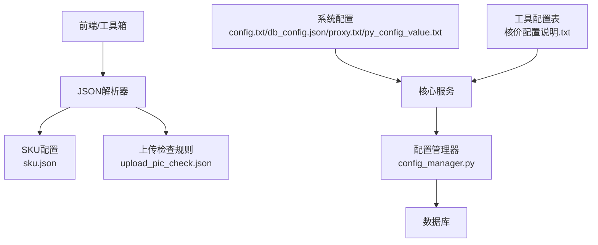
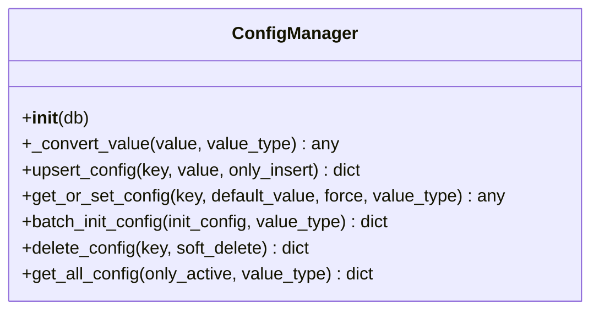
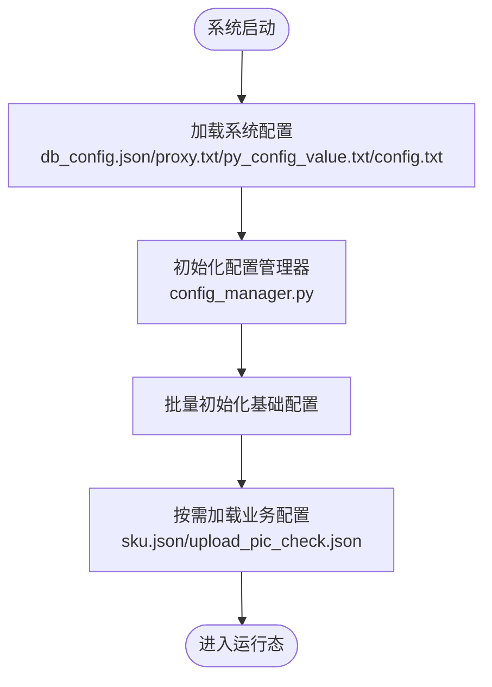

# 文件配置

<cite>
**本文引用的文件**
- [sku.json](file://配置文件_实拍图配置/sku.json)
- [upload_pic_check.json](file://配置文件_实拍图配置/upload_pic_check.json)
- [实拍图配置说明.txt](file://配置文件_实拍图配置/实拍图配置说明.txt)
- [fixed_upload_img/说明.txt](file://配置文件_实拍图配置/fixed_upload_img/说明.txt)
- [config.txt](file://配置文件_系统配置/config.txt)
- [db_config.json](file://配置文件_系统配置/db_config.json)
- [proxy.txt](file://配置文件_系统配置/proxy.txt)
- [py_config_value.txt](file://配置文件_系统配置/py_config_value.txt)
- [核价配置说明.txt](file://配置文件_工具配置表/核价配置说明.txt)
- [config_manager.py](file://modules/config_manager.py)
</cite>

## 目录
1. [简介](#简介)
2. [项目结构](#项目结构)
3. [核心组件](#核心组件)
4. [架构总览](#架构总览)
5. [详细组件分析](#详细组件分析)
6. [依赖关系分析](#依赖关系分析)
7. [性能与可靠性考量](#性能与可靠性考量)
8. [故障排除与验证](#故障排除与验证)
9. [结论](#结论)
10. [附录](#附录)

## 简介
本文件面向“ikun_temu_system”项目中的文件配置体系，重点解释以下三类配置文件的作用、结构与参数含义：
- 实拍图配置：SKU配置与上传实拍图检查规则
- 系统配置：数据库连接、代理、路径与基础参数
- 工具配置表：核价功能的底价与理想价配置

同时提供JSON配置文件的格式规范、编辑与验证方法、配置加载顺序与依赖关系、备份与版本管理策略，以及常见问题的排查与修复建议。

## 项目结构
围绕配置文件的关键目录与文件如下：
- 配置文件_实拍图配置
  - sku.json：SKU标注与描述映射
  - upload_pic_check.json：上传实拍图的异常检测规则
  - 实拍图配置说明.txt：使用说明
  - fixed_upload_img/说明.txt：固定上传图片目录说明
- 配置文件_系统配置
  - config.txt：系统级基础参数（如机器码）
  - db_config.json：数据库连接与池化参数
  - proxy.txt：代理地址
  - py_config_value.txt：路径与端口等系统变量
- 配置文件_工具配置表
  - 核价配置说明.txt：核价底价与理想价配置说明
- modules/config_manager.py：通用配置管理器（支持类型自动转换、热更新）

**图表来源**
- [sku.json:1-338](file://配置文件_实拍图配置/sku.json#L1-L338)
- [upload_pic_check.json:1-48](file://配置文件_实拍图配置/upload_pic_check.json#L1-L48)
- [实拍图配置说明.txt:1-3](file://配置文件_实拍图配置/实拍图配置说明.txt#L1-L3)
- [fixed_upload_img/说明.txt:1-1](file://配置文件_实拍图配置/fixed_upload_img/说明.txt#L1-L1)
- [config.txt:1-4](file://配置文件_系统配置/config.txt#L1-L4)
- [db_config.json:1-19](file://配置文件_系统配置/db_config.json#L1-L19)
- [proxy.txt:1-2](file://配置文件_系统配置/proxy.txt#L1-L2)
- [py_config_value.txt:1-4](file://配置文件_系统配置/py_config_value.txt#L1-L4)
- [核价配置说明.txt:1-5](file://配置文件_工具配置表/核价配置说明.txt#L1-L5)
- [config_manager.py:1-344](file://modules/config_manager.py#L1-L344)

**章节来源**
- [sku.json:1-338](file://配置文件_实拍图配置/sku.json#L1-L338)
- [upload_pic_check.json:1-48](file://配置文件_实拍图配置/upload_pic_check.json#L1-L48)
- [实拍图配置说明.txt:1-3](file://配置文件_实拍图配置/实拍图配置说明.txt#L1-L3)
- [fixed_upload_img/说明.txt:1-1](file://配置文件_实拍图配置/fixed_upload_img/说明.txt#L1-L1)
- [config.txt:1-4](file://配置文件_系统配置/config.txt#L1-L4)
- [db_config.json:1-19](file://配置文件_系统配置/db_config.json#L1-L19)
- [proxy.txt:1-2](file://配置文件_系统配置/proxy.txt#L1-L2)
- [py_config_value.txt:1-4](file://配置文件_系统配置/py_config_value.txt#L1-L4)
- [核价配置说明.txt:1-5](file://配置文件_工具配置表/核价配置说明.txt#L1-L5)
- [config_manager.py:1-344](file://modules/config_manager.py#L1-L344)

## 核心组件
- SKU配置（sku.json）
  - skus：SKU条目数组，每个条目包含标识、名称、描述ID、标注位置与字号等
  - skuDescList：SKU描述映射，包含不同描述ID对应的发货方与制造商信息
- 上传实拍图检查规则（upload_pic_check.json）
  - abnormal_rules：异常规则数组，按图片名匹配主规则与回退规则，含规则状态提示
- 系统配置（config.txt、db_config.json、proxy.txt、py_config_value.txt）
  - config.txt：系统基础参数（如机器码）
  - db_config.json：数据库路径、超时、线程策略、外键、日志模式、缓存、连接池等
  - proxy.txt：代理地址
  - py_config_value.txt：路径与端口等系统变量
- 工具配置表（核价配置说明.txt）
  - 说明如何配置货号-品类-底价与理想价，支持在平台返回价高于理想价时直接通过
- 配置管理器（config_manager.py）
  - 提供统一的配置读写、类型自动转换、批量初始化、软删除与全量导出能力

**章节来源**
- [sku.json:1-338](file://配置文件_实拍图配置/sku.json#L1-L338)
- [upload_pic_check.json:1-48](file://配置文件_实拍图配置/upload_pic_check.json#L1-L48)
- [config.txt:1-4](file://配置文件_系统配置/config.txt#L1-L4)
- [db_config.json:1-19](file://配置文件_系统配置/db_config.json#L1-L19)
- [proxy.txt:1-2](file://配置文件_系统配置/proxy.txt#L1-L2)
- [py_config_value.txt:1-4](file://配置文件_系统配置/py_config_value.txt#L1-L4)
- [核价配置说明.txt:1-5](file://配置文件_工具配置表/核价配置说明.txt#L1-L5)
- [config_manager.py:1-344](file://modules/config_manager.py#L1-L344)

## 架构总览
配置文件在系统中的作用与交互：
- 实拍图配置由前端或工具箱生成，经JSON解析后驱动上传流程与标注显示
- 系统配置为底层基础设施参数，影响数据库连接、代理与路径解析
- 工具配置表支撑业务层逻辑（如核价），决定价格策略
- 配置管理器作为统一入口，负责配置的持久化、类型转换与热更新

**图表来源**
- [config_manager.py:1-344](file://modules/config_manager.py#L1-L344)
- [sku.json:1-338](file://配置文件_实拍图配置/sku.json#L1-L338)
- [upload_pic_check.json:1-48](file://配置文件_实拍图配置/upload_pic_check.json#L1-L48)
- [config.txt:1-4](file://配置文件_系统配置/config.txt#L1-L4)
- [db_config.json:1-19](file://配置文件_系统配置/db_config.json#L1-L19)
- [proxy.txt:1-2](file://配置文件_系统配置/proxy.txt#L1-L2)
- [py_config_value.txt:1-4](file://配置文件_系统配置/py_config_value.txt#L1-L4)
- [核价配置说明.txt:1-5](file://配置文件_工具配置表/核价配置说明.txt#L1-L5)

## 详细组件分析

### 实拍图配置组件
- SKU配置（sku.json）
  - 结构要点
    - skus：数组，元素包含 id、name、descId、positionX、positionY、font_size
    - skuDescList：数组，元素包含 id、oumentRepList、makerRepList
  - 用途
    - 驱动上传实拍图时的标注绘制与描述展示
  - 编辑指南
    - 修改标注位置与字号时，确保数值合理且不遮挡关键信息
    - 更新描述映射时，保持 descId 与 skus 中的 descId 对应
  - 验证方法
    - 使用工具箱“实拍图标注测试”页面进行可视化校验
    - 参考说明文件以确认目录与流程

- 上传实拍图检查规则（upload_pic_check.json）
  - 结构要点
    - abnormal_rules：数组，元素包含 image_name、primary（check_type、rule_status）、fallback（rule_name、rule_status_toast）
  - 用途
    - 在上传实拍图时根据图片名匹配规则，触发异常提示或回退处理
  - 编辑指南
    - 为每张图片维护一条规则，确保 check_type 与 rule_status 含义明确
    - fallback 字段用于兜底提示，便于人工复核
  - 验证方法
    - 上传样张并观察提示是否符合预期
    - 如异常频繁，调整规则或增加新规则项

- 固定上传图片目录（fixed_upload_img）
  - 说明
    - 该目录用于存放固定上传的图片，启动上传任务时可勾选“自定义固定上传图片”
  - 编辑指南
    - 将需要固定上传的图片放入该目录
    - 确保命名与规则匹配，避免重复或冲突

**章节来源**
- [sku.json:1-338](file://配置文件_实拍图配置/sku.json#L1-L338)
- [upload_pic_check.json:1-48](file://配置文件_实拍图配置/upload_pic_check.json#L1-L48)
- [实拍图配置说明.txt:1-3](file://配置文件_实拍图配置/实拍图配置说明.txt#L1-L3)
- [fixed_upload_img/说明.txt:1-1](file://配置文件_实拍图配置/fixed_upload_img/说明.txt#L1-L1)

### 系统配置组件
- config.txt
  - 参数
    - kami：系统标识
    - machine_code：机器码
  - 用途
    - 作为系统基础参数，可能参与授权或设备绑定逻辑

- db_config.json
  - 参数
    - db_path：数据库文件路径
    - timeout：连接超时
    - check_same_thread：线程一致性检查
    - enable_foreign_keys：启用外键约束
    - journal_mode：日志模式（如 WAL）
    - cache_size：缓存大小
    - synchronous：同步级别
    - pool_config：连接池配置（最大/最小连接数、超时、空闲超时、回收周期、预检）
    - debug：调试开关
  - 用途
    - 控制数据库连接行为与性能参数

- proxy.txt
  - 参数
    - socks5://...：代理地址
  - 用途
    - 为网络请求提供代理通道

- py_config_value.txt
  - 参数
    - py_config_value_path：配置文件路径
    - proxy_file_path：代理文件路径
    - api_proxy_file_path：API代理文件路径
    - api_proxy_port：API代理端口
  - 用途
    - 定义系统中关键路径与端口，便于集中管理

**章节来源**
- [config.txt:1-4](file://配置文件_系统配置/config.txt#L1-L4)
- [db_config.json:1-19](file://配置文件_系统配置/db_config.json#L1-L19)
- [proxy.txt:1-2](file://配置文件_系统配置/proxy.txt#L1-L2)
- [py_config_value.txt:1-4](file://配置文件_系统配置/py_config_value.txt#L1-L4)

### 工具配置表组件
- 核价配置说明.txt
  - 内容
    - 说明如何配置货号-品类-底价与理想价
    - 平台返回价高于理想价时可直接通过
  - 用途
    - 为核价流程提供策略依据

**章节来源**
- [核价配置说明.txt:1-5](file://配置文件_工具配置表/核价配置说明.txt#L1-L5)

### 配置管理器组件（config_manager.py）
- 功能概览
  - 类型自动转换：支持 str/int/float/list/dict/tuple/bool
  - 热更新：每次读取均从数据库查询，修改后立即生效
  - 批量初始化：支持一次性写入多条配置
  - 软删除：默认软删除，便于审计与恢复
  - 全量导出：支持导出当前有效配置
- 关键接口
  - upsert_config：插入或更新配置
  - get_or_set_config：查询或设置配置（带类型转换）
  - batch_init_config：批量初始化
  - delete_config：删除配置（软/硬）
  - get_all_config：全量查询
- 使用建议
  - 在启动阶段使用批量初始化写入基础配置
  - 读取配置时明确目标类型，避免隐式转换错误
  - 对敏感配置采用软删除，保留历史记录

**图表来源**
- [config_manager.py:1-344](file://modules/config_manager.py#L1-L344)

**章节来源**
- [config_manager.py:1-344](file://modules/config_manager.py#L1-L344)

## 依赖关系分析
- 配置文件之间的依赖
  - 实拍图配置依赖于工具箱的可视化编辑与上传流程
  - 系统配置为底层基础设施，被核心服务与模块共同依赖
  - 工具配置表服务于业务策略，与核心服务耦合度较低
- 加载顺序建议
  - 系统配置（db_config.json、proxy.txt、py_config_value.txt、config.txt）优先加载
  - 配置管理器随后初始化并批量写入基础配置
  - 业务配置（如 sku.json、upload_pic_check.json）在需要时按需加载
- 外部依赖
  - 数据库：受 db_config.json 影响
  - 网络：受 proxy.txt 与 py_config_value.txt 中的代理与端口影响

**图表来源**
- [db_config.json:1-19](file://配置文件_系统配置/db_config.json#L1-L19)
- [proxy.txt:1-2](file://配置文件_系统配置/proxy.txt#L1-L2)
- [py_config_value.txt:1-4](file://配置文件_系统配置/py_config_value.txt#L1-L4)
- [config.txt:1-4](file://配置文件_系统配置/config.txt#L1-L4)
- [config_manager.py:1-344](file://modules/config_manager.py#L1-L344)
- [sku.json:1-338](file://配置文件_实拍图配置/sku.json#L1-L338)
- [upload_pic_check.json:1-48](file://配置文件_实拍图配置/upload_pic_check.json#L1-L48)

**章节来源**
- [config_manager.py:1-344](file://modules/config_manager.py#L1-L344)
- [db_config.json:1-19](file://配置文件_系统配置/db_config.json#L1-L19)
- [proxy.txt:1-2](file://配置文件_系统配置/proxy.txt#L1-L2)
- [py_config_value.txt:1-4](file://配置文件_系统配置/py_config_value.txt#L1-L4)
- [config.txt:1-4](file://配置文件_系统配置/config.txt#L1-L4)
- [sku.json:1-338](file://配置文件_实拍图配置/sku.json#L1-L338)
- [upload_pic_check.json:1-48](file://配置文件_实拍图配置/upload_pic_check.json#L1-L48)

## 性能与可靠性考量
- 数据库连接池
  - 通过 db_config.json 的 pool_config 调整最大/最小连接数与超时参数，平衡吞吐与资源占用
- 日志与同步
  - journal_mode=WAL 与 synchronous=NORMAL 可提升并发与写入性能
- 代理稳定性
  - proxy.txt 的代理地址需稳定可用，必要时在 py_config_value.txt 中调整端口
- 配置热更新
  - 配置管理器支持热更新，但频繁变更可能带来一致性风险，建议在低峰期操作

[本节为通用指导，无需具体文件来源]

## 故障排除与验证
- JSON格式校验
  - 使用在线JSON校验工具或Python内置json模块进行校验
  - 常见问题：缺少逗号、多余的逗号、引号不闭合、非法字符
- 实拍图配置验证
  - 使用工具箱“实拍图标注测试”页面进行可视化核对
  - 若标注位置异常，检查 positionX/Y 与 font_size
- 规则异常排查
  - 若上传提示异常，检查 upload_pic_check.json 中 image_name 与 primary/fallback 字段
  - 确认 check_type 与 rule_status 的语义与业务一致
- 系统配置核对
  - db_config.json：核对 db_path、timeout、pool_config 等参数
  - proxy.txt：确认代理地址可达
  - py_config_value.txt：核对路径与端口
- 配置管理器操作
  - 使用 get_all_config 导出现有配置，比对期望值
  - 使用 delete_config 进行软删除，保留历史以便回溯

**章节来源**
- [config_manager.py:1-344](file://modules/config_manager.py#L1-L344)
- [upload_pic_check.json:1-48](file://配置文件_实拍图配置/upload_pic_check.json#L1-L48)
- [db_config.json:1-19](file://配置文件_系统配置/db_config.json#L1-L19)
- [proxy.txt:1-2](file://配置文件_系统配置/proxy.txt#L1-L2)
- [py_config_value.txt:1-4](file://配置文件_系统配置/py_config_value.txt#L1-L4)

## 结论
本文件梳理了ikun_temu_system的文件配置体系，明确了实拍图配置、系统配置与工具配置表的作用与结构，并提供了编辑、验证与故障排除的方法。通过配置管理器实现的类型转换与热更新，可进一步提升配置的灵活性与可维护性。建议在生产环境中建立完善的备份与版本管理策略，确保配置变更可追溯、可回滚。

[本节为总结，无需具体文件来源]

## 附录
- 配置文件备份与版本管理策略
  - 建议对关键配置文件（如 sku.json、upload_pic_check.json、db_config.json、proxy.txt、py_config_value.txt）进行版本化管理
  - 使用Git或SVN记录变更历史，每次变更附带简要说明
  - 在变更前生成快照，变更后进行回归验证
- 配置加载与验证清单
  - 系统配置：核对路径、代理、端口、数据库参数
  - 业务配置：核对JSON格式、字段完整性、业务语义
  - 配置管理器：核对热更新与类型转换行为

[本节为通用指导，无需具体文件来源]