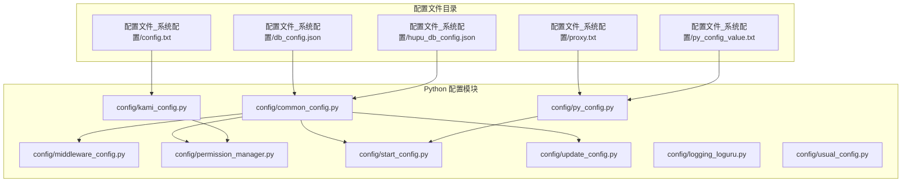
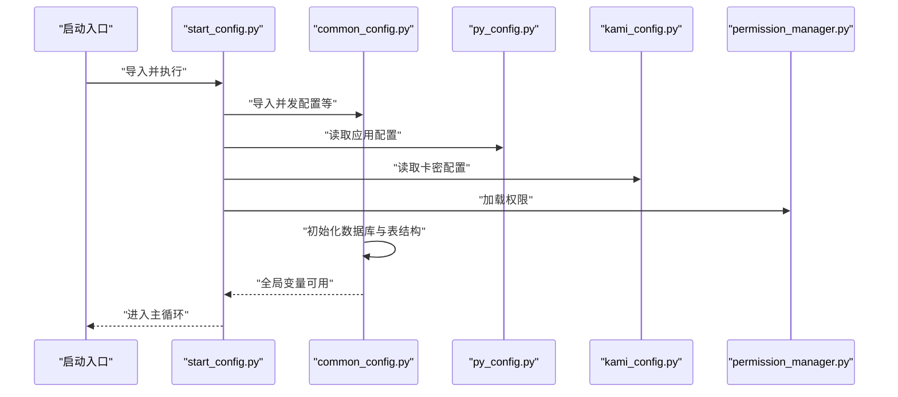
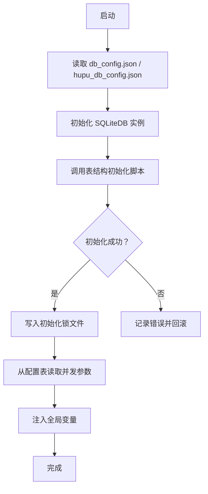
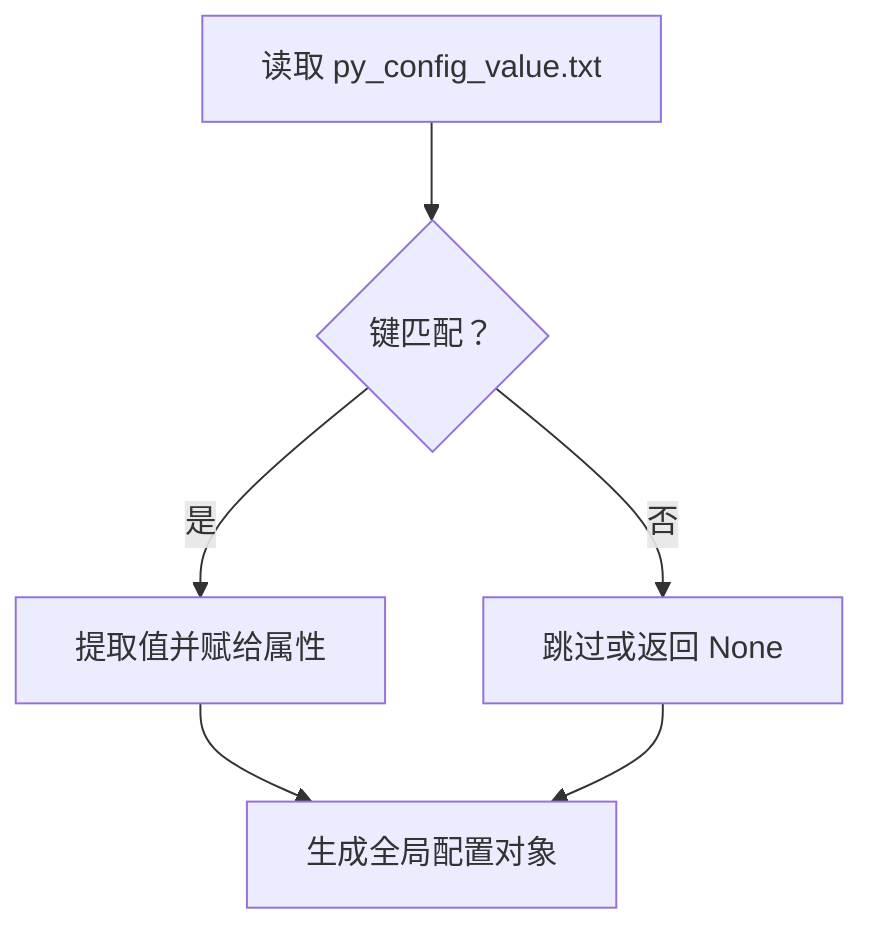
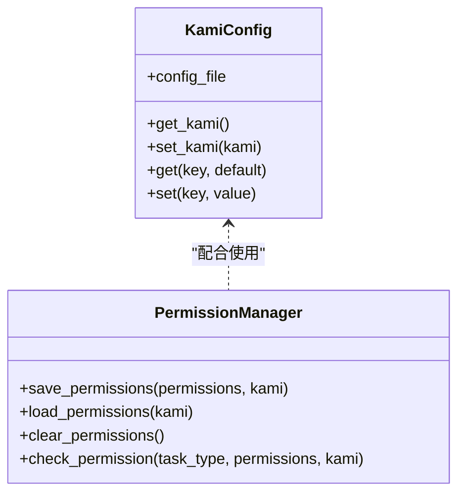
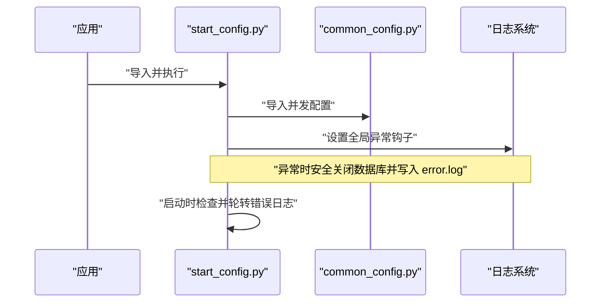
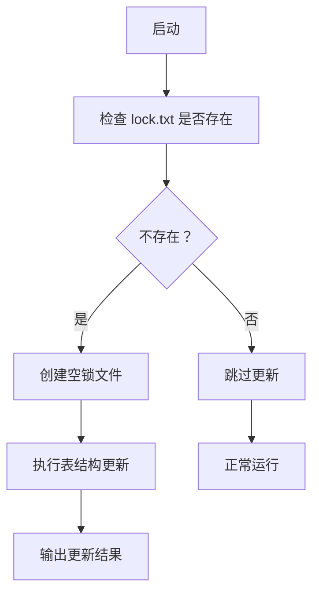
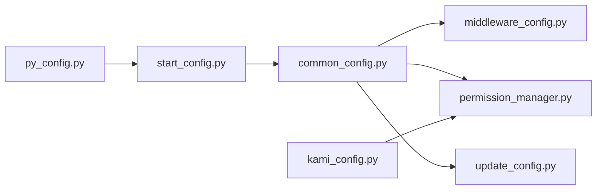

# 配置文件使用指南

<cite>
**本文档引用的文件**
- [common_config.py](file://config/common_config.py)
- [middleware_config.py](file://config/middleware_config.py)
- [py_config.py](file://config/py_config.py)
- [start_config.py](file://config/start_config.py)
- [update_config.py](file://config/update_config.py)
- [usual_config.py](file://config/usual_config.py)
- [kami_config.py](file://config/kami_config.py)
- [permission_manager.py](file://config/permission_manager.py)
- [logging_loguru.py](file://config/logging_loguru.py)
- [lock.txt](file://config/lock.txt)
- [config.txt](file://配置文件_系统配置/config.txt)
- [db_config.json](file://配置文件_系统配置/db_config.json)
- [hupu_db_config.json](file://配置文件_系统配置/hupu_db_config.json)
- [proxy.txt](file://配置文件_系统配置/proxy.txt)
- [py_config_value.txt](file://配置文件_系统配置/py_config_value.txt)
</cite>

## 目录
1. [简介](#简介)
2. [项目结构](#项目结构)
3. [核心组件](#核心组件)
4. [架构总览](#架构总览)
5. [详细组件分析](#详细组件分析)
6. [依赖关系分析](#依赖关系分析)
7. [性能考虑](#性能考虑)
8. [故障排除指南](#故障排除指南)
9. [结论](#结论)
10. [附录](#附录)

## 简介
本指南面向使用者与维护者，系统讲解本项目的配置文件体系与使用方法，涵盖以下主题：
- 配置文件的整体使用流程与最佳实践
- 编辑方法、验证步骤与备份策略
- 配置文件之间的依赖关系与加载顺序
- 故障排除方法与技巧
- 版本管理与升级指南
- 安全性与权限控制

## 项目结构
本项目采用“配置文件目录 + Python 配置模块”的双层配置架构：
- 配置文件目录：集中存放 JSON、TXT 等纯文本配置，便于手工编辑与版本控制
- Python 配置模块：负责解析、校验、注入全局变量，供业务模块按需导入

图表来源
- [common_config.py:1-394](file://config/common_config.py#L1-L394)
- [middleware_config.py:1-13](file://config/middleware_config.py#L1-L13)
- [py_config.py:1-93](file://config/py_config.py#L1-L93)
- [kami_config.py:1-56](file://config/kami_config.py#L1-L56)
- [permission_manager.py:1-126](file://config/permission_manager.py#L1-L126)
- [start_config.py:1-161](file://config/start_config.py#L1-L161)
- [update_config.py:1-23](file://config/update_config.py#L1-L23)
- [logging_loguru.py:1-131](file://config/logging_loguru.py#L1-L131)
- [usual_config.py:1-1](file://config/usual_config.py#L1-L1)
- [config.txt:1-4](file://配置文件_系统配置/config.txt#L1-L4)
- [db_config.json:1-19](file://配置文件_系统配置/db_config.json#L1-L19)
- [hupu_db_config.json:1-18](file://配置文件_系统配置/hupu_db_config.json#L1-L18)
- [proxy.txt:1-2](file://配置文件_系统配置/proxy.txt#L1-L2)
- [py_config_value.txt:1-4](file://配置文件_系统配置/py_config_value.txt#L1-L4)

章节来源
- [common_config.py:1-394](file://config/common_config.py#L1-L394)
- [py_config.py:1-93](file://config/py_config.py#L1-L93)
- [kami_config.py:1-56](file://config/kami_config.py#L1-L56)
- [permission_manager.py:1-126](file://config/permission_manager.py#L1-L126)
- [start_config.py:1-161](file://config/start_config.py#L1-L161)
- [update_config.py:1-23](file://config/update_config.py#L1-L23)
- [logging_loguru.py:1-131](file://config/logging_loguru.py#L1-L131)
- [usual_config.py:1-1](file://config/usual_config.py#L1-L1)
- [config.txt:1-4](file://配置文件_系统配置/config.txt#L1-L4)
- [db_config.json:1-19](file://配置文件_系统配置/db_config.json#L1-L19)
- [hupu_db_config.json:1-18](file://配置文件_系统配置/hupu_db_config.json#L1-L18)
- [proxy.txt:1-2](file://配置文件_系统配置/proxy.txt#L1-L2)
- [py_config_value.txt:1-4](file://配置文件_系统配置/py_config_value.txt#L1-L4)

## 核心组件
- 数据库配置与初始化
  - 通过 JSON 文件定义数据库路径、连接池、同步模式等参数；Python 模块负责读取并初始化数据库连接与表结构
- 卡密与许可配置
  - 卡密配置文件用于保存许可信息；权限管理器基于数据库中的权限记录进行访问控制
- 应用配置与运行参数
  - 通过 TXT 文件定义应用端口、代理路径等；Python 模块解析后注入全局变量供业务使用
- 日志与异常处理
  - 提供与 loguru 风格一致的彩色日志输出；启动阶段进行异常捕获与日志轮转

章节来源
- [common_config.py:157-334](file://config/common_config.py#L157-L334)
- [kami_config.py:6-56](file://config/kami_config.py#L6-L56)
- [permission_manager.py:12-126](file://config/permission_manager.py#L12-L126)
- [py_config.py:4-85](file://config/py_config.py#L4-L85)
- [logging_loguru.py:83-119](file://config/logging_loguru.py#L83-L119)
- [start_config.py:27-106](file://config/start_config.py#L27-L106)

## 架构总览
下图展示配置文件与 Python 模块的交互关系及加载顺序：

图表来源
- [start_config.py:12-24](file://config/start_config.py#L12-L24)
- [common_config.py:245-334](file://config/common_config.py#L245-L334)
- [py_config.py:32-85](file://config/py_config.py#L32-L85)
- [kami_config.py:11-56](file://config/kami_config.py#L11-L56)
- [permission_manager.py:58-122](file://config/permission_manager.py#L58-L122)

## 详细组件分析

### 数据库配置与初始化（common_config.py）
- 功能要点
  - 统一管理数据库连接与表结构初始化
  - 支持主数据库与虎扑数据库的分离
  - 提供数据库安全关闭与 WAL 合并
  - 从配置表读取并发参数并注入全局变量
- 关键流程
  - 读取 JSON 配置文件，初始化 SQLiteDB
  - 调用数据库表结构初始化脚本
  - 写入初始化锁文件，避免重复初始化
- 并发配置
  - 全局并发上限与各类任务的并发限制均来自配置表

图表来源
- [common_config.py:197-334](file://config/common_config.py#L197-L334)

章节来源
- [common_config.py:15-147](file://config/common_config.py#L15-L147)
- [common_config.py:157-334](file://config/common_config.py#L157-L334)

### 应用配置解析（py_config.py）
- 功能要点
  - 解析 py_config_value.txt，读取端口、代理路径等键值
  - 生成版本号工具函数
  - 提供全局配置对象供其他模块导入
- 配置项
  - 端口、代理文件路径、API 域名、静态令牌、版本号等

图表来源
- [py_config.py:32-85](file://config/py_config.py#L32-L85)

章节来源
- [py_config.py:4-85](file://config/py_config.py#L4-L85)
- [py_config_value.txt:1-4](file://配置文件_系统配置/py_config_value.txt#L1-L4)

### 卡密与权限配置（kami_config.py、permission_manager.py）
- 卡密配置
  - JSON 文件保存卡密与扩展键值
  - 提供读取与写入接口
- 权限管理
  - 权限保存在数据库配置表中
  - 支持保存、加载、清除与权限检查
  - 与卡密配置协同工作

图表来源
- [kami_config.py:6-56](file://config/kami_config.py#L6-L56)
- [permission_manager.py:12-126](file://config/permission_manager.py#L12-L126)

章节来源
- [kami_config.py:6-56](file://config/kami_config.py#L6-L56)
- [permission_manager.py:12-126](file://config/permission_manager.py#L12-L126)
- [config.txt:1-4](file://配置文件_系统配置/config.txt#L1-L4)

### 启动与异常处理（start_config.py）
- 功能要点
  - 启动主任务管理器
  - 全局异常捕获与日志轮转
  - 启动时检查错误日志数量并进行轮转
- 关键行为
  - 在异常时安全关闭数据库并合并 WAL
  - 读取配置表中的最大错误日志条数

图表来源
- [start_config.py:19-106](file://config/start_config.py#L19-L106)
- [common_config.py:59-135](file://config/common_config.py#L59-L135)

章节来源
- [start_config.py:19-161](file://config/start_config.py#L19-L161)

### 配置更新与迁移（update_config.py）
- 功能要点
  - 检查初始化锁文件，首次运行时执行表结构更新
  - 更新商店与任务相关表结构
- 注意事项
  - 更新成功会输出确认信息
  - 建议在更新前备份数据库

图表来源
- [update_config.py:7-23](file://config/update_config.py#L7-L23)
- [lock.txt:1-1](file://config/lock.txt#L1-L1)

章节来源
- [update_config.py:1-23](file://config/update_config.py#L1-L23)
- [lock.txt:1-1](file://config/lock.txt#L1-L1)

### 日志与通用配置（logging_loguru.py、usual_config.py）
- 日志系统
  - 提供与 loguru 风格一致的彩色日志输出
  - 支持控制台与文件输出
- 通用配置
  - 提供页面大小等常量

章节来源
- [logging_loguru.py:83-119](file://config/logging_loguru.py#L83-L119)
- [usual_config.py:1-1](file://config/usial_config.py#L1-L1)

## 依赖关系分析
- 模块耦合
  - common_config.py 是核心，被 middleware_config.py、start_config.py、permission_manager.py 等广泛依赖
  - py_config.py 与 kami_config.py 相对独立，分别负责应用配置与许可配置
- 加载顺序
  - 启动阶段：start_config.py → common_config.py → 其他模块
  - 配置读取：py_config_value.txt → py_config.py → 全局变量注入
  - 权限与许可：config.txt → kami_config.py → permission_manager.py

图表来源
- [start_config.py:12-24](file://config/start_config.py#L12-L24)
- [common_config.py:245-334](file://config/common_config.py#L245-L334)
- [middleware_config.py:2-6](file://config/middleware_config.py#L2-L6)
- [permission_manager.py:25-122](file://config/permission_manager.py#L25-L122)
- [py_config.py:32-85](file://config/py_config.py#L32-L85)
- [kami_config.py:11-56](file://config/kami_config.py#L11-L56)
- [update_config.py:7-23](file://config/update_config.py#L7-L23)

章节来源
- [start_config.py:12-24](file://config/start_config.py#L12-L24)
- [common_config.py:245-334](file://config/common_config.py#L245-L334)
- [middleware_config.py:2-6](file://config/middleware_config.py#L2-L6)
- [permission_manager.py:25-122](file://config/permission_manager.py#L25-L122)
- [py_config.py:32-85](file://config/py_config.py#L32-L85)
- [kami_config.py:11-56](file://config/kami_config.py#L11-L56)
- [update_config.py:7-23](file://config/update_config.py#L7-L23)

## 性能考虑
- 数据库连接池
  - 通过 JSON 配置文件设置连接池参数，建议结合实际并发需求调整最大连接数与超时时间
- WAL 模式与同步级别
  - WAL 模式提升并发读写性能；同步级别可权衡性能与可靠性
- 并发控制
  - 全局并发上限与任务级并发限制来自配置表，建议根据硬件资源与目标系统负载进行调优

章节来源
- [db_config.json:1-19](file://配置文件_系统配置/db_config.json#L1-L19)
- [hupu_db_config.json:1-18](file://配置文件_系统配置/hupu_db_config.json#L1-L18)
- [common_config.py:148-153](file://config/common_config.py#L148-L153)

## 故障排除指南
- 数据库无法初始化
  - 检查数据库配置文件是否存在且格式正确
  - 确认数据库文件路径可写
  - 删除初始化锁文件后重启，触发重新初始化
- 权限不足导致功能不可用
  - 检查数据库中的权限记录
  - 确认卡密配置有效
- 启动异常与日志过多
  - 查看 error.log 并进行轮转
  - 调整最大错误日志条数配置
- 代理配置问题
  - 检查代理文件路径与格式
  - 确认代理服务可用

章节来源
- [lock.txt:1-1](file://config/lock.txt#L1-L1)
- [permission_manager.py:58-122](file://config/permission_manager.py#L58-L122)
- [start_config.py:109-151](file://config/start_config.py#L109-L151)
- [proxy.txt:1-2](file://配置文件_系统配置/proxy.txt#L1-L2)

## 结论
本项目的配置体系通过“纯文本配置 + Python 解析模块”的方式实现了清晰的职责分离与良好的可维护性。遵循本文档的编辑、验证、备份与升级流程，可显著降低配置变更带来的风险，并提升系统的稳定性与安全性。

## 附录

### 配置文件清单与用途
- 配置文件_系统配置/db_config.json：主数据库连接与池配置
- 配置文件_系统配置/hupu_db_config.json：虎扑数据库连接与池配置
- 配置文件_系统配置/config.txt：卡密与机器码等许可信息
- 配置文件_系统配置/proxy.txt：代理服务器地址
- 配置文件_系统配置/py_config_value.txt：应用端口、代理路径等键值

章节来源
- [db_config.json:1-19](file://配置文件_系统配置/db_config.json#L1-L19)
- [hupu_db_config.json:1-18](file://配置文件_系统配置/hupu_db_config.json#L1-L18)
- [config.txt:1-4](file://配置文件_系统配置/config.txt#L1-L4)
- [proxy.txt:1-2](file://配置文件_系统配置/proxy.txt#L1-L2)
- [py_config_value.txt:1-4](file://配置文件_系统配置/py_config_value.txt#L1-L4)

### 编辑方法与验证步骤
- 编辑方法
  - 使用文本编辑器打开相应配置文件进行修改
  - 修改后保存并确保文件编码为 UTF-8
- 验证步骤
  - 重启应用，观察日志输出确认配置生效
  - 对数据库配置，可通过连接测试验证
  - 对权限配置，可通过功能模块进行访问测试

### 备份策略
- 数据库备份
  - 在更新前备份数据库文件与配置文件
  - 使用数据库自带的备份机制或复制文件方式
- 配置文件备份
  - 将配置文件目录纳入版本控制或定期归档
  - 对关键配置（如卡密、代理）进行加密存储或最小化暴露

### 版本管理与升级指南
- 版本号生成
  - 使用内置版本号生成函数，按日期生成版本号
- 升级流程
  - 备份当前配置与数据库
  - 应用新版本配置文件
  - 运行配置更新脚本以适配新结构
  - 验证功能正常后清理历史日志

章节来源
- [py_config.py:64-81](file://config/py_config.py#L64-L81)
- [update_config.py:7-23](file://config/update_config.py#L7-L23)

### 安全性与权限控制
- 权限控制
  - 权限保存在数据库配置表中，通过权限管理器进行检查
  - 卡密配置用于许可校验，建议妥善保管
- 日志与异常
  - 提供彩色日志输出，便于审计
  - 启动阶段进行异常捕获与日志轮转，避免日志膨胀

章节来源
- [permission_manager.py:12-126](file://config/permission_manager.py#L12-L126)
- [kami_config.py:6-56](file://config/kami_config.py#L6-L56)
- [logging_loguru.py:83-119](file://config/logging_loguru.py#L83-L119)
- [start_config.py:27-106](file://config/start_config.py#L27-L106)