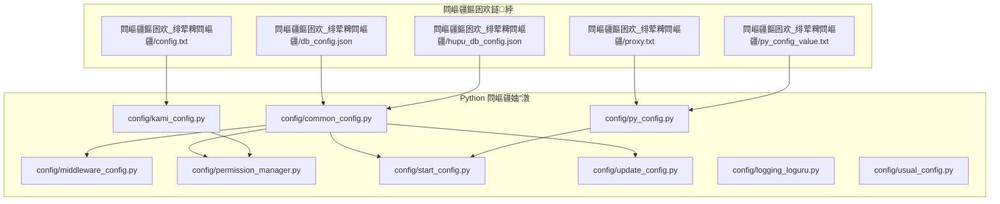
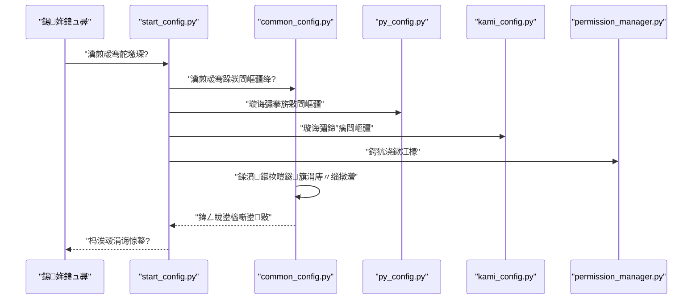
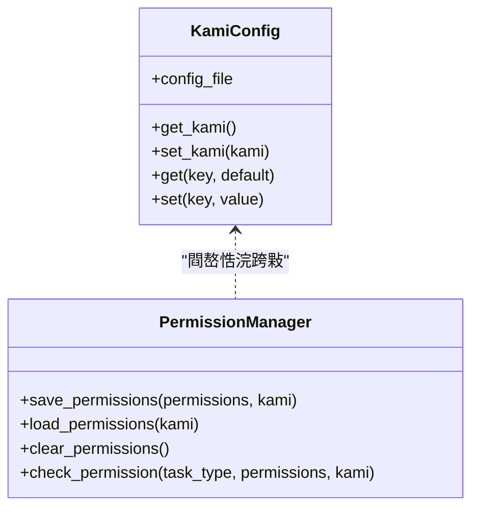
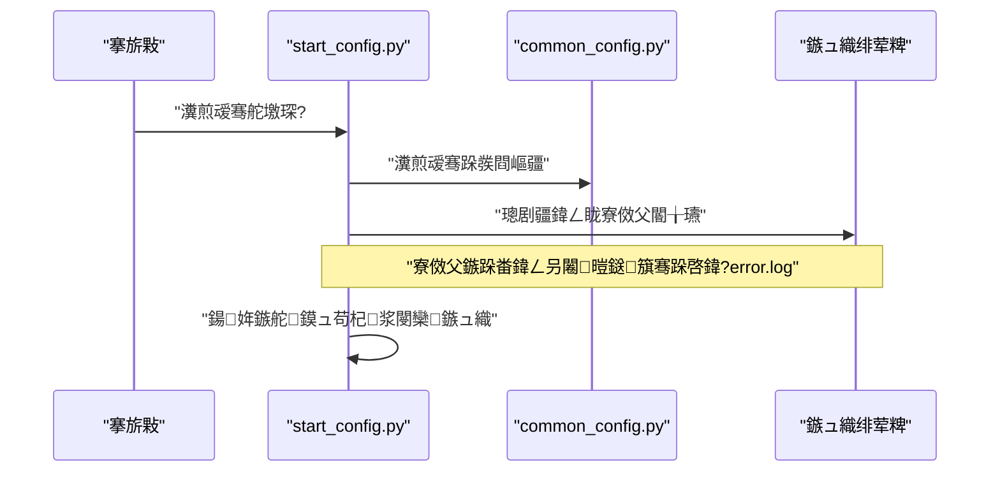
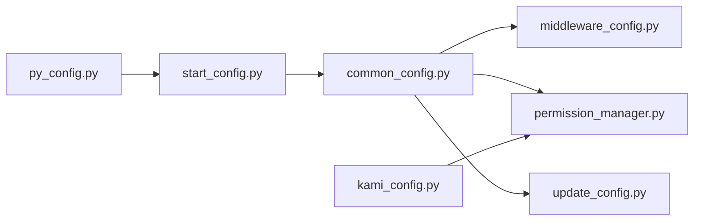

# 閰嶇疆鏂囦欢浣跨敤鎸囧崡

<cite>
**鏈枃妗ｅ紩鐢ㄧ殑鏂囦欢**
- [common_config.py](file://config/common_config.py)
- [middleware_config.py](file://config/middleware_config.py)
- [py_config.py](file://config/py_config.py)
- [start_config.py](file://config/start_config.py)
- [update_config.py](file://config/update_config.py)
- [usual_config.py](file://config/usual_config.py)
- [kami_config.py](file://config/kami_config.py)
- [permission_manager.py](file://config/permission_manager.py)
- [logging_loguru.py](file://config/logging_loguru.py)
- [lock.txt](file://config/lock.txt)
- [config.txt](file://閰嶇疆鏂囦欢_绯荤粺閰嶇疆/config.txt)
- [db_config.json](file://閰嶇疆鏂囦欢_绯荤粺閰嶇疆/db_config.json)
- [hupu_db_config.json](file://閰嶇疆鏂囦欢_绯荤粺閰嶇疆/hupu_db_config.json)
- [proxy.txt](file://閰嶇疆鏂囦欢_绯荤粺閰嶇疆/proxy.txt)
- [py_config_value.txt](file://閰嶇疆鏂囦欢_绯荤粺閰嶇疆/py_config_value.txt)
</cite>

## 鐩綍
1. [绠€浠媇(#绠€浠?
2. [椤圭洰缁撴瀯](#椤圭洰缁撴瀯)
3. [鏍稿績缁勪欢](#鏍稿績缁勪欢)
4. [鏋舵瀯鎬昏](#鏋舵瀯鎬昏)
5. [璇︾粏缁勪欢鍒嗘瀽](#璇︾粏缁勪欢鍒嗘瀽)
6. [渚濊禆鍏崇郴鍒嗘瀽](#渚濊禆鍏崇郴鍒嗘瀽)
7. [鎬ц兘鑰冭檻](#鎬ц兘鑰冭檻)
8. [鏁呴殰鎺掗櫎鎸囧崡](#鏁呴殰鎺掗櫎鎸囧崡)
9. [缁撹](#缁撹)
10. [闄勫綍](#闄勫綍)

## 绠€浠?鏈寚鍗楅潰鍚戜娇鐢ㄨ€呬笌缁存姢鑰咃紝绯荤粺璁茶В鏈」鐩殑閰嶇疆鏂囦欢浣撶郴涓庝娇鐢ㄦ柟娉曪紝娑电洊浠ヤ笅涓婚锛?- 閰嶇疆鏂囦欢鐨勬暣浣撲娇鐢ㄦ祦绋嬩笌鏈€浣冲疄璺?- 缂栬緫鏂规硶銆侀獙璇佹楠や笌澶囦唤绛栫暐
- 閰嶇疆鏂囦欢涔嬮棿鐨勪緷璧栧叧绯讳笌鍔犺浇椤哄簭
- 鏁呴殰鎺掗櫎鏂规硶涓庢妧宸?- 鐗堟湰绠＄悊涓庡崌绾ф寚鍗?- 瀹夊叏鎬т笌鏉冮檺鎺у埗

## 椤圭洰缁撴瀯
鏈」鐩噰鐢ㄢ€滈厤缃枃浠剁洰褰?+ Python 閰嶇疆妯″潡鈥濈殑鍙屽眰閰嶇疆鏋舵瀯锛?- 閰嶇疆鏂囦欢鐩綍锛氶泦涓瓨鏀?JSON銆乀XT 绛夌函鏂囨湰閰嶇疆锛屼究浜庢墜宸ョ紪杈戜笌鐗堟湰鎺у埗
- Python 閰嶇疆妯″潡锛氳礋璐ｈВ鏋愩€佹牎楠屻€佹敞鍏ュ叏灞€鍙橀噺锛屼緵涓氬姟妯″潡鎸夐渶瀵煎叆



鍥捐〃鏉ユ簮
- [common_config.py:1-394](file://config/common_config.py#L1-L394)
- [middleware_config.py:1-13](file://config/middleware_config.py#L1-L13)
- [py_config.py:1-93](file://config/py_config.py#L1-L93)
- [kami_config.py:1-56](file://config/kami_config.py#L1-L56)
- [permission_manager.py:1-126](file://config/permission_manager.py#L1-L126)
- [start_config.py:1-161](file://config/start_config.py#L1-L161)
- [update_config.py:1-23](file://config/update_config.py#L1-L23)
- [logging_loguru.py:1-131](file://config/logging_loguru.py#L1-L131)
- [usual_config.py:1-1](file://config/usual_config.py#L1-L1)
- [config.txt:1-4](file://閰嶇疆鏂囦欢_绯荤粺閰嶇疆/config.txt#L1-L4)
- [db_config.json:1-19](file://閰嶇疆鏂囦欢_绯荤粺閰嶇疆/db_config.json#L1-L19)
- [hupu_db_config.json:1-18](file://閰嶇疆鏂囦欢_绯荤粺閰嶇疆/hupu_db_config.json#L1-L18)
- [proxy.txt:1-2](file://閰嶇疆鏂囦欢_绯荤粺閰嶇疆/proxy.txt#L1-L2)
- [py_config_value.txt:1-4](file://閰嶇疆鏂囦欢_绯荤粺閰嶇疆/py_config_value.txt#L1-L4)

绔犺妭鏉ユ簮
- [common_config.py:1-394](file://config/common_config.py#L1-L394)
- [py_config.py:1-93](file://config/py_config.py#L1-L93)
- [kami_config.py:1-56](file://config/kami_config.py#L1-L56)
- [permission_manager.py:1-126](file://config/permission_manager.py#L1-L126)
- [start_config.py:1-161](file://config/start_config.py#L1-L161)
- [update_config.py:1-23](file://config/update_config.py#L1-L23)
- [logging_loguru.py:1-131](file://config/logging_loguru.py#L1-L131)
- [usual_config.py:1-1](file://config/usual_config.py#L1-L1)
- [config.txt:1-4](file://閰嶇疆鏂囦欢_绯荤粺閰嶇疆/config.txt#L1-L4)
- [db_config.json:1-19](file://閰嶇疆鏂囦欢_绯荤粺閰嶇疆/db_config.json#L1-L19)
- [hupu_db_config.json:1-18](file://閰嶇疆鏂囦欢_绯荤粺閰嶇疆/hupu_db_config.json#L1-L18)
- [proxy.txt:1-2](file://閰嶇疆鏂囦欢_绯荤粺閰嶇疆/proxy.txt#L1-L2)
- [py_config_value.txt:1-4](file://閰嶇疆鏂囦欢_绯荤粺閰嶇疆/py_config_value.txt#L1-L4)

## 鏍稿績缁勪欢
- 鏁版嵁搴撻厤缃笌鍒濆鍖?  - 閫氳繃 JSON 鏂囦欢瀹氫箟鏁版嵁搴撹矾寰勩€佽繛鎺ユ睜銆佸悓姝ユā寮忕瓑鍙傛暟锛汸ython 妯″潡璐熻矗璇诲彇骞跺垵濮嬪寲鏁版嵁搴撹繛鎺ヤ笌琛ㄧ粨鏋?- 鍗″瘑涓庤鍙厤缃?  - 鍗″瘑閰嶇疆鏂囦欢鐢ㄤ簬淇濆瓨璁稿彲淇℃伅锛涙潈闄愮鐞嗗櫒鍩轰簬鏁版嵁搴撲腑鐨勬潈闄愯褰曡繘琛岃闂帶鍒?- 搴旂敤閰嶇疆涓庤繍琛屽弬鏁?  - 閫氳繃 TXT 鏂囦欢瀹氫箟搴旂敤绔彛銆佷唬鐞嗚矾寰勭瓑锛汸ython 妯″潡瑙ｆ瀽鍚庢敞鍏ュ叏灞€鍙橀噺渚涗笟鍔′娇鐢?- 鏃ュ織涓庡紓甯稿鐞?  - 鎻愪緵涓?loguru 椋庢牸涓€鑷寸殑褰╄壊鏃ュ織杈撳嚭锛涘惎鍔ㄩ樁娈佃繘琛屽紓甯告崟鑾蜂笌鏃ュ織杞浆

绔犺妭鏉ユ簮
- [common_config.py:157-334](file://config/common_config.py#L157-L334)
- [kami_config.py:6-56](file://config/kami_config.py#L6-L56)
- [permission_manager.py:12-126](file://config/permission_manager.py#L12-L126)
- [py_config.py:4-85](file://config/py_config.py#L4-L85)
- [logging_loguru.py:83-119](file://config/logging_loguru.py#L83-L119)
- [start_config.py:27-106](file://config/start_config.py#L27-L106)

## 鏋舵瀯鎬昏
涓嬪浘灞曠ず閰嶇疆鏂囦欢涓?Python 妯″潡鐨勪氦浜掑叧绯诲強鍔犺浇椤哄簭锛?


鍥捐〃鏉ユ簮
- [start_config.py:12-24](file://config/start_config.py#L12-L24)
- [common_config.py:245-334](file://config/common_config.py#L245-L334)
- [py_config.py:32-85](file://config/py_config.py#L32-L85)
- [kami_config.py:11-56](file://config/kami_config.py#L11-L56)
- [permission_manager.py:58-122](file://config/permission_manager.py#L58-L122)

## 璇︾粏缁勪欢鍒嗘瀽

### 鏁版嵁搴撻厤缃笌鍒濆鍖栵紙common_config.py锛?- 鍔熻兘瑕佺偣
  - 缁熶竴绠＄悊鏁版嵁搴撹繛鎺ヤ笌琛ㄧ粨鏋勫垵濮嬪寲
  - 鏀寔涓绘暟鎹簱涓庤檸鎵戞暟鎹簱鐨勫垎绂?  - 鎻愪緵鏁版嵁搴撳畨鍏ㄥ叧闂笌 WAL 鍚堝苟
  - 浠庨厤缃〃璇诲彇骞跺彂鍙傛暟骞舵敞鍏ュ叏灞€鍙橀噺
- 鍏抽敭娴佺▼
  - 璇诲彇 JSON 閰嶇疆鏂囦欢锛屽垵濮嬪寲 SQLiteDB
  - 璋冪敤鏁版嵁搴撹〃缁撴瀯鍒濆鍖栬剼鏈?  - 鍐欏叆鍒濆鍖栭攣鏂囦欢锛岄伩鍏嶉噸澶嶅垵濮嬪寲
- 骞跺彂閰嶇疆
  - 鍏ㄥ眬骞跺彂涓婇檺涓庡悇绫讳换鍔＄殑骞跺彂闄愬埗鍧囨潵鑷厤缃〃

```mermaid
flowchart TD
A["鍚姩"] --> B["璇诲彇 db_config.json / hupu_db_config.json"]
B --> C["鍒濆鍖?SQLiteDB 瀹炰緥"]
C --> D["璋冪敤琛ㄧ粨鏋勫垵濮嬪寲鑴氭湰"]
D --> E{"鍒濆鍖栨垚鍔燂紵"}
E -- "鏄? --> F["鍐欏叆鍒濆鍖栭攣鏂囦欢"]
E -- "鍚? --> G["璁板綍閿欒骞跺洖婊?]
F --> H["浠庨厤缃〃璇诲彇骞跺彂鍙傛暟"]
H --> I["娉ㄥ叆鍏ㄥ眬鍙橀噺"]
I --> J["瀹屾垚"]
```

鍥捐〃鏉ユ簮
- [common_config.py:197-334](file://config/common_config.py#L197-L334)

绔犺妭鏉ユ簮
- [common_config.py:15-147](file://config/common_config.py#L15-L147)
- [common_config.py:157-334](file://config/common_config.py#L157-L334)

### 搴旂敤閰嶇疆瑙ｆ瀽锛坧y_config.py锛?- 鍔熻兘瑕佺偣
  - 瑙ｆ瀽 py_config_value.txt锛岃鍙栫鍙ｃ€佷唬鐞嗚矾寰勭瓑閿€?  - 鐢熸垚鐗堟湰鍙峰伐鍏峰嚱鏁?  - 鎻愪緵鍏ㄥ眬閰嶇疆瀵硅薄渚涘叾浠栨ā鍧楀鍏?- 閰嶇疆椤?  - 绔彛銆佷唬鐞嗘枃浠惰矾寰勩€丄PI 鍩熷悕銆侀潤鎬佷护鐗屻€佺増鏈彿绛?
```mermaid
flowchart TD
A["璇诲彇 py_config_value.txt"] --> B{"閿尮閰嶏紵"}
B -- "鏄? --> C["鎻愬彇鍊煎苟璧嬬粰灞炴€?]
B -- "鍚? --> D["璺宠繃鎴栬繑鍥?None"]
C --> E["鐢熸垚鍏ㄥ眬閰嶇疆瀵硅薄"]
D --> E
```

鍥捐〃鏉ユ簮
- [py_config.py:32-85](file://config/py_config.py#L32-L85)

绔犺妭鏉ユ簮
- [py_config.py:4-85](file://config/py_config.py#L4-L85)
- [py_config_value.txt:1-4](file://閰嶇疆鏂囦欢_绯荤粺閰嶇疆/py_config_value.txt#L1-L4)

### 鍗″瘑涓庢潈闄愰厤缃紙kami_config.py銆乸ermission_manager.py锛?- 鍗″瘑閰嶇疆
  - JSON 鏂囦欢淇濆瓨鍗″瘑涓庢墿灞曢敭鍊?  - 鎻愪緵璇诲彇涓庡啓鍏ユ帴鍙?- 鏉冮檺绠＄悊
  - 鏉冮檺淇濆瓨鍦ㄦ暟鎹簱閰嶇疆琛ㄤ腑
  - 鏀寔淇濆瓨銆佸姞杞姐€佹竻闄や笌鏉冮檺妫€鏌?  - 涓庡崱瀵嗛厤缃崗鍚屽伐浣?


鍥捐〃鏉ユ簮
- [kami_config.py:6-56](file://config/kami_config.py#L6-L56)
- [permission_manager.py:12-126](file://config/permission_manager.py#L12-L126)

绔犺妭鏉ユ簮
- [kami_config.py:6-56](file://config/kami_config.py#L6-L56)
- [permission_manager.py:12-126](file://config/permission_manager.py#L12-L126)
- [config.txt:1-4](file://閰嶇疆鏂囦欢_绯荤粺閰嶇疆/config.txt#L1-L4)

### 鍚姩涓庡紓甯稿鐞嗭紙start_config.py锛?- 鍔熻兘瑕佺偣
  - 鍚姩涓讳换鍔＄鐞嗗櫒
  - 鍏ㄥ眬寮傚父鎹曡幏涓庢棩蹇楄疆杞?  - 鍚姩鏃舵鏌ラ敊璇棩蹇楁暟閲忓苟杩涜杞浆
- 鍏抽敭琛屼负
  - 鍦ㄥ紓甯告椂瀹夊叏鍏抽棴鏁版嵁搴撳苟鍚堝苟 WAL
  - 璇诲彇閰嶇疆琛ㄤ腑鐨勬渶澶ч敊璇棩蹇楁潯鏁?


鍥捐〃鏉ユ簮
- [start_config.py:19-106](file://config/start_config.py#L19-L106)
- [common_config.py:59-135](file://config/common_config.py#L59-L135)

绔犺妭鏉ユ簮
- [start_config.py:19-161](file://config/start_config.py#L19-L161)

### 閰嶇疆鏇存柊涓庤縼绉伙紙update_config.py锛?- 鍔熻兘瑕佺偣
  - 妫€鏌ュ垵濮嬪寲閿佹枃浠讹紝棣栨杩愯鏃舵墽琛岃〃缁撴瀯鏇存柊
  - 鏇存柊鍟嗗簵涓庝换鍔＄浉鍏宠〃缁撴瀯
- 娉ㄦ剰浜嬮」
  - 鏇存柊鎴愬姛浼氳緭鍑虹‘璁や俊鎭?  - 寤鸿鍦ㄦ洿鏂板墠澶囦唤鏁版嵁搴?
```mermaid
flowchart TD
A["鍚姩"] --> B["妫€鏌?lock.txt 鏄惁瀛樺湪"]
B --> C{"涓嶅瓨鍦紵"}
C -- "鏄? --> D["鍒涘缓绌洪攣鏂囦欢"]
D --> E["鎵ц琛ㄧ粨鏋勬洿鏂?]
C -- "鍚? --> F["璺宠繃鏇存柊"]
E --> G["杈撳嚭鏇存柊缁撴灉"]
F --> H["姝ｅ父杩愯"]
```

鍥捐〃鏉ユ簮
- [update_config.py:7-23](file://config/update_config.py#L7-L23)
- [lock.txt:1-1](file://config/lock.txt#L1-L1)

绔犺妭鏉ユ簮
- [update_config.py:1-23](file://config/update_config.py#L1-L23)
- [lock.txt:1-1](file://config/lock.txt#L1-L1)

### 鏃ュ織涓庨€氱敤閰嶇疆锛坙ogging_loguru.py銆乽sual_config.py锛?- 鏃ュ織绯荤粺
  - 鎻愪緵涓?loguru 椋庢牸涓€鑷寸殑褰╄壊鏃ュ織杈撳嚭
  - 鏀寔鎺у埗鍙颁笌鏂囦欢杈撳嚭
- 閫氱敤閰嶇疆
  - 鎻愪緵椤甸潰澶у皬绛夊父閲?
绔犺妭鏉ユ簮
- [logging_loguru.py:83-119](file://config/logging_loguru.py#L83-L119)
- [usual_config.py:1-1](file://config/usial_config.py#L1-L1)

## 渚濊禆鍏崇郴鍒嗘瀽
- 妯″潡鑰﹀悎
  - common_config.py 鏄牳蹇冿紝琚?middleware_config.py銆乻tart_config.py銆乸ermission_manager.py 绛夊箍娉涗緷璧?  - py_config.py 涓?kami_config.py 鐩稿鐙珛锛屽垎鍒礋璐ｅ簲鐢ㄩ厤缃笌璁稿彲閰嶇疆
- 鍔犺浇椤哄簭
  - 鍚姩闃舵锛歴tart_config.py 鈫?common_config.py 鈫?鍏朵粬妯″潡
  - 閰嶇疆璇诲彇锛歱y_config_value.txt 鈫?py_config.py 鈫?鍏ㄥ眬鍙橀噺娉ㄥ叆
  - 鏉冮檺涓庤鍙細config.txt 鈫?kami_config.py 鈫?permission_manager.py



鍥捐〃鏉ユ簮
- [start_config.py:12-24](file://config/start_config.py#L12-L24)
- [common_config.py:245-334](file://config/common_config.py#L245-L334)
- [middleware_config.py:2-6](file://config/middleware_config.py#L2-L6)
- [permission_manager.py:25-122](file://config/permission_manager.py#L25-L122)
- [py_config.py:32-85](file://config/py_config.py#L32-L85)
- [kami_config.py:11-56](file://config/kami_config.py#L11-L56)
- [update_config.py:7-23](file://config/update_config.py#L7-L23)

绔犺妭鏉ユ簮
- [start_config.py:12-24](file://config/start_config.py#L12-L24)
- [common_config.py:245-334](file://config/common_config.py#L245-L334)
- [middleware_config.py:2-6](file://config/middleware_config.py#L2-L6)
- [permission_manager.py:25-122](file://config/permission_manager.py#L25-L122)
- [py_config.py:32-85](file://config/py_config.py#L32-L85)
- [kami_config.py:11-56](file://config/kami_config.py#L11-L56)
- [update_config.py:7-23](file://config/update_config.py#L7-L23)

## 鎬ц兘鑰冭檻
- 鏁版嵁搴撹繛鎺ユ睜
  - 閫氳繃 JSON 閰嶇疆鏂囦欢璁剧疆杩炴帴姹犲弬鏁帮紝寤鸿缁撳悎瀹為檯骞跺彂闇€姹傝皟鏁存渶澶ц繛鎺ユ暟涓庤秴鏃舵椂闂?- WAL 妯″紡涓庡悓姝ョ骇鍒?  - WAL 妯″紡鎻愬崌骞跺彂璇诲啓鎬ц兘锛涘悓姝ョ骇鍒彲鏉冭　鎬ц兘涓庡彲闈犳€?- 骞跺彂鎺у埗
  - 鍏ㄥ眬骞跺彂涓婇檺涓庝换鍔＄骇骞跺彂闄愬埗鏉ヨ嚜閰嶇疆琛紝寤鸿鏍规嵁纭欢璧勬簮涓庣洰鏍囩郴缁熻礋杞借繘琛岃皟浼?
绔犺妭鏉ユ簮
- [db_config.json:1-19](file://閰嶇疆鏂囦欢_绯荤粺閰嶇疆/db_config.json#L1-L19)
- [hupu_db_config.json:1-18](file://閰嶇疆鏂囦欢_绯荤粺閰嶇疆/hupu_db_config.json#L1-L18)
- [common_config.py:148-153](file://config/common_config.py#L148-L153)

## 鏁呴殰鎺掗櫎鎸囧崡
- 鏁版嵁搴撴棤娉曞垵濮嬪寲
  - 妫€鏌ユ暟鎹簱閰嶇疆鏂囦欢鏄惁瀛樺湪涓旀牸寮忔纭?  - 纭鏁版嵁搴撴枃浠惰矾寰勫彲鍐?  - 鍒犻櫎鍒濆鍖栭攣鏂囦欢鍚庨噸鍚紝瑙﹀彂閲嶆柊鍒濆鍖?- 鏉冮檺涓嶈冻瀵艰嚧鍔熻兘涓嶅彲鐢?  - 妫€鏌ユ暟鎹簱涓殑鏉冮檺璁板綍
  - 纭鍗″瘑閰嶇疆鏈夋晥
- 鍚姩寮傚父涓庢棩蹇楄繃澶?  - 鏌ョ湅 error.log 骞惰繘琛岃疆杞?  - 璋冩暣鏈€澶ч敊璇棩蹇楁潯鏁伴厤缃?- 浠ｇ悊閰嶇疆闂
  - 妫€鏌ヤ唬鐞嗘枃浠惰矾寰勪笌鏍煎紡
  - 纭浠ｇ悊鏈嶅姟鍙敤

绔犺妭鏉ユ簮
- [lock.txt:1-1](file://config/lock.txt#L1-L1)
- [permission_manager.py:58-122](file://config/permission_manager.py#L58-L122)
- [start_config.py:109-151](file://config/start_config.py#L109-L151)
- [proxy.txt:1-2](file://閰嶇疆鏂囦欢_绯荤粺閰嶇疆/proxy.txt#L1-L2)

## 缁撹
鏈」鐩殑閰嶇疆浣撶郴閫氳繃鈥滅函鏂囨湰閰嶇疆 + Python 瑙ｆ瀽妯″潡鈥濈殑鏂瑰紡瀹炵幇浜嗘竻鏅扮殑鑱岃矗鍒嗙涓庤壇濂界殑鍙淮鎶ゆ€с€傞伒寰湰鏂囨。鐨勭紪杈戙€侀獙璇併€佸浠戒笌鍗囩骇娴佺▼锛屽彲鏄捐憲闄嶄綆閰嶇疆鍙樻洿甯︽潵鐨勯闄╋紝骞舵彁鍗囩郴缁熺殑绋冲畾鎬т笌瀹夊叏鎬с€?
## 闄勫綍

### 閰嶇疆鏂囦欢娓呭崟涓庣敤閫?- 閰嶇疆鏂囦欢_绯荤粺閰嶇疆/db_config.json锛氫富鏁版嵁搴撹繛鎺ヤ笌姹犻厤缃?- 閰嶇疆鏂囦欢_绯荤粺閰嶇疆/hupu_db_config.json锛氳檸鎵戞暟鎹簱杩炴帴涓庢睜閰嶇疆
- 閰嶇疆鏂囦欢_绯荤粺閰嶇疆/config.txt锛氬崱瀵嗕笌鏈哄櫒鐮佺瓑璁稿彲淇℃伅
- 閰嶇疆鏂囦欢_绯荤粺閰嶇疆/proxy.txt锛氫唬鐞嗘湇鍔″櫒鍦板潃
- 閰嶇疆鏂囦欢_绯荤粺閰嶇疆/py_config_value.txt锛氬簲鐢ㄧ鍙ｃ€佷唬鐞嗚矾寰勭瓑閿€?
绔犺妭鏉ユ簮
- [db_config.json:1-19](file://閰嶇疆鏂囦欢_绯荤粺閰嶇疆/db_config.json#L1-L19)
- [hupu_db_config.json:1-18](file://閰嶇疆鏂囦欢_绯荤粺閰嶇疆/hupu_db_config.json#L1-L18)
- [config.txt:1-4](file://閰嶇疆鏂囦欢_绯荤粺閰嶇疆/config.txt#L1-L4)
- [proxy.txt:1-2](file://閰嶇疆鏂囦欢_绯荤粺閰嶇疆/proxy.txt#L1-L2)
- [py_config_value.txt:1-4](file://閰嶇疆鏂囦欢_绯荤粺閰嶇疆/py_config_value.txt#L1-L4)

### 缂栬緫鏂规硶涓庨獙璇佹楠?- 缂栬緫鏂规硶
  - 浣跨敤鏂囨湰缂栬緫鍣ㄦ墦寮€鐩稿簲閰嶇疆鏂囦欢杩涜淇敼
  - 淇敼鍚庝繚瀛樺苟纭繚鏂囦欢缂栫爜涓?UTF-8
- 楠岃瘉姝ラ
  - 閲嶅惎搴旂敤锛岃瀵熸棩蹇楄緭鍑虹‘璁ら厤缃敓鏁?  - 瀵规暟鎹簱閰嶇疆锛屽彲閫氳繃杩炴帴娴嬭瘯楠岃瘉
  - 瀵规潈闄愰厤缃紝鍙€氳繃鍔熻兘妯″潡杩涜璁块棶娴嬭瘯

### 澶囦唤绛栫暐
- 鏁版嵁搴撳浠?  - 鍦ㄦ洿鏂板墠澶囦唤鏁版嵁搴撴枃浠朵笌閰嶇疆鏂囦欢
  - 浣跨敤鏁版嵁搴撹嚜甯︾殑澶囦唤鏈哄埗鎴栧鍒舵枃浠舵柟寮?- 閰嶇疆鏂囦欢澶囦唤
  - 灏嗛厤缃枃浠剁洰褰曠撼鍏ョ増鏈帶鍒舵垨瀹氭湡褰掓。
  - 瀵瑰叧閿厤缃紙濡傚崱瀵嗐€佷唬鐞嗭級杩涜鍔犲瘑瀛樺偍鎴栨渶灏忓寲鏆撮湶

### 鐗堟湰绠＄悊涓庡崌绾ф寚鍗?- 鐗堟湰鍙风敓鎴?  - 浣跨敤鍐呯疆鐗堟湰鍙风敓鎴愬嚱鏁帮紝鎸夋棩鏈熺敓鎴愮増鏈彿
- 鍗囩骇娴佺▼
  - 澶囦唤褰撳墠閰嶇疆涓庢暟鎹簱
  - 搴旂敤鏂扮増鏈厤缃枃浠?  - 杩愯閰嶇疆鏇存柊鑴氭湰浠ラ€傞厤鏂扮粨鏋?  - 楠岃瘉鍔熻兘姝ｅ父鍚庢竻鐞嗗巻鍙叉棩蹇?
绔犺妭鏉ユ簮
- [py_config.py:64-81](file://config/py_config.py#L64-L81)
- [update_config.py:7-23](file://config/update_config.py#L7-L23)

### 瀹夊叏鎬т笌鏉冮檺鎺у埗
- 鏉冮檺鎺у埗
  - 鏉冮檺淇濆瓨鍦ㄦ暟鎹簱閰嶇疆琛ㄤ腑锛岄€氳繃鏉冮檺绠＄悊鍣ㄨ繘琛屾鏌?  - 鍗″瘑閰嶇疆鐢ㄤ簬璁稿彲鏍￠獙锛屽缓璁Ε鍠勪繚绠?- 鏃ュ織涓庡紓甯?  - 鎻愪緵褰╄壊鏃ュ織杈撳嚭锛屼究浜庡璁?  - 鍚姩闃舵杩涜寮傚父鎹曡幏涓庢棩蹇楄疆杞紝閬垮厤鏃ュ織鑶ㄨ儉

绔犺妭鏉ユ簮
- [permission_manager.py:12-126](file://config/permission_manager.py#L12-L126)
- [kami_config.py:6-56](file://config/kami_config.py#L6-L56)
- [logging_loguru.py:83-119](file://config/logging_loguru.py#L83-L119)
- [start_config.py:27-106](file://config/start_config.py#L27-L106)

