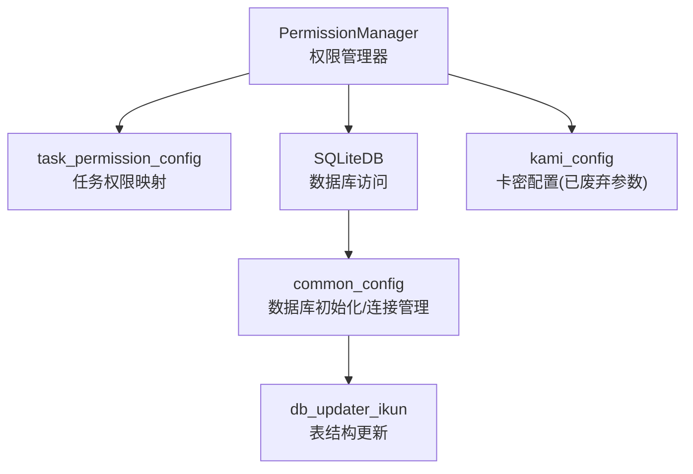
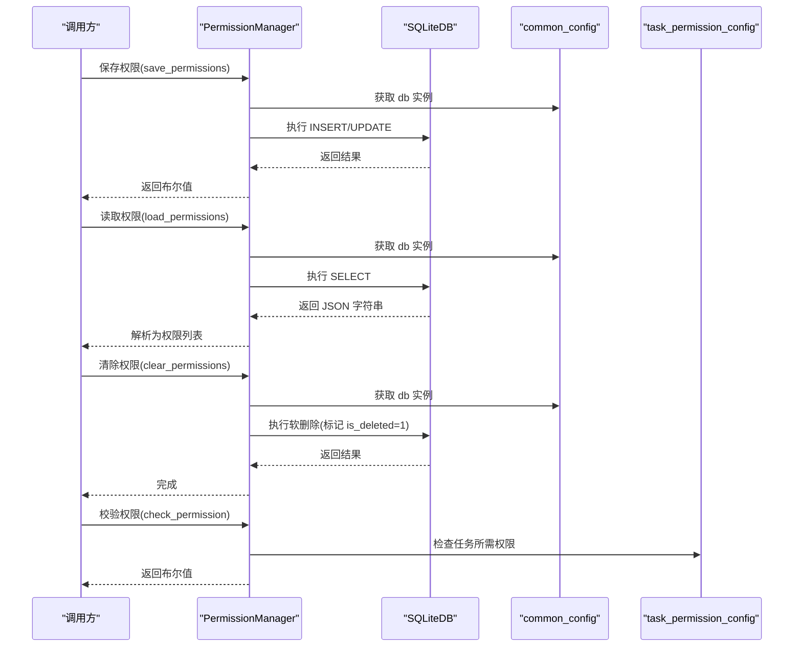
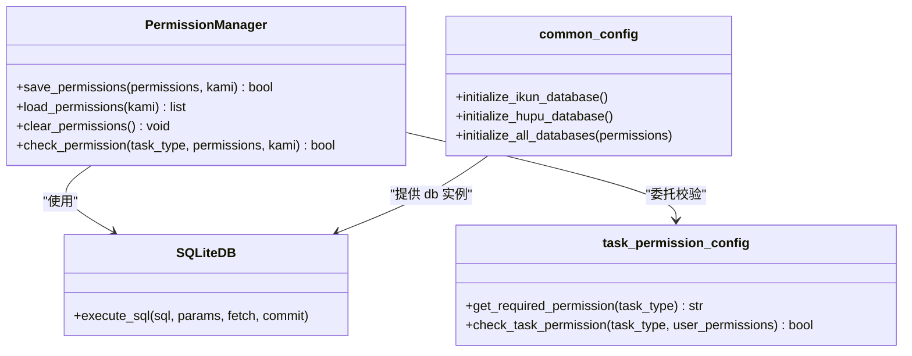
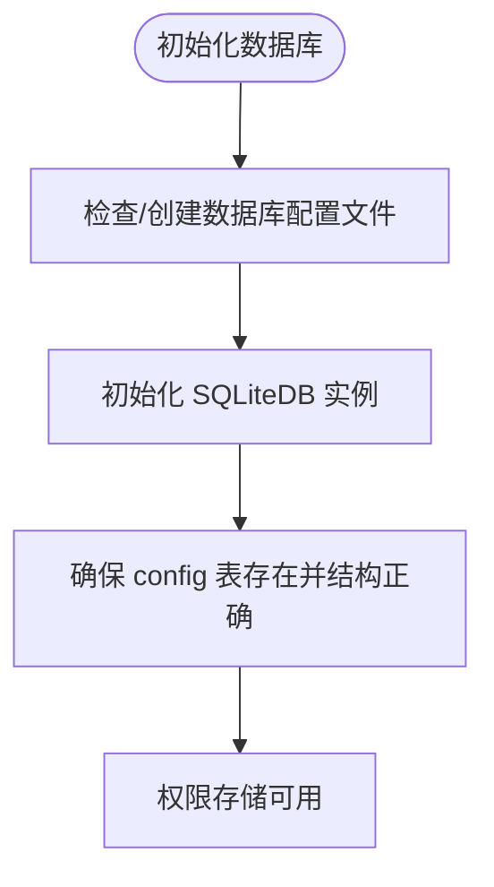
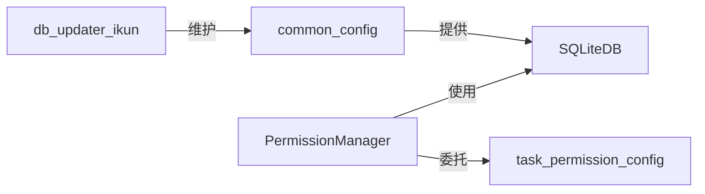

# 权限存储管理

<cite>
**本文引用的文件**
- [config/permission_manager.py](file://config/permission_manager.py)
- [config/task_permission_config.py](file://config/task_permission_config.py)
- [config/common_config.py](file://config/common_config.py)
- [modules/classSQLite.py](file://modules/classSQLite.py)
- [utils/db_updater_ikun.py](file://utils/db_updater_ikun.py)
- [config/kami_config.py](file://config/kami_config.py)
- [config/start_config.py](file://config/start_config.py)
</cite>

## 目录
1. [简介](#简介)
2. [项目结构](#项目结构)
3. [核心组件](#核心组件)
4. [架构总览](#架构总览)
5. [详细组件分析](#详细组件分析)
6. [依赖分析](#依赖分析)
7. [性能考虑](#性能考虑)
8. [故障排除与数据恢复](#故障排除与数据恢复)
9. [结论](#结论)
10. [附录](#附录)

## 简介
本文件面向“ikun_temu_system”项目的权限存储管理，重点围绕 PermissionManager 类的实现原理展开，涵盖权限的保存、读取、清除与校验流程；解释权限数据在数据库中的存储结构与表设计；给出权限配置文件的格式说明与参数详解；阐述权限继承与权限合并的处理逻辑；并提供最佳实践、性能优化建议及故障排除与数据恢复指南。

## 项目结构
权限存储管理涉及以下关键模块：
- 权限管理器：负责权限的持久化、读取与校验
- 任务权限映射：定义任务类型与所需权限的关系
- 数据库层：SQLiteDB 提供统一的数据库访问能力
- 数据库初始化与表结构更新：确保 config 表具备权限字段
- 卡密配置：兼容历史参数占位（已废弃）

图表来源
- [config/permission_manager.py:12-126](file://config/permission_manager.py#L12-L126)
- [config/task_permission_config.py:1-84](file://config/task_permission_config.py#L1-L84)
- [config/common_config.py:197-334](file://config/common_config.py#L197-L334)
- [modules/classSQLite.py:359-531](file://modules/classSQLite.py#L359-L531)
- [utils/db_updater_ikun.py:10-148](file://utils/db_updater_ikun.py#L10-L148)
- [config/kami_config.py:1-56](file://config/kami_config.py#L1-L56)

章节来源
- [config/permission_manager.py:12-126](file://config/permission_manager.py#L12-L126)
- [config/task_permission_config.py:1-84](file://config/task_permission_config.py#L1-L84)
- [config/common_config.py:197-334](file://config/common_config.py#L197-L334)
- [modules/classSQLite.py:359-531](file://modules/classSQLite.py#L359-L531)
- [utils/db_updater_ikun.py:10-148](file://utils/db_updater_ikun.py#L10-L148)
- [config/kami_config.py:1-56](file://config/kami_config.py#L1-L56)

## 核心组件
- PermissionManager：提供权限的保存、读取、清除与校验能力，权限以 JSON 字符串形式存入 config 表的 key='permissions' 的记录中。
- task_permission_config：定义任务类型与所需权限的映射关系，并提供权限校验函数。
- common_config：负责数据库初始化、连接管理与 WAL 合并等，确保权限数据可安全持久化。
- classSQLite：提供 SQLiteDB 统一访问接口，支持同步/异步、连接池、事务、JSON 类型适配等。
- db_updater_ikun：提供通用表结构更新能力，确保 config 表结构满足权限存储需求。
- kami_config：卡密配置文件读写工具，PermissionManager 中的 kami 参数为兼容性占位。

章节来源
- [config/permission_manager.py:12-126](file://config/permission_manager.py#L12-L126)
- [config/task_permission_config.py:67-84](file://config/task_permission_config.py#L67-L84)
- [config/common_config.py:197-334](file://config/common_config.py#L197-L334)
- [modules/classSQLite.py:359-531](file://modules/classSQLite.py#L359-L531)
- [utils/db_updater_ikun.py:10-148](file://utils/db_updater_ikun.py#L10-L148)
- [config/kami_config.py:1-56](file://config/kami_config.py#L1-L56)

## 架构总览
权限存储管理采用“配置表 + 映射规则”的轻量方案：
- 权限数据以 JSON 数组形式存储于 config 表的 value 字段；
- 通过 task_permission_config 的映射关系判断任务类型所需权限；
- PermissionManager 负责与数据库交互，完成权限的保存、读取与清除；
- 数据库层由 SQLiteDB 提供统一访问，支持 WAL、连接池与类型适配；
- 初始化阶段确保 config 表存在且结构正确。

图表来源
- [config/permission_manager.py:16-122](file://config/permission_manager.py#L16-L122)
- [config/task_permission_config.py:67-84](file://config/task_permission_config.py#L67-L84)
- [config/common_config.py:197-334](file://config/common_config.py#L197-L334)
- [modules/classSQLite.py:436-531](file://modules/classSQLite.py#L436-L531)

## 详细组件分析

### PermissionManager 类
- 职责
  - 保存权限：将权限列表序列化为 JSON 并写入 config 表，若已存在则更新，否则插入。
  - 读取权限：从 config 表读取 JSON 字符串并反序列化为权限列表；若无记录则返回空列表。
  - 清除权限：对 key='permissions' 的记录执行软删除（设置 is_deleted=1），便于后续重新登录时写入。
  - 校验权限：根据任务类型查询所需权限，再与用户权限集合比对。
- 关键实现要点
  - 使用 db.execute_sql 的 fetch/fetch_one/none 模式分别处理写入、读取与软删除。
  - 通过 JSON 序列化/反序列化保证权限列表的持久化与读取一致性。
  - 对异常进行捕获并记录日志，返回安全的默认值（如空列表）。
- 兼容性参数
  - 保存/读取/清除/校验均接收名为 kami 的参数，但当前实现中未使用，仅为兼容历史版本保留。

图表来源
- [config/permission_manager.py:12-126](file://config/permission_manager.py#L12-L126)
- [config/task_permission_config.py:55-84](file://config/task_permission_config.py#L55-L84)
- [config/common_config.py:197-334](file://config/common_config.py#L197-L334)
- [modules/classSQLite.py:436-531](file://modules/classSQLite.py#L436-L531)

章节来源
- [config/permission_manager.py:12-126](file://config/permission_manager.py#L12-L126)

### 任务权限映射与校验
- 映射关系
  - temu 权限：对应上传实拍图、核价、JIT 维护库存、调价管理、报活动任务、批量修改期望到货地点等任务类型（支持英文与中文名称）。
  - caiwu 权限：对应财务报表导出、融合、记录列到总表、计算并生成报表、自动生成财务报表等任务类型。
  - spider 权限：对应虎扑帖子列表、详情、评分采集等任务类型。
- 校验逻辑
  - 若任务类型不在映射中，则视为无需特殊权限，直接放行。
  - 否则要求用户权限集合包含该任务类型对应的权限标识（如 temu/caiwu/spider）。

章节来源
- [config/task_permission_config.py:7-84](file://config/task_permission_config.py#L7-L84)

### 数据库层与表设计
- 存储位置
  - 权限数据存储在 config 表中，key='permissions' 的记录即为权限配置。
- 表结构与初始化
  - 通过 common_config 的初始化流程创建并维护数据库连接，确保 config 表可用。
  - db_updater_ikun 提供通用表结构更新能力，可确保 config 表结构满足需求（如字段、唯一约束、索引等）。
- 类型与适配
  - SQLiteDB 注册了 JSON、日期/时间等类型适配器，保证权限 JSON 的正确序列化与反序列化。
- WAL 与安全关闭
  - common_config 提供安全关闭数据库并合并 WAL 的能力，降低权限数据损坏风险。

图表来源
- [config/common_config.py:197-334](file://config/common_config.py#L197-L334)
- [utils/db_updater_ikun.py:10-148](file://utils/db_updater_ikun.py#L10-L148)
- [modules/classSQLite.py:282-292](file://modules/classSQLite.py#L282-L292)

章节来源
- [config/common_config.py:197-334](file://config/common_config.py#L197-L334)
- [utils/db_updater_ikun.py:10-148](file://utils/db_updater_ikun.py#L10-L148)
- [modules/classSQLite.py:282-292](file://modules/classSQLite.py#L282-L292)

### 权限继承与合并
- 权限继承
  - 项目未实现“角色/层级权限”的继承机制；权限集合直接来源于数据库存储的 JSON 列表。
- 权限合并
  - 未提供多源权限合并逻辑；校验时直接使用用户权限集合与任务所需权限进行包含判断。
- 建议
  - 如需扩展，可在 PermissionManager 外层引入“角色-权限映射”，在读取权限后进行集合合并；或在 task_permission_config 中增加“任务-角色映射”，在 check_permission 前做角色到权限的映射与合并。

章节来源
- [config/permission_manager.py:106-122](file://config/permission_manager.py#L106-L122)
- [config/task_permission_config.py:67-84](file://config/task_permission_config.py#L67-L84)

### 权限配置文件与参数说明
- 权限数据文件
  - 存储位置：config 表中 key='permissions' 的记录，value 为 JSON 数组字符串。
  - 格式：数组元素为权限标识字符串，如 ["temu","caiwu","spider"]。
- 兼容参数
  - kami：PermissionManager 的所有方法均接收名为 kami 的参数，当前实现中未使用，仅为兼容历史版本保留。
- 卡密配置文件
  - 位于配置文件_系统配置/config.txt，KamiConfig 提供读写接口；与权限存储无直接关联，但与系统初始化相关。

章节来源
- [config/permission_manager.py:16-122](file://config/permission_manager.py#L16-L122)
- [config/kami_config.py:1-56](file://config/kami_config.py#L1-L56)

## 依赖分析
- 组件耦合
  - PermissionManager 依赖 SQLiteDB 与 task_permission_config，耦合度低，职责清晰。
  - common_config 提供数据库初始化与安全关闭，间接支撑权限存储的可靠性。
- 外部依赖
  - SQLiteDB 依赖 aiosqlite、连接池与线程池，支持高并发场景下的权限读写。
- 循环依赖规避
  - 通过延迟导入（如在方法内部导入 db）避免循环导入问题。

图表来源
- [config/permission_manager.py:12-126](file://config/permission_manager.py#L12-L126)
- [config/task_permission_config.py:1-84](file://config/task_permission_config.py#L1-L84)
- [config/common_config.py:197-334](file://config/common_config.py#L197-L334)
- [utils/db_updater_ikun.py:10-148](file://utils/db_updater_ikun.py#L10-L148)

章节来源
- [config/permission_manager.py:12-126](file://config/permission_manager.py#L12-L126)
- [config/task_permission_config.py:1-84](file://config/task_permission_config.py#L1-L84)
- [config/common_config.py:197-334](file://config/common_config.py#L197-L334)
- [utils/db_updater_ikun.py:10-148](file://utils/db_updater_ikun.py#L10-L148)

## 性能考虑
- 连接与事务
  - 使用 SQLiteDB 的连接池与线程本地连接，减少连接开销；写入操作统一 commit，保证一致性。
- WAL 模式
  - 数据库配置启用 WAL，提升并发读写性能；common_config 提供 WAL 检查点与安全关闭，降低写放大与崩溃风险。
- JSON 序列化
  - 权限列表以 JSON 存储，读写均为小对象，性能开销可忽略；建议避免频繁写入导致的热更新。
- 并发控制
  - 通过任务并发配置与主任务管理器限制整体并发，避免权限读写与其他高负载任务争抢资源。

章节来源
- [config/common_config.py:157-196](file://config/common_config.py#L157-L196)
- [modules/classSQLite.py:359-531](file://modules/classSQLite.py#L359-L531)
- [config/start_config.py:19-24](file://config/start_config.py#L19-L24)

## 故障排除与数据恢复
- 常见问题
  - 数据库未初始化：权限读取返回空列表，保存失败返回 False。检查数据库初始化流程与配置文件。
  - 权限记录缺失：当 key='permissions' 的记录不存在时，读取返回空列表。可通过保存权限写入。
  - 权限被清除：软删除后记录标记 is_deleted=1，需重新登录写入权限。
  - 异常日志：全局异常钩子会记录错误并弹窗提示，必要时检查 error.log。
- 恢复步骤
  - 重新登录：调用保存权限接口写入新的权限集合。
  - 手动修复：若 config 表结构异常，使用 db_updater_ikun 的通用表结构更新函数修复。
  - 数据库安全关闭：在异常或重启前调用安全关闭流程，合并 WAL，避免损坏。
- 最佳实践
  - 登录成功后立即保存权限，避免中途异常导致权限丢失。
  - 定期备份数据库文件与配置文件，防止意外损坏。
  - 在高并发场景下，避免频繁切换权限，减少写入抖动。

章节来源
- [config/permission_manager.py:58-104](file://config/permission_manager.py#L58-L104)
- [config/common_config.py:59-135](file://config/common_config.py#L59-L135)
- [config/start_config.py:27-106](file://config/start_config.py#L27-L106)
- [utils/db_updater_ikun.py:10-148](file://utils/db_updater_ikun.py#L10-L148)

## 结论
PermissionManager 以轻量、可靠的方式实现了权限的持久化与校验：权限以 JSON 数组形式存储于 config 表，配合任务权限映射与 SQLiteDB 的统一访问，满足系统对权限控制的需求。通过数据库初始化、WAL 与安全关闭等机制，保障了权限数据的稳定性与一致性。未来可按需扩展角色继承与权限合并逻辑，进一步增强权限体系的灵活性与可维护性。

## 附录
- 术语
  - 权限标识：如 temu、caiwu、spider 等，用于区分不同业务域的权限集合。
  - 任务类型：具体可执行的操作名称，如“上传实拍图”、“核价”、“财务报表全流程”等。
  - 软删除：通过 is_deleted 字段标记记录失效，而非物理删除，便于恢复。
- 参考路径
  - 权限保存接口：[config/permission_manager.py:16-55](file://config/permission_manager.py#L16-L55)
  - 权限读取接口：[config/permission_manager.py:58-87](file://config/permission_manager.py#L58-L87)
  - 权限清除接口：[config/permission_manager.py:90-103](file://config/permission_manager.py#L90-L103)
  - 权限校验接口：[config/permission_manager.py:106-122](file://config/permission_manager.py#L106-L122)
  - 任务权限映射：[config/task_permission_config.py:7-84](file://config/task_permission_config.py#L7-L84)
  - 数据库初始化与安全关闭：[config/common_config.py:197-334](file://config/common_config.py#L197-L334)
  - 表结构更新工具：[utils/db_updater_ikun.py:10-148](file://utils/db_updater_ikun.py#L10-L148)
  - 卡密配置工具：[config/kami_config.py:1-56](file://config/kami_config.py#L1-L56)