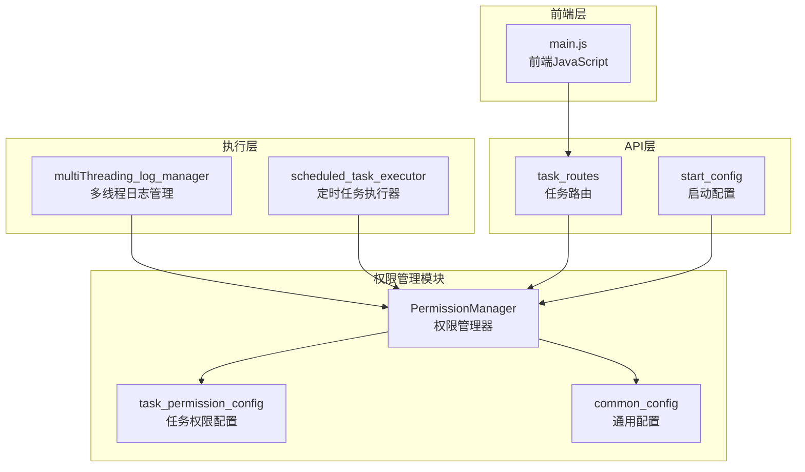
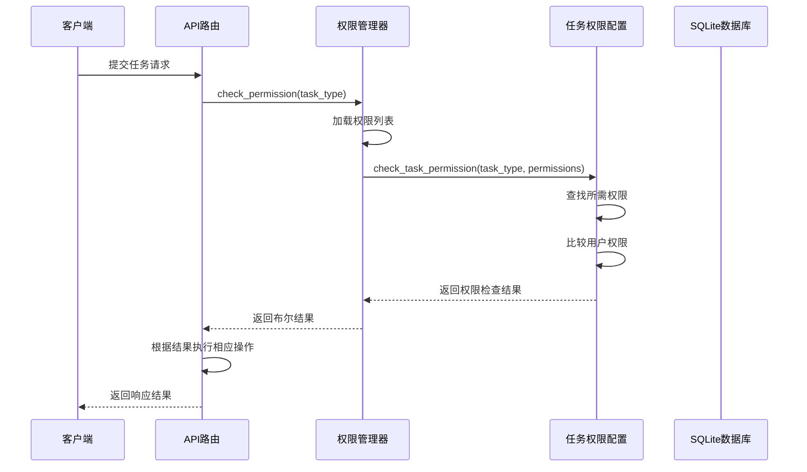
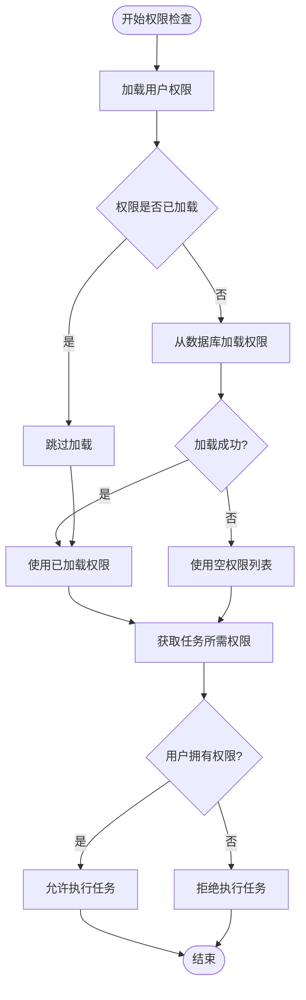
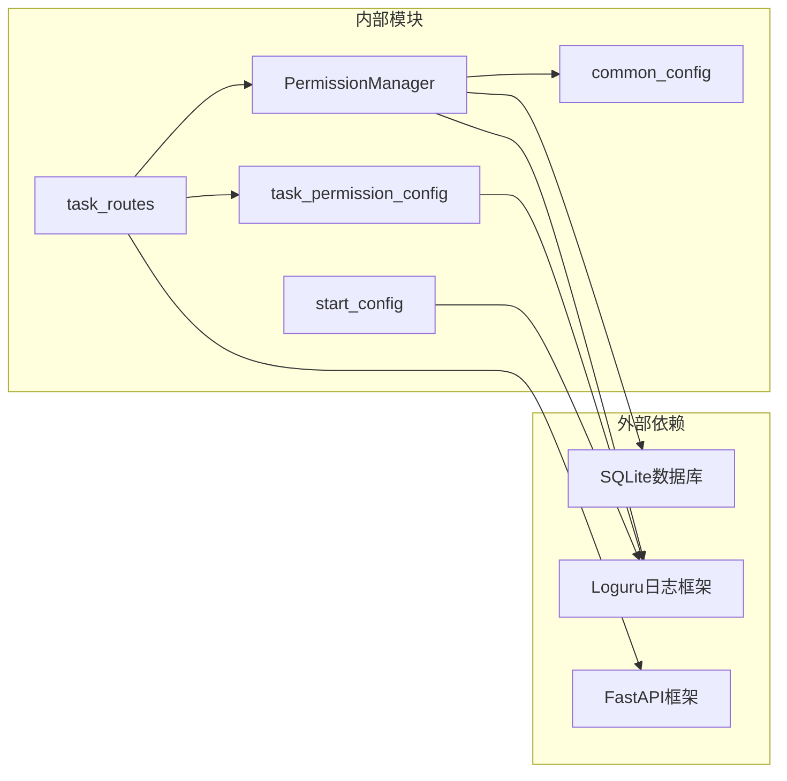

# 权限检查机制

<cite>
**本文档引用的文件**
- [config/permission_manager.py](file://config/permission_manager.py)
- [config/task_permission_config.py](file://config/task_permission_config.py)
- [config/common_config.py](file://config/common_config.py)
- [api/server_routes/task_routes.py](file://api/server_routes/task_routes.py)
- [config/start_config.py](file://config/start_config.py)
- [static/js/main.js](file://static/js/main.js)
- [utils/multiThreading_log_manager.py](file://utils/multiThreading_log_manager.py)
- [utils/scheduled_task_executor.py](file://utils/scheduled_task_executor.py)
</cite>

## 目录
1. [简介](#简介)
2. [项目结构](#项目结构)
3. [核心组件](#核心组件)
4. [架构概览](#架构概览)
5. [详细组件分析](#详细组件分析)
6. [依赖关系分析](#依赖关系分析)
7. [性能考虑](#性能考虑)
8. [故障排除指南](#故障排除指南)
9. [结论](#结论)

## 简介

ikun_temu_system项目实现了基于数据库的权限检查机制，通过统一的权限管理器对任务执行权限进行控制。该机制支持多种权限类型，包括Temu业务权限、财务权限和爬虫权限，并提供了完整的权限配置、验证和错误处理功能。

## 项目结构

权限检查机制主要分布在以下模块中：

**图表来源**
- [config/permission_manager.py:12-126](file://config/permission_manager.py#L12-L126)
- [config/task_permission_config.py:1-84](file://config/task_permission_config.py#L1-L84)
- [api/server_routes/task_routes.py:14-96](file://api/server_routes/task_routes.py#L14-L96)

**章节来源**
- [config/permission_manager.py:1-126](file://config/permission_manager.py#L1-L126)
- [config/task_permission_config.py:1-84](file://config/task_permission_config.py#L1-L84)

## 核心组件

### 权限管理器 (PermissionManager)

PermissionManager是权限检查机制的核心组件，负责权限的保存、读取和验证功能。

**主要功能特性：**
- 权限数据持久化到SQLite数据库
- 支持权限列表的增删改查操作
- 提供统一的权限检查接口
- 完善的错误处理和日志记录

**关键方法：**
- `save_permissions()`: 保存权限到数据库
- `load_permissions()`: 从数据库加载权限
- `clear_permissions()`: 清除数据库中的权限
- `check_permission()`: 检查任务执行权限

### 任务权限配置 (task_permission_config)

定义了任务类型与权限之间的映射关系，支持中英文任务名称的双重映射。

**权限类型映射：**
- **temu权限**: 上传实拍图、核价、JIT维护库存、调价管理、报活动任务、批量修改期望到货地点
- **caiwu权限**: 财务报表相关任务
- **spider权限**: 虎扑数据采集任务

**章节来源**
- [config/permission_manager.py:12-126](file://config/permission_manager.py#L12-L126)
- [config/task_permission_config.py:7-47](file://config/task_permission_config.py#L7-L47)

## 架构概览

权限检查机制采用分层架构设计，确保权限验证的可靠性和可扩展性：

**图表来源**
- [api/server_routes/task_routes.py:91-96](file://api/server_routes/task_routes.py#L91-L96)
- [config/permission_manager.py:106-122](file://config/permission_manager.py#L106-L122)
- [config/task_permission_config.py:67-84](file://config/task_permission_config.py#L67-L84)

## 详细组件分析

### 权限检查工作流程

权限检查的核心流程如下：

**图表来源**
- [config/permission_manager.py:118-122](file://config/permission_manager.py#L118-L122)
- [config/task_permission_config.py:79-83](file://config/task_permission_config.py#L79-L83)

### 任务类型与权限映射关系

系统支持两种任务类型标识方式：

**1. 英文标识符 (推荐)**
- `upload_real_pic`: 上传实拍图
- `modify_price`: 核价
- `jit_govern`: JIT维护库存
- `adjust_price`: 调价管理
- `apply_activity`: 报活动任务
- `expected_goods_place`: 批量修改期望到货地点

**2. 中文名称**
- `上传实拍图`
- `核价`
- `JIT维护库存`
- `调价管理`
- `报活动任务`
- `批量修改期望到货地点`

**权限映射规则：**
- 每个任务类型映射到特定的权限组
- 支持中英文名称的双向映射
- 未配置的任务类型默认允许执行

**章节来源**
- [config/task_permission_config.py:8-47](file://config/task_permission_config.py#L8-L47)
- [api/server_routes/task_routes.py:47-63](file://api/server_routes/task_routes.py#L47-L63)

### 权限检查优先级和继承规则

权限检查遵循以下优先级规则：

**1. 任务类型优先级**
- 特殊权限任务 > 一般权限任务 > 无需权限任务

**2. 权限继承规则**
- 用户权限具有传递性，拥有高级权限自动包含低级权限
- 权限检查采用"或"逻辑，满足任一条件即通过

**3. 默认行为**
- 未在配置中定义的任务类型默认允许执行
- 数据库连接失败时，默认拒绝权限检查

### 权限缓存机制和性能优化

系统实现了多层次的权限缓存机制：

**1. 内存缓存**
- 权限管理器内部缓存已加载的权限列表
- 避免重复的数据库访问

**2. 数据库缓存**
- 权限数据持久化到SQLite数据库
- 支持快速的权限查询和更新

**3. 性能优化策略**
- 异步权限加载机制
- 权限检查结果的短期缓存
- 数据库连接池管理

**章节来源**
- [config/permission_manager.py:15-55](file://config/permission_manager.py#L15-L55)
- [config/permission_manager.py:89-104](file://config/permission_manager.py#L89-L104)

### 错误处理和日志记录

权限检查机制提供了完善的错误处理和日志记录功能：

**1. 数据库错误处理**
- 权限加载失败时返回空权限列表
- 权限保存失败时记录详细错误信息
- 数据库连接异常的优雅降级

**2. 权限检查错误**
- 403状态码表示权限不足
- 详细的错误消息反馈给客户端
- API层的统一权限检查拦截

**3. 日志记录策略**
- 成功的权限检查记录INFO级别日志
- 权限不足的情况记录WARNING级别日志
- 数据库异常记录ERROR级别日志

**章节来源**
- [config/permission_manager.py:53-55](file://config/permission_manager.py#L53-L55)
- [config/permission_manager.py:85-87](file://config/permission_manager.py#L85-L87)
- [api/server_routes/task_routes.py:93-96](file://api/server_routes/task_routes.py#L93-L96)

## 依赖关系分析

权限检查机制的依赖关系如下：

**图表来源**
- [config/permission_manager.py:8-9](file://config/permission_manager.py#L8-L9)
- [config/task_permission_config.py:1-5](file://config/task_permission_config.py#L1-L5)
- [api/server_routes/task_routes.py:12-24](file://api/server_routes/task_routes.py#L12-L24)

**章节来源**
- [config/common_config.py:15-51](file://config/common_config.py#L15-L51)
- [config/start_config.py:46-106](file://config/start_config.py#L46-L106)

## 性能考虑

### 数据库性能优化

1. **连接池管理**
   - SQLite数据库连接池配置
   - 最大连接数限制和超时设置
   - 连接复用和回收机制

2. **查询优化**
   - 权限查询使用索引字段
   - 缓存常用权限查询结果
   - 批量权限检查优化

### 内存使用优化

1. **权限缓存策略**
   - LRU缓存机制
   - 内存使用上限控制
   - 自动清理过期缓存

2. **对象生命周期管理**
   - 权限对象的及时释放
   - 循环引用的避免
   - 内存泄漏的预防

## 故障排除指南

### 常见问题诊断

**1. 权限检查总是失败**
- 检查数据库连接状态
- 验证权限配置是否正确
- 确认用户权限是否已保存

**2. 权限更新不生效**
- 检查权限缓存是否需要刷新
- 验证数据库事务是否提交
- 确认权限检查的调用时机

**3. API权限检查异常**
- 查看API层的权限拦截逻辑
- 检查请求参数的格式
- 验证token的有效性

### 调试工具使用

**1. 权限配置验证**
- 使用数据库客户端查看config表
- 检查权限JSON格式的正确性
- 验证权限映射关系的完整性

**2. 日志分析**
- 查看权限检查的日志记录
- 分析权限加载的性能指标
- 监控权限相关的异常情况

**3. 前端调试**
- 检查任务类型映射的正确性
- 验证权限检查的前端逻辑
- 测试不同权限组合的行为

**章节来源**
- [config/start_config.py:46-146](file://config/start_config.py#L46-L146)
- [static/js/main.js:6793-6807](file://static/js/main.js#L6793-L6807)

## 结论

ikun_temu_system的权限检查机制通过模块化的架构设计，实现了灵活且高效的权限控制功能。该机制支持多种权限类型、提供完整的错误处理和日志记录，并通过缓存和优化策略确保了良好的性能表现。

**主要优势：**
- 模块化设计，职责清晰
- 支持多种权限类型和任务标识
- 完善的错误处理和日志记录
- 性能优化的缓存机制
- 易于扩展和维护

**建议改进方向：**
- 增加权限审计日志
- 实现更细粒度的权限控制
- 添加权限变更的通知机制
- 优化大规模权限检查的性能