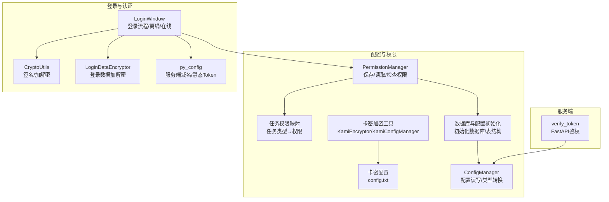
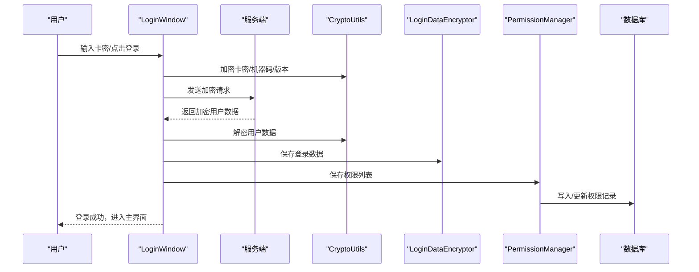
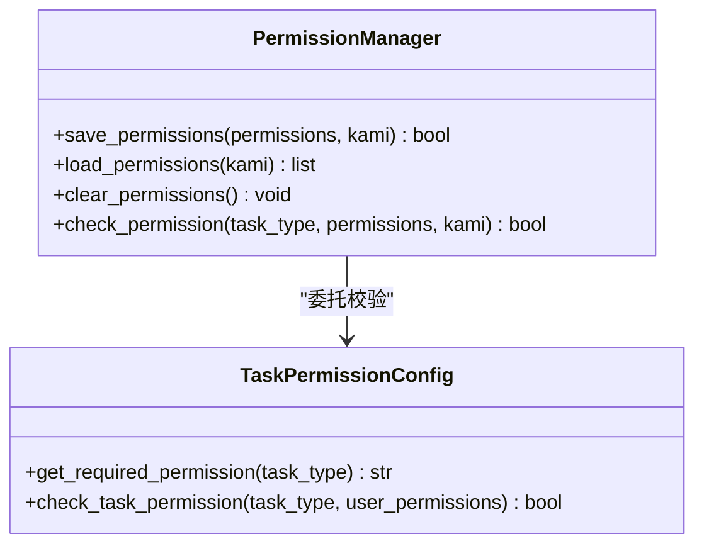
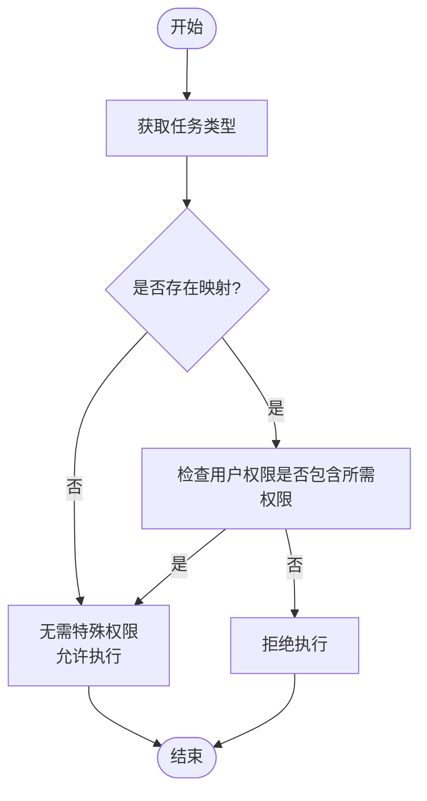
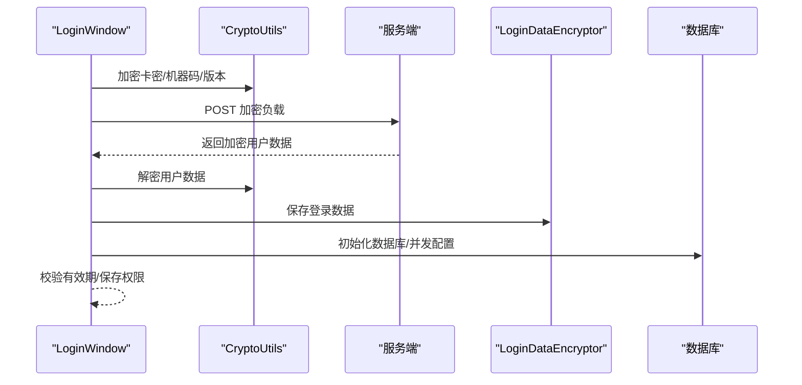
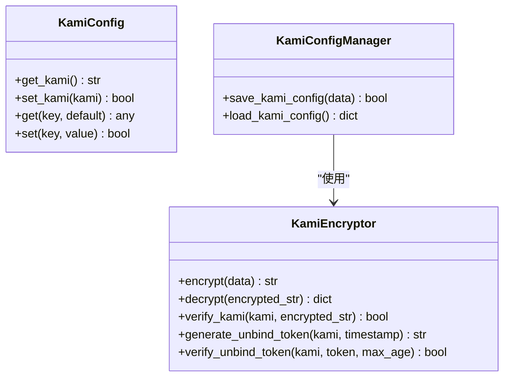
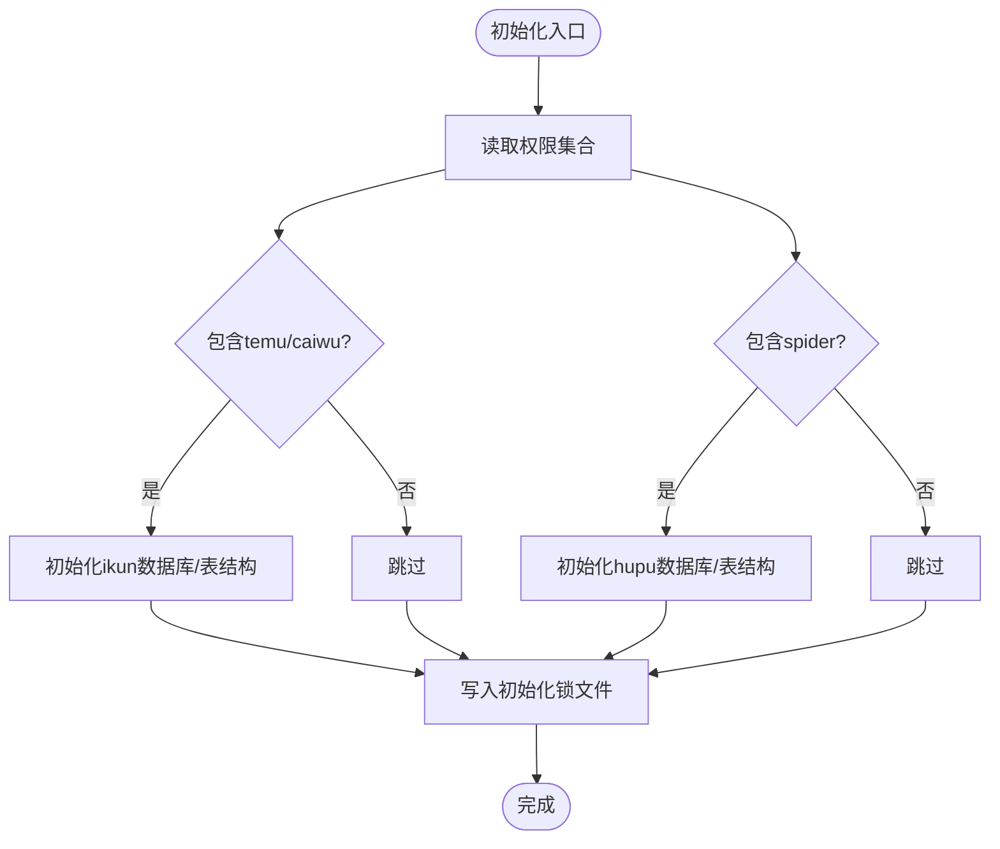
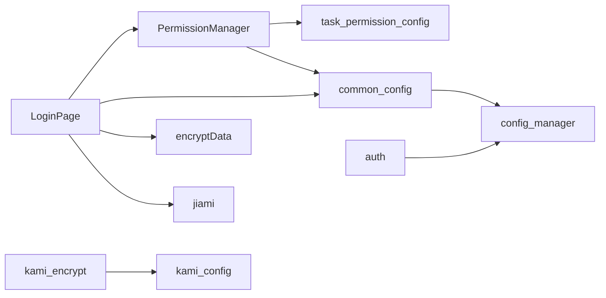

# 权限配置

<cite>
**本文档引用的文件**
- [permission_manager.py](file://config/permission_manager.py)
- [task_permission_config.py](file://config/task_permission_config.py)
- [common_config.py](file://config/common_config.py)
- [kami_config.py](file://config/kami_config.py)
- [kami_encrypt.py](file://config/kami_encrypt.py)
- [encryptData.py](file://gui/utils/encryptData.py)
- [jiami.py](file://gui/utils/jiami.py)
- [auth.py](file://api/server_routes/auth.py)
- [LoginPage.py](file://gui/LoginPage.py)
- [py_config.py](file://config/py_config.py)
- [config_manager.py](file://modules/config_manager.py)
- [start_config.py](file://config/start_config.py)
- [update_config.py](file://config/update_config.py)
</cite>

## 目录
1. [简介](#简介)
2. [项目结构](#项目结构)
3. [核心组件](#核心组件)
4. [架构总览](#架构总览)
5. [详细组件分析](#详细组件分析)
6. [依赖分析](#依赖分析)
7. [性能考虑](#性能考虑)
8. [故障排除指南](#故障排除指南)
9. [结论](#结论)
10. [附录](#附录)

## 简介
本文件面向“ikun_temu_system”项目的权限配置体系，系统性阐述权限管理架构与工作机制，涵盖用户认证、角色控制、访问权限、权限配置文件结构与参数、权限分配与管理操作、加密与安全验证流程、权限继承与冲突处理策略，以及故障排除与安全加固建议。读者可据此完成权限配置的部署、运维与审计。

## 项目结构
权限相关的关键模块分布如下：
- 配置与权限管理：config/permission_manager.py、config/task_permission_config.py、config/common_config.py、config/kami_config.py、config/kami_encrypt.py、modules/config_manager.py
- 登录与认证：gui/LoginPage.py、gui/utils/encryptData.py、gui/utils/jiami.py、config/py_config.py
- 服务端鉴权：api/server_routes/auth.py
- 启动与配置：config/start_config.py、config/update_config.py

图表来源
- [permission_manager.py:12-126](file://config/permission_manager.py#L12-L126)
- [task_permission_config.py:1-84](file://config/task_permission_config.py#L1-L84)
- [common_config.py:197-334](file://config/common_config.py#L197-L334)
- [kami_config.py:1-56](file://config/kami_config.py#L1-L56)
- [kami_encrypt.py:17-321](file://config/kami_encrypt.py#L17-L321)
- [config_manager.py:6-344](file://modules/config_manager.py#L6-L344)
- [LoginPage.py:345-461](file://gui/LoginPage.py#L345-L461)
- [encryptData.py:13-37](file://gui/utils/encryptData.py#L13-L37)
- [jiami.py:13-256](file://gui/utils/jiami.py#L13-L256)
- [py_config.py:4-93](file://config/py_config.py#L4-L93)
- [auth.py:7-19](file://api/server_routes/auth.py#L7-L19)

章节来源
- [permission_manager.py:12-126](file://config/permission_manager.py#L12-L126)
- [task_permission_config.py:1-84](file://config/task_permission_config.py#L1-L84)
- [common_config.py:197-334](file://config/common_config.py#L197-L334)
- [kami_config.py:1-56](file://config/kami_config.py#L1-L56)
- [kami_encrypt.py:17-321](file://config/kami_encrypt.py#L17-L321)
- [config_manager.py:6-344](file://modules/config_manager.py#L6-L344)
- [LoginPage.py:345-461](file://gui/LoginPage.py#L345-L461)
- [encryptData.py:13-37](file://gui/utils/encryptData.py#L13-L37)
- [jiami.py:13-256](file://gui/utils/jiami.py#L13-L256)
- [py_config.py:4-93](file://config/py_config.py#L4-L93)
- [auth.py:7-19](file://api/server_routes/auth.py#L7-L19)

## 核心组件
- 权限管理器（PermissionManager）：负责权限的保存、读取与检查，权限以JSON字符串形式存储于数据库config表中，键名为“permissions”。支持清空权限（用于退出登录）。
- 任务权限映射（task_permission_config）：定义任务类型与所需权限的映射关系，提供反向映射与权限校验函数。
- 登录与认证（LoginPage/LoginDataEncryptor/CryptoUtils）：实现在线/离线登录、机器码加密、签名生成、登录数据加解密与有效期校验。
- 卡密与配置（kami_config/kami_encrypt）：提供卡密配置文件读写、卡密加密/解密、卡密有效性验证、解绑令牌生成与校验。
- 数据库与配置初始化（common_config）：统一初始化ikun与hupu数据库、表结构，写入初始化锁文件；全局并发配置由ConfigManager从数据库读取。
- 服务端鉴权（auth）：基于配置项开启/关闭服务端token校验，校验通过后放行。

章节来源
- [permission_manager.py:12-126](file://config/permission_manager.py#L12-L126)
- [task_permission_config.py:1-84](file://config/task_permission_config.py#L1-L84)
- [LoginPage.py:345-461](file://gui/LoginPage.py#L345-L461)
- [kami_config.py:1-56](file://config/kami_config.py#L1-L56)
- [kami_encrypt.py:17-321](file://config/kami_encrypt.py#L17-L321)
- [common_config.py:197-334](file://config/common_config.py#L197-L334)
- [auth.py:7-19](file://api/server_routes/auth.py#L7-L19)

## 架构总览
权限配置系统围绕“登录→权限下发→权限持久化→权限校验”的闭环展开。登录阶段完成身份与有效期校验，随后根据返回的权限集合初始化数据库与并发配置，并将权限持久化至数据库。后续各模块通过权限管理器与任务权限映射进行权限校验，确保操作合规。

图表来源
- [LoginPage.py:345-461](file://gui/LoginPage.py#L345-L461)
- [encryptData.py:13-37](file://gui/utils/encryptData.py#L13-L37)
- [jiami.py:13-256](file://gui/utils/jiami.py#L13-L256)
- [permission_manager.py:16-55](file://config/permission_manager.py#L16-L55)

## 详细组件分析

### 权限管理器（PermissionManager）
- 职责
  - 保存权限：将权限列表序列化为JSON字符串，写入数据库config表，键为“permissions”，支持更新或插入。
  - 读取权限：从数据库读取“permissions”并反序列化为列表，未找到时返回空列表。
  - 清空权限：将权限记录标记删除，用于退出登录。
  - 权限检查：委托任务权限映射模块进行任务类型与权限的匹配校验。
- 数据结构与复杂度
  - 权限列表为Python list，序列化/反序列化为JSON字符串，读写复杂度O(n)（n为权限数量）。
- 错误处理
  - 数据库异常与JSON解析异常均记录错误日志并返回默认值或False。
- 性能与优化
  - 权限读写直接走数据库，建议在高频校验场景引入进程内缓存（当前未实现）。

图表来源
- [permission_manager.py:12-126](file://config/permission_manager.py#L12-L126)
- [task_permission_config.py:55-84](file://config/task_permission_config.py#L55-L84)

章节来源
- [permission_manager.py:12-126](file://config/permission_manager.py#L12-L126)

### 任务权限映射（task_permission_config）
- 职责
  - 维护任务类型到所需权限的映射表，支持中文任务名称与英文编码混用。
  - 提供任务类型→权限的反向映射，以及任务权限校验函数。
- 权限继承与冲突
  - 采用“任务类型→单一权限”的直接映射，不涉及继承链；若某任务类型未在映射表中出现，则视为无需特殊权限，校验通过。
- 复杂度
  - 映射查找为哈希表操作，平均O(1)。

图表来源
- [task_permission_config.py:55-84](file://config/task_permission_config.py#L55-L84)

章节来源
- [task_permission_config.py:1-84](file://config/task_permission_config.py#L1-L84)

### 登录与认证（LoginPage/LoginDataEncryptor/CryptoUtils）
- 在线登录
  - 生成机器码、卡密、版本号的加密串与签名，发送至服务端进行校验。
  - 若服务端返回用户数据，解密后校验有效期，保存登录数据文件，并初始化数据库与并发配置。
- 离线登录
  - 仅在服务器不可达且卡密为特定值时允许，校验机器码、有效期后放行。
- 加密与安全
  - 登录数据采用固定密钥与IV的AES-CBC加密；签名采用共享密钥与卡密+时间戳的HMAC-SHA256。
- 并发限制
  - 登录接口具备速率限制，避免频繁请求。

图表来源
- [LoginPage.py:345-461](file://gui/LoginPage.py#L345-L461)
- [encryptData.py:13-37](file://gui/utils/encryptData.py#L13-L37)
- [jiami.py:13-256](file://gui/utils/jiami.py#L13-L256)

章节来源
- [LoginPage.py:345-461](file://gui/LoginPage.py#L345-L461)
- [encryptData.py:13-37](file://gui/utils/encryptData.py#L13-L37)
- [jiami.py:13-256](file://gui/utils/jiami.py#L13-L256)

### 卡密与配置（kami_config/kami_encrypt）
- 卡密配置文件
  - 位于“配置文件_系统配置/config.txt”，包含键“kami”及其它扩展键。
- 卡密加密工具
  - 基于卡密派生唯一密钥，使用AES-CBC加密/解密；提供卡密有效性验证、解绑令牌生成与校验。
- 卡密配置管理
  - 提供保存/加载加密配置的能力，依赖当前卡密实例。

图表来源
- [kami_config.py:1-56](file://config/kami_config.py#L1-L56)
- [kami_encrypt.py:17-321](file://config/kami_encrypt.py#L17-L321)

章节来源
- [kami_config.py:1-56](file://config/kami_config.py#L1-L56)
- [kami_encrypt.py:17-321](file://config/kami_encrypt.py#L17-L321)

### 数据库与配置初始化（common_config）
- 初始化流程
  - 根据权限集合决定是否初始化ikun/hupu数据库与表结构；写入初始化锁文件。
- 并发配置
  - 从配置表读取并发参数，构造任务并发配置字典，供全局使用。

图表来源
- [common_config.py:245-334](file://config/common_config.py#L245-L334)

章节来源
- [common_config.py:245-334](file://config/common_config.py#L245-L334)

### 服务端鉴权（auth）
- 功能
  - 读取配置项决定是否启用token校验，校验不通过返回403。
- 集成
  - 通常与前端登录流程配合，登录成功后服务端颁发令牌，后续请求携带校验。

章节来源
- [auth.py:7-19](file://api/server_routes/auth.py#L7-L19)

## 依赖分析
- 模块耦合
  - PermissionManager依赖数据库执行器与任务权限映射模块；LoginPage依赖加密工具、配置与数据库初始化；kami_encrypt依赖kami_config进行配置读写。
- 外部依赖
  - 数据库（SQLite）、第三方加密库（pycryptodome）、FastAPI（服务端鉴权）。
- 循环依赖
  - 通过延迟导入与模块拆分避免循环依赖。

图表来源
- [LoginPage.py:345-461](file://gui/LoginPage.py#L345-L461)
- [permission_manager.py:12-126](file://config/permission_manager.py#L12-L126)
- [task_permission_config.py:1-84](file://config/task_permission_config.py#L1-L84)
- [common_config.py:197-334](file://config/common_config.py#L197-L334)
- [auth.py:7-19](file://api/server_routes/auth.py#L7-L19)
- [kami_encrypt.py:17-321](file://config/kami_encrypt.py#L17-L321)
- [kami_config.py:1-56](file://config/kami_config.py#L1-L56)

章节来源
- [LoginPage.py:345-461](file://gui/LoginPage.py#L345-L461)
- [permission_manager.py:12-126](file://config/permission_manager.py#L12-L126)
- [task_permission_config.py:1-84](file://config/task_permission_config.py#L1-L84)
- [common_config.py:197-334](file://config/common_config.py#L197-L334)
- [auth.py:7-19](file://api/server_routes/auth.py#L7-L19)
- [kami_encrypt.py:17-321](file://config/kami_encrypt.py#L17-L321)
- [kami_config.py:1-56](file://config/kami_config.py#L1-L56)

## 性能考虑
- 权限读取
  - 每次权限检查均会读取数据库，建议在高频场景引入进程内缓存（如内存字典）并设置TTL刷新。
- 加密开销
  - 登录数据与卡密加密/解密为CPU密集操作，建议在批量处理时合并请求，减少重复加解密。
- 数据库写入
  - 权限保存采用事务提交，建议在批量权限变更时合并为单次写入，降低锁竞争。

## 故障排除指南
- 登录失败
  - 检查网络连通性与服务端状态；确认卡密、机器码、签名生成流程正确；查看登录数据文件是否可读写。
- 权限校验失败
  - 确认权限已保存至数据库且未被清空；检查任务类型是否在映射表中；核对用户权限集合。
- 数据库初始化失败
  - 检查数据库配置文件与路径；确认初始化锁文件状态；查看日志中具体错误信息。
- 卡密配置异常
  - 确认config.txt存在且可读；验证卡密加密/解密流程；检查卡密有效性与解绑令牌有效期。
- 服务端鉴权失败
  - 核对配置项开关与令牌值；确认请求头与参数正确。

章节来源
- [LoginPage.py:345-461](file://gui/LoginPage.py#L345-L461)
- [permission_manager.py:58-87](file://config/permission_manager.py#L58-L87)
- [common_config.py:245-334](file://config/common_config.py#L245-L334)
- [kami_encrypt.py:136-216](file://config/kami_encrypt.py#L136-L216)
- [auth.py:7-19](file://api/server_routes/auth.py#L7-L19)

## 结论
本权限配置体系以“登录→权限下发→持久化→校验”为主线，结合数据库与配置中心实现灵活的权限控制。通过任务权限映射与多层加密/签名机制，系统在功能与安全之间取得平衡。建议在生产环境中引入权限缓存、令牌轮换与审计日志，进一步提升性能与安全性。

## 附录

### 权限配置文件结构与参数
- 权限持久化
  - 数据库键：permissions；值：JSON数组，元素为权限标识（如“temu”、“caiwu”、“spider”等）。
- 卡密配置文件
  - 路径：配置文件_系统配置/config.txt；键：kami（卡密）、其它扩展键。
- 登录数据文件
  - 路径：config/login_data.dat；内容：登录用户数据的加密字符串。
- 服务端鉴权配置
  - 键：ServerPage_auth（布尔）、ServerPage_token（字符串）。

章节来源
- [permission_manager.py:16-55](file://config/permission_manager.py#L16-L55)
- [kami_config.py:1-56](file://config/kami_config.py#L1-L56)
- [jiami.py:13-256](file://gui/utils/jiami.py#L13-L256)
- [auth.py:7-19](file://api/server_routes/auth.py#L7-L19)

### 权限分配与管理操作指南
- 登录后自动保存权限
  - 登录成功后，系统根据返回的权限集合调用权限管理器保存至数据库。
- 手动清空权限
  - 调用权限管理器的清空方法，将权限记录标记删除。
- 服务端鉴权
  - 在配置中开启鉴权并设置令牌，请求时携带令牌参数。

章节来源
- [LoginPage.py:433-436](file://gui/LoginPage.py#L433-L436)
- [permission_manager.py:90-104](file://config/permission_manager.py#L90-L104)
- [auth.py:7-19](file://api/server_routes/auth.py#L7-L19)

### 加密与安全验证流程
- 登录数据加密
  - 使用固定密钥与IV的AES-CBC加密；解密失败返回空字典。
- 卡密加密
  - 基于卡密派生唯一密钥，AES-CBC加密；提供卡密有效性验证与解绑令牌校验。
- 签名与时间戳
  - 使用共享密钥对卡密+时间戳进行HMAC-SHA256签名，时间戳窗口默认5分钟。

章节来源
- [jiami.py:13-256](file://gui/utils/jiami.py#L13-L256)
- [kami_encrypt.py:17-321](file://config/kami_encrypt.py#L17-L321)
- [encryptData.py:13-37](file://gui/utils/encryptData.py#L13-L37)

### 权限继承与冲突处理策略
- 继承策略
  - 采用“任务类型→单一权限”的直接映射，不涉及继承链。
- 冲突处理
  - 若任务类型未在映射表中，视为无需特殊权限；若存在映射但用户权限不包含所需权限，则拒绝执行。

章节来源
- [task_permission_config.py:55-84](file://config/task_permission_config.py#L55-L84)

### 安全加固建议
- 令牌轮换
  - 定期更换服务端令牌，缩短令牌有效期。
- 日志审计
  - 记录权限校验事件与失败原因，便于审计与追踪。
- 最小权限
  - 仅授予完成任务所需的最小权限集合，避免过度授权。
- 配置隔离
  - 将敏感配置（如卡密）与普通配置分离，限制访问范围。