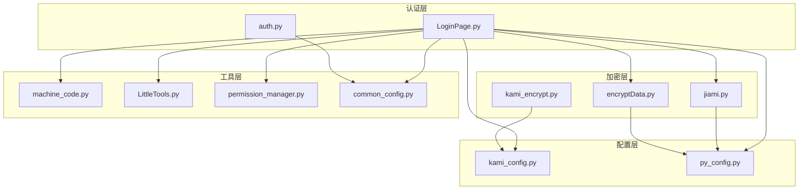
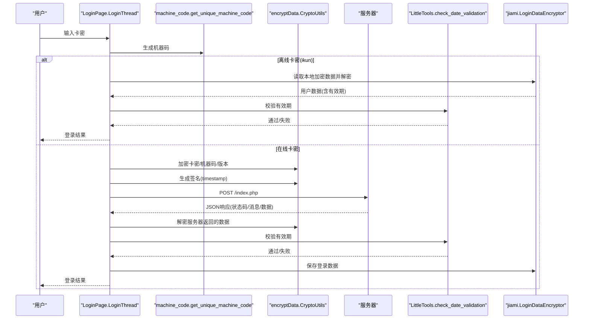
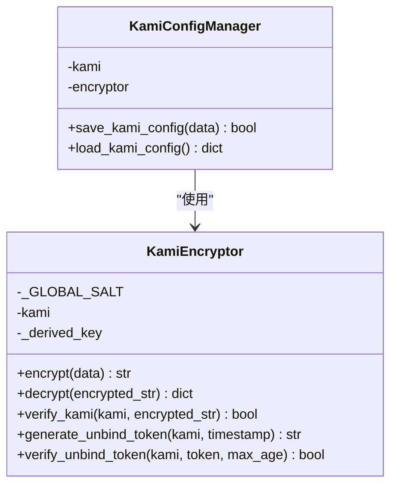
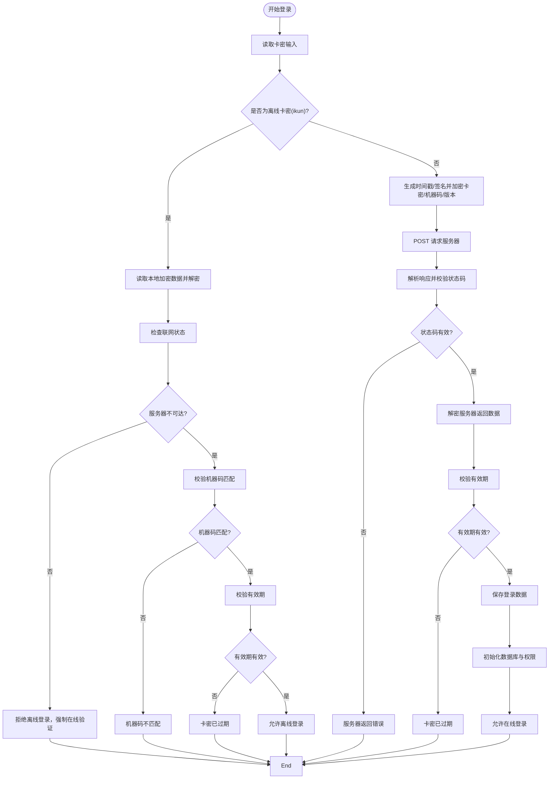
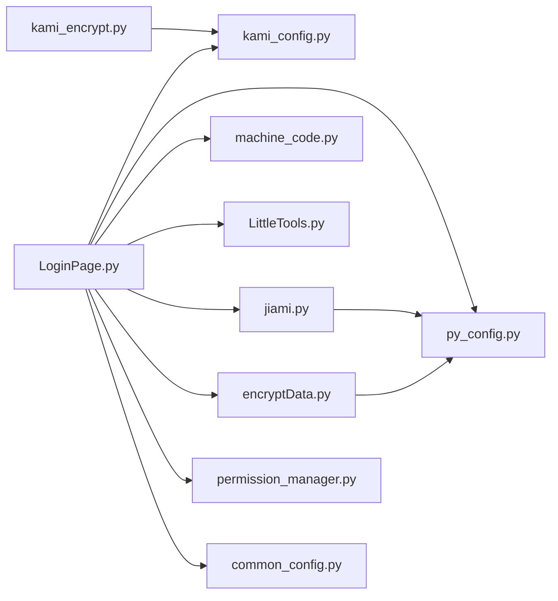

# 用户认证机制

<cite>
**本文档引用的文件**
- [kami_config.py](file://config/kami_config.py)
- [kami_encrypt.py](file://config/kami_encrypt.py)
- [auth.py](file://api/server_routes/auth.py)
- [LoginPage.py](file://gui/LoginPage.py)
- [encryptData.py](file://gui/utils/encryptData.py)
- [jiami.py](file://gui/utils/jiami.py)
- [machine_code.py](file://modules/machine_code.py)
- [LittleTools.py](file://lite_modules/LittleTools.py)
- [common_config.py](file://config/common_config.py)
- [permission_manager.py](file://config/permission_manager.py)
- [py_config.py](file://config/py_config.py)
</cite>

## 目录
1. [简介](#简介)
2. [项目结构](#项目结构)
3. [核心组件](#核心组件)
4. [架构总览](#架构总览)
5. [详细组件分析](#详细组件分析)
6. [依赖关系分析](#依赖关系分析)
7. [性能考虑](#性能考虑)
8. [故障排除指南](#故障排除指南)
9. [结论](#结论)
10. [附录](#附录)

## 简介
本文件面向ikun_temu_system的用户认证机制，重点解释卡密认证系统的工作原理，涵盖以下方面：
- kami_config配置文件的结构与参数设置
- kami_encrypt模块的加密解密算法实现细节
- 卡密验证的完整流程（生成、验证、过期处理）
- 认证失败的处理机制与安全防护措施
- 卡密配置示例与常见认证问题的解决方案

## 项目结构
围绕用户认证的关键文件分布如下：
- 配置层：kami_config.py（卡密配置持久化）、py_config.py（应用配置）
- 加密层：kami_encrypt.py（卡密加密/解密/令牌生成）、jiami.py（登录数据加解密）、encryptData.py（通用加解密）
- 认证层：LoginPage.py（登录界面与验证流程）、auth.py（服务端token校验）
- 工具层：machine_code.py（机器码生成）、LittleTools.py（有效期验证）、permission_manager.py（权限管理）

图表来源
- [kami_config.py:1-56](file://config/kami_config.py#L1-L56)
- [py_config.py:1-93](file://config/py_config.py#L1-L93)
- [kami_encrypt.py:1-321](file://config/kami_encrypt.py#L1-L321)
- [jiami.py:1-256](file://gui/utils/jiami.py#L1-L256)
- [encryptData.py:1-37](file://gui/utils/encryptData.py#L1-L37)
- [LoginPage.py:1-586](file://gui/LoginPage.py#L1-L586)
- [auth.py:1-19](file://api/server_routes/auth.py#L1-L19)
- [machine_code.py:1-183](file://modules/machine_code.py#L1-L183)
- [LittleTools.py:1-198](file://lite_modules/LittleTools.py#L1-L198)
- [permission_manager.py:1-126](file://config/permission_manager.py#L1-L126)
- [common_config.py:1-394](file://config/common_config.py#L1-L394)

章节来源
- [kami_config.py:1-56](file://config/kami_config.py#L1-L56)
- [py_config.py:1-93](file://config/py_config.py#L1-L93)
- [kami_encrypt.py:1-321](file://config/kami_encrypt.py#L1-L321)
- [LoginPage.py:1-586](file://gui/LoginPage.py#L1-L586)

## 核心组件
- 卡密配置管理：kami_config.py提供卡密的读取、写入与通用配置项访问，确保卡密持久化与默认回退。
- 卡密加密器：kami_encrypt.py提供基于AES-CBC的加密解密、卡密验证、解绑令牌生成与校验，以及配置加密存储。
- 登录界面与流程：LoginPage.py负责卡密输入、机器码生成、在线/离线验证、有效期检查、权限初始化与主界面跳转。
- 通用加解密：encryptData.py与jiami.py分别提供客户端侧的通用加解密与登录数据加解密，保证传输与本地存储安全。
- 机器码与有效期：machine_code.py生成稳定的机器指纹，LittleTools.py基于互联网时间验证有效期。
- 权限管理：permission_manager.py将权限持久化到数据库，配合common_config.py进行数据库初始化。

章节来源
- [kami_config.py:38-54](file://config/kami_config.py#L38-L54)
- [kami_encrypt.py:17-153](file://config/kami_encrypt.py#L17-L153)
- [LoginPage.py:24-186](file://gui/LoginPage.py#L24-L186)
- [encryptData.py:13-37](file://gui/utils/encryptData.py#L13-L37)
- [jiami.py:13-89](file://gui/utils/jiami.py#L13-L89)
- [machine_code.py:59-178](file://modules/machine_code.py#L59-L178)
- [LittleTools.py:57-92](file://lite_modules/LittleTools.py#L57-L92)
- [permission_manager.py:12-126](file://config/permission_manager.py#L12-L126)
- [common_config.py:197-334](file://config/common_config.py#L197-L334)

## 架构总览
整体认证流程分为“离线卡密”和“在线卡密”两条路径，均以卡密为核心，结合机器码、时间戳与签名进行验证，并通过有效期控制与权限初始化完成最终授权。

图表来源
- [LoginPage.py:33-186](file://gui/LoginPage.py#L33-L186)
- [machine_code.py:59-178](file://modules/machine_code.py#L59-L178)
- [encryptData.py:16-37](file://gui/utils/encryptData.py#L16-L37)
- [LittleTools.py:57-92](file://lite_modules/LittleTools.py#L57-L92)
- [jiami.py:69-89](file://gui/utils/jiami.py#L69-L89)

## 详细组件分析

### 卡密配置管理（kami_config.py）
- 文件位置与作用：负责卡密配置文件的创建、读取、写入与通用配置项访问。
- 关键方法：
  - get_kami/set_kami：读取/写入卡密字段
  - get/set：读取/写入任意配置键值
  - _ensure_config_exists/_read_config/_write_config：内部文件操作封装
- 默认行为：当配置文件不存在时自动创建默认结构；读取失败时返回空卡密并记录错误。

章节来源
- [kami_config.py:11-54](file://config/kami_config.py#L11-L54)

### 卡密加密与验证（kami_encrypt.py）
- 类与职责：
  - KamiEncryptor：提供基于AES-CBC的加密/解密、卡密验证、解绑令牌生成与校验
  - KamiConfigManager：基于卡密的配置加密存储与读取
  - 工具函数：verify_current_kami、create_kami_encryptor
- 加密算法要点：
  - 密钥派生：使用卡密与全局盐值组合，经SHA256派生32字节密钥
  - 随机IV：每次加密生成16字节随机IV，拼接在密文前
  - CBC模式：AES-CBC填充采用PKCS7
  - 输出格式：Base64编码的“IV + 密文”
- 解绑令牌：
  - 生成：使用全局盐值对“卡密:时间戳”做HMAC-SHA256签名
  - 校验：比较时间戳差值与有效期阈值，再进行签名对比
- 配置加密存储：
  - 保存：将配置字典序列化为JSON，加密后写入kami_config
  - 加载：从kami_config读取加密串，使用相同卡密解密

图表来源
- [kami_encrypt.py:17-153](file://config/kami_encrypt.py#L17-L153)
- [kami_encrypt.py:218-284](file://config/kami_encrypt.py#L218-L284)

章节来源
- [kami_encrypt.py:17-153](file://config/kami_encrypt.py#L17-L153)
- [kami_encrypt.py:218-284](file://config/kami_encrypt.py#L218-L284)

### 登录界面与验证流程（LoginPage.py）
- 线程化登录：LoginThread在后台线程执行网络请求与数据处理，避免UI阻塞
- 离线卡密（ikun）：
  - 读取本地加密数据并解密
  - 校验联网状态、服务器可达性、机器码匹配、有效期
  - 成功后返回用户数据并允许进入主界面
- 在线卡密：
  - 生成时间戳与签名，加密卡密、机器码、版本
  - 发送POST请求至服务器，解析响应并校验有效期
  - 成功后保存登录数据并初始化数据库与权限
- 速率限制：RateLimiter限制每2秒最多3次请求，防止滥用
- 自动登录：若配置中开启自动登录且保存了卡密，启动时自动尝试登录

图表来源
- [LoginPage.py:33-186](file://gui/LoginPage.py#L33-L186)

章节来源
- [LoginPage.py:24-186](file://gui/LoginPage.py#L24-L186)

### 通用加解密工具（encryptData.py、jiami.py）
- encryptData.CryptoUtils：
  - AES-CBC加密/解密：固定密钥与IV，用于传输数据的加密与签名生成
  - HMAC-SHA256签名：基于共享密钥对“卡密+时间戳”进行签名
- jiami.LoginDataEncryptor：
  - 登录数据专用AES-CBC加密/解密，用于本地缓存用户数据
  - 支持保存/加载登录数据文件，确保返回字典类型

章节来源
- [encryptData.py:13-37](file://gui/utils/encryptData.py#L13-L37)
- [jiami.py:13-89](file://gui/utils/jiami.py#L13-L89)

### 机器码与有效期验证（machine_code.py、LittleTools.py）
- 机器码生成：优先使用WMI获取CPU、磁盘、显卡、物理MAC等硬件信息，组合后取SHA256摘要的前32位十六进制字符串
- 有效期验证：使用百度互联网时间（RFC 2822）与目标日期比较，支持永久有效期（9999-09-09）与异常兜底

章节来源
- [machine_code.py:59-178](file://modules/machine_code.py#L59-L178)
- [LittleTools.py:57-92](file://lite_modules/LittleTools.py#L57-L92)

### 权限管理与数据库初始化（permission_manager.py、common_config.py）
- 权限管理：将权限列表以JSON形式保存到数据库config表，支持保存、加载、清空与权限检查
- 数据库初始化：统一初始化ikun与hupu数据库，创建表结构并写入初始化锁文件，确保系统稳定运行

章节来源
- [permission_manager.py:12-126](file://config/permission_manager.py#L12-L126)
- [common_config.py:197-334](file://config/common_config.py#L197-L334)

### 服务端认证（auth.py）
- 服务端token校验：根据配置开关与服务器token进行校验，未通过则返回403 Forbidden
- 与前端交互：前端在请求中携带token参数，后端按需启用认证

章节来源
- [auth.py:7-19](file://api/server_routes/auth.py#L7-L19)

## 依赖关系分析
- 登录界面依赖：
  - kami_config：读取/保存卡密
  - py_config：获取服务器域名、静态token、版本号等
  - machine_code：生成机器码
  - LittleTools：有效期验证
  - jiami：保存/加载登录数据
  - encryptData：加密传输数据与签名
  - permission_manager：保存权限
  - common_config：初始化数据库
- 加密模块相互独立但与配置模块耦合：
  - kami_encrypt依赖kami_config进行配置读写
  - jiami依赖py_config中的登录数据路径
  - encryptData依赖固定密钥与IV

图表来源
- [LoginPage.py:14-22](file://gui/LoginPage.py#L14-L22)
- [kami_encrypt.py:245-270](file://config/kami_encrypt.py#L245-L270)
- [jiami.py:20-21](file://gui/utils/jiami.py#L20-L21)
- [encryptData.py:9](file://gui/utils/encryptData.py#L9)

章节来源
- [LoginPage.py:14-22](file://gui/LoginPage.py#L14-L22)
- [kami_encrypt.py:245-270](file://config/kami_encrypt.py#L245-L270)
- [jiami.py:20-21](file://gui/utils/jiami.py#L20-L21)
- [encryptData.py:9](file://gui/utils/encryptData.py#L9)

## 性能考虑
- 离线登录路径：仅进行本地解密与有效期校验，避免网络开销，适合服务器不可达场景
- 在线登录路径：涉及网络请求与多次加密/解密，建议合理设置超时与重试策略
- 速率限制：LoginThread内置RateLimiter，防止频繁请求导致服务器压力
- 数据库初始化：统一初始化多个数据库与表结构，建议在登录成功后一次性完成，避免重复初始化

## 故障排除指南
- 卡密为空或无效
  - 检查kami_config中卡密字段是否正确写入
  - 在线登录时确认服务器返回状态码与消息
- 机器码不匹配
  - 确认设备联网状态与服务器可达性
  - 检查机器码生成逻辑是否正常（WMI/系统接口）
- 卡密已过期
  - 使用LittleTools.check_date_validation验证有效期
  - 若为永久有效期，确认传入日期为9999-09-09
- 服务器返回非JSON数据
  - 检查网络连通性与服务器状态
  - 确认响应头与Content-Type
- 权限未生效
  - 确认permission_manager已保存权限
  - 检查数据库初始化是否成功
- 解绑令牌无效
  - 确认时间戳未过期（默认5分钟）
  - 校验签名算法与全局盐值一致性

章节来源
- [LoginPage.py:128-186](file://gui/LoginPage.py#L128-L186)
- [LittleTools.py:57-92](file://lite_modules/LittleTools.py#L57-L92)
- [permission_manager.py:16-56](file://config/permission_manager.py#L16-L56)
- [kami_encrypt.py:179-216](file://config/kami_encrypt.py#L179-L216)

## 结论
ikun_temu_system的用户认证机制以卡密为核心，结合机器码、时间戳、签名与有效期控制，形成“离线卡密+在线卡密”的双轨认证体系。kami_encrypt模块提供了安全可靠的加密/解密与令牌机制，LoginPage.py实现了完整的登录流程与错误处理，permission_manager与common_config保障了权限与数据库的初始化。整体设计兼顾安全性、可用性与可维护性。

## 附录

### 卡密配置示例
- 配置文件位置：配置文件_系统配置/config.txt
- 示例字段：
  - kami：卡密字符串
  - encrypted_config：加密后的配置数据（由kami_encrypt生成）
- 读取/写入方式：
  - 通过kami_config.get_kami()/set_kami()进行卡密读写
  - 通过kami_config.get()/set()读写其他配置项

章节来源
- [kami_config.py:4-54](file://config/kami_config.py#L4-L54)

### 加密算法实现要点
- 密钥派生：卡密 + 全局盐值 → SHA256 → 32字节密钥
- IV生成：每次加密生成16字节随机IV
- 加密输出：Base64(IV + AES-CBC密文)
- 解绑令牌：HMAC-SHA256(“卡密:时间戳”, 全局盐值)，带时间戳前缀

章节来源
- [kami_encrypt.py:42-102](file://config/kami_encrypt.py#L42-L102)
- [kami_encrypt.py:155-216](file://config/kami_encrypt.py#L155-L216)

### 常见认证问题与解决方案
- 服务器不可达但仍想登录
  - 使用离线卡密（ikun），但需满足联网、服务器不可达、机器码匹配、有效期有效四个条件
- 版本过低
  - 服务器返回-2状态码时，引导用户前往官网升级
- 网络异常
  - 检查代理设置与防火墙规则，确认服务器域名可达
- 权限不足
  - 确认服务器返回的权限列表与本地保存一致

章节来源
- [LoginPage.py:61-150](file://gui/LoginPage.py#L61-L150)
- [auth.py:9-19](file://api/server_routes/auth.py#L9-L19)