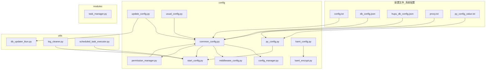
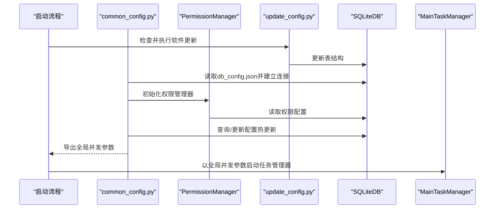
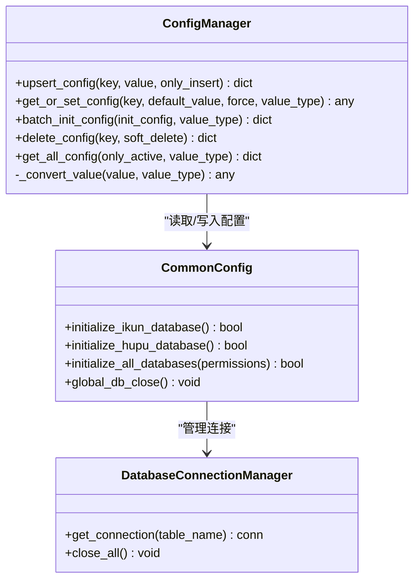
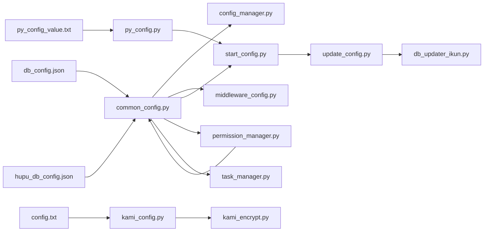

# 系统配置

<cite>
**本文引用的文件**
- [config.txt](file://配置文件_系统配置/config.txt)
- [db_config.json](file://配置文件_系统配置/db_config.json)
- [hupu_db_config.json](file://配置文件_系统配置/hupu_db_config.json)
- [proxy.txt](file://配置文件_系统配置/proxy.txt)
- [py_config_value.txt](file://配置文件_系统配置/py_config_value.txt)
- [common_config.py](file://config/common_config.py)
- [config_manager.py](file://modules/config_manager.py)
- [middleware_config.py](file://config/middleware_config.py)
- [start_config.py](file://config/start_config.py)
- [update_config.py](file://config/update_config.py)
- [usual_config.py](file://config/usual_config.py)
- [task_manager.py](file://modules/task_manager.py)
- [py_config.py](file://config/py_config.py)
- [kami_config.py](file://config/kami_config.py)
- [kami_encrypt.py](file://config/kami_encrypt.py)
- [permission_manager.py](file://config/permission_manager.py)
- [db_updater_ikun.py](file://utils/db_updater_ikun.py)
</cite>

## 更新摘要
**所做变更**
- 更新版本号配置，从 v20260327 升级到 v20260403
- 新增应用启动时的版本号一致性检查机制
- 增强权限管理系统，支持动态权限配置
- 完善数据库表结构自动更新功能
- 优化启动配置流程和错误处理机制

## 目录
1. [简介](#简介)
2. [项目结构与配置文件分布](#项目结构与配置文件分布)
3. [核心配置组件](#核心配置组件)
4. [架构总览](#架构总览)
5. [详细组件解析](#详细组件解析)
6. [依赖关系分析](#依赖关系分析)
7. [性能与并发配置要点](#性能与并发配置要点)
8. [配置加载顺序与优先级](#配置加载顺序与优先级)
9. [配置验证与错误处理](#配置验证与错误处理)
10. [常见问题排查](#常见问题排查)
11. [结论](#结论)

## 简介
本文件面向"ikun_temu_system"项目的系统配置，系统性梳理配置文件结构、加载流程、并发与全局参数、类型转换与持久化策略、验证与错误处理机制，并提供编辑指南、最佳实践与排障建议。读者无需深入编程背景，亦可据此完成配置的正确编辑与运维。

**更新** 本次更新反映了版本号从 v20260327 到 v20260403 的升级，以及应用启动配置的增强功能。

## 项目结构与配置文件分布
系统配置主要分布在以下位置：
- 配置文件_系统配置：集中存放数据库、代理、Python运行时参数等
- config：配置加载与导出模块
- modules：任务调度与并发控制模块
- utils：数据库初始化与升级工具
- api：代理服务（与配置联动）

**图表来源**
- [config.txt](file://配置文件_系统配置/config.txt)
- [db_config.json](file://配置文件_系统配置/db_config.json)
- [hupu_db_config.json](file://配置文件_系统配置/hupu_db_config.json)
- [proxy.txt](file://配置文件_系统配置/proxy.txt)
- [py_config_value.txt](file://配置文件_系统配置/py_config_value.txt)
- [common_config.py](file://config/common_config.py)
- [config_manager.py](file://modules/config_manager.py)
- [middleware_config.py](file://config/middleware_config.py)
- [start_config.py](file://config/start_config.py)
- [update_config.py](file://config/update_config.py)
- [usual_config.py](file://config/usual_config.py)
- [task_manager.py](file://modules/task_manager.py)
- [py_config.py](file://config/py_config.py)
- [kami_config.py](file://config/kami_config.py)
- [kami_encrypt.py](file://config/kami_encrypt.py)
- [permission_manager.py](file://config/permission_manager.py)
- [db_updater_ikun.py](file://utils/db_updater_ikun.py)

**章节来源**
- [common_config.py](file://config/common_config.py)
- [py_config.py](file://config/py_config.py)

## 核心配置组件
- 数据库配置（SQLite/SQLAlchemy风格）
  - 主库与虎扑库分别配置，支持连接池、WAL模式、外键启用、缓存大小、同步级别等
  - 默认路径与超时、线程安全策略、连接池参数均可调整
- 并发与全局参数
  - 全局最大并发、各任务类型并发、任务并发字典、实拍图校验规则路径、核价Excel路径等
  - 通过配置中心读取并热更新，保证运行期即时生效
- 代理与网络
  - 代理文件路径、API代理端口、本地代理服务端口与URL
- 卡密与加密
  - 卡密配置文件、加密/解密、卡密校验、解绑令牌
- 权限管理
  - 动态权限配置、权限验证、权限持久化
- 版本控制
  - 版本号管理、版本一致性检查、自动更新机制

**章节来源**
- [db_config.json](file://配置文件_系统配置/db_config.json)
- [hupu_db_config.json](file://配置文件_系统配置/hupu_db_config.json)
- [common_config.py](file://config/common_config.py)
- [config_manager.py](file://modules/config_manager.py)
- [py_config.py](file://config/py_config.py)
- [kami_config.py](file://config/kami_config.py)
- [kami_encrypt.py](file://config/kami_encrypt.py)
- [start_config.py](file://config/start_config.py)
- [permission_manager.py](file://config/permission_manager.py)

## 架构总览
系统配置由"文件配置 + 配置管理器 + 运行时参数"三层构成：
- 文件配置：以JSON/文本形式存储，描述数据库、代理、路径等
- 配置管理器：负责读取、类型转换、持久化、批量初始化、软删除、全量导出
- 运行时参数：在应用启动时从配置中心读取，注入到全局变量与任务管理器

**更新** 新增权限管理和版本控制机制，增强了系统的安全性和可维护性。

**图表来源**
- [common_config.py](file://config/common_config.py)
- [config_manager.py](file://modules/config_manager.py)
- [start_config.py](file://config/start_config.py)
- [permission_manager.py](file://config/permission_manager.py)
- [update_config.py](file://config/update_config.py)

## 详细组件解析

### 数据库配置（db_config.json 与 hupu_db_config.json）
- 关键字段
  - db_path：数据库文件绝对或相对路径
  - timeout：连接超时（秒）
  - check_same_thread：是否允许跨线程使用（SQLite默认True）
  - enable_foreign_keys：启用外键约束
  - journal_mode：WAL模式提升并发写入能力
  - cache_size：缓存大小（负值表示以KB为单位）
  - synchronous：同步级别（影响一致性与性能）
  - pool_config：连接池参数
    - max_connections/min_connections：最大/最小连接数
    - connection_timeout/idle_timeout：连接超时与空闲超时
    - pool_recycle：连接回收周期
    - pool_pre_ping：连接复用前健康检查
  - debug：调试开关
- 默认行为
  - 若配置文件缺失，系统会自动生成默认配置文件
  - 主库与虎扑库分别初始化，表结构通过升级脚本创建
- 影响范围
  - 影响所有依赖SQLiteDB的模块，包括任务表、定时任务表、配置表等

**章节来源**
- [db_config.json](file://配置文件_系统配置/db_config.json)
- [hupu_db_config.json](file://配置文件_系统配置/hupu_db_config.json)
- [common_config.py](file://config/common_config.py)

### 并发与全局参数（common_config.py + config_manager.py）
- 全局并发
  - max_concurrent_tasks：全局最大并发（默认800）
- 任务类型并发
  - modify_price_concurrent、upload_real_pic_concurrent、jit_govern_concurrent、hupu_*系列并发等
- 任务并发字典
  - task_concurrent_config：按任务名称映射并发数，default为兜底
- 路径参数
  - upload_pic_check_rules_path：实拍图校验规则JSON路径
  - modify_price_excels_path：核价Excel配置表目录
- 配置管理器能力
  - get_or_set_config：读取或自动创建并设置默认值，支持类型转换
  - upsert_config：智能插入/更新，支持仅新增
  - batch_init_config：批量初始化（仅新增）
  - delete_config：软删除（默认）
  - get_all_config：全量导出（用于备份/核对）
- 类型转换
  - 支持str/int/float/bool/list/dict/tuple，失败回退默认值

**图表来源**
- [config_manager.py](file://modules/config_manager.py)
- [common_config.py](file://config/common_config.py)

**章节来源**
- [common_config.py](file://config/common_config.py)
- [config_manager.py](file://modules/config_manager.py)

### 代理与网络配置（py_config.py + py_config_value.txt + proxy.txt）
- 配置来源
  - py_config_value.txt：定义路径与端口键值
  - py_config.py：动态读取键值并生成API代理URL
  - proxy.txt：代理地址（SOCKS5）
- 关键参数
  - api_proxy_port：API代理端口
  - proxy_file_path/api_proxy_file_path：代理文件路径
  - api_proxy_url：基于端口生成的本地代理地址
  - current_version：当前版本号（v20260403）
- 使用场景
  - 代理服务启动与端口占用检测
  - 任务执行中的网络代理选择

**更新** 新增版本号管理功能，用于版本控制和一致性检查。

**章节来源**
- [py_config.py](file://config/py_config.py)
- [py_config_value.txt](file://配置文件_系统配置/py_config_value.txt)
- [proxy.txt](file://配置文件_系统配置/proxy.txt)

### 卡密与加密配置（kami_config.py + kami_encrypt.py）
- 卡密配置文件
  - config.txt：存储kami字段
  - kami_config.py：提供读写接口，自动创建默认文件
- 加密工具
  - kami_encrypt.py：基于AES-CBC的加密/解密，卡密派生密钥，支持令牌生成与校验
  - KamiConfigManager：封装加密配置的保存与加载
- 安全要点
  - 卡密错误会导致解密失败
  - 解绑令牌带时间戳与有效期

**章节来源**
- [config.txt](file://配置文件_系统配置/config.txt)
- [kami_config.py](file://config/kami_config.py)
- [kami_encrypt.py](file://config/kami_encrypt.py)

### 权限管理（permission_manager.py）
- 权限存储
  - 权限列表存储在数据库config表中
  - 支持权限的保存、读取、更新和清除
- 权限验证
  - 动态权限检查，支持多种任务类型的权限验证
  - 权限与任务类型的映射关系管理
- 权限持久化
  - 权限状态持久化到数据库
  - 支持权限的生命周期管理

**新增** 权限管理系统是本次更新的重要新功能，提供了细粒度的权限控制能力。

**章节来源**
- [permission_manager.py](file://config/permission_manager.py)

### 版本控制与软件更新（update_config.py + py_config.py）
- 版本号管理
  - current_version：硬编码的当前版本号（v20260403）
  - generate_version_number：自动生成日期版本号
- 软件更新机制
  - 表结构自动更新：shops表和task表的结构升级
  - 初始化锁机制：防止重复初始化
- 启动时检查
  - 版本号一致性检查
  - 生产环境版本号警告机制

**更新** 新增版本控制和软件更新功能，增强了系统的可维护性和向后兼容性。

**章节来源**
- [update_config.py](file://config/update_config.py)
- [py_config.py](file://config/py_config.py)

### 启动与异常处理（start_config.py + main.py）
- 启动流程
  - 读取全局并发参数，初始化主任务管理器
  - 启动全局异常钩子，捕获未处理异常
  - 版本号检查和软件更新
- 异常处理
  - 安全关闭数据库并合并WAL
  - 读取max_error_logs配置，限制error.log条目数量
  - 超限时进行日志轮转（保留最近20%）
- 后台服务
  - 日志清理执行器启动
  - 定时任务执行器管理

**更新** 启动流程增加了版本检查和软件更新步骤，提高了系统的自动化程度。

**章节来源**
- [start_config.py](file://config/start_config.py)
- [main.py](file://main.py)

### 任务分发与并发控制（task_manager.py）
- 进程/线程模型
  - 多进程 + 每进程高并发线程，进程间通过队列通信
  - 子进程内部持有被动模式的任务日志管理器实例
- 分配策略
  - 主进程轮询数据库获取待处理任务，按子进程负载最低策略投递
  - 队列容量限制，避免阻塞
- 关键参数
  - PROCESS_NUM：进程数
  - THREAD_PER_PROC：单进程最大线程数（对应全局并发）
  - DB_POLL_INTERVAL：主进程轮询间隔
  - SINGLE_GET_TASK_LIMIT：单次拉取任务上限

**章节来源**
- [task_manager.py](file://modules/task_manager.py)

## 依赖关系分析
- 配置文件到运行时
  - db_config.json → common_config.initialize_ikun_database → SQLiteDB → config_manager
  - hupu_db_config.json → common_config.initialize_hupu_database → SQLiteDB
  - py_config_value.txt → py_config.py → config_value → start_config.py
  - config.txt → kami_config.py → kami_encrypt.py
- 模块耦合
  - common_config.py 为核心枢纽，导出全局并发与配置管理器
  - middleware_config.py 仅导出变量，避免循环导入
  - task_manager.py 依赖 common_config 的全局并发参数
  - permission_manager.py 依赖 common_config 的数据库连接
  - update_config.py 依赖 db_updater_ikun.py 进行表结构更新

**更新** 新增权限管理和软件更新模块的依赖关系。

**图表来源**
- [db_config.json](file://配置文件_系统配置/db_config.json)
- [hupu_db_config.json](file://配置文件_系统配置/hupu_db_config.json)
- [py_config_value.txt](file://配置文件_系统配置/py_config_value.txt)
- [config.txt](file://配置文件_系统配置/config.txt)
- [common_config.py](file://config/common_config.py)
- [config_manager.py](file://modules/config_manager.py)
- [middleware_config.py](file://config/middleware_config.py)
- [start_config.py](file://config/start_config.py)
- [py_config.py](file://config/py_config.py)
- [kami_config.py](file://config/kami_config.py)
- [kami_encrypt.py](file://config/kami_encrypt.py)
- [task_manager.py](file://modules/task_manager.py)
- [permission_manager.py](file://config/permission_manager.py)
- [update_config.py](file://config/update_config.py)
- [db_updater_ikun.py](file://utils/db_updater_ikun.py)

## 性能与并发配置要点
- 数据库性能
  - WAL模式提升写入吞吐；合理设置cache_size与synchronous平衡性能与可靠性
  - 连接池参数应结合CPU核数与任务特征调优，避免过大导致内存压力
- 并发控制
  - 全局并发与任务类型并发需与数据库连接池匹配，避免连接不足或过度竞争
  - 任务分发策略按子进程运行中任务数排序，尽量均衡负载
- 网络代理
  - 代理质量直接影响任务执行稳定性，建议使用稳定代理源并监控延迟
- 权限管理
  - 权限检查应在任务执行前进行，避免不必要的资源消耗
  - 权限配置应定期审查，确保最小权限原则

**更新** 新增权限管理对性能的影响分析。

## 配置加载顺序与优先级
- 启动阶段
  1) 读取db_config.json与hupu_db_config.json，初始化数据库
  2) 初始化配置管理器（ConfigManager）
  3) 从配置表读取并发与全局参数，生成全局并发字典
  4) 读取py_config_value.txt，生成API代理URL和版本号
  5) 读取config.txt，初始化卡密配置
  6) 检查并执行软件更新，更新表结构
  7) 初始化权限管理器，加载权限配置
  8) 启动主任务管理器（以全局并发参数为准）
- 运行期
  - 配置变更通过ConfigManager写入数据库，下次读取即刻生效（热更新）
  - 任务并发字典随配置变化而动态更新
  - 权限变更实时生效，无需重启

**更新** 启动流程增加了软件更新和权限管理的步骤。

**章节来源**
- [common_config.py](file://config/common_config.py)
- [config_manager.py](file://modules/config_manager.py)
- [py_config.py](file://config/py_config.py)
- [kami_config.py](file://config/kami_config.py)
- [start_config.py](file://config/start_config.py)
- [permission_manager.py](file://config/permission_manager.py)
- [update_config.py](file://config/update_config.py)

## 配置验证与错误处理
- 配置验证
  - JSON配置文件：db_config.json、hupu_db_config.json、config.txt
  - 文本配置文件：py_config_value.txt、proxy.txt
  - 配置管理器：类型转换失败回退默认值；批量初始化返回成功/失败统计
- 错误处理
  - 数据库初始化失败：安全关闭并记录异常
  - 代理端口占用：启动失败并提示端口冲突
  - 卡密错误：解密失败，验证失败
  - 权限验证失败：拒绝访问并记录日志
  - 版本号不一致：生产环境发出警告并阻止启动
  - 错误日志：限制条目数量并轮转，保留最近20%
- 版本控制
  - 启动时检查版本号一致性
  - 生产环境强制版本号检查
  - 自动表结构更新机制

**更新** 新增权限管理和版本控制的错误处理机制。

**章节来源**
- [common_config.py](file://config/common_config.py)
- [config_manager.py](file://modules/config_manager.py)
- [start_config.py](file://config/start_config.py)
- [kami_encrypt.py](file://config/kami_encrypt.py)
- [py_config.py](file://config/py_config.py)
- [permission_manager.py](file://config/permission_manager.py)
- [update_config.py](file://config/update_config.py)

## 常见问题排查
- 数据库无法连接/初始化失败
  - 检查db_config.json路径与权限，确认文件可读
  - 如缺失，系统会自动生成默认配置文件，再次启动
  - 关注WAL文件合并与连接池参数
- 并发过高导致数据库连接不足
  - 降低全局并发或增大连接池上限
  - 检查连接超时与空闲超时设置
- 代理服务启动失败
  - 确认api_proxy_port未被占用
  - 检查proxy.txt格式与有效性
- 卡密错误或解密失败
  - 核对config.txt中的kami字段
  - 使用卡密验证接口确认正确性
- 权限验证失败
  - 检查权限配置是否正确
  - 确认权限与任务类型的映射关系
  - 验证权限是否已正确保存到数据库
- 版本号不一致
  - 生产环境会发出警告并阻止启动
  - 检查config_value.current_version与generate_version_number()是否一致
  - 修改config.txt中的版本号配置
- 错误日志过多
  - 调整max_error_logs，或检查异常钩子是否频繁触发
- 软件更新失败
  - 检查数据库连接是否正常
  - 确认表结构更新权限
  - 查看更新日志获取详细错误信息

**更新** 新增权限管理和版本控制相关的故障排查指南。

**章节来源**
- [common_config.py](file://config/common_config.py)
- [config_manager.py](file://modules/config_manager.py)
- [start_config.py](file://config/start_config.py)
- [kami_encrypt.py](file://config/kami_encrypt.py)
- [py_config.py](file://config/py_config.py)
- [permission_manager.py](file://config/permission_manager.py)
- [update_config.py](file://config/update_config.py)

## 结论
本系统通过"文件配置 + 配置管理器 + 运行时参数"的分层设计，实现了数据库、并发、网络与安全等关键配置的集中管理与热更新。本次更新增强了版本控制、权限管理和软件自动更新能力，显著提升了系统的安全性、可维护性和可扩展性。

**更新** 版本号从 v20260327 升级到 v20260403，反映了系统的持续改进和功能增强。新的版本控制机制确保了生产环境的稳定性和一致性，而权限管理功能为多用户协作提供了安全保障。