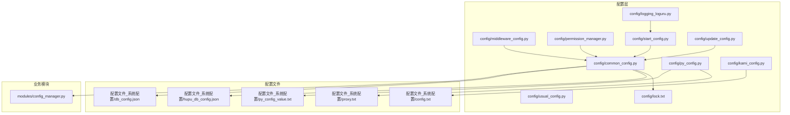
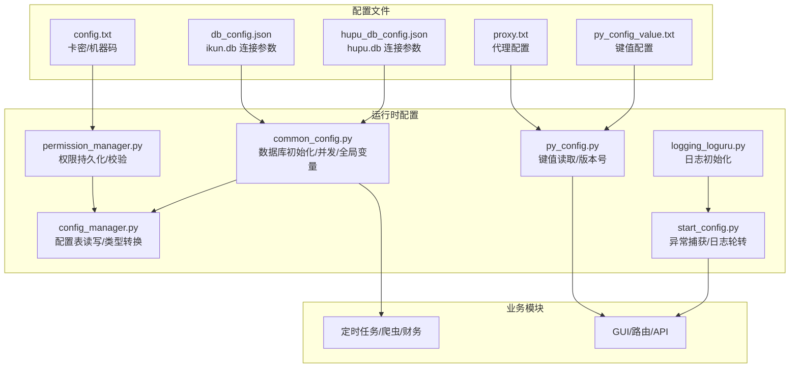
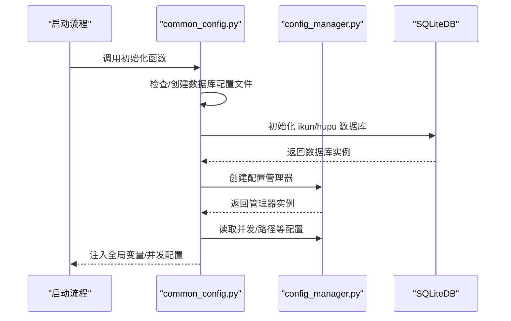
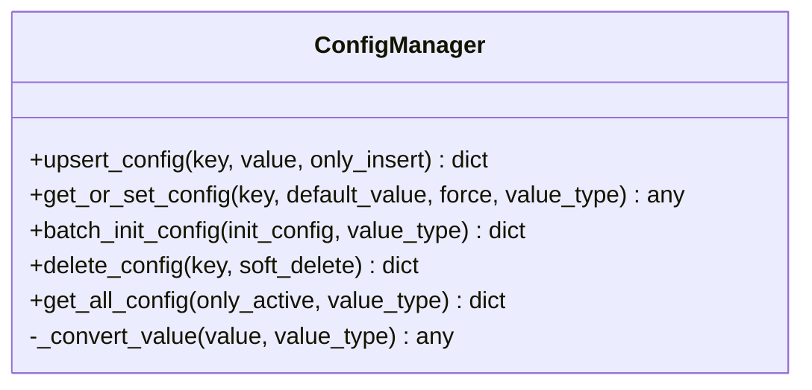
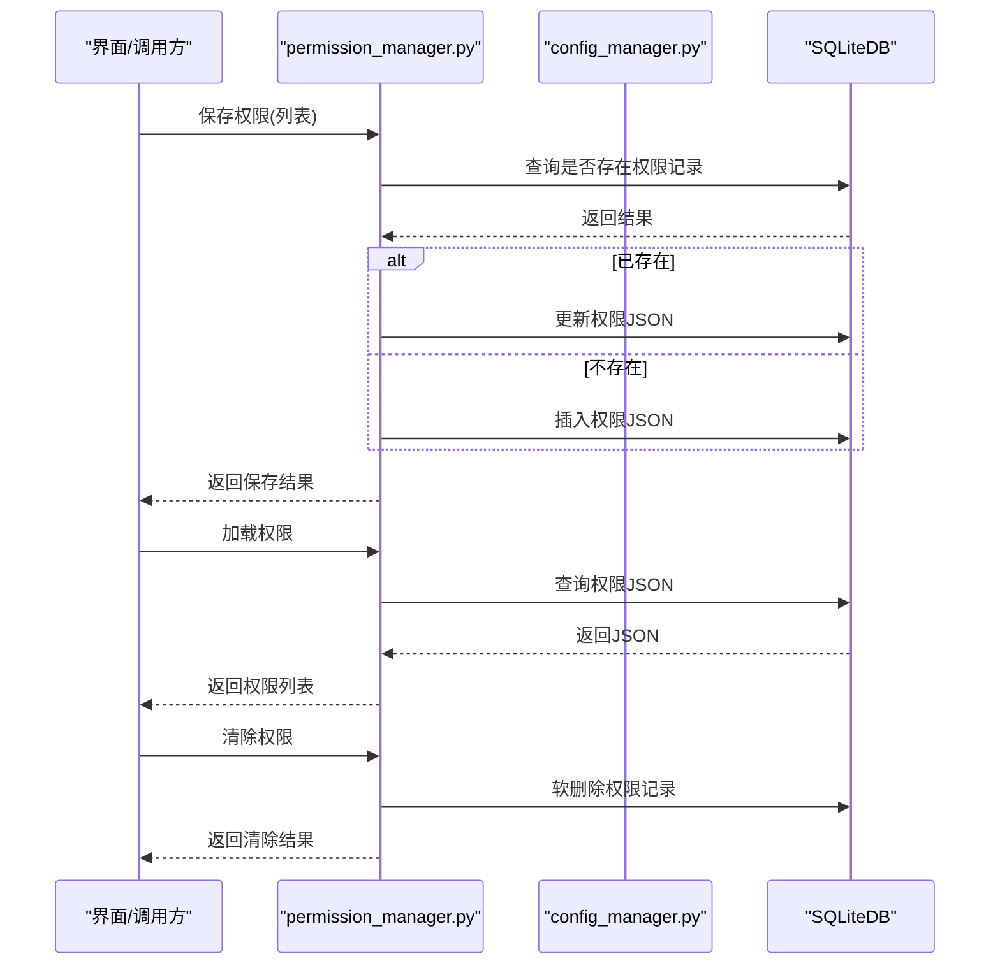
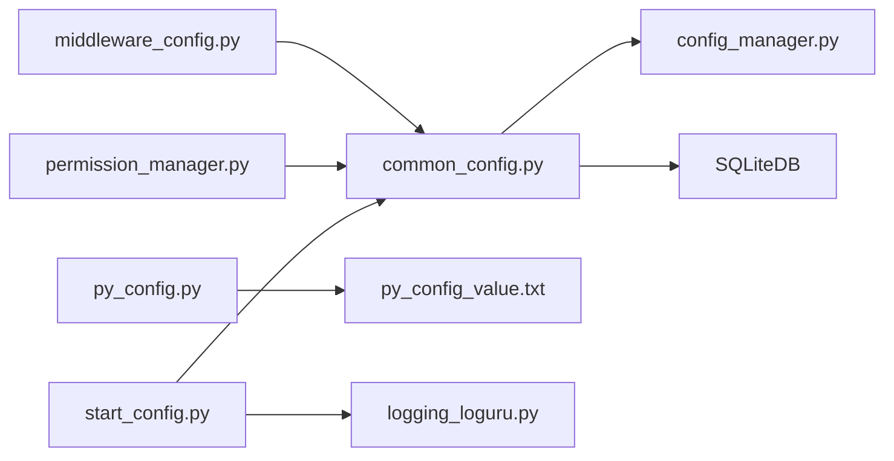

# 配置管理

<cite>
**本文档引用的文件**
- [common_config.py](file://config/common_config.py)
- [middleware_config.py](file://config/middleware_config.py)
- [py_config.py](file://config/py_config.py)
- [kami_config.py](file://config/kami_config.py)
- [permission_manager.py](file://config/permission_manager.py)
- [config_manager.py](file://modules/config_manager.py)
- [logging_loguru.py](file://config/logging_loguru.py)
- [start_config.py](file://config/start_config.py)
- [usual_config.py](file://config/usual_config.py)
- [config.txt](file://配置文件_系统配置/config.txt)
- [db_config.json](file://配置文件_系统配置/db_config.json)
- [hupu_db_config.json](file://配置文件_系统配置/hupu_db_config.json)
- [proxy.txt](file://配置文件_系统配置/proxy.txt)
- [py_config_value.txt](file://配置文件_系统配置/py_config_value.txt)
- [lock.txt](file://config/lock.txt)
- [update_config.py](file://config/update_config.py)
</cite>

## 目录
1. [简介](#简介)
2. [项目结构](#项目结构)
3. [核心组件](#核心组件)
4. [架构总览](#架构总览)
5. [详细组件分析](#详细组件分析)
6. [依赖分析](#依赖分析)
7. [性能考虑](#性能考虑)
8. [故障排除指南](#故障排除指南)
9. [结论](#结论)
10. [附录](#附录)

## 简介
本文件系统性梳理 ikun_temu_system 的配置管理体系，涵盖系统配置、数据库配置、权限配置、日志配置与加载优先级，并提供权限管理机制说明、配置编辑指南与最佳实践、常见问题排查方案。文档面向开发者与运维人员，帮助快速理解与安全地维护配置。

## 项目结构
配置相关的核心位置与职责如下：
- config 目录：集中存放运行期配置与管理逻辑
  - common_config.py：数据库初始化、并发配置、全局变量注入、数据库连接管理器
  - middleware_config.py：导出全局配置变量，避免循环导入
  - py_config.py：从文本配置文件读取键值，提供服务端域名、版本号等
  - kami_config.py：卡密配置文件的读写封装
  - permission_manager.py：权限的持久化、读取与校验
  - logging_loguru.py：日志系统初始化与格式化
  - start_config.py：启动时的全局异常处理与错误日志轮转
  - usual_config.py：通用常量（如页面大小）
  - update_config.py：软件更新时的表结构升级触发
  - lock.txt：初始化锁文件
- modules 目录：核心业务配置管理器
  - config_manager.py：通用配置表读写、类型转换、批量初始化、软删除
- 配置文件_系统配置 目录：实际的配置文件
  - config.txt：卡密与机器码
  - db_config.json：ikun 主数据库连接参数
  - hupu_db_config.json：虎扑数据库连接参数
  - proxy.txt：代理配置（文本格式）
  - py_config_value.txt：Python侧键值配置（键=值）

图表来源
- [common_config.py:1-394](file://config/common_config.py#L1-L394)
- [middleware_config.py:1-13](file://config/middleware_config.py#L1-L13)
- [py_config.py:1-93](file://config/py_config.py#L1-L93)
- [kami_config.py:1-56](file://config/kami_config.py#L1-L56)
- [permission_manager.py:1-126](file://config/permission_manager.py#L1-L126)
- [config_manager.py:1-344](file://modules/config_manager.py#L1-L344)
- [logging_loguru.py:1-131](file://config/logging_loguru.py#L1-L131)
- [start_config.py:1-161](file://config/start_config.py#L1-L161)
- [usual_config.py:1-1](file://config/usual_config.py#L1-L1)
- [update_config.py:1-23](file://config/update_config.py#L1-L23)
- [config.txt:1-4](file://配置文件_系统配置/config.txt#L1-L4)
- [db_config.json:1-19](file://配置文件_系统配置/db_config.json#L1-L19)
- [hupu_db_config.json:1-18](file://配置文件_系统配置/hupu_db_config.json#L1-L18)
- [proxy.txt](file://配置文件_系统配置/proxy.txt)
- [py_config_value.txt](file://配置文件_系统配置/py_config_value.txt)

章节来源
- [common_config.py:1-394](file://config/common_config.py#L1-L394)
- [middleware_config.py:1-13](file://config/middleware_config.py#L1-L13)
- [py_config.py:1-93](file://config/py_config.py#L1-L93)
- [kami_config.py:1-56](file://config/kami_config.py#L1-L56)
- [permission_manager.py:1-126](file://config/permission_manager.py#L1-L126)
- [config_manager.py:1-344](file://modules/config_manager.py#L1-L344)
- [logging_loguru.py:1-131](file://config/logging_loguru.py#L1-L131)
- [start_config.py:1-161](file://config/start_config.py#L1-L161)
- [usual_config.py:1-1](file://config/usual_config.py#L1-L1)
- [update_config.py:1-23](file://config/update_config.py#L1-L23)
- [config.txt:1-4](file://配置文件_系统配置/config.txt#L1-L4)
- [db_config.json:1-19](file://配置文件_系统配置/db_config.json#L1-L19)
- [hupu_db_config.json:1-18](file://配置文件_系统配置/hupu_db_config.json#L1-L18)
- [proxy.txt](file://配置文件_系统配置/proxy.txt)
- [py_config_value.txt](file://配置文件_系统配置/py_config_value.txt)

## 核心组件
- 数据库连接与初始化
  - 通过数据库连接管理器按表名路由到主库或虎扑库；提供安全关闭与 WAL 合并流程，降低文件损坏风险。
  - 默认初始化 ikun 与 hupu 两套数据库，支持按权限选择性初始化。
- 配置管理器（ConfigManager）
  - 提供键值读取/写入、类型自动转换（str/int/float/bool/list/dict/tuple）、批量初始化、软删除、全量查询。
  - 与 SQLiteDB 配合，实现“热更新”：修改后立即生效。
- 权限管理器（PermissionManager）
  - 将权限序列化为 JSON 存储于配置表，提供保存、加载、清除与权限校验。
- 卡密配置（KamiConfig）
  - 以 JSON 文件形式保存卡密与机器码，提供读取与写入接口。
- Python 配置（py_config）
  - 从文本配置文件读取键值，构造 API 地址、版本号等运行期参数。
- 日志与启动配置
  - 初始化彩色日志，统一异常捕获与错误日志轮转策略。

章节来源
- [common_config.py:15-394](file://config/common_config.py#L15-L394)
- [config_manager.py:6-282](file://modules/config_manager.py#L6-L282)
- [permission_manager.py:12-126](file://config/permission_manager.py#L12-L126)
- [kami_config.py:6-56](file://config/kami_config.py#L6-L56)
- [py_config.py:4-85](file://config/py_config.py#L4-L85)
- [logging_loguru.py:83-120](file://config/logging_loguru.py#L83-L120)
- [start_config.py:27-154](file://config/start_config.py#L27-L154)

## 架构总览
配置体系由“配置文件 + 运行时配置管理器 + 业务模块”三层构成。配置文件负责持久化，运行时通过管理器读取并转换类型，业务模块按需使用。

图表来源
- [common_config.py:15-394](file://config/common_config.py#L15-L394)
- [config_manager.py:6-282](file://modules/config_manager.py#L6-L282)
- [permission_manager.py:12-126](file://config/permission_manager.py#L12-L126)
- [py_config.py:4-85](file://config/py_config.py#L4-L85)
- [logging_loguru.py:83-120](file://config/logging_loguru.py#L83-L120)
- [start_config.py:27-154](file://config/start_config.py#L27-L154)
- [config.txt:1-4](file://配置文件_系统配置/config.txt#L1-L4)
- [db_config.json:1-19](file://配置文件_系统配置/db_config.json#L1-L19)
- [hupu_db_config.json:1-18](file://配置文件_系统配置/hupu_db_config.json#L1-L18)
- [proxy.txt](file://配置文件_系统配置/proxy.txt)
- [py_config_value.txt](file://配置文件_系统配置/py_config_value.txt)

## 详细组件分析

### 数据库配置与初始化
- 配置文件
  - db_config.json：ikun.db 连接参数，包含路径、超时、线程校验、外键、WAL、缓存、同步级别、连接池参数与调试开关。
  - hupu_db_config.json：虎扑数据库连接参数，结构与上类似。
- 初始化流程
  - 若配置文件不存在则自动创建默认模板；随后通过 SQLiteDB 初始化数据库实例，并建立配置管理器。
  - 支持按权限初始化 ikun/hupu 数据库与表结构，最后写入初始化锁文件。
- 并发与全局变量
  - 从配置表读取并发参数，构建任务并发字典，供各模块使用。
  - 提供数据库安全关闭与 WAL 检查点，降低文件损坏风险。

图表来源
- [common_config.py:197-334](file://config/common_config.py#L197-L334)
- [config_manager.py:14-190](file://modules/config_manager.py#L14-L190)

章节来源
- [common_config.py:157-334](file://config/common_config.py#L157-L334)
- [db_config.json:1-19](file://配置文件_系统配置/db_config.json#L1-L19)
- [hupu_db_config.json:1-18](file://配置文件_系统配置/hupu_db_config.json#L1-L18)

### 配置管理器（ConfigManager）
- 功能要点
  - upsert_config：智能插入/更新，支持仅新增模式。
  - get_or_set_config：不存在则自动创建并返回指定类型的值。
  - 类型转换：支持字符串、整数、浮点、布尔、列表、字典、元组。
  - 批量初始化：适合启动阶段一次性写入基础配置。
  - 软删除：默认软删除，便于审计与回滚。
  - 全量查询：用于核对与备份。
- 使用建议
  - 对于需要热更新的配置，优先使用 get_or_set_config 并指定 value_type。
  - 批量初始化使用 batch_init_config，配合 only_insert=true 避免覆盖已有值。

图表来源
- [config_manager.py:6-282](file://modules/config_manager.py#L6-L282)

章节来源
- [config_manager.py:21-282](file://modules/config_manager.py#L21-L282)

### 权限管理机制
- 权限存储
  - 权限以 JSON 字符串形式存储在配置表的 key='permissions' 中。
- 权限操作
  - 保存：支持更新或插入，带时间戳。
  - 加载：从数据库读取并反序列化。
  - 清除：软删除权限记录。
  - 校验：结合任务权限配置进行校验。
- 卡密与机器码
  - 卡密配置文件包含卡密与机器码，用于授权与绑定。

图表来源
- [permission_manager.py:16-104](file://config/permission_manager.py#L16-L104)
- [kami_config.py:38-54](file://config/kami_config.py#L38-L54)

章节来源
- [permission_manager.py:12-126](file://config/permission_manager.py#L12-L126)
- [kami_config.py:6-56](file://config/kami_config.py#L6-L56)
- [config.txt:1-4](file://配置文件_系统配置/config.txt#L1-L4)

### Python 运行时配置（py_config）
- 从 py_config_value.txt 读取键值，构造 API 地址、版本号等。
- 提供版本号生成辅助函数，按日期生成版本号。

章节来源
- [py_config.py:32-85](file://config/py_config.py#L32-L85)
- [py_config_value.txt](file://配置文件_系统配置/py_config_value.txt)

### 日志与启动配置
- 日志初始化
  - 提供与 loguru 风格一致的彩色格式化器，支持控制台与文件输出。
- 启动异常处理
  - 全局异常钩子：在写入错误日志前安全关闭数据库并合并 WAL。
  - 错误日志轮转：按分隔符统计条数，超过阈值保留最近 20% 并重建日志文件。

章节来源
- [logging_loguru.py:83-120](file://config/logging_loguru.py#L83-L120)
- [start_config.py:27-154](file://config/start_config.py#L27-L154)

### 通用配置与更新
- 通用常量：页面大小等。
- 软件更新：检查锁文件，若不存在则创建并触发表结构更新。

章节来源
- [usual_config.py:1-1](file://config/usual_config.py#L1-L1)
- [update_config.py:7-23](file://config/update_config.py#L7-L23)
- [lock.txt](file://config/lock.txt)

## 依赖分析
- 模块耦合
  - common_config 依赖 SQLiteDB 与 ConfigManager，负责数据库初始化与并发配置注入。
  - middleware_config 仅导出变量，避免循环导入。
  - permission_manager 依赖 common_config 的 db 实例与配置表。
  - py_config 依赖配置文件 py_config_value.txt。
  - logging_loguru 与 start_config 彼此独立，但共同服务于启动期日志与异常处理。
- 外部依赖
  - SQLite 数据库、loguru 日志框架、PyQt5 GUI 框架。

图表来源
- [common_config.py:15-394](file://config/common_config.py#L15-L394)
- [middleware_config.py:1-13](file://config/middleware_config.py#L1-L13)
- [permission_manager.py:12-126](file://config/permission_manager.py#L12-L126)
- [py_config.py:32-85](file://config/py_config.py#L32-L85)
- [start_config.py:27-154](file://config/start_config.py#L27-L154)
- [logging_loguru.py:83-120](file://config/logging_loguru.py#L83-L120)

章节来源
- [common_config.py:15-394](file://config/common_config.py#L15-L394)
- [middleware_config.py:1-13](file://config/middleware_config.py#L1-L13)
- [permission_manager.py:12-126](file://config/permission_manager.py#L12-L126)
- [py_config.py:32-85](file://config/py_config.py#L32-L85)
- [start_config.py:27-154](file://config/start_config.py#L27-L154)
- [logging_loguru.py:83-120](file://config/logging_loguru.py#L83-L120)

## 性能考虑
- 数据库连接池
  - 连接池参数较大，适合高并发场景；可根据实际资源调整最小/最大连接数与超时。
- WAL 模式与检查点
  - WAL 模式提升并发读写性能；启动/异常处理阶段主动合并 WAL，减少碎片与锁竞争。
- 并发配置
  - 通过配置表动态调整各类任务并发度，避免硬编码导致的资源争用。
- 日志轮转
  - 启动时进行日志轮转，避免错误日志文件过大影响 IO。

章节来源
- [db_config.json:9-18](file://配置文件_系统配置/db_config.json#L9-L18)
- [common_config.py:82-130](file://config/common_config.py#L82-L130)
- [start_config.py:113-150](file://config/start_config.py#L113-L150)

## 故障排除指南
- 数据库无法初始化
  - 检查数据库配置文件是否存在且格式正确；确认路径可写；查看初始化日志。
  - 若为首次运行，确认初始化锁文件不存在或已删除后重启。
- 配置读取异常
  - 使用 get_or_set_config 指定 value_type；若转换失败，返回对应类型的默认值。
  - 使用 get_all_config 核对配置表状态。
- 权限相关问题
  - 确认权限记录已保存且未被软删除；必要时清除权限后重新保存。
  - 校验任务权限配置是否匹配。
- 日志与异常
  - 启动时检查 error.log 数量是否超过阈值，必要时清理或增大阈值。
  - 异常发生时确认数据库已安全关闭并合并 WAL。
- 卡密与机器码
  - 确认 config.txt 中卡密与机器码有效；避免多人共享导致冲突。

章节来源
- [common_config.py:197-334](file://config/common_config.py#L197-L334)
- [config_manager.py:154-189](file://modules/config_manager.py#L154-L189)
- [permission_manager.py:57-104](file://config/permission_manager.py#L57-L104)
- [start_config.py:109-150](file://config/start_config.py#L109-L150)
- [config.txt:1-4](file://配置文件_系统配置/config.txt#L1-L4)

## 结论
本配置体系以“配置文件 + 配置管理器 + 业务模块”分层设计，实现了数据库连接、权限、日志与运行参数的集中管理与热更新。通过严格的初始化流程、并发控制与日志轮转策略，保障了系统在复杂场景下的稳定性与可维护性。建议在生产环境遵循本文提供的编辑指南与最佳实践，定期备份配置与日志，确保变更可追溯。

## 附录

### 配置项清单与说明
- 数据库配置（db_config.json）
  - db_path：数据库文件路径
  - timeout：连接超时（秒）
  - check_same_thread：是否启用线程校验
  - enable_foreign_keys：是否启用外键约束
  - journal_mode：事务日志模式（如 WAL）
  - cache_size：缓存大小（KB）
  - synchronous：同步级别（如 NORMAL）
  - pool_config：连接池参数（最大/最小连接、超时、空闲超时、回收周期、预检）
  - debug：调试开关
- 数据库配置（hupu_db_config.json）
  - 结构同上，针对虎扑数据库
- Python 运行时配置（py_config_value.txt）
  - 采用“键=值”格式，示例：api_proxy_port、proxy_file_path、api_proxy_file_path 等
- 卡密配置（config.txt）
  - kami：卡密
  - machine_code：机器码
- 代理配置（proxy.txt）
  - 文本格式，用于网络代理设置

章节来源
- [db_config.json:1-19](file://配置文件_系统配置/db_config.json#L1-L19)
- [hupu_db_config.json:1-18](file://配置文件_系统配置/hupu_db_config.json#L1-L18)
- [py_config_value.txt](file://配置文件_系统配置/py_config_value.txt)
- [config.txt:1-4](file://配置文件_系统配置/config.txt#L1-L4)
- [proxy.txt](file://配置文件_系统配置/proxy.txt)

### 编辑指南与最佳实践
- 编辑配置文件
  - 修改前先备份原文件；修改 JSON 配置时注意缩进与逗号。
  - 文本配置文件按“键=值”格式书写，避免多余空格。
- 配置加载顺序与优先级
  - 启动时先检查/创建数据库配置文件，再初始化数据库与配置管理器。
  - 从配置表读取并发与路径等参数，覆盖默认值。
  - 卡密与权限从各自配置源读取，权限以配置表为准。
- 最佳实践
  - 使用 ConfigManager 的批量初始化与类型转换，避免硬编码。
  - 权限变更后及时校验，避免越权操作。
  - 定期检查日志轮转与错误日志数量，保持磁盘空间健康。
  - 首次部署时删除初始化锁文件并重启，触发初始化流程。

章节来源
- [common_config.py:197-334](file://config/common_config.py#L197-L334)
- [config_manager.py:191-230](file://modules/config_manager.py#L191-L230)
- [permission_manager.py:16-104](file://config/permission_manager.py#L16-L104)
- [start_config.py:109-154](file://config/start_config.py#L109-L154)