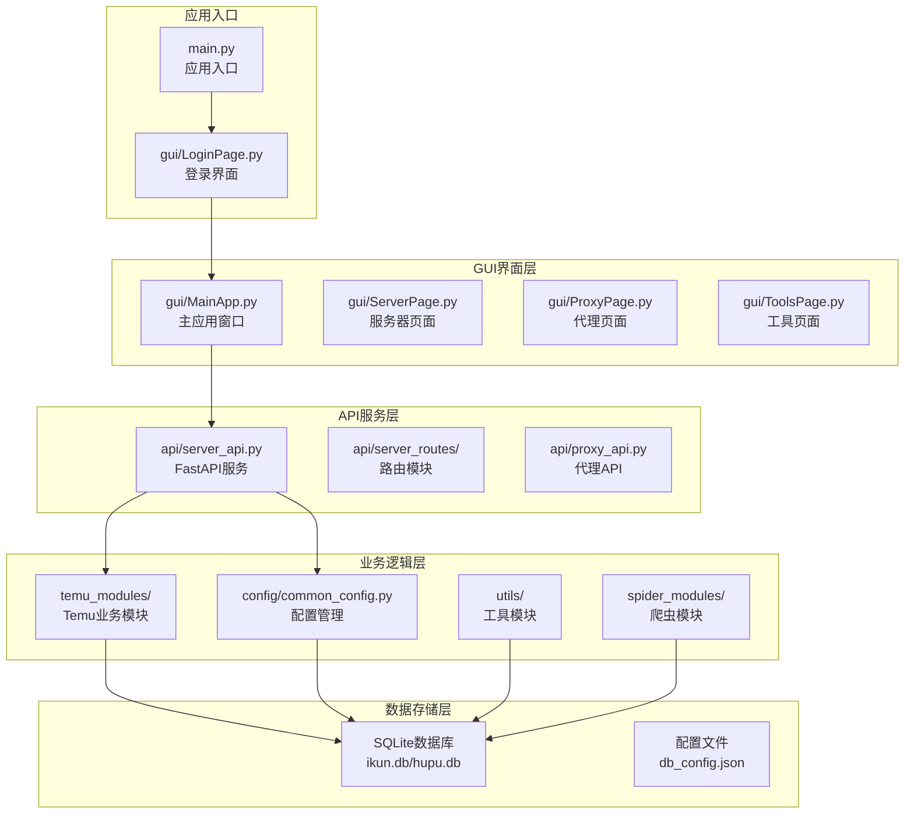
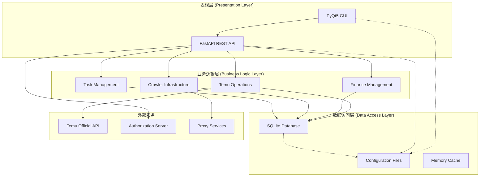
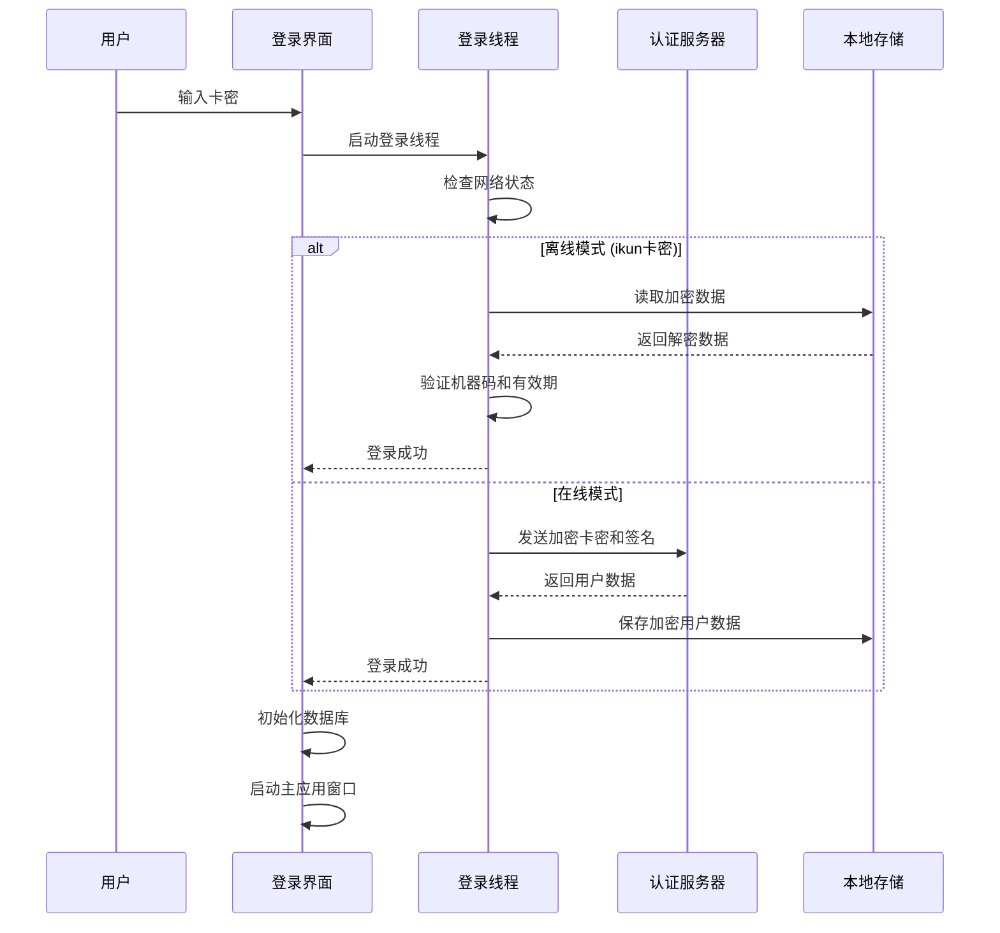
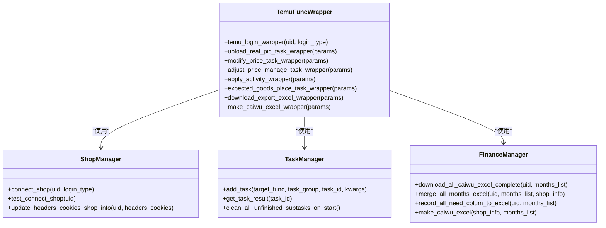
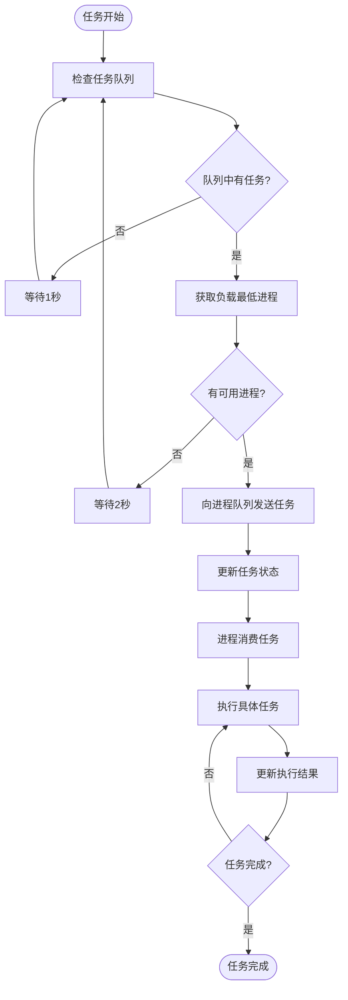
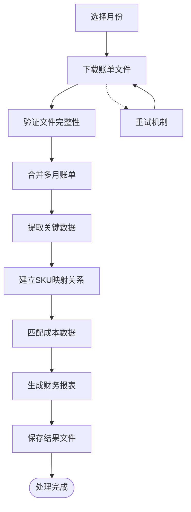
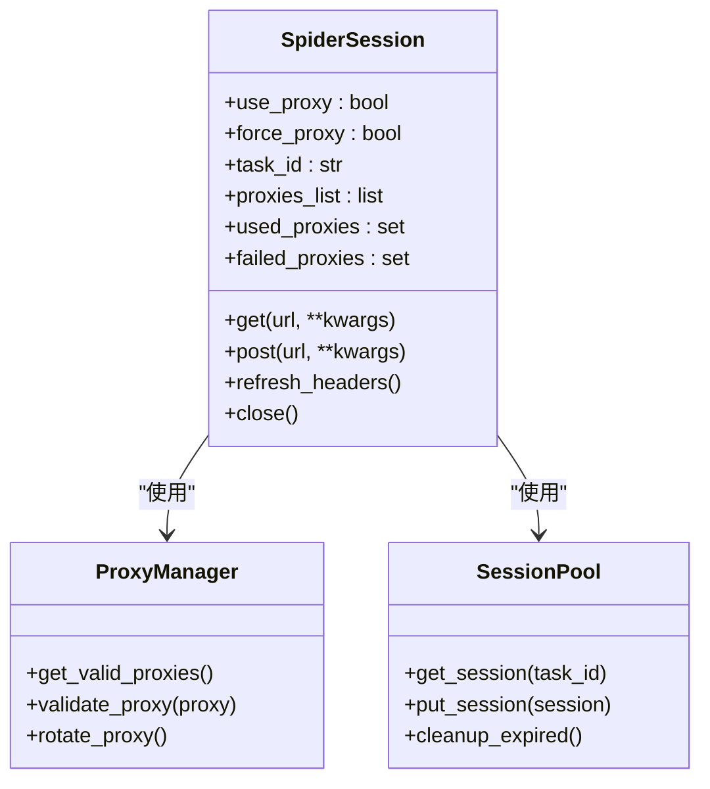
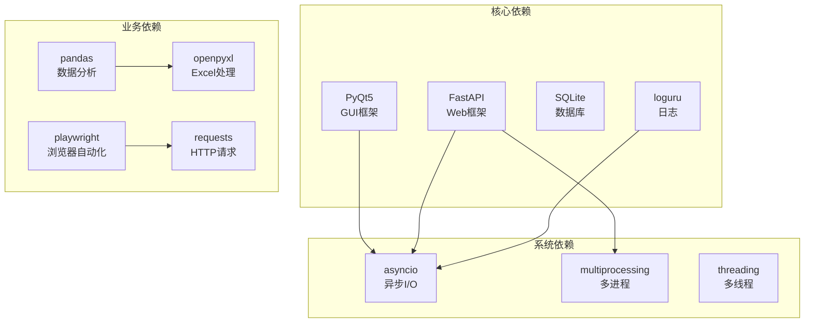

# 项目概述

<cite>
**本文档引用的文件**
- [main.py](file://main.py)
- [gui/MainApp.py](file://gui/MainApp.py)
- [api/server_api.py](file://api/server_api.py)
- [temu_modules/temu_func_wrapper.py](file://temu_modules/temu_func_wrapper.py)
- [modules/task_manager.py](file://modules/task_manager.py)
- [config/common_config.py](file://config/common_config.py)
- [utils/TemuBase.py](file://utils/TemuBase.py)
- [spider_modules/SpiderSession.py](file://spider_modules/SpiderSession.py)
- [temu_modules/temu_function/caiwu_func/caiwu_main.py](file://temu_modules/temu_function/caiwu_func/caiwu_main.py)
- [gui/LoginPage.py](file://gui/LoginPage.py)
</cite>

## 目录
1. [项目简介](#项目简介)
2. [项目结构](#项目结构)
3. [核心组件](#核心组件)
4. [架构概览](#架构概览)
5. [详细组件分析](#详细组件分析)
6. [依赖关系分析](#依赖关系分析)
7. [性能考虑](#性能考虑)
8. [故障排查指南](#故障排查指南)
9. [结论](#结论)

## 项目简介

ikun_temu_system 是一个基于 Python 开发的桌面应用程序，专注于为 Temu 电商运营提供自动化解决方案。该项目集成了以下核心能力：
- Temu 电商运营自动化：包括商品价格管理、活动报名、期望到货地点设置、上传实拍图等
- 财务管理：支持多月账单下载、合并、成本匹配、财务报表生成
- 数据爬取：提供代理管理、会话池、重试机制等爬虫基础设施
- 本地 API 服务：基于 FastAPI 的后端服务，支持多进程部署
- 图形用户界面：基于 PyQt5 的桌面应用，提供直观的操作体验

项目采用模块化设计，支持权限控制和插件化扩展，能够满足不同规模用户的运营需求。

## 项目结构

项目采用清晰的分层架构，主要目录结构如下：

**图表来源**
- [main.py:1-233](file://main.py#L1-L233)
- [gui/MainApp.py:179-800](file://gui/MainApp.py#L179-L800)
- [api/server_api.py:1-474](file://api/server_api.py#L1-L474)

**章节来源**
- [main.py:1-233](file://main.py#L1-L233)
- [gui/MainApp.py:179-800](file://gui/MainApp.py#L179-L800)
- [api/server_api.py:1-474](file://api/server_api.py#L1-L474)

## 核心组件

### 1. 应用入口与生命周期管理

项目入口位于 `main.py`，负责应用的整体初始化和生命周期管理：

- **全局异常处理**：统一捕获和记录异常，确保数据库安全关闭
- **权限系统**：支持多种权限模式（temu、caiwu、spider、ddos）
- **数据库初始化**：根据权限动态初始化相应的数据库
- **日志管理**：集成 loguru 日志框架，支持多级日志记录

### 2. 图形用户界面层

基于 PyQt5 构建的桌面应用，采用 MVC 模式设计：

- **主应用窗口**：`MainStartApp` 提供统一的界面框架
- **页面管理**：支持服务器、代理、工具等多页面切换
- **权限控制**：根据用户权限动态显示功能按钮
- **任务管理**：集成任务队列和状态监控

### 3. API 服务层

采用 FastAPI 构建的后端服务，支持高并发和多进程部署：

- **多进程架构**：支持多个工作进程并行处理
- **生命周期管理**：完善的启动、停止和重启机制
- **中间件支持**：CORS、版本控制等中间件
- **静态资源**：内置静态文件和模板支持

### 4. 业务逻辑层

涵盖 Temu 运营、财务管理、爬虫等核心业务：

- **Temu 业务模块**：价格管理、活动报名、实拍图上传等
- **财务管理系统**：账单下载、成本匹配、报表生成
- **爬虫基础设施**：代理管理、会话池、重试机制
- **任务调度**：基于线程池的任务管理和并发控制

**章节来源**
- [main.py:62-233](file://main.py#L62-L233)
- [gui/MainApp.py:179-800](file://gui/MainApp.py#L179-L800)
- [api/server_api.py:122-474](file://api/server_api.py#L122-L474)

## 架构概览

项目采用分层架构设计，实现了关注点分离和模块化组织：

**图表来源**
- [gui/MainApp.py:312-800](file://gui/MainApp.py#L312-L800)
- [api/server_api.py:60-104](file://api/server_api.py#L60-L104)
- [config/common_config.py:15-135](file://config/common_config.py#L15-L135)

### 技术栈特点

- **前端框架**：PyQt5 提供跨平台桌面应用开发能力
- **后端框架**：FastAPI 提供高性能的 API 服务
- **数据库**：SQLite 轻量级数据库，支持 WAL 模式
- **异步支持**：qasync 集成 asyncio 事件循环
- **配置管理**：JSON 配置文件 + 数据库存储

**章节来源**
- [gui/MainApp.py:179-800](file://gui/MainApp.py#L179-L800)
- [api/server_api.py:1-474](file://api/server_api.py#L1-L474)
- [config/common_config.py:197-334](file://config/common_config.py#L197-L334)

## 详细组件分析

### 登录认证系统

登录系统采用双模式认证机制：

**图表来源**
- [gui/LoginPage.py:24-186](file://gui/LoginPage.py#L24-L186)
- [gui/LoginPage.py:414-455](file://gui/LoginPage.py#L414-L455)

**章节来源**
- [gui/LoginPage.py:1-586](file://gui/LoginPage.py#L1-L586)

### Temu 业务封装层

Temu 业务封装层提供统一的业务接口：

**图表来源**
- [temu_modules/temu_func_wrapper.py:20-697](file://temu_modules/temu_func_wrapper.py#L20-L697)
- [utils/TemuBase.py:203-456](file://utils/TemuBase.py#L203-L456)

**章节来源**
- [temu_modules/temu_func_wrapper.py:1-697](file://temu_modules/temu_func_wrapper.py#L1-L697)
- [utils/TemuBase.py:1-656](file://utils/TemuBase.py#L1-L656)

### 任务管理系统

任务管理系统采用多进程 + 多线程架构：

**图表来源**
- [modules/task_manager.py:144-319](file://modules/task_manager.py#L144-L319)

**章节来源**
- [modules/task_manager.py:1-319](file://modules/task_manager.py#L1-L319)

### 财务管理系统

财务管理系统提供完整的账单处理流程：

**图表来源**
- [temu_modules/temu_function/caiwu_func/caiwu_main.py:472-615](file://temu_modules/temu_function/caiwu_func/caiwu_main.py#L472-L615)

**章节来源**
- [temu_modules/temu_function/caiwu_func/caiwu_main.py:1-940](file://temu_modules/temu_function/caiwu_func/caiwu_main.py#L1-L940)

### 爬虫基础设施

爬虫系统提供代理管理和会话池功能：

**图表来源**
- [spider_modules/SpiderSession.py:17-470](file://spider_modules/SpiderSession.py#L17-L470)

**章节来源**
- [spider_modules/SpiderSession.py:1-470](file://spider_modules/SpiderSession.py#L1-L470)

## 依赖关系分析

项目采用模块化设计，各组件之间的依赖关系清晰：

**图表来源**
- [main.py:1-18](file://main.py#L1-L18)
- [api/server_api.py:13-27](file://api/server_api.py#L13-L27)

**章节来源**
- [main.py:1-233](file://main.py#L1-L233)
- [api/server_api.py:1-474](file://api/server_api.py#L1-L474)

## 性能考虑

项目在设计时充分考虑了性能优化：

### 1. 并发架构
- **多进程部署**：FastAPI 服务支持多进程并行处理
- **线程池管理**：合理的线程池大小配置
- **异步I/O**：结合 asyncio 提升 I/O 密集型任务性能

### 2. 数据库优化
- **WAL 模式**：提升并发读写性能
- **连接池**：复用数据库连接减少开销
- **索引优化**：关键查询字段建立索引

### 3. 内存管理
- **垃圾回收**：及时清理临时对象
- **资源释放**：确保文件句柄、网络连接正确关闭
- **内存监控**：定期检查内存使用情况

### 4. 网络优化
- **代理池**：动态代理轮换机制
- **重试策略**：智能重试避免网络波动影响
- **超时控制**：合理设置请求超时时间

## 故障排查指南

### 常见问题及解决方案

#### 1. 登录失败
**症状**：登录界面显示"卡密无效"
**排查步骤**：
1. 检查网络连接状态
2. 验证卡密格式是否正确
3. 查看服务器状态
4. 检查本地加密文件

#### 2. 数据库连接异常
**症状**：应用启动时报数据库错误
**排查步骤**：
1. 检查数据库文件权限
2. 验证数据库配置文件
3. 确认 SQLite 版本兼容性
4. 查看 WAL 文件状态

#### 3. API 服务启动失败
**症状**：FastAPI 服务无法启动
**排查步骤**：
1. 检查端口占用情况
2. 验证进程权限
3. 查看日志文件
4. 确认依赖包安装

#### 4. 任务执行异常
**症状**：任务长时间无响应
**排查步骤**：
1. 检查任务队列状态
2. 验证进程健康状况
3. 查看任务日志
4. 监控系统资源使用

**章节来源**
- [gui/LoginPage.py:345-461](file://gui/LoginPage.py#L345-L461)
- [config/common_config.py:59-135](file://config/common_config.py#L59-L135)

## 结论

ikun_temu_system 是一个设计精良的桌面应用项目，具有以下显著特点：

### 技术优势
- **架构清晰**：采用分层架构，职责分离明确
- **扩展性强**：模块化设计支持功能扩展
- **性能优秀**：多进程 + 异步I/O 架构
- **用户体验好**：PyQt5 提供流畅的桌面应用体验

### 业务价值
- **自动化程度高**：大幅减少人工操作时间
- **准确性强**：完善的错误处理和数据验证
- **安全性好**：权限控制和数据加密机制
- **维护成本低**：清晰的代码结构和文档

### 适用场景
- 电商运营团队的日常管理工作
- 需要批量处理 Temu 账单的财务人员
- 需要自动化爬取数据的研究人员
- 希望学习 Python 桌面应用开发的开发者

该项目为初学者提供了良好的学习参考，展示了如何构建一个功能完整、性能优秀的桌面应用。通过合理的架构设计和模块化实现，项目既满足了实际业务需求，又保持了良好的可维护性和扩展性。