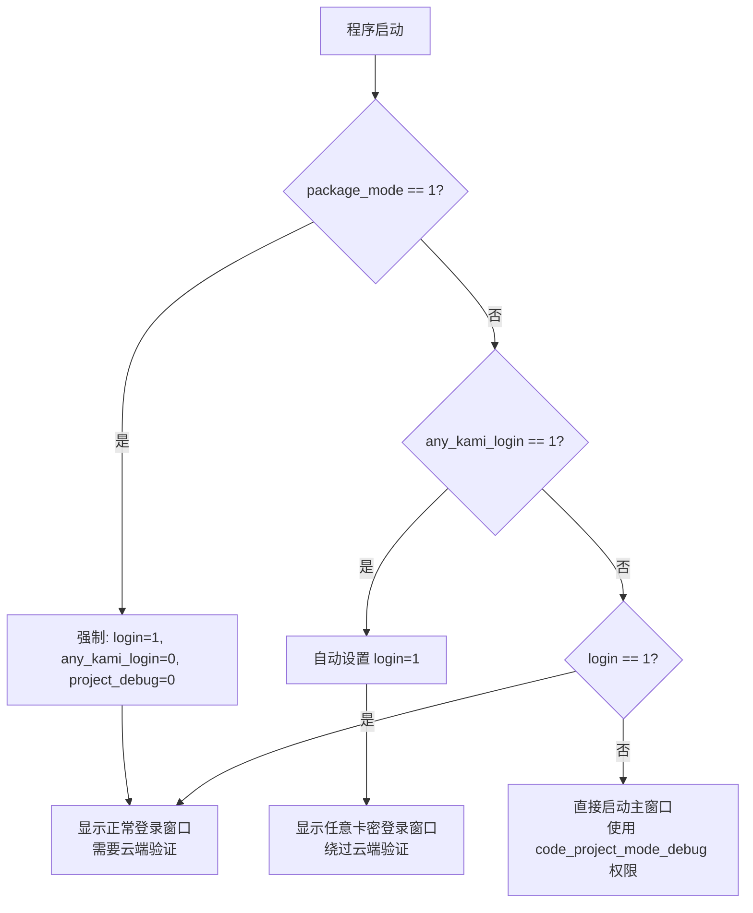

# 启动模式配置优先级与组合说明

## 配置项说明

在 `main.py` 中有 4 个核心配置项，控制程序的启动行为：

| 配置项 | 类型 | 默认值 | 说明 |
|--------|------|--------|------|
| `package_mode` | int (0/1) | 0 | 是否开启打包模式 |
| `login` | int (0/1) | 0 | 是否开启登录模式（需要云端验证） |
| `any_kami_login` | int (0/1) | 0 | 是否开启任意卡密登录模式（绕过云端验证） |
| `project_debug` | int (0/1) | 0 | 是否开启权限调试模式 |

### 辅助配置
- `code_project_mode_debug`: list - 调试模式下的权限列表，如 `["temu", "caiwu", "spider"]`

---

## 优先级规则

### 1️⃣ 最高优先级：打包模式 (`package_mode`)

当 `package_mode = 1` 时，**强制覆盖其他配置**：
```python
if package_mode:
    login = 1              # 强制开启登录
    project_debug = 0      # 强制关闭调试模式
    any_kami_login = 0     # 强制关闭任意卡密模式
```

**原因**：生产环境必须使用真实卡密登录，确保安全。

---

### 2️⃣ 次高优先级：任意卡密模式 (`any_kami_login`)

当 `any_kami_login = 1` 时：
```python
if any_kami_login:
    login = 1  # 自动启用登录模式（显示登录窗口）
```

**特点**：
- ✅ 显示登录窗口
- ✅ **完全绕过云端验证**
- ✅ 输入任意字符即可登录
- ✅ 权限由 `code_project_mode_debug` 决定
- ✅ 自动设置 9999 天有效期

---

### 3️⃣ 第三优先级：普通登录模式 (`login`)

当 `login = 1` 且 `any_kami_login = 0` 时：
- 显示登录窗口
- **需要真实的卡密进行云端验证**
- 验证通过后获取服务器返回的权限

---

### 4️⃣ 最低优先级：直接启动模式

当 `login = 0` 且 `any_kami_login = 0` 时：
- 跳过登录窗口
- 直接使用 `code_project_mode_debug` 配置的权限
- 适用于开发调试

---

## 判断流程



---

## 所有可能的组合

### 组合 1：打包生产环境 ⭐推荐
```python
package_mode = 1
login = X        # 会被强制设为 1
any_kami_login = X  # 会被强制设为 0
project_debug = X   # 会被强制设为 0
code_project_mode_debug = ["temu", "caiwu", "spider"]  # 不影响
```

**行为**：
- ✅ 显示正常登录窗口
- ✅ 需要真实卡密云端验证
- ✅ 关闭调试功能
- 🔒 **最安全的模式**

---

### 组合 2：任意卡密开发模式 🚀常用
```python
package_mode = 0
login = 1          # 可选 0 或 1，都会被 any_kami_login 覆盖
any_kami_login = 1
project_debug = 0  # 可选
code_project_mode_debug = ["temu", "caiwu", "spider"]
```

**行为**：
- ✅ 显示"IKUN 任意卡密登录"窗口
- ✅ 输入任意字符即可登录
- ✅ **完全绕过云端验证**
- ✅ 使用配置的权限列表
- 🎯 **最适合本地开发测试**

---

### 组合 3：普通登录模式（测试云端验证）
```python
package_mode = 0
login = 1
any_kami_login = 0
project_debug = 0
code_project_mode_debug = ["temu", "caiwu", "spider"]  # 不影响
```

**行为**：
- ✅ 显示正常登录窗口
- ✅ 需要真实卡密
- ✅ 进行云端验证
- 📡 **用于测试登录流程**

---

### 组合 4：直接启动模式（快速开发）⚡最快
```python
package_mode = 0
login = 0
any_kami_login = 0
project_debug = 1
code_project_mode_debug = ["temu", "caiwu", "spider"]
```

**行为**：
- ✅ 跳过登录窗口
- ✅ 直接启动主界面
- ✅ 使用配置的权限
- ⚡ **启动速度最快，适合频繁调试**

---

### 组合 5：任意卡密 + 调试模式 🔧高级开发
```python
package_mode = 0
login = 1          # 会被自动设为 1
any_kami_login = 1
project_debug = 1
code_project_mode_debug = ["temu", "caiwu", "spider"]
```

**行为**：
- ✅ 显示任意卡密登录窗口
- ✅ 绕过云端验证
- ✅ 开启调试功能
- ✅ 使用配置的权限
- 🔧 **开发调试的最佳组合**

---

### 组合 6：无效组合（被覆盖）
```python
package_mode = 1
login = 0          # ❌ 会被强制设为 1
any_kami_login = 1 # ❌ 会被强制设为 0
project_debug = 1  # ❌ 会被强制设为 0
```

**实际行为**：等同于**组合 1**（打包生产环境）

---

## 配置建议

### 📌 场景 1：本地开发调试
```python
package_mode = 0
login = 0
any_kami_login = 0
project_debug = 1
code_project_mode_debug = ["temu", "caiwu", "spider"]
```
**优点**：启动最快，无需任何登录操作

---

### 📌 场景 2：测试登录流程但不想联网
```python
package_mode = 0
login = 1
any_kami_login = 1
project_debug = 0
code_project_mode_debug = ["temu", "caiwu", "spider"]
```
**优点**：模拟登录流程，但绕过云端验证

---

### 📌 场景 3：测试完整登录链路
```python
package_mode = 0
login = 1
any_kami_login = 0
project_debug = 0
code_project_mode_debug = ["temu", "caiwu", "spider"]  # 不影响
```
**优点**：完整的云端验证流程

---

### 📌 场景 4：打包发布
```python
package_mode = 1
# 其他配置会自动被覆盖，无需关心
```
**优点**：最安全，强制云端验证

---

## 关键代码位置

### 1. 配置定义
文件：`main.py` 第 241-259 行
```python
package_mode = 0
login = 1
any_kami_login = 1
project_debug = 1
code_project_mode_debug = ["temu", "caiwu", "spider"]
```

### 2. 优先级处理
文件：`main.py` 第 73-81 行
```python
# 打包模式判断
if package_mode:
    login = 1
    project_debug = 0
    any_kami_login = 0

# 任意卡密模式下，自动启用登录模式
if any_kami_login:
    login = 1
```

### 3. 启动分支
文件：`main.py` 第 136-204 行
```python
with loop:
    if any_kami_login == 1:
        # 任意卡密登录（优先）
        login_window = LoginWindow(any_kami_mode=True, ...)
    elif login == 1:
        # 正常登录
        login_window = LoginWindow()
    else:
        # 直接启动
        window = MainStartApp(...)
```

### 4. 任意卡密登录处理
文件：`gui/LoginPage.py` 第 387-421 行
```python
def _handle_any_kami_login(self, kami):
    """处理任意卡密登录"""
    # 使用配置的权限列表
    code_project_mode = self.code_project_mode_debug
    
    # 设置 9999 天有效期
    user_data = {
        'start_time': start_time,
        'end_time': end_time,
        'kami': kami,
        'temu': 'True' if 'temu' in code_project_mode else 'False',
        ...
    }
    
    # 模拟登录成功（不调用网络）
    self.on_login_result(True, "任意卡密模式登录成功\n", user_data, {})
```

---

## 常见问题

### Q1: 为什么设置了 `any_kami_login = 1` 还是要联网？
**A**: 检查是否同时设置了 `package_mode = 1`，打包模式会强制关闭任意卡密功能。

### Q2: 任意卡密模式的权限从哪里来？
**A**: 完全来自 `code_project_mode_debug` 配置，与服务器无关。

### Q3: 可以同时开启 `login = 1` 和 `any_kami_login = 1` 吗？
**A**: 可以！`any_kami_login` 优先级更高，会覆盖 `login` 的行为。

### Q4: 如何快速切换不同模式？
**A**: 只需修改 `main.py` 顶部的 4 个配置项，注释掉不需要的组合即可。

### Q5: 任意卡密模式会影响数据库初始化吗？
**A**: 不会！登录后会正常初始化数据库，与普通登录流程一致。

---

## 总结

| 模式 | 启动速度 | 安全性 | 适用场景 |
|------|---------|--------|---------|
| 打包模式 | 慢 | 🔒🔒🔒🔒🔒 | 生产环境 |
| 普通登录 | 中 | 🔒🔒🔒🔒 | 测试云端验证 |
| 任意卡密 | 快 | 🔒🔒 | 本地开发 |
| 直接启动 | 最快 | 🔒 | 快速调试 |

**推荐开发流程**：
1. 日常开发 → 使用**组合 4**（直接启动）
2. 测试登录 → 使用**组合 2**（任意卡密）
3. 验证云端 → 使用**组合 3**（普通登录）
4. 打包发布 → 使用**组合 1**（打包模式）
